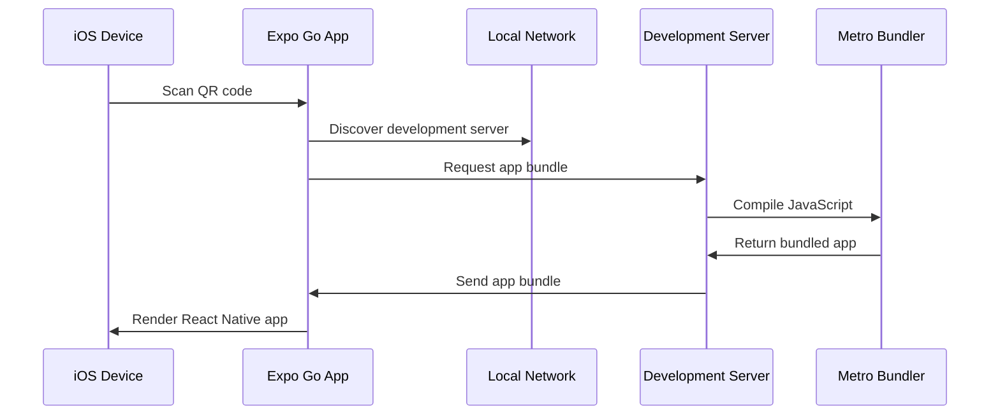

# Section 6: Running on Expo Go

While iOS Simulator provides an excellent development environment, testing on physical devices offers the most authentic user experience. Expo Go enables you to run your development builds on real iOS devices without the complex provisioning and deployment processes typically required for native iOS development.

## Introduction to Expo Go

Expo Go is a mobile application that serves as a universal client for running Expo projects during development. Think of it as a specialized browser for React Native applications built with Expo's managed workflow.

### Key benefits of testing on physical devices

Testing on real devices provides advantages that simulators cannot replicate:

- **Authentic performance**: Real device performance characteristics and limitations
- **Hardware features**: Access to actual camera, GPS, accelerometer, and other sensors
- **Touch interactions**: Natural multi-touch gestures and haptic feedback
- **Network conditions**: Real cellular and WiFi connectivity scenarios
- **Battery impact**: Understanding actual power consumption patterns
- **User context**: Testing in real-world lighting, movement, and distraction conditions

> 🍏 **iOS Developers:**
>
> **Comparison:** Unlike traditional iOS development where you need provisioning profiles, certificates, and device registration through Apple Developer Portal, Expo Go eliminates these requirements during development. You can instantly test on any iOS device without the complex setup process.
>
> **Key Takeaway:** Expo Go provides the device testing benefits of native development without the setup complexity.
>
> **Source:** [iOS App Distribution Guide](https://developer.apple.com/documentation/xcode/distributing-your-app-for-beta-testing-and-releases)

## Installing Expo Go

Expo Go is available for free on both iOS and Android app stores. This course focuses on iOS usage.

### iOS installation

1. **Open the App Store** on your iOS device
2. **Search for "Expo Go"**
3. **Install the app** from Expo, Inc.
4. **Open Expo Go** and allow any requested permissions

The app will ask for several permissions that enable development features:

- **Camera**: For QR code scanning to connect to your development server
- **Local Network**: To discover and connect to development servers on your local network
- **Notifications**: For development-related notifications and updates

> [!IMPORTANT]
> Grant camera and local network permissions to Expo Go. These are essential for the development workflow and don't affect your production app's permissions.

## Connecting to your development server

Expo Go connects to your development server using the same Metro bundler that serves iOS Simulator. There are two primary connection methods: QR code scanning and manual URL entry.

### Method 1: QR code scanning (recommended)

This is the most convenient method for connecting to your development server:

1. **Start your Expo development server:**

```bash
cd SpeedyMeds
npx expo start
```

2. **Locate the QR code** in your terminal output. You'll see a QR code displayed alongside the development server information.

3. **Open Expo Go** on your iOS device

4. **Tap "Scan QR Code"** on the Expo Go home screen

5. **Scan the QR code** displayed in your terminal

6. **Your app will load** on your physical device

### Method 2: Manual connection

If QR code scanning isn't working, you can connect manually:

1. **Note your development server URL** from the terminal (e.g., `exp://192.168.1.100:8081`)

2. **Open Expo Go** and tap "Enter URL manually"

3. **Type the complete URL** including the `exp://` protocol

4. **Tap "Connect"** to load your application

### Understanding the connection process



When you scan a QR code or enter a URL manually, Expo Go:

1. **Discovers your development server** on the local network
2. **Requests the app bundle** from your Metro bundler
3. **Downloads and caches** the JavaScript bundle
4. **Renders your React Native app** within the Expo Go environment

## Network requirements and setup

For Expo Go to connect to your development server, both your computer and iOS device must be on the same network with proper connectivity.

### Network configuration

**Same Network Requirement:**

- Your development computer and iOS device must be connected to the same WiFi network
- Corporate or public networks may block the required ports
- Mobile hotspots generally work well for development

**Required Ports:**

- **Metro Bundler**: Port 8081 (default)
- **Expo DevTools**: Port 19000-19006 (configurable)
- **Network Discovery**: Various UDP ports for service discovery

### Verifying network connectivity

1. **Check your computer's IP address:**

```bash
ifconfig | grep "inet " | grep -v 127.0.0.1
# Note the IP address (e.g., 192.168.1.100)
```

2. **Verify your device can reach the development server:**

   - Open Safari on your iOS device
   - Navigate to `http://YOUR_IP_ADDRESS:8081`
   - You should see Metro bundler information

3. **Test with manual connection** if QR scanning fails

### Firewall considerations

macOS and network firewalls may block the required ports:

**macOS Firewall:**

1. **Open System Preferences** > Security & Privacy > Firewall
2. **Ensure Node.js and terminal applications** are allowed
3. **Consider temporarily disabling** firewall for development (re-enable afterward)

**Network Firewall:**

- Corporate networks often block these ports
- Use mobile hotspot or home network for development
- Contact IT department if using corporate network

## Development workflow with Expo Go

Using Expo Go effectively requires understanding its integration with your development workflow and how it differs from simulator usage.

### Hot reload and live reload

Expo Go supports the same hot reload capabilities as iOS Simulator:

- **Hot Reload**: Updates components in-place while preserving state
- **Live Reload**: Completely reloads the app when files change
- **Manual Reload**: Shake device or use developer menu to reload

### Developer menu access

Access the React Native developer menu on physical devices:

**Method 1: Shake gesture**

- Physically shake your device to open the developer menu

**Method 2: Three-finger touch**

- Touch the screen with three fingers simultaneously

**Method 3: Expo Go menu**

- Use the Expo Go app's built-in menu options

### Debugging capabilities

While Expo Go provides excellent testing capabilities, debugging differs from simulator usage:

**Available Debugging:**

- Console logging (appears in Metro bundler terminal)
- Network request inspection
- Performance monitoring
- Component inspector

**Limited Debugging:**

- Chrome DevTools integration is more complex
- Some debugging features work better in simulator
- Use simulator for intensive debugging sessions

## Sharing your app with others

One powerful feature of Expo Go is the ability to easily share your work-in-progress app with team members, stakeholders, or testers.

### Publishing for sharing

You can publish your app to Expo's service for easy sharing:

1. **Publish your app:**

```bash
npx expo publish
```

2. **Share the generated URL** or QR code with others

3. **Recipients scan the QR code** or enter the URL in their Expo Go app

### Considerations for sharing

- **Expo account required**: You need an Expo account to publish
- **Public by default**: Published apps are publicly accessible unless configured otherwise
- **Version management**: Each publish creates a new version
- **Development vs. production**: This is for development sharing, not App Store distribution

> [!NOTE]
> Publishing to Expo's service is different from publishing to the App Store. This feature is for development and testing purposes only.

## Limitations and considerations

While Expo Go provides tremendous value for development, understanding its limitations helps set appropriate expectations.

### Technical limitations

**Bundle Size:**

- Expo Go includes the entire Expo SDK, making apps larger than they would be in production
- This affects initial load time but not ongoing performance

**Native Modules:**

- Cannot test custom native modules that aren't included in Expo SDK
- Some third-party libraries with native dependencies may not work

**Platform APIs:**

- Some iOS-specific APIs may not be available or may behave differently
- Production builds may have access to additional capabilities

### Development vs. production behavior

**Performance:**

- Development builds include debugging overhead
- Production builds are significantly optimized
- Use Expo Go for development and testing, not performance benchmarking

**Security:**

- Development builds expose debugging interfaces
- Production builds remove development-only code and features

## Troubleshooting connection issues

Understanding common connection problems helps resolve issues quickly and maintain development momentum.

### QR code scanning issues

**Issue**: QR code won't scan or isn't recognized

**Solutions:**

1. **Ensure good lighting** and stable hands when scanning
2. **Try manual URL entry** as an alternative
3. **Verify camera permissions** for Expo Go app
4. **Check QR code clarity** in terminal - resize terminal if needed

### Network connectivity problems

**Issue**: Cannot connect to development server

**Solutions:**

1. **Verify same network connection:**

```bash
# Check computer IP
ifconfig | grep "inet " | grep -v 127.0.0.1

# Check device network in Settings > WiFi
```

2. **Test direct connection:**

   - Open Safari on device
   - Navigate to `http://YOUR_IP:8081`

3. **Restart development server:**

```bash
npx expo start --clear
```

4. **Try tunnel mode** for network issues:

```bash
npx expo start --tunnel
```

### App loading problems

**Issue**: App fails to load or shows error screen

**Solutions:**

1. **Check Metro bundler logs** for JavaScript errors
2. **Clear Expo Go cache:**
   - Force close Expo Go app
   - Reopen and try again
3. **Restart development server** with clear cache
4. **Try loading in simulator** to isolate device-specific issues

### Performance or responsiveness issues

**Issue**: App is slow or unresponsive on device

**Solutions:**

1. **Close other apps** on device to free memory
2. **Restart device** if performance degrades
3. **Check network speed** - slow networks affect bundle loading
4. **Compare with simulator** to identify device-specific issues

## Official documentation

> 📚 **Official Documentation:**
>
> - [Expo Go on iOS App Store](https://apps.apple.com/app/expo-go/id982107779)
> - [Expo Development Build](https://docs.expo.dev/development/build/)
> - [Expo Publishing](https://docs.expo.dev/workflow/publishing/)
> - [React Native Debugging on Device](https://reactnative.dev/docs/debugging#debugging-on-a-device)
>
> 🗂️ **Additional Resources:**
>
> - [Expo Go vs Development Builds](https://blog.expo.dev/expo-managed-workflow-in-2021-5b887bbf7dbb)
> - [Mobile Development Best Practices](https://docs.expo.dev/guides/testing-on-devices/)

## Next steps

You now understand how to use Expo Go for testing your React Native applications on physical iOS devices. This provides authentic user experience testing and complements the simulator-based development workflow. The next section will explore the structure of Expo projects, helping you understand how files and folders are organized to support effective development.
