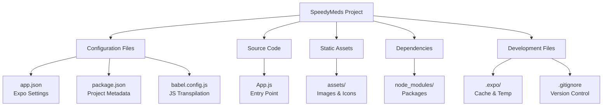
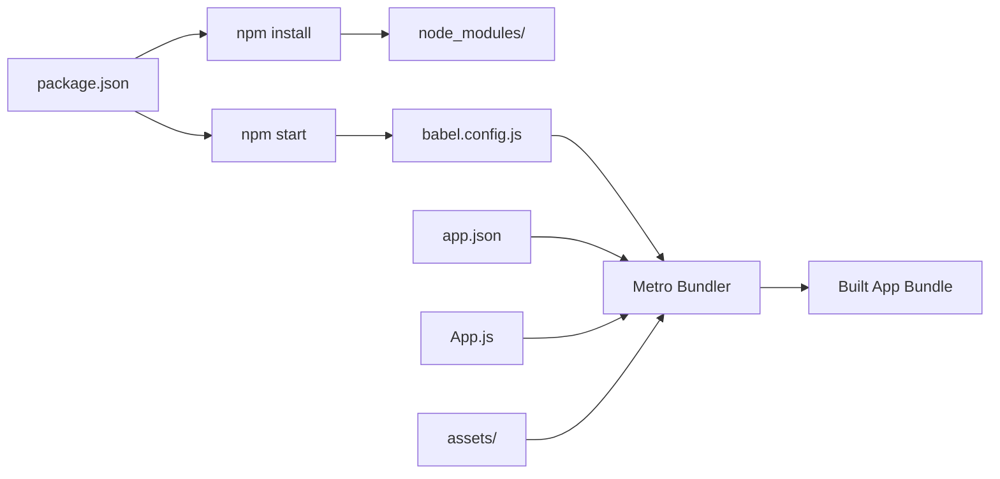

## Section 7: Expo Project Structure

Understanding your Expo project's file and folder structure is essential for effective development. This section provides a comprehensive overview of how Expo projects are organized, what each file and directory does, and best practices for maintaining a clean, scalable project structure.

### High-level project overview

When you created your SpeedyMeds project using `create-expo-app`, several files and folders were automatically generated. Each serves a specific purpose in the React Native development ecosystem.

### Complete project structure

```
SpeedyMeds/
├── App.js                    # Main application entry point
├── app.json                  # Expo configuration file
├── babel.config.js           # JavaScript transpilation configuration
├── package.json              # Node.js project configuration and dependencies
├── package-lock.json         # Locked dependency versions for reproducible installs
├── .gitignore               # Git version control exclusions
├── .expo/                   # Expo-specific cache and temporary files
│   ├── devices.json         # Connected device information
│   ├── README.md           # Expo folder documentation
│   └── web/                # Web build artifacts (if using web platform)
├── assets/                  # Static assets (images, fonts, sounds)
│   ├── adaptive-icon.png   # Android adaptive icon
│   ├── favicon.png         # Web browser favicon
│   ├── icon.png           # App icon (iOS and Android)
│   └── splash.png         # Launch screen image
└── node_modules/           # Installed Node.js packages and dependencies
    ├── expo/              # Expo SDK packages
    ├── react/             # React library
    ├── react-native/      # React Native framework
    └── [thousands of other packages...]
```

This structure provides everything needed for cross-platform React Native development while maintaining organization and clarity.

### Understanding the file hierarchy



This hierarchy separates concerns clearly: configuration manages project behavior, source code contains your application logic, assets store static resources, dependencies provide external functionality, and development files support the build and development process.

## Essential configuration files

Configuration files control how your project builds, runs, and behaves across different platforms and environments.

### app.json - Expo configuration

The `app.json` file is the central configuration for your Expo project, controlling app metadata, build settings, and platform-specific options.

```json
{
  "expo": {
    "name": "SpeedyMeds",
    "slug": "speedymeds",
    "version": "1.0.0",
    "orientation": "portrait",
    "icon": "./assets/icon.png",
    "userInterfaceStyle": "light",
    "splash": {
      "image": "./assets/splash.png",
      "resizeMode": "contain",
      "backgroundColor": "#ffffff"
    },
    "assetBundlePatterns": ["**/*"],
    "ios": {
      "supportsTablet": true
    },
    "android": {
      "adaptiveIcon": {
        "foregroundImage": "./assets/adaptive-icon.png",
        "backgroundColor": "#FFFFFF"
      }
    },
    "web": {
      "favicon": "./assets/favicon.png"
    }
  }
}
```

**Key configuration sections:**

- **Basic Information**: `name`, `slug`, `version` identify your app
- **UI Configuration**: `orientation`, `userInterfaceStyle` control app presentation
- **Assets**: `icon`, `splash` define visual branding
- **Platform-Specific**: `ios`, `android`, `web` sections customize platform behavior

> 🌐 **Web Developers:**
>
> **Comparison:** The app.json file serves a similar role to package.json in web projects, but specifically for mobile app metadata. It's comparable to a web app's manifest.json but with much more extensive configuration options for native mobile features.
>
> **Key Takeaway:** This single file controls how your app appears and behaves across iOS, Android, and web platforms.
>
> **Source:** [Web App Manifest](https://developer.mozilla.org/en-US/docs/Web/Manifest)

### package.json - Node.js project configuration

The `package.json` file manages your project's dependencies, scripts, and Node.js-specific metadata.

```json
{
  "name": "speedymeds",
  "version": "1.0.0",
  "main": "node_modules/expo/AppEntry.js",
  "scripts": {
    "start": "expo start",
    "android": "expo start --android",
    "ios": "expo start --ios",
    "web": "expo start --web"
  },
  "dependencies": {
    "expo": "~52.0.0",
    "expo-status-bar": "~2.0.0",
    "react": "18.2.0",
    "react-native": "0.76.0"
  },
  "devDependencies": {
    "@babel/core": "^7.20.0"
  },
  "private": true
}
```

**Key sections:**

- **Project Identity**: `name`, `version` identify your project in the npm ecosystem
- **Entry Point**: `main` specifies where the app starts (Expo handles this automatically)
- **Scripts**: `scripts` define command shortcuts for common tasks
- **Dependencies**: `dependencies` lists packages required for your app to run
- **Dev Dependencies**: `devDependencies` lists packages only needed during development

### babel.config.js - JavaScript transpilation

Babel converts modern JavaScript and React Native code into versions compatible with different platforms and JavaScript engines.

```javascript
module.exports = function (api) {
  api.cache(true);
  return {
    presets: ["babel-preset-expo"],
  };
};
```

**Understanding Babel's role:**

- **Modern JavaScript**: Converts ES6+ syntax to compatible versions
- **React Native**: Handles React Native-specific transformations
- **Platform Optimization**: Optimizes code for different target platforms
- **Metro Integration**: Works with Metro bundler for code compilation

> [!NOTE]
> The default Babel configuration works perfectly for most Expo projects. You'll typically only modify this file when adding specific Babel plugins or when working with advanced build optimizations.

## Source code organization

While Expo projects start with a simple `App.js` file, understanding how to organize your code as projects grow is crucial for maintainability.

### App.js - Application entry point

```javascript
import { StatusBar } from "expo-status-bar";
import { StyleSheet, Text, View } from "react-native";

export default function App() {
  return (
    <View style={styles.container}>
      <Text>Open up App.js to start working on your app!</Text>
      <StatusBar style="auto" />
    </View>
  );
}

const styles = StyleSheet.create({
  container: {
    flex: 1,
    backgroundColor: "#fff",
    alignItems: "center",
    justifyContent: "center",
  },
});
```

**App.js responsibilities:**

- **Application Root**: Serves as the top-level component for your entire app
- **Global Setup**: Place for global configurations, providers, and navigation setup
- **Entry Point**: First code that executes when your app launches
- **Platform Integration**: Handles platform-specific initialization

### Recommended folder structure for growing projects

As your project grows, organize code into logical folders:

```
SpeedyMeds/
├── App.js                     # Application entry point
├── src/                       # Source code directory
│   ├── components/            # Reusable UI components
│   │   ├── common/           # Shared components (buttons, inputs)
│   │   └── pharmacy/         # Domain-specific components
│   ├── screens/              # Screen/page components
│   │   ├── MedicationListScreen.js
│   │   ├── PrescriptionDetailScreen.js
│   │   └── PatientProfileScreen.js
│   ├── navigation/           # Navigation configuration
│   │   └── AppNavigator.js
│   ├── services/             # API calls and business logic
│   │   ├── medicationService.js
│   │   └── apiClient.js
│   ├── utils/                # Helper functions and utilities
│   │   ├── dateHelpers.js
│   │   └── validators.js
│   ├── styles/               # Shared styles and themes
│   │   ├── colors.js
│   │   └── typography.js
│   └── constants/            # App constants and configuration
│       ├── endpoints.js
│       └── medicationTypes.js
├── assets/                   # Static assets
└── [other config files...]
```

This structure supports scalability while maintaining clear separation of concerns.

## Asset management

The `assets/` folder contains static resources used by your application, including images, fonts, sounds, and other media files.

### Default asset structure

```
assets/
├── adaptive-icon.png         # Android adaptive icon (108x108 dp)
├── favicon.png              # Web browser favicon (16x16, 32x32, or 48x48 px)
├── icon.png                 # App icon (1024x1024 px)
└── splash.png               # Launch screen image (1242x2436 px for iPhone)
```

### Asset organization best practices

**Organize by type:**

```
assets/
├── images/
│   ├── icons/
│   ├── illustrations/
│   └── photos/
├── fonts/
│   ├── Roboto-Regular.ttf
│   └── Roboto-Bold.ttf
├── sounds/
│   ├── notification.mp3
│   └── button-click.wav
└── data/
    └── medications.json
```

**Organize by feature:**

```
assets/
├── onboarding/
│   ├── welcome-illustration.png
│   └── tutorial-steps/
├── pharmacy/
│   ├── pill-icons/
│   └── prescription-templates/
└── common/
    ├── logo.png
    └── default-avatar.png
```

### Asset naming conventions

Follow consistent naming patterns for easy maintenance:

- **Use kebab-case**: `medication-list-icon.png` instead of `MedicationListIcon.png`
- **Include dimensions**: `logo-256x256.png` for specific size requirements
- **Indicate purpose**: `button-primary-background.png` for UI elements
- **Platform suffixes**: `icon-ios.png` and `icon-android.png` for platform-specific assets

### Platform-specific assets

Different platforms may require different asset specifications:

**iOS Assets:**

- **App Icon**: 1024x1024 px PNG without transparency
- **Launch Screen**: Various sizes, or single large image that scales
- **Tab Bar Icons**: 30x30 px (1x), 60x60 px (2x), 90x90 px (3x)

**Android Assets:**

- **Adaptive Icon**: 108x108 dp with foreground and background layers
- **Launch Screen**: 1242x2436 px or 9-patch drawable
- **Notification Icons**: 24x24 dp monochrome

> [!TIP]
> Expo automatically handles most asset resizing and optimization. Provide high-resolution assets (2x or 3x) and let Expo generate appropriate sizes for different devices.

## Development and cache files

Several files and folders are generated during development to support the build process and improve performance.

### .expo/ directory

The `.expo/` folder contains Expo-specific cache and configuration files:

```
.expo/
├── devices.json             # Connected device information
├── README.md               # Documentation about this folder
├── settings.json           # Project-specific Expo settings
└── web/                    # Web platform build artifacts
    ├── cache/             # Cached web assets
    └── static/            # Generated static files
```

**Important characteristics:**

- **Automatically generated**: Created and managed by Expo CLI
- **Safe to delete**: Can be removed to clear cache (will regenerate)
- **Should not be committed**: Included in .gitignore by default
- **Platform-specific**: Contains different files based on platforms used

### node_modules/ directory

Contains all installed dependencies and their sub-dependencies:

```
node_modules/
├── expo/                   # Expo SDK and tools
├── react/                  # React library
├── react-native/           # React Native framework
├── @babel/                 # Babel transpilation tools
└── [many other packages]   # Hundreds of dependency packages
```

**Key characteristics:**

- **Massive size**: Often contains thousands of packages and files
- **Platform artifacts**: May contain native code for iOS/Android
- **Regeneratable**: Can be deleted and restored with `npm install`
- **Version-locked**: Controlled by package-lock.json for consistency

### .gitignore file

Specifies which files and folders Git should ignore in version control:

```gitignore
# Expo
.expo/
dist/
web-build/

# Dependencies
node_modules/

# Environment
.env.local
.env.development.local
.env.test.local
.env.production.local

# Debugging
npm-debug.log*
yarn-debug.log*
yarn-error.log*

# IDE
.vscode/
.idea/

# OS
.DS_Store
Thumbs.db
```

This ensures that generated files, dependencies, and personal configurations don't clutter your repository.

## Configuration file relationships

Understanding how configuration files work together helps debug issues and customize your development environment.

### File interaction flow



**Configuration cascade:**

1. **package.json** defines dependencies and scripts
2. **npm install** populates node_modules with required packages
3. **npm start** (or expo start) initiates the development server
4. **babel.config.js** configures JavaScript transpilation
5. **app.json** provides app metadata and platform settings
6. **Metro bundler** combines everything into an app bundle
7. **App.js** and **assets/** provide the actual app content

### Common configuration scenarios

**Adding new dependencies:**

1. Use `npx expo install package-name` for React Native packages
2. Package is added to package.json dependencies
3. Run `npm install` if needed to install the package
4. Import and use in your JavaScript files

**Modifying app metadata:**

1. Edit app.json with new name, version, or settings
2. Restart development server to apply changes
3. Changes affect how app appears on devices and stores

**Customizing build process:**

1. Modify babel.config.js for JavaScript transpilation changes
2. Update app.json for platform-specific build settings
3. Restart development server to apply babel changes

## Best practices for project structure

Following established patterns helps maintain clean, scalable projects as they grow in complexity.

### File naming conventions

- **Use PascalCase for components**: `MedicationCard.js`, `PrescriptionList.js`
- **Use camelCase for utilities**: `dateHelpers.js`, `apiClient.js`
- **Use kebab-case for assets**: `medication-icon.png`, `splash-screen.jpg`
- **Use UPPER_CASE for constants**: `API_ENDPOINTS.js`, `MEDICATION_TYPES.js`

### Import organization

Structure imports in a consistent order:

```javascript
// 1. React and React Native imports
import React, { useState, useEffect } from "react";
import { View, Text, StyleSheet } from "react-native";

// 2. Third-party libraries
import { StatusBar } from "expo-status-bar";
import { NavigationContainer } from "@react-navigation/native";

// 3. Local components and utilities
import MedicationCard from "../components/MedicationCard";
import { formatDate } from "../utils/dateHelpers";
import { colors } from "../styles/colors";
```

### Component organization

Keep components focused and organized:

```javascript
// Component file structure
import statements
Component definition
StyleSheet definition
Export statement

// Example:
import React from 'react';
import { View, Text, StyleSheet } from 'react-native';

const MedicationCard = ({ medication }) => {
  return (
    <View style={styles.container}>
      <Text style={styles.name}>{medication.name}</Text>
    </View>
  );
};

const styles = StyleSheet.create({
  container: {
    padding: 16,
    backgroundColor: 'white',
  },
  name: {
    fontSize: 18,
    fontWeight: 'bold',
  },
});

export default MedicationCard;
```

## Official documentation

> 📚 **Official Documentation:**
>
> - [Expo Configuration with app.json](https://docs.expo.dev/workflow/configuration/)
> - [Expo Assets](https://docs.expo.dev/guides/assets/)
> - [React Native Project Structure](https://reactnative.dev/docs/getting-started)
> - [Babel Configuration](https://babeljs.io/docs/en/configuration)
>
> 🗂️ **Additional Resources:**
>
> - [React Native Directory Structure Best Practices](https://github.com/react-native-community/discussions-and-proposals)
> - [Expo Asset Optimization Guide](https://docs.expo.dev/guides/preloading-and-caching-assets/)

## Next steps

Understanding your project structure provides the foundation for effective development. The next section will introduce you to essential Expo CLI commands that you'll use daily for development tasks, building on the project structure knowledge you've gained here.
