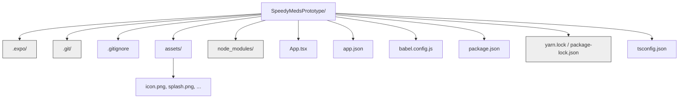

## Section 7: Expo Project Structure (File/Folder Overview)

When you create a new project with `create-expo-app`, it generates a standard directory structure with several key files and folders. Understanding this structure is essential for navigating your project and knowing where to place your code and assets.

Let's examine the typical structure of a newly created Expo project (like `SpeedyMedsPrototype`), focusing on the most important elements:

```text
SpeedyMedsPrototype/
├── .expo/                   # Generated directory: Caching and temporary files for Expo tools
├── .git/                    # Generated directory: Git version control data (if initialized)
├── .gitignore               # Configuration: Files and folders for Git to ignore
├── assets/                  # Project convention: Static assets (images, fonts)
│   ├── adaptive-icon.png
│   ├── favicon.png
│   ├── icon.png
│   └── splash.png
├── node_modules/            # Generated directory: Project dependencies (managed by npm/yarn)
├── App.tsx                  # Entry Point: The main application component file
├── app.json                 # Configuration: Expo project configuration
├── babel.config.js          # Configuration: Babel compiler configuration
├── package.json             # Configuration: Project metadata and dependencies
├── package-lock.json or yarn.lock # Generated file: Locks dependency versions
└── tsconfig.json            # Configuration: TypeScript compiler configuration
```

- _Diagram: Mermaid diagram showing the Expo project structure hierarchy._



- _Caption: This diagram illustrates the standard file and folder structure of a new Expo project created with `create-expo-app`. Grayed-out folders (`.expo`, `.git`, `node_modules`) are typically generated or managed by tools, while the others contain your application code, assets, and configuration._

### Key Files and Folders Explained

- **`App.tsx` (or `App.js`)**: This is the **root component** of your application. It's the starting point where your app's UI begins. You'll spend most of your initial development time modifying this file and creating new components that are used within it. (We chose the TypeScript template, hence `.tsx`).

- **`app.json`**: This is the **main configuration file for your Expo project**. It contains settings like your app's name, version, icon, splash screen, supported platforms, orientation, package identifiers, associated native modules (plugins), and much more. You'll modify this file to customize your app's metadata and build behavior.

- **`package.json`**: The standard Node.js project manifest file. It lists your project's metadata (name, version), dependencies (libraries your project uses, like `react`, `react-native`, `expo`), and scripts (like `start`, `ios`, `android`). You interact with this file indirectly when you install packages using `npm install` or `yarn add` (or `npx expo install`).

- **`node_modules/`**: This directory contains all the actual code for your project's dependencies (listed in `package.json`). It's managed by npm or Yarn and is usually quite large. You should **never** directly modify files inside `node_modules/`. This folder is typically excluded from version control (see `.gitignore`).

- **`assets/`**: By convention, this folder holds static assets for your application, such as images (like the default app icon and splash screen) and custom fonts. You can organize subfolders within `assets/` as needed.

- **`babel.config.js`**: Configures Babel, a JavaScript compiler used by React Native to transform modern JavaScript/TypeScript syntax (like JSX) into code that can be understood by the JavaScript engine (Hermes) running on the device or simulator.

- **`tsconfig.json`**: Configures the TypeScript compiler (`tsc`). It defines rules for how TypeScript code should be checked and compiled into JavaScript, including type checking strictness, target JavaScript version, and module system.

- **`.gitignore`**: Specifies intentionally untracked files and directories that Git should ignore. This commonly includes `node_modules/`, `.expo/`, operating system files, and potentially sensitive information.

- **`package-lock.json` or `yarn.lock`**: These files lock down the exact versions of your dependencies that were installed. This ensures that anyone else setting up the project (or your build server) installs the exact same dependency versions, leading to more consistent and reproducible builds.

- **`.expo/`**: This directory is automatically generated by Expo tools for caching and storing temporary build artifacts or configuration. You generally don't need to interact with it directly and it's usually ignored by Git.

### Where to Put Your Code?

While you start with `App.tsx`, as your application grows, you'll want to organize your code into separate files and folders. Common conventions include:

- Creating a `src/` directory at the root level.
- Inside `src/`, creating subdirectories like:
  - `components/`: For reusable UI components (e.g., buttons, cards, input fields).
  - `screens/`: For components representing entire application screens.
  - `navigation/`: For navigation setup code (stacks, tabs).
  - `hooks/`: For custom React Hooks.
  - `constants/`: For constant values (colors, styles, configuration).
  - `utils/`: For utility functions.
  - `api/`: For code related to fetching data from servers.
  - `store/` or `state/`: For state management logic (Zustand, Context).

You would then update `App.tsx` to import and use components from these directories.

> [!TIP]
> Adopting a clear folder structure early on makes your project much easier to maintain and scale as it grows.

Understanding this basic structure helps you locate configuration files, manage assets, and organize your growing codebase effectively.

> 📚 **Official Documentation:**
>
> - [Expo Docs: Project Structure](https://docs.expo.dev/router/basics/project-structure/) (Focuses on Expo Router structure, but covers many core files)
> - [Expo Docs: Configuration with app.json / app.config.js](https://docs.expo.dev/versions/latest/config/app/)
> - [React Native Docs: Project Structure](https://reactnative.dev/docs/project-structure) (General React Native perspective)
