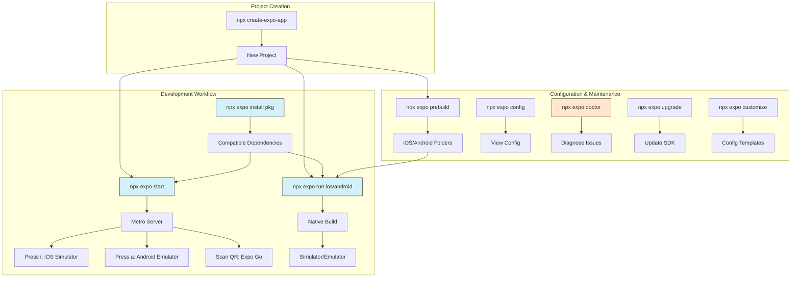

## Section 8: Essential Expo CLI Commands

The Expo CLI is your primary tool for managing and running your Expo project. While it offers many commands, this section covers the most essential ones you'll use frequently during development.

Remember, the recommended way to run these commands is using `npx expo <command>` within your project directory.

> 🧑‍🏫 **(Instructor-Led):** Consider creating a hands-on exercise where students use each of these commands and document the output. This practical experience helps reinforce their understanding of the Expo CLI's capabilities.

> 🧗‍♀️ **(Self-Led):** Create a command reference card or cheat sheet with these commands for quick reference. Focus first on mastering `start`, `run:ios`/`run:android`, and `install`, as these will be your most frequently used commands.

### Expo CLI Command Workflow



This diagram illustrates the relationships between key Expo CLI commands and their roles in the development workflow. The blue highlighted commands (`start`, `run:ios`/`run:android`, and `install`) are your core daily development commands, while the orange `doctor` command is especially useful for troubleshooting issues.

### Core Development Commands

**1. `npx expo start`**

Starts the Metro development server, which bundles your JavaScript code, serves assets, and enables Fast Refresh.

- **Role:** Runs Metro, provides a QR code, opens Dev Tools GUI, offers terminal UI options.
- **Common Options:**
  - `--dev-client`: Starts the server for a Development Build.
  - `--go`: Explicitly starts the server for Expo Go.
  - `--offline`: Attempts to start offline (may fail if caches aren't populated).
  - `--clear`: Clears the Metro cache before starting.
  - `--port <number>`: Use a specific port number.
  - `--tunnel`: Creates a public URL using Expo's tunnel service (via ngrok) to share or connect when not on the same network. Modern Expo CLI versions will prompt to install `ngrok` if required and not already available.
  - `-a`, `-i`, `-w`: Shortcut flags to attempt opening on Android, iOS, or Web automatically after starting.
- **Usage:** `npx expo start` (Defaults to Expo Go mode)

**2. `npx expo run:[ios|android]`**

Builds the native project locally and runs it on a simulator/emulator or connected physical device.

- **Role:** Orchestrates native build tools (Xcodebuild, Gradle), installs dependencies (CocoaPods, Maven), builds the `.app`/`.apk`, installs, and launches.
- **Common Options:**
  - `--device [name|udid]`: Target a specific physical device.
  - `--simulator "Simulator Name"` (iOS): Target a specific simulator (use `xcrun simctl list devices` to see names).
  - `--variant [debug|release]` (Android): Specify build variant.
  - `--no-bundler`: Builds and installs the app but does not start the Metro server.
- **Usage:** `npx expo run:ios` or `npx expo run:android`

**3. `npx expo install [package...]`**

Installs JavaScript dependencies, ensuring versions are compatible with your project's Expo SDK.

- **Role:** Checks Expo's compatibility map and instructs npm/yarn/pnpm to install the correct version. Essential for avoiding version mismatches with native modules.
- **Usage:** `npx expo install package-name another-package`

> [!IMPORTANT]
> Always use `npx expo install` over `npm install`/`yarn add` when adding libraries, especially those with native code.

### Project Configuration & Maintenance

**4. `npx expo prebuild`**

Generates the native `ios` and `android` project directories based on `app.json`/`app.config.js` and installed config plugins. This is the core of **Continuous Native Generation (CNG)**.

- **Role:** Reads Expo config, applies config plugins, creates/updates native project files (`Info.plist`, `AndroidManifest.xml`, build files, etc.).
- **Common Options:**
  - `--platform [ios|android]`: Generate only for a specific platform.
  - `--clean`: Deletes existing `ios`/`android` directories before generating.
  - `--no-install`: Skips running `pod install` after generating the `ios` directory.
  - `--template <name|path>`: Use a specific native project template (advanced).
- **Usage:** `npx expo prebuild` (usually run automatically by `run:*` commands if needed, but can be run manually).

**5. `npx expo config`**

Inspects the fully resolved configuration of your project after processing `app.json`/`app.config.js` and config plugins.

- **Role:** Useful for debugging configuration issues or seeing the final values that will be used during prebuild or builds.
- **Common Options:**
  - `--type [public|prebuild|introspect]`: Shows different views of the config (`public` is the static JSON, `prebuild` shows values used for native generation, `introspect` shows plugin details).
  - `-p [ios|android]`: Show platform-specific config.
- **Usage:** `npx expo config` or `npx expo config --type prebuild -p ios`

**6. `npx expo doctor`**

Diagnoses potential issues with your project setup, dependencies, or environment.

- **Role:** Checks for common problems like mismatched versions, missing dependencies, or environment setup issues.
- **Usage:** `npx expo doctor`

**7. `npx expo upgrade`**

Upgrades your project's Expo SDK version and attempts to install compatible versions of core dependencies.

- **Role:** Modifies `package.json`, installs new versions using `npx expo install`. Read the upgrade guide for the target SDK version carefully before running.
- **Usage:** `npx expo upgrade` (Upgrades to the latest supported SDK) or `npx expo upgrade <sdk-version>`

**8. `npx expo customize [file]`**

Copies default configuration files (like `metro.config.js`, `babel.config.js`, `app.config.js`) into your project for customization.

- **Role:** Provides a starting point if you need to modify default build tool configurations.
- **Usage:** `npx expo customize metro.config.js`

### Expo Account Management (for EAS)

**9. `npx expo login` / `logout` / `whoami`**

Manages authentication with your Expo account, which is required for using Expo Application Services (EAS).

- **Role:** `login` prompts for credentials, `logout` clears credentials, `whoami` shows the currently logged-in user.
- **Usage:** `npx expo login`

### Summary Table

| Command                        | Primary Purpose                                                   |
| :----------------------------- | :---------------------------------------------------------------- |
| `npx expo start`               | Start Metro dev server, enable Fast Refresh, provide QR code/UI   |
| `npx expo run:[ios\|android]`  | Build native project locally, run on simulator/emulator/device    |
| `npx expo install [pkg...]`    | Install dependencies with Expo SDK compatibility checks           |
| `npx expo prebuild`            | Generate/update native `ios`/`android` projects from config (CNG) |
| `npx expo config`              | Inspect resolved project configuration                            |
| `npx expo doctor`              | Diagnose project setup issues                                     |
| `npx expo upgrade`             | Upgrade project to a newer Expo SDK version                       |
| `npx expo customize [file]`    | Copy default config files for customization                       |
| `npx expo login/logout/whoami` | Manage Expo account session (for EAS)                             |

This table provides a quick reference for the essential Expo CLI commands discussed in this section and their primary purpose.

> 📲 **(Native Developers):**
>
> **Comparison:** `start` manages Metro (like running `react-native start` but integrated). `run:*` orchestrates `xcodebuild`/`gradlew`. `install` is a package manager wrapper with version validation. `prebuild` automates native project generation based on JS config (akin to code generation tools). `config` introspects this generation process. `doctor` is a diagnostic tool.
>
> **Key Takeaway:** Expo CLI wraps and extends native tools and package managers with Expo-specific logic and workflows (like CNG and compatibility checks).
>
> **Source:** [Expo Docs: Developing with the iOS Simulator](https://docs.expo.dev/workflow/ios-simulator/)

> 🌐 **(Web Developers):**
>
> **Comparison:** `start` is like your `npm run dev` or `vite` command. `run:*` has no direct web equivalent but involves native compilation similar to a build process. `install` is `npm install` plus safety checks, like using a smart package manager that knows about compatibility. `prebuild`/`config` relate to generating the underlying native app structure from your config, somewhat analogous to how webpack might generate optimized bundles from your configuration.
>
> **Key Takeaway:** Familiar concepts (`start`, `install`) have native-specific enhancements (`run:*`, `prebuild`, compatibility checks).
>
> **Source:** [Metro Bundler Documentation](https://facebook.github.io/metro/) - The bundler under the hood of `npx expo start`

> 🔁 **(Asynchronous Learners):** Focus on remembering the most essential commands first: `start`, `run:ios`/`run:android`, and `install`. Once you're comfortable with those, gradually incorporate the maintenance commands like `doctor` and `upgrade` as needed. Creating a reference sheet with example usages will be helpful.

### Using Commands in SpeedyMeds Development

```typescript
// Example of installing and using a barcode scanner in SpeedyMeds
// Terminal commands to set up:
// npx expo install expo-barcode-scanner
// npx expo start

// In your MedicationScanScreen.tsx:
import React, { useState, useEffect } from "react";
import { Text, View, StyleSheet, Button } from "react-native";
import { BarCodeScanner } from "expo-barcode-scanner";

/**
 * @function MedicationScanScreen
 * @description A screen component for the SpeedyMeds app that demonstrates barcode scanning
 * using the `expo-barcode-scanner` package. It handles requesting camera permissions,
 * displays the camera preview, and processes scanned barcode data.
 * This example illustrates how Expo CLI commands like `npx expo install` and `npx expo start`
 * facilitate adding and testing such features.
 *
 * @returns {JSX.Element} The JSX element representing the medication scanner screen.
 */
export default function MedicationScanScreen() {
  const [hasPermission, setHasPermission] = useState<boolean | null>(null);
  const [scanned, setScanned] = useState(false);
  const [medicationCode, setMedicationCode] = useState<string | null>(null);

  useEffect(() => {
    (async () => {
      const { status } = await BarCodeScanner.requestPermissionsAsync();
      setHasPermission(status === "granted");
    })();
  }, []);

  const handleBarCodeScanned = ({
    type,
    data,
  }: {
    type: string;
    data: string;
  }) => {
    setScanned(true);
    setMedicationCode(data);
    console.log(
      `Bar code with type ${type} and data ${data} has been scanned!`
    );
  };

  if (hasPermission === null) {
    return <Text>Requesting for camera permission</Text>;
  }
  if (hasPermission === false) {
    return <Text>No access to camera</Text>;
  }

  return (
    <View style={styles.container}>
      <BarCodeScanner
        onBarCodeScanned={scanned ? undefined : handleBarCodeScanned}
        style={StyleSheet.absoluteFillObject}
      />
      {scanned && (
        <View style={styles.resultContainer}>
          <Text style={styles.resultText}>Medication: {medicationCode}</Text>
          <Button title="Scan Again" onPress={() => setScanned(false)} />
        </View>
      )}
    </View>
  );
}

const styles = StyleSheet.create({
  container: {
    flex: 1,
    flexDirection: "column",
    justifyContent: "center",
  },
  resultContainer: {
    backgroundColor: "white",
    padding: 16,
    borderRadius: 8,
    margin: 16,
    alignItems: "center",
  },
  resultText: {
    fontSize: 16,
    marginBottom: 8,
  },
});
```

This TypeScript code snippet provides a functional example of a `MedicationScanScreen` component, intended for the SpeedyMeds application, which integrates the `expo-barcode-scanner` library. The comments preceding the code emphasize the correct installation method: `npx expo install expo-barcode-scanner`. This CLI command is crucial for ensuring that the installed version of the scanner library is compatible with the project's Expo SDK, a key theme of this section. The component itself demonstrates a common pattern for using hardware-dependent features: it first requests camera permissions using `BarCodeScanner.requestPermissionsAsync()` within a `useEffect` hook to run once when the component mounts. The user's permission status is stored in the `hasPermission` state variable using `useState`.

Conditional rendering is employed to manage the UI based on permission status: messages are shown if permission is pending or denied. If permission is granted, the `<BarCodeScanner>` component is rendered, filling the screen (via `StyleSheet.absoluteFillObject`) to display the live camera feed. The `onBarCodeScanned` prop is set to the `handleBarCodeScanned` function, but only if a barcode hasn't already been scanned (controlled by the `scanned` state variable), preventing multiple rapid scans. The `handleBarCodeScanned` callback receives the scan `type` and `data`, updates the `scanned` state to true, stores the `data` in `medicationCode`, and logs the information. In a production SpeedyMeds app, this data would trigger a lookup or other business logic. The UI then displays the `medicationCode` and a "Scan Again" button, which resets the `scanned` state, allowing for new scans. This entire workflow, from installing a package with an Expo CLI command to implementing and testing a feature that uses it (which would be run using `npx expo start` and tested on a device/simulator), encapsulates the iterative development cycle facilitated by the Expo CLI.

Mastering these commands provides a solid foundation for your daily Expo development workflow.

> 📚 **Official Documentation:**
>
> - [Expo Docs: Expo CLI Reference](https://docs.expo.dev/more/expo-cli/)
> - [Expo Docs: CLI commands list](https://docs.expo.dev/more/expo-cli/#npx-expo-start)
> - [Expo Docs: Metro Bundler Configuration](https://docs.expo.dev/guides/customizing-metro/)
> - [Expo Docs: Configuration system](https://docs.expo.dev/versions/latest/config/app/)
> - [Metro Bundler Documentation](https://facebook.github.io/metro/)
