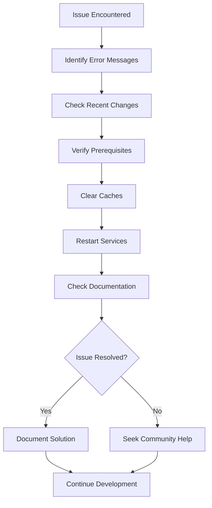

# Section 9: Troubleshooting common setup issues

Even with careful setup, React Native development environments can encounter various issues across different platforms. This section provides systematic solutions to the most common problems you'll face on Windows, macOS, and Linux, helping you maintain a productive development workflow.

## General troubleshooting approach

Before diving into specific issues, follow this systematic approach to diagnose and resolve problems effectively across all platforms.

### The systematic debugging process



**Step-by-step debugging:**

1. **Read error messages carefully** - They often contain the exact solution
2. **Consider recent changes** - What was the last thing you modified?
3. **Verify prerequisites** - Are all required tools installed and updated?
4. **Clear caches** - Many issues stem from stale cache data
5. **Restart services** - Metro bundler, simulators/emulators, and terminals
6. **Check official documentation** - Expo and React Native docs are frequently updated
7. **Search community resources** - Stack Overflow, Expo Discord, GitHub issues

### Information gathering for effective troubleshooting

Before asking for help or diving deep into solutions, gather this essential information:

```bash
# System information (cross-platform)
node --version
npm --version
npx expo --version

# Platform-specific information
# macOS
xcode-select -p

# Windows
echo %ANDROID_HOME%

# Linux
echo $ANDROID_HOME

# Project information
npx expo config
npx expo doctor

# Error context
# Copy exact error messages
# Note steps that led to the error
# Document what you've already tried
```

This information helps identify the root cause quickly and provides context for community support.

## Node.js and npm issues

Node.js and npm form the foundation of React Native development. Issues here affect everything else across all platforms.

### Node.js version conflicts

**Issue**: Project requires different Node.js versions, or global tools stop working after Node.js updates.

**Symptoms:**

- `node: command not found` after switching versions
- Packages fail to install with version-related errors
- Global npm packages don't work

**Solutions by platform:**

#### Windows (nvm-windows)

```cmd
:: List installed versions
nvm list

:: Install and use LTS version
nvm install lts
nvm use lts

:: Set default version
nvm alias default lts
```

#### macOS/Linux (nvm)

```bash
# List installed versions
nvm list

# Install and use LTS version
nvm install --lts
nvm use --lts

# Set default version
nvm alias default node
```

### npm permission errors

**Issue**: Permission denied errors when installing global packages.

**Symptoms:**

```
npm ERR! Error: EACCES: permission denied
npm ERR! Error: EPERM: operation not permitted
```

**Solutions by platform:**

#### Windows

```cmd
:: Run Command Prompt as Administrator
:: Or use PowerShell as Administrator

:: Configure npm prefix
npm config set prefix %APPDATA%\npm
```

#### macOS/Linux

```bash
# Configure npm to use different directory
mkdir ~/.npm-global
npm config set prefix '~/.npm-global'
echo 'export PATH=~/.npm-global/bin:$PATH' >> ~/.zshrc
source ~/.zshrc
```

### npm cache corruption

**Issue**: Package installations fail or produce unexpected results.

**Symptoms:**

- Packages install but don't work correctly
- `npm install` fails with cryptic errors
- Recently installed packages can't be found

**Solutions (all platforms):**

```bash
# Clear npm cache
npm cache clean --force

# Clear npm cache and verify
npm cache clean --force
npm cache verify

# Remove and reinstall node_modules
rm -rf node_modules package-lock.json  # macOS/Linux
rmdir /s node_modules & del package-lock.json  # Windows
npm install
```

## Expo CLI issues

Expo CLI problems can prevent project creation, development server startup, and command execution across all platforms.

### Expo CLI installation problems

**Issue**: `expo: command not found` or Expo CLI commands fail to execute.

**Symptoms:**

```bash
expo start
# Command 'expo' not found
```

**Solutions (all platforms):**

1. **Install latest Expo CLI:**

```bash
npm install -g @expo/cli@latest
```

2. **Verify installation:**

```bash
npx expo --version
which expo  # macOS/Linux
where expo  # Windows
```

3. **Use npx if global installation fails:**

```bash
# Instead of: expo start
# Use: npx expo start
```

4. **Fix PATH issues (platform-specific):**

**Windows:**

```cmd
:: Add npm global binaries to PATH via System Environment Variables
:: %APPDATA%\npm
```

**macOS/Linux:**

```bash
# Add npm global binaries to PATH
echo 'export PATH="$(npm config get prefix)/bin:$PATH"' >> ~/.zshrc
source ~/.zshrc
```

### Metro bundler startup failures

**Issue**: Development server fails to start or crashes during startup.

**Symptoms:**

```
Metro bundler failed to start
Port 8081 already in use
Unable to start Metro
```

**Solutions (cross-platform):**

1. **Kill existing Metro processes:**

**Windows:**

```cmd
:: Find processes using port 8081
netstat -ano | findstr :8081

:: Kill specific process by PID
taskkill /PID <process_id> /F

:: Or kill all node processes
taskkill /IM node.exe /F
```

**macOS/Linux:**

```bash
# Find processes using port 8081
lsof -ti:8081

# Kill specific process
kill -9 $(lsof -ti:8081)

# Or kill all node processes (more aggressive)
pkill -f node
```

2. **Start with cache clear:**

```bash
npx expo start --clear
```

3. **Use different port:**

```bash
npx expo start --port 8082
```

### Expo SDK version conflicts

**Issue**: Package versions incompatible with your Expo SDK version.

**Symptoms:**

```
Expo SDK version mismatch
Package X is not compatible with SDK Y
Unable to resolve module
```

**Solutions (all platforms):**

1. **Check SDK compatibility:**

```bash
npx expo doctor
```

2. **Update to compatible package versions:**

```bash
npx expo install --fix
```

3. **Install packages using Expo CLI:**

```bash
# Always use expo install instead of npm install for RN packages
npx expo install @react-navigation/native
```

4. **Update Expo SDK (if needed):**

```bash
npx expo upgrade
```

## iOS Simulator issues (macOS only)

iOS Simulator problems can prevent app testing and development workflow on macOS.

### Simulator fails to launch

**Issue**: iOS Simulator doesn't open when requested.

**Symptoms:**

- `expo start` shows iOS option but simulator doesn't launch
- Simulator opens but shows black screen
- Error messages about simulator not found

**Solutions:**

1. **Verify Xcode Command Line Tools:**

```bash
xcode-select -p
# Should show path like /Applications/Xcode.app/Contents/Developer
```

2. **Install/reset Command Line Tools:**

```bash
xcode-select --install
# Or if already installed:
sudo xcode-select --reset
```

3. **Launch simulator manually:**

```bash
open -a Simulator
```

4. **Reset simulator if corrupted:**

```bash
xcrun simctl shutdown all
xcrun simctl erase all
```

### App doesn't load in iOS Simulator

**Issue**: Simulator launches but app shows white screen or error.

**Solutions:**

1. **Check Metro bundler logs for errors**
2. **Force reload in simulator:** Press `Cmd + R`
3. **Clear app data:** Long press app icon > Delete App > Relaunch
4. **Restart with cache clear:** `npx expo start --clear`

## Android Emulator issues (all platforms)

Android Emulator problems can affect development across Windows, macOS, and Linux.

### Emulator fails to start

**Issue**: Android Emulator doesn't launch or crashes on startup.

**Symptoms:**

- `npx expo start --android` fails to open emulator
- Emulator window opens but doesn't boot
- "Emulator not found" errors

**Solutions by platform:**

#### Windows

1. **Check hardware acceleration:**

```cmd
:: Ensure Hyper-V or Intel HAXM is installed
:: Windows Features > Hyper-V (Windows Pro/Enterprise)
:: Or download Intel HAXM for Windows Home
```

2. **Verify environment variables:**

```cmd
echo %ANDROID_HOME%
echo %PATH%
:: Should include %ANDROID_HOME%\emulator and %ANDROID_HOME%\platform-tools
```

3. **Launch emulator manually:**

```cmd
cd %ANDROID_HOME%\emulator
emulator -list-avds
emulator @your-avd-name
```

#### macOS

1. **Check virtualization framework:**

```bash
# Ensure virtualization is enabled in System Preferences > Security & Privacy
# Check for Hypervisor.framework support
system_profiler SPHardwareDataType | grep "Virtual"
```

2. **Verify Android SDK:**

```bash
echo $ANDROID_HOME
ls $ANDROID_HOME/emulator
```

3. **Launch emulator manually:**

```bash
$ANDROID_HOME/emulator/emulator -list-avds
$ANDROID_HOME/emulator/emulator @your-avd-name
```

#### Linux

1. **Check KVM support:**

```bash
# Verify KVM is available
egrep -c '(vmx|svm)' /proc/cpuinfo
# Should return > 0

# Check KVM is installed
lsmod | grep kvm

# Install KVM if needed (Ubuntu/Debian)
sudo apt install qemu-kvm libvirt-daemon-system libvirt-clients bridge-utils
```

2. **Add user to required groups:**

```bash
sudo usermod -a -G kvm $USER
sudo usermod -a -G libvirt $USER
# Logout and login again
```

3. **Set proper permissions:**

```bash
sudo chown -R $USER:$USER $ANDROID_HOME
chmod +x $ANDROID_HOME/emulator/emulator
```

### Android emulator performance issues

**Issue**: Emulator runs slowly or becomes unresponsive.

**Solutions (all platforms):**

1. **Allocate more resources in AVD settings:**

   - RAM: 4GB minimum, 8GB recommended
   - Internal Storage: 8GB or more
   - Graphics: Hardware - GLES 2.0

2. **Use x86/x86_64 system images** (faster than ARM)

3. **Enable hardware acceleration** (platform-specific settings above)

4. **Close unnecessary applications** on host machine

### Android emulator network issues

**Issue**: Emulator can't connect to development server or internet.

**Solutions:**

1. **Check emulator network settings:**

   - Settings > Network & Internet > Wi-Fi
   - Ensure emulator has network connectivity

2. **Verify firewall settings:**

**Windows:**

```cmd
:: Add Node.js to Windows Defender exceptions
:: Windows Defender Firewall > Allow an app
```

**macOS:**

```bash
# Temporarily disable firewall for testing
sudo /usr/libexec/ApplicationFirewall/socketfilterfw --setglobalstate off
# Remember to re-enable: --setglobalstate on
```

**Linux:**

```bash
# Check iptables/ufw status
sudo ufw status
# Allow port 8081 if needed
sudo ufw allow 8081
```

## Network connectivity issues

Network problems prevent connections between development servers and devices/emulators.

### Development server connection issues

**Issue**: Cannot connect to Metro bundler from devices or emulators.

**Symptoms:**

- QR code scanning fails in Expo Go
- Emulator/simulator can't reach development server
- "Connection refused" or "Network timeout" errors

**Cross-platform solutions:**

1. **Verify development server is running:**

```bash
npx expo start
# Check for "Metro waiting on exp://..." message
```

2. **Check firewall settings (platform-specific):**

**Windows:**

```cmd
:: Add Node.js to Windows Defender Firewall exceptions
:: Control Panel > System and Security > Windows Defender Firewall > Allow an app
```

**macOS:**

```bash
# System Preferences > Security & Privacy > Firewall
# Add Terminal and Node.js to allowed apps
```

**Linux:**

```bash
# Ubuntu/Debian
sudo ufw allow 8081/tcp

# CentOS/RHEL
sudo firewall-cmd --add-port=8081/tcp --permanent
sudo firewall-cmd --reload
```

3. **Test network connectivity:**

```bash
# Get your IP address
# Windows:
ipconfig | findstr "IPv4"

# macOS/Linux:
ifconfig | grep "inet " | grep -v 127.0.0.1

# Test from device/emulator browser:
# Navigate to http://YOUR_IP:8081
```

4. **Use tunnel mode for network issues:**

```bash
npm install -g @expo/ngrok
npx expo start --tunnel
```

### Tunnel connection problems

**Issue**: `--tunnel` flag fails to establish connection.

**Solutions:**

1. **Install/reinstall ngrok:**

```bash
npm uninstall -g @expo/ngrok
npm install -g @expo/ngrok
```

2. **Check ngrok service status:**

   - Visit [ngrok status page](https://status.ngrok.com/)

3. **Clear tunnel cache:**

```bash
rm -rf .expo  # macOS/Linux
rmdir /s .expo  # Windows
npx expo start --tunnel
```

4. **Try alternative tunnel settings:**

```bash
export EXPO_TUNNEL_SUBDOMAIN=myproject  # macOS/Linux
set EXPO_TUNNEL_SUBDOMAIN=myproject     # Windows
npx expo start --tunnel
```

## Platform-specific issues

Some problems are unique to specific operating systems or development environments.

### Windows-specific issues

**Issue**: Windows Defender or antivirus blocking Node.js/Metro

**Solutions:**

1. **Add Node.js to antivirus exclusions:**

   - Windows Defender > Virus & threat protection > Exclusions
   - Add folder: `C:\Users\{username}\AppData\Roaming\npm`

2. **Run terminals as Administrator** when needed

3. **Use PowerShell instead of Command Prompt** for better Unicode support

**Issue**: Long path names causing installation failures

**Solutions:**

```cmd
:: Enable long path support (Windows 10+)
:: Run PowerShell as Administrator:
Set-ItemProperty -Path "HKLM:\SYSTEM\CurrentControlSet\Control\FileSystem" -Name "LongPathsEnabled" -Value 1
```

### macOS-specific issues

**Issue**: macOS permission errors with development tools

**Solutions:**

1. **Grant Full Disk Access to Terminal:**

   - System Preferences > Security & Privacy > Privacy > Full Disk Access
   - Add Terminal.app and your code editor

2. **Reset Xcode permissions:**

```bash
sudo xcodebuild -license accept
sudo xcode-select --reset
```

3. **Fix npm permissions:**

```bash
sudo chown -R $(whoami) ~/.npm
```

### Linux-specific issues

**Issue**: Permission errors or missing dependencies

**Solutions:**

1. **Install development dependencies:**

**Ubuntu/Debian:**

```bash
sudo apt update
sudo apt install build-essential git curl
```

**CentOS/RHEL:**

```bash
sudo yum groupinstall "Development Tools"
sudo yum install git curl
```

2. **Fix permission issues:**

```bash
# Add user to required groups
sudo usermod -a -G plugdev $USER
sudo usermod -a -G dialout $USER
# Logout and login again
```

3. **Install missing libraries:**

```bash
# Ubuntu/Debian
sudo apt install libnss3-dev libatk-bridge2.0-dev libdrm2 libxkbcommon-dev libxss1 libasound2-dev

# CentOS/RHEL
sudo yum install nss atk at-spi2-atk libdrm libxkbcommon alsa-lib
```

## Emergency recovery procedures

When multiple issues compound, these comprehensive solutions can restore a working environment.

### Complete environment reset (last resort)

**When to use:** Multiple tools are broken, and individual fixes haven't worked.

**Windows:**

```cmd
:: 1. Uninstall Node.js from Control Panel
:: 2. Remove npm directories
rmdir /s %APPDATA%\npm
rmdir /s %APPDATA%\npm-cache

:: 3. Remove environment variables
:: Remove ANDROID_HOME and npm paths from PATH

:: 4. Reinstall everything from Section 2
```

**macOS:**

```bash
# 1. Remove Node.js and npm
# Use nvm to remove or uninstall Node.js directly

# 2. Remove npm and Expo directories
rm -rf ~/.npm
rm -rf ~/.expo

# 3. Reinstall everything from Section 2
```

**Linux:**

```bash
# 1. Remove Node.js using package manager
sudo apt remove nodejs npm  # Ubuntu/Debian
sudo yum remove nodejs npm   # CentOS/RHEL

# 2. Remove user directories
rm -rf ~/.npm
rm -rf ~/.expo
rm -rf ~/.nvm

# 3. Reinstall everything from Section 2
```

### Project-specific reset

**When to use:** Project-specific issues that don't affect global tools.

```bash
# 1. Clear all project caches
npx expo start --clear
npm cache clean --force
rm -rf .expo  # macOS/Linux
rmdir /s .expo  # Windows

# 2. Remove and reinstall dependencies
rm -rf node_modules package-lock.json  # macOS/Linux
rmdir /s node_modules & del package-lock.json  # Windows
npm install

# 3. Reset git state if needed
git status
git clean -fd

# 4. Restart development server
npx expo start --clear
```

## Prevention strategies

Avoid issues by following these preventive practices across all platforms.

### Regular maintenance

```bash
# Weekly maintenance routine (all platforms)
npm update -g @expo/cli
npm cache clean --force
npx expo doctor

# Keep dependencies updated
npx expo install --fix
```

### Platform-specific maintenance

**Windows:**

```cmd
:: Keep Windows updated
:: Regularly update Windows Defender definitions
:: Clean temporary files with Disk Cleanup
```

**macOS:**

```bash
# Keep Xcode Command Line Tools updated
xcode-select --install

# Update Homebrew packages
brew update && brew upgrade
```

**Linux:**

```bash
# Keep system packages updated
sudo apt update && sudo apt upgrade  # Ubuntu/Debian
sudo yum update  # CentOS/RHEL
```

### Project hygiene

```bash
# Before major changes (all platforms)
git commit -m "Working state before changes"

# After adding packages
npx expo doctor
npx expo start --clear

# Regular cleanup
rm -rf node_modules package-lock.json  # macOS/Linux
rmdir /s node_modules & del package-lock.json  # Windows
npm install
```

### Documentation practices

Keep a project-specific troubleshooting log:

```markdown
## Project Troubleshooting Log

### Issue: Metro bundler won't start (Windows)

- **Date**: 2024-01-15
- **Solution**: Killed existing node processes with `taskkill /IM node.exe /F`
- **Prevention**: Always quit development server properly

### Issue: Android emulator won't start (Linux)

- **Date**: 2024-01-10
- **Solution**: Added user to KVM group and restarted session
- **Prevention**: Ensure KVM permissions are set during initial setup
```

## Getting help from the community

When troubleshooting alone isn't sufficient, engage the community effectively.

### Preparing for help requests

**Include this information in help requests:**

1. **Platform and environment details:**

```bash
# Your operating system version
# Windows: winver
# macOS: sw_vers
# Linux: lsb_release -a

npx expo doctor
node --version
npm --version
```

2. **Exact error messages** (copy-paste, don't screenshot)
3. **Steps to reproduce** the issue
4. **What you've already tried**
5. **Project configuration** (relevant parts of app.json, package.json)
6. **Platform-specific information** (Android SDK version, Xcode version, etc.)

### Best places to get help

- **Expo Discord**: Real-time community support with platform-specific channels
- **Stack Overflow**: Searchable solutions with `expo`, `react-native`, and platform tags
- **GitHub Issues**: For bugs in specific packages
- **Reddit**: r/reactnative for general discussions
- **Platform-specific forums**: Android developers forum, iOS dev discussions

## Official documentation

> 📚 **Official Documentation:**
>
> - [Expo Troubleshooting Guide](https://docs.expo.dev/troubleshooting/overview/)
> - [React Native Troubleshooting](https://reactnative.dev/docs/troubleshooting)
> - [Metro Bundler Troubleshooting](https://facebook.github.io/metro/docs/troubleshooting)
> - [Android Emulator Troubleshooting](https://developer.android.com/studio/run/emulator-troubleshooting)
> - [iOS Simulator User Guide](https://developer.apple.com/documentation/xcode/running-your-app-in-the-simulator)
>
> 🗂️ **Additional Resources:**
>
> - [Expo Community Discord](https://discord.gg/expo)
> - [React Native Troubleshooting Repository](https://github.com/react-native-community/troubleshooting)
> - [Windows Development Setup](https://docs.expo.dev/workflow/windows/)
> - [Linux Development Guide](https://docs.expo.dev/workflow/linux/)

## Next steps

You now have a comprehensive toolkit for diagnosing and resolving common React Native development issues across Windows, macOS, and Linux platforms. These troubleshooting skills will serve you throughout your development journey across all supported platforms and development approaches. The next section introduces Expo Snack, a browser-based playground that provides an alternative development environment for learning and experimentation without any local setup requirements.
