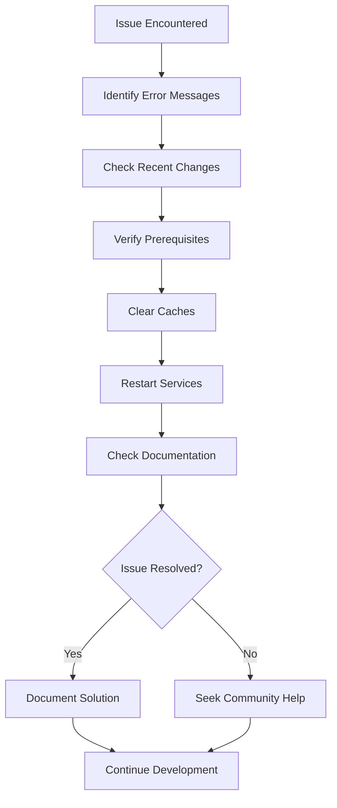

# Section 9: Troubleshooting common setup issues

Even with careful setup, React Native development environments can encounter various issues. This section provides systematic solutions to the most common problems you'll face, helping you maintain a productive development workflow.

## General troubleshooting approach

Before diving into specific issues, follow this systematic approach to diagnose and resolve problems effectively.

### The systematic debugging process



**Step-by-step debugging:**

1. **Read error messages carefully** - They often contain the exact solution
2. **Consider recent changes** - What was the last thing you modified?
3. **Verify prerequisites** - Are all required tools installed and updated?
4. **Clear caches** - Many issues stem from stale cache data
5. **Restart services** - Metro bundler, simulators, and terminals
6. **Check official documentation** - Expo and React Native docs are frequently updated
7. **Search community resources** - Stack Overflow, Expo Discord, GitHub issues

### Information gathering for effective troubleshooting

Before asking for help or diving deep into solutions, gather this essential information:

```bash
# System information
node --version
npm --version
npx expo --version
xcode-select -p

# Project information
npx expo config
npx expo doctor

# Error context
# Copy exact error messages
# Note steps that led to the error
# Document what you've already tried
```

This information helps identify the root cause quickly and provides context for community support.

## Node.js and npm issues

Node.js and npm form the foundation of React Native development. Issues here affect everything else.

### Node.js version conflicts

**Issue**: Project requires different Node.js versions, or global tools stop working after Node.js updates.

**Symptoms:**

- `node: command not found` after switching versions
- Packages fail to install with version-related errors
- Global npm packages don't work

**Solutions:**

1. **Use nvm to manage Node.js versions:**

```bash
# List installed versions
nvm list

# Install and use LTS version
nvm install --lts
nvm use --lts

# Set default version
nvm alias default node
```

2. **Fix npm global packages after Node.js update:**

```bash
# Reinstall npm packages for new Node.js version
nvm use YOUR_NODE_VERSION
npm install -g @expo/cli
```

3. **Verify installation:**

```bash
which node
which npm
node --version
npm --version
```

### npm permission errors

**Issue**: Permission denied errors when installing global packages.

**Symptoms:**

```
npm ERR! Error: EACCES: permission denied
npm ERR! Error: EPERM: operation not permitted
```

**Solutions:**

**Option 1: Configure npm to use different directory (recommended):**

```bash
mkdir ~/.npm-global
npm config set prefix '~/.npm-global'
echo 'export PATH=~/.npm-global/bin:$PATH' >> ~/.zshrc
source ~/.zshrc
```

**Option 2: Fix permissions on npm directory:**

```bash
sudo chown -R $(whoami) $(npm config get prefix)/{lib/node_modules,bin,share}
```

**Option 3: Use npx instead of global installs:**

```bash
# Instead of: npm install -g @expo/cli
# Use: npx @expo/cli@latest COMMAND
```

### npm cache corruption

**Issue**: Package installations fail or produce unexpected results.

**Symptoms:**

- Packages install but don't work correctly
- `npm install` fails with cryptic errors
- Recently installed packages can't be found

**Solutions:**

```bash
# Clear npm cache
npm cache clean --force

# Clear npm cache and verify
npm cache clean --force
npm cache verify

# Remove and reinstall node_modules
rm -rf node_modules package-lock.json
npm install
```

## Expo CLI issues

Expo CLI problems can prevent project creation, development server startup, and command execution.

### Expo CLI installation problems

**Issue**: `expo: command not found` or Expo CLI commands fail to execute.

**Symptoms:**

```bash
expo start
# Command 'expo' not found
```

**Solutions:**

1. **Install latest Expo CLI:**

```bash
npm install -g @expo/cli@latest
```

2. **Verify installation:**

```bash
npx expo --version
which expo
```

3. **Use npx if global installation fails:**

```bash
# Instead of: expo start
# Use: npx expo start
```

4. **Fix PATH issues:**

```bash
# Add npm global binaries to PATH
echo 'export PATH="$(npm config get prefix)/bin:$PATH"' >> ~/.zshrc
source ~/.zshrc
```

### Metro bundler startup failures

**Issue**: Development server fails to start or crashes during startup.

**Symptoms:**

```
Metro bundler failed to start
Port 8081 already in use
Unable to start Metro
```

**Solutions:**

1. **Kill existing Metro processes:**

```bash
# Find processes using port 8081
lsof -ti:8081

# Kill specific process
kill -9 $(lsof -ti:8081)

# Or kill all node processes (more aggressive)
pkill -f node
```

2. **Start with cache clear:**

```bash
npx expo start --clear
```

3. **Use different port:**

```bash
npx expo start --port 8082
```

4. **Reset Metro bundler configuration:**

```bash
npx expo customize metro.config.js
# Then reset to defaults if you modified it
```

### Expo SDK version conflicts

**Issue**: Package versions incompatible with your Expo SDK version.

**Symptoms:**

```
Expo SDK version mismatch
Package X is not compatible with SDK Y
Unable to resolve module
```

**Solutions:**

1. **Check SDK compatibility:**

```bash
npx expo doctor
```

2. **Update to compatible package versions:**

```bash
npx expo install --fix
```

3. **Install packages using Expo CLI:**

```bash
# Always use expo install instead of npm install for RN packages
npx expo install react-navigation/native
```

4. **Update Expo SDK (if needed):**

```bash
npx expo upgrade
```

## iOS Simulator issues

iOS Simulator problems can prevent app testing and development workflow.

### Simulator fails to launch

**Issue**: iOS Simulator doesn't open when requested.

**Symptoms:**

- `expo start` shows iOS option but simulator doesn't launch
- Simulator opens but shows black screen
- Error messages about simulator not found

**Solutions:**

1. **Verify Xcode Command Line Tools:**

```bash
xcode-select -p
# Should show path like /Applications/Xcode.app/Contents/Developer
```

2. **Install/reset Command Line Tools:**

```bash
xcode-select --install
# Or if already installed:
sudo xcode-select --reset
```

3. **Launch simulator manually:**

```bash
open -a Simulator
```

4. **Reset simulator if corrupted:**

```bash
xcrun simctl shutdown all
xcrun simctl erase all
```

### App doesn't load in simulator

**Issue**: Simulator launches but app shows white screen or error.

**Symptoms:**

- Simulator opens successfully
- App icon appears but content doesn't load
- JavaScript bundle loading errors

**Solutions:**

1. **Check Metro bundler logs for errors:**

   - Look at terminal where `expo start` is running
   - Note any red error messages or warnings

2. **Force reload in simulator:**

```bash
# In simulator, press:
Cmd + R
```

3. **Clear app data in simulator:**

   - Long press app icon
   - Select "Delete App"
   - Relaunch from Expo CLI

4. **Restart with cache clear:**

```bash
npx expo start --clear
```

### Simulator performance issues

**Issue**: Simulator runs slowly or becomes unresponsive.

**Solutions:**

1. **Reduce simulator scale:**

   - Window > Scale > 50% or 75%

2. **Close unused simulators:**

   - Quit Simulator app completely when not needed

3. **Free up system resources:**

```bash
# Check memory usage
top -o mem

# Close unnecessary applications
```

4. **Reset simulator:**
   - Hardware > Erase All Content and Settings

## Network connectivity issues

Network problems prevent Expo Go connections and package installations.

### Expo Go can't connect to development server

**Issue**: Physical device can't connect to your development server.

**Symptoms:**

- QR code scanning fails
- "Unable to connect to development server" errors
- App loads but shows connection errors

**Solutions:**

1. **Verify same network:**

   - Computer and device on same WiFi
   - Check network name in device settings

2. **Check firewall settings:**

```bash
# Temporarily disable macOS firewall for testing
sudo /usr/libexec/ApplicationFirewall/socketfilterfw --setglobalstate off
# Remember to re-enable: --setglobalstate on
```

3. **Use tunnel mode:**

```bash
npx expo start --tunnel
```

4. **Check IP address and manual connection:**

```bash
# Get your IP address
ifconfig | grep "inet " | grep -v 127.0.0.1

# Use manual connection in Expo Go with exp://YOUR_IP:8081
```

5. **Reset network settings on device:**
   - Settings > General > Reset > Reset Network Settings

### Package installation timeouts

**Issue**: npm or yarn package installations fail due to network timeouts.

**Symptoms:**

```
npm ERR! network timeout
npm ERR! network request failed
```

**Solutions:**

1. **Increase npm timeout:**

```bash
npm config set timeout 60000
npm config set network-timeout 300000
```

2. **Use different registry:**

```bash
npm config set registry https://registry.npmjs.org/
```

3. **Clear npm cache and retry:**

```bash
npm cache clean --force
npm install
```

4. **Use yarn as alternative:**

```bash
npm install -g yarn
yarn install
```

## Dependency and cache issues

Stale caches and dependency conflicts cause many development problems.

### Module resolution failures

**Issue**: JavaScript modules can't be found or imported.

**Symptoms:**

```
Unable to resolve module 'react-native-paper'
Module not found: Can't resolve './components/Button'
```

**Solutions:**

1. **Clear all caches:**

```bash
# Clear Expo cache
npx expo start --clear

# Clear npm cache
npm cache clean --force

# Clear Watchman cache
watchman watch-del-all

# Clear Metro cache
npx react-native start --reset-cache
```

2. **Reinstall dependencies:**

```bash
rm -rf node_modules package-lock.json
npm install
```

3. **Check import paths:**

```javascript
// Ensure correct relative paths
import Button from "./components/Button"; // ✓
import Button from "components/Button"; // ✗ (unless configured)

// Check case sensitivity
import button from "./Button"; // ✗
import Button from "./Button"; // ✓
```

4. **Verify package installation:**

```bash
# Check if package is actually installed
ls node_modules/react-native-paper

# Reinstall specific package
npx expo install react-native-paper
```

### Package version conflicts

**Issue**: Multiple packages require different versions of the same dependency.

**Symptoms:**

```
npm ERR! peer dep missing
npm ERR! conflicting dependencies
Warning: Package has unmet peer dependencies
```

**Solutions:**

1. **Use Expo CLI for React Native packages:**

```bash
npx expo install package-name
```

2. **Check and resolve peer dependencies:**

```bash
npm ls
# Look for missing or conflicting dependencies
```

3. **Install missing peer dependencies:**

```bash
# Example: if react-navigation requires react-native-screens
npx expo install react-native-screens
```

4. **Use exact versions if needed:**

```bash
npm install package-name@exact-version
```

## Platform-specific issues

Some problems are specific to macOS and iOS development.

### macOS permission issues

**Issue**: Xcode or development tools can't access required resources.

**Symptoms:**

- "Operation not permitted" errors
- Simulator won't launch
- Build processes fail with permission errors

**Solutions:**

1. **Grant Full Disk Access to Terminal:**

   - System Preferences > Security & Privacy > Privacy > Full Disk Access
   - Add Terminal.app and your code editor

2. **Reset Xcode permissions:**

```bash
sudo xcodebuild -license accept
sudo xcode-select --reset
```

3. **Fix npm permissions:**

```bash
sudo chown -R $(whoami) ~/.npm
```

### Storage space issues

**Issue**: Insufficient disk space prevents installations and builds.

**Symptoms:**

```
ENOSPC: no space left on device
npm ERR! write ENOSPC
```

**Solutions:**

1. **Check available space:**

```bash
df -h
```

2. **Clear Expo cache:**

```bash
rm -rf ~/.expo
```

3. **Clear npm cache:**

```bash
npm cache clean --force
```

4. **Remove unused simulators:**

   - Open Xcode > Window > Devices and Simulators
   - Delete old simulator versions

5. **Clean node_modules directories:**

```bash
# Find all node_modules directories
find ~ -name "node_modules" -type d -prune

# Remove node_modules from old projects
rm -rf ~/old-project/node_modules
```

## Emergency recovery procedures

When multiple issues compound, these nuclear options can restore a working environment.

### Complete environment reset

**When to use:** Multiple tools are broken, and individual fixes haven't worked.

```bash
# 1. Remove Node.js and npm completely
# Uninstall nvm or direct Node.js installation
# Follow specific removal instructions for your installation method

# 2. Remove global npm packages
rm -rf ~/.npm

# 3. Remove Expo cache
rm -rf ~/.expo

# 4. Reinstall everything from scratch
# Follow Section 2: Installing Prerequisites again
```

### Project-specific reset

**When to use:** Project-specific issues that don't affect global tools.

```bash
# 1. Clear all project caches
npx expo start --clear
npm cache clean --force
rm -rf .expo

# 2. Remove and reinstall dependencies
rm -rf node_modules package-lock.json
npm install

# 3. Reset git state if needed
git status
git clean -fd

# 4. Restart development server
npx expo start --clear
```

## Prevention strategies

Avoid issues by following these preventive practices.

### Regular maintenance

```bash
# Weekly maintenance routine
npm update -g @expo/cli
npm cache clean --force
npx expo doctor

# Keep dependencies updated
npx expo install --fix
```

### Project hygiene

```bash
# Before major changes
git commit -m "Working state before changes"

# After adding packages
npx expo doctor
npx expo start --clear

# Regular cleanup
rm -rf node_modules package-lock.json
npm install
```

### Documentation practices

Keep a project-specific troubleshooting log:

```markdown
## Project Troubleshooting Log

### Issue: Metro bundler won't start

- **Date**: 2024-01-15
- **Solution**: Killed existing node processes with `pkill -f node`
- **Prevention**: Always quit development server properly

### Issue: Package installation failed

- **Date**: 2024-01-10
- **Solution**: Used `npx expo install` instead of `npm install`
- **Prevention**: Always use Expo CLI for RN packages
```

## Getting help from the community

When troubleshooting alone isn't sufficient, engage the community effectively.

### Preparing for help requests

**Include this information in help requests:**

1. **Environment details:**

```bash
npx expo doctor
node --version
npm --version
```

2. **Exact error messages** (copy-paste, don't screenshot)
3. **Steps to reproduce** the issue
4. **What you've already tried**
5. **Project configuration** (relevant parts of app.json, package.json)

### Best places to get help

- **Expo Discord**: Real-time community support
- **Stack Overflow**: Searchable solutions with `expo` and `react-native` tags
- **GitHub Issues**: For bugs in specific packages
- **Reddit**: r/reactnative for general discussions

## Official documentation

> 📚 **Official Documentation:**
>
> - [Expo Troubleshooting Guide](https://docs.expo.dev/troubleshooting/overview/)
> - [React Native Troubleshooting](https://reactnative.dev/docs/troubleshooting)
> - [Metro Bundler Troubleshooting](https://facebook.github.io/metro/docs/troubleshooting)
> - [iOS Simulator User Guide](https://developer.apple.com/documentation/xcode/running-your-app-in-the-simulator)
>
> 🗂️ **Additional Resources:**
>
> - [Expo Community Discord](https://discord.gg/expo)
> - [React Native Troubleshooting Repository](https://github.com/react-native-community/troubleshooting)

## Next steps

You now have a comprehensive toolkit for diagnosing and resolving common React Native development issues. These troubleshooting skills will serve you throughout your development journey. The next section introduces Expo Snack, a browser-based playground that provides an alternative development environment for learning and experimentation.
