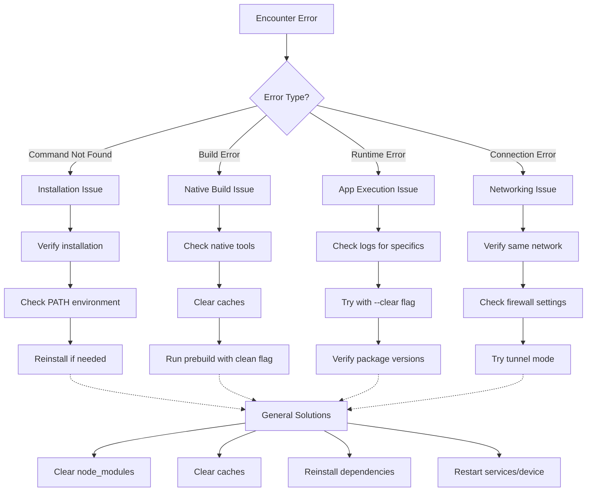

## Section 9: Troubleshooting Common Setup Issues

Setting up a development environment involves several moving parts, and occasionally things don't go perfectly smoothly. This section covers common setup issues and provides troubleshooting steps.

> 🧗‍♀️ **(Self-Led):** Keep this section bookmarked as a reference. When you encounter issues, methodically work through the troubleshooting steps rather than trying random solutions you find online. This systematic approach will save you time in the long run.

### General Troubleshooting Tips

Before diving into specific errors:

1.  **Read the Error Message Carefully:** The terminal output often contains specific file paths, commands that failed, or suggested solutions. Pay close attention!
2.  **Check Versions:** Ensure your tools meet the requirements (See Section 2). Verify with:
    - `node -v`, `npm -v`, `yarn --version`
    - `watchman version` (macOS/Linux)
    - `xcodebuild -version` (macOS - requires full Xcode or CLTs)
    - Check Android Studio SDK Manager for correct SDK Platform/Build Tools versions.
3.  **Clear Caches & Reinstall:** Corrupted caches or dependencies are common culprits.
    - Stop any running servers (Ctrl+C).
    - `rm -rf node_modules`
    - `npm cache clean --force` or `yarn cache clean`
    - `npm install` or `yarn install` (or `npx expo install --fix`)
    - `npx expo start --clear` (Clears Metro cache)
    - `watchman watch-del-all` (Clears Watchman watches)
4.  **Restart:** Restart your terminal, your IDE, Watchman (`watchman shutdown-server`), or even your computer.
5.  **Check Official Docs & GitHub Issues:** Search the Expo documentation, React Native documentation, and the GitHub issues page for the specific library mentioned in the error.

### Troubleshooting Flow Diagram



This diagram illustrates a systematic approach to troubleshooting common React Native and Expo setup issues. By identifying the general category of your error first, you can follow a specific branch of solutions. If those don't work, there are general solutions (clearing caches, reinstalling dependencies, etc.) that often resolve many issues regardless of their type.

### Specific Issues & Solutions

**Issue 1: Command Not Found (`node`, `npm`, `yarn`, `watchman`, `npx`, `expo`, `adb`)**

- **Symptom:** Terminal responds `command not found`.
- **Solutions:**
  - Verify installation (Section 2).
  - Check `PATH` environment variable (restart terminal/system, check `.zshrc`/`.bash_profile`/System Environment Variables). For `adb`, ensure `$ANDROID_SDK_ROOT/platform-tools` is in `PATH`.
  - Check for typos.
  - Run `brew doctor` (macOS) if installed via Homebrew.

**Issue 2: Metro Bundler Fails to Start (`npx expo start`)**

- **Symptom:** Errors on startup (port conflicts, Watchman, module resolution).
- **Solutions:**
  - **Port Conflict (`EADDRINUSE`):** Stop other servers (check ports 8081, 19000-19002). Try `npx expo start --port 8088`. Find conflicting process: `lsof -i :8081` (macOS/Linux) or Resource Monitor (Windows), then `kill <PID>`.
  - **Watchman Errors:** Ensure Watchman is running. Try `watchman watch-del-all`, `brew reinstall watchman` (macOS). For persistent errors on macOS, you might need to increase file watching limits (`sudo launchctl limit maxfiles ...`).
  - **Corrupted Cache/Modules:** See General Tips (Clear Caches & Reinstall).

**Issue 3: Simulator/Emulator Launch Failures**

- **Symptom:** `npx expo run:ios` or `run:android` fails, or pressing `i`/`a` in `expo start` doesn't launch the simulator/emulator.
- **Solutions:**
  - **Verify Setup:** Ensure **full Xcode** (for iOS Sim) or Android Studio (with correct SDKs/AVD) is installed and configured correctly (Section 2).
  - **Launch Manually:** Try opening the Simulator (`open -a Simulator`) or Android Studio AVD Manager and launching an instance directly _before_ running the Expo command.
  - **Resources:** Check for sufficient disk space and RAM.
  - **Corrupted Instance:** (Simulator) `Hardware > Erase All Content and Settings...`; (Emulator) Wipe data via AVD Manager.

**Issue 4: iOS Build Failures (`npx expo run:ios`)**

- **Symptom:** Errors during the native build phase, often mentioning CocoaPods (`pod install`), linking, or signing.
- **Solutions:**
  - **Check Xcode/CLTs:** Ensure full Xcode is installed and selected (`xcode-select -p`).
  - **CocoaPods Issues:** Run `cd ios && pod install --repo-update`. Sometimes `pod deintegrate && pod install` helps.
  - **Signing Errors:** If running on a physical device, ensure your Apple Developer account is set up correctly in Xcode (`Xcode > Settings > Accounts`) and the correct signing certificate/provisioning profile is selected in the project settings (`Xcode > Your Project > Signing & Capabilities`).
  - **Clean Build:** `npx expo prebuild --platform ios --clean` (deletes `ios` folder first), then `npx expo run:ios`. Or, clean the build folder in Xcode (`Product > Clean Build Folder`).

**Issue 5: Android Build Failures (`npx expo run:android`)**

- **Symptom:** Errors during the native build phase, often mentioning Gradle, SDK location, or dependencies.
- **Solutions:**
  - **Verify Android SDK:** Check `ANDROID_SDK_ROOT` environment variable (`echo $ANDROID_SDK_ROOT` or `echo %ANDROID_SDK_ROOT%`). Ensure correct SDK Platform (35) and Build Tools (35.0.0) are installed via SDK Manager.
  - **Gradle Issues:** Try stopping the Gradle Daemon: `cd android && ./gradlew --stop`. Clean the build: `cd android && ./gradlew clean`.
  - **Memory Issues:** If errors mention `OutOfMemoryError` or Java heap space, try increasing Gradle's memory limit. Create/edit `android/gradle.properties` and add/modify `org.gradle.jvmargs=-Xmx4g` (or higher, e.g., `6g`).
  - **Clean Build:** `npx expo prebuild --platform android --clean` (deletes `android` folder), then `npx expo run:android`.

**Issue 6: Expo Go Connection Issues (Physical Device)**

- **Symptom:** Expo Go cannot connect to the development server; QR code scanning fails or hangs.
- **Solutions:**
  - **Same Wi-Fi:** Verify computer and device are on the exact same network.
  - **Network Isolation/Firewall:** Check for router settings (client isolation) or firewalls blocking local connections (ports 8081, 19000-19002).
  - **QR Code Format:** Ensure the QR code starts with `exp://...` (for Expo Go). If it starts with `exp+...://`, you started with `--dev-client`. Use `npx expo start`.
  - **Try Tunnel:** Use `npx expo start --tunnel` to bypass local network issues.
  - **Restart:** Restart Wi-Fi on both devices, restart Expo Go, restart `npx expo start`.

> 📲 **(Native Developers):**
>
> **Comparison:** Many issues mirror native development: PATH problems, port conflicts, SDK/toolchain verification (Xcode, Android SDK), build tool issues (CocoaPods, Gradle), signing complexities. The unique Expo layers are Watchman, Metro cache (`--clear`), Expo Go connection quirks, and the `npx expo install` compatibility layer.
>
> **Key Takeaway:** Apply standard native troubleshooting, plus Expo-specific checks for Metro, Watchman, and dependencies (`expo install`).
>
> **Source:** [Apple Developer: Resolving Common Development Errors](https://developer.apple.com/documentation/xcode/diagnosing-issues-using-crash-reports-and-device-logs/)

> 🌐 **(Web Developers):**
>
> **Comparison:** `command not found` (PATH), port conflicts, cache clearing (`npm cache`), and dependency issues are familiar. The new territory is troubleshooting the native toolchains (Xcode, Android Studio, Simulators, Emulators), native build systems (CocoaPods, Gradle), and device/emulator connectivity issues, which have no direct web equivalent.
>
> **Key Takeaway:** Augment web troubleshooting skills with checks for native tool installations, configurations, and build processes.
>
> **Source:** [Expo Community Forum: Troubleshooting](https://forums.expo.dev/c/help/6)

> [!TIP]
> When asking for help (e.g., on forums or Stack Overflow), provide:
>
> 1.  What you tried (commands, troubleshooting steps).
> 2.  What you expected to happen.
> 3.  What actually happened (copy/paste the _full_ error message and relevant logs).
> 4.  Your environment details (OS, Node version, Expo SDK version, relevant tool versions).

### SpeedyMeds Example Error Scenario

Here's a common scenario you might encounter while developing your SpeedyMeds app:

```bash
# Attempting to add a QR code scanner for medication verification
npx expo install expo-barcode-scanner

# Error in terminal after adding the package
Error: Unable to resolve module 'expo-barcode-scanner' from 'app/screens/MedicationScanScreen.tsx'
```

The typical troubleshooting flow would be:

1. Ensure you used `npx expo install` (not `npm install`) for the package
2. Restart the Metro bundler with `npx expo start --clear`
3. Check if the package was actually added to package.json
4. Run `npm install` or `yarn` to ensure node_modules is fully updated
5. Verify import statement matches the actual package name

### Challenge 3: Environment Setup Verification

This challenge verifies that you have successfully installed all the necessary tools and can run the core commands covered in this module.

[**Challenge 3: Environment Setup Verification (Microsoft Forms)**](https://forms.office.com/Pages/ResponsePage.aspx?id=example-challenge-3-form-id)

In this challenge, you'll complete a checklist and answer questions to confirm that your development environment is properly set up. You'll verify your:

1. Node.js and npm/yarn installation
2. Watchman installation (macOS)
3. Xcode/Command Line Tools setup
4. Android Studio setup (optional)
5. Successful project creation with `create-expo-app`
6. Ability to run the project on iOS Simulator
7. Understanding of key `npx expo` commands

The form includes screenshots demonstrating proper output for various verification commands, allowing you to compare your results.

> 🧑‍🏫 **(Instructor-Led):** Take time in class to go through the verification process together. This will help identify and resolve any lingering setup issues before moving to more complex modules.

> 📚 **Official Documentation:**
>
> - [Expo Docs: Troubleshooting](https://docs.expo.dev/troubleshooting/errors/)
> - [React Native Docs: Troubleshooting](https://reactnative.dev/docs/troubleshooting)
> - [Expo Docs: Continuous Native Generation FAQ](https://docs.expo.dev/workflow/continuous-native-generation/#faq)
> - [Expo Docs: Common Development Errors](https://docs.expo.dev/debugging/common-problems/)
> - [React Native Docs: Known Issues](https://reactnative.dev/docs/known-issues)
