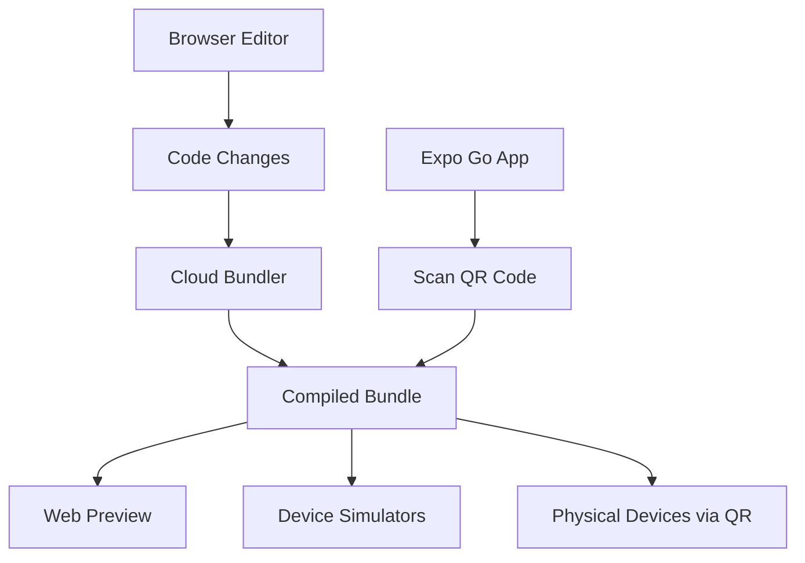

# Section 10: Expo Snack playground

Expo Snack provides a browser-based React Native development environment that requires no local setup. This powerful tool serves as both a learning platform and a quick prototyping environment, complementing your local development setup with instant accessibility and easy sharing capabilities.

## What is Expo Snack?

Expo Snack is a web-based code editor and runtime environment specifically designed for React Native development. Think of it as CodePen or JSFiddle, but for mobile applications. You can write, run, and share React Native code directly in your browser without installing any software.

### Key features and capabilities

**Browser-Based Development:**

- No installation required - works in any modern web browser
- Real-time code execution and preview
- Automatic saving and project management
- Cross-platform compatibility (works on Windows, macOS, Linux)

**Multiple Preview Options:**

- Web preview (runs React Native Web in the browser)
- iOS and Android device simulators (cloud-based)
- QR code scanning for testing on physical devices via Expo Go
- Responsive design testing across different screen sizes

**Collaboration and Sharing:**

- Public and private project options
- Easy sharing via URL links
- Real-time collaboration features
- Embed code in websites and documentation

### How Expo Snack works



When you write code in Expo Snack:

1. **Code Processing**: Your JavaScript/TypeScript code is processed in real-time
2. **Cloud Bundling**: Expo's cloud infrastructure bundles your code using Metro
3. **Multi-Platform Delivery**: The bundled app is delivered to various preview environments
4. **Hot Reloading**: Changes appear instantly across all connected devices and previews

> 🌐 **Web Developers:**
>
> **Comparison:** Expo Snack serves the same role for React Native that CodePen serves for web development - a zero-setup environment for experimentation and sharing. However, it's more powerful because it provides actual mobile app simulation and device testing capabilities.
>
> **Key Takeaway:** You get the rapid iteration benefits of web-based development tools with the authentic mobile development experience.
>
> **Source:** [CodePen for Web Development](https://codepen.io/)

## Getting started with Expo Snack

Accessing and using Expo Snack requires no account creation for basic usage, though signing up provides additional features and project management capabilities.

### Accessing Expo Snack

1. **Open your web browser** and navigate to [snack.expo.dev](https://snack.expo.dev)
2. **Choose a template** or start with the default React Native template
3. **Start coding immediately** - no setup or configuration required

### Creating your first Snack

Let's create a simple SpeedyMeds-themed component to understand the Snack workflow:

1. **Navigate to Expo Snack** in your browser
2. **Replace the default App.js content** with this pharmacy-themed example:

```javascript
import React, { useState } from "react";
import {
  StyleSheet,
  Text,
  View,
  TouchableOpacity,
  FlatList,
} from "react-native";

const medications = [
  { id: 1, name: "Aspirin", dosage: "325mg", inStock: true },
  { id: 2, name: "Ibuprofen", dosage: "200mg", inStock: false },
  { id: 3, name: "Acetaminophen", dosage: "500mg", inStock: true },
];

export default function App() {
  const [selectedMed, setSelectedMed] = useState(null);

  const renderMedication = ({ item }) => (
    <TouchableOpacity
      style={[styles.medicationCard, !item.inStock && styles.outOfStock]}
      onPress={() => setSelectedMed(item)}
    >
      <Text style={styles.medicationName}>{item.name}</Text>
      <Text style={styles.dosage}>{item.dosage}</Text>
      <Text
        style={[
          styles.stockStatus,
          { color: item.inStock ? "#4CAF50" : "#F44336" },
        ]}
      >
        {item.inStock ? "In Stock" : "Out of Stock"}
      </Text>
    </TouchableOpacity>
  );

  return (
    <View style={styles.container}>
      <Text style={styles.title}>SpeedyMeds Inventory</Text>

      <FlatList
        data={medications}
        renderItem={renderMedication}
        keyExtractor={(item) => item.id.toString()}
        style={styles.list}
      />

      {selectedMed && (
        <View style={styles.selectedInfo}>
          <Text style={styles.selectedTitle}>Selected:</Text>
          <Text style={styles.selectedText}>
            {selectedMed.name} - {selectedMed.dosage}
          </Text>
        </View>
      )}
    </View>
  );
}

const styles = StyleSheet.create({
  container: {
    flex: 1,
    backgroundColor: "#f5f5f5",
    paddingTop: 50,
    paddingHorizontal: 20,
  },
  title: {
    fontSize: 24,
    fontWeight: "bold",
    color: "#2196F3",
    marginBottom: 20,
    textAlign: "center",
  },
  list: {
    flex: 1,
  },
  medicationCard: {
    backgroundColor: "white",
    padding: 16,
    marginVertical: 8,
    borderRadius: 8,
    elevation: 2,
    shadowColor: "#000",
    shadowOffset: { width: 0, height: 2 },
    shadowOpacity: 0.1,
    shadowRadius: 4,
  },
  outOfStock: {
    backgroundColor: "#ffebee",
  },
  medicationName: {
    fontSize: 18,
    fontWeight: "bold",
    color: "#333",
  },
  dosage: {
    fontSize: 14,
    color: "#666",
    marginTop: 4,
  },
  stockStatus: {
    fontSize: 12,
    fontWeight: "bold",
    marginTop: 8,
  },
  selectedInfo: {
    backgroundColor: "#e3f2fd",
    padding: 16,
    borderRadius: 8,
    marginTop: 16,
  },
  selectedTitle: {
    fontSize: 16,
    fontWeight: "bold",
    color: "#1976d2",
  },
  selectedText: {
    fontSize: 14,
    color: "#333",
    marginTop: 4,
  },
});
```

3. **Observe the real-time preview** as you type
4. **Test interactions** by clicking on medication cards in the preview
5. **Experiment with modifications** to see immediate updates

This example demonstrates React Native core concepts like state management, list rendering, conditional styling, and touch interactions - all running directly in your browser.

## Snack interface and features

Understanding the Snack interface helps you use it effectively for development and learning.

### Main interface components

**Code Editor (Left Panel):**

- Syntax highlighting for JavaScript, TypeScript, and JSON
- Auto-completion for React Native APIs and Expo SDK modules
- Error highlighting and basic linting
- File tree for managing multiple files
- Import suggestions for available packages

**Preview Area (Right Panel):**

- Web preview showing your app running in React Native Web
- Device selector (iPhone, Android, web browser sizes)
- Zoom controls for different screen densities
- Refresh and reload controls

**Console and Logs (Bottom Panel):**

- JavaScript console output (`console.log` statements)
- Error messages and stack traces
- Build logs and bundling information
- Network request logs

### Available preview modes

**Web Preview:**

- Runs using React Native Web
- Great for layout and logic testing
- Some native features may not work identically
- Supports responsive design testing

**iOS Simulator (Cloud-based):**

- Actual iOS environment running in Expo's cloud
- More accurate than web preview for iOS-specific behavior
- Limited usage time for free accounts
- May have slight latency due to cloud hosting

**Android Simulator (Cloud-based):**

- Android emulator running in the cloud
- Tests Android-specific behaviors and styling
- Similar limitations to iOS cloud simulator

**Physical Device Testing:**

- QR code generated for Expo Go app
- Most accurate testing environment
- Requires Expo Go app installed on device
- Works with same network connectivity as local development

## When to use Expo Snack

Expo Snack excels in specific scenarios while having limitations in others. Understanding these helps you choose the right tool for your needs.

### Ideal use cases

**Learning and Experimentation:**

- Following tutorials and courses (like this one!)
- Testing new React Native concepts
- Prototyping UI components quickly
- Experimenting with Expo SDK modules

**Sharing and Collaboration:**

- Sharing code examples with teammates
- Creating reproducible bug reports
- Building interactive documentation
- Collaborating on proof-of-concepts

**Quick Prototyping:**

- Validating app ideas rapidly
- Creating mockups for stakeholder review
- Testing third-party package integration
- Building demonstration applications

**Education and Training:**

- Instructor demonstrations without setup requirements
- Student exercises that work immediately
- Workshop environments without installation overhead
- Code examples embedded in course materials

### Limitations and considerations

**Performance Constraints:**

- Cloud bundling may be slower than local development for large projects
- Limited computational resources compared to local machines
- Network latency affects real-time preview responsiveness

**Feature Limitations:**

- Cannot install arbitrary npm packages (limited to Expo SDK and approved packages)
- No access to custom native modules or platform-specific code
- Limited debugging capabilities compared to local development tools
- File system access restrictions

**Dependency Restrictions:**

- Only packages compatible with Expo managed workflow
- Cannot add custom babel plugins or Metro configuration
- Limited TypeScript configuration options
- No access to native iOS/Android project files

**Storage and Persistence:**

- Free accounts have project count limitations
- Projects may be subject to cleanup policies
- No local file storage - everything is cloud-based

## Working with packages in Snack

Expo Snack provides access to a curated set of packages that work well in the managed workflow environment.

### Available package categories

**Expo SDK Modules:**

```javascript
// All Expo SDK packages are available
import { Camera } from "expo-camera";
import * as Location from "expo-location";
import { Audio } from "expo-av";
import * as FileSystem from "expo-file-system";
```

**React Navigation:**

```javascript
// Full React Navigation ecosystem
import { NavigationContainer } from "@react-navigation/native";
import { createStackNavigator } from "@react-navigation/stack";
import { createBottomTabNavigator } from "@react-navigation/bottom-tabs";
```

**Popular UI Libraries:**

```javascript
// UI component libraries
import { Button, Card } from "react-native-paper";
import { Input, ListItem } from "react-native-elements";
```

**Utility Libraries:**

```javascript
// JavaScript utilities that don't require native code
import moment from "moment";
import axios from "axios";
import lodash from "lodash";
```

### Installing packages in Snack

1. **Click the "+" button** next to dependencies in the file tree
2. **Search for packages** using the package search interface
3. **Select the package** from the search results
4. **Import and use** in your code immediately

The package manager automatically handles version compatibility with the Expo SDK version used by Snack.

## Collaboration and sharing features

Expo Snack's sharing capabilities make it excellent for collaborative development and education.

### Sharing projects

**Public Sharing:**

- Generate public URLs that anyone can access
- Projects are publicly discoverable on Expo's platform
- Perfect for documentation and tutorial examples

**Private Sharing:**

- Share private project URLs with specific people
- Requires Expo account for private project creation
- Suitable for team collaboration and client reviews

**Embedding:**

- Embed Snacks directly into websites and documentation
- Customizable iframe dimensions and features
- Great for interactive tutorials and code examples

### Collaboration workflows

**Real-time Collaboration:**

- Multiple users can edit the same Snack simultaneously
- Changes appear in real-time for all collaborators
- Useful for pair programming and code reviews

**Forking and Remixing:**

- Create personal copies of existing Snacks
- Modify shared examples for your own purposes
- Build upon community-contributed examples

**Version History:**

- Automatic saving preserves project history
- Revert to previous versions when needed
- Track changes and development progress

## Integration with local development

Expo Snack complements rather than replaces local development, providing value throughout your development journey.

### Using Snack alongside local development

**Rapid Prototyping Workflow:**

1. **Start ideas in Snack** for quick validation
2. **Export successful prototypes** to local development
3. **Continue development locally** with full tooling capabilities
4. **Return to Snack** for sharing and demonstrations

**Learning and Reference:**

- Use Snack for following tutorials
- Test concepts before implementing locally
- Create reference implementations for complex features
- Build example libraries for your team

**Bug Reproduction:**

- Create minimal reproducible examples in Snack
- Share with community for support
- Isolate issues from larger local projects
- Test potential solutions quickly

### Exporting from Snack to local

When your Snack project outgrows the platform's capabilities:

1. **Download project files** using the download option
2. **Create new local Expo project** using `create-expo-app`
3. **Copy relevant code** from Snack to local project
4. **Install additional dependencies** as needed for expanded functionality
5. **Continue development** with full local tooling

## Best practices for using Snack

Maximize your Snack experience by following these established patterns and practices.

### Code organization

**Keep components small and focused:**

```javascript
// Good: Single, focused component
const MedicationCard = ({ medication, onPress }) => {
  return (
    <TouchableOpacity onPress={() => onPress(medication)}>
      <Text>{medication.name}</Text>
    </TouchableOpacity>
  );
};

// Avoid: Large, monolithic components
```

**Use clear naming conventions:**

```javascript
// Descriptive component and variable names
const PharmacyInventoryScreen = () => {
  /* ... */
};
const availableMedications = medications.filter((med) => med.inStock);
```

**Organize imports logically:**

```javascript
// React and React Native imports first
import React, { useState } from "react";
import { View, Text, FlatList } from "react-native";

// Third-party libraries next
import { Button } from "react-native-paper";

// Local components last (when using multiple files)
import MedicationCard from "./MedicationCard";
```

### Performance considerations

**Optimize for quick loading:**

- Keep individual Snacks under 100 KB when possible
- Avoid importing large libraries unless necessary
- Use efficient data structures and algorithms
- Minimize complex computations in render methods

**Efficient state management:**

```javascript
// Good: Minimal state updates
const [selectedId, setSelectedId] = useState(null);

// Avoid: Frequent large object updates
const [allData, setAllData] = useState(largeComplexObject);
```

### Documentation and comments

**Include helpful comments:**

```javascript
/**
 * SpeedyMeds Medication Inventory Component
 *
 * Displays a list of medications with stock status
 * Allows selection of individual medications
 */
export default function MedicationInventory() {
  // Track which medication is currently selected
  const [selectedMed, setSelectedMed] = useState(null);

  // ... rest of component
}
```

**Use meaningful variable names:**

```javascript
// Clear and descriptive
const availableMedications = medications.filter((med) => med.inStock);
const outOfStockCount = medications.filter((med) => !med.inStock).length;

// Avoid unclear abbreviations
const availMeds = meds.filter((m) => m.stock);
```

## Official documentation

> 📚 **Official Documentation:**
>
> - [Expo Snack Documentation](https://docs.expo.dev/workflow/snack/)
> - [Expo SDK Reference](https://docs.expo.dev/versions/latest/)
> - [React Native Web Documentation](https://necolas.github.io/react-native-web/)
> - [Expo Snack Feature Guide](https://blog.expo.dev/expo-snack-features-and-capabilities)
>
> 🗂️ **Additional Resources:**
>
> - [Expo Snack Gallery](https://snack.expo.dev/@expo/gallery) - Community examples
> - [React Native Examples in Snack](https://snack.expo.dev/@expo/react-native-examples)

## Module summary

Congratulations! You've successfully completed Module 3 and established a comprehensive React Native development environment with Expo. You now have multiple tools at your disposal for React Native development:

**Local Development Environment:**

- Complete Node.js, npm, and Expo CLI setup
- iOS Simulator for authentic device testing
- Understanding of project structure and essential commands
- Troubleshooting skills for common issues

**Cloud-Based Development:**

- Expo Snack for rapid prototyping and experimentation
- Browser-based development without setup requirements
- Sharing and collaboration capabilities

**Physical Device Testing:**

- Expo Go for real device testing and validation
- Network connectivity and troubleshooting knowledge

This comprehensive toolkit provides flexibility to work in various environments and situations. Whether you're learning new concepts in Snack, developing features locally with full tooling, or testing on real devices, you have the knowledge and tools to be productive.

The environment you've set up will serve as the foundation for all remaining modules in this course. As you progress through React Native core concepts, styling, navigation, and state management, you'll leverage these tools to build increasingly sophisticated applications.

## Next steps

With your development environment complete, you're ready to dive into React Native development fundamentals. The next module will begin your journey into React Native-specific concepts, building upon the solid foundation you've established here.

**[Environment Setup Verification Challenge](https://forms.microsoft.com/r/MODULE3CHALLENGE)** - Complete this comprehensive checklist and knowledge verification to ensure your development environment is properly configured and you understand the key concepts covered in this module.
