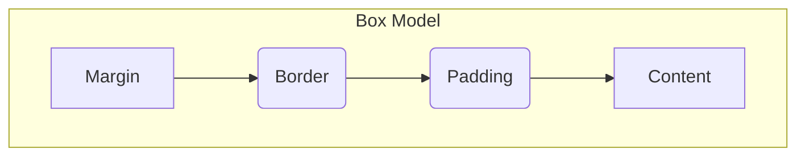

## Section 2: Core CSS Concepts (Brief Review)

This section reviews fundamental CSS (Cascading Style Sheets) concepts, with a particular emphasis on Flexbox for layout. CSS is used to style HTML documents, controlling aspects like color, font, spacing, and positioning. While React Native uses a JavaScript-based styling system (`StyleSheet`), it borrows heavily from CSS principles, especially Flexbox.

> [!TIP]
> If you're experienced with CSS and Flexbox, skim this section, focusing on the Background Bridge Notes that compare web CSS with React Native's `StyleSheet` and layout system.

### Conceptual Content

#### CSS Selectors

Selectors are patterns used to target specific HTML elements for styling.

- **Element Selector:** Targets all elements of a specific type (e.g., `p` targets all `<p>` elements).
- **Class Selector:** Targets elements with a specific `class` attribute (e.g., `.highlight` targets `<div class="highlight">`).
- **ID Selector:** Targets a single element with a specific `id` attribute (e.g., `#main-content` targets `<div id="main-content">`).

#### The Box Model

The CSS box model describes how elements are rendered as rectangular boxes. Each box consists of:

- **Content:** The actual content (text, image).
- **Padding:** Transparent space around the content, inside the border.
- **Border:** A line surrounding the padding and content.
- **Margin:** Transparent space around the border, separating the element from others.



_Diagram: Conceptual layout of the CSS Box Model._ This diagram shows the layers of the box model, starting from the outer margin and moving inwards through the border and padding to the central content area.

Understanding the box model is crucial for controlling element size and spacing.

#### Layout with Flexbox

Flexbox (Flexible Box Layout) is a one-dimensional layout model designed for distributing space among items in an interface and aligning them. It's the **primary layout system in React Native**.

Key concepts:

- **Flex Container:** An element designated as a flex container (e.g., using `display: flex;` in CSS). Its direct children become flex items.
- **Flex Items:** The children of a flex container.
- **Main Axis:** The primary direction along which flex items are laid out (row or column).
- **Cross Axis:** The axis perpendicular to the main axis.

**Common Flex Container Properties (CSS):**

- `display: flex;`: Enables Flexbox layout for the container.
- `flex-direction`: Defines the main axis (`row` (default), `row-reverse`, `column`, `column-reverse`).
- `justify-content`: Aligns items along the main axis (`flex-start`, `flex-end`, `center`, `space-between`, `space-around`, `space-evenly`).
- `align-items`: Aligns items along the cross axis (`stretch`, `flex-start`, `flex-end`, `center`, `baseline`).
- `flex-wrap`: Controls whether items wrap onto multiple lines (`nowrap` (default), `wrap`, `wrap-reverse`).
- `align-content`: Aligns wrapped lines along the cross axis (similar values to `justify-content`).

**Common Flex Item Properties (CSS):**

- `flex-grow`: Defines the ability for an item to grow if necessary (takes a unitless proportion).
- `flex-shrink`: Defines the ability for an item to shrink if necessary.
- `flex-basis`: Defines the default size of an item before remaining space is distributed.
- `flex`: Shorthand for `flex-grow`, `flex-shrink`, and `flex-basis`.
- `align-self`: Overrides the container's `align-items` for a single item.

```mermaid
graph TD
    subgraph Flex Container (flex-direction: row)
        direction LR
        A[Item 1] --> B[Item 2] --> C[Item 3]
    end
    subgraph Main Axis (Horizontal)
        direction LR
        D( ) --- E( )
    end
    subgraph Cross Axis (Vertical)
        direction TB
        F( ) --- G( )
    end
    FlexContainer -- Main Axis --> MainAxis
    FlexContainer -- Cross Axis --> CrossAxis
```

_Diagram: Simplified Flexbox Axes with `flex-direction: row`._ This flowchart shows three flex items arranged horizontally within a container when the main axis is set to `row`. The main axis runs horizontally, and the cross axis runs vertically.

Flexbox provides powerful and efficient control over layout, making it ideal for dynamic UIs.

> 📚 **Official Documentation:**
>
> - [MDN Web Docs: CSS Box Model](https://developer.mozilla.org/en-US/docs/Learn/CSS/Building_blocks/The_box_model)
> - [MDN Web Docs: CSS Selectors](https://developer.mozilla.org/en-US/docs/Learn/CSS/Building_blocks/Selectors)
> - [MDN Web Docs: Flexbox](https://developer.mozilla.org/en-US/docs/Web/CSS/CSS_Flexible_Box_Layout/Basic_Concepts_of_Flexbox)
> - [CSS-Tricks: A Complete Guide to Flexbox](https://css-tricks.com/snippets/css/a-guide-to-flexbox/)

> 📲 **(Native Developers):**
>
> **Comparison:** CSS Selectors are conceptually similar to how you might find views by ID or tag in native code. The Box Model is analogous to properties like padding and margins on native views. Flexbox is very similar to layout systems like `ConstraintLayout` (Android) or Auto Layout using `UIStackView` (iOS), but often simpler for one-dimensional arrangements. React Native adopts Flexbox as its _default_ layout system, unlike native platforms which offer multiple systems.
>
> **Key Takeaway:** CSS concepts like spacing (box model) and layout (Flexbox) have direct parallels in React Native, with Flexbox being the dominant layout mechanism you'll use.

> 🌐 **(Web Developers):**
>
> **Comparison:** Selectors, the Box Model, and Flexbox are familiar. The main differences in React Native are: styling is done via JavaScript objects (`StyleSheet`) not separate CSS files; property names use camelCase (e.g., `flexDirection` instead of `flex-direction`); there is no cascading or inheritance in the same way as web CSS; and Flexbox is the default (`display: flex` is implied for `<View>`). `flexDirection` defaults to `column` in React Native, unlike the web's default of `row`.
>
> **Key Takeaway:** Your CSS knowledge, especially Flexbox, is highly transferable, but be mindful of the syntax differences (JS objects, camelCase) and the slightly different defaults and behavior (no cascade, default `flexDirection: 'column'`).

### Procedural Content

#### Basic Flexbox Example (HTML/CSS)

This simple example shows a container with three items laid out horizontally using Flexbox.

**HTML:**

```html
<div class="container">
  <div class="item item-1">Item 1 (Grows)</div>
  <div class="item item-2">Item 2</div>
  <div class="item item-3">Item 3</div>
</div>
```

**CSS:**

```css
.container {
  display: flex; /* Enable Flexbox */
  flex-direction: row; /* Arrange items horizontally (web default) */
  border: 1px solid black;
  padding: 10px;
  height: 100px;
  align-items: center; /* Center items vertically */
}

.item {
  padding: 10px;
  margin: 5px;
  background-color: lightblue;
  border: 1px solid blue;
  text-align: center;
}

.item-1 {
  flex-grow: 1; /* Allow this item to take up available space */
  background-color: lightcoral;
}

.item-2 {
  flex-shrink: 0; /* Prevent this item from shrinking */
}

.item-3 {
  align-self: flex-end; /* Align this specific item to the bottom */
}
```

**Explanation (approx. 100 words):**

The `.container` div is set to `display: flex`, making its children (`.item` divs) flex items. `flex-direction: row` arranges them horizontally. `align-items: center` vertically centers the items within the container's height. Item 1 (`.item-1`) has `flex-grow: 1`, allowing it to expand and fill any extra horizontal space. Item 2 (`.item-2`) has `flex-shrink: 0`, preventing it from shrinking if space is limited. Item 3 (`.item-3`) uses `align-self: flex-end` to override the container's `align-items` and position itself at the bottom of the cross axis.

### Exercise

Apply these basic HTML and CSS concepts.

**(https://codesandbox.io/p/sandbox/module-4-exercise-1-basic-html-css-placeholder-j9krzr)** (Note: Replace with actual CodeSandbox link when created)

### Next Steps

With a refresher on HTML structure and CSS layout (especially Flexbox), we can now explore how these concepts are directly mapped and utilized within the React Native framework.
