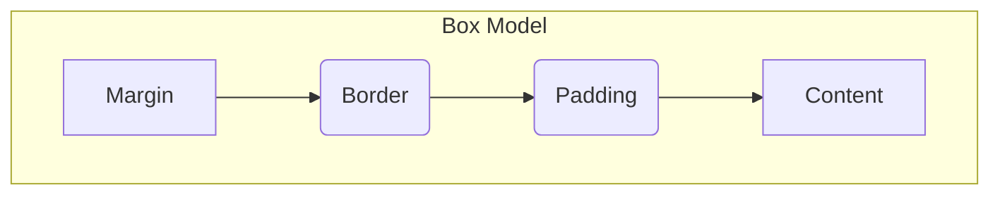

## Section 2: Core CSS Concepts (Brief Review)

This section reviews fundamental CSS (Cascading Style Sheets) concepts, with a particular emphasis on Flexbox for layout. CSS is used to style HTML documents, controlling aspects like color, font, spacing, and positioning. While React Native uses a JavaScript-based styling system (`StyleSheet`), it borrows heavily from CSS principles, especially Flexbox.

> [!TIP]
> If you're experienced with CSS and Flexbox, skim this section, focusing on the Background Bridge Notes that compare web CSS with React Native's `StyleSheet` and layout system.

#### A Brief History of CSS

Initially, web styling was mixed with HTML. To separate structure from presentation, CSS was proposed by Håkon Wium Lie in 1994. CSS Level 1 (1996) introduced basic styling. CSS Level 2 (1998) added positioning and media types. CSS Level 3, developed modularly since 1999, introduced features like advanced selectors, Flexbox, Grid, transitions, and animations, allowing CSS to evolve more rapidly. The W3C continues to maintain CSS standards.

#### CSS Rules: Selectors and Declarations

A CSS rule consists of a **selector** and a **declaration block** `{}`. The selector targets HTML elements, and the block contains **declarations** (property-value pairs like `color: blue;`) defining the styles.

#### Selectors

Selectors are patterns used to target specific HTML elements for styling.

- **Type/Element Selector:** Targets elements by tag name (e.g., `p` targets all `<p>` elements).
- **Class Selector:** Targets elements with a specific `class` attribute, prefixed with `.` (e.g., `.highlight`).
- **ID Selector:** Targets a single element with a specific `id` attribute, prefixed with `#` (e.g., `#main-content`). IDs must be unique.
- **Attribute Selector:** Matches elements based on attributes (e.g., `input[type="text"]`).
- **Universal Selector:** Matches any element (`*`).
- **Combinators:** Define relationships between selectors:
  - Descendant (space): `article p` (selects `<p>` inside `<article>`).
  - Child (`>`): `ul > li` (selects `<li>` directly inside `<ul>`).
  - Adjacent Sibling (`+`): `h2 + p` (selects first `<p>` immediately after `<h2>`).
  - General Sibling (`~`): `h2 ~ p` (selects all `<p>` siblings following `<h2>`).
- **Pseudo-classes:** Select elements based on state (e.g., `:hover`, `:focus`, `:nth-child()`).
- **Pseudo-elements:** Style parts of an element (e.g., `::before`, `::after`, `::first-line`).

#### The Cascade Algorithm

The "Cascading" in CSS refers to how browsers resolve conflicts when multiple rules target the same element and property. Styles originate from:

1.  **User-agent Stylesheets:** Browser defaults.
2.  **User Stylesheets:** Custom user styles (often for accessibility).
3.  **Author Stylesheets:** Styles written by the developer (most common).

The cascade assigns precedence based on **origin** and **importance** (`!important` flag). The simplified order (lowest to highest priority) is generally:

1.  User-agent normal
2.  User normal
3.  Author normal
4.  Author `!important`
5.  User `!important`
6.  User-agent `!important`

(Animations and transitions have specific interactions with this order).
Author styles override browser defaults, but user `!important` styles can override author `!important` styles, giving users final control for accessibility.

#### Specificity: Winning the Style War

When rules have the same origin and importance, **specificity** determines the winner. It's a weight calculated from the selector's components.

**Calculation (Conceptual Columns: ID-Class-Type):**

- **Inline Styles:** Applied via `style="..."` have the highest specificity (effectively `1-0-0-0`, considered separately).
- **IDs:** Each `#id` adds 1 to the ID column.
- **Classes, Attributes, Pseudo-classes:** Each `.class`, `[attribute]`, or `:pseudo-class` adds 1 to the Class column.
- **Types, Pseudo-elements:** Each `element` or `::pseudo-element` adds 1 to the Type column.
- **Zero Specificity:** `*`, combinators (`>`, `+`, `~`, space), and `:where()` contribute nothing.

Compare values from left to right (ID > Class > Type). The selector with a higher value in the most significant column wins. If specificities are equal, the last rule declared in the CSS source order wins.

> [!CAUTION]
> Avoid overusing `!important`. It breaks the natural cascade and makes debugging much harder. Reserve it for specific overrides or temporary debugging.

**Table: CSS Specificity Calculation Examples**

This table shows conceptual specificity values for comparing rules.

| Selector Type                       | Conceptual Value (ID-Class-Type) | Example Selector                      | Calculated Value (ID-Class-Type) |
| ----------------------------------- | -------------------------------- | ------------------------------------- | -------------------------------- |
| ID                                  | `0-1-0-0`                        | `#myId`                               | `1-0-0`                          |
| Class                               | `0-0-1-0`                        | `.myClass`                            | `0-1-0`                          |
| Attribute                           | `0-0-1-0`                        | `[type="text"]`                       | `0-1-0`                          |
| Pseudo-class                        | `0-0-1-0`                        | `:hover`                              | `0-1-0`                          |
| Type                                | `0-0-0-1`                        | `div`                                 | `0-0-1`                          |
| Pseudo-element                      | `0-0-0-1`                        | `::before`                            | `0-0-1`                          |
| Complex                             | -                                | `nav#mainNav > ul.navList li a:hover` | `1-2-3`                          |
| Universal / Combinator / `:where()` | `0-0-0-0`                        | `*`, `>`, `+`, `:where(.info)`        | `0-0-0`                          |

_Note: Inline styles (via the `style` attribute) have higher specificity than any selector but are not shown in the ID-Class-Type calculation._

#### The Box Model

The CSS box model describes how elements are rendered as rectangular boxes. Each box consists of concentric layers:

- **Content:** The actual content (text, image).
- **Padding:** Transparent space around the content, inside the border.
- **Border:** A line surrounding the padding and content.
- **Margin:** Transparent space around the border, separating the element from others.



_Diagram: Conceptual layout of the CSS Box Model._ This diagram visually represents the layered structure of the CSS Box Model, which is fundamental to understanding how elements occupy space and how spacing is controlled on a webpage. At the very center is the **Content** area, which holds the actual text, images, or other media. Surrounding the content is the **Padding**, an optional transparent space that provides an inner cushion between the content and its border. The **Border** itself is a line that can be styled with various thicknesses, styles (solid, dashed, etc.), and colors, defining the visible edge of the element. Finally, the outermost layer is the **Margin**, another transparent space that separates this element from any adjacent elements on the page. Understanding these distinct layers—Content, Padding, Border, and Margin—and how their sizes interact (especially with the `box-sizing` property) is critical for precise layout and spacing in web design, a concept that also heavily influences React Native styling.

Understanding the box model is crucial for controlling element size and spacing.

**`box-sizing` Property:**

- `content-box` (default): `width` and `height` apply only to the content area. Total width = `width` + `padding` + `border`.
- `border-box`: `width` and `height` include content, padding, and border. The content area shrinks to accommodate padding/border. This is often considered more intuitive for layout.

**Margin Collapsing:**
Vertical margins (top/bottom) of adjacent block-level boxes can collapse into a single margin (usually the size of the larger margin). This occurs only vertically under specific conditions.

#### Layout with Flexbox

Flexbox (Flexible Box Layout) is a one-dimensional layout model designed for distributing space among items in an interface and aligning them. It's the **primary layout system in React Native**.

Key concepts:

- **Flex Container:** An element with `display: flex;` (or `display: inline-flex;` on the web). Its direct children become flex items.
- **Flex Items:** The children of a flex container.
- **Axes:**
  - **Main Axis:** Primary axis for layout (defined by `flex-direction`).
  - **Cross Axis:** Perpendicular to the main axis.

**Key Flexbox Properties (CSS):**

- **Container Properties:**
  - `display: flex;`: Enables Flexbox.
  - `flex-direction`: `row` (default), `row-reverse`, `column`, `column-reverse` (Defines main axis).
  - `justify-content`: Alignment along Main Axis (`flex-start`, `flex-end`, `center`, `space-between`, `space-around`, `space-evenly`).
  - `align-items`: Alignment along Cross Axis (`stretch` (default), `flex-start`, `flex-end`, `center`, `baseline`).
  - `flex-wrap`: Item wrapping (`nowrap` (default), `wrap`, `wrap-reverse`).
  - `align-content`: Alignment of wrapped lines along Cross Axis (`stretch` (default), `flex-start`, `flex-end`, `center`, `space-between`, `space-around`).
- **Item Properties:**
  - `flex-grow`: Ability to grow (unitless proportion, default 0).
  - `flex-shrink`: Ability to shrink (unitless proportion, default 1).
  - `flex-basis`: Default size before distributing space (`auto`, length, percentage).
  - `flex`: Shorthand for `flex-grow`, `flex-shrink`, `flex-basis`.
  - `align-self`: Overrides container's `align-items` for a single item (`auto`, `stretch`, `flex-start`, `flex-end`, `center`, `baseline`).

**Table: Common CSS Flexbox Alignment Properties**

This table summarizes key properties for positioning items.

| Property          | Controls Alignment/Distribution On | Key Values                                                                          | Effect                                                                            |
| ----------------- | ---------------------------------- | ----------------------------------------------------------------------------------- | --------------------------------------------------------------------------------- |
| `flex-direction`  | Main Axis Direction                | `row`, `column`, `row-reverse`, `column-reverse`                                    | Sets the flow direction. Default: `row`.                                          |
| `justify-content` | Main Axis                          | `flex-start`, `flex-end`, `center`, `space-between`, `space-around`, `space-evenly` | Distributes space along main axis. Default: `flex-start`.                         |
| `align-items`     | Cross Axis (single line)           | `stretch`, `flex-start`, `flex-end`, `center`, `baseline`                           | Aligns items along cross axis. Default: `stretch`.                                |
| `align-content`   | Cross Axis (multiple lines)        | `stretch`, `flex-start`, `flex-end`, `center`, `space-between`, `space-around`      | Aligns wrapped lines along cross axis (requires `flex-wrap`). Default: `stretch`. |
| `align-self`      | Cross Axis (single item)           | `auto`, `stretch`, `flex-start`, `flex-end`, `center`, `baseline`                   | Overrides `align-items` for one item. Default: `auto`.                            |
| `flex-wrap`       | Item Wrapping                      | `nowrap`, `wrap`, `wrap-reverse`                                                    | Controls if items wrap. Default: `nowrap`.                                        |

Flexbox provides powerful and efficient control over layout, making it ideal for dynamic UIs and responsive design.

#### Under the Hood: How Browsers Apply CSS

After building the DOM from HTML, browsers process CSS:

1.  **Fetch & Parse CSS:** Load CSS from `<link>`, `<style>`, or `style` attributes.
2.  **Tokenization & CSSOM Construction:** Parse CSS text into tokens, then build the **CSS Object Model (CSSOM)**, a tree representing selectors and styles.
3.  **Style Calculation:** Combine DOM and CSSOM. For each DOM element, determine computed styles using cascade, specificity, and inheritance. Relative units become pixels.
4.  **Render Tree Construction:** Create a tree of only visible elements (excluding `display: none`) with their computed styles.
5.  **Layout (Reflow):** Calculate the exact size and position of each Render Tree node based on the box model, positioning, and layout modes (like Flexbox).
6.  **Painting:** Draw the pixels for each visible element (text, colors, borders, images) onto the screen, potentially in layers.
7.  **Compositing:** Combine painted layers into the final screen image. Changes affecting layout trigger reflow and repaint; appearance-only changes may only trigger repaint.

> 📚 **Official Documentation:**
>
> - [MDN Web Docs: CSS Selectors](https://developer.mozilla.org/en-US/docs/Web/CSS/CSS_selectors)
> - [MDN Web Docs: The Cascade](https://developer.mozilla.org/en-US/docs/Web/CSS/Cascade)
> - [MDN Web Docs: Specificity](https://developer.mozilla.org/en-US/docs/Web/CSS/Specificity)
> - [MDN Web Docs: Introduction to the CSS Box Model](https://developer.mozilla.org/en-US/docs/Learn/CSS/Building_blocks/The_box_model)
> - [MDN Web Docs: box-sizing](https://developer.mozilla.org/en-US/docs/Web/CSS/box-sizing)
> - [MDN Web Docs: CSS Flexible Box Layout (Flexbox)](https://developer.mozilla.org/en-US/docs/Web/CSS/CSS_Flexible_Box_Layout)
> - [MDN Web Docs: Basic Concepts of Flexbox](https://developer.mozilla.org/en-US/docs/Web/CSS/CSS_Flexible_Box_Layout/Basic_Concepts_of_Flexbox)
> - [CSS-Tricks: A Complete Guide to Flexbox](https://css-tricks.com/snippets/css/a-guide-to-flexbox/)
> - [MDN Web Docs: Introduction to how browsers work](https://developer.mozilla.org/en-US/docs/Learn/Common_questions/How_browsers_work)

> 📲 **(Native Developers):**
>
> **Comparison:** CSS Selectors are conceptually similar to how you might find views by ID or tag in native code. The Box Model is analogous to properties like padding and margins on native views. Flexbox is very similar to layout systems like `ConstraintLayout` (Android) or Auto Layout using `UIStackView` (iOS), but often simpler for one-dimensional arrangements. React Native adopts Flexbox as its _default_ layout system, unlike native platforms which offer multiple systems.
>
> **Key Takeaway:** CSS concepts like spacing (box model) and layout (Flexbox) have direct parallels in React Native, with Flexbox being the dominant layout mechanism you'll use.

> 🌐 **(Web Developers):**
>
> **Comparison:** Selectors, the Box Model, and Flexbox are familiar. The main differences in React Native are: styling is done via JavaScript objects (`StyleSheet`) not separate CSS files; property names use camelCase (e.g., `flexDirection` instead of `flex-direction`); there is no cascading or inheritance in the same way as web CSS; and Flexbox is the default (`display: flex` is implied for `<View>`). `flexDirection` defaults to `column` in React Native, unlike the web's default of `row`.
>
> **Key Takeaway:** Your CSS knowledge, especially Flexbox, is highly transferable, but be mindful of the syntax differences (JS objects, camelCase) and the slightly different defaults and behavior (no cascade, default `flexDirection: 'column'`).

### Procedural Content

#### Basic Flexbox Example (HTML/CSS)

This simple example shows a container with three items laid out horizontally using Flexbox.

**HTML:**

```html
<div class="container">
  <div class="item item-1">Item 1 (Grows)</div>
  <div class="item item-2">Item 2</div>
  <div class="item item-3">Item 3</div>
</div>
```

**CSS:**

```css
.container {
  display: flex; /* Enable Flexbox */
  flex-direction: row; /* Arrange items horizontally (web default) */
  border: 1px solid black;
  padding: 10px;
  height: 100px;
  align-items: center; /* Center items vertically */
}

.item {
  padding: 10px;
  margin: 5px;
  background-color: lightblue;
  border: 1px solid blue;
  text-align: center;
}

.item-1 {
  flex-grow: 1; /* Allow this item to take up available space */
  background-color: lightcoral;
}

.item-2 {
  flex-shrink: 0; /* Prevent this item from shrinking */
}

.item-3 {
  align-self: flex-end; /* Align this specific item to the bottom */
}
```

**Explanation (approx. 100 words):**

The `.container` div is set to `display: flex`, making its children (`.item` divs) flex items. `flex-direction: row` arranges them horizontally. `align-items: center` vertically centers the items within the container's height. Item 1 (`.item-1`) has `flex-grow: 1`, allowing it to expand and fill any extra horizontal space. Item 2 (`.item-2`) has `flex-shrink: 0`, preventing it from shrinking if space is limited. Item 3 (`.item-3`) uses `align-self: flex-end` to override the container's `align-items` and position itself at the bottom of the cross axis.

### Exercise

Apply these basic HTML and CSS concepts.

**(https://codesandbox.io/s/module-4-exercise-1-html-css-basics-speedymeds-branding-t5ghr6)**

### Next Steps

With a refresher on HTML structure and CSS layout (especially Flexbox), we can now explore how these concepts are directly mapped and utilized within the React Native framework.
