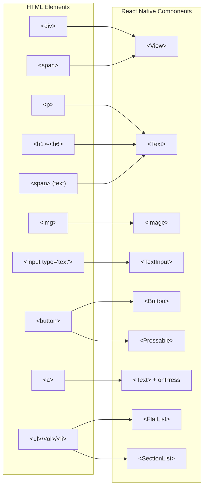

## Section 3: Bridging Web Concepts to React Native

This section explains how the fundamental concepts of HTML structure and CSS styling, reviewed in the previous sections, translate to the React Native environment. Understanding this mapping is key to leveraging your web development knowledge (or understanding the web-inspired paradigms if you come from a native background).

React Native allows you to build native mobile applications using React and JavaScript, but it does _not_ render HTML or use traditional CSS. Instead, it provides a set of **Core Components** that map conceptually to native UI widgets on iOS and Android, and a **JavaScript-based styling system (`StyleSheet`)** that borrows heavily from CSS, particularly Flexbox.

#### Mapping HTML Elements to React Native Components

There isn't a direct one-to-one mapping for every HTML element, but common web elements have clear counterparts in React Native's Core Components:

- `<div>`, `<span>`: Generally map to `<View>`. `<View>` is the fundamental building block for UI layouts, acting as a container that supports styling and Flexbox layout. It's analogous to a generic container view in native development (`UIView`/`ViewGroup`).
- `<p>`, `<h1>`-`<h6>`, `<span>` (for text): Map to `<Text>`. All text content in React Native **must** be wrapped within a `<Text>` component. Unlike HTML, you cannot place text directly inside a `<View>`.
- ``: Maps to `<Image>`. Used for displaying various types of images, including network images, static resources, and temporary local images.
- `<input type="text">`: Maps to `<TextInput>`. Allows users to enter text.
- `<button>`: Maps to `<Button>` or `<Pressable>`. `<Button>` provides a basic platform-specific button, while `<Pressable>` is a more flexible component for detecting various types of touch interactions on its children.
- `<a>`: There's no direct equivalent. Hyperlinks are typically implemented using `<Text>` styled appropriately and an `onPress` handler using the `Linking` module to open URLs.
- `<ul>`, `<ol>`, `<li>`: Map to `<FlatList>` or `<SectionList>`. These components are optimized for displaying scrolling lists of data. You render list items using `<View>`, `<Text>`, and other components within the list's `renderItem` prop.



This diagram visualizes the conceptual mapping between common HTML elements and their React Native component counterparts. On the left are HTML elements grouped by their purpose (containers, text, media, etc.). The arrows show how these map to React Native Core Components on the right. Notice how several HTML elements can map to a single React Native component (e.g., multiple text-based HTML elements map to `<Text>`, and lists map to either `<FlatList>` or `<SectionList>`). This illustrates how React Native consolidates functionality into a more focused set of components while still providing the capabilities needed to build sophisticated mobile UIs. The mapping is conceptual rather than exact, reflecting how web developers can translate their mental models when moving to React Native development.

**Table: Conceptual Mapping of Common Web Elements to React Native Components**

This table summarizes the common conceptual mappings.

| HTML Element                   | React Native Core Component(s) | Notes                                                                     |
| ------------------------------ | ------------------------------ | ------------------------------------------------------------------------- |
| `<div>`                        | `<View>`                       | Fundamental container for layout and grouping.                            |
| `<p>`, `<h1>`-`<h6>`, `<span>` | `<Text>`                       | Required for all text rendering.                                          |
| ``                        | `<Image>`                      | Displays images (local/network).                                          |
| `<input type="text">`          | `<TextInput>`                  | For user text input.                                                      |
| `<button>`                     | `<Button>`, `<Pressable>`      | For user interactions (taps). `<Pressable>` is more customizable.         |
| `<a>` (link)                   | `<Text>` + `Linking`           | Styled `<Text>` with `onPress` handler using `Linking` API.               |
| `<ul>`, `<ol>`, `<li>`         | `<FlatList>`, `<SectionList>`  | Efficiently renders scrolling lists of data using custom item components. |

#### Mapping CSS Concepts to React Native StyleSheet

React Native uses JavaScript objects, typically created via the `StyleSheet.create` method, to define styles for components. This is the standard and recommended approach.

**Benefits of `StyleSheet.create`:**

Using `StyleSheet.create` offers several advantages over defining styles inline directly within the component's JSX:

- **Performance:** It allows React Native to perform optimizations. Style objects are assigned unique IDs, and in the legacy architecture, only these IDs were sent across the communication bridge between JavaScript and the native side. While the new architecture (Fabric) changes some of these dynamics, `StyleSheet.create` still allows for styles to be processed and potentially optimized ahead of time. This can lead to performance improvements, especially in complex applications with many styled components.
- **Organization & Maintainability:** It promotes better code organization by separating styling concerns from the component's rendering logic. This makes the code easier to read, maintain, and reuse. Styles are defined in a centralized, static manner, which helps in understanding the component's appearance at a glance.
- **Error Detection:** `StyleSheet.create` can also help validate your style declarations at compile time or soon after, catching typos or invalid property values early.

**Example `StyleSheet.create` Usage:**

```javascript
import { StyleSheet } from "react-native";

const styles = StyleSheet.create({
  container: {
    // Styles for a container component
    flex: 1, // Use Flexbox
    backgroundColor: "#fff",
    alignItems: "center",
    justifyContent: "center",
  },
  text: {
    // Styles for a text component
    color: "blue",
    fontSize: 18,
    fontWeight: "bold",
    marginVertical: 10,
  },
});

// Usage in a component:
// <View style={styles.container}>
//   <Text style={styles.text}>Hello!</Text>
// </View>
```

**Key Differences from Web CSS:**

1.  **Syntax:** Styles are defined in JavaScript objects, not separate `.css` files.
2.  **Property Names:** CSS properties are written in `camelCase` (e.g., `backgroundColor` instead of `background-color`, `fontSize` instead of `font-size`).
3.  **Units:** Most dimensions (width, height, margin, padding, fontSize, etc.) and positioning properties (top, left, etc.) are unitless numbers interpreted as density-independent pixels (dp). Strings with units (e.g., `'5em'`) are not supported. Percentage values (e.g., `'50%'`) are accepted for some properties like width, height, margin, padding.
4.  **No Cascading & Very Limited Inheritance (Component Encapsulation by Design):**
    - Styles are typically not inherited from parent elements in the same way as web CSS's cascade. For example, setting `margin` or `padding` on a parent `<View>` will not affect its children.
    - There's no complex cascade calculation or specificity wars between rules defined in `StyleSheet`. Styles applied directly via the `style` prop generally take precedence.
    - **Exception: `<Text>` Components:** The primary exception involves text styling properties within nested `<Text>` components. Properties like `color`, `fontSize`, `fontWeight`, `fontFamily`, `lineHeight`, etc., _do_ inherit from a parent `<Text>` component to its direct `<Text>` children.
      ```tsx
      // Example of Text style inheritance
      <Text style={{ color: "navy", fontSize: 16 }}>
        This is navy, 16pt.
        <Text style={{ fontWeight: "bold" }}>
          {/* This inherits navy color and 16pt size, but adds bold weight. */}
          This is also navy, 16pt, but bold.
          <Text style={{ color: "darkred", fontSize: 12 }}>
            {/* This inherits bold weight, but overrides color and font size. */}
            This is dark red, 12pt, and bold.
          </Text>
        </Text>
      </Text>
      ```
    - **Why Limited Inheritance? Component Encapsulation:** This limited inheritance model is a deliberate design choice in React Native, aligning with the core principles of React itself, particularly component encapsulation and isolation. In React, components are intended to be self-contained and reusable units. Relying heavily on inherited styles (like the CSS cascade) can make a component's appearance overly dependent on its context within the application tree, potentially leading to unexpected visual changes when the component is moved or reused elsewhere. By requiring styles to be more explicitly applied, React Native encourages the creation of components that are more predictable and maintainable. While this might seem like more work initially compared to relying on the CSS cascade, it often prevents complex specificity issues and makes debugging styles easier in large applications. It encourages developers to define styles locally within components or create explicitly shared style modules or theme objects rather than depending on implicit inheritance through the component hierarchy.
5.  **Limited Selectors & Subset:** There are no complex CSS selectors (like attribute or pseudo-selectors). Styles are applied directly to components via the `style` prop. React Native implements a subset of CSS properties, primarily focusing on layout (Flexbox), text styling, colors, backgrounds, borders, and transformations. Not all web CSS properties are available.
6.  **Flexbox is Default & Different:** Flexbox is the **default** layout model for `<View>` components; you don't need `display: flex`. Key differences from web Flexbox include:
    - `flexDirection` defaults to `column` (aligning items vertically) instead of `row`.
    - `alignItems` defaults to `stretch`.
    - `flex: 1` is a common pattern on a root container `<View>` to make it expand and fill all available space along the main axis.
    - Properties like `justifyContent`, `alignItems`, `alignSelf`, `flexWrap`, `flexGrow`, `flexShrink`, `flexBasis` work very similarly.

**Applying Styles and Combining Multiple Styles:**

Styles are applied to components using the `style` prop. This prop can accept a single style object (e.g., `style={styles.container}`) or an array of style objects (e.g., `style={[styles.base, styles.modifier, dynamicStyles]}`).

When an array is used:

- Styles are merged from left to right.
- Properties in later objects in the array override those in earlier objects if they conflict.
- This is useful for applying base styles and then conditionally adding or overriding specific styles.
- Falsy values (like `false`, `null`, or `undefined`) in the array are safely ignored, allowing for easy conditional styling.

```tsx
import React from "react";
import { StyleSheet, Text, View } from "react-native";

/**
 * @interface ComponentWithCombinedStylesProps
 * @description Props for the ComponentWithCombinedStyles component.
 * @property {boolean} [isHighlighted] - Optional. If true, applies highlighting styles.
 * @property {boolean} [isError] - Optional. If true, applies error styles; otherwise, applies normal priority styles.
 */
interface ComponentWithCombinedStylesProps {
  isHighlighted?: boolean;
  isError?: boolean;
}

/**
 * @function ComponentWithCombinedStyles
 * @description Demonstrates how multiple style objects can be combined in React Native
 * using an array in the `style` prop. It shows conditional application of styles
 * based on props and how later styles in the array override earlier ones.
 *
 * @param {ComponentWithCombinedStylesProps} props - The props for the component.
 * @returns {JSX.Element} A View containing a Text component with combined styles.
 */
const ComponentWithCombinedStyles = ({
  isHighlighted,
  isError,
}: ComponentWithCombinedStylesProps) => {
  return (
    <View style={styles.container}>
      <Text
        style={[
          styles.baseText,
          isHighlighted && styles.highlightedText,
          isError ? styles.errorText : styles.normalPriorityText,
          { marginTop: 10 },
        ]}
      >
        This text combines multiple styles.
      </Text>
    </View>
  );
};

const styles = StyleSheet.create({
  container: {
    padding: 10,
  },
  baseText: {
    fontSize: 16,
    color: "black",
  },
  highlightedText: {
    backgroundColor: "yellow",
    fontWeight: "bold",
  },
  errorText: {
    color: "red",
    textDecorationLine: "underline",
  },
  normalPriorityText: {
    fontStyle: "italic",
  },
});

export default ComponentWithCombinedStyles;
```

This TypeScript example, `ComponentWithCombinedStyles`, effectively demonstrates a powerful feature of React Native's styling system: the ability to combine multiple style objects by passing an array to the `style` prop. This technique is crucial for creating dynamic and reusable components whose appearance can change based on props or state. The component accepts two optional boolean props, `isHighlighted` and `isError`, which control the conditional application of specific styles to a `<Text>` element.

The `style` prop on the `<Text>` component receives an array: `[styles.baseText, isHighlighted && styles.highlightedText, isError ? styles.errorText : styles.normalPriorityText, { marginTop: 10 }]`. React Native processes this array from left to right. `styles.baseText` provides the foundational styling (fontSize, color). The expression `isHighlighted && styles.highlightedText` conditionally includes `styles.highlightedText` only if `isHighlighted` is true; otherwise, `false` is passed, which is ignored by the style processor. This is a common pattern for toggling styles. Similarly, the ternary operator `isError ? styles.errorText : styles.normalPriorityText` selects one style object based on the `isError` prop. Finally, an inline style object `{ marginTop: 10 }` is included. If any of the preceding style objects in the array also define `marginTop`, this inline style will take precedence because it appears later in the array. This merging behavior, where later styles override earlier ones for conflicting properties, allows for precise control over the final computed styles. This example clearly illustrates a flexible and common approach to dynamic styling in React Native.

**Table: Mapping Common Web CSS to React Native Styles**

This table highlights common property translations.

| Web CSS Property   | React Native Style Property                                                    | Value Example (Web) | Value Example (RN)                       | Notes                                                               |
| :----------------- | :----------------------------------------------------------------------------- | :------------------ | :--------------------------------------- | :------------------------------------------------------------------ |
| `background-color` | `backgroundColor`                                                              | `#FF0000` / `red`   | `'#FF0000'` / `'red'`                    | String values.                                                      |
| `color`            | `color`                                                                        | `blue`              | `'blue'`                                 | String values.                                                      |
| `font-size`        | `fontSize`                                                                     | `16px` / `1.2em`    | `16`                                     | Number (pixels assumed).                                            |
| `font-weight`      | `fontWeight`                                                                   | `bold` / `700`      | `'bold'` / `'700'`                       | String values (keywords or numeric strings).                        |
| `margin`           | `margin`, `marginTop`, `marginLeft`, `marginVertical`, `marginHorizontal`      | `10px` / `5%`       | `10` / `'5%'` / `{ marginTop: 10 }`      | Number (pixels), percentage string, or specific directional props.  |
| `padding`          | `padding`, `paddingTop`, `paddingLeft`, `paddingVertical`, `paddingHorizontal` | `10px`              | `10` / `{ paddingTop: 10 }`              | Number (pixels) or specific directional props.                      |
| `border`           | `borderWidth`, `borderColor`, `borderStyle`, `borderRadius`                    | `1px solid black`   | `borderWidth: 1`, `borderColor: 'black'` | Shorthand split; `borderStyle` exists; `borderRadius` added.        |
| `width` / `height` | `width` / `height`                                                             | `100px` / `50%`     | `100` / `'50%'`                          | Number (pixels) or percentage string.                               |
| `display: flex;`   | _(Default Behavior)_                                                           | `display: flex;`    | _(Implicit on `<View>`)_                 | Flexbox is default in RN for `<View>`.                              |
| `flex-direction`   | `flexDirection`                                                                | `row`               | `'column'` (default), `'row'`            | Default differs from web (`row`).                                   |
| `justify-content`  | `justifyContent`                                                               | `center`            | `'center'`                               | Same values as web (`flex-start`, `flex-end`, `center`, etc.).      |
| `align-items`      | `alignItems`                                                                   | `center`            | `'center'` / `'stretch'` (default)       | Same values as web (`flex-start`, `flex-end`, `center`, `stretch`). |

**React Native Box Model in Practice:**

The CSS Box Model concepts (content, padding, border, margin) are directly applicable in React Native. You control these using `StyleSheet` properties. Here's an example demonstrating their use:

```tsx
import React from "react";
import { StyleSheet, Text, View } from "react-native";

/**
 * @interface BoxModelDemoCardProps
 * @description Props for the BoxModelDemoCard component.
 * @property {string} [title] - Optional title for the card.
 * @property {React.ReactNode} children - Content to be rendered inside the card.
 */
interface BoxModelDemoCardProps {
  title?: string;
  children: React.ReactNode;
}

/**
 * @function BoxModelDemoCard
 * @description A reusable component designed to visually demonstrate the CSS Box Model
 * (margin, border, padding, content) within a React Native context.
 * It accepts a title and children to display within a styled card.
 *
 * @param {BoxModelDemoCardProps} props - The props for the component.
 * @returns {JSX.Element} A styled card component.
 */
const BoxModelDemoCard = ({ title, children }: BoxModelDemoCardProps) => {
  return (
    // The outer View demonstrates margin, border, and padding
    <View style={styles.cardContainer}>
      {/* This inner View represents the Content Area conceptually */}
      <View style={styles.contentArea}>
        {title && <Text style={styles.titleText}>{title}</Text>}
        {children}
      </View>
    </View>
  );
};

/**
 * @function App
 * @description A simple root component that demonstrates the usage of the
 * `BoxModelDemoCard` to display multiple cards, showcasing how margin
 * creates space between them. This example helps visualize the box model in action.
 *
 * @returns {JSX.Element} The main application view with demo cards.
 */
const App = () => (
  <View style={styles.screenContainer}>
    <BoxModelDemoCard title="Medication Reminder">
      <Text style={styles.contentText}>
        Take 1 pill of Amoxicillin at 8:00 AM.
      </Text>
      <Text style={styles.contentText}>Next refill due: 2023-12-31</Text>
    </BoxModelDemoCard>
    <BoxModelDemoCard title="Appointment Note">
      <Text style={styles.contentText}>
        Follow-up with Dr. Smith on Friday.
      </Text>
    </BoxModelDemoCard>
  </View>
);

const styles = StyleSheet.create({
  screenContainer: {
    flex: 1,
    paddingTop: 40, // Ensure content is not under status bar
    backgroundColor: "#f0f0f0",
  },
  cardContainer: {
    // --- Margin Area --- (Space OUTSIDE the border)
    marginVertical: 10, // 10 units space top and bottom
    marginHorizontal: 15, // 15 units space left and right

    // --- Border Area --- (The visible boundary)
    borderWidth: 2, // 2 units thick border
    borderColor: "navy", // Color of the border
    borderRadius: 8, // Rounds the corners

    // --- Padding Area --- (Space INSIDE the border, around contentArea)
    padding: 12, // 12 units padding on all sides inside the border

    backgroundColor: "#e0e0ff", // Background for the card itself (padding area visible)
  },
  contentArea: {
    // --- Content Area --- (Where actual children are placed)
    backgroundColor: "#ffffff", // White background for the content itself
    padding: 8, // Internal padding for the content area
    borderRadius: 4, // Slightly rounded corners for the content block
  },
  titleText: {
    fontSize: 18,
    fontWeight: "bold",
    marginBottom: 8,
    color: "#333333",
  },
  contentText: {
    fontSize: 14,
    color: "#555555",
    marginBottom: 4,
  },
});

export default App;
```

**Explanation:**

This TypeScript example effectively demonstrates the practical application of the CSS Box Model concepts (margin, border, padding, content) within a React Native application using the `StyleSheet` API. It features a reusable `BoxModelDemoCard` component and an `App` component to showcase its usage.

The `BoxModelDemoCard` component is designed to visually distinguish these layers. Its root `<View>`, styled by `styles.cardContainer`, explicitly defines properties for each layer: `marginVertical` and `marginHorizontal` create space _around_ the card, separating it from other elements or the screen edges. `borderWidth`, `borderColor`, and `borderRadius` define the card's visible boundary. Crucially, `padding` creates space _inside_ this border, before the actual content begins. The `backgroundColor` of `styles.cardContainer` helps visualize this padding area. Inside this, another `<View>`, styled by `styles.contentArea`, represents the content box itself, with its own background and padding to house the `title` and `children` props. All dimensional values are unitless, interpreted as density-independent pixels (dp).

The `App` component then renders two instances of `BoxModelDemoCard`, passing different titles and textual content as children. This showcases not only the individual box model of each card but also how the margins on `cardContainer` create separation between the two cards and from the edges of the `screenContainer`. The example reinforces how styles are defined in JavaScript objects via `StyleSheet.create` and applied using the `style` prop, providing a clear illustration of layout and spacing control fundamental to React Native UI development. This approach ensures a structured and maintainable way to manage visual presentation.

> 📚 **Official Documentation:**
>
> - [React Native Docs: StyleSheet](https://reactnative.dev/docs/stylesheet)
> - [React Native Docs: Style](https://reactnative.dev/docs/style)
> - [React Native Docs: Layout with Flexbox](https://reactnative.dev/docs/layout-props) (Note: URL updated as `/flexbox` redirects to `/layout-props` which covers flex)
> - [React Native Docs: View Style Props](https://reactnative.dev/docs/view-style-props)
> - [React Native Docs: Text Style Props](https://reactnative.dev/docs/text-style-props)
> - [React Native Docs: Image Style Props](https://reactnative.dev/docs/image-style-props)

> 🌐 **(Web Developers):**
>
> **Comparison:** The mapping feels intuitive but requires adjusting to JavaScript syntax (camelCase, objects) and the absence of cascading/complex selectors. The biggest paradigm shift is often the `flexDirection: 'column'` default and the strict requirement to wrap all text in `<Text>`.
>
> **Key Takeaway:** Reuse your understanding of component structure and CSS properties (especially Flexbox), but adapt to the `StyleSheet` API, camelCase syntax, unitless dimensions, and React Native's specific defaults and component requirements.

> 📲 **(Native Developers):**
>
> **Comparison:** You'll recognize the mapping of elements to native views. The `StyleSheet` approach might feel different from XML layouts or programmatic constraints/frames. Think of `StyleSheet` as defining attributes for your views (like setting `backgroundColor`, `width`, `height` in native code), but centralized in JavaScript. Flexbox becomes your primary tool for positioning and sizing, replacing systems like Auto Layout or ConstraintLayout for most common scenarios.
>
> **Key Takeaway:** React Native uses web-inspired concepts (components analogous to HTML elements, styling analogous to CSS via `StyleSheet`) to define native UI. Embrace Flexbox as the core layout mechanism.

#### Example: Basic Card Layout (React Native)

Let's translate a simple HTML/CSS card concept into React Native using `<View>`, `<Text>`, and `StyleSheet` with Flexbox.

**Conceptual HTML/CSS:**

```html
<!-- Simple Card -->
<div class="card">
  <p class="title">Amoxicillin 500mg</p>
  <p class="details">Take one capsule every 8 hours.</p>
</div>
```

```css
.card {
  border: 1px solid gray;
  padding: 15px;
  margin: 10px;
  background-color: #f0f0f0;
  border-radius: 8px;
}
.title {
  font-weight: bold;
  font-size: 16px;
  margin-bottom: 5px;
}
.details {
  font-size: 14px;
  color: #333;
}
```

**React Native Implementation (`tsx`):**

```tsx
import React from 'react';
import { StyleSheet, Text, View } from 'react-native';

/**
 * Props for the MedicationCard component.
 */
interface MedicationCardProps {
  /** The name of the medication. */
  name: string;
  /** The instructions for taking the medication. */
  instructions: string;
}

/**
 * A component that displays medication information in a card format.
 *
 * @param {MedicationCardProps} props The props for the component.
 * @returns {React.ReactElement} The MedicationCard component.
 */
const MedicationCard: React.FC<MedicationCardProps> = ({ name, instructions }) => {
  return (
    <View style={styles.card}> // Equivalent to <div class="card">
      <Text style={styles.title}>{name}</Text> // Equivalent to <p class="title">
      <Text style={styles.details}>{instructions}</Text> // Equivalent to <p class="details">
    </View>
  );
};

// Create styles using StyleSheet.create
const styles = StyleSheet.create({
  card: { // Styles for the main container View
    borderWidth: 1, // border: 1px
    borderColor: 'gray', // border-color: gray
    padding: 15, // padding: 15px
    margin: 10, // margin: 10px
    backgroundColor: '#f0f0f0', // background-color: #f0f0f0
    borderRadius: 8, // border-radius: 8px
  },
  title: { // Styles for the name Text
    fontWeight: 'bold', // font-weight: bold
    fontSize: 16, // font-size: 16px (unitless)
    marginBottom: 5, // margin-bottom: 5px
  },
  details: { // Styles for the instructions Text
    fontSize: 14, // font-size: 14px (unitless)
    color: '#333', // color: #333
  },
});

export default MedicationCard;

// Example Usage (in another component):
// <MedicationCard name="Amoxicillin 500mg" instructions="Take one capsule every 8 hours." />
```

**Explanation (approx. 150 words):**

This React Native (`tsx`) example effectively translates a simple HTML/CSS card structure into its equivalent using React Native's Core Components and `StyleSheet` API, specifically for a `MedicationCard` component relevant to the SpeedyMeds theme. The conceptual HTML `<div class="card">` directly maps to a React Native `<View style={styles.card}>`, serving as the primary container. Similarly, the HTML paragraphs (`<p class="title">` and `<p class="details">`) are translated into `<Text style={styles.title}>` and `<Text style={styles.details}>` components, respectively, reinforcing the rule that all text content in React Native must be explicitly wrapped in a `<Text>` component.

The CSS styles are mirrored in the JavaScript object created by `StyleSheet.create`. Key translations include: CSS `border: 1px solid gray;` becomes `borderWidth: 1, borderColor: 'gray'`; `padding: 15px;` becomes `padding: 15`; `background-color: #f0f0f0;` becomes `backgroundColor: '#f0f0f0'` (note the camelCase property name); and font properties like `font-weight` and `font-size` become `fontWeight` and `fontSize`, with `fontSize` taking a unitless number interpreted as density-independent pixels (dp). The `MedicationCard` component itself is defined as a functional component accepting typed props (`MedicationCardProps`) for `name` and `instructions`, showcasing good practice with TypeScript. This example clearly illustrates the direct, albeit syntactically adjusted, mapping of web styling concepts to React Native, emphasizing how developers can leverage their CSS understanding while adapting to the JavaScript-based styling environment.

### Next Steps

Understanding this bridge between web concepts and React Native is crucial. You now have the foundational context for how React Native structures UI and applies styling. In the next module, we'll dive into JavaScript essentials, which form the core logic behind React Native applications.

---
