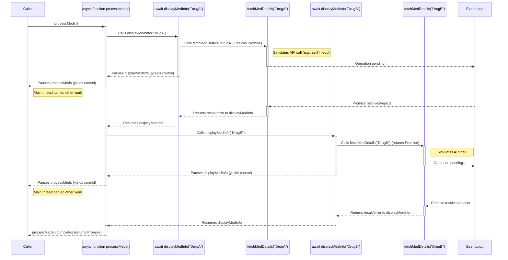

# Module 5: JavaScript Essentials for React Native

Welcome to Module 5! JavaScript is the heart of React Native development. While React Native allows you to build native mobile applications, the logic, structure, and interactivity of your app are primarily written in JavaScript. This module will equip you with the essential JavaScript knowledge, focusing on modern ES6+ features, that you'll need to effectively build robust React Native applications like SpeedyMeds.

> 🛣️ **All Learners:** A strong grasp of JavaScript is fundamental for React Native. This module is crucial even if you have experience with other languages, as we'll focus on patterns and features most relevant to React Native.

## Target Audience Adaptation

Understanding JavaScript is key, regardless of your background:

> 🤖 **Android Developers (Java/Kotlin):** You'll find many concepts like variables, control flow, and object-oriented patterns familiar. However, JavaScript's dynamic typing, prototypal inheritance, and asynchronous model (especially Promises and `async/await`) will be different from Kotlin's coroutines or Java's traditional threading. Pay close attention to how ES6+ features simplify complex tasks.
> **Key Takeaway:** JavaScript's flexibility and single-threaded asynchronous nature are core differences.
> **Source:** [JavaScript for Java Developers](https://developer.mozilla.org/en-US/docs/Web/JavaScript/Guide/Introduction_for_Java_Developers) (Conceptual overview)

> 🍏 **iOS Developers (Swift/Objective-C):** Similar to Android developers, basic programming constructs will be recognizable. Swift's strong typing and optionals contrast with JavaScript's dynamic typing. Asynchronous operations with `async/await` in JavaScript are conceptually similar to Swift's `async/await` but differ in implementation from older patterns like completion handlers or Combine.
> **Key Takeaway:** Focus on JavaScript's type system (or lack thereof initially, before TypeScript) and its event loop-based concurrency.
> **Source:** [JavaScript basics for Objective-C and Swift developers](https://developer.apple.com/library/archive/documentation/Conceptual/Swift_Programming_Language/RevisionHistory.html) (Though not a direct comparison, Apple's Swift docs provide a good contrast for language features)

> ⚛️ **React Developers (Web):** You're likely familiar with most of these JavaScript concepts. This module will serve as a focused refresher, emphasizing the ES6+ features heavily used in React and React Native development. Pay attention to any nuances specific to the React Native environment if they arise, though this module focuses on core JS.
> **Key Takeaway:** Consolidate your ES6+ knowledge; it's directly applicable.

> 🅰️ **Angular Developers (TypeScript/JavaScript):** You'll also be familiar with many ES6+ features, especially if you've been using modern Angular with TypeScript. This module reinforces those core JavaScript skills, which are essential as React Native also heavily leverages these modern features.
> **Key Takeaway:** This is a good reinforcement of modern JavaScript, which underpins both Angular and React Native.

> [!TIP]
> If you have extensive experience with modern JavaScript (ES6+), you might skim through familiar sections. However, ensure you understand the examples and how these concepts apply in the context of building applications, as our SpeedyMeds examples will illustrate.

## Learning Objectives

Upon completing this module, you will be able to:

*   Declare and manage variables using `let` and `const`.
*   Identify and use common JavaScript data types.
*   Employ JavaScript operators for various computations and comparisons.
*   Control program flow using conditional statements and loops.
*   Define and invoke functions, including arrow functions, and understand scope and closures.
*   Work with objects and arrays, including common methods, destructuring, and spread/rest operators.
*   Implement asynchronous operations using Callbacks (briefly), Promises, and `async/await`.
*   Organize code into reusable modules using ES6 `import` and `export` syntax.
*   Apply these JavaScript concepts to solve problems in a pharmacy application context (SpeedyMeds).

## Prerequisites

*   Completion of [Module 4: Web Development Essentials Refresher](./module-04-web-development-essentials-refresher.md). A basic understanding of HTML and CSS concepts is helpful for context, although not strictly JavaScript-related.

## Section 1: Variables, Data Types, and Operators

This section covers the fundamentals of storing and manipulating data in JavaScript. We'll focus on modern ES6+ syntax for variable declaration.

### Variables (ES6+ Focus: `let`, `const`)

In JavaScript, variables are containers for storing data values. ES6 introduced two new keywords for declaring variables: `let` and `const`, which offer better scope control than the older `var` keyword.

*   **`let`**: Declares a block-scoped local variable, optionally initializing it to a value. Block-scoped means the variable is only accessible within the block of code (e.g., inside an `if` statement or a `for` loop) where it's defined. Variables declared with `let` can be reassigned.
*   **`const`**: Declares a block-scoped local variable, but its value cannot be reassigned after initialization. This means `const` variables are constants. However, for objects and arrays declared with `const`, their properties or elements *can* be modified; only the variable's reference to the object/array is constant.

> [!IMPORTANT]
> It's generally recommended to use `const` by default and only use `let` when you know a variable's value needs to change. This promotes immutability and can help prevent accidental reassignments. Avoid using `var` in modern JavaScript development due to its hoisting behavior and function-scoped (not block-scoped) nature, which can lead to confusion.

This example shows how to declare variables for storing medication information.
```javascript
// Using const for data that shouldn't change
const medicationId = "MED001";
const medicationName = "Amoxicillin 250mg";
const requiresPrescription = true;

// Using let for data that might change, like stock quantity
let stockQuantity = 100;
stockQuantity = 99; // Reassignment is allowed for let

// Attempting to reassign a const variable will cause an error
// medicationId = "MED002"; // TypeError: Assignment to constant variable.

// For objects, the object itself cannot be reassigned, but its properties can change.
const prescriptionDetails = {
  patientName: "John Doe",
  dosage: "1 tablet three times a day"
};
prescriptionDetails.dosage = "2 tablets three times a day"; // This is allowed
// prescriptionDetails = {}; // This would be an error

console.log(`${medicationName} (ID: ${medicationId}) - Stock: ${stockQuantity}`);
console.log(`Prescription for ${prescriptionDetails.patientName}: ${prescriptionDetails.dosage}`);
```
The code above demonstrates declaring medication-related variables. `medicationId`, `medicationName`, and `requiresPrescription` are `const` as they are unlikely to change. `stockQuantity` is `let` because it can be updated. It also illustrates that properties of an object declared with `const` (like `prescriptionDetails.dosage`) can be modified, but the variable `prescriptionDetails` cannot be reassigned to a new object. This distinction is crucial for understanding `const` with objects and arrays.

> 🤖 **Android Developers (Java/Kotlin):**
> **Comparison:** `const` is similar to `final` in Java or `val` in Kotlin for reference types (you can't reassign the reference, but the object's internal state can change). `let` is like a standard mutable variable in Java or `var` in Kotlin. JavaScript's block scoping with `let` and `const` is similar to scoping within curly braces `{}` in Java/Kotlin.
> **Key Takeaway:** The immutability aspect of `const` primarily applies to the variable's binding, not necessarily the deep contents of an object.

> 🍏 **iOS Developers (Swift):**
> **Comparison:** `const` is very much like `let` in Swift (for creating constants). `let` in JavaScript is similar to `var` in Swift (for creating mutable variables). Swift's strong type inference and explicit typing differ from JavaScript's dynamic nature, which we'll explore next. Block scope is similar.
> **Key Takeaway:** The keyword `let` has different meanings in Swift and JavaScript. In JS, `let` is mutable.

### Common Data Types

JavaScript is a dynamically typed language. This means you don't have to declare the type of a variable explicitly. The type is determined automatically at runtime based on the value assigned.

Key primitive data types include:

*   **String:** Represents textual data. Enclosed in single quotes (`'...'`), double quotes (`"..."`), or backticks (`` `...` ``) for template literals.
    *Example:* `const patientName = "Jane Doe";`
*   **Number:** Represents both integer and floating-point numbers. There's no distinct integer type.
    *Example:* `const age = 30; const dosageMg = 2.5;`
*   **Boolean:** Represents logical entities and can have two values: `true` or `false`.
    *Example:* `const isChronicMedication = true;`
*   **Null:** Represents the intentional absence of any object value. It's a primitive value.
    *Example:* `let prescriberNotes = null;`
*   **Undefined:** Represents a variable that has been declared but not yet assigned a value.
    *Example:* `let nextRefillDate;` (`nextRefillDate` is `undefined`)
*   **Symbol (ES6):** Represents a unique identifier. Less commonly used in everyday app development but important for specific library use cases or defining unique object properties.
*   **BigInt (ES2020):** Represents integers with arbitrary precision. Useful for numbers larger than `Number.MAX_SAFE_INTEGER`.

JavaScript also has one complex data type:

*   **Object:** Represents a collection of key-value pairs (properties). Functions are also a special type of object in JavaScript. Arrays are a specialized type of object as well.
    *Example:*
    ```javascript
    const medication = {
      name: "Lisinopril",
      strength: "10mg",
      packSize: 30,
      isAvailable: true
    };
    console.log(medication.name); // Accessing a property
    ```

You can check the type of a variable using the `typeof` operator.
```javascript
const drugName = "Ibuprofen";
const quantity = 50;
const isOverTheCounter = true;
let instructions; // undefined

console.log(typeof drugName); // "string"
console.log(typeof quantity); // "number"
console.log(typeof isOverTheCounter); // "boolean"
console.log(typeof instructions); // "undefined"
console.log(typeof null); // "object" (This is a known quirk in JavaScript)
```
This example initializes variables of different types: `drugName` (string), `quantity` (number), and `isOverTheCounter` (boolean). `instructions` is declared but not assigned, so it's `undefined`. The `typeof` operator is then used to demonstrate how JavaScript identifies these types at runtime. Note the historical quirk where `typeof null` returns `"object"`.

### Operators

JavaScript includes a full set of operators:

*   **Assignment Operators:** Assign values to variables (e.g., `=`, `+=`, `-=`, `*=`, `/=`).
    ```javascript
    let currentStock = 50;
    currentStock += 20; // currentStock is now 70
    ```
*   **Arithmetic Operators:** Perform mathematical calculations (e.g., `+`, `-`, `*`, `/`, `%` (modulo), `**` (exponentiation - ES7)).
    ```javascript
    const pricePerUnit = 1.5;
    const numberOfUnits = 10;
    const totalCost = pricePerUnit * numberOfUnits; // 15
    console.log(`Total cost for ${numberOfUnits} units: $${totalCost}`);
    ```
*   **Comparison Operators:** Compare two values and return a boolean (e.g., `==` (loose equality), `===` (strict equality), `!=`, `!==`, `>`, `<`, `>=`, `<=`).
    > [!IMPORTANT]
    > Always prefer strict equality (`===`) and strict inequality (`!==`) over loose equality (`==`) and loose inequality (`!=`). Strict operators compare both value and type, preventing unexpected type coercion issues.
    ```javascript
    const stockLevel = 20;
    const reorderLevel = 20;
    console.log(stockLevel === reorderLevel); // true
    console.log("5" == 5);  // true (loose equality, type coercion)
    console.log("5" === 5); // false (strict equality, different types)
    ```
*   **Logical Operators:** Combine or invert boolean values (e.g., `&&` (logical AND), `||` (logical OR), `!` (logical NOT)).
    ```javascript
    const hasValidPrescription = true;
    const isInStock = false;
    if (hasValidPrescription && isInStock) {
      console.log("Medication can be dispensed.");
    } else {
      console.log("Medication cannot be dispensed.");
    }
    ```
*   **Unary Operators:** Work on a single operand (e.g., `++` (increment), `--` (decrement), `-` (negation), `+` (unary plus - attempts to convert to number), `typeof`).
    ```javascript
    let itemsInCart = 0;
    itemsInCart++; // itemsInCart is now 1
    console.log(typeof +"42"); // "number"
    ```
*   **Ternary (Conditional) Operator:** A shorthand for an `if...else` statement (`condition ? exprIfTrue : exprIfFalse`).
    ```javascript
    const patientAge = 15;
    const dosageType = patientAge >= 18 ? "Adult" : "Pediatric";
    console.log(`Dosage type: ${dosageType}`); // "Pediatric"
    ```
*   **Bitwise Operators:** Perform operations on binary representations of numbers (less common in typical app logic).
*   **String Operators:** The `+` operator can also be used for string concatenation.
    ```javascript
    const firstName = "Maria";
    const lastName = "Gonzalez";
    const fullName = firstName + " " + lastName; // "Maria Gonzalez"
    ```

> 📚 **Official Documentation:**
>
> *   [MDN: JavaScript data types and data structures](https://developer.mozilla.org/en-US/docs/Web/JavaScript/Data_structures)
> *   [MDN: `let`](https://developer.mozilla.org/en-US/docs/Web/JavaScript/Reference/Statements/let)
> *   [MDN: `const`](https://developer.mozilla.org/en-US/docs/Web/JavaScript/Reference/Statements/const)
> *   [MDN: Expressions and Operators](https://developer.mozilla.org/en-US/docs/Web/JavaScript/Guide/Expressions_and_Operators)

## Section 2: Control Flow

Control flow statements allow you to dictate the order in which JavaScript code is executed, based on conditions or repetition.

### Conditional Statements

Conditional statements execute different blocks of code based on whether a condition is true or false.

*   **`if...else` Statement:**
    The most common conditional statement. The `else` block is optional.
    ```javascript
    const temperatureCelsius = 38.5;
    let advice = "";

    if (temperatureCelsius > 37.5) {
      advice = "Patient has a fever. Recommend rest and hydration.";
    } else if (temperatureCelsius < 35.0) {
      advice = "Patient may have hypothermia. Seek medical attention.";
    } else {
      advice = "Patient's temperature is within normal range.";
    }
    console.log(advice);
    ```
    This example checks a patient's `temperatureCelsius`. If it's above 37.5, it sets advice for fever. An `else if` checks for hypothermia if the first condition is false. If neither is true, the final `else` block indicates a normal temperature.

*   **`switch` Statement:**
    Useful when you have multiple conditions to check against a single expression.
    ```javascript
    const medicationForm = "Tablet"; // Could be "Tablet", "Capsule", "Liquid", "Injection"
    let administrationInstructions = "";

    switch (medicationForm) {
      case "Tablet":
      case "Capsule":
        administrationInstructions = "Swallow whole with water. Do not crush or chew.";
        break;
      case "Liquid":
        administrationInstructions = "Measure dosage carefully using the provided syringe or cup.";
        break;
      case "Injection":
        administrationInstructions = "Administer as directed by a healthcare professional.";
        break;
      default:
        administrationInstructions = "Follow specific instructions on the medication label.";
    }
    console.log(`Administration: ${administrationInstructions}`);
    ```
    This `switch` statement provides `administrationInstructions` based on the `medicationForm`. Note how "Tablet" and "Capsule" fall through to the same instruction block. The `break` statement is crucial to exit the `switch` after a match; otherwise, execution would "fall through" to subsequent cases. The `default` case handles any unrecognised forms.

### Loops

Loops are used to execute a block of code repeatedly.

*   **`for` loop:**
    Repeats a block of code a known number of times.
    ```javascript
    const medicationSchedule = ["Morning", "Noon", "Evening"];
    console.log("Medication reminders for today:");
    for (let i = 0; i < medicationSchedule.length; i++) {
      console.log(`- Take medication at ${medicationSchedule[i]}`);
    }
    ```
    This `for` loop iterates through the `medicationSchedule` array. The loop initializes `i` to 0, continues as long as `i` is less than the array's length, and increments `i` after each iteration. It prints a reminder for each time slot in the schedule.

*   **`for...of` loop (ES6):**
    Iterates over iterable objects (like Arrays, Strings, Maps, Sets). It provides a simpler syntax to get the values directly.
    ```javascript
    const prescriptions = [
      { id: "RX123", drug: "Lisinopril", quantity: 30 },
      { id: "RX456", drug: "Metformin", quantity: 60 },
    ];
    console.log("
Patient Prescriptions:");
    for (const prescription of prescriptions) {
      console.log(`  Drug: ${prescription.drug}, Quantity: ${prescription.quantity}`);
    }
    ```
    The `for...of` loop iterates directly over the `prescriptions` array. In each iteration, `prescription` holds one object from the array, making it easy to access properties like `prescription.drug`.

*   **`for...in` loop:**
    Iterates over the enumerable properties of an object. It's generally not recommended for iterating over arrays because the order is not guaranteed and it might iterate over inherited properties.
    ```javascript
    const patientProfile = {
      name: "Sarah Connor",
      age: 35,
      condition: "Hypertension"
    };
    console.log("
Patient Profile Details:");
    for (const key in patientProfile) {
      // It's good practice to check if the property belongs to the object itself
      if (Object.prototype.hasOwnProperty.call(patientProfile, key)) {
        console.log(`  ${key}: ${patientProfile[key]}`);
      }
    }
    ```
    This `for...in` loop iterates over the properties of the `patientProfile` object. `key` holds the property name (e.g., "name", "age"). `Object.prototype.hasOwnProperty.call()` is used to ensure that we only log properties directly on the object, not inherited ones.

*   **`while` loop:**
    Repeats a block of code as long as a specified condition is true. The condition is checked *before* executing the loop body.
    ```javascript
    let stock = 5;
    const dailyUsage = 1;
    let daysLeft = 0;
    while (stock > 0) {
      stock -= dailyUsage;
      daysLeft++;
      console.log(`Day ${daysLeft}: Stock remaining ${stock}`);
    }
    console.log(`Medication will last for ${daysLeft} days.`);
    ```
    The `while` loop simulates daily `stock` usage. It continues as long as `stock` is greater than 0. In each iteration, `stock` is reduced, and `daysLeft` is incremented.

*   **`do...while` loop:**
    Similar to a `while` loop, but the condition is checked *after* executing the loop body. This means the loop body will always execute at least once.
    ```javascript
    let recheckAttempts = 0;
    let isSystemOnline = false;
    do {
      recheckAttempts++;
      console.log(`Attempt ${recheckAttempts}: Checking pharmacy system status...`);
      // In a real app, this would be an actual check.
      // For this example, let's assume it becomes online after 3 attempts.
      if (recheckAttempts === 3) {
        isSystemOnline = true;
        console.log("System is now online.");
      } else if (recheckAttempts > 3) {
         console.log("Failed to connect after multiple attempts.");
         break; // Exit loop if too many attempts
      }
    } while (!isSystemOnline && recheckAttempts <= 3);

    if (!isSystemOnline) {
        console.log("Pharmacy system is offline. Please try again later.");
    }
    ```
    This `do...while` loop simulates checking a pharmacy system's status. The block inside `do` executes at least once. It continues to loop as long as `isSystemOnline` is false and `recheckAttempts` is not excessive.

> 📚 **Official Documentation:**
>
> *   [MDN: Control flow and error handling](https://developer.mozilla.org/en-US/docs/Web/JavaScript/Guide/Control_flow_and_error_handling)
> *   [MDN: `for...of`](https://developer.mozilla.org/en-US/docs/Web/JavaScript/Reference/Statements/for...of)
> *   [MDN: `for...in`](https://developer.mozilla.org/en-US/docs/Web/JavaScript/Reference/Statements/for...in)

## Section 3: Functions

Functions are fundamental building blocks in JavaScript. They are blocks of reusable code that can be defined and called to perform a specific task.

### Defining Functions

There are several ways to define functions in JavaScript:

*   **Function Declaration:**
    ```javascript
    function greetPatient(patientName) {
      return `Hello, ${patientName}! Welcome to SpeedyMeds.`;
    }
    console.log(greetPatient("Alice")); // Output: Hello, Alice! Welcome to SpeedyMeds.
    ```
    Function declarations are "hoisted," meaning they can be called before they are defined in the code.

*   **Function Expression:**
    ```javascript
    const calculateDosage = function(weightKg, dosagePerKg) {
      if (weightKg <= 0 || dosagePerKg <= 0) {
        return "Invalid input for weight or dosage.";
      }
      return weightKg * dosagePerKg;
    };
    const patientWeight = 70; // kg
    const drugDosagePerKg = 2; // mg per kg
    console.log(`Recommended dosage: ${calculateDosage(patientWeight, drugDosagePerKg)}mg`);
    ```
    Function expressions are not hoisted. They are typically assigned to a variable.

### Arrow Functions (ES6)

Arrow functions provide a more concise syntax for writing function expressions. They are especially useful for inline functions and maintaining the `this` context in certain scenarios (which is more relevant when we discuss objects and React components).

*   **Basic Syntax:**
    ```javascript
    // Single parameter, single expression (implicit return)
    const getMedicationName = prescription => prescription.name;

    // Multiple parameters, single expression
    const sum = (a, b) => a + b;

    // Multiple parameters, block body (explicit return needed)
    const processOrder = (orderId, items) => {
      console.log(`Processing order ${orderId} with ${items.length} items.`);
      // ... more logic
      return true; // Explicit return
    };

    const samplePrescription = { id: "RX789", name: "Atorvastatin", quantity: 30 };
    console.log(`Medication: ${getMedicationName(samplePrescription)}`);
    console.log(`Sum of 5 and 3: ${sum(5, 3)}`);
    processOrder("ORD001", [samplePrescription]);
    ```
    This example showcases different forms of arrow functions. `getMedicationName` has one parameter and implicitly returns `prescription.name`. `sum` takes two parameters and implicitly returns their sum. `processOrder` has multiple parameters and a block body, so it requires an explicit `return` statement if a value needs to be returned.

> [!NOTE]
> Arrow functions do not have their own `this`, `arguments`, `super`, or `new.target` bindings. They inherit these from the enclosing lexical scope. This behavior is often advantageous in React Native when passing callbacks to components.

### Parameters and Arguments

*   **Default Parameters (ES6):** You can assign default values to function parameters.
    ```javascript
    function sendReminder(patientEmail, message = "Your prescription is ready for pickup.") {
      console.log(`Sending email to ${patientEmail}: "${message}"`);
    }
    sendReminder("patient@example.com");
    sendReminder("anotherpatient@example.com", "Your medication needs a refill soon.");
    ```
*   **Rest Parameters (ES6):** Allows a function to accept an indefinite number of arguments as an array.
    ```javascript
    function logMedications(patientId, ...medications) {
      console.log(`Patient ID: ${patientId}`);
      console.log("Medications:");
      for (const med of medications) {
        console.log(`- ${med}`);
      }
    }
    logMedications("P001", "Lisinopril", "Metformin", "Aspirin");
    ```
    In `logMedications`, `...medications` gathers all remaining arguments passed after `patientId` into an array named `medications`.

### Scope and Closures

*   **Scope:** Determines the accessibility of variables. JavaScript has global scope, function scope, and block scope (with `let` and `const`).
    *   **Global Scope:** Variables declared outside any function are global.
    *   **Function Scope:** Variables declared inside a function are local to that function.
    *   **Block Scope:** Variables declared with `let` or `const` inside a block (e.g., `{...}`) are local to that block.

*   **Closures:** A closure is a function that has access to its outer (enclosing) function's scope chain even after the outer function has returned. This means it "remembers" the environment in which it was created.
    ```javascript
    function createPrescriptionTracker(medicationName) {
      let refillCount = 0;
      return function() {
        refillCount++;
        console.log(`${medicationName} has been refilled ${refillCount} time(s).`);
        return refillCount;
      };
    }

    const amoxicillinTracker = createPrescriptionTracker("Amoxicillin");
    const lisinoprilTracker = createPrescriptionTracker("Lisinopril");

    amoxicillinTracker(); // Amoxicillin has been refilled 1 time(s).
    amoxicillinTracker(); // Amoxicillin has been refilled 2 time(s).
    lisinoprilTracker();  // Lisinopril has been refilled 1 time(s).
    ```
    In this example, `createPrescriptionTracker` returns an inner anonymous function. This inner function is a closure. It has access to `medicationName` (from its outer function's parameters) and `refillCount` (from its outer function's scope) even after `createPrescriptionTracker` has finished executing. Each call to `createPrescriptionTracker` creates a *new* scope and a *new* closure, so `amoxicillinTracker` and `lisinoprilTracker` have their own independent `refillCount`.

> 🤖 **Android Developers (Java/Kotlin):**
> **Comparison:** Closures are similar to lambdas in Kotlin or Java that capture variables from their enclosing scope. Kotlin's lambdas can access mutable variables from the outer scope, similar to JavaScript closures. Java's lambdas can only access effectively final variables from the outer scope. Arrow functions are syntactically similar to Kotlin lambdas.
> **Key Takeaway:** JavaScript's flexibility with closures capturing mutable variables is powerful but requires careful management to avoid unintended side effects.

> 🍏 **iOS Developers (Swift):**
> **Comparison:** Closures in JavaScript are very similar to closures in Swift. Swift closures can also capture and store references to any constants and variables from the context in which they are defined. Arrow functions are syntactically concise, much like Swift's shorthand closure syntax.
> **Key Takeaway:** The concept of capturing scope will feel natural.

> 📚 **Official Documentation:**
>
> *   [MDN: Functions](https://developer.mozilla.org/en-US/docs/Web/JavaScript/Guide/Functions)
> *   [MDN: Arrow functions](https://developer.mozilla.org/en-US/docs/Web/JavaScript/Reference/Functions/Arrow_functions)
> *   [MDN: Closures](https://developer.mozilla.org/en-US/docs/Web/JavaScript/Closures)
> *   [MDN: Rest parameters](https://developer.mozilla.org/en-US/docs/Web/JavaScript/Reference/Functions/rest_parameters)
> *   [MDN: Default parameters](https://developer.mozilla.org/en-US/docs/Web/JavaScript/Reference/Functions/Default_parameters)

**Exercise 5.1: Function Practice**
**(https://codesandbox.io/s/your-function-practice-sandbox-link)** (You'll need to create a new CodeSandbox for this)
*Instructions for CodeSandbox `README.md`*:
1.  Create a function `getPatientGreeting(patient)` that takes a patient object (e.g., `{ firstName: "John", lastName: "Doe", age: 45 }`) and returns a greeting string like "Hello John Doe (Age: 45). Welcome to SpeedyMeds!".
2.  Create an arrow function `isEligibleForRefill(prescription)` that takes a prescription object (e.g., `{ name: "Lipitor", refillsRemaining: 0, isChronic: true }`) and returns `true` if `refillsRemaining` is greater than 0 OR if `isChronic` is true, otherwise `false`.
3.  Create a function `calculateTotalMedicationCost(medications)` that uses rest parameters to accept multiple medication objects (e.g., `{ name: "MedA", price: 10, quantity: 2 }, { name: "MedB", price: 5, quantity: 3 }`) and returns the total cost (price * quantity for each, then sum). Use default parameter for quantity on individual medication objects, defaulting to 1 if not provided.

## Section 4: Objects and Arrays

Objects and arrays are JavaScript's primary data structures for storing collections of data.

### Objects

Objects are collections of key-value pairs. Keys are strings (or Symbols), and values can be any data type, including other objects or functions (methods).

*   **Creating Objects:**
    *   **Object Literal:** The most common way.
        ```javascript
        const patient = {
          id: "P007",
          firstName: "James",
          lastName: "Bond",
          dateOfBirth: "1970-10-10",
          allergies: ["penicillin", "nuts"],
          address: {
            street: "1 MI6 HQ",
            city: "London"
          },
          // Method (function as a property)
          getFullName: function() {
            return `${this.firstName} ${this.lastName}`;
          },
          // ES6 method shorthand
          getAge() {
            const birthYear = new Date(this.dateOfBirth).getFullYear();
            const currentYear = new Date().getFullYear();
            return currentYear - birthYear;
          }
        };

        console.log(patient.getFullName()); // "James Bond"
        console.log(`Patient Age: ${patient.getAge()}`); // e.g., 54 (depending on current year)
        console.log(patient.address.city); // "London"
        ```
        This example defines a `patient` object with various properties, including a nested `address` object and two methods: `getFullName` (traditional syntax) and `getAge` (ES6 shorthand). `this` keyword inside a method refers to the object itself.

*   **Accessing Properties:**
    *   Dot notation: `object.propertyName`
    *   Bracket notation: `object["propertyName"]` (useful when property names are dynamic or contain special characters)

*   **Adding/Modifying Properties:**
    ```javascript
    patient.contactNumber = "555-007-007"; // Adds a new property
    patient.lastName = "Bond-Smith";     // Modifies an existing property
    console.log(patient.contactNumber);
    ```

*   **Object Destructuring (ES6):**
    A convenient way to extract properties from objects into distinct variables.
    ```javascript
    const { firstName, lastName, allergies, address: { city } } = patient;
    console.log(`${firstName} ${lastName} lives in ${city}.`);
    console.log(`Allergies: ${allergies.join(", ")}`);

    // Can also assign to new variable names
    const { dateOfBirth: dob } = patient;
    console.log(`Date of Birth: ${dob}`);
    ```
    This destructures `firstName`, `lastName`, `allergies`, and the nested `city` from the `patient` object into new variables. `dateOfBirth` is destructured and aliased to a new variable `dob`.

*   **Spread Syntax (`...`) in Object Literals (ES2018):**
    Allows you to copy properties from an existing object into a new object.
    ```javascript
    const updatedPatient = {
      ...patient, // Copies all properties from patient
      occupation: "Pharmacist Consultant", // Adds a new property
      contactNumber: "555-123-4567" // Overrides existing contactNumber
    };
    console.log(updatedPatient.occupation);
    console.log(updatedPatient.contactNumber); // Shows the new number
    ```
    `updatedPatient` is a new object containing all properties from `patient`, plus a new `occupation` property and an overridden `contactNumber`.

*   **Object Methods:**
    JavaScript provides built-in methods for working with objects, like:
    *   `Object.keys(obj)`: Returns an array of an object's own enumerable property names.
    *   `Object.values(obj)`: Returns an array of an object's own enumerable property values.
    *   `Object.entries(obj)`: Returns an array of an object's own enumerable [key, value] pairs.
    ```javascript
    const medicationInfo = { name: "Amoxicillin", dosage: "250mg", type: "Antibiotic" };
    console.log(Object.keys(medicationInfo));   // ["name", "dosage", "type"]
    console.log(Object.values(medicationInfo)); // ["Amoxicillin", "250mg", "Antibiotic"]
    console.log(Object.entries(medicationInfo)); // [["name", "Amoxicillin"], ["dosage", "250mg"], ["type", "Antibiotic"]]
    ```

### Arrays

Arrays are ordered collections of values. Values can be of any data type, and an array can contain mixed data types.

*   **Creating Arrays:**
    *   **Array Literal:** The most common way.
        ```javascript
        const pendingOrders = ["ORD001", "ORD002", "ORD003"];
        const medicationMix = ["Aspirin", 100, true]; // Mixed types
        ```

*   **Accessing Elements:**
    Using zero-based indexing.
    ```javascript
    console.log(pendingOrders[0]); // "ORD001"
    pendingOrders[1] = "ORD004"; // Modifies the second element
    ```

*   **Array Properties and Methods:**
    *   `length`: Property that returns the number of elements.
    *   Common methods:
        *   `push()`: Adds element(s) to the end.
        *   `pop()`: Removes the last element.
        *   `shift()`: Removes the first element.
        *   `unshift()`: Adds element(s) to the beginning.
        *   `slice(start, end)`: Returns a shallow copy of a portion of an array.
        *   `splice(start, deleteCount, ...itemsToAdd)`: Changes the contents of an array by removing or replacing existing elements and/or adding new elements in place.
        *   `concat()`: Merges two or more arrays.
        *   `join(separator)`: Joins all elements into a string.
        *   `indexOf(element)` / `includes(element)` (ES7): Check if an element exists.

*   **Iteration Methods (Functional Approach):**
    These methods are powerful for data manipulation and are heavily used in React. They typically take a callback function as an argument.
    *   `forEach(callbackFn)`: Executes a provided function once for each array element.
        ```javascript
        const activePrescriptions = ["Lisinopril", "Metformin", "Simvastatin"];
        activePrescriptions.forEach(function(drug, index) {
          console.log(`Prescription ${index + 1}: ${drug}`);
        });
        // Using arrow function:
        // activePrescriptions.forEach((drug, index) => console.log(`Prescription ${index + 1}: ${drug}`));
        ```
    *   `map(callbackFn)`: Creates a new array populated with the results of calling a provided function on every element in the calling array. **Crucial for rendering lists in React.**
        ```javascript
        const orderIDs = ["ORD100", "ORD101", "ORD102"];
        const orderDetailsLinks = orderIDs.map(id => `/orders/${id}`);
        console.log(orderDetailsLinks); // ["/orders/ORD100", "/orders/ORD101", "/orders/ORD102"]
        ```
    *   `filter(callbackFn)`: Creates a new array with all elements that pass the test implemented by the provided function.
        ```javascript
        const inventory = [
          { name: "Aspirin", stock: 150 },
          { name: "Ibuprofen", stock: 20 },
          { name: "Paracetamol", stock: 200 }
        ];
        const lowStockItems = inventory.filter(item => item.stock < 50);
        console.log(lowStockItems); // [{ name: "Ibuprofen", stock: 20 }]
        ```
    *   `reduce(callbackFn, initialValue)`: Executes a reducer function on each element of the array, resulting in a single output value.
        ```javascript
        const itemPrices = [10.50, 5.25, 12.00];
        const totalOrderValue = itemPrices.reduce((sum, price) => sum + price, 0);
        console.log(`Total value: $${totalOrderValue.toFixed(2)}`); // "$27.75"
        ```
    *   `find(callbackFn)`: Returns the first element in the array that satisfies the provided testing function.
    *   `findIndex(callbackFn)`: Returns the index of the first element in the array that satisfies the provided testing function.
    *   `some(callbackFn)`: Tests whether at least one element in the array passes the test.
    *   `every(callbackFn)`: Tests whether all elements in the array pass the test.

*   **Array Destructuring (ES6):**
    Similar to object destructuring, but for arrays.
    ```javascript
    const topSellingDrugs = ["Atorvastatin", "Levothyroxine", "Lisinopril"];
    const [firstDrug, secondDrug] = topSellingDrugs;
    console.log(`Top seller: ${firstDrug}, Second: ${secondDrug}`);
    ```

*   **Spread Syntax (`...`) in Array Literals (ES6):**
    Expands an iterable (like an array) into individual elements. Useful for creating new arrays, concatenating, or passing array elements as function arguments.
    ```javascript
    const criticalMeds = ["Epinephrine", "Insulin"];
    const commonMeds = ["Ibuprofen", "Paracetamol"];
    const fullPharmacyStock = [...criticalMeds, ...commonMeds, "Amoxicillin"];
    console.log(fullPharmacyStock);
    ```

> 🌐 **Web Developers (React/Angular/Vue):**
> **Comparison:** You're likely very familiar with these iteration methods (`map`, `filter`, `reduce`), destructuring, and spread syntax, as they are cornerstones of modern JavaScript frameworks for managing data and state.
> **Key Takeaway:** These array methods are essential for transforming data for display in React Native components, similar to how you'd use them in web frameworks.

> 📚 **Official Documentation:**
>
> *   [MDN: Objects](https://developer.mozilla.org/en-US/docs/Web/JavaScript/Guide/Working_with_Objects)
> *   [MDN: Arrays](https://developer.mozilla.org/en-US/docs/Web/JavaScript/Reference/Global_Objects/Array)
> *   [MDN: Destructuring assignment](https://developer.mozilla.org/en-US/docs/Web/JavaScript/Reference/Operators/Destructuring_assignment)
> *   [MDN: Spread syntax (...)](https://developer.mozilla.org/en-US/docs/Web/JavaScript/Reference/Operators/Spread_syntax)

**Exercise 5.2: Data Manipulation**
**(https://codesandbox.io/s/your-data-manipulation-sandbox-link)**
*Instructions for CodeSandbox `README.md`*:
1.  Define an array of patient objects. Each patient should have `id` (string), `name` (string), `age` (number), and an array of `prescriptions` (strings, e.g., `["Lipitor", "Aspirin"]`).
2.  Use `map` to create a new array containing only the patient names.
3.  Use `filter` to create a new array containing only patients older than 65.
4.  Use `find` to get the patient object with a specific ID.
5.  Create a function `addPrescription(patientId, newPrescription)` that takes a patient ID and a new prescription string. It should find the patient by ID and add the new prescription to their `prescriptions` array (hint: you might need to create a *new* patient object or array to maintain immutability, or modify it if that's easier for this exercise).
6.  Use `reduce` to calculate the total number of prescriptions across all patients.

## Section 5: Asynchronous JavaScript

JavaScript is single-threaded, meaning it can only do one thing at a time. However, many operations (like network requests, file system operations, timers) can take time. Asynchronous programming allows your application to continue running other code while waiting for these long-running tasks to complete, preventing the UI from freezing.

> [!IMPORTANT]
> Understanding asynchronous JavaScript is critical for React Native, especially for fetching data from APIs, interacting with device hardware, or handling user events that trigger background tasks.

### Callbacks

Historically, callbacks were the primary way to handle asynchronous operations. A callback is a function passed as an argument to another function, which is then executed after the outer function has completed its task.

```javascript
function fetchPatientData(patientId, callback) {
  // Simulate an API call
  setTimeout(() => {
    if (patientId === "P001") {
      const data = { id: "P001", name: "John Doe", condition: "Stable" };
      callback(null, data); // Call callback with null for error, and data
    } else {
      callback("Patient not found", null); // Call callback with an error
    }
  }, 1000); // Simulates 1 second delay
}

fetchPatientData("P001", (error, data) => {
  if (error) {
    console.error("Error fetching patient data:", error);
  } else {
    console.log("Patient Data (Callback):", data);
  }
});

fetchPatientData("P002", (error, data) => {
  if (error) {
    console.error("Error fetching patient data:", error); // This will be logged
  } else {
    console.log("Patient Data (Callback):", data);
  }
});
```
The `fetchPatientData` function simulates fetching data. It takes a `patientId` and a `callback`. After a delay, it calls the `callback` with either an error or the fetched data. While simple for one operation, nested callbacks for multiple sequential asynchronous operations can lead to "callback hell" or the "pyramid of doom," making code hard to read and maintain.

### Promises (ES6)

Promises provide a cleaner and more robust way to handle asynchronous operations. A `Promise` is an object representing the eventual completion (or failure) of an asynchronous operation and its resulting value.

A Promise can be in one of three states:
*   **Pending:** Initial state, neither fulfilled nor rejected.
*   **Fulfilled (Resolved):** The operation completed successfully, and the promise has a resulting value.
*   **Rejected:** The operation failed, and the promise has a reason for the failure.

```javascript
function fetchMedicationDetails(medicationName) {
  return new Promise((resolve, reject) => {
    // Simulate API call
    setTimeout(() => {
      const mockDatabase = {
        "Amoxicillin": { id: "AMX01", dosageForms: ["Tablet", "Capsule", "Liquid"] },
        "Lisinopril": { id: "LIS02", dosageForms: ["Tablet"] }
      };
      if (mockDatabase[medicationName]) {
        resolve(mockDatabase[medicationName]); // Operation successful
      } else {
        reject(`Medication "${medicationName}" not found in database.`); // Operation failed
      }
    }, 1500);
  });
}

// Using a Promise
fetchMedicationDetails("Amoxicillin")
  .then(details => {
    console.log("Medication Details (Promise - then):", details);
  })
  .catch(error => {
    console.error("Error (Promise - catch):", error);
  });

fetchMedicationDetails("Ibuprofen")
  .then(details => {
    console.log("Medication Details (Promise - then):", details);
  })
  .catch(error => {
    console.error("Error (Promise - catch):", error); // This will be logged
  });
```
`fetchMedicationDetails` returns a `Promise`. If the medication is found, the promise `resolve`s with the details. Otherwise, it `reject`s with an error message. We use `.then()` to handle a successful resolution and `.catch()` to handle a rejection. Promises allow for cleaner chaining of asynchronous operations compared to callbacks.

### `async`/`await` (ES2017)

`async/await` is syntactic sugar built on top of Promises, making asynchronous code look and behave a bit more like synchronous code, which can improve readability.

*   **`async` function:** Declaring a function with `async` means it will implicitly return a Promise.
*   **`await` operator:** Can only be used inside an `async` function. It pauses the execution of the `async` function until the Promise it's waiting for is resolved or rejected.

```javascript
// Using the same fetchMedicationDetails Promise-based function from above

async function displayMedicationInfo(medicationName) {
  console.log(`Fetching details for ${medicationName}... (async/await)`);
  try {
    const details = await fetchMedicationDetails(medicationName); // Pauses here until promise settles
    console.log(`Details for ${medicationName}:`, details.dosageForms);
    return details; // This will be the resolved value of the promise returned by displayMedicationInfo
  } catch (error) {
    console.error(`Could not fetch ${medicationName} details:`, error);
    throw error; // Re-throw error if needed, or handle it
  }
}

async function processMedications() {
  await displayMedicationInfo("Lisinopril");
  await displayMedicationInfo("Paracetamol"); // This will log an error
  console.log("Finished processing medication lookups.");
}

processMedications();
```
In `displayMedicationInfo`, the `await` keyword pauses execution until `fetchMedicationDetails` resolves or rejects. If it resolves, `details` gets the resolved value. If it rejects, the `catch` block handles the error. `processMedications` calls `displayMedicationInfo` sequentially using `await`.

### Diagram: Async/Await Flow



**Diagram Description:**
This diagram illustrates the execution flow of an `async` function (`processMeds`) that makes two `await` calls to another `async` function (`displayMedInfo`), which in turn `await`s a Promise-based API call (`fetchMedDetails`).

1.  The `Caller` invokes `processMeds()`.
2.  `processMeds()` calls `displayMedInfo("DrugA")`.
3.  `displayMedInfo("DrugA")` calls `fetchMedDetails("DrugA")`, which returns a Promise and starts an asynchronous operation (e.g., a network request simulated by `setTimeout`).
4.  The `await` in `displayMedInfo` pauses its execution. Control is yielded back up the call stack. `processMeds` is also paused due to its `await`. The JavaScript event loop can now process other tasks if any.
5.  When the `fetchMedDetails("DrugA")` Promise resolves (or rejects), the event loop schedules the resumption of `displayMedInfo`.
6.  `displayMedInfo` resumes, processes the result, and then `processMeds` resumes.
7.  The same sequence happens for the second call to `displayMedInfo("DrugB")`.
8.  Finally, `processMeds` completes. The key is that the main thread is not blocked during the `await` pauses; other JavaScript code can run.

> 🤖 **Android Developers (Java/Kotlin):**
> **Comparison:** `async/await` in JavaScript is conceptually very similar to Kotlin Coroutines with `suspend` functions and `async/await` builders. Both allow writing asynchronous code in a more sequential style. Promises are somewhat like Java's `CompletableFuture` or Kotlin's `Deferred`.
> **Key Takeaway:** The non-blocking nature while `await`ing is crucial, similar to how coroutines suspend without blocking the thread.

> 🍏 **iOS Developers (Swift):**
> **Comparison:** `async/await` in JavaScript is directly comparable to Swift's `async/await` introduced in Swift 5.5. Both provide a way to write asynchronous code that reads like synchronous code. Promises are similar in concept to Swift's `Future` or `Promise` types often found in libraries (or Combine's `Future` publisher).
> **Key Takeaway:** The structured concurrency achieved with `async/await` will feel familiar if you've used modern Swift.

> 📚 **Official Documentation:**
>
> *   [MDN: Asynchronous JavaScript](https://developer.mozilla.org/en-US/docs/Learn/JavaScript/Asynchronous)
> *   [MDN: Using Promises](https://developer.mozilla.org/en-US/docs/Web/JavaScript/Guide/Using_promises)
> *   [MDN: `async function`](https://developer.mozilla.org/en-US/docs/Web/JavaScript/Reference/Statements/async_function)
> *   [MDN: `await`](https://developer.mozilla.org/en-US/docs/Web/JavaScript/Reference/Operators/await)

**Exercise 5.3: Async Function Implementation**
**(https://codesandbox.io/s/your-async-functions-sandbox-link)**
*Instructions for CodeSandbox `README.md`*:
1.  Create a function `fetchUserProfile(userId)` that returns a Promise.
    *   Inside the Promise, simulate an API call using `setTimeout` (e.g., 1 second).
    *   If `userId` is "user123", resolve with an object: `{ id: "user123", name: "Alice Wonderland", email: "alice@example.com" }`.
    *   If `userId` is anything else, reject with an error message "User not found."
2.  Create an `async` function `getUserDetails(userId)` that calls `fetchUserProfile` using `await`.
    *   It should log the user's name and email if successful.
    *   It should log an error message if `fetchUserProfile` rejects. Use a `try...catch` block.
3.  Call `getUserDetails` with "user123" and then with "user456" to test both scenarios.

## Section 6: ES6 Modules (Import/Export)

As applications grow, it's essential to organize code into reusable pieces. ES6 Modules allow you to split your JavaScript code into separate files (modules) and share functionality between them using `import` and `export` statements.

> [!NOTE]
> In a React Native (Expo) project, the module system is already set up for you by the bundler (Metro). You can directly use `import` and `export` syntax.

### `export`

You can export functions, objects, classes, or primitive values from a module.

*   **Named Exports:** Export multiple values from a module.
    ```javascript
    // File: utils/mathUtils.js
    export const PI = 3.14159;

    export function calculateCircumference(radius) {
      return 2 * PI * radius;
    }

    export function calculateArea(radius) {
      return PI * radius * radius;
    }
    ```
    This `mathUtils.js` module exports a constant `PI` and two functions, `calculateCircumference` and `calculateArea`, using named exports.

*   **Default Export:** Export a single primary value from a module. A module can have only one default export.
    ```javascript
    // File: services/pharmacyApiService.js
    // Assume this function fetches data from a pharmacy API
    async function fetchInventory() {
      // Simulate API call
      return new Promise(resolve => setTimeout(() => {
        resolve([
          { id: "MED001", name: "Aspirin", stock: 100 },
          { id: "MED002", name: "Ibuprofen", stock: 50 }
        ]);
      }, 500));
    }

    export default fetchInventory; // Default export
    ```
    `pharmacyApiService.js` exports the `fetchInventory` function as its default export.

### `import`

You import functionality from other modules into your current module.

*   **Importing Named Exports:**
    ```javascript
    // File: app.js (or another module)
    import { calculateCircumference, calculateArea, PI } from './utils/mathUtils.js';
    // You can also alias imports: import { calculateArea as calcArea } from './utils/mathUtils.js';

    const radius = 5;
    console.log(`Circumference: ${calculateCircumference(radius)}`);
    console.log(`Area: ${calculateArea(radius)}`);
    console.log(`Value of PI: ${PI}`);

    // To import all named exports as an object:
    // import * as MathAPI from './utils/mathUtils.js';
    // console.log(MathAPI.calculateArea(10));
    ```
    `app.js` imports specific named exports (`calculateCircumference`, `calculateArea`, `PI`) from `mathUtils.js`. The path `'./utils/mathUtils.js'` is relative to the current file.

*   **Importing a Default Export:**
    ```javascript
    // File: inventoryManager.js
    import getPharmacyInventory from './services/pharmacyApiService.js';
    // The name `getPharmacyInventory` can be any name you choose for the default import.

    async function displayInventory() {
      try {
        const inventory = await getPharmacyInventory();
        console.log("Current Pharmacy Inventory:");
        inventory.forEach(item => console.log(`- ${item.name}: ${item.stock} units`));
      } catch (error) {
        console.error("Failed to fetch inventory:", error);
      }
    }

    displayInventory();
    ```
    `inventoryManager.js` imports the default export from `pharmacyApiService.js` and names it `getPharmacyInventory`.

> [!IMPORTANT]
> File paths in `import` statements are usually relative (e.g., `'./component'`, `'../utils'`) or absolute based on project configuration (e.g., in some setups `'src/components/Button'`). In React Native with Expo, relative paths are common. Do not include the `.js` or `.tsx` extension typically; the bundler resolves it.

> 🌐 **Web Developers (React/Angular/Vue):**
> **Comparison:** ES6 Modules are the standard module system used in modern web development with frameworks like React, Angular, and Vue, often bundled with tools like Webpack or Rollup. The syntax and concepts are identical.
> **Key Takeaway:** Your experience with ES6 modules in web development translates directly to React Native.

> 📚 **Official Documentation:**
>
> *   [MDN: JavaScript Modules](https://developer.mozilla.org/en-US/docs/Web/JavaScript/Guide/Modules)
> *   [MDN: `export`](https://developer.mozilla.org/en-US/docs/Web/JavaScript/Reference/Statements/export)
> *   [MDN: `import`](https://developer.mozilla.org/en-US/docs/Web/JavaScript/Reference/Statements/import)

## Challenge 5: Mini Pharmacy Data Processor

**(https://codesandbox.io/s/your-pharmacy-processor-sandbox-link)**
*Instructions for CodeSandbox `README.md`*:
This challenge involves creating a set of utility functions for processing pharmacy data, organized into modules.

**Requirements:**

1.  **`data/prescriptions.js` Module:**
    *   Create a file named `prescriptions.js` in a `data` subfolder.
    *   Define an array of at least 5 prescription objects. Each object should have:
        *   `id` (string, e.g., "RX1001")
        *   `patientName` (string)
        *   `medicationName` (string)
        *   `dosage` (string, e.g., "10mg")
        *   `quantity` (number)
        *   `refillsRemaining` (number)
        *   `dateFilled` (string, e.g., "2023-10-15")
    *   Default export this array.

2.  **`utils/prescriptionUtils.js` Module:**
    *   Create a file named `prescriptionUtils.js` in a `utils` subfolder.
    *   Implement and export the following named functions:
        *   `getPrescriptionsByPatient(prescriptions, patientName)`: Takes the array of prescriptions and a patient's name, returns a new array containing only prescriptions for that patient.
        *   `getLowRefillPrescriptions(prescriptions, threshold = 1)`: Takes the array and an optional refill `threshold` (defaults to 1). Returns a new array of prescriptions with `refillsRemaining` less than or equal to the threshold.
        *   `summarizePrescription(prescription)`: Takes a single prescription object and returns a string summary like: "ID: RX1001, Patient: John Doe, Med: Amoxicillin 250mg, Qty: 30, Refills: 2".
        *   `getTotalQuantityForMedication(prescriptions, medicationName)`: Takes the array and a medication name, returns the total quantity of that medication across all prescriptions.

3.  **`utils/dateUtils.js` Module (Optional Bonus):**
    *   Create a file named `dateUtils.js` in the `utils` subfolder.
    *   Implement and export a named function `isPrescriptionRecent(prescription, days = 30)`: Takes a prescription object and an optional `days` parameter (defaults to 30). Returns `true` if the `dateFilled` is within the last `days` from the current date, `false` otherwise. (Hint: You'll need to work with `Date` objects).

4.  **`index.js` (Main file):**
    *   Import the prescriptions data from `data/prescriptions.js`.
    *   Import all necessary functions from `utils/prescriptionUtils.js` (and `utils/dateUtils.js` if you did the bonus).
    *   Perform the following operations and log the results clearly to the console:
        *   Get and log all prescriptions for a specific patient.
        *   Get and log all prescriptions with low refills (e.g., 0 or 1 refill remaining).
        *   Log a summary for at least two different prescriptions using `summarizePrescription`.
        *   Calculate and log the total quantity for a specific medication.
        *   (Bonus) Identify and log any prescriptions filled recently (e.g., within the last 90 days).

**Code Example Structure (Conceptual in `index.js`):**
```javascript
import allPrescriptions from './data/prescriptions.js';
import {
  getPrescriptionsByPatient,
  getLowRefillPrescriptions,
  summarizePrescription,
  getTotalQuantityForMedication
} from './utils/prescriptionUtils.js';
// import { isPrescriptionRecent } from './utils/dateUtils.js'; // If doing bonus

function mainProcessing() {
  console.log("--- All Prescriptions ---");
  allPrescriptions.forEach(p => console.log(summarizePrescription(p)));

  const patientNameToFind = allPrescriptions[0].patientName; // Pick a name from your data
  console.log(`
--- Prescriptions for ${patientNameToFind} ---`);
  const patientMeds = getPrescriptionsByPatient(allPrescriptions, patientNameToFind);
  patientMeds.forEach(p => console.log(summarizePrescription(p)));

  // ... more processing and logging ...
}

mainProcessing();
```
This challenge tests your understanding of variables, data types (objects, arrays), functions, array methods (`map`, `filter`, `reduce`, `find`, `forEach`), `async/await` (if you choose to make any utility async, though not required by the prompt), and ES6 modules. Ensure your code is well-organized and your console output is clear.

## Module Summary

In this module, you've covered the essential JavaScript concepts that form the backbone of React Native development. We started with variables (`let`, `const`), data types, and operators. We then explored control flow structures like conditionals and loops. Functions, including concise arrow functions, along with scope and closures, were demystified. You learned to manipulate complex data structures with objects and arrays, leveraging powerful ES6+ features like destructuring, spread/rest syntax, and functional array methods. Crucially, we delved into asynchronous JavaScript, understanding callbacks, Promises, and the modern `async/await` syntax for handling operations like API calls. Finally, we saw how ES6 Modules (`import`/`export`) help organize code into manageable and reusable pieces.

Mastering these JavaScript fundamentals is vital. They are not just prerequisites but are actively used daily when building components, managing state, handling events, and interacting with APIs in your SpeedyMeds application and any other React Native project.

## Further Resources

> 📚 **Official Documentation:**
>
> *   [MDN Web Docs: JavaScript Guide](https://developer.mozilla.org/en-US/docs/Web/JavaScript/Guide) - A comprehensive resource for all things JavaScript.
> *   [Eloquent JavaScript (Online Book)](https://eloquentjavascript.net/) - A well-regarded book for learning JavaScript.
> *   [JavaScript.info (Online Tutorial)](https://javascript.info/) - Another excellent and detailed JavaScript tutorial site.
>
> 🗂️ **Additional Resources:**
>
> *   [You Don't Know JS (Book Series)](https://github.com/getify/You-Dont-Know-JS) - A more advanced series diving deep into JavaScript concepts.
> *   [ES6 Features (Overview)](http://es6-features.org/) - A good summary of modern JavaScript features.


</rewritten_file>
