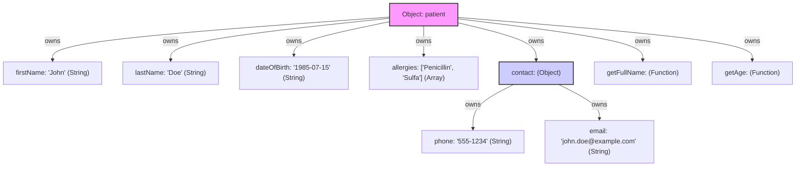
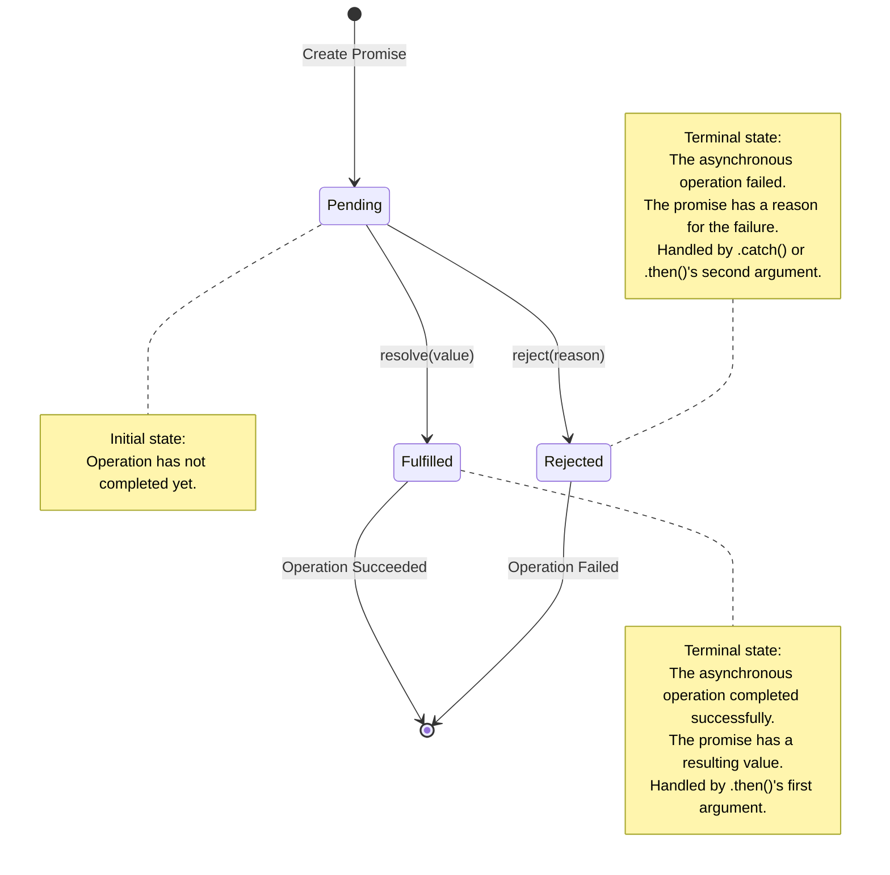
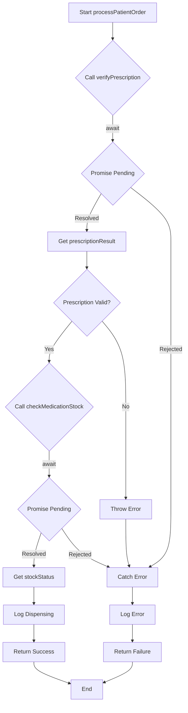

# Module 5: JavaScript Essentials for React Native

Welcome to the world of JavaScript! This module is your gateway to understanding the core language that powers React Native. A strong grasp of modern JavaScript (ES6 and beyond) is crucial for building dynamic and interactive mobile applications. We'll cover the essentials, from variables and data types to asynchronous operations and modules, all tailored to prepare you for React Native development.

> [!TIP]
> If you're already experienced with modern JavaScript (ES6+), you might find many concepts in this module familiar. We recommend skimming through to refresh your knowledge, paying close attention to examples that might illustrate patterns commonly used in React and React Native, and any "Background Bridge Notes" that compare JavaScript to other paradigms.

## Learning Objectives

By the end of this module, you will be able to:

*   Declare and manage variables using `let` and `const`, understanding their scope.
*   Identify and utilize JavaScript's fundamental data types and operators.
*   Implement control flow in your programs using conditional statements and loops.
*   Define and invoke functions, including arrow functions, and explain concepts like scope and closures.
*   Manipulate objects and arrays effectively using built-in methods, destructuring, and the spread/rest operators.
*   Explain and implement asynchronous JavaScript operations using callbacks, Promises, and `async/await`.
*   Organize your code into reusable ES6 modules using `import` and `export` statements.

## Prerequisites

*   Completion of Module 4: Web Development Essentials Refresher.
*   Basic understanding of general programming concepts (e.g., what a variable is, what a loop does).

---

## Section 1: Variables, Data Types, and Operators

This section introduces the foundational building blocks of JavaScript: how to store data in variables, the different types of data you can work with, and the operators used to manipulate them. We'll focus on modern ES6+ syntax.

### Variables: `let`, `const`, and `var`

In JavaScript, variables are containers for storing data values. Modern JavaScript (ES6 and later) introduced `let` and `const` for variable declaration, which offer more predictable behavior than the older `var` keyword.

#### `let`
Declares a block-scoped local variable, optionally initializing it to a value. Block-scoped means the variable is only accessible within the block of code (e.g., inside an `if` statement or a `for` loop) where it's defined. Variables declared with `let` can be reassigned.

```javascript
let medicationCount = 10;
medicationCount = 12; // This is allowed
console.log(medicationCount); // Output: 12

if (medicationCount > 10) {
  let inStockMessage = "Sufficient stock";
  console.log(inStockMessage); // Output: Sufficient stock
}
// console.log(inStockMessage); // Error: inStockMessage is not defined here
```
This example demonstrates declaring `medicationCount` with `let` and reassigning it. The `inStockMessage` is block-scoped to the `if` statement.

#### `const`
Declares a block-scoped local variable, but its value cannot be reassigned after initialization. It must be initialized when declared. This is useful for values that should not change, like API keys or configuration settings.

```javascript
const pharmacyName = "SpeedyMeds";
// pharmacyName = "QuickMeds"; // Error: Assignment to constant variable.

const patientDetails = { name: "John Doe", age: 30 };
patientDetails.age = 31; // This is allowed! const protects the binding, not the object's content.
console.log(patientDetails.age); // Output: 31

// patientDetails = { name: "Jane Doe", age: 25 }; // Error: Assignment to constant variable.
```
Here, `pharmacyName` cannot be reassigned. For `patientDetails`, an object, `const` means the `patientDetails` variable will always point to the same object. However, the properties of that object can still be modified.

#### `var`
The older way to declare variables. `var` declarations are either globally scoped or function-scoped, not block-scoped. They are also "hoisted," meaning their declarations are moved to the top of their scope before code execution, which can sometimes lead to confusing behavior. It's generally recommended to use `let` and `const` in modern JavaScript.

```javascript
function checkAvailability() {
  var availableItems = 5;
  if (true) {
    var availableItems = 10; // This redeclares and reassigns the same variable
    console.log("Inside if:", availableItems); // Output: Inside if: 10
  }
  console.log("Outside if:", availableItems); // Output: Outside if: 10
}
checkAvailability();
```
The example with `var` shows how `availableItems` declared inside the `if` block affects the variable in the outer function scope, which might not be the intended behavior. Using `let` would create a new variable scoped to the `if` block.

> [!IMPORTANT]
> For new JavaScript code, prefer `let` for variables that will be reassigned and `const` for variables that should not be reassigned. Avoid using `var` to prevent potential scope-related issues.

**Naming Conventions:** Variable names in JavaScript are case-sensitive and typically written in `camelCase` (e.g., `patientName`, `isPrescriptionValid`).

> 🤖 **Android Developers (Java/Kotlin):**
> **Comparison:** JavaScript's `let` and `const` are somewhat analogous to declaring variables in Kotlin or Java. `const` is similar to `val` in Kotlin or a `final` variable in Java, indicating that the reference cannot be changed. `let` is like `var` in Kotlin or a regular variable in Java that can be reassigned. A key difference is JavaScript's dynamic typing; you don't declare the type (e.g., `String`, `int`) explicitly.
>
> **Key Takeaway:** JavaScript infers types at runtime. While `const` prevents reassignment of the variable itself, if the variable holds an object or array, the contents of that object or array can still be mutated.
>
> **Source:** [MDN: JavaScript data types and data structures](https://developer.mozilla.org/en-US/docs/Web/JavaScript/Data_structures)

### Data Types

JavaScript has several built-in data types. They are often categorized as primitive types and objects.

#### Primitive Types

Primitive data types are immutable (they cannot be changed) and are not objects. JavaScript has the following primitive types:

##### 1. String
Represents textual data. Enclosed in single quotes (`'...'`), double quotes (`"..."`), or backticks (`` `...` ``). Backticks allow for template literals, which can embed expressions.
```javascript
let greeting = "Welcome to SpeedyMeds!";
const patientName = 'Jane Doe';
const message = `Patient: ${patientName}, your prescription is ready.`; // Template literal
console.log(message); // Output: Patient: Jane Doe, your prescription is ready.
```
This shows various ways to define strings, including an embedded variable `patientName` in a template literal.

##### 2. Number
Represents both integer and floating-point numbers. Special numeric values include `Infinity`, `-Infinity`, and `NaN` (Not a Number).
```javascript
let quantity = 100;
const pricePerUnit = 1.25;
let totalCost = quantity * pricePerUnit; // 125
console.log(totalCost);
console.log(10 / 0); // Output: Infinity
console.log("abc" / 2); // Output: NaN
```
This illustrates integer, float, and special numeric values `Infinity` and `NaN`.

##### 3. Boolean
Represents logical entities and can have two values: `true` or `false`.
```javascript
let isPrescriptionValid = true;
const needsRefill = false;
console.log(isPrescriptionValid); // Output: true
```

##### 4. Null
Represents the intentional absence of any object value. It's a primitive value, but `typeof null` surprisingly returns `"object"` (a long-standing quirk).
```javascript
let selectedMedication = null; // No medication selected yet
console.log(selectedMedication); // Output: null
```

##### 5. Undefined
Represents a variable that has been declared but not yet assigned a value.
```javascript
let doctorNotes;
console.log(doctorNotes); // Output: undefined
```

##### 6. Symbol (ES6)
A unique and immutable primitive value that may be used as the key of an Object property.
```javascript
const patientIdSymbol = Symbol('id');
const anotherIdSymbol = Symbol('id');
console.log(patientIdSymbol === anotherIdSymbol); // Output: false (symbols are unique)
let patientRecord = {
    [patientIdSymbol]: 12345
};
console.log(patientRecord[patientIdSymbol]); // Output: 12345
```
This example shows the uniqueness of symbols and their use as object keys, which helps prevent naming collisions.

##### 7. BigInt (ES2020)
Represents whole numbers larger than 2<sup>53</sup> - 1, which is the largest number JavaScript can reliably represent with the `Number` type. Appending `n` to the end of an integer literal creates a `BigInt`.
```javascript
const veryLargeOrderNumber = 9007199254740991n;
const anotherLargeNumber = BigInt("9007199254740992");
console.log(veryLargeOrderNumber + 1n); // Output: 9007199254740992n
```

#### Object Type

Beyond primitives, JavaScript has a complex data type: the Object.

##### 1. Object
A collection of key-value pairs (properties). Properties can be strings or Symbols, and values can be any data type, including other objects or functions (methods).
```javascript
let medication = {
  name: "Amoxicillin",
  dosage: "250mg",
  form: "Tablet",
  getDescription: function() {
    return `${this.name} ${this.dosage} ${this.form}`;
  }
};
console.log(medication.name); // Output: Amoxicillin
console.log(medication.getDescription()); // Output: Amoxicillin 250mg Tablet
```
This object `medication` stores various details and includes a method `getDescription`. We will explore objects in more detail in a later section.

The `typeof` operator can be used to find the data type of a JavaScript variable.
```javascript
console.log(typeof "SpeedyMeds");    // "string"
console.log(typeof 100);            // "number"
console.log(typeof true);           // "boolean"
console.log(typeof undefined);      // "undefined"
console.log(typeof null);           // "object" (the historical quirk)
console.log(typeof { a: 1 });       // "object"
console.log(typeof Symbol('id'));   // "symbol"
console.log(typeof 100n);           // "bigint"
console.log(typeof function() {});  // "function" (technically a callable object)
```
This illustrates how `typeof` reports types for various values.

### Operators

Operators are special symbols used to perform operations on operands (values and variables).

**1. Assignment Operators:** Assign values to JavaScript variables.
   *   `=` (Assignment): `let x = 10;`
   *   `+=` (Addition assignment): `x += 5;` (equivalent to `x = x + 5;`)
   *   `-=` (Subtraction assignment): `x -= 2;`
   *   `*=` (Multiplication assignment): `x *= 3;`
   *   `/=` (Division assignment): `x /= 4;`
   *   `%=` (Remainder assignment): `x %= 3;`
   *   `**=` (Exponentiation assignment): `x **= 2;`

   ```javascript
   let stockLevel = 50;
   stockLevel += 20; // stockLevel is now 70
   console.log(stockLevel);
   ```

**2. Arithmetic Operators:** Perform arithmetic on numbers.
   *   `+` (Addition): `let sum = 5 + 3; // 8`
   *   `-` (Subtraction): `let diff = 5 - 3; // 2`
   *   `*` (Multiplication): `let product = 5 * 3; // 15`
   *   `/` (Division): `let quotient = 10 / 2; // 5`
   *   `%` (Modulus - Remainder): `let remainder = 10 % 3; // 1`
   *   `**` (Exponentiation - ES2016): `let power = 2 ** 3; // 8`
   *   `++` (Increment): `let counter = 0; counter++; // counter is 1`
   *   `--` (Decrement): `let countdown = 10; countdown--; // countdown is 9`

   ```javascript
   let price = 19.99;
   let quantity = 3;
   let subTotal = price * quantity;
   console.log(`Subtotal for ${quantity} items: $${subTotal.toFixed(2)}`);
   ```
   This calculates `subTotal` using multiplication.

**3. Comparison Operators:** Compare two values and return a boolean (`true` or `false`).
   *   `==` (Equal to - loose equality, performs type coercion): `'5' == 5` is `true`.
   *   `===` (Strictly equal to - no type coercion): `'5' === 5` is `false`.
   *   `!=` (Not equal to - loose): `'5' != 5` is `false`.
   *   `!==` (Strictly not equal to - strict): `'5' !== 5` is `true`.
   *   `>` (Greater than)
   *   `<` (Less than)
   *   `>=` (Greater than or equal to)
   *   `<=` (Less than or equal to)

   ```javascript
   const itemCost = 100;
   const budget = 100;
   console.log("Within budget?", itemCost <= budget); // Output: Within budget? true
   console.log("Is '100' == 100?", '100' == 100);   // Output: Is '100' == 100? true
   console.log("Is '100' === 100?", '100' === 100); // Output: Is '100' === 100? false
   ```
   It's generally recommended to use strict equality (`===` and `!==`) to avoid unexpected behavior from type coercion.

> [!IMPORTANT]
> Always prefer strict comparison operators (`===` and `!==`) over loose ones (`==` and `!=`) to prevent subtle bugs caused by JavaScript's automatic type coercion.

**4. Logical Operators:** Perform logical operations, typically used with boolean values.
   *   `&&` (Logical AND): `true && false` is `false`.
   *   `||` (Logical OR): `true || false` is `true`.
   *   `!` (Logical NOT): `!true` is `false`.
   Logical operators often use "short-circuiting." For example, in `expr1 && expr2`, `expr2` is not evaluated if `expr1` is falsy. In `expr1 || expr2`, `expr2` is not evaluated if `expr1` is truthy.

   ```javascript
   const isMedicationInStock = true;
   const isPrescriptionCurrent = true;
   const canDispense = isMedicationInStock && isPrescriptionCurrent;
   console.log("Can dispense medication?", canDispense); // Output: Can dispense medication? true
   ```

**5. Unary Operators:** Operators that work on a single operand.
   *   `delete`: Deletes an object property. `delete medication.form;`
   *   `typeof`: Returns a string indicating the type of an unevaluated operand. `typeof patientName; // "string"`
   *   `+` (Unary plus): Tries to convert an operand into a number. `+ "5"` is `5`.
   *   `-` (Unary negation): Tries to convert an operand into a number and negates it. `- "5"` is `-5`.
   *   `++` (Increment)
   *   `--` (Decrement)
   *   `!` (Logical NOT)

   ```javascript
   let stockCountString = "25";
   let stockCountNumber = +stockCountString; // Convert string to number
   console.log(typeof stockCountNumber, stockCountNumber); // Output: number 25
   ```

**6. Ternary Operator (Conditional Operator):** The only JavaScript operator that takes three operands.
   *   `condition ? valueIfTrue : valueIfFalse`

   ```javascript
   const patientAge = 17;
   const medicationType = patientAge >= 18 ? "Adult Dose" : "Pediatric Dose";
   console.log(medicationType); // Output: Pediatric Dose
   ```
   This concisely assigns `medicationType` based on `patientAge`.

**Operator Precedence:** Determines the order in which operators are evaluated in an expression with multiple operators. For example, multiplication (`*`) has higher precedence than addition (`+`). Parentheses `()` can be used to override the default precedence.
```javascript
let calculation = 10 + 5 * 2; // 5 * 2 is evaluated first, so 10 + 10 = 20
let groupedCalculation = (10 + 5) * 2; // 10 + 5 is evaluated first, so 15 * 2 = 30
console.log(calculation); // Output: 20
console.log(groupedCalculation); // Output: 30
```

> 📚 **Official Documentation:**
>
> *   [MDN: JavaScript Guide - Grammar and types](https://developer.mozilla.org/en-US/docs/Web/JavaScript/Guide/Grammar_and_types)
> *   [MDN: JavaScript Guide - Expressions and Operators](https://developer.mozilla.org/en-US/docs/Web/JavaScript/Guide/Expressions_and_Operators)
> *   [MDN: let](https://developer.mozilla.org/en-US/docs/Web/JavaScript/Reference/Statements/let)
> *   [MDN: const](https://developer.mozilla.org/en-US/docs/Web/JavaScript/Reference/Statements/const)
> *   [MDN: Data Structures - JavaScript](https://developer.mozilla.org/en-US/docs/Web/JavaScript/Data_structures)

---
## Section 2: Control Flow

Control flow statements dictate the order in which the computer executes statements in a script. This section covers conditional statements (to perform different actions based on different conditions) and loops (to repeat actions).

### Conditional Statements

**`if` Statement:** Executes a block of code if a specified condition is true.

```javascript
const patientTemperature = 38.5; // Celsius
if (patientTemperature > 37.5) {
  console.log("Patient has a fever.");
}
```
This code checks if `patientTemperature` indicates a fever and logs a message if true.

**`else` Statement:** Executes a block of code if the `if` condition is false.

```javascript
const appointmentTime = 14; // 2 PM
if (appointmentTime < 12) {
  console.log("Good morning!");
} else {
  console.log("Good afternoon!");
}
// Output: Good afternoon!
```
This greets the user based on the `appointmentTime`.

**`else if` Statement:** Specifies a new condition to test, if the first condition is false. You can have multiple `else if` blocks.

```javascript
const medicationStock = 15; // units
if (medicationStock <= 0) {
  console.log("Out of stock.");
} else if (medicationStock < 20) {
  console.log("Low stock. Reorder soon.");
} else {
  console.log("Sufficient stock available.");
}
// Output: Low stock. Reorder soon.
```
This provides different messages based on `medicationStock` levels.

**`switch` Statement:** Selects one of many code blocks to be executed. It evaluates an expression, matches the expression's value to a `case` clause, and executes statements associated with that case.

```javascript
const dayOfWeek = "Monday";
let pharmacyHours;

switch (dayOfWeek) {
  case "Saturday":
  case "Sunday":
    pharmacyHours = "9 AM - 1 PM";
    break; // Important to prevent "fall-through"
  case "Wednesday":
    pharmacyHours = "8 AM - 5 PM (Closed for lunch 12-1 PM)";
    break;
  default: // Executed if no case matches
    pharmacyHours = "8 AM - 6 PM";
}
console.log(`Today (${dayOfWeek}), pharmacy hours are: ${pharmacyHours}`);
// Output: Today (Monday), pharmacy hours are: 8 AM - 6 PM
```
The `switch` statement determines `pharmacyHours`. The `break` statement exits the switch block. Without `break`, execution would "fall through" to the next case. The `default` case is optional.

**Truthy and Falsy Values:**
In JavaScript, conditions are often evaluated based on whether a value is "truthy" or "falsy".
*   **Falsy values:** `false`, `0` (zero), `""` or `''` (empty string), `null`, `undefined`, `NaN`.
*   **Truthy values:** Everything else, including non-empty strings (`"hello"`), non-zero numbers (`42`), objects (`{}`), arrays (`[]`), and functions.

```javascript
let patientNotes = "";
if (patientNotes) { // patientNotes is an empty string, which is falsy
  console.log("Patient has notes.");
} else {
  console.log("No notes for this patient.");
}
// Output: No notes for this patient.
```
This demonstrates how an empty string `patientNotes` is treated as falsy in a conditional.

### Loops

Loops are used to execute a block of code a number of times.

**`for` Loop:** Repeats a block of code as long as a specified condition is true. It's commonly used when the number of iterations is known.
Syntax: `for (initialization; condition; finalExpression)`

```javascript
console.log("Counting daily pill intake:");
for (let day = 1; day <= 3; day++) { // Iterates 3 times
  console.log(`Day ${day}: Take 2 pills.`);
}
// Output:
// Counting daily pill intake:
// Day 1: Take 2 pills.
// Day 2: Take 2 pills.
// Day 3: Take 2 pills.
```
This `for` loop logs pill intake instructions for 3 days.

**`while` Loop:** Repeats a block of code as long as a specified condition is true. The condition is evaluated *before* executing the loop body.

```javascript
let remainingRefills = 3;
console.log("Processing refills:");
while (remainingRefills > 0) {
  console.log(`Refill processed. Remaining: ${remainingRefills - 1}`);
  remainingRefills--;
}
console.log("No refills left.");
// Output:
// Processing refills:
// Refill processed. Remaining: 2
// Refill processed. Remaining: 1
// Refill processed. Remaining: 0
// No refills left.
```
This `while` loop processes refills until `remainingRefills` is zero.

**`do...while` Loop:** Similar to a `while` loop, but the loop body is executed at least once because the condition is evaluated *after* executing the loop body.

```javascript
let attempts = 0;
let loggedIn = false;
do {
  attempts++;
  console.log(`Login attempt #${attempts}`);
  // Simulate login success on 3rd attempt
  if (attempts === 3) {
    loggedIn = true;
    console.log("Login successful!");
  } else if (attempts >= 3 && !loggedIn) {
      console.log("Max attempts reached. Login failed.");
      break; // Exit loop if max attempts reached without success
  }
} while (!loggedIn && attempts < 3);
// Output:
// Login attempt #1
// Login attempt #2
// Login attempt #3
// Login successful!
```
The `do...while` loop ensures at least one login attempt, then continues based on `loggedIn` status and `attempts`.

**`for...in` Loop:** Iterates over the enumerable properties of an object. It's generally not recommended for iterating over arrays because the order is not guaranteed and it can iterate over inherited properties.

```javascript
const medicationDetails = {
  name: "Lisinopril",
  dosage: "10mg",
  quantity: 30
};
console.log("Medication Properties:");
for (const key in medicationDetails) {
  console.log(`${key}: ${medicationDetails[key]}`);
}
// Output:
// Medication Properties:
// name: Lisinopril
// dosage: 10mg
// quantity: 30
```
This loop iterates through the properties of the `medicationDetails` object.

**`for...of` Loop (ES6):** Iterates over iterable objects (like Arrays, Strings, Maps, Sets, etc.), providing the value of each element directly. This is the preferred way to loop over arrays.

```javascript
const availableDoctors = ["Dr. Smith", "Dr. Jones", "Dr. Lee"];
console.log("Available Doctors:");
for (const doctor of availableDoctors) {
  console.log(doctor);
}
// Output:
// Available Doctors:
// Dr. Smith
// Dr. Jones
// Dr. Lee
```
This `for...of` loop directly accesses each doctor's name in the `availableDoctors` array.

**`break` and `continue` Statements:**
*   `break`: Exits the current loop (or `switch` statement) prematurely.
*   `continue`: Skips the current iteration of a loop and proceeds to the next iteration.

```javascript
console.log("Finding first available consultation slot (skipping lunch breaks):");
const timeSlots = [9, 10, 11, 12, 13, 14, 15]; // Hours
const lunchBreakStart = 12;
const lunchBreakEnd = 13;

for (const slot of timeSlots) {
  if (slot >= lunchBreakStart && slot < lunchBreakEnd) {
    console.log(`Skipping lunch break slot: ${slot}:00`);
    continue; // Skip to the next iteration
  }
  console.log(`Found available slot: ${slot}:00. Booking...`);
  break; // Exit loop after finding the first available slot
}
// Output:
// Finding first available consultation slot (skipping lunch breaks):
// Found available slot: 9:00. Booking...
```
This example uses `continue` to skip lunch break slots and `break` to stop after finding the first suitable slot.

> 📚 **Official Documentation:**
>
> *   [MDN: JavaScript Guide - Control flow and error handling](https://developer.mozilla.org/en-US/docs/Web/JavaScript/Guide/Control_flow_and_error_handling)
> *   [MDN: if...else](https://developer.mozilla.org/en-US/docs/Web/JavaScript/Reference/Statements/if...else)
> *   [MDN: switch](https://developer.mozilla.org/en-US/docs/Web/JavaScript/Reference/Statements/switch)
> *   [MDN: for](https://developer.mozilla.org/en-US/docs/Web/JavaScript/Reference/Statements/for)
> *   [MDN: while](https://developer.mozilla.org/en-US/docs/Web/JavaScript/Reference/Statements/while)
> *   [MDN: do...while](https://developer.mozilla.org/en-US/docs/Web/JavaScript/Reference/Statements/do...while)
> *   [MDN: for...in](https://developer.mozilla.org/en-US/docs/Web/JavaScript/Reference/Statements/for...in)
> *   [MDN: for...of](https://developer.mozilla.org/en-US/docs/Web/JavaScript/Reference/Statements/for...of)

---
## Section 3: Functions

Functions are one of the fundamental building blocks in JavaScript. A function is a JavaScript procedure—a set of statements that performs a task or calculates a value. To use a function, you must define it somewhere in the scope from which you wish to call it.

### Defining Functions

There are several ways to define functions in JavaScript:

**1. Function Declaration (Function Statement):**
This is the traditional way to define a function. Function declarations are hoisted, meaning they can be called before they are defined in the code.

```javascript
function greetPatient(patientName) {
  return `Hello, ${patientName}! Welcome to SpeedyMeds.`;
}
console.log(greetPatient("Alice")); // Output: Hello, Alice! Welcome to SpeedyMeds.
```
This defines a function `greetPatient` that takes one argument and returns a greeting string.

**2. Function Expression:**
A function can also be defined as part of an expression, typically assigned to a variable. Function expressions are not hoisted.

```javascript
const calculateDosage = function(weight, medicationPerKg) {
  if (weight <= 0 || medicationPerKg <= 0) {
    return "Invalid input for dosage calculation.";
  }
  return weight * medicationPerKg;
};
const patientWeight = 60; // kg
const medPerKg = 2; // mg per kg
console.log(`Required dosage: ${calculateDosage(patientWeight, medPerKg)}mg`); // Output: Required dosage: 120mg
```
Here, `calculateDosage` is a function expression assigned to a `const`.

**3. Arrow Functions (ES6):**
Arrow functions provide a more concise syntax for writing function expressions. They are especially useful for anonymous functions and have different behavior regarding the `this` keyword (which we'll touch upon later, particularly in the context of React).

```javascript
// Traditional function expression
const addNumbers = function(a, b) {
  return a + b;
};

// Arrow function equivalent
const addNumbersArrow = (a, b) => a + b; // Concise body for single expression return
const subtractNumbersArrow = (a, b) => {  // Block body for multiple statements
  const result = a - b;
  return result;
};

console.log(addNumbersArrow(5, 3));          // Output: 8
console.log(subtractNumbersArrow(10, 4));    // Output: 6

const getPrescriptionId = () => `RX-${Math.floor(Math.random() * 10000)}`;
console.log(getPrescriptionId()); // e.g., Output: RX-1234
```
This shows various forms of arrow functions: single expression implicit return, block body explicit return, and no arguments.

> [!NOTE]
> Arrow functions do not have their own `this` binding. Instead, `this` is lexically bound, meaning it inherits `this` from the surrounding (parent) scope. This is a key difference from traditional functions and is often advantageous in object methods or callback functions, especially in React components.

### Function Parameters

*   **Default Parameters (ES6):** You can assign default values to function parameters. If an argument is not provided for a parameter with a default value, the default is used.

    ```javascript
    function scheduleAppointment(patientName, time = "ASAP", doctor = "Any Available") {
      console.log(`Appointment for ${patientName} scheduled at ${time} with ${doctor}.`);
    }
    scheduleAppointment("Bob"); // Output: Appointment for Bob scheduled at ASAP with Any Available.
    scheduleAppointment("Carol", "3:00 PM"); // Output: Appointment for Carol scheduled at 3:00 PM with Any Available.
    scheduleAppointment("Dave", "4:00 PM", "Dr. Smith"); // Output: Appointment for Dave scheduled at 4:00 PM with Dr. Smith.
    ```

*   **Rest Parameters (ES6):** Allows a function to accept an indefinite number of arguments as an array. It's represented by three dots (`...`) followed by the name of the array.

    ```javascript
    function listMedications(patientName, ...medications) { // medications will be an array
      console.log(`Patient: ${patientName}`);
      if (medications.length === 0) {
        console.log("  No medications listed.");
        return;
      }
      console.log("  Medications:");
      for (const med of medications) {
        console.log(`  - ${med}`);
      }
    }
    listMedications("Eve", "Lisinopril", "Metformin", "Aspirin");
    // Output:
    // Patient: Eve
    //   Medications:
    //   - Lisinopril
    //   - Metformin
    //   - Aspirin
    listMedications("Frank");
    // Output:
    // Patient: Frank
    //   No medications listed.
    ```
    The `...medications` syntax gathers all remaining arguments into the `medications` array.

### Return Values

Functions can return a value using the `return` statement. If a function doesn't have a `return` statement, or has a `return` statement with no expression, it implicitly returns `undefined`.

```javascript
function isRefillAllowed(lastRefillDate, daysSupply) {
  const today = new Date();
  const lastRefill = new Date(lastRefillDate);
  const nextRefillDate = new Date(lastRefill.setDate(lastRefill.getDate() + daysSupply - 5)); // Allow refill 5 days early
  return today >= nextRefillDate;
}

console.log(isRefillAllowed("2023-10-01", 30)); // Example, result depends on current date
```
The `isRefillAllowed` function returns a boolean value.

### Scope

Scope determines the accessibility (visibility) of variables. JavaScript has several types of scope:

*   **Global Scope:** Variables declared outside any function or block are in the global scope and accessible from anywhere in your code.
*   **Function Scope (Local Scope):** Variables declared inside a function (`var`, `let`, `const`) are only accessible within that function.
*   **Block Scope (ES6):** Variables declared with `let` and `const` inside a block (e.g., `{...}` in an `if` statement or `for` loop) are only accessible within that block.

```javascript
const pharmacyChain = "SpeedyMeds National"; // Global scope

function displayBranchInfo(branchName) {
  const branchId = Math.floor(Math.random() * 100); // Function scope
  console.log(`Pharmacy: ${pharmacyChain}, Branch: ${branchName} (ID: ${branchId})`);

  if (branchName === "Downtown") {
    let manager = "Mr. Johnson"; // Block scope
    console.log(`Manager: ${manager}`);
  }
  // console.log(manager); // Error: manager is not defined here
}

displayBranchInfo("Downtown");
// console.log(branchId); // Error: branchId is not defined here
```
This example illustrates global (`pharmacyChain`), function (`branchId`), and block (`manager`) scopes.

**Lexical Scoping (Static Scope):** JavaScript uses lexical scoping, meaning the scope of a variable is determined by its position within the nested function structure at the time the code is written, not where the function is called. Inner functions have access to the variables of their outer functions.

### Closures

A closure is a powerful JavaScript feature where an inner function has access to its outer (enclosing) function's variables and parameters, even after the outer function has finished executing. The inner function "remembers" the environment in which it was created.

```javascript
function createPatientGreeter(greetingPrefix) {
  // greetingPrefix is part of the closure for the returned function
  return function(patientName) {
    console.log(`${greetingPrefix}, ${patientName}!`);
  };
}

const morningGreeter = createPatientGreeter("Good morning");
const eveningGreeter = createPatientGreeter("Good evening");

morningGreeter("Ms. Adams"); // Output: Good morning, Ms. Adams!
eveningGreeter("Mr. Bell");  // Output: Good evening, Mr. Bell!
```
In this example, `morningGreeter` and `eveningGreeter` are closures. They each "remember" the `greetingPrefix` value they were created with. Closures are useful for creating private variables/methods, function factories, and in event handlers.

### Immediately Invoked Function Expressions (IIFE)

An IIFE is a function that is defined and executed immediately after its creation. It's a common pattern to create a new scope and avoid polluting the global namespace.

```javascript
(function() {
  const temporaryDiscountCode = "SPEEDY15";
  console.log(`Special IIFE offer: Use code ${temporaryDiscountCode} for a discount!`);
  // temporaryDiscountCode is not accessible outside this IIFE
})();

// console.log(temporaryDiscountCode); // Error: temporaryDiscountCode is not defined
```
The function is wrapped in parentheses `()` and then immediately called with another pair of parentheses `()`.

> 🛣️ **Self-Led:**
> Functions, scope, and especially closures are foundational to understanding many patterns in JavaScript and React. Take your time with these concepts, experiment with the examples, and try to create your own variations to solidify your understanding.

**(https://codesandbox.io/)**

> 📚 **Official Documentation:**
>
> *   [MDN: JavaScript Guide - Functions](https://developer.mozilla.org/en-US/docs/Web/JavaScript/Guide/Functions)
> *   [MDN: Arrow functions](https://developer.mozilla.org/en-US/docs/Web/JavaScript/Reference/Functions/Arrow_functions)
> *   [MDN: Closures](https://developer.mozilla.org/en-US/docs/Web/JavaScript/Closures)
> *   [MDN: Scope - MDN Web Docs Glossary](https://developer.mozilla.org/en-US/docs/Glossary/Scope)
> *   [MDN: IIFE (Immediately Invoked Function Expression)](https://developer.mozilla.org/en-US/docs/Glossary/IIFE)

---
## Section 4: Objects and Arrays

Objects and arrays are fundamental data structures in JavaScript used to store collections of data. This section dives into their creation, manipulation, and useful built-in methods, along with powerful ES6 features like destructuring and the spread/rest operators.

### Objects

An object is a collection of key-value pairs, where keys are strings (or Symbols) and values can be any data type, including other objects or functions (which are then called methods).

**Creating Objects:**
*   **Object Literal:** The most common way to create an object.

    ```javascript
    const patient = {
      firstName: "John",
      lastName: "Doe",
      dateOfBirth: "1985-07-15",
      allergies: ["Penicillin", "Sulfa"],
      contact: {
        phone: "555-1234",
        email: "john.doe@example.com"
      },
      // Method: a function as a property value
      getFullName: function() {
        return `${this.firstName} ${this.lastName}`; // 'this' refers to the patient object
      },
      // ES6 method syntax
      getAge() {
        const birthYear = new Date(this.dateOfBirth).getFullYear();
        const currentYear = new Date().getFullYear();
        return currentYear - birthYear;
      }
    };
    console.log(patient.firstName); // Output: John
    console.log(patient.contact.email); // Output: john.doe@example.com
    console.log(patient.getFullName()); // Output: John Doe
    console.log(`Patient Age: ${patient.getAge()}`); // Output: Patient Age: (current age)
    ```
    This `patient` object demonstrates various property types, including a nested object `contact`, an array `allergies`, and methods `getFullName` and `getAge`.



**Diagram Description: Patient Object Structure**

This diagram visualizes the structure of the `patient` object example.
- The central node `Object: patient` represents the main object.
- It has several direct properties: `firstName`, `lastName`, `dateOfBirth` (all strings), `allergies` (an array), `contact` (another object), and two methods `getFullName` and `getAge`.
- The `contact` object itself has two properties: `phone` and `email` (both strings).
- This illustrates how objects can store various data types, including nested objects and functions (methods), forming a structured collection of related data. The diagram helps in understanding the hierarchical nature of such objects.

*   **`new Object()` Constructor:** Less common for simple objects.
    ```javascript
    const medication = new Object();
    medication.name = "Ibuprofen";
    medication.dosage = "250mg";
    medication.form = "Tablet";
    medication.getDescription = function() {
      return `${this.name} ${this.dosage} ${this.form}`;
    };
    console.log(medication.name); // Output: Ibuprofen
    console.log(medication.getDescription()); // Output: Ibuprofen 250mg Tablet
    ```
    This `medication` object demonstrates creating an object with multiple properties and a method.

**Accessing Properties:**
*   **Dot Notation:** `objectName.propertyName`
    `console.log(patient.lastName); // Doe`
*   **Bracket Notation:** `objectName['propertyName']`. Useful when the property name is dynamic (stored in a variable) or contains special characters.
    `console.log(patient['dateOfBirth']); // 1985-07-15`
    `let prop = 'allergies'; console.log(patient[prop]); // ["Penicillin", "Sulfa"]`

**Adding and Modifying Properties:**
You can add new properties or modify existing ones by simple assignment.

```javascript
patient.insuranceProvider = "MediCare Plus"; // Add new property
patient.dateOfBirth = "1985-07-16"; // Modify existing property
console.log(patient.insuranceProvider); // Output: MediCare Plus
```

**Deleting Properties:**
Use the `delete` operator.

```javascript
delete patient.contact.phone;
console.log(patient.contact.phone); // Output: undefined
```

**The `this` Keyword in Methods:**
Inside an object method, `this` refers to the object the method was called on (the "owner" of the method). For regular functions used as methods, `this` is dynamically bound at call time. For arrow functions used as methods, `this` retains the value of the enclosing lexical context, so they are often not suitable for object methods that need to access the object's properties via `this`.

**Common Object Methods:**
JavaScript provides several built-in methods for working with objects, typically on the `Object` constructor:

*   `Object.keys(obj)`: Returns an array of a given object's own enumerable property **names** (keys).
*   `Object.values(obj)`: Returns an array of a given object's own enumerable property **values**.
*   `Object.entries(obj)`: Returns an array of a given object's own enumerable property `[key, value]` pairs.
*   `Object.assign(target, ...sources)`: Copies all enumerable own properties from one or more source objects to a target object. It returns the modified target object.
*   `Object.hasOwnProperty(prop)`: Returns a boolean indicating whether the object has the specified property as its own property (as opposed to inheriting it).

```javascript
const prescription = {
  id: "RX7890",
  medication: "Amoxicillin",
  dosage: "250mg",
  patientId: "P123"
};

console.log(Object.keys(prescription));   // Output: ["id", "medication", "dosage", "patientId"]
console.log(Object.values(prescription)); // Output: ["RX7890", "Amoxicillin", "250mg", "P123"]
console.log(Object.entries(prescription));
// Output: [["id", "RX7890"], ["medication", "Amoxicillin"], ["dosage", "250mg"], ["patientId", "P123"]]

const refillInstructions = { refillable: true, refillsLeft: 2 };
const completePrescription = Object.assign({}, prescription, refillInstructions); // Merge objects
console.log(completePrescription.refillsLeft); // Output: 2

console.log(prescription.hasOwnProperty('dosage')); // Output: true
console.log(prescription.hasOwnProperty('toString')); // Output: false (toString is inherited)
```

### Arrays

An array is an ordered collection of values, where each value is called an element, identified by an index (a number, starting from 0).

**Creating Arrays:**
*   **Array Literal:** The most common way.
    `const pendingPrescriptions = ["RX100", "RX101", "RX102"];`
    `const dailyPillCount = [2, 1, 0, 2, 1, 1, 0]; // Pills for each day of the week`
    `const mixedData = ["Patient X", 42, true, { condition: "Stable" }];`

*   **`new Array()` Constructor:**
    `const staffList = new Array("Dr. Smith", "Nurse Jane");`
    `const emptySlots = new Array(5); // Creates an array with 5 empty slots`

**Accessing Elements:**
Use bracket notation with the index.
`console.log(pendingPrescriptions[0]); // Output: RX100`
`console.log(dailyPillCount[1]); // Output: 1`

**Modifying Elements:**
`pendingPrescriptions[1] = "RX105_Updated";`
`console.log(pendingPrescriptions); // Output: ["RX100", "RX105_Updated", "RX102"]`

**Array Properties:**
*   `length`: Returns the number of elements in the array.
    `console.log(pendingPrescriptions.length); // Output: 3`

**Common Array Methods:**
JavaScript arrays come with a rich set of built-in methods. Here are some of the most frequently used:

*   **Adding/Removing Elements:**
    *   `push(element1, ..., elementN)`: Adds one or more elements to the end of an array and returns the new length.
    *   `pop()`: Removes the last element from an array and returns that element.
    *   `unshift(element1, ..., elementN)`: Adds one or more elements to the beginning of an array and returns the new length.
    *   `shift()`: Removes the first element from an array and returns that element.

    ```javascript
    const appointmentQueue = ["PatientA", "PatientB"];
    appointmentQueue.push("PatientC"); // ["PatientA", "PatientB", "PatientC"]
    console.log(appointmentQueue);
    const nextPatient = appointmentQueue.shift(); // "PatientA"
    console.log(`Next patient: ${nextPatient}`); // Output: Next patient: PatientA
    console.log(appointmentQueue); // Output: ["PatientB", "PatientC"]
    ```

*   **Iterating/Transforming (these do not modify the original array but return a new array or value):**
    *   `forEach(callbackFunction)`: Executes a provided function once for each array element.
    *   `map(callbackFunction)`: Creates a new array populated with the results of calling a provided function on every element in the calling array.
    *   `filter(callbackFunction)`: Creates a new array with all elements that pass the test implemented by the provided function.
    *   `reduce(callbackFunction, initialValue)`: Executes a reducer function on each element of the array, resulting in a single output value.
    *   `some(callbackFunction)`: Tests whether at least one element in the array passes the test implemented by the provided function. Returns boolean.
    *   `every(callbackFunction)`: Tests whether all elements in the array pass the test implemented by the provided function. Returns boolean.

    ```javascript
    const medicationPrices = [10.50, 5.25, 22.00, 8.75];

    medicationPrices.forEach((price, index) => {
      console.log(`Item ${index + 1} costs $${price.toFixed(2)}`);
    });

    const pricesWithTax = medicationPrices.map(price => price * 1.05); // Add 5% tax
    console.log(pricesWithTax); // Output: [11.025, 5.5125, 23.1, 9.1875]

    const expensiveMedications = medicationPrices.filter(price => price > 10.00);
    console.log(expensiveMedications); // Output: [10.5, 22]

    const totalCost = medicationPrices.reduce((sum, price) => sum + price, 0);
    console.log(`Total cost: $${totalCost.toFixed(2)}`); // Output: Total cost: $46.50

    const hasAffordableOption = medicationPrices.some(price => price < 6.00);
    console.log(`Any medication under $6? ${hasAffordableOption}`); // Output: Any medication under $6? true
    ```
    These examples showcase iteration, transformation (`map`), filtering (`filter`), and aggregation (`reduce`).

*   **Slicing/Splicing:**
    *   `slice(startIndex, endIndex)`: Returns a shallow copy of a portion of an array into a new array object. The original array is not modified. `endIndex` is exclusive.
    *   `splice(startIndex, deleteCount, item1, ..., itemN)`: Changes the contents of an array by removing or replacing existing elements and/or adding new elements in place. Modifies the original array.

    ```javascript
    const inventory = ["Aspirin", "Band-Aids", "Antiseptic", "Gauze", "Painkillers"];
    const firstAidKit = inventory.slice(1, 4); // ["Band-Aids", "Antiseptic", "Gauze"]
    console.log(firstAidKit);
    console.log(inventory); // Original array is unchanged

    // Remove "Antiseptic" and add "Gloves", "Mask"
    const removedItems = inventory.splice(2, 1, "Gloves", "Mask");
    console.log(inventory); // Output: ["Aspirin", "Band-Aids", "Gloves", "Mask", "Gauze", "Painkillers"]
    console.log(`Removed: ${removedItems}`); // Output: Removed: Antiseptic
    ```

*   **Searching/Finding:**
    *   `indexOf(searchElement, fromIndex)`: Returns the first index at which a given element can be found, or -1 if it is not present.
    *   `includes(searchElement, fromIndex)`: Determines whether an array includes a certain value, returning `true` or `false`. (ES2016)
    *   `find(callbackFunction)`: Returns the first element in the array that satisfies the provided testing function. Otherwise `undefined` is returned.
    *   `findIndex(callbackFunction)`: Returns the index of the first element in the array that satisfies the provided testing function. Otherwise, it returns -1.

    ```javascript
    const availableMedications = ["Metformin", "Lisinopril", "Simvastatin", "Amoxicillin"];
    console.log(availableMedications.indexOf("Lisinopril")); // Output: 1
    console.log(availableMedications.includes("Atorvastatin")); // Output: false

    const highAlertMed = availableMedications.find(med => med.startsWith("Simva"));
    console.log(highAlertMed); // Output: Simvastatin
    ```

*   **Other useful methods:** `concat()`, `join()`, `reverse()`, `sort()`.

> [!NOTE]
> Many array methods like `map`, `filter`, and `reduce` do not mutate (change) the original array but instead return a new array or value. This is a key concept in functional programming and is very important in state management libraries like Redux or when working with immutable state in React. Methods like `push`, `pop`, `splice`, `sort`, and `reverse` do mutate the original array.

### Destructuring Assignment (ES6)

Destructuring is a convenient way to extract values from arrays or properties from objects into distinct variables.

**Object Destructuring:**

```javascript
const currentPatient = {
  id: "P456",
  name: "Carol Danvers",
  age: 35,
  lastVisit: "2023-11-01",
  primaryDoctor: {
      name: "Dr. Strange",
      specialty: "Cardiology"
  }
};

// Extract properties into variables
const { name, age, lastVisit } = currentPatient;
console.log(`${name}, age ${age}, last visited on ${lastVisit}.`); // Output: Carol Danvers, age 35, last visited on 2023-11-01.

// Aliasing: extract 'id' as 'patientId'
const { id: patientId, primaryDoctor: { name: doctorName } } = currentPatient;
console.log(`Patient ID: ${patientId}, Doctor: ${doctorName}`); // Output: Patient ID: P456, Doctor: Dr. Strange

// Default values
const { diagnosis = "Pending" } = currentPatient;
console.log(`Diagnosis: ${diagnosis}`); // Output: Diagnosis: Pending
```
This demonstrates basic destructuring, aliasing, nested destructuring, and default values.

**Array Destructuring:**

```javascript
const medicationOrder = ["Amoxicillin", 2, "Capsules", "Take twice daily"];
const [drugName, quantity, form, instructions] = medicationOrder;

console.log(`Drug: ${drugName}, Quantity: ${quantity} ${form}`); // Output: Drug: Amoxicillin, Quantity: 2 Capsules

// Skipping elements
const [, , , adminInstructions] = medicationOrder;
console.log(adminInstructions); // Output: Take twice daily

// Default values
const [item1, item2, item3 = "Default Item"] = ["Syringe", "Gauze"];
console.log(item3); // Output: Default Item
```

Destructuring is widely used in React, especially for accessing props and state.

### Spread Operator (`...`) (ES6)

The spread operator allows an iterable (like an array or string) to be expanded in places where zero or more arguments (for function calls) or elements (for array literals) are expected. For objects, it copies an object's own enumerable properties into a new object.

**With Arrays:**

```javascript
const morningMeds = ["Vitamin C", "Omega-3"];
const eveningMeds = ["Melatonin"];
const allDailyMeds = [...morningMeds, "Iron Supplement", ...eveningMeds];
console.log(allDailyMeds); // Output: ["Vitamin C", "Omega-3", "Iron Supplement", "Melatonin"]

// Copying an array
const originalSchedule = ["Mon", "Tue", "Wed"];
const copiedSchedule = [...originalSchedule];
copiedSchedule.push("Thu");
console.log(originalSchedule); // Output: ["Mon", "Tue", "Wed"] (unchanged)
console.log(copiedSchedule);   // Output: ["Mon", "Tue", "Wed", "Thu"]
```

**With Objects (ES2018):**

```javascript
const patientBaseInfo = { name: "Peter Parker", dob: "2001-08-10" };
const patientContactInfo = { phone: "555-5678", emergencyContact: "May Parker" };

const completePatientRecord = { ...patientBaseInfo, ...patientContactInfo, insurance: "StarkHealth" };
console.log(completePatientRecord);
// Output: { name: "Peter Parker", dob: "2001-08-10", phone: "555-5678", emergencyContact: "May Parker", insurance: "StarkHealth" }

// Overriding properties (order matters)
const updatedRecord = { ...completePatientRecord, phone: "555-0000" };
console.log(updatedRecord.phone); // Output: 555-0000
```
The spread operator is very useful for creating new objects/arrays based on existing ones without mutating the originals, a core principle in functional programming and React state updates.

### Rest Parameters (`...`) (ES6) - Revisited

As seen in the Functions section, rest parameters collect multiple function arguments into a single array. It looks like the spread operator but is used in function parameter lists.

```javascript
function logSymptoms(patientId, ...symptoms) {
  console.log(`Patient ${patientId} reports symptoms:`);
  if (symptoms.length === 0) {
    console.log("  No specific symptoms reported.");
    return;
  }
  symptoms.forEach(symptom => console.log(`  - ${symptom}`));
}
logSymptoms("P789", "Fever", "Cough", "Fatigue");
logSymptoms("P101");
```
Here, `...symptoms` collects all arguments after `patientId` into the `symptoms` array.

**(https://codesandbox.io/)**

> 📚 **Official Documentation:**
>
> *   [MDN: JavaScript Guide - Objects](https://developer.mozilla.org/en-US/docs/Web/JavaScript/Guide/Working_with_Objects)
> *   [MDN: JavaScript Guide - Indexed collections (Arrays)](https://developer.mozilla.org/en-US/docs/Web/JavaScript/Guide/Indexed_collections)
> *   [MDN: Object](https://developer.mozilla.org/en-US/docs/Web/JavaScript/Reference/Global_Objects/Object)
> *   [MDN: Array](https://developer.mozilla.org/en-US/docs/Web/JavaScript/Reference/Global_Objects/Array)
> *   [MDN: Destructuring assignment](https://developer.mozilla.org/en-US/docs/Web/JavaScript/Reference/Operators/Destructuring_assignment)
> *   [MDN: Spread syntax (...)](https://developer.mozilla.org/en-US/docs/Web/JavaScript/Reference/Operators/Spread_syntax)
> *   [MDN: Rest parameters](https://developer.mozilla.org/en-US/docs/Web/JavaScript/Reference/Functions/rest_parameters)

---
## Section 5: Asynchronous JavaScript

JavaScript is a single-threaded language, meaning it can only do one thing at a time. However, many operations in web and mobile development are asynchronous, such as fetching data from a server, reading a file, or waiting for user input. Asynchronous programming allows your application to remain responsive while these long-running tasks are being handled in the background.

### Synchronous vs. Asynchronous Code

*   **Synchronous (Sync):** Code executes line by line, one after another. If a function takes a long time to complete, the entire application freezes until it's done.
    ```javascript
    console.log("Order 1: Prepare prescription for Patient A."); // Executes first
    // Imagine this function takes 5 seconds
    // blockSystemFor(5000);
    console.log("Order 2: Dispense medication to Patient B."); // Executes after Order 1 and the blocking operation
    console.log("Order 3: Update inventory records."); // Executes last
    ```
    If `blockSystemFor(5000)` were a real synchronous blocking function, "Order 2" would wait 5 seconds.

*   **Asynchronous (Async):** Allows tasks to run in the background without blocking the main thread. When an async task completes, it usually notifies the application via a callback function, a Promise, or `async/await` syntax.

    ```javascript
    console.log("Task 1: Request patient records from server."); // Initiated

    // setTimeout simulates a network request (asynchronous)
    setTimeout(() => {
      console.log("Task 2: Patient records received."); // Executes after 2 seconds, without blocking
    }, 2000);

    console.log("Task 3: Process new patient registration form."); // Executes immediately after Task 1
    // Output order:
    // Task 1: Request patient records from server.
    // Task 3: Process new patient registration form.
    // (after 2 seconds)
    // Task 2: Patient records received.
    ```
    `setTimeout` doesn't block; "Task 3" runs before "Task 2" logs.

**The Event Loop (Conceptual Overview):**
JavaScript engines (like V8 in Chrome/Node.js) use an event loop to handle asynchronous operations. When an async operation (like `setTimeout`, a network request, or a user event) is initiated, it's handed off to the browser's Web APIs or Node.js's C++ APIs. The main JavaScript thread continues executing. Once the async operation completes, its callback function is placed in a message queue (or callback queue). The event loop constantly checks if the call stack (where synchronous code runs) is empty. If it is, the event loop takes the first message from the queue and pushes its callback function onto the call stack for execution.

```mermaid
graph LR
    subgraph JavaScriptEngine ["JavaScript Engine"]
        CallStack["Call Stack (Sync Code)"]
        Heap["Heap (Memory Allocation)"]
    end

    subgraph BrowserOrNodeAPIs ["Browser/Node.js APIs (Async Operations)"]
        API1["setTimeout"]
        API2["Network Request (fetch)"]
        API3["DOM Events"]
    end

    CallbackQueue["Callback Queue (Task Queue)"]
    EventLoop["Event Loop"]

    CallStack -- "JS Code Runs Here" --> CallStack
    JavaScriptEngine -- "Initiates Async Op" --> BrowserOrNodeAPIs
    BrowserOrNodeAPIs -- "Async Op Complete, Callback Ready" --> CallbackQueue
    EventLoop -- "Is Call Stack Empty?" --> CallStack
    EventLoop -- "Yes" --> CallbackQueue
    CallbackQueue -- "Dequeues Task" --> EventLoop
    EventLoop -- "Pushes Callback to Stack" --> CallStack

    style CallStack fill:#lightyellow,stroke:#333
    style CallbackQueue fill:#lightblue,stroke:#333
    style EventLoop fill:#lightgreen,stroke:#333
    style BrowserOrNodeAPIs fill:#orange,stroke:#333
```



**Diagram Description: Simplified Event Loop Model**

This diagram provides a simplified visualization of the JavaScript Event Loop mechanism.
- **JavaScript Engine:** Contains the `Call Stack` (where synchronous JavaScript code executes one function at a time) and the `Heap` (for memory allocation).
- **Browser/Node.js APIs:** These are environments outside the JavaScript engine that handle asynchronous operations like `setTimeout`, network requests (`fetch`), or DOM events. When JavaScript initiates such an operation, it's offloaded to these APIs.
- **Callback Queue (Task Queue):** When an asynchronous operation completes (e.g., `setTimeout` timer finishes, data from a network request arrives), its associated callback function is placed in the Callback Queue.
- **Event Loop:** This is a constantly running process that monitors two things: the Call Stack and the Callback Queue.
- **The Flow:**
    1. Synchronous JavaScript code is executed on the `Call Stack`.
    2. If an asynchronous operation is encountered, it's passed to the Browser/Node.js APIs. The JavaScript engine doesn't wait for it.
    3. When the asynchronous operation finishes in the APIs, its callback function is added to the `Callback Queue`.
    4. The `Event Loop` continuously checks if the `Call Stack` is empty.
    5. If the `Call Stack` is empty, the Event Loop takes the first callback function from the `Callback Queue` (if any) and pushes it onto the `Call Stack` for execution.
This model allows JavaScript, despite being single-threaded, to handle long-running operations without blocking the main thread, thus maintaining responsiveness.

### Callbacks

A callback is a function passed as an argument to another function, which is then invoked (called back) inside the outer function to complete some kind of routine or action. Callbacks are a traditional way to handle asynchronous operations.

```javascript
function fetchPatientData(patientId, callback) {
  console.log(`Fetching data for patient ${patientId}...`);
  // Simulate a network delay
  setTimeout(() => {
    const data = { id: patientId, name: "Alice Wonderland", condition: "Stable" };
    // Call the callback function with the retrieved data
    callback(data);
  }, 1500);
}

function displayPatientData(patient) {
  console.log(`Displaying data: Name - ${patient.name}, Condition - ${patient.condition}`);
}

fetchPatientData("P123", displayPatientData);
// Output (after 1.5 seconds):
// Fetching data for patient P123...
// Displaying data: Name - Alice Wonderland, Condition - Stable
```
Here, `displayPatientData` is a callback function passed to `fetchPatientData`.

**Pyramid of Doom:**
When dealing with multiple nested asynchronous operations that depend on each other, you can end up with deeply nested callbacks, making the code hard to read and maintain.

```javascript
// Hypothetical example
/*
getPatientId('Alice', (patientId) => {
  getPrescriptions(patientId, (prescriptions) => {
    getMedicationDetails(prescriptions[0], (medDetails) => {
      checkInteractions(medDetails, patientId, (interactions) => {
        console.log('All checks complete:', interactions);
      }, (error) => console.error(error));
    }, (error) => console.error(error));
  }, (error) => console.error(error));
}, (error) => console.error(error));
*/
```
Promises and `async/await` were introduced to address this issue.

### Promises (ES6)

A Promise is an object representing the eventual completion (or failure) of an asynchronous operation and its resulting value. A Promise can be in one of three states:

1.  **Pending:** Initial state, neither fulfilled nor rejected.
2.  **Fulfilled (Resolved):** The operation completed successfully, and the Promise has a resulting value.
3.  **Rejected:** The operation failed, and the Promise has a reason for the failure.

**Creating a Promise:**
You can create a Promise using the `Promise` constructor, which takes a function (the "executor") with two arguments: `resolve` and `reject`.

```javascript
function checkMedicationStock(medicationName, quantityNeeded) {
  return new Promise((resolve, reject) => {
    console.log(`Checking stock for ${quantityNeeded} units of ${medicationName}...`);
    setTimeout(() => { // Simulate async stock check
      const stockAvailable = 50; // Example stock
      if (stockAvailable >= quantityNeeded) {
        resolve(`Sufficient stock available for ${medicationName}.`); // Promise fulfilled
      } else {
        reject(`Insufficient stock for ${medicationName}. Needed: ${quantityNeeded}, Available: ${stockAvailable}.`); // Promise rejected
      }
    }, 1000);
  });
}
```

**Consuming a Promise:**
Promises are consumed using the `.then()` and `.catch()` methods.
*   `.then(onFulfilled, onRejected)`: Attaches callbacks for the resolution and/or rejection of the Promise.
    *   `onFulfilled` is called if the Promise is fulfilled (resolved).
    *   `onRejected` is called if the Promise is rejected.
*   `.catch(onRejected)`: A shorthand for `.then(null, onRejected)`, used specifically for error handling.
*   `.finally(onFinally)`: Attaches a callback that is executed when the Promise is settled (either fulfilled or rejected).

```javascript
checkMedicationStock("Amoxicillin", 30)
  .then((successMessage) => { // Handle fulfillment
    console.log("Success:", successMessage);
  })
  .catch((errorMessage) => { // Handle rejection
    console.error("Error:", errorMessage);
  })
  .finally(() => {
    console.log("Stock check process completed.");
  });

// Example of insufficient stock:
checkMedicationStock("Ozempic", 100)
  .then(message => console.log(message)) // This won't run
  .catch(error => console.error("Stock Issue:", error));
// Output (order may vary slightly due to async nature):
// Checking stock for 30 units of Amoxicillin...
// Checking stock for 100 units of Ozempic...
// (after 1 second for Amoxicillin)
// Success: Sufficient stock available for Amoxicillin.
// Stock check process completed.
// (after 1 second for Ozempic)
// Stock Issue: Insufficient stock for Ozempic. Needed: 100, Available: 50.
```

**Chaining Promises:**
`.then()` returns a new Promise, allowing you to chain multiple asynchronous operations sequentially in a more readable way than nested callbacks.

```javascript
function verifyPrescription(patientId) {
  return new Promise((resolve, reject) => {
    console.log(`Verifying prescription for patient ${patientId}...`);
    setTimeout(() => {
      const isValid = Math.random() > 0.3; // 70% chance of being valid
      if (isValid) {
        resolve({ patientId, status: "Prescription Valid", medication: "Lisinopril" });
      } else {
        reject({ patientId, status: "Prescription Invalid or Expired" });
      }
    }, 500);
  });
}

verifyPrescription("P456")
  .then(prescriptionResult => {
    console.log(prescriptionResult.status); // e.g., "Prescription Valid"
    // If valid, proceed to check stock (returns another promise)
    if (prescriptionResult.status === "Prescription Valid") {
      return checkMedicationStock(prescriptionResult.medication, 1); // This returns a Promise
    } else {
      return Promise.reject("Cannot check stock for invalid prescription."); // Or throw new Error(...)
    }
  })
  .then(stockMessage => {
    console.log("Stock status:", stockMessage);
    console.log("Ready to dispense.");
  })
  .catch(error => {
    console.error("Process failed:", error.status || error);
  });
```
This chain first verifies a prescription, then (if valid) checks stock for the medication.



**Diagram Description: Promise State Transitions**

This state diagram illustrates the lifecycle of a JavaScript Promise.
- **Initial State (`[*] --> Pending`):** When a Promise is created (e.g., `new Promise(...)`), it starts in the `Pending` state. This means the asynchronous operation it represents has not yet completed.
- **From `Pending` to `Fulfilled` (`Pending --> Fulfilled`):** If the asynchronous operation completes successfully, the Promise transitions to the `Fulfilled` state. This transition is triggered by calling the `resolve(value)` function passed to the Promise executor. The `value` becomes the result of the Promise.
- **From `Pending` to `Rejected` (`Pending --> Rejected`):** If the asynchronous operation encounters an error or fails, the Promise transitions to the `Rejected` state. This transition is triggered by calling the `reject(reason)` function passed to the Promise executor. The `reason` (usually an Error object) indicates why the Promise failed.
- **Terminal States (`Fulfilled --> [*]`, `Rejected --> [*]`):** Once a Promise is either `Fulfilled` or `Rejected`, it is considered "settled" and its state cannot change further. `Fulfilled` indicates success, and `Rejected` indicates failure. These are terminal states for the Promise lifecycle.
The `.then()` method is used to schedule callbacks for when a Promise is fulfilled, and `.catch()` (or the second argument to `.then()`) is used for when it's rejected.

**Promise Utility Methods:**
*   `Promise.all(iterable)`: Takes an iterable of Promises and returns a single Promise that fulfills when all of the Promises in the iterable have fulfilled, or rejects if any of them reject. The resolved value is an array of the resolved values from the input Promises, in the same order.
*   `Promise.race(iterable)`: Takes an iterable of Promises and returns a single Promise that fulfills or rejects as soon as one of the Promises in the iterable fulfills or rejects, with the value or reason from that Promise.
*   `Promise.allSettled(iterable)` (ES2020): Takes an iterable of Promises and returns a single Promise that fulfills after all of the given Promises have either fulfilled or rejected. The resolved value is an array of objects, each describing the outcome of each Promise (with `status: 'fulfilled', value: ...` or `status: 'rejected', reason: ...`).
*   `Promise.any(iterable)` (ES2021): Takes an iterable of Promises and returns a single Promise that fulfills as soon as one of the Promises in the iterable fulfills. If all Promises reject, it rejects with an `AggregateError`.

```javascript
const promise1 = Promise.resolve("Fetched Patient Profile");
const promise2 = new Promise(resolve => setTimeout(() => resolve("Fetched Insurance Details"), 500));
const promise3 = checkMedicationStock("Aspirin", 10); // From previous example

Promise.all([promise1, promise2, promise3])
  .then(results => {
    console.log("Promise.all results:");
    results.forEach(result => console.log(` - ${result}`));
  })
  .catch(error => {
    console.error("Promise.all failed:", error);
  });

Promise.race([
    new Promise(resolve => setTimeout(() => resolve("Quick API responded first!"), 100)),
    new Promise((resolve, reject) => setTimeout(() => reject("Slow API timed out or errored"), 1000))
])
.then(result => console.log("Promise.race result:", result))
.catch(error => console.error("Promise.race error:", error));

// Example output for Promise.all/race (will appear after other logs due to timeouts)
// Checking stock for 10 units of Aspirin... (from promise3)
// (after ~1 second)
// Promise.all results:
//  - Fetched Patient Profile
//  - Fetched Insurance Details
//  - Sufficient stock available for Aspirin.
// Promise.race result: Quick API responded first!
```

### `async`/`await` (ES2017)

`async/await` is syntactic sugar built on top of Promises, making asynchronous code look and behave a bit more like synchronous code, which can improve readability.

*   `async` keyword: Placed before a function declaration, it makes the function implicitly return a Promise.
*   `await` keyword: Can only be used inside an `async` function. It pauses the execution of the `async` function until the Promise it's waiting for is settled (resolved or rejected). If the Promise resolves, `await` returns the resolved value. If the Promise rejects, `await` throws the rejected value (which can be caught with `try...catch`).

```javascript
async function processPatientOrder(patientId, medicationName, quantity) {
  try {
    console.log(`--- Processing order for ${patientId} ---`);
    // Step 1: Verify prescription
    const prescriptionResult = await verifyPrescription(patientId); // Pauses here until verifyPrescription resolves/rejects
    console.log(`Prescription Status: ${prescriptionResult.status}`);

    if (prescriptionResult.status !== "Prescription Valid") {
      throw new Error("Cannot proceed with an invalid prescription.");
    }

    // Step 2: Check medication stock
    const stockStatus = await checkMedicationStock(medicationName, quantity); // Pauses here
    console.log(`Stock Status: ${stockStatus}`);

    // Step 3: Log dispensing
    console.log(`Dispensing ${quantity} units of ${medicationName} to ${patientId}.`);
    return "Order processed successfully.";

  } catch (error) {
    console.error(`Order processing error for ${patientId}:`, error.message || error.status || error);
    return "Order processing failed.";
  } finally {
    console.log(`--- Order processing finished for ${patientId} ---`);
  }
}

// Call the async function
processPatientOrder("P789", "Lisinopril", 1)
  .then(result => console.log("Final result for P789:", result));

processPatientOrder("PInvalid", "NonExistentMed", 10) // This will likely fail at verifyPrescription
  .then(result => console.log("Final result for PInvalid:", result));
```
The `processPatientOrder` function uses `await` to handle the Promises returned by `verifyPrescription` and `checkMedicationStock` in a more linear fashion. Errors are caught using a `try...catch` block.



**Diagram Description: Async/Await Flow for `processPatientOrder`**

This flowchart illustrates the execution path of the `async` function `processPatientOrder`.
1.  The process begins at `Start processPatientOrder` (Node A).
2.  It then calls `verifyPrescription` (Node B). The `await` keyword causes execution to pause if the returned Promise is pending (Node C).
3.  If the `verifyPrescription` Promise resolves, the `prescriptionResult` is obtained (Node D). If it rejects, the flow moves to `Catch Error` (Node E).
4.  A decision is made based on whether the prescription is valid (Node F).
5.  If not valid, an error is thrown (Node H), leading to the error catching block (Node E).
6.  If valid, `checkMedicationStock` is called (Node G). Again, `await` pauses execution for the pending Promise (Node I).
7.  If `checkMedicationStock` resolves, `stockStatus` is obtained (Node J). If it rejects, the flow goes to `Catch Error` (Node E).
8.  If all checks pass, dispensing is logged (Node K), and a success message is prepared for return (Node L).
9.  The `Catch Error` block (Node E) handles any rejections or thrown errors by logging the error (Node M) and preparing a failure message for return (Node N).
10. Finally, whether success (Node L) or failure (Node N), the function execution concludes (Node O), typically after a `finally` block if present. This diagram simplifies the `finally` block's exact placement for clarity but indicates the overall process termination.

> [!IMPORTANT]
> `await` only works inside functions declared with `async`. Using `await` at the top level of a script (outside an `async` function) is a newer feature (Top-Level Await) available in modern JavaScript environments but might require specific configurations or module types. For this course, always use `await` within `async` functions.

**(https://codesandbox.io/)**

> 📚 **Official Documentation:**
>
> *   [MDN: Asynchronous JavaScript](https://developer.mozilla.org/en-US/docs/Learn/JavaScript/Asynchronous) (Great learning guide)
> *   [MDN: Callbacks](https://developer.mozilla.org/en-US/docs/Glossary/Callback_function)
> *   [MDN: Promise](https://developer.mozilla.org/en-US/docs/Web/JavaScript/Reference/Global_Objects/Promise)
> *   [MDN: async function](https://developer.mozilla.org/en-US/docs/Web/JavaScript/Reference/Statements/async_function)
> *   [MDN: await](https://developer.mozilla.org/en-US/docs/Web/JavaScript/Reference/Operators/await)
> *   [MDN: Event Loop](https://developer.mozilla.org/en-US/docs/Web/JavaScript/EventLoop)

---
## Section 6: ES6 Modules

As applications grow, organizing code into reusable pieces becomes crucial. ES6 Modules (ECMAScript 2015 Modules) provide a standard way to split JavaScript programs into separate files (modules) that can import functionality from other modules and export their own. This helps in maintaining a clean structure, improving reusability, and managing dependencies.

### Core Concepts

*   **Module:** Each JavaScript file is treated as a separate module. Modules have their own scope; variables, functions, and classes declared in a module are not globally available unless explicitly exported.
*   **`export`:** Makes variables, functions, classes, or objects available for other modules to import.
*   **`import`:** Allows a module to use exported members from another module.

> [!NOTE]
> In a browser environment or Node.js, how modules are loaded and resolved can depend on the context (e.g., `<script type="module">` in HTML, or specific Node.js configurations). Tools like Webpack, Parcel, or the Expo bundler (Metro) handle module bundling for React Native projects, allowing you to use ES6 module syntax seamlessly. For the CodeSandbox examples in this section, it will typically handle module resolution for you.

### `export` Statement

There are two main types of exports:

**1. Named Exports:**
You can export multiple values from a module by prefixing their declaration with `export`.

```javascript
// File: utils/stringUtils.js (Illustrative file path)

export const companyName = "SpeedyMeds Inc.";

export function capitalizeFirstLetter(str) {
  if (!str) return "";
  return str.charAt(0).toUpperCase() + str.slice(1);
}

export function truncateText(text, maxLength) {
  if (text.length <= maxLength) {
    return text;
  }
  return text.slice(0, maxLength - 3) + "...";
}

// Or, export multiple items at the end
const PI = 3.14159;
function calculateCircumference(radius) { return 2 * PI * radius; }
// export { PI, calculateCircumference }; // Alternative way to export named items
```
This module `stringUtils.js` exports a constant `companyName` and two functions.

**2. Default Export:**
A module can also have one (and only one) default export. This is often used for the primary piece of functionality a module provides, like a class or a main function.

```javascript
// File: services/patientService.js (Illustrative file path)

class PatientDataService {
  constructor(apiKey) {
    this.apiKey = apiKey;
  }

  fetchPatientDetails(patientId) {
    console.log(`Fetching details for patient ${patientId} using API key...`);
    // Simulate API call
    return Promise.resolve({ id: patientId, name: "Default Patient", age: 0 });
  }
}

// Default export
export default PatientDataService;

// You can also have named exports alongside a default export
export const serviceVersion = "1.0";
```
Here, `PatientDataService` class is the default export. `serviceVersion` is a named export.

### `import` Statement

To use exported members in another module, you use the `import` statement.

**1. Importing Named Exports:**
Import specific members using their exact names within curly braces `{}`.

```javascript
// File: app.js (Illustrative - to use stringUtils.js)
// Assuming stringUtils.js is in ./utils/ relative to app.js for CodeSandbox

import { companyName, capitalizeFirstLetter, truncateText } from './utils/stringUtils.js';
// The .js extension might be optional depending on the environment/bundler.

const welcomeMessage = `Welcome to ${companyName}!`;
console.log(capitalizeFirstLetter("john doe")); // Output: John doe
console.log(truncateText("This is a very long description for a medication.", 20)); // Output: This is a very lo...
```

*   **Aliasing Named Imports:** If there's a naming conflict or you prefer a different name:
    `import { capitalizeFirstLetter as capitalize } from './utils/stringUtils.js';`
    `console.log(capitalize("test")); // Output: Test`

*   **Importing all named exports as an object (Namespace Import):**
    `import * as StringHelpers from './utils/stringUtils.js';`
    `console.log(StringHelpers.companyName); // Output: SpeedyMeds Inc.`
    `console.log(StringHelpers.capitalizeFirstLetter("jane")); // Output: Jane`

**2. Importing a Default Export:**
You can use any name you like when importing a default export.

```javascript
// File: main.js (Illustrative - to use patientService.js)
// Assuming patientService.js is in ./services/ relative to main.js

import SpeedyPatientService from './services/patientService.js'; // 'SpeedyPatientService' is an arbitrary name
import { serviceVersion } from './services/patientService.js'; // Importing a named export too

const patientServiceInstance = new SpeedyPatientService("YOUR_API_KEY_HERE");
patientServiceInstance.fetchPatientDetails("P999")
  .then(details => console.log(details.name)); // Output: Default Patient

console.log(`Using Patient Service Version: ${serviceVersion}`); // Output: Using Patient Service Version: 1.0
```

**3. Mixed Imports (Default and Named):**
You can import both default and named exports from the same module in one statement.
`import MyDefault, { namedExport1, namedExport2 } from './myModule.js';`

**Dynamic Imports (ES2020):**
The `import()` syntax (note: it's a function-like dynamic import, not the static `import` statement) allows you to load modules on demand. It returns a Promise that resolves to the module object. This is useful for code splitting and lazy loading.

```javascript
// File: dynamicLoader.js
async function loadReportingModule() {
  if (new Date().getHours() > 17) { // Example condition: load only after 5 PM
    try {
      const ReportingModule = await import('./utils/reportingModule.js'); // Assuming reportingModule.js exists
      ReportingModule.generateDailyReport();
    } catch (error) {
      console.error("Failed to load reporting module:", error);
    }
  } else {
    console.log("Reporting module will load after 5 PM.");
  }
}

// loadReportingModule(); // Call when needed
// To make this runnable, reportingModule.js would need to exist, e.g.:
// // File: utils/reportingModule.js
// export function generateDailyReport() {
//   console.log("Generating daily SpeedyMeds report...");
// }
```
This `loadReportingModule` function dynamically imports `./utils/reportingModule.js` only if a condition is met.

### Benefits of Using Modules

*   **Organization:** Keeps code structured and manageable in separate files.
*   **Reusability:** Functions, classes, and variables can be easily reused across different parts of an application or in different projects.
*   **Maintainability:** Easier to update and debug smaller, focused modules.
*   **Dependency Management:** Clearly defines dependencies between different parts of the code.
*   **No Global Namespace Pollution:** Variables defined in a module are local to that module by default, preventing accidental name collisions in the global scope.

> 🛣️ **All Learners:**
> Understanding ES6 modules is fundamental for modern JavaScript development, including React Native. Pay close attention to the `import` and `export` syntax. In React Native, you'll constantly be importing components, hooks, and utilities from React, React Native itself, and third-party libraries, as well as exporting your own components.

> 📚 **Official Documentation:**
>
> *   [MDN: JavaScript modules](https://developer.mozilla.org/en-US/docs/Web/JavaScript/Guide/Modules)
> *   [MDN: export](https://developer.mozilla.org/en-US/docs/Web/JavaScript/Reference/Statements/export)
> *   [MDN: import](https://developer.mozilla.org/en-US/docs/Web/JavaScript/Reference/Statements/import)
> *   [MDN: Dynamic import()](https://developer.mozilla.org/en-US/docs/Web/JavaScript/Reference/Operators/import)

---

**(https://codesandbox.io/)**

## Module Summary

In this module, we've covered the essential building blocks of JavaScript, focusing on modern ES6+ features critical for React Native development. We started with variables (`let`, `const`), explored JavaScript's diverse data types, and learned how to use various operators for manipulation and comparison.

We then moved on to control flow statements like `if/else` and `switch` for decision-making, and various loops (`for`, `while`, `for...of`) for repetitive tasks. Functions were a key topic, covering different ways to define them (declarations, expressions, arrow functions), understanding parameters (default, rest), return values, scope (global, function, block, lexical), and the powerful concept of closures.

Next, we delved into JavaScript's primary data structures: objects and arrays. We learned how to create, access, and modify them, and explored a wealth of built-in methods for common operations. ES6 features like destructuring and the spread/rest operators were introduced to write more concise and expressive code when working with objects and arrays.

Finally, we tackled asynchronous JavaScript, understanding the difference between synchronous and asynchronous execution, the event loop, and traditional callbacks. We then focused on modern solutions like Promises for managing async operations and their states, and the `async/await` syntax which provides a cleaner way to write asynchronous code that resembles synchronous code. We also explored ES6 Modules (`import`/`export`), which are fundamental for organizing and reusing code in larger applications.

A solid understanding of these JavaScript concepts will provide you with a strong foundation as you move into React and then React Native development.

## Further Resources

*   [JavaScript.info](https://javascript.info/): A comprehensive and modern JavaScript tutorial.
*   [Eloquent JavaScript by Marijn Haverbeke](https://eloquentjavascript.net/): A well-regarded book available online for free.
*   [You Don't Know JS Yet (book series) by Kyle Simpson](https://github.com/getify/You-Dont-Know-JS): A deep dive into JavaScript's core mechanisms.

