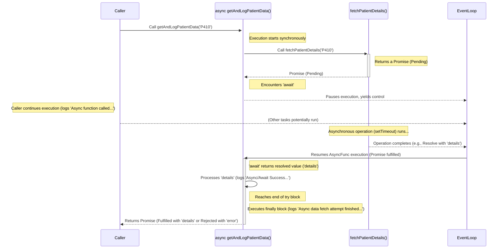

# Module 5: JavaScript Essentials for React Native

Welcome to Module 5! JavaScript is the language you'll use to build the logic and user interface of your React Native applications. While React Native abstracts away many platform differences, a solid understanding of modern JavaScript (ES6/ECMAScript 2015 and beyond) is absolutely fundamental to writing effective, efficient, and maintainable code. This module serves as a focused refresher and deep dive into the core JavaScript concepts essential for success with React Native. We'll cover everything from variables and data types to asynchronous operations and modules, ensuring you have the foundational knowledge needed for the subsequent React and React Native modules.

> [!TIP]
> 🧑‍💻 **Experienced JavaScript Developers:** If you already have significant experience with modern JavaScript (ES6+), you might find many concepts in this module familiar. We recommend skimming through the sections to refresh your knowledge, paying particular attention to examples demonstrating concepts in the context of React Native (like arrow functions and `this` binding, or asynchronous patterns) and any differences highlighted in the **Background Bridge Notes**. Focus on how these core features are applied within the React Native ecosystem.

**Learning Objectives**

By the end of this module, you will be able to:

*   Declare variables using `let` and `const` and understand their scope.
*   Identify and use common JavaScript data types (primitives and objects).
*   Apply various operators for manipulation and comparison.
*   Implement control flow logic using conditionals and loops.
*   Define and invoke functions using various syntaxes, including arrow functions.
*   Explain function scope and the concept of closures.
*   Manipulate objects and arrays using common methods, destructuring, and spread/rest syntax.
*   Explain the difference between synchronous and asynchronous code.
*   Use Callbacks, Promises, and `async`/`await` to handle asynchronous operations.
*   Organize code into reusable modules using `import` and `export`.

**Prerequisites**

*   Completion of [Module 4: Web Development Essentials Refresher](./module-04-web-development-essentials-refresher.md). (Assumes basic familiarity with HTML/CSS concepts).

## Section 1: Variables, Data Types, and Operators

This section revisits the building blocks of JavaScript: how to store data in variables, the different types of data you'll encounter, and the operators used to work with that data. We focus on modern ES6+ practices.

In JavaScript, variables are containers for storing data values. Before ES6, `var` was the primary way to declare variables. However, `var` has some nuances with scoping (it's function-scoped, not block-scoped) that can lead to unexpected behavior. Modern JavaScript development strongly favors `let` and `const`.

*   `let`: Use `let` to declare variables whose values might need to change later. `let` variables are block-scoped, meaning they are only accessible within the block of code (e.g., inside an `if` statement or `for` loop) where they are defined.
*   `const`: Use `const` to declare variables whose values should *not* be reassigned after initialization. It's also block-scoped. This is preferred for most variables as it makes code easier to reason about – you know the value won't change unexpectedly. Note that for objects and arrays declared with `const`, the *contents* of the object or array can still be modified, but the variable cannot be reassigned to a different object or array.

```javascript
// Using let for a value that might change
let patientAge = 35;
patientAge = 36; // This is allowed

// Using const for a value that shouldn't change
const patientId = 'SN734-982';
// patientId = 'SN734-983'; // This would cause an error

// Const with an object
const medicationDetails = { name: 'Lisinopril', dosage: '10mg' };
medicationDetails.dosage = '20mg'; // Modifying object property is allowed
// medicationDetails = { name: 'Amlodipine', dosage: '5mg' }; // Reassigning the const variable is NOT allowed
```

**Data Types**

JavaScript has several built-in data types:

*   **Primitive Types:**
    *   `string`: Represents textual data (e.g., `'Lisinopril'`, `"Patient Name"`).
    *   `number`: Represents numeric data, including integers and floating-point numbers (e.g., `10`, `3.14`, `NaN`, `Infinity`).
    *   `boolean`: Represents logical values: `true` or `false`.
    *   `null`: Represents the intentional absence of any object value. It's treated as falsy in boolean contexts.
    *   `undefined`: Represents a variable that has been declared but not yet assigned a value. It's also the return value of functions that don't explicitly return anything. Treated as falsy.
    *   `symbol` (ES6): Represents a unique and immutable identifier. Often used as keys for object properties to avoid naming collisions.
    *   `bigint` (ES2020): Represents integers with arbitrary precision, useful for numbers larger than `Number.MAX_SAFE_INTEGER`.

*   **Object Type:**
    *   `object`: Represents collections of key-value pairs (properties) or more complex data structures. Arrays, functions, and built-in objects like `Date` and `RegExp` are all technically objects in JavaScript.

You can check the type of a variable using the `typeof` operator. Note that `typeof null` surprisingly returns `"object"` (a long-standing quirk).

```javascript
let medicationName = 'Ibuprofen'; // string
let dosage = 200;                 // number
let isPrescription = false;       // boolean
let sideEffects = null;           // null
let nextRefillDate;               // undefined
const uniqueId = Symbol('id');    // symbol

console.log(typeof medicationName); // "string"
console.log(typeof dosage);         // "number"
console.log(typeof isPrescription); // "boolean"
console.log(typeof sideEffects);    // "object" (quirk)
console.log(typeof nextRefillDate); // "undefined"
console.log(typeof uniqueId);       // "symbol"
```

**Operators**

Operators perform operations on values (operands). Key types include:

*   **Assignment:** `=` (assign), `+=`, `-=`, `*=`, `/=` (assign after operation).
*   **Arithmetic:** `+` (add/concatenate), `-` (subtract), `*` (multiply), `/` (divide), `%` (modulo), `**` (exponentiation - ES7), `++` (increment), `--` (decrement).
*   **Comparison:** `==` (loose equality - performs type coercion, avoid!), `!=` (loose inequality - avoid!), `===` (strict equality - no type coercion, preferred), `!==` (strict inequality - preferred), `>`, `<`, `>=`, `<=`.
*   **Logical:** `&&` (AND), `||` (OR), `!` (NOT). These work with "truthy" and "falsy" values. Falsy values include `false`, `0`, `""`, `null`, `undefined`, and `NaN`. All other values are truthy.
*   **Ternary:** `condition ? valueIfTrue : valueIfFalse`. A concise way to write simple `if-else` statements.
*   **Typeof:** `typeof variable` (returns string indicating type).

```javascript
// SpeedyMeds Example: Calculate remaining pills
const pillsPerRefill = 90;
let pillsTaken = 15;
let remainingPills = pillsPerRefill - pillsTaken; // Arithmetic: 75

remainingPills -= 5; // Assignment: remainingPills is now 70

const dosageMg = 20;
const refillsAvailable = 3;

// Comparison and Logical
const needsRefillSoon = remainingPills < 30 && refillsAvailable > 0; // true if less than 30 pills AND refills exist
console.log(`Needs refill soon: ${needsRefillSoon}`); // "Needs refill soon: false"

// Ternary
const patientStatus = remainingPills > 0 ? 'Active Medication' : 'Needs Refill';
console.log(`Status: ${patientStatus}`); // "Status: Active Medication"

// Strict Equality (Preferred)
console.log(dosageMg === '20'); // false (number vs string)
console.log(dosageMg == '20'); // true (loose equality - avoid!)
```

Understanding these fundamentals – how to declare variables with appropriate scope, the types of data you'll work with, and how operators manipulate them – is crucial before moving on to control structures and functions.

> 📚 **Official Documentation:**
>
> *   [MDN Web Docs: JavaScript data types and data structures](https://developer.mozilla.org/en-US/docs/Web/JavaScript/Data_structures)
> *   [MDN Web Docs: let](https://developer.mozilla.org/en-US/docs/Web/JavaScript/Reference/Statements/let)
> *   [MDN Web Docs: const](https://developer.mozilla.org/en-US/docs/Web/JavaScript/Reference/Statements/const)
> *   [MDN Web Docs: Expressions and Operators](https://developer.mozilla.org/en-US/docs/Web/JavaScript/Reference/Operators)
>
> 🗂️ **Additional Resources:**
>
> *   [JavaScript.info: Variables](https://javascript.info/variables)
> *   [JavaScript.info: Data types](https://javascript.info/types)
> *   [JavaScript.info: Basic operators, maths](https://javascript.info/operators)

## Section 2: Control Flow

Control flow refers to the order in which statements are executed in a script. By default, code runs from top to bottom, but control flow statements allow you to alter this sequence based on conditions or repeat blocks of code.

**Conditional Statements**

Conditional statements execute different blocks of code based on whether a condition evaluates to `true` or `false`.

*   **`if...else`:** The most common conditional structure.

    ```javascript
    const patientAge = 68;
    let dosageRecommendation;

    if (patientAge >= 65) {
      dosageRecommendation = 'Start with lower dose';
    } else if (patientAge < 18) {
      dosageRecommendation = 'Consult pediatric guidelines';
    } else {
      dosageRecommendation = 'Standard dose appropriate';
    }
    console.log(dosageRecommendation); // Output: Start with lower dose
    ```

*   **`switch`:** Useful when you have multiple possible conditions based on a single value.

    ```javascript
    const medicationType = 'PainRelief';
    let instructions;

    switch (medicationType) {
      case 'Antibiotic':
        instructions = 'Take with food, complete full course.';
        break; // Important: prevents "fall-through"
      case 'PainRelief':
        instructions = 'Take as needed for pain, do not exceed maximum daily dose.';
        break;
      case 'BloodPressure':
        instructions = 'Take once daily in the morning.';
        break;
      default:
        instructions = 'Follow specific instructions on the label.';
    }
    console.log(instructions); // Output: Take as needed for pain...
    ```
    Remember the `break` statement; without it, execution will "fall through" to the next `case`.

**Looping Statements**

Loops allow you to execute a block of code repeatedly.

*   **`for` loop:** The classic loop, great when you know the number of iterations beforehand. It has three parts: initialization, condition, and final expression (often increment/decrement).

    ```javascript
    // SpeedyMeds: Log scheduled reminders for the next 3 days
    console.log('Medication Reminders:');
    for (let day = 1; day <= 3; day++) {
      console.log(`Day ${day}: Take morning medication.`);
    }
    // Output:
    // Medication Reminders:
    // Day 1: Take morning medication.
    // Day 2: Take morning medication.
    // Day 3: Take morning medication.
    ```

*   **`while` loop:** Executes a block as long as a condition remains `true`. The condition is checked *before* each iteration.

    ```javascript
    // SpeedyMeds: Dispense pills until target count is reached
    let pillsDispensed = 0;
    const targetPillCount = 5;

    while (pillsDispensed < targetPillCount) {
      pillsDispensed++;
      console.log(`Dispensing pill #${pillsDispensed}`);
    }
    console.log('Finished dispensing.');
    // Output: Logs dispensing 1 through 5, then Finished.
    ```

*   **`do...while` loop:** Similar to `while`, but the condition is checked *after* the block executes. This guarantees the block runs at least once.

    ```javascript
    // Useful for scenarios where you need to perform an action once before checking
    let confirmationCode;
    do {
      // Simulate generating a code until it meets a certain criteria (e.g., length)
      confirmationCode = Math.random().toString(36).substring(2, 8);
      console.log(`Generated code: ${confirmationCode}`);
    } while (confirmationCode.length < 6); // Example condition
    ```

*   **`for...in` loop:** Iterates over the *enumerable property names* (keys) of an object. Generally **not** recommended for iterating over arrays because it can include inherited properties and doesn't guarantee order.

    ```javascript
    const patientProfile = {
      name: 'Jane Doe',
      age: 42,
      condition: 'Hypertension'
    };

    console.log('Patient Profile Details:');
    for (const key in patientProfile) {
      // It's good practice to check if the property belongs directly to the object
      if (Object.hasOwn(patientProfile, key)) {
        console.log(`${key}: ${patientProfile[key]}`);
      }
    }
    // Output:
    // Patient Profile Details:
    // name: Jane Doe
    // age: 42
    // condition: Hypertension
    ```

*   **`for...of` loop (ES6):** Iterates over the *values* of iterable objects like Arrays, Strings, Maps, Sets, etc. This is the **preferred** way to loop over array elements.

    ```javascript
    const upcomingAppointments = ['Dr. Smith - 10:00 AM', 'Lab Work - 2:30 PM', 'Dr. Jones - Follow-up'];

    console.log('Upcoming Appointments:');
    for (const appointment of upcomingAppointments) {
      console.log(`- ${appointment}`);
    }
    // Output:
    // Upcoming Appointments:
    // - Dr. Smith - 10:00 AM
    // - Lab Work - 2:30 PM
    // - Dr. Jones - Follow-up
    ```

Mastering control flow allows you to build dynamic applications that respond to different conditions and efficiently process data collections.

> 📚 **Official Documentation:**
>
> *   [MDN Web Docs: Control flow and error handling](https://developer.mozilla.org/en-US/docs/Web/JavaScript/Guide/Control_flow_and_error_handling)
> *   [MDN Web Docs: if...else](https://developer.mozilla.org/en-US/docs/Web/JavaScript/Reference/Statements/if...else)
> *   [MDN Web Docs: switch](https://developer.mozilla.org/en-US/docs/Web/JavaScript/Reference/Statements/switch)
> *   [MDN Web Docs: for](https://developer.mozilla.org/en-US/docs/Web/JavaScript/Reference/Statements/for)
> *   [MDN Web Docs: while](https://developer.mozilla.org/en-US/docs/Web/JavaScript/Reference/Statements/while)
> *   [MDN Web Docs: do...while](https://developer.mozilla.org/en-US/docs/Web/JavaScript/Reference/Statements/do...while)
> *   [MDN Web Docs: for...in](https://developer.mozilla.org/en-US/docs/Web/JavaScript/Reference/Statements/for...in)
> *   [MDN Web Docs: for...of](https://developer.mozilla.org/en-US/docs/Web/JavaScript/Reference/Statements/for...of)
>
> 🗂️ **Additional Resources:**
>
> *   [JavaScript.info: Conditional branching: if, '?'](https://javascript.info/ifelse)
> *   [JavaScript.info: Loops: while and for](https://javascript.info/while-for)

## Section 3: Functions

Functions are fundamental building blocks in JavaScript. They are blocks of reusable code designed to perform a specific task. Functions allow you to organize your code, make it more readable, and avoid repetition.

**Defining Functions**

There are several ways to define functions:

*   **Function Declaration:** Defined using the `function` keyword. These are "hoisted," meaning the JavaScript interpreter moves their declaration to the top of their scope before code execution, so you can call them before they appear in the code.

    ```javascript
    function calculateDosage(weightKg, dosePerKg) {
      return weightKg * dosePerKg;
    }

    const patientWeight = 70;
    const requiredDosage = calculateDosage(patientWeight, 1.5); // Call before/after definition is fine
    console.log(`Required dosage: ${requiredDosage}mg`); // Output: Required dosage: 105mg
    ```

*   **Function Expression:** Assigning an anonymous (or named) function to a variable. These are *not* hoisted; you must define them before you call them.

    ```javascript
    const getPatientGreeting = function(patientName) {
      return `Welcome to SpeedyMeds, ${patientName}!`;
    };

    console.log(getPatientGreeting('Alice')); // Output: Welcome to SpeedyMeds, Alice!
    ```

*   **Arrow Functions (ES6):** A more concise syntax for writing function expressions. They are always anonymous and have important differences regarding the `this` keyword.

    ```javascript
    // Concise syntax for single expression return
    const calculateBmi = (weightKg, heightM) => weightKg / (heightM * heightM);

    // Block body for multiple statements
    const logMedicationReminder = (medicationName, time) => {
      const message = `Reminder: Take ${medicationName} at ${time}.`;
      console.log(message);
      // Can have more logic here
    };

    console.log(`BMI: ${calculateBmi(75, 1.8)}`); // Output: BMI: 23.14...
    logMedicationReminder('Metformin', '8:00 AM'); // Output: Reminder: Take Metformin at 8:00 AM.
    ```

**Arrow Functions and `this`**

This is a critical concept for React and React Native.

*   **Regular Functions:** The value of `this` inside a regular function (declaration or expression) depends on *how the function is called*. It can be the global object (`window` in browsers, `undefined` in strict mode or modules), the object that called the method, or explicitly set using `.call()`, `.apply()`, or `.bind()`. This dynamic nature of `this` can be confusing.
*   **Arrow Functions:** Arrow functions do **not** have their own `this` binding. Instead, they inherit `this` from the surrounding (lexical) scope where they were defined. This behavior is often more intuitive, especially within classes or React components where you want `this` to consistently refer to the component instance.

> ⚛️ **React Developers:**
> **Comparison:** In React class components, you often had to `.bind(this)` for event handlers defined with regular function syntax to ensure `this` referred to the component instance. Arrow functions defined as class properties or within functional components using Hooks largely eliminate this need, as they lexically capture the correct `this` context (or don't rely on `this` at all in functional components).
>
> **Key Takeaway:** Arrow functions provide a more predictable `this` binding, simplifying event handling and asynchronous callbacks within React Native components compared to traditional function expressions.
>
> **Source:** [MDN Web Docs: this](https://developer.mozilla.org/en-US/docs/Web/JavaScript/Reference/Operators/this), [React Docs: Handling Events](https://react.dev/learn/responding-to-events)

**Parameters and Arguments**

*   **Parameters:** Variables listed in the function definition.
*   **Arguments:** Actual values passed to the function when it's called.
*   **Default Parameters (ES6):** Assign default values to parameters if no argument or `undefined` is passed.

    ```javascript
    function recordVitals(patientId, temperature = 37.0, pulse = 70) {
      console.log(`Patient ${patientId}: Temp ${temperature}°C, Pulse ${pulse}bpm`);
    }

    recordVitals('P123'); // Output: Patient P123: Temp 37°C, Pulse 70bpm
    recordVitals('P456', 38.1); // Output: Patient P456: Temp 38.1°C, Pulse 70bpm
    recordVitals('P789', undefined, 85); // Output: Patient P789: Temp 37°C, Pulse 85bpm
    ```
*   **Rest Parameters (ES6):** Collect an indefinite number of arguments into an array using `...`. Must be the last parameter.

    ```javascript
    function logSymptoms(patientId, ...symptoms) {
      console.log(`Patient ${patientId} reported symptoms:`);
      if (symptoms.length === 0) {
        console.log('- None reported');
      } else {
        symptoms.forEach(symptom => console.log(`- ${symptom}`));
      }
    }

    logSymptoms('P101', 'Headache', 'Fatigue');
    // Output:
    // Patient P101 reported symptoms:
    // - Headache
    // - Fatigue

    logSymptoms('P102');
    // Output:
    // Patient P102 reported symptoms:
    // - None reported
    ```

**Scope and Closures**

*   **Scope:** Determines the accessibility of variables.
    *   **Global Scope:** Variables declared outside any function. Accessible everywhere. Avoid polluting the global scope.
    *   **Function Scope:** Variables declared with `var` inside a function are accessible only within that function.
    *   **Block Scope (ES6):** Variables declared with `let` or `const` inside a block (`{...}`) are accessible only within that block.
*   **Closures:** A closure occurs when a function "remembers" its lexical scope (the environment where it was created) even when the function is executed outside that scope. This allows inner functions to access variables from their outer function's scope.

    ```javascript
    // "Under the hood" explanation of closures
    function createMedicationReminder(medicationName) {
      // Outer function scope: medicationName is captured
      const reminderMessage = `Remember to take your ${medicationName}.`;

      // Inner function (the closure)
      return function() {
        // This inner function "closes over" reminderMessage and medicationName
        // even after createMedicationReminder has finished executing.
        console.log(reminderMessage);
      };
    }

    const lisinoprilReminder = createMedicationReminder('Lisinopril');
    const metforminReminder = createMedicationReminder('Metformin');

    // Later, when these returned functions are called, they still have access
    // to the specific medicationName they were created with.
    lisinoprilReminder(); // Output: Remember to take your Lisinopril.
    metforminReminder(); // Output: Remember to take your Metformin.
    ```
    Closures are powerful for creating private data, factories, and maintaining state in asynchronous operations.

Functions are essential for structuring your React Native code logically and efficiently. Understanding arrow functions and closures is particularly important for modern development patterns.

> 📚 **Official Documentation:**
>
> *   [MDN Web Docs: Functions](https://developer.mozilla.org/en-US/docs/Web/JavaScript/Guide/Functions)
> *   [MDN Web Docs: Arrow function expressions](https://developer.mozilla.org/en-US/docs/Web/JavaScript/Reference/Functions/Arrow_functions)
> *   [MDN Web Docs: Default parameters](https://developer.mozilla.org/en-US/docs/Web/JavaScript/Reference/Functions/Default_parameters)
> *   [MDN Web Docs: Rest parameters](https://developer.mozilla.org/en-US/docs/Web/JavaScript/Reference/Functions/rest_parameters)
> *   [MDN Web Docs: Closures](https://developer.mozilla.org/en-US/docs/Web/JavaScript/Closures)
> *   [MDN Web Docs: Scope](https://developer.mozilla.org/en-US/docs/Glossary/Scope)
>
> 🗂️ **Additional Resources:**
>
> *   [JavaScript.info: Functions](https://javascript.info/function-basics)
> *   [JavaScript.info: Arrow functions basics](https://javascript.info/arrow-functions-basics)
> *   [JavaScript.info: Variable scope, closure](https://javascript.info/closure)

**(https://codesandbox.io/...)** <!-- Placeholder for Exercise 5.1 Link -->

## Section 4: Objects and Arrays

Objects and arrays are the primary ways to structure collections of data in JavaScript. Mastering their manipulation is key to handling application state, API responses, and more in React Native.

**Objects**

Objects are collections of key-value pairs, where keys are usually strings (or Symbols) and values can be any data type, including other objects or functions (called methods).

*   **Object Literals:** The most common way to create objects.

    ```javascript
    const prescription = {
      medicationId: 'MED456',
      patientName: 'Bob Martin',
      medicationName: 'Atorvastatin',
      dosage: '20mg',
      frequency: 'Once daily',
      refillsRemaining: 2,
      // Method (function as a property)
      displaySummary: function() {
        console.log(`${this.medicationName} (${this.dosage}) for ${this.patientName}. Frequency: ${this.frequency}.`);
      },
      // ES6 Method Syntax
      useRefill() {
        if (this.refillsRemaining > 0) {
          this.refillsRemaining--;
          console.log(`Refill used. Remaining: ${this.refillsRemaining}`);
          return true;
        } else {
          console.log('No refills remaining.');
          return false;
        }
      }
    };

    // Accessing properties
    console.log(prescription.medicationName); // Output: Atorvastatin
    console.log(prescription['dosage']);     // Output: 20mg (useful for keys with spaces or dynamic keys)

    // Calling methods
    prescription.displaySummary(); // Output: Atorvastatin (20mg) for Bob Martin...
    prescription.useRefill();      // Output: Refill used. Remaining: 1
    ```

**Arrays**

Arrays are ordered lists of values, indexed starting from 0.

*   **Array Literals:**

    ```javascript
    const patientSymptoms = ['Fatigue', 'Dizziness', 'Shortness of breath'];
    const vitalSignsHistory = [
      { timestamp: '2024-10-26T08:00:00Z', bp: '120/80', pulse: 72 },
      { timestamp: '2024-10-27T08:15:00Z', bp: '125/82', pulse: 75 }
    ];

    // Accessing elements
    console.log(patientSymptoms[0]); // Output: Fatigue
    console.log(vitalSignsHistory[1].bp); // Output: 125/82

    // Array length
    console.log(`Number of symptoms: ${patientSymptoms.length}`); // Output: 3
    ```

**Common Array Methods**

These are essential for data transformation in React Native (often used for rendering lists):

*   `forEach()`: Executes a provided function once for each array element. (Doesn't return a new array).
*   `map()`: Creates a **new array** populated with the results of calling a provided function on every element. Crucial for transforming data for UI rendering (e.g., turning an array of data objects into an array of React components).
*   `filter()`: Creates a **new array** with all elements that pass the test implemented by the provided function.
*   `reduce()`: Executes a "reducer" function on each element, resulting in a single output value (e.g., summing numbers, accumulating results).
*   `find()`: Returns the **first element** in the array that satisfies the provided testing function.
*   `findIndex()`: Returns the **index** of the first element that satisfies the test.
*   `some()`: Tests whether **at least one** element passes the test.
*   `every()`: Tests whether **all** elements pass the test.
*   `includes()`: Determines whether an array includes a certain value.
*   `push()` / `pop()`: Add/remove elements from the end.
*   `shift()` / `unshift()`: Add/remove elements from the beginning.
*   `slice()`: Returns a shallow copy of a portion of an array into a new array object.
*   `splice()`: Changes the contents of an array by removing or replacing existing elements and/or adding new elements *in place*.

```javascript
const medications = [
  { id: 'm1', name: 'Lisinopril', type: 'BloodPressure', stock: 50 },
  { id: 'm2', name: 'Metformin', type: 'Diabetes', stock: 120 },
  { id: 'm3', name: 'Simvastatin', type: 'Cholesterol', stock: 80 },
  { id: 'm4', name: 'Amlodipine', type: 'BloodPressure', stock: 0 },
];

// map: Get just the names
const medicationNames = medications.map(med => med.name);
console.log(medicationNames); // Output: ['Lisinopril', 'Metformin', 'Simvastatin', 'Amlodipine']

// filter: Get medications that are in stock
const inStockMeds = medications.filter(med => med.stock > 0);
console.log(inStockMeds.length); // Output: 3

// find: Find the Metformin record
const metforminRecord = medications.find(med => med.name === 'Metformin');
console.log(metforminRecord); // Output: { id: 'm2', name: 'Metformin', ... }

// reduce: Calculate total stock of all medications
const totalStock = medications.reduce((sum, med) => sum + med.stock, 0); // 0 is initial value
console.log(`Total stock: ${totalStock}`); // Output: Total stock: 250

// some: Check if any medication is out of stock
const anyOutOfStock = medications.some(med => med.stock === 0);
console.log(`Any out of stock? ${anyOutOfStock}`); // Output: Any out of stock? true
```

**Destructuring Assignment (ES6)**

A concise way to extract values from arrays or properties from objects into distinct variables.

```javascript
// Object Destructuring
const patient = { id: 'P789', firstName: 'Carol', lastName: 'Danvers', age: 38 };
const { firstName, age, condition = 'Unknown' } = patient; // Assign default value if property doesn't exist

console.log(firstName); // Output: Carol
console.log(age);       // Output: 38
console.log(condition); // Output: Unknown

// Renaming variables during destructuring
const { lastName: surname } = patient;
console.log(surname); // Output: Danvers

// Array Destructuring
const primaryVitals = ['120/80', 72, 98.6];
const [bloodPressure, pulse] = primaryVitals;

console.log(bloodPressure); // Output: 120/80
console.log(pulse);       // Output: 72
```

**Spread Syntax (`...`) (ES6)**

Expands an iterable (like an array) or object properties into places where multiple arguments or elements/properties are expected. Useful for creating copies, merging, and passing arguments.

```javascript
// Array Spread: Creating copies and merging
const morningMeds = ['Lisinopril', 'Metformin'];
const eveningMeds = ['Simvastatin'];
const allMeds = [...morningMeds, ...eveningMeds, 'Aspirin'];
console.log(allMeds); // Output: ['Lisinopril', 'Metformin', 'Simvastatin', 'Aspirin']

const morningMedsCopy = [...morningMeds]; // Creates a shallow copy
morningMedsCopy.push('Vitamin D');
console.log(morningMeds);     // Output: ['Lisinopril', 'Metformin'] (original unchanged)
console.log(morningMedsCopy); // Output: ['Lisinopril', 'Metformin', 'Vitamin D']

// Object Spread: Creating copies and merging properties
const baseProfile = { name: 'David Banner', dob: '1970-05-12' };
const medicalInfo = { condition: 'Stress', allergies: 'None' };
const fullProfile = { ...baseProfile, ...medicalInfo, name: 'Dr. David Banner' }; // Properties later in the spread overwrite earlier ones

console.log(fullProfile);
// Output: { name: 'Dr. David Banner', dob: '1970-05-12', condition: 'Stress', allergies: 'None' }

// Using spread for function arguments
function logVitals(bp, pulse, temp) {
  console.log(`BP: ${bp}, Pulse: ${pulse}, Temp: ${temp}`);
}
const currentVitals = ['130/85', 80, 37.1];
logVitals(...currentVitals); // Spreads array elements as individual arguments
// Output: BP: 130/85, Pulse: 80, Temp: 37.1
```

Efficiently working with objects and arrays using these methods and syntax features is crucial for managing data and state within your React Native applications.

> 📚 **Official Documentation:**
>
> *   [MDN Web Docs: Objects](https://developer.mozilla.org/en-US/docs/Web/JavaScript/Guide/Working_with_Objects)
> *   [MDN Web Docs: Array](https://developer.mozilla.org/en-US/docs/Web/JavaScript/Reference/Global_Objects/Array)
> *   [MDN Web Docs: Destructuring assignment](https://developer.mozilla.org/en-US/docs/Web/JavaScript/Reference/Operators/Destructuring_assignment)
> *   [MDN Web Docs: Spread syntax (...)](https://developer.mozilla.org/en-US/docs/Web/JavaScript/Reference/Operators/Spread_syntax)
>
> 🗂️ **Additional Resources:**
>
> *   [JavaScript.info: Objects](https://javascript.info/object)
> *   [JavaScript.info: Arrays](https://javascript.info/array)
> *   [JavaScript.info: Array methods](https://javascript.info/array-methods)
> *   [JavaScript.info: Destructuring assignment](https://javascript.info/destructuring-assignment)

**(https://codesandbox.io/...)** <!-- Placeholder for Exercise 5.2 Link -->

## Section 5: Asynchronous JavaScript

Much of what happens in a mobile app, especially interacting with networks (fetching data), timers, or user input, is inherently asynchronous. JavaScript uses an event loop model to handle these operations without blocking the main thread, ensuring a responsive user interface. Understanding async patterns is vital for React Native.

**Synchronous vs. Asynchronous**

*   **Synchronous:** Code executes line by line, one operation at a time. Each operation must complete before the next one starts. If an operation takes a long time (like a complex calculation or a network request in a synchronous model), it blocks the entire program.
*   **Asynchronous:** Operations (like fetching data) can be initiated, and the program can continue running other code while waiting for the operation to complete. When the operation finishes, a callback function, Promise handler, or `async/await` continuation executes.

**Callbacks**

The traditional way to handle asynchronous results. You pass a function (the callback) to an asynchronous operation, and that function gets called when the operation completes (either successfully or with an error).

```javascript
// Conceptual example - Don't use this pattern for complex scenarios
function fetchMedicationList(patientId, callback) {
  console.log(`Fetching medications for patient ${patientId}...`);
  // Simulate network delay
  setTimeout(() => {
    const success = Math.random() > 0.2; // Simulate occasional failure
    if (success) {
      const medications = ['Lisinopril', 'Metformin'];
      callback(null, medications); // Convention: null for error, then data
    } else {
      callback('Error fetching medication list', null); // Error first
    }
  }, 1500); // 1.5 second delay
}

fetchMedicationList('P201', (error, medications) => {
  if (error) {
    console.error(`Callback Error: ${error}`);
  } else {
    console.log('Callback Success: Medications received:', medications);
  }
});

console.log('Medication request initiated...'); // This logs almost immediately
```

While simple for basic cases, heavily nested callbacks ("Callback Hell" or the "Pyramid of Doom") become difficult to read, manage, and debug.

**Promises (ES6)**

Promises provide a cleaner, more structured way to handle asynchronous operations and avoid callback hell. A Promise represents the eventual result of an asynchronous operation. It can be in one of three states:

*   `pending`: Initial state, neither fulfilled nor rejected.
*   `fulfilled`: The operation completed successfully.
*   `rejected`: The operation failed.

Promises have `.then()` (for success), `.catch()` (for errors), and `.finally()` (executes regardless of outcome) methods.

```javascript
function fetchPatientDetails(patientId) {
  console.log(`Fetching details for patient ${patientId}...`);
  return new Promise((resolve, reject) => {
    // Simulate network delay
    setTimeout(() => {
      const success = Math.random() > 0.2;
      if (success) {
        const details = { name: 'Sarah Connor', age: 35, condition: 'Stable' };
        resolve(details); // Operation succeeded, pass the result
      } else {
        reject(new Error(`Failed to fetch details for patient ${patientId}`)); // Operation failed, pass an Error object
      }
    }, 1000);
  });
}

console.log('Requesting patient details...');

fetchPatientDetails('P305')
  .then(details => {
    // This runs if the promise is resolved
    console.log('Promise Success:', details);
    // You can chain promises here - return another promise
    // return fetchMedicationList(patientId); // Example chaining
  })
  .catch(error => {
    // This runs if the promise is rejected at any point in the chain
    console.error('Promise Error:', error.message);
  })
  .finally(() => {
    // This runs regardless of success or failure
    console.log('Patient detail request complete.');
  });
```

`Promise.all()` takes an array of promises and resolves when *all* promises in the array resolve, or rejects if *any* promise rejects. `Promise.race()` resolves or rejects as soon as the *first* promise in the array resolves or rejects.

**`async`/`await` (ES7/ES2017)**

`async`/`await` provides syntactic sugar on top of Promises, making asynchronous code look and behave a bit more like synchronous code, which improves readability significantly.

*   `async` keyword: Placed before a function declaration, it makes the function implicitly return a Promise.
*   `await` keyword: Used *inside* an `async` function, it pauses the function execution until the awaited Promise settles (resolves or rejects). If the Promise resolves, `await` returns the resolved value. If it rejects, it throws the rejected error (which can be caught using `try...catch`).

```javascript
// Rewriting the fetchPatientDetails example with async/await
async function getAndLogPatientData(patientId) {
  console.log(`Initiating async fetch for patient ${patientId}...`);
  try {
    // Pause execution here until fetchPatientDetails promise resolves
    const details = await fetchPatientDetails(patientId);
    console.log('Async/Await Success:', details);

    // You could await another promise here
    // const medications = await fetchMedicationList(patientId);
    // console.log('Medications:', medications);

    return details; // The async function implicitly returns Promise.resolve(details)
  } catch (error) {
    // Catch errors from any awaited promise that rejects
    console.error('Async/Await Error:', error.message);
    // The async function implicitly returns Promise.reject(error)
  } finally {
    console.log(`Async data fetch attempt finished for patient ${patientId}.`);
  }
}

getAndLogPatientData('P410');
console.log('Async function called...'); // This logs before the async function completes
```

**Async/Await Flow Diagram**



**Diagram Description:**

This sequence diagram illustrates the execution flow of an `async` function using `await`.

1.  The `Caller` invokes the `async getAndLogPatientData()` function.
2.  `AsyncFunc` starts executing synchronously and calls `fetchPatientDetails()`, which returns a pending `Promise`.
3.  `AsyncFunc` encounters the `await` keyword while waiting for the `Promise` from `fetchPatientDetails()`.
4.  Crucially, `AsyncFunc` **pauses** its execution at the `await` and yields control back to the `EventLoop`. It does *not* block the main thread.
5.  The `Caller` continues its execution immediately after calling `AsyncFunc` (e.g., logging "Async function called..."). Other tasks managed by the `EventLoop` can run.
6.  Meanwhile, the asynchronous operation within `fetchPatientDetails()` (simulated by `setTimeout`) completes. It either resolves or rejects the `Promise`. Let's assume it resolves successfully.
7.  Once the `Promise` resolves and the call stack is clear, the `EventLoop` schedules the resumption of the paused `AsyncFunc`.
8.  `AsyncFunc` resumes execution immediately after the `await`. The resolved value from the `Promise` is assigned to the `details` variable.
9.  `AsyncFunc` continues its synchronous execution within the `try` block (logging success), executes the `finally` block, and eventually returns a new `Promise` that resolves with the final result (or rejects if an error occurred).

This non-blocking pause-and-resume mechanism is key to how `async`/`await` maintains responsiveness.

> 📲 **Native Developers:**
> **Comparison:** JavaScript's single-threaded event loop model with `async/await` differs significantly from native multithreading (iOS GCD/Operations, Android Coroutines/ThreadPools). Instead of managing background threads directly, you yield control to the event loop during `await`, allowing other JavaScript tasks and UI updates to run. The underlying React Native bridge/JSI handles communication with native APIs, which may use their own threading models, but your JavaScript code remains single-threaded.
>
> **Key Takeaway:** Embrace JavaScript's asynchronous model. Use `async/await` for clean handling of operations like network requests or storage access, understanding it leverages the event loop, not direct thread management from your JS code.
>
> **Source:** [Node.js Guides: The Node.js Event Loop](https://nodejs.org/en/docs/guides/event-loop-timers-and-nexttick), [React Native Docs: Threading Model](https://reactnative.dev/docs/threading-model)

> 🌐 **Web Developers:**
> **Comparison:** Client-side asynchronous JavaScript using `async/await` operates very similarly to how you'd use it in the browser for `fetch` requests or timers. The core concepts of Promises and the event loop are the same. The main difference in React Native is the *specific APIs* you'll be awaiting (e.g., native module calls, `AsyncStorage` access, React Native specific networking libraries) rather than browser-specific DOM APIs or `XMLHttpRequest`.
>
> **Key Takeaway:** Your existing web knowledge of `async/await` and Promises translates directly. Focus on learning the React Native specific asynchronous APIs you'll interact with.

Mastering asynchronous JavaScript, especially with Promises and `async`/`await`, is essential for building responsive and performant React Native applications that interact with data and external services.

> 📚 **Official Documentation:**
>
> *   [MDN Web Docs: Asynchronous JavaScript](https://developer.mozilla.org/en-US/docs/Web/JavaScript/Reference/Statements/async_function)
> *   [MDN Web Docs: Promise](https://developer.mozilla.org/en-US/docs/Web/JavaScript/Reference/Global_Objects/Promise)
> *   [MDN Web Docs: async function](https://developer.mozilla.org/en-US/docs/Web/JavaScript/Reference/Statements/async_function)
> *   [MDN Web Docs: await](https://developer.mozilla.org/en-US/docs/Web/JavaScript/Reference/Operators/await)
>
> 🗂️ **Additional Resources:**
>
> *   [JavaScript.info: Async/await](https://javascript.info/async-await)
> *   [JavaScript.info: Promises, async/await](https://javascript.info/async)
> *   [Jake Archibald: Tasks, microtasks, queues and schedules](https://jakearchibald.com/2015/tasks-microtasks-queues-and-schedules/) (Advanced Event Loop explanation)

**(https://codesandbox.io/...)** <!-- Placeholder for Exercise 5.3 Link -->

## Section 6: ES6 Modules

As applications grow, splitting code into smaller, reusable pieces called modules becomes crucial for organization and maintainability. ES6 introduced a standard module system built into JavaScript. React Native uses this system extensively.

**Core Concepts**

*   **Module Scope:** Each JavaScript file treated as a module has its own scope. Variables, functions, or classes declared in a module are private to that module unless explicitly exported.
*   **`export`:** Makes variables, functions, or classes available for use in other modules.
*   **`import`:** Brings exported functionality from another module into the current module's scope.

**Exporting**

There are two main types of exports:

*   **Named Exports:** Export multiple values from a single module. They are imported using the exact same name (or aliased).

    ```javascript
    // file: utils/calculations.js
    export const PI = 3.14159;

    export function calculateCircumference(radius) {
      return 2 * PI * radius;
    }

    export function calculateArea(radius) {
      return PI * radius * radius;
    }

    // You can also export at the end
    // const EULER_NUMBER = 2.718;
    // export { EULER_NUMBER };
    ```

*   **Default Export:** Export a single primary value from a module (often a class or function). A module can have only *one* default export.

    ```javascript
    // file: components/PatientCard.js
    // (Conceptual - full React component in later modules)
    function PatientCard(patientData) {
      console.log(`Displaying card for ${patientData.name}`);
      // ... logic to represent a patient card
      return { /* simplified representation */ };
    }

    export default PatientCard; // Exporting the function as the default
    ```

**Importing**

*   **Importing Named Exports:** Use curly braces `{}` to specify which exports to import by their exact names. You can use `as` to rename them.

    ```javascript
    // file: services/pharmacyService.js
    import { calculateArea, calculateCircumference, PI } from '../utils/calculations.js';
    // Renaming with 'as'
    import { calculateArea as calculateCircleArea } from '../utils/calculations.js';


    console.log(`PI is ${PI}`);
    const shelfRadius = 0.5; // meters
    console.log(`Shelf circumference: ${calculateCircumference(shelfRadius)}m`);
    console.log(`Shelf area: ${calculateCircleArea(shelfRadius)}m²`);
    ```

*   **Importing Default Exports:** You can choose any name for the import.

    ```javascript
    // file: screens/PatientListScreen.js
    import PatientInfoCard from '../components/PatientCard.js'; // Name 'PatientInfoCard' is chosen here

    const patient = { name: 'John Doe' };
    const card = PatientInfoCard(patient);
    ```

*   **Importing Everything (Namespace Import):** Import all named exports from a module as properties of a single object.

    ```javascript
    // file: services/reportingService.js
    import * as calcUtils from '../utils/calculations.js';

    console.log(`Using PI from utils: ${calcUtils.PI}`);
    const vialRadius = 0.02; // meters
    console.log(`Vial area: ${calcUtils.calculateArea(vialRadius)}m²`);
    ```

*   **Mixed Imports:** You can combine default and named imports (though keeping modules focused is often better).

    ```javascript
    // Assuming PatientCard.js also had a named export: export const cardVersion = '1.0';
    // import PatientInfoCard, { cardVersion } from '../components/PatientCard.js';
    // console.log(`Using card version: ${cardVersion}`);
    ```

> [!NOTE]
> **ES Modules vs. CommonJS:** You might encounter `require()` and `module.exports` in older JavaScript code or Node.js environments. This is the CommonJS module system. While React Native's Metro bundler understands both, modern development primarily uses the ES6 `import`/`export` syntax, which is the standard for browsers and preferred in React Native.

Using ES6 modules is standard practice in React Native for organizing your components, utility functions, API services, and state management logic.

> 📚 **Official Documentation:**
>
> *   [MDN Web Docs: JavaScript modules](https://developer.mozilla.org/en-US/docs/Web/JavaScript/Guide/Modules)
> *   [MDN Web Docs: export](https://developer.mozilla.org/en-US/docs/Web/JavaScript/Reference/Statements/export)
> *   [MDN Web Docs: import](https://developer.mozilla.org/en-US/docs/Web/JavaScript/Reference/Statements/import)
>
> 🗂️ **Additional Resources:**
>
> *   [JavaScript.info: Modules, introduction](https://javascript.info/modules)
> *   [Node.js Docs: Modules: ECMAScript modules](https://nodejs.org/api/esm.html) (For comparison/context)

**(https://codesandbox.io/...)** <!-- Placeholder for Challenge 5 Link -->

**Module Summary**

In this module, we covered the essential JavaScript features critical for React Native development. We started with modern variable declarations (`let`, `const`) and fundamental data types. We explored operators for data manipulation and comparison, and learned how to control program execution using conditionals (`if`, `switch`) and loops (`for`, `while`, `for...of`).

We dove into functions, covering different definition syntaxes (declarations, expressions, arrows), the crucial concept of `this` binding (especially for arrow functions), parameters (default, rest), scope, and the powerful closure mechanism. We then focused on manipulating objects and arrays, highlighting essential methods (`map`, `filter`, `reduce`) and modern syntax like destructuring and spread/rest operators.

Crucially, we tackled asynchronous programming, contrasting callbacks with the more robust Promises and the readable `async`/`await` syntax, understanding how JavaScript handles non-blocking operations via the event loop. Finally, we learned how to organize code effectively using the standard ES6 module system (`import`/`export`).

Mastering these JavaScript concepts provides the solid foundation required to effectively learn and apply React and React Native principles in the upcoming modules.

**Further Resources (Optional)**

*   [You Don't Know JS Yet (book series)](https://github.com/getify/You-Dont-Know-JS) - A highly recommended deep dive into JavaScript fundamentals.
*   [Eloquent JavaScript (book)](https://eloquentjavascript.net/) - Another excellent resource for learning JavaScript comprehensively.
*   [MDN JavaScript Guide](https://developer.mozilla.org/en-US/docs/Web/JavaScript/Guide) - The definitive web reference for JavaScript.
