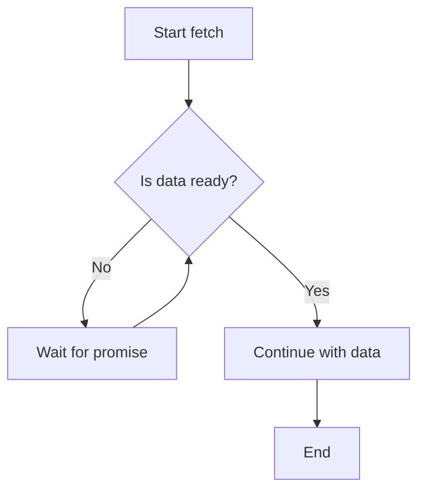

# Module 5: JavaScript essentials for React Native


*Alt text: Abstract illustration of JavaScript code and a mobile phone, representing JavaScript essentials for React Native.*

This module introduces the modern JavaScript (ES6+) features and patterns you'll use every day in React Native development. Mastering these essentials is critical for building robust, maintainable mobile apps. By the end, you'll be able to write clear, efficient code and understand how JavaScript powers the SpeedyMeds app's logic and data flow.

> [!TIP]
> If you're already comfortable with modern JavaScript, skim this module for review—but pay close attention to React Native-specific notes and the SpeedyMeds-themed examples. Key differences and best practices are highlighted throughout.

## Who should take this module?

Whether you're coming from web (React, Angular), native Android, or iOS development, this module bridges your background to the JavaScript skills needed for React Native. Web developers will find many concepts familiar, but some syntax and patterns differ from older JavaScript or other languages. Native developers will see how JavaScript's dynamic, functional style contrasts with Java/Kotlin or Swift/Objective-C.

## Learning objectives

* Declare and use variables with `let` and `const` (ES6+)
* Identify and use JavaScript's core data types and operators
* Write control flow logic with conditionals and loops
* Define and use functions, including arrow functions and closures
* Manipulate objects and arrays using modern syntax (destructuring, spread/rest)
* Write and understand asynchronous code with callbacks, promises, and `async`/`await`
* Import and export code using ES6 modules
* Apply these concepts to real-world pharmacy data in the SpeedyMeds context

## Prerequisites

* Completion of [Module 4: Web development essentials refresher](./module-04-web-development-essentials-refresher.md)
* Basic familiarity with programming concepts (variables, functions, control flow)

---

## Section 1: Variables, data types, and operators (ES6+ focus)

This section covers how to declare variables, work with JavaScript's core data types, and use operators. These are the building blocks for all logic in React Native apps.

### Variable declaration

JavaScript (ES6+) uses `let` and `const` for variable declarations. `let` allows reassignment; `const` creates a constant reference.

```javascript
let medicationCount = 3;
const pharmacyName = "SpeedyMeds";
```

*Use `const` by default. Use `let` only if you need to reassign the variable.*

### Data types

JavaScript's main data types:

* **string**: Text values (`"Amoxicillin"`)
* **number**: Numeric values (`42`, `3.14`)
* **boolean**: `true` or `false`
* **object**: Key-value pairs (e.g., a prescription)
* **array**: Ordered lists (`[1, 2, 3]`)
* **null**: Explicitly no value
* **undefined**: Variable declared but not assigned

```javascript
const prescription = {
  id: "rx123",
  medication: "Amoxicillin",
  quantity: 30,
  isActive: true
};
```

### Operators

Common operators:

* Arithmetic: `+`, `-`, `*`, `/`, `%`
* Assignment: `=`, `+=`, `-=`
* Comparison: `===`, `!==`, `>`, `<`, `>=`, `<=`
* Logical: `&&`, `||`, `!`

```javascript
const isRefillNeeded = prescription.quantity < 5 && prescription.isActive;
```

> ⚛️ **Web React Developers:**
> **Comparison:** Variable scoping with `let`/`const` is the same as in modern React web apps. Avoid `var`—it's not used in React Native or modern JS.
>
> **Key Takeaway:** Always use `let`/`const` for predictable scoping and fewer bugs.
>
> **Source:** [MDN: let](https://developer.mozilla.org/en-US/docs/Web/JavaScript/Reference/Statements/let)

> 🤖 **Android Developers:**
> **Comparison:** JavaScript's `let`/`const` are similar to `var`/`val` in Kotlin, but JS is dynamically typed. Types are not enforced unless you use TypeScript (covered in Module 6).
>
> **Key Takeaway:** JS variables can change type at runtime—be careful with assignments.
>
> **Source:** [Kotlin: Variables](https://kotlinlang.org/docs/variables-basic-types.html)

> 🍏 **iOS Developers:**
> **Comparison:** `let` in JS is not the same as Swift's `let` (which is immutable). In JS, only `const` is truly constant (but objects/arrays declared with `const` can still have their contents changed).
>
> **Key Takeaway:** Use `const` for references that shouldn't change, but remember object properties can still be updated.
>
> **Source:** [Swift: Constants and Variables](https://docs.swift.org/swift-book/documentation/the-swift-programming-language/thebasics/#Constants-and-Variables)

> 📚 **Official Documentation:**
>
> - [MDN: let](https://developer.mozilla.org/en-US/docs/Web/JavaScript/Reference/Statements/let)
> - [MDN: const](https://developer.mozilla.org/en-US/docs/Web/JavaScript/Reference/Statements/const)
> - [MDN: Data types](https://developer.mozilla.org/en-US/docs/Web/JavaScript/Data_structures)
> - [MDN: Operators](https://developer.mozilla.org/en-US/docs/Web/JavaScript/Guide/Expressions_and_Operators)

---

## Section 2: Control flow (conditionals, loops)

Control flow lets you make decisions and repeat actions in your code. You'll use these patterns to process pharmacy data, filter prescriptions, and more.

### Conditionals

Use `if`, `else if`, and `else` to run code based on conditions.

```javascript
if (prescription.isActive) {
  console.log("Prescription is active.");
} else {
  console.log("Prescription is inactive.");
}
```

The ternary operator provides a concise alternative:

```javascript
const status = prescription.isActive ? "Active" : "Inactive";
```

### Loops

Use `for`, `while`, or array methods like `.forEach()` to repeat actions.

```javascript
const prescriptions = [
  { id: "rx1", medication: "Amoxicillin" },
  { id: "rx2", medication: "Ibuprofen" }
];

for (let i = 0; i < prescriptions.length; i++) {
  console.log(prescriptions[i].medication);
}

// Or, using forEach:
prescriptions.forEach(p => console.log(p.medication));
```

> ⚛️ **Web React Developers:**
> **Comparison:** Control flow is identical to React web apps, but avoid using loops directly in JSX—use array methods like `.map()` for rendering lists.
>
> **Key Takeaway:** Use control flow for logic, not for rendering UI elements directly.
>
> **Source:** [React: Lists and Keys](https://react.dev/learn/rendering-lists)

> 🤖 **Android Developers:**
> **Comparison:** JavaScript's `for`/`while` loops are similar to Java/Kotlin, but JS arrays are more flexible (no fixed size, can hold mixed types).
>
> **Key Takeaway:** Use array methods (`.map()`, `.filter()`, `.reduce()`) for most data processing.
>
> **Source:** [MDN: Array.prototype.map](https://developer.mozilla.org/en-US/docs/Web/JavaScript/Reference/Global_Objects/Array/map)

> 🍏 **iOS Developers:**
> **Comparison:** Loops are similar to Swift, but JS arrays are not type-enforced. Be careful with mixed data.
>
> **Key Takeaway:** Prefer array methods for clarity and safety.
>
> **Source:** [Swift: Control Flow](https://docs.swift.org/swift-book/documentation/the-swift-programming-language/controlflow/)

> 📚 **Official Documentation:**
>
> - [MDN: if...else](https://developer.mozilla.org/en-US/docs/Web/JavaScript/Reference/Statements/if...else)
> - [MDN: for](https://developer.mozilla.org/en-US/docs/Web/JavaScript/Reference/Statements/for)
> - [MDN: Array methods](https://developer.mozilla.org/en-US/docs/Web/JavaScript/Reference/Global_Objects/Array)

---

## Section 3: Functions (arrow functions, scope, closures)

Functions are reusable blocks of code. In React Native, you'll use them for everything from event handlers to data processing.

### Function declaration

```javascript
function getMedicationName(prescription) {
  return prescription.medication;
}
```

### Arrow functions

Arrow functions provide a concise syntax and capture the surrounding `this` context.

```javascript
const getMedicationName = prescription => prescription.medication;
```

### Closures

A closure is a function that "remembers" variables from its outer scope.

```javascript
function createRefillReminder(days) {
  return function (medication) {
    return `Refill ${medication} in ${days} days.`;
  };
}

const reminder = createRefillReminder(3);
console.log(reminder("Amoxicillin")); // "Refill Amoxicillin in 3 days."
```

> ⚛️ **Web React Developers:**
> **Comparison:** Arrow functions are used everywhere in React (event handlers, hooks). Closures are common in hooks and callbacks.
>
> **Key Takeaway:** Prefer arrow functions for callbacks and concise logic.
>
> **Source:** [MDN: Arrow functions](https://developer.mozilla.org/en-US/docs/Web/JavaScript/Reference/Functions/Arrow_functions)

> 🤖 **Android Developers:**
> **Comparison:** Arrow functions are similar to Kotlin lambdas, but JS closures are more flexible and common.
>
> **Key Takeaway:** Use closures for encapsulating logic, but be mindful of memory leaks in long-lived callbacks.
>
> **Source:** [Kotlin: Lambdas](https://kotlinlang.org/docs/lambdas.html)

> 🍏 **iOS Developers:**
> **Comparison:** Closures in JS are like Swift closures, but JS's dynamic typing makes them more flexible (and error-prone).
>
> **Key Takeaway:** Use closures for callbacks, but test thoroughly.
>
> **Source:** [Swift: Closures](https://docs.swift.org/swift-book/documentation/the-swift-programming-language/closures/)

> 📚 **Official Documentation:**
>
> - [MDN: Functions](https://developer.mozilla.org/en-US/docs/Web/JavaScript/Guide/Functions)
> - [MDN: Arrow functions](https://developer.mozilla.org/en-US/docs/Web/JavaScript/Reference/Functions/Arrow_functions)
> - [MDN: Closures](https://developer.mozilla.org/en-US/docs/Web/JavaScript/Closures)

**(https://codesandbox.io/s/js-functions-exercise)**

---

## Section 4: Objects and arrays (methods, destructuring, spread/rest)

Objects and arrays are the core data structures in JavaScript. You'll use them to represent pharmacy data, manipulate lists, and pass data between components.

### Objects

```javascript
const userProfile = {
  id: "user1",
  name: "Alex Kim",
  prescriptions: ["rx1", "rx2"]
};
```

### Arrays

```javascript
const medications = ["Amoxicillin", "Ibuprofen", "Lisinopril"];
```

### Destructuring

Extract values from objects or arrays concisely:

```javascript
const { name, prescriptions } = userProfile;
const [firstMed, ...otherMeds] = medications;
```

### Spread and rest operators

Copy or merge objects/arrays, or collect remaining items:

```javascript
const updatedProfile = { ...userProfile, name: "Jordan Lee" };
const allMeds = [...medications, "Metformin"];
```

> ⚛️ **Web React Developers:**
> **Comparison:** Destructuring and spread/rest are used everywhere in React props, state, and hooks.
>
> **Key Takeaway:** Use these patterns for cleaner, more readable code.
>
> **Source:** [MDN: Destructuring assignment](https://developer.mozilla.org/en-US/docs/Web/JavaScript/Reference/Operators/Destructuring_assignment)

> 🤖 **Android Developers:**
> **Comparison:** JavaScript objects are like maps/dictionaries, but more flexible. Arrays are dynamic and can hold mixed types.
>
> **Key Takeaway:** Use destructuring for clarity, but be careful with property names.
>
> **Source:** [Kotlin: Data classes](https://kotlinlang.org/docs/data-classes.html)

> 🍏 **iOS Developers:**
> **Comparison:** JS objects are like Swift dictionaries, but less type-safe. Destructuring is similar to tuple unpacking.
>
> **Key Takeaway:** Use destructuring for concise code, but check for undefined values.
>
> **Source:** [Swift: Dictionaries](https://docs.swift.org/swift-book/documentation/the-swift-programming-language/dictionary/)

> 📚 **Official Documentation:**
>
> - [MDN: Objects](https://developer.mozilla.org/en-US/docs/Web/JavaScript/Guide/Working_with_Objects)
> - [MDN: Arrays](https://developer.mozilla.org/en-US/docs/Web/JavaScript/Reference/Global_Objects/Array)
> - [MDN: Destructuring](https://developer.mozilla.org/en-US/docs/Web/JavaScript/Reference/Operators/Destructuring_assignment)
> - [MDN: Spread syntax](https://developer.mozilla.org/en-US/docs/Web/JavaScript/Reference/Operators/Spread_syntax)

**(https://codesandbox.io/s/js-objects-arrays-exercise)**

---

## Section 5: Asynchronous JavaScript (callbacks, promises, async/await)

React Native apps often fetch data from APIs or perform actions that take time. JavaScript handles this with asynchronous code: callbacks, promises, and `async`/`await`.

### Callbacks

A callback is a function passed as an argument to be called later.

```javascript
function fetchPrescription(id, callback) {
  setTimeout(() => {
    callback({ id, medication: "Ibuprofen" });
  }, 1000);
}

fetchPrescription("rx2", prescription => {
  console.log(prescription);
});
```

### Promises

A promise represents a value that may be available now, later, or never.

```javascript
function fetchPrescriptionPromise(id) {
  return new Promise(resolve => {
    setTimeout(() => {
      resolve({ id, medication: "Ibuprofen" });
    }, 1000);
  });
}

fetchPrescriptionPromise("rx2").then(prescription => {
  console.log(prescription);
});
```

### Async/await

`async`/`await` makes asynchronous code look synchronous.

```javascript
async function getPrescription(id) {
  const prescription = await fetchPrescriptionPromise(id);
  console.log(prescription);
}

getPrescription("rx2");
```



This diagram shows how async/await pauses execution until the promise resolves, then continues with the result. Nodes represent steps: starting the fetch, checking if data is ready, waiting, and continuing once data is available.

> ⚛️ **Web React Developers:**
> **Comparison:** Async/await is used in data fetching (e.g., with `fetch` or Axios). Promises are everywhere in modern JS.
>
> **Key Takeaway:** Use async/await for readable, maintainable async code.
>
> **Source:** [MDN: async function](https://developer.mozilla.org/en-US/docs/Web/JavaScript/Reference/Statements/async_function)

> 🤖 **Android Developers:**
> **Comparison:** Async/await is similar to Kotlin coroutines (`suspend` functions). Promises are like `CompletableFuture` in Java.
>
> **Key Takeaway:** Use async/await for clarity, but remember JS is single-threaded.
>
> **Source:** [Kotlin: Coroutines](https://kotlinlang.org/docs/coroutines-overview.html)

> 🍏 **iOS Developers:**
> **Comparison:** Async/await is similar to Swift's concurrency model. Promises are like Combine's publishers or completion handlers.
>
> **Key Takeaway:** Use async/await for sequential logic, but handle errors with try/catch.
>
> **Source:** [Swift: Concurrency](https://docs.swift.org/swift-book/documentation/the-swift-programming-language/concurrency/)

> 📚 **Official Documentation:**
>
> - [MDN: Promises](https://developer.mozilla.org/en-US/docs/Web/JavaScript/Guide/Using_promises)
> - [MDN: async function](https://developer.mozilla.org/en-US/docs/Web/JavaScript/Reference/Statements/async_function)
> - [MDN: setTimeout](https://developer.mozilla.org/en-US/docs/Web/API/setTimeout)

**(https://codesandbox.io/s/js-async-exercise)**

---

## Section 6: ES6 modules (import/export)

JavaScript modules let you organize code into reusable files. In React Native, you'll use ES6 module syntax everywhere.

### Exporting

```javascript
// prescriptionUtils.js
export function getActivePrescriptions(prescriptions) {
  return prescriptions.filter(p => p.isActive);
}
```

### Importing

```javascript
import { getActivePrescriptions } from "./prescriptionUtils";

const active = getActivePrescriptions([
  { id: "rx1", isActive: true },
  { id: "rx2", isActive: false }
]);
```

> ⚛️ **Web React Developers:**
> **Comparison:** ES6 modules are standard in React web apps. The syntax is identical in React Native.
>
> **Key Takeaway:** Always use `import`/`export`—avoid older `require()` syntax.
>
> **Source:** [MDN: import](https://developer.mozilla.org/en-US/docs/Web/JavaScript/Reference/Statements/import)

> 🤖 **Android Developers:**
> **Comparison:** Modules are like Java/Kotlin packages, but JS modules are file-based and more flexible.
>
> **Key Takeaway:** Use named exports for clarity; default exports for single main values.
>
> **Source:** [Kotlin: Packages](https://kotlinlang.org/docs/packages.html)

> 🍏 **iOS Developers:**
> **Comparison:** Modules are like Swift modules or Objective-C frameworks, but JS modules are imported by file path.
>
> **Key Takeaway:** Use relative paths and keep modules focused.
>
> **Source:** [Swift: Modules](https://docs.swift.org/swift-book/documentation/the-swift-programming-language/importedmodules/)

> 📚 **Official Documentation:**
>
> - [MDN: import](https://developer.mozilla.org/en-US/docs/Web/JavaScript/Reference/Statements/import)
> - [MDN: export](https://developer.mozilla.org/en-US/docs/Web/JavaScript/Reference/Statements/export)
> - [MDN: Modules guide](https://developer.mozilla.org/en-US/docs/Web/JavaScript/Guide/Modules)

---

## Challenge 5: Mini pharmacy data processor

Put your JavaScript skills to the test by building a mini data processor for SpeedyMeds. You'll write functions to filter, map, and summarize prescription data.

**(https://codesandbox.io/s/js-pharmacy-challenge)**

---

## Module summary

In this module, you learned the essential JavaScript features and patterns used in React Native development. You practiced variables, data types, control flow, functions, objects, arrays, asynchronous code, and modules—all in the context of pharmacy data for SpeedyMeds. Mastery of these concepts is the foundation for building robust, maintainable React Native apps. Next, you'll build on this knowledge with TypeScript for even greater safety and clarity.

## Further resources

* [JavaScript.info: The Modern JavaScript Tutorial](https://javascript.info/)
* [MDN Web Docs: JavaScript Guide](https://developer.mozilla.org/en-US/docs/Web/JavaScript/Guide)
* [Codecademy: Learn JavaScript](https://www.codecademy.com/learn/introduction-to-javascript)
* [Exploring React Native: Free Learning Materials](https://medium.com/@gauravrijal03/exploring-react-native-free-learning-materials-for-building-powerful-apps-b304660549c8)
