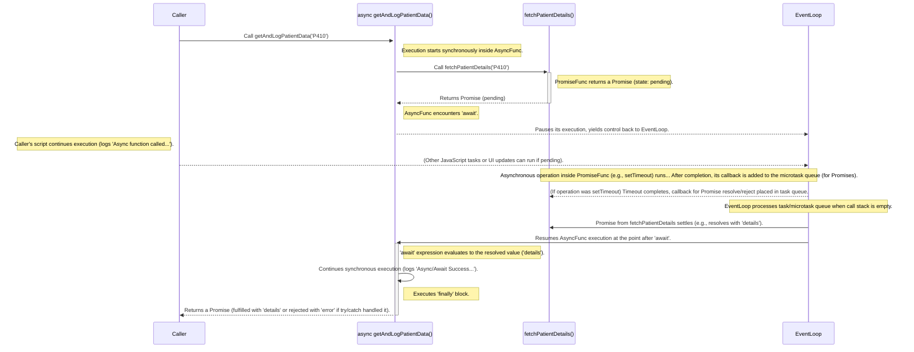

# Module 5: JavaScript Essentials for React Native

Welcome to Module 5! JavaScript is the language you'll use to build the logic and user interface of your React Native applications. While React Native abstracts away many platform differences, a solid understanding of modern JavaScript (ES6/ECMAScript 2015 and beyond) is absolutely fundamental to writing effective, efficient, and maintainable code. This module serves as a focused refresher and deep dive into the core JavaScript concepts essential for success with React Native. We'll cover everything from variables and data types to asynchronous operations and modules, ensuring you have the foundational knowledge needed for the subsequent React and React Native modules.

> [!TIP]
> 🧑‍💻 **Experienced JavaScript Developers:** If you already have significant experience with modern JavaScript (ES6+), you might find many concepts in this module familiar. We recommend skimming through the sections to refresh your knowledge, paying particular attention to examples demonstrating concepts in the context of React Native (like arrow functions and `this` binding, or asynchronous patterns) and any differences highlighted in the **Background Bridge Notes**. Focus on how these core features are applied within the React Native ecosystem.

**Learning Objectives**

By the end of this module, you will be able to:

*   Declare variables using `let` and `const` and understand their scope.
*   Identify and use common JavaScript data types (primitives and objects).
*   Apply various operators for manipulation and comparison.
*   Implement control flow logic using conditionals and loops.
*   Define and invoke functions using various syntaxes, including arrow functions.
*   Explain function scope and the concept of closures.
*   Manipulate objects and arrays using common methods, destructuring, and spread/rest syntax.
*   Explain the difference between synchronous and asynchronous code.
*   Use Callbacks, Promises, and `async`/`await` to handle asynchronous operations.
*   Organize code into reusable modules using `import` and `export`.

**Prerequisites**

*   Completion of [Module 4: Web Development Essentials Refresher](./module-04-web-development-essentials-refresher.md). (Assumes basic familiarity with HTML/CSS concepts).

## Section 1: Variables, Data Types, and Operators

This section revisits the building blocks of JavaScript: how you store data in variables, the different types of data you'll encounter, and the operators used to work with that data. We focus on modern ES6+ practices.

In JavaScript, variables are containers for storing data values. Before ES6, `var` was the primary way to declare variables. However, `var` has nuances with scoping (it's function-scoped, not block-scoped, and can be re-declared) that can lead to unexpected behavior. Modern JavaScript development strongly favors `let` and `const`.

*   `let`: Use `let` to declare variables whose values might need to change later. `let` variables are block-scoped, meaning they are only accessible within the block of code (e.g., inside an `if` statement or `for` loop) where they are defined.
*   `const`: Use `const` to declare variables whose values should *not* be reassigned after initialization. It's also block-scoped. This is preferred for most variables as it makes code easier to reason about – you know the value won't change unexpectedly. Note that for objects and arrays declared with `const`, the *contents* (properties or elements) of the object or array can still be modified, but the variable itself cannot be reassigned to a different object or array reference.

> 🌐 **Developers from Statically-Typed Languages (e.g., Java, C#, Swift, Kotlin) or older JavaScript:**
> **Comparison:** JavaScript is dynamically typed. This means you don't declare a variable's type (like `int myNumber` or `String myString`). The type is determined at runtime by the value assigned to it, and a variable can hold different types of values over its lifetime (though this is often discouraged for clarity with `let`). `let` and `const` also introduce true block scoping, unlike `var` which is function-scoped. If you're used to `var`, `let` is generally a safer replacement, while `const` is for values that won't be reassigned.
>
> **Key Takeaway:** Embrace dynamic typing but use `const` by default to prevent accidental reassignments. Understand that `let` and `const` offer more predictable block-scoping than the older `var` keyword.
>
> **Source:** [MDN Web Docs: JavaScript data types and data structures](https://developer.mozilla.org/en-US/docs/Web/JavaScript/Data_structures), [MDN Web Docs: let](https://developer.mozilla.org/en-US/docs/Web/JavaScript/Reference/Statements/let)

This example demonstrates variable declaration and assignment using `let` and `const`.
```javascript
// Using let for a value that might change
let patientAge = 35;
patientAge = 36; // This is allowed

// Using const for a value that shouldn't change
const patientId = 'SN734-982';
// patientId = 'SN734-983'; // This would cause an error: Assignment to constant variable.

// Const with an object
const medicationDetails = { name: 'Lisinopril', dosage: '10mg' };
medicationDetails.dosage = '20mg'; // Modifying an object's property is allowed
// medicationDetails = { name: 'Amlodipine', dosage: '5mg' }; // Reassigning the const variable is NOT allowed
```
The code shows that `let` variables can be reassigned, while `const` variables cannot. However, if a `const` variable holds an object or array, its internal content (properties or elements) can still be modified. This distinction is important for managing complex data structures.

**Data Types**

JavaScript has several built-in data types, categorized as primitive or object types.

*   **Primitive Types:**
    *   `string`: Represents textual data (e.g., `'Lisinopril'`, `"Patient Name"`).
    *   `number`: Represents numeric data, including integers and floating-point numbers (e.g., `10`, `3.14`). Special numeric values include `NaN` (Not-a-Number) and `Infinity`.
    *   `boolean`: Represents logical values: `true` or `false`.
    *   `null`: Represents the intentional absence of any object value. It's a primitive value but often signifies that a variable should hold an object but doesn't currently.
    *   `undefined`: Represents a variable that has been declared but not yet assigned a value. It's also the default return value of functions that don't explicitly return anything.
    *   `symbol` (ES6): Represents a unique and immutable identifier. Often used as keys for object properties to avoid naming collisions.
    *   `bigint` (ES2020): Represents integers with arbitrary precision, useful for numbers larger than `Number.MAX_SAFE_INTEGER`.

*   **Object Type:**
    *   `object`: Represents collections of key-value pairs (properties) or more complex data structures. Arrays, functions, and built-in objects like `Date` and `RegExp` are all technically objects in JavaScript.

You can check the type of a variable using the `typeof` operator.
A long-standing quirk in JavaScript is that `typeof null` returns `"object"`. This is a historical bug that, for compatibility reasons, has not been fixed. Always remember this when checking types.

This example demonstrates various data types and the use of the `typeof` operator.
```javascript
let medicationName = 'Ibuprofen'; // string
let dosage = 200;                 // number
let isPrescription = false;       // boolean
let sideEffects = null;           // null
let nextRefillDate;               // undefined
const uniqueId = Symbol('id');    // symbol

console.log(typeof medicationName); // "string"
console.log(typeof dosage);         // "number"
console.log(typeof isPrescription); // "boolean"
console.log(typeof sideEffects);    // "object" (historical quirk for null)
console.log(typeof nextRefillDate); // "undefined"
console.log(typeof uniqueId);       // "symbol"
```
The output shows the string representation of each variable's type. Note the special case for `null`, which `typeof` reports as `"object"`.

**Operators**

Operators are special symbols used to perform operations on values (operands).

*   **Assignment Operators:** Assign values to variables (e.g., `=`, `+=`, `-=`, `*=`, `/=`).
*   **Arithmetic Operators:** Perform mathematical calculations (e.g., `+` for addition/concatenation, `-`, `*`, `/`, `%` for modulo, `**` for exponentiation ES7, `++` for increment, `--` for decrement).
*   **Comparison Operators:** Compare two values and return a boolean.
    *   Strict Equality/Inequality: `===`, `!==` (preferred, checks value and type without type coercion).
    *   Loose Equality/Inequality: `==`, `!=` (avoid, performs type coercion which can lead to unexpected results).
    *   Relational: `>`, `<`, `>=`, `<=`.
*   **Logical Operators:** Combine or negate boolean expressions.
    *   `&&` (Logical AND): `true` if both operands are true.
    *   `||` (Logical OR): `true` if at least one operand is true.
    *   `!` (Logical NOT): Inverts the boolean value.
    These operators work with "truthy" and "falsy" values. Falsy values in JavaScript are `false`, `0`, `""` (empty string), `null`, `undefined`, and `NaN`. All other values are considered "truthy".
*   **Ternary (Conditional) Operator:** `condition ? valueIfTrue : valueIfFalse`. A concise way to write simple `if-else` statements.
*   **`typeof` Operator:** Returns a string indicating the type of a variable.

This example demonstrates various operators in a SpeedyMeds context.
```javascript
// SpeedyMeds Example: Calculate remaining pills
const pillsPerRefill = 90;
let pillsTaken = 15;
let remainingPills = pillsPerRefill - pillsTaken; // Arithmetic: 75

remainingPills -= 5; // Assignment: remainingPills is now 70

const dosageMg = 20;
const refillsAvailable = 3;

// Comparison and Logical
const needsRefillSoon = remainingPills < 30 && refillsAvailable > 0;
console.log(`Needs refill soon: ${needsRefillSoon}`); // "Needs refill soon: false"

// Ternary
const patientStatus = remainingPills > 0 ? 'Active Medication' : 'Needs Refill';
console.log(`Status: ${patientStatus}`); // "Status: Active Medication"

// Strict Equality (Preferred)
console.log(dosageMg === '20'); // false (number vs string)
console.log(dosageMg == '20');  // true (loose equality with type coercion - avoid!)
```
The code calculates remaining medication, checks refill status using comparison and logical operators, and determines patient status with a ternary operator. It also highlights the important difference between strict (`===`) and loose (`==`) equality, emphasizing the preference for strict equality to avoid bugs from unexpected type coercion.

> 📚 **Official Documentation:**
>
> *   [MDN Web Docs: JavaScript data types and data structures](https://developer.mozilla.org/en-US/docs/Web/JavaScript/Data_structures)
> *   [MDN Web Docs: let](https://developer.mozilla.org/en-US/docs/Web/JavaScript/Reference/Statements/let)
> *   [MDN Web Docs: const](https://developer.mozilla.org/en-US/docs/Web/JavaScript/Reference/Statements/const)
> *   [MDN Web Docs: Expressions and Operators](https://developer.mozilla.org/en-US/docs/Web/JavaScript/Reference/Operators)
>
> 🗂️ **Additional Resources:**
>
> *   [JavaScript.info: Variables](https://javascript.info/variables)
> *   [JavaScript.info: Data types](https://javascript.info/types)
> *   [JavaScript.info: Basic operators, maths](https://javascript.info/operators)

## Section 2: Control Flow

Control flow refers to the order in which statements are executed in a script. By default, code runs from top to bottom, but control flow statements allow you to alter this sequence based on conditions or to repeat blocks of code.

**Conditional Statements**

Conditional statements execute different blocks of code based on whether a specified condition evaluates to `true` or `false`.

*   **`if...else`:** The most common conditional structure. It executes a block of code if a condition is true, and can optionally execute other blocks if the condition is false (`else`) or if other conditions are met (`else if`).

    This example determines a dosage recommendation based on patient age using `if...else if...else`.
    ```javascript
    const patientAge = 68;
    let dosageRecommendation;

    if (patientAge >= 65) {
      dosageRecommendation = 'Start with lower dose';
    } else if (patientAge < 18) {
      dosageRecommendation = 'Consult pediatric guidelines';
    } else {
      dosageRecommendation = 'Standard dose appropriate';
    }
    console.log(dosageRecommendation); // Output: Start with lower dose
    ```
    The code checks `patientAge` against several conditions. Since `patientAge` (68) is `>= 65`, the first block is executed, setting `dosageRecommendation` accordingly.

*   **`switch`:** Useful when you have multiple possible execution paths based on the value of a single expression. Each path is defined by a `case`. The `break` statement is crucial to prevent "fall-through" to subsequent cases. The `default` case handles any values not explicitly covered by a `case`.

    This example provides medication instructions based on `medicationType` using a `switch` statement.
    ```javascript
    const medicationType = 'PainRelief';
    let instructions;

    switch (medicationType) {
      case 'Antibiotic':
        instructions = 'Take with food, complete full course.';
        break;
      case 'PainRelief':
        instructions = 'Take as needed for pain, do not exceed maximum daily dose.';
        break;
      case 'BloodPressure':
        instructions = 'Take once daily in the morning.';
        break;
      default:
        instructions = 'Follow specific instructions on the label.';
    }
    console.log(instructions); // Output: Take as needed for pain...
    ```
    The `switch` statement matches `medicationType` to the `'PainRelief'` case and assigns the corresponding instructions. The `break` ensures only this case's code runs.

**Looping Statements**

Loops allow you to execute a block of code repeatedly as long as a certain condition holds true, or for a specified number of iterations.

*   **`for` loop:** Ideal when you know the number of iterations beforehand. It consists of an initializer, a condition checked before each iteration, and a final expression executed after each iteration (typically an incrementor/decrementor).

    This `for` loop logs medication reminders for a fixed number of days.
    ```javascript
    // SpeedyMeds: Log scheduled reminders for the next 3 days
    console.log('Medication Reminders:');
    for (let day = 1; day <= 3; day++) {
      console.log(`Day ${day}: Take morning medication.`);
    }
    // Output:
    // Medication Reminders:
    // Day 1: Take morning medication.
    // Day 2: Take morning medication.
    // Day 3: Take morning medication.
    ```
    The loop initializes `day` to 1, continues as long as `day` is less than or equal to 3, and increments `day` after each iteration, logging a message each time.

*   **`while` loop:** Executes a block of code as long as a specified condition remains `true`. The condition is checked *before* each iteration.

    This `while` loop simulates dispensing pills until a target count is met.
    ```javascript
    // SpeedyMeds: Dispense pills until target count is reached
    let pillsDispensed = 0;
    const targetPillCount = 5;

    while (pillsDispensed < targetPillCount) {
      pillsDispensed++;
      console.log(`Dispensing pill #${pillsDispensed}`);
    }
    console.log('Finished dispensing.');
    // Output: Logs dispensing 1 through 5, then Finished.
    ```
    The loop continues as long as `pillsDispensed` is less than `targetPillCount`. Inside the loop, `pillsDispensed` is incremented and a message is logged.

*   **`do...while` loop:** Similar to `while`, but the condition is checked *after* the block executes. This guarantees the block runs at least once, regardless of the condition's initial state.

    This `do...while` loop generates a random code and ensures it runs at least once, then checks a condition (e.g., length).
    ```javascript
    // Useful for scenarios where you need to perform an action once before checking
    let confirmationCode;
    let attempts = 0;
    do {
      attempts++;
      // Simulate generating a code
      confirmationCode = Math.random().toString(36).substring(2, Math.floor(Math.random() * 4) + 5); // variable length 5-8
      console.log(`Attempt ${attempts}: Generated code: ${confirmationCode}`);
    } while (confirmationCode.length < 6 && attempts < 5); // Loop if code is too short, max 5 attempts
    ```
    The code block generates a `confirmationCode`. The loop continues if the code's length is less than 6 and attempts are less than 5, ensuring the generation process occurs at least once.

*   **`for...in` loop:** Iterates over the *enumerable property names* (keys) of an object. It's generally **not recommended** for iterating over arrays because it can include inherited properties and doesn't guarantee order. Always use `Object.hasOwn()` (or `hasOwnProperty`) to ensure the property belongs directly to the object.

    This `for...in` loop iterates over the properties of a `patientProfile` object.
    ```javascript
    const patientProfile = {
      name: 'Jane Doe',
      age: 42,
      condition: 'Hypertension'
    };

    console.log('Patient Profile Details:');
    for (const key in patientProfile) {
      if (Object.hasOwn(patientProfile, key)) { // Ensures property is not from prototype chain
        console.log(`${key}: ${patientProfile[key]}`);
      }
    }
    // Output:
    // Patient Profile Details:
    // name: Jane Doe
    // age: 42
    // condition: Hypertension
    ```
    The loop iterates through each key (`name`, `age`, `condition`) in `patientProfile` and logs the key-value pair. `Object.hasOwn()` ensures only direct properties are processed.

*   **`for...of` loop (ES6):** Iterates over the *values* of iterable objects like Arrays, Strings, Maps, Sets, etc. This is the **preferred** and more modern way to loop over array elements or other iterable collections.

    This `for...of` loop iterates over an array of `upcomingAppointments`.
    ```javascript
    const upcomingAppointments = ['Dr. Smith - 10:00 AM', 'Lab Work - 2:30 PM', 'Dr. Jones - Follow-up'];

    console.log('Upcoming Appointments:');
    for (const appointment of upcomingAppointments) {
      console.log(`- ${appointment}`);
    }
    // Output:
    // Upcoming Appointments:
    // - Dr. Smith - 10:00 AM
    // - Lab Work - 2:30 PM
    // - Dr. Jones - Follow-up
    ```
    The loop directly accesses each `appointment` string in the `upcomingAppointments` array and logs it, providing a cleaner syntax than traditional index-based `for` loops for arrays.

> 📚 **Official Documentation:**
>
> *   [MDN Web Docs: Control flow and error handling](https://developer.mozilla.org/en-US/docs/Web/JavaScript/Guide/Control_flow_and_error_handling)
> *   [MDN Web Docs: if...else](https://developer.mozilla.org/en-US/docs/Web/JavaScript/Reference/Statements/if...else)
> *   [MDN Web Docs: switch](https://developer.mozilla.org/en-US/docs/Web/JavaScript/Reference/Statements/switch)
> *   [MDN Web Docs: for](https://developer.mozilla.org/en-US/docs/Web/JavaScript/Reference/Statements/for)
> *   [MDN Web Docs: while](https://developer.mozilla.org/en-US/docs/Web/JavaScript/Reference/Statements/while)
> *   [MDN Web Docs: do...while](https://developer.mozilla.org/en-US/docs/Web/JavaScript/Reference/Statements/do...while)
> *   [MDN Web Docs: for...in](https://developer.mozilla.org/en-US/docs/Web/JavaScript/Reference/Statements/for...in)
> *   [MDN Web Docs: for...of](https://developer.mozilla.org/en-US/docs/Web/JavaScript/Reference/Statements/for...of)
>
> 🗂️ **Additional Resources:**
>
> *   [JavaScript.info: Conditional branching: if, '?'](https://javascript.info/ifelse)
> *   [JavaScript.info: Loops: while and for](https://javascript.info/while-for)

## Section 3: Functions

Functions are fundamental building blocks in JavaScript. They are blocks of reusable code designed to perform a specific task. Functions help you organize your code, make it more readable, and avoid repetition by encapsulating logic.

**Defining Functions**

There are several ways to define functions in JavaScript:

*   **Function Declaration:** Defined using the `function` keyword followed by the function name, parameters, and body. Function declarations are "hoisted," meaning the JavaScript interpreter effectively moves their declaration to the top of their scope before code execution. This allows you to call them before they physically appear in your code.

    This example uses a function declaration to calculate medication dosage.
    ```javascript
    function calculateDosage(weightKg, dosePerKg) {
      return weightKg * dosePerKg;
    }

    const patientWeight = 70; // kg
    const requiredDosage = calculateDosage(patientWeight, 1.5); // mg per kg
    console.log(`Required dosage: ${requiredDosage}mg`); // Output: Required dosage: 105mg
    ```
    `calculateDosage` can be called before or after its definition due to hoisting. It takes *weightKg* and *dosePerKg* as parameters and returns their product.

*   **Function Expression:** Involves assigning an anonymous (or named) function to a variable. Unlike declarations, function expressions are *not* hoisted; you must define them before you call them.

    This example uses a function expression to create a patient greeting.
    ```javascript
    const getPatientGreeting = function(patientName) {
      return `Welcome to SpeedyMeds, ${patientName}!`;
    };

    console.log(getPatientGreeting('Alice')); // Output: Welcome to SpeedyMeds, Alice!
    ```
    The anonymous function is assigned to `getPatientGreeting`. It can only be called after this assignment. It takes *patientName* and returns a personalized greeting string.

*   **Arrow Functions (ES6):** Provide a more concise syntax for writing function expressions. They are always anonymous. Arrow functions also have a key difference in how they handle the `this` keyword, making them particularly useful in contexts like React components.

    These examples show arrow functions for a BMI calculation and logging a reminder.
    ```javascript
    // Concise syntax for single expression return (implicitly returns the expression's value)
    const calculateBmi = (weightKg, heightM) => weightKg / (heightM * heightM);

    // Block body for multiple statements (requires explicit 'return' if a value needs to be returned)
    const logMedicationReminder = (medicationName, time) => {
      const message = `Reminder: Take ${medicationName} at ${time}.`;
      console.log(message);
    };

    console.log(`BMI: ${calculateBmi(75, 1.8).toFixed(2)}`); // Output: BMI: 23.15
    logMedicationReminder('Metformin', '8:00 AM'); // Output: Reminder: Take Metformin at 8:00 AM.
    ```
    `calculateBmi` uses the concise body syntax for a direct return. `logMedicationReminder` uses a block body for multiple statements and doesn't return a value.

**Arrow Functions and `this`**

Understanding `this` is crucial in JavaScript, and arrow functions behave differently from regular functions:

*   **Regular Functions (`function` keyword):** The value of `this` inside a regular function depends on *how the function is called* (its execution context). It can be the global object (`window` in browsers, `undefined` in strict mode or modules), the object that called the method (e.g., `myObject.myMethod()`, `this` is `myObject`), or explicitly set using `.call()`, `.apply()`, or `.bind()`. This dynamic nature of `this` can sometimes be a source of confusion.
*   **Arrow Functions:** Arrow functions do **not** have their own `this` binding. Instead, they *lexically* inherit `this` from the surrounding (enclosing) scope where they were defined. This behavior is often more predictable and desirable, especially in object methods or when passing callbacks (e.g., in React event handlers or `setTimeout`).

> ⚛️ **React Developers:**
> **Comparison:** In older React class components, when passing a class method (defined with `function` syntax) as an event handler (e.g., `onClick={this.handleClick}`), you often had to manually `.bind(this)` in the constructor or use an arrow function class property to ensure `this` inside `handleClick` correctly referred to the component instance. Arrow functions automatically capture the `this` of the surrounding class context.
>
> **Key Takeaway:** Arrow functions simplify `this` management in React Native (and React) components, especially for event handlers and callbacks, by lexically inheriting `this` from their defining environment, reducing the need for manual binding.
>
> **Source:** [MDN Web Docs: this](https://developer.mozilla.org/en-US/docs/Web/JavaScript/Reference/Operators/this), [React Docs: Handling Events](https://react.dev/learn/responding-to-events)

> 📲 **Native Developers (iOS/Android):**
> **Comparison:** In native development, `this` (or `self` in Swift/Objective-C, `this` in Kotlin/Java) usually refers to the current class instance in a straightforward way within methods. JavaScript's `this` in regular functions is more flexible (and sometimes tricky) as it's set by the call site. Arrow functions in JavaScript offer a behavior closer to what you might expect: `this` is determined by where the function is written, not how it's called.
>
> **Key Takeaway:** When using callbacks or methods in JavaScript objects, especially in React Native components, prefer arrow functions if you need `this` to refer to the `this` of the defining context (e.g., the component instance). This avoids common `this`-related bugs.

**Parameters and Arguments**

*   **Parameters:** Variables listed in the function definition (e.g., *patientId*, *temperature*).
*   **Arguments:** Actual values passed to the function when it's invoked (e.g., `'P123'`, `37.0`).
*   **Default Parameters (ES6):** You can assign default values to parameters in the function signature. These defaults are used if an argument for that parameter is omitted during the call or if `undefined` is explicitly passed.

    This function uses default parameters for `temperature` and `pulse`.
    ```javascript
    function recordVitals(patientId, temperature = 37.0, pulse = 70) {
      console.log(`Patient ${patientId}: Temp ${temperature}°C, Pulse ${pulse}bpm`);
    }

    recordVitals('P123'); // Output: Patient P123: Temp 37°C, Pulse 70bpm
    recordVitals('P456', 38.1); // Output: Patient P456: Temp 38.1°C, Pulse 70bpm
    recordVitals('P789', undefined, 85); // Output: Patient P789: Temp 37°C, Pulse 85bpm
    ```
    The function `recordVitals` provides default values for *temperature* (37.0) and *pulse* (70). These are used if arguments aren't supplied or are `undefined`.

*   **Rest Parameters (ES6):** Using `...` followed by a parameter name, you can collect an indefinite number of remaining arguments passed to a function into a single array. The rest parameter must be the last parameter in the function definition.

    This function uses rest parameters to collect multiple `symptoms`.
    ```javascript
    function logSymptoms(patientId, ...symptoms) {
      console.log(`Patient ${patientId} reported symptoms:`);
      if (symptoms.length === 0) {
        console.log('- None reported');
      } else {
        symptoms.forEach(symptom => console.log(`- ${symptom}`));
      }
    }

    logSymptoms('P101', 'Headache', 'Fatigue', 'Nausea');
    // Output:
    // Patient P101 reported symptoms:
    // - Headache
    // - Fatigue
    // - Nausea
    logSymptoms('P102'); // Output: Patient P102 reported symptoms: - None reported
    ```
    The `...symptoms` syntax gathers all arguments after *patientId* into an array named `symptoms`, allowing the function to handle a variable number of symptom inputs.

**Scope and Closures**

*   **Scope:** Defines the visibility and accessibility of variables.
    *   **Global Scope:** Variables declared outside any function are global and accessible from anywhere in your code. It's best practice to minimize global variables.
    *   **Function Scope:** Variables declared with `var` inside a function are accessible only within that function.
    *   **Block Scope (ES6):** Variables declared with `let` or `const` inside a block (defined by `{...}`, e.g., in `if` statements or `for` loops) are accessible only within that block.
*   **Closures:** A closure is a powerful JavaScript feature where an inner function has access to its outer (enclosing) function's variables and parameters, even after the outer function has finished executing and its scope is normally gone. The inner function "remembers" the environment (the scope chain) in which it was created.

    This example demonstrates a closure used to create specialized reminder functions.
    ```javascript
    // "Under the hood" explanation of closures
    function createMedicationReminder(medicationName) {
      // Outer function scope: medicationName is "closed over"
      const reminderMessageBase = `Remember to take your`;

      // Inner function (the closure)
      return function(timeOfDay) {
        // This inner function "remembers" reminderMessageBase and medicationName
        // from its lexical scope (createMedicationReminder's scope).
        console.log(`${reminderMessageBase} ${medicationName} in the ${timeOfDay}.`);
      };
    }

    const lisinoprilReminder = createMedicationReminder('Lisinopril');
    const metforminReminder = createMedicationReminder('Metformin');

    // Later, when these returned functions are called, they still have access
    // to the specific medicationName they were created with.
    lisinoprilReminder('morning'); // Output: Remember to take your Lisinopril in the morning.
    metforminReminder('evening');  // Output: Remember to take your Metformin in the evening.
    ```
    `createMedicationReminder` returns an inner function. This inner function forms a closure, retaining access to `medicationName` and `reminderMessageBase` from its parent's scope, even after `createMedicationReminder` has completed. This allows for creating customized reminder functions.

> 📚 **Official Documentation:**
>
> *   [MDN Web Docs: Functions](https://developer.mozilla.org/en-US/docs/Web/JavaScript/Guide/Functions)
> *   [MDN Web Docs: Arrow function expressions](https://developer.mozilla.org/en-US/docs/Web/JavaScript/Reference/Functions/Arrow_functions)
> *   [MDN Web Docs: Default parameters](https://developer.mozilla.org/en-US/docs/Web/JavaScript/Reference/Functions/Default_parameters)
> *   [MDN Web Docs: Rest parameters](https://developer.mozilla.org/en-US/docs/Web/JavaScript/Reference/Functions/rest_parameters)
> *   [MDN Web Docs: Closures](https://developer.mozilla.org/en-US/docs/Web/JavaScript/Closures)
> *   [MDN Web Docs: Scope](https://developer.mozilla.org/en-US/docs/Glossary/Scope)
>
> 🗂️ **Additional Resources:**
>
> *   [JavaScript.info: Functions](https://javascript.info/function-basics)
> *   [JavaScript.info: Arrow functions basics](https://javascript.info/arrow-functions-basics)
> *   [JavaScript.info: Variable scope, closure](https://javascript.info/closure)

**(https://codesandbox.io/...)** <!-- Placeholder for Exercise 5.1 Link -->

## Section 4: Objects and Arrays

Objects and arrays are the primary ways to structure collections of related data in JavaScript. Mastering their manipulation is key to handling application state, API responses, list rendering, and more in React Native.

**Objects**

Objects are collections of key-value pairs. Keys are typically strings (or Symbols in ES6+), and values can be any JavaScript data type, including other objects or functions (which are then called methods of the object).

*   **Object Literals:** The most common and straightforward way to create objects.

    This example defines a `prescription` object with properties and methods.
    ```javascript
    const prescription = {
      medicationId: 'MED456',
      patientName: 'Bob Martin',
      medicationName: 'Atorvastatin',
      dosage: '20mg',
      frequency: 'Once daily',
      refillsRemaining: 2,

      // Method (function as a property - traditional syntax)
      displaySummary: function() {
        console.log(`${this.medicationName} (${this.dosage}) for ${this.patientName}. Frequency: ${this.frequency}.`);
      },

      // ES6 Method Syntax (more concise)
      useRefill() {
        if (this.refillsRemaining > 0) {
          this.refillsRemaining--;
          console.log(`Refill used for ${this.medicationName}. Remaining: ${this.refillsRemaining}`);
          return true;
        } else {
          console.log(`No refills remaining for ${this.medicationName}.`);
          return false;
        }
      }
    };

    // Accessing properties: dot notation and bracket notation
    console.log(prescription.medicationName); // Output: Atorvastatin
    console.log(prescription['dosage']);     // Output: 20mg (bracket notation is useful for dynamic keys or keys with special characters)

    // Calling methods
    prescription.displaySummary(); // Output: Atorvastatin (20mg) for Bob Martin. Frequency: Once daily.
    prescription.useRefill();      // Output: Refill used for Atorvastatin. Remaining: 1
    ```
    The `prescription` object stores medication details. Properties like `medicationName` are accessed using dot or bracket notation. Methods like `displaySummary` and `useRefill` (using ES6 syntax) perform actions related to the object's data. `this` inside these methods refers to the `prescription` object itself.

**Arrays**

Arrays are ordered lists of values, indexed starting from 0. Array elements can be of any data type.

*   **Array Literals:** The simplest way to create arrays.

    This example shows an array of strings (`patientSymptoms`) and an array of objects (`vitalSignsHistory`).
    ```javascript
    const patientSymptoms = ['Fatigue', 'Dizziness', 'Shortness of breath'];
    const vitalSignsHistory = [
      { timestamp: '2024-10-26T08:00:00Z', bp: '120/80', pulse: 72 },
      { timestamp: '2024-10-27T08:15:00Z', bp: '125/82', pulse: 75 }
    ];

    // Accessing elements by index
    console.log(patientSymptoms[0]); // Output: Fatigue
    console.log(vitalSignsHistory[1].bp); // Output: 125/82 (accessing property of an object within the array)

    // Array length property
    console.log(`Number of symptoms: ${patientSymptoms.length}`); // Output: 3
    ```
    Arrays store ordered collections. `patientSymptoms` holds strings, while `vitalSignsHistory` holds objects, demonstrating arrays can store mixed types (though arrays of same-type elements are common).

**Common Array Methods**

JavaScript provides a rich set of built-in methods for manipulating arrays. Many of these are "higher-order functions" as they take other functions as arguments (callbacks). These are essential for data transformation, especially when preparing data for display in React Native lists.

*   `forEach((element, index, array) => { /* ... */ })`: Executes a provided function once for each array element. *Does not return a new array; mutates the original array if the callback does so directly.*
*   `map((element, index, array) => { /* ... return transformedElement; */ })`: Creates a **new array** populated with the results of calling a provided function on every element in the calling array. Crucial for transforming data for UI rendering.
*   `filter((element, index, array) => { /* ... return booleanCondition; */ })`: Creates a **new array** with all elements that pass the test (return `true`) implemented by the provided function.
*   `reduce((accumulator, currentValue, currentIndex, array) => { /* ... return newAccumulator; */ }, initialValue)`: Executes a "reducer" function on each element of the array, resulting in a single output value (e.g., summing numbers, accumulating an object).
*   `find((element, index, array) => { /* ... return booleanCondition; */ })`: Returns the **first element** in the array that satisfies the provided testing function. If no values satisfy the testing function, `undefined` is returned.
*   `findIndex((element, index, array) => { /* ... return booleanCondition; */ })`: Returns the **index** of the first element in the array that satisfies the provided testing function. Otherwise, it returns -1.
*   `some((element, index, array) => { /* ... return booleanCondition; */ })`: Tests whether **at least one** element in the array passes the test implemented by the provided function. Returns a boolean.
*   `every((element, index, array) => { /* ... return booleanCondition; */ })`: Tests whether **all** elements in the array pass the test implemented by the provided function. Returns a boolean.
*   `includes(valueToFind, fromIndex)`: Determines whether an array includes a certain value among its entries, returning `true` or `false`.
*   `push(element1, ..., elementN)`: Adds one or more elements to the end of an array and returns the new length of the array. (Mutates original array).
*   `pop()`: Removes the last element from an array and returns that element. (Mutates original array).
*   `shift()`: Removes the first element from an array and returns that removed element. (Mutates original array).
*   `unshift(element1, ..., elementN)`: Adds one or more elements to the beginning of an array and returns the new length of the array. (Mutates original array).
*   `slice(start, end)`: Returns a shallow copy of a portion of an array into a new array object selected from `start` to `end` (end not included). Original array is not modified.
*   `splice(start, deleteCount, item1, item2, ..., itemN)`: Changes the contents of an array by removing or replacing existing elements and/or adding new elements *in place*. Returns an array containing the deleted elements. (Mutates original array).

This example demonstrates several common array methods on a list of medications.
```javascript
const medications = [
  { id: 'm1', name: 'Lisinopril', type: 'BloodPressure', stock: 50 },
  { id: 'm2', name: 'Metformin', type: 'Diabetes', stock: 120 },
  { id: 'm3', name: 'Simvastatin', type: 'Cholesterol', stock: 80 },
  { id: 'm4', name: 'Amlodipine', type: 'BloodPressure', stock: 0 },
];

// .map(): Get just the names into a new array
const medicationNames = medications.map(med => med.name);
console.log('Medication Names:', medicationNames); // ['Lisinopril', 'Metformin', 'Simvastatin', 'Amlodipine']

// .filter(): Get medications that are in stock into a new array
const inStockMeds = medications.filter(med => med.stock > 0);
console.log('In Stock Count:', inStockMeds.length); // 3

// .find(): Find the first medication object with name 'Metformin'
const metforminRecord = medications.find(med => med.name === 'Metformin');
console.log('Metformin Record:', metforminRecord); // { id: 'm2', name: 'Metformin', ... }

// .reduce(): Calculate total stock of all medications
const totalStock = medications.reduce((sum, med) => sum + med.stock, 0); // 0 is initial value for sum
console.log(`Total stock: ${totalStock}`); // Total stock: 250

// .some(): Check if any medication is out of stock
const anyOutOfStock = medications.some(med => med.stock === 0);
console.log(`Any medication out of stock? ${anyOutOfStock}`); // Any medication out of stock? true
```
The code showcases `map` to extract names, `filter` to find in-stock items, `find` to locate a specific record, `reduce` to sum up stock quantities, and `some` to check a condition across elements. These methods are powerful for data transformation without manual loops.

**Destructuring Assignment (ES6)**

Destructuring is a concise syntax that allows you to unpack values from arrays or properties from objects into distinct variables. This can make your code cleaner and easier to read.

This example shows object and array destructuring.
```javascript
// Object Destructuring
const patient = { id: 'P789', firstName: 'Carol', lastName: 'Danvers', age: 38, contact: { email: 'carol@example.com' } };
const { firstName, age, condition = 'Unknown', contact: { email } } = patient; // Default value for 'condition', nested destructuring for 'email'

console.log(firstName); // Output: Carol
console.log(age);       // Output: 38
console.log(condition); // Output: Unknown (because 'condition' wasn't in 'patient' object)
console.log(email);     // Output: carol@example.com

// Renaming variables during destructuring
const { lastName: surname } = patient;
console.log(surname); // Output: Danvers

// Array Destructuring
const primaryVitals = ['120/80', 72, 98.6];
const [bloodPressure, pulse, , temperatureStatus = 'Normal'] = primaryVitals; // Skip element with extra comma, default value

console.log(bloodPressure);    // Output: 120/80
console.log(pulse);          // Output: 72
console.log(temperatureStatus);// Output: Normal (default value used as 4th element doesn't exist)
```
Object destructuring extracts `firstName`, `age`, and `email` (from a nested object) from the `patient` object, providing a default for `condition`. `lastName` is extracted and renamed to `surname`. Array destructuring extracts `bloodPressure` and `pulse` from `primaryVitals`.

**Spread Syntax (`...`) (ES6)**

The spread syntax expands an iterable (like an array or string) into individual elements, or object properties into key-value pairs. It's useful for creating copies of arrays/objects, merging them, or passing array elements as individual arguments to functions.

This example demonstrates array and object spread syntax.
```javascript
// Array Spread: Creating copies and merging
const morningMeds = ['Lisinopril', 'Metformin'];
const eveningMeds = ['Simvastatin'];
const allDailyMeds = [...morningMeds, 'Aspirin', ...eveningMeds]; // Merge arrays and add an element
console.log(allDailyMeds); // Output: ['Lisinopril', 'Metformin', 'Aspirin', 'Simvastatin']

const morningMedsCopy = [...morningMeds]; // Creates a shallow copy
morningMedsCopy.push('Vitamin D');
console.log('Original morningMeds:', morningMeds);     // ['Lisinopril', 'Metformin'] (original unchanged)
console.log('Copied morningMeds:', morningMedsCopy); // ['Lisinopril', 'Metformin', 'Vitamin D']

// Object Spread: Creating copies and merging properties
const baseProfile = { name: 'David Banner', dob: '1970-05-12' };
const medicalInfo = { condition: 'Stress', allergies: 'None', name: 'Dr. David Banner' }; // 'name' will overwrite
const fullPatientProfile = { ...baseProfile, ...medicalInfo, lastSeen: '2024-10-27' }; // Properties later in the spread overwrite earlier ones

console.log(fullPatientProfile);
// Output: { name: 'Dr. David Banner', dob: '1970-05-12', condition: 'Stress', allergies: 'None', lastSeen: '2024-10-27' }

// Using spread for function arguments
function logMedicationSchedule(med1, med2, med3) {
  console.log(`Schedule - Morning: ${med1}, Afternoon: ${med2}, Evening: ${med3}`);
}
const schedule = ['Lisinopril', 'N/A', 'Metformin'];
logMedicationSchedule(...schedule); // Spreads array elements as individual arguments
// Output: Schedule - Morning: Lisinopril, Afternoon: N/A, Evening: Metformin
```
Array spread is used to merge `morningMeds` and `eveningMeds` and create a shallow copy. Object spread merges `baseProfile` and `medicalInfo`, with later properties overwriting earlier ones if keys collide, and adds new properties. Spread is also used to pass array elements as distinct arguments to `logMedicationSchedule`.

> 📚 **Official Documentation:**
>
> *   [MDN Web Docs: Objects](https://developer.mozilla.org/en-US/docs/Web/JavaScript/Guide/Working_with_Objects)
> *   [MDN Web Docs: Array](https://developer.mozilla.org/en-US/docs/Web/JavaScript/Reference/Global_Objects/Array)
> *   [MDN Web Docs: Destructuring assignment](https://developer.mozilla.org/en-US/docs/Web/JavaScript/Reference/Operators/Destructuring_assignment)
> *   [MDN Web Docs: Spread syntax (...)](https://developer.mozilla.org/en-US/docs/Web/JavaScript/Reference/Operators/Spread_syntax)
>
> 🗂️ **Additional Resources:**
>
> *   [JavaScript.info: Objects](https://javascript.info/object)
> *   [JavaScript.info: Arrays](https://javascript.info/array)
> *   [JavaScript.info: Array methods](https://javascript.info/array-methods)
> *   [JavaScript.info: Destructuring assignment](https://javascript.info/destructuring-assignment)

**(https://codesandbox.io/...)** <!-- Placeholder for Exercise 5.2 Link -->

## Section 5: Asynchronous JavaScript

Much of what happens in a mobile app, especially interacting with networks (fetching data from a server for SpeedyMeds), timers, file system access, or even responding to user input, is inherently asynchronous. JavaScript uses a single-threaded model with an event loop to handle these operations efficiently without blocking the main thread, which is crucial for maintaining a responsive user interface.

**Synchronous vs. Asynchronous "Under the Hood"**

*   **Synchronous Code:** Executes sequentially, one operation at a time. Each line of code must complete before the next one begins. If a synchronous operation takes a long time (e.g., a complex calculation or, hypothetically, a blocking network request), it freezes the entire program, including the UI, making the app unresponsive.
*   **Asynchronous Code:** Allows operations (like fetching data) to be initiated, and the program can continue to execute other code while waiting for that operation to complete in the background. When the operation finishes, its result is processed, typically via a callback function, a Promise handler, or an `async/await` continuation. This is managed by the JavaScript engine's event loop. The operation is often offloaded to browser/Node.js APIs (which might use separate threads), and once done, a message is placed in a queue. The event loop picks up this message when the call stack is empty and executes the associated JavaScript callback/handler.

**Callbacks**

The traditional way to handle asynchronous results. You pass a function (the callback) as an argument to an asynchronous operation. This callback function is then invoked when the operation completes, typically receiving data or an error as its arguments.

This conceptual example simulates fetching a medication list using a callback.
```javascript
// Conceptual example - Modern patterns (Promises, async/await) are preferred
function fetchMedicationList(patientId, callback) {
  console.log(`Fetching medications for patient ${patientId}...`);
  // Simulate network delay using setTimeout (a browser/Node API)
  setTimeout(() => {
    const success = Math.random() > 0.2; // Simulate occasional failure
    if (success) {
      const medications = ['Lisinopril 10mg', 'Metformin 500mg'];
      callback(null, medications); // Convention: (error, data) -> null for error if success
    } else {
      callback(new Error('Network error: Failed to fetch medication list'), null); // Error first
    }
  }, 1500); // 1.5 second delay
}

fetchMedicationList('P201', (error, medications) => {
  if (error) {
    console.error(`Callback Error processing medications: ${error.message}`);
  } else {
    console.log('Callback Success: Medications received:', medications.join(', '));
  }
});

console.log('Medication request initiated... UI remains responsive.'); // This logs almost immediately
```
The `fetchMedicationList` function simulates an asynchronous API call. The `callback` is invoked after 1.5 seconds with either an error or the medication data. While simple for basic cases, deeply nested callbacks ("Callback Hell") become very difficult to read, manage, and debug.

**Promises (ES6)**

Promises offer a more robust and structured way to handle asynchronous operations, greatly improving readability and manageability compared to raw callbacks. A `Promise` is an object representing the eventual completion (or failure) of an asynchronous operation and its resulting value.

A Promise can be in one of three states:
*   `pending`: The initial state; the operation has not completed yet.
*   `fulfilled`: The operation completed successfully, and the promise has a resulting value.
*   `rejected`: The operation failed, and the promise has a reason for the failure (an error).

Promises have chainable methods:
*   `.then(onFulfilled, onRejected)`: Attaches callbacks for both fulfillment and rejection. More commonly, only `onFulfilled` is used, with `.catch()` for errors.
*   `.catch(onRejected)`: Attaches a callback specifically for handling rejections (errors).
*   `.finally(onFinally)`: Attaches a callback that executes when the promise is settled (either fulfilled or rejected).

This example fetches patient details using a Promise.
```javascript
function fetchPatientDetails(patientId) {
  console.log(`Fetching details for patient ${patientId} via Promise...`);
  return new Promise((resolve, reject) => {
    setTimeout(() => { // Simulating async operation
      const success = Math.random() > 0.2;
      if (success) {
        const details = { patientId: patientId, name: 'Sarah Connor', age: 35, condition: 'Stable' };
        resolve(details); // Operation succeeded
      } else {
        reject(new Error(`Promise Rejection: Failed to fetch details for patient ${patientId}`));
      }
    }, 1000);
  });
}

console.log('Requesting patient details (Promise)...');
fetchPatientDetails('P305')
  .then(details => {
    console.log('Promise Fulfilled:', details);
    // You can chain promises here, e.g., return another promise:
    // return fetchMedicationHistory(details.patientId);
  })
  .catch(error => {
    console.error('Promise Rejected:', error.message);
  })
  .finally(() => {
    console.log('Patient detail request (Promise) complete.');
  });
```
`fetchPatientDetails` returns a `Promise`. `.then()` handles successful resolution, `.catch()` handles errors, and `.finally()` runs regardless. This structure is much cleaner for complex asynchronous sequences than nested callbacks.

**`async`/`await` (ES7/ES2017)**

`async`/`await` is syntactic sugar built on top of Promises, making asynchronous code look and behave more like synchronous code, which significantly improves readability and simplifies error handling with standard `try...catch` blocks.

*   `async` keyword: When placed before a function declaration (e.g., `async function myFunction() {}`), it makes the function implicitly return a `Promise`. Whatever you `return` from an `async` function will be the resolved value of that promise. If an error is thrown, the promise rejects.
*   `await` keyword: Can *only* be used *inside* an `async` function. It pauses the execution of the `async` function until the `Promise` it's "awaiting" settles (resolves or rejects). If the `Promise` resolves, `await` returns the resolved value. If the `Promise` rejects, `await` throws the rejected error (which can then be caught by a `try...catch` block).

This example refactors the patient data fetching using `async/await`.
```javascript
// Using the Promise-based fetchPatientDetails from the previous example
async function getAndLogPatientData(patientId) {
  console.log(`Initiating async/await fetch for patient ${patientId}...`);
  try {
    // Pause execution here until fetchPatientDetails promise resolves
    const details = await fetchPatientDetails(patientId); // 'details' gets the resolved value
    console.log('Async/Await Success - Patient Details:', details);

    // Example of awaiting another promise sequentially:
    // const medications = await fetchMedicationList(patientId); // (Assuming fetchMedicationList returns a Promise)
    // console.log('Async/Await Success - Medications:', medications);

    return details; // This async function will return a Promise that resolves with 'details'
  } catch (error) {
    // Catches errors if fetchPatientDetails (or any other awaited Promise) rejects
    console.error('Async/Await Error in getAndLogPatientData:', error.message);
    throw error; // Re-throw if you want the caller to also handle it, or handle and return a specific error state
                 // If not re-thrown, the promise returned by getAndLogPatientData will resolve to 'undefined'
  } finally {
    console.log(`Async data fetch attempt (async/await) finished for patient ${patientId}.`);
  }
}

// Calling the async function
getAndLogPatientData('P410')
  .then(result => console.log('Final result from async function call:', result)) // If successful
  .catch(err => console.error('Error from async function call itself:', err.message)); // If an error was re-thrown

console.log('Async function (getAndLogPatientData) called... execution continues here.');
```
The `getAndLogPatientData` function uses `await` to pause and wait for `fetchPatientDetails` to resolve. `try...catch` handles potential errors from the awaited Promise. This code is often easier to follow than chained `.then()` calls.

**Async/Await Flow Diagram**



**Diagram Description:**

This sequence diagram details the non-blocking execution flow of an `async` function leveraging `await`.

1.  The `Caller` invokes the `async getAndLogPatientData()` function.
2.  Execution within `AsyncFunc` begins synchronously. It calls `fetchPatientDetails()`, which itself returns a `Promise` that is initially in the `pending` state.
3.  When `AsyncFunc` encounters the `await` keyword, its execution is **paused**. Importantly, it doesn't block the main JavaScript thread; instead, control is yielded back to the `EventLoop`.
4.  The `Caller` script continues executing any subsequent synchronous code (e.g., logging "Async function called..."). The event loop is now free to process other pending tasks or UI updates.
5.  The asynchronous operation within `fetchPatientDetails()` (e.g., a network request simulated by `setTimeout`) eventually completes. Upon completion, its `Promise` transitions to either `fulfilled` (with the data) or `rejected` (with an error). A task to handle this settled promise is placed on the appropriate queue (microtask queue for promise reactions).
6.  When the main call stack is clear, the `EventLoop` picks up the task to process the settled `Promise`.
7.  This triggers the resumption of the paused `AsyncFunc` execution, right after the `await` statement. The `await` expression then evaluates to the resolved value of the `Promise` (or throws the error if it was rejected).
8.  `AsyncFunc` continues its execution with the obtained value, processes the `finally` block, and ultimately returns a `Promise` that will resolve with the function's return value or reject with an unhandled error.

This mechanism of pausing and resuming via the event loop allows JavaScript to handle long-running operations efficiently without freezing the application.

> 📲 **Native Developers (iOS/Android):**
> **Comparison:** JavaScript's single-threaded event loop model with `async/await` is distinct from direct multithreading models like Grand Central Dispatch (GCD)/Operations in iOS or Coroutines/ThreadPools in Android. In JavaScript, you're not creating and managing threads. Instead, `await` signifies a point where your function yields control to the event loop. Native operations initiated by React Native might run on separate threads managed by the OS or the native side of React Native, but the JavaScript code you write remains orchestrated by this single event loop.
>
> **Key Takeaway:** Embrace JavaScript's asynchronous, non-blocking paradigm. Use `async/await` for clean, readable code when dealing with operations like network requests (`fetch`), local storage (`AsyncStorage`), or interactions with native modules. Understand that `await` doesn't block the app, but rather allows other JavaScript code to run.
>
> **Source:** [Node.js Guides: The Node.js Event Loop, Timers, and `process.nextTick()`](https://nodejs.org/en/docs/guides/event-loop-timers-and-nexttick), [React Native Docs: Performance - Threading Model](https://reactnative.dev/docs/performance#threading-model)

> 🌐 **Web Developers:**
> **Comparison:** If you're familiar with `async/await` and Promises for client-side web development (e.g., using `fetch` API, `setTimeout`), the core concepts and syntax are identical in React Native. The JavaScript event loop behaves the same way. The main difference lies in the *specific asynchronous APIs* you'll be interacting with. In React Native, these will include framework-specific APIs like `AsyncStorage`, networking libraries configured for mobile, or custom Native Modules, rather than browser-specific DOM APIs.
>
> **Key Takeaway:** Your existing web knowledge of `async/await` and Promises is directly transferable and highly valuable. The learning curve will primarily involve understanding the React Native specific asynchronous APIs and how they integrate into this model.

> 📚 **Official Documentation:**
>
> *   [MDN Web Docs: Asynchronous JavaScript](https://developer.mozilla.org/en-US/docs/Web/JavaScript/Reference/Statements/async_function)
> *   [MDN Web Docs: Promise](https://developer.mozilla.org/en-US/docs/Web/JavaScript/Reference/Global_Objects/Promise)
> *   [MDN Web Docs: async function](https://developer.mozilla.org/en-US/docs/Web/JavaScript/Reference/Statements/async_function)
> *   [MDN Web Docs: await](https://developer.mozilla.org/en-US/docs/Web/JavaScript/Reference/Operators/await)
>
> 🗂️ **Additional Resources:**
>
> *   [JavaScript.info: Async/await](https://javascript.info/async-await)
> *   [JavaScript.info: Promises, async/await](https://javascript.info/async)
> *   [Jake Archibald: Tasks, microtasks, queues and schedules](https://jakearchibald.com/2015/tasks-microtasks-queues-and-schedules/) (Advanced Event Loop explanation)

**(https://codesandbox.io/...)** <!-- Placeholder for Exercise 5.3 Link -->

## Section 6: ES6 Modules

As your JavaScript applications grow in complexity, it becomes essential to split your code into smaller, manageable, and reusable pieces. ES6 (ECMAScript 2015) introduced a standard module system for JavaScript, allowing you to organize your code into separate files (modules). React Native extensively uses this ES6 module system.

**Core Concepts**

*   **Module Scope:** Each JavaScript file is treated as a separate module. Variables, functions, or classes declared within a module are, by default, private to that module (i.e., they are not accessible from other modules unless explicitly exported).
*   **`export` statement:** Used to make specific variables, functions, or classes from a module available for use in other modules.
*   **`import` statement:** Used to bring exported functionality from another module into the current module's scope, allowing you to use it.

**Exporting from Modules**

There are two main types of exports:

*   **Named Exports:** Allow you to export multiple values (variables, functions, classes) from a single module. When importing, you must use the exact same names (or use an alias with `as`).

    This example shows a module `utils/calculations.js` with multiple named exports.
    ```javascript
    // file: utils/calculations.js
    export const PI = 3.1415926535;

    export function calculateCircumference(radius) {
      return 2 * PI * radius;
    }

    export function calculateArea(radius) {
      return PI * radius * radius;
    }

    const EULER_NUMBER = 2.71828; // Not exported, so private to this module

    // Alternative syntax: export list at the end
    // const DRUG_INTERACTION_THRESHOLD = 0.5;
    // export { DRUG_INTERACTION_THRESHOLD };
    ```
    Here, `PI`, `calculateCircumference`, and `calculateArea` are made available for other modules to import. `EULER_NUMBER` remains private.

*   **Default Export:** Allows you to export a single primary value from a module. This is often used for the main component in a React file, a primary class, or a main function of a module. A module can have at most *one* default export.

    This example shows a conceptual `PatientCard.js` module with a default export.
    ```javascript
    // file: components/PatientCard.js
    // (This is a conceptual function, full React component structure will be covered in later modules)
    function PatientCard(patientData) {
      // In a real scenario, this would return JSX or a UI element representation
      console.log(`Displaying card for patient: ${patientData.name}`);
      return { id: patientData.id, summary: `Patient: ${patientData.name}, Age: ${patientData.age}` };
    }

    export default PatientCard; // Exporting the PatientCard function as the default export
    ```
    The `PatientCard` function is the main export of this module.

**Importing into Modules**

*   **Importing Named Exports:** Use curly braces `{}` around the names of the exports you want to import. The names inside the braces must match the exported names (unless aliased using `as`).

    This example imports named exports from `calculations.js`.
    ```javascript
    // file: services/pharmacyDisplayService.js
    import { calculateCircumference, calculateArea, PI as MathPI } from '../utils/calculations.js';
    // 'PI' is imported and renamed to 'MathPI'

    console.log(`Value of PI used in calculations: ${MathPI}`);
    const circularMedicationTrayRadius = 0.15; // meters
    console.log(`Tray circumference: ${calculateCircumference(circularMedicationTrayRadius).toFixed(2)}m`);
    console.log(`Tray area: ${calculateArea(circularMedicationTrayRadius).toFixed(2)}m²`);
    ```
    Specific functions and `PI` (renamed to `MathPI`) are imported.

*   **Importing Default Exports:** You can choose any name for the imported default value. The name does not need to match the original export name (though using a meaningful name is good practice).

    This example imports the default export from `PatientCard.js`.
    ```javascript
    // file: screens/PatientDashboardScreen.js
    import MyPatientDisplayCard from '../components/PatientCard.js'; // 'MyPatientDisplayCard' is the chosen name here

    const currentPatient = { id: 'P001', name: 'Jane Doe', age: 42 };
    const patientCardRepresentation = MyPatientDisplayCard(currentPatient);
    console.log('Patient Card Summary:', patientCardRepresentation.summary);
    ```
    The default export from `PatientCard.js` is imported as `MyPatientDisplayCard`.

*   **Importing Everything (Namespace Import):** Import all named exports from a module as properties of a single object (a namespace). This can be useful to avoid naming conflicts or to group related functionality.

    This example imports all exports from `calculations.js` into a namespace `calcUtils`.
    ```javascript
    // file: services/inventoryService.js
    import * as calcUtils from '../utils/calculations.js';

    console.log(`Using PI from calcUtils: ${calcUtils.PI}`);
    const vialCapRadius = 0.02; // meters
    console.log(`Vial cap area: ${calcUtils.calculateArea(vialCapRadius).toFixed(4)}m²`);
    ```
    All named exports from `calculations.js` are now accessible as properties of the `calcUtils` object (e.g., `calcUtils.PI`, `calcUtils.calculateArea`).

*   **Mixed Imports:** You can combine default and named imports in a single statement, though keeping modules focused on either a default export or several named exports is often cleaner.
    `// import MyDefaultExport, { namedExport1, namedExport2 } from './myModule.js';`

> 📲 **Node.js Developers (and those familiar with CommonJS):**
> **Comparison:** You're likely familiar with the CommonJS module system (`require()` for importing and `module.exports` or `exports` for exporting). While React Native's Metro bundler understands CommonJS for compatibility (especially with Node modules), the standard and preferred way to write modules in modern JavaScript and React Native projects is using ES6 `import`/`export` syntax. ES6 modules have static analysis benefits and are the web standard.
>
> **Key Takeaway:** Prioritize ES6 `import`/`export` syntax for your React Native application code. You'll still see `require()` when interacting with some third-party libraries or older Node.js modules, but your own code should generally use the ES6 standard for better maintainability and consistency with the modern JavaScript ecosystem.
>
> **Source:** [MDN Web Docs: JavaScript modules](https://developer.mozilla.org/en-US/docs/Web/JavaScript/Guide/Modules), [Node.js Docs: Modules: ECMAScript modules](https://nodejs.org/api/esm.html)

Using ES6 modules is fundamental for structuring React Native applications, promoting code reuse, and maintaining a clean architecture by separating concerns into distinct files.

> 📚 **Official Documentation:**
>
> *   [MDN Web Docs: JavaScript modules](https://developer.mozilla.org/en-US/docs/Web/JavaScript/Guide/Modules)
> *   [MDN Web Docs: export](https://developer.mozilla.org/en-US/docs/Web/JavaScript/Reference/Statements/export)
> *   [MDN Web Docs: import](https://developer.mozilla.org/en-US/docs/Web/JavaScript/Reference/Statements/import)
>
> 🗂️ **Additional Resources:**
>
> *   [JavaScript.info: Modules, introduction](https://javascript.info/modules)
> *   [Exploring JS: Modules](https://exploringjs.com/es6/ch_modules.html)

**(https://codesandbox.io/...)** <!-- Placeholder for Challenge 5: Mini Pharmacy Data Processor Link -->

**Module Summary**

In this module, we covered the essential JavaScript features critical for React Native development. We started with modern variable declarations (`let`, `const`) and fundamental data types, including their nuances like block scope and the `typeof null` quirk. We explored operators for data manipulation and comparison, and learned how to control program execution using conditionals (`if`, `switch`) and various looping constructs (`for`, `while`, `for...of`).

We dove deep into functions, covering different definition syntaxes (declarations, expressions, arrows), the crucial concept of `this` binding (especially for arrow functions in React Native contexts), parameters (default, rest), scope, and the powerful closure mechanism that enables data encapsulation and advanced patterns. We then focused on effectively manipulating objects and arrays, highlighting essential methods (`map`, `filter`, `reduce`, `find`) and modern syntax like destructuring and spread/rest operators, which are invaluable for state management and data transformation.

Crucially, we tackled asynchronous programming, contrasting traditional callbacks with the more robust Promises and the highly readable `async`/`await` syntax. We also visualized and explained the role of the event loop in enabling JavaScript's non-blocking behavior. Finally, we learned how to organize code effectively into reusable and maintainable pieces using the standard ES6 module system (`import`/`export`).

Mastering these JavaScript concepts provides the solid foundation required to effectively learn and apply React and React Native principles in the upcoming modules, where you'll build dynamic and interactive user interfaces.

**Further Resources (Optional)**

*   [You Don't Know JS Yet (book series by Kyle Simpson)](https://github.com/getify/You-Dont-Know-JS) - A highly recommended, in-depth exploration of JavaScript's core mechanisms.
*   [Eloquent JavaScript (book by Marijn Haverbeke)](https://eloquentjavascript.net/) - Another excellent and comprehensive resource for learning JavaScript, from basics to advanced topics.
*   [MDN JavaScript Guide](https://developer.mozilla.org/en-US/docs/Web/JavaScript/Guide) - The definitive web reference for JavaScript, maintained by Mozilla.
*   [JavaScript Visualized: Event Loop by Lydia Hallie](https://dev.to/lydiahallie/javascript-visualized-event-loop-3dif) - A great visual explanation of the event loop.
