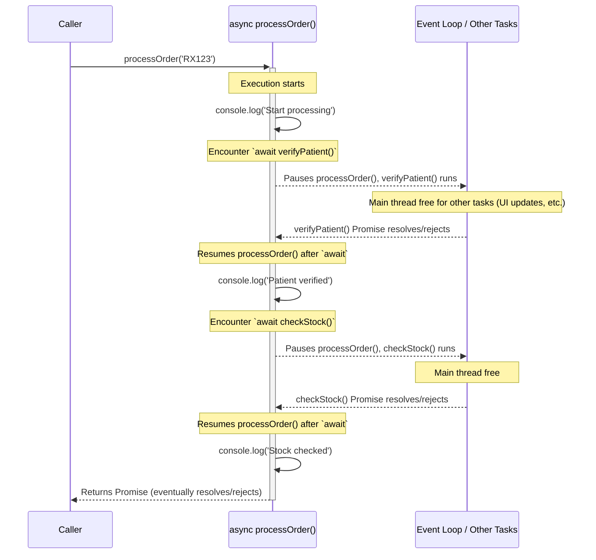

## Section 5: Asynchronous JavaScript

JavaScript is single-threaded, meaning it can only execute one piece of code at a time. However, many operations in web and mobile development, like fetching data from a server, reading files, or waiting for user input, can take time. If these operations were synchronous (blocking), they would freeze the entire application, leading to a poor user experience. Asynchronous JavaScript allows your program to perform long-running tasks without blocking the main thread, ensuring your application remains responsive.

### Synchronous vs. Asynchronous Code

- **Synchronous Code:** Executes in a sequence, one line at a time. Each operation must complete before the next one begins. If an operation takes a long time (e.g., a large network request), the application will be unresponsive until it finishes.

  ```javascript
  console.log("First: Preparing medication list...");
  // Imagine a long, blocking operation here
  // for (let i = 0; i < 1e9; i++) { /* do nothing */ }
  console.log("Second: Medication list prepared."); // This logs only after the blocking operation
  console.log("Third: Displaying list.");
  ```

- **Asynchronous Code:** Allows the program to initiate a task that might take time (like fetching data) and then continue executing other code without waiting for that task to complete. When the task finishes, a callback function or a Promise handler is executed with the result.

  ```javascript
  console.log("First: Requesting patient data...");

  setTimeout(() => {
    // This function (callback) runs after 2 seconds
    console.log("Second: Patient data received (asynchronously).");
  }, 2000); // 2000 milliseconds = 2 seconds

  console.log("Third: Continuing with other tasks (e.g., updating UI)...");
  // Expected Output Order:
  // First: Requesting patient data...
  // Third: Continuing with other tasks (e.g., updating UI)...
  // (after 2 seconds)
  // Second: Patient data received (asynchronously).
  ```

This example illustrates a fundamental async pattern using `setTimeout`. The first `console.log` executes immediately. `setTimeout` then schedules its callback function (which logs "Second: Patient data received...") to run after approximately 2000 milliseconds. Importantly, `setTimeout` itself is non-blocking; the script doesn't wait. Thus, "Third: Continuing with other tasks..." logs next. Only after the main script finishes and the 2-second delay elapses does the event loop pick up the `setTimeout` callback and execute it. This demonstrates how JavaScript handles time-consuming operations without freezing the main execution thread.

> 📲 **(Native Developers):**
>
> **Comparison:** JavaScript's asynchronous model differs fundamentally from native platforms. iOS uses GCD (Grand Central Dispatch) and Swift's structured concurrency to manage multiple threads. Android uses thread pools, Kotlin Coroutines, or RxJava for multithreaded operations. JavaScript in React Native, however, runs on a _single thread_ with an event loop, using callbacks, Promises, and async/await for non-blocking operations.
>
> **Key Takeaway:** In native development, you're actually running code concurrently on multiple threads. In JavaScript, you're simulating concurrency on a single thread using the event loop, which executes asynchronous callbacks when the main thread is free.
>
> **Source:** [Swift Concurrency](https://docs.swift.org/swift-book/documentation/the-swift-programming-language/concurrency/) and [Kotlin Coroutines](https://kotlinlang.org/docs/coroutines-overview.html)
>
> **Example:**
>
> ```swift
> // Swift: Actual concurrency with async/await
> func fetchData() async throws -> Data {
>     let (data, _) = try await URLSession.shared.data(from: url)
>     return data // This thread yields while waiting
> }
>
> // Usage:
> Task {
>     do {
>         let data = try await fetchData()
>         processData(data)
>     } catch {
>         handleError(error)
>     }
> }
> ```
>
> ```kotlin
> // Kotlin: Coroutines for structured concurrency
> suspend fun fetchData(): Data {
>     return withContext(Dispatchers.IO) {
>         val response = URL(url).readText() // Suspends coroutine, not thread
>         parseData(response)
>     }
> }
>
> // Usage:
> CoroutineScope(Dispatchers.Main).launch {
>     try {
>         val data = fetchData()
>         processData(data)
>     } catch (e: Exception) {
>         handleError(e)
>     }
> }
> ```
>
> ```javascript
> // JavaScript: Single-threaded with Promises
> async function fetchData() {
>   const response = await fetch(url); // Non-blocking, returns to event loop
>   const data = await response.json();
>   return data;
> }
>
> // Usage:
> fetchData().then(processData).catch(handleError);
> ```

#### The Event Loop

JavaScript environments (like browsers, Node.js, and React Native's JavaScript engine) manage asynchronous operations using an **event loop**, a **call stack**, and a **message queue** (or task queue).

1.  **Call Stack:** Where JavaScript keeps track of function calls. When a function is called, it's added to the stack. When it returns, it's removed.
2.  **Web APIs / Native APIs:** Asynchronous operations (like `setTimeout`, network requests via `fetch`) are handed off to browser/native APIs to be processed outside the main JavaScript thread.
3.  **Message Queue (Task Queue):** When an asynchronous operation completes (e.g., timer expires, data arrives), its callback function is placed in the message queue.
4.  **Event Loop:** Continuously checks if the call stack is empty. If it is, it takes the first message (callback) from the queue and pushes it onto the call stack for execution.

This mechanism ensures that long-running operations don't block the main thread, allowing the UI to remain responsive.

```mermaid
graph TD
    subgraph JavaScriptRuntime [JavaScript Runtime]
        CallStack["Call Stack (LIFO)"]
        Heap["Heap (Memory Allocation)"]
    end

    subgraph EnvironmentAPIs [Browser/Node.js APIs (Background Processing)]
        APIs["Web APIs / C++ APIs <br/>(setTimeout, fetch, DOM events, fs)"]
    end

    subgraph TaskQueues [Task Queues]
        direction LR
        CallbackQueue["Callback Queue (Macrotasks)"]
        MicrotaskQueue["Microtask Queue <br/>(Promise .then/.catch/.finally, queueMicrotask)"]
    end

    EventLoop["(Event Loop)"]

    CallStack -- "Executes Synchronous Code" --> Heap
    CallStack -- "Initiates Async Operation" --> APIs
    APIs -- "Operation Complete (e.g., timer done)" --> CallbackQueue
    APIs -- "Promise Settles" --> MicrotaskQueue

    EventLoop -.-> CallStack
    EventLoop -.-> MicrotaskQueue
    EventLoop -.-> CallbackQueue

    MicrotaskQueue -- "Dequeues Task if Call Stack Empty" --> CallStack
    CallbackQueue -- "Dequeues Task if Call Stack & Microtask Queue Empty" --> CallStack

    note right of EventLoop
      Monitors Call Stack & Task Queues:
      1. If Call Stack empty, process ALL Microtasks.
      2. If Call Stack & Microtask Queue empty, process ONE Macrotask.
      3. Repeat.
    end

    style EventLoop fill:#f9f,stroke:#333,stroke-width:2px
    style CallStack fill:#lightblue
    style MicrotaskQueue fill:#lightgreen
    style CallbackQueue fill:#orange
```

This diagram visualizes the JavaScript Event Loop mechanism. The **Call Stack** executes synchronous code. When an asynchronous operation (like `setTimeout` or `fetch`) is initiated, it's offloaded to **Browser/Node.js APIs** which run in the background. Upon completion, these APIs place their callbacks into one of two queues: the **Microtask Queue** (for Promise handlers like `.then()`, `.catch()`, which have higher priority) or the **Callback Queue** (also known as Macrotask Queue, for `setTimeout`, I/O). The **Event Loop** continuously monitors the Call Stack. When the Call Stack is empty, it first processes _all_ tasks in the Microtask Queue. Only if both the Call Stack and Microtask Queue are empty will it take _one_ task from the Callback Queue to push onto the Call Stack for execution. This ensures non-blocking behavior and prioritizes promise resolutions.

### Callbacks

A callback is a function passed as an argument to another function, which is then invoked (called back) inside the outer function to complete some kind of routine or action, often after an asynchronous operation has finished.

```javascript
function getPatientDetails(patientId, callback) {
  console.log(`Fetching details for patient ${patientId}...`);
  // Simulate a delay (e.g., network request)
  setTimeout(() => {
    const patientData = {
      id: patientId,
      name: "Laura Palmer",
      condition: "Migraines",
    };
    // Execute the callback with the fetched data
    callback(patientData);
  }, 1500);
}

function displayPatientData(data) {
  console.log("Patient Data Received:");
  console.log(`  Name: ${data.name}`);
  console.log(`  Condition: ${data.condition}`);
}

getPatientDetails("P90210", displayPatientData);
// After ~1.5 seconds, displayPatientData will be called with patientData
```

**The "Pyramid of Doom":**
When dealing with multiple dependent asynchronous operations using callbacks, you can end up with deeply nested callbacks. This pattern, often called the "pyramid of doom," makes code difficult to read, debug, and maintain.

```javascript
// Conceptual example of the pyramid of doom
/*
fetchFirstResource(param1, function(result1) {
  console.log('Got result 1');
  fetchSecondResource(result1, function(result2) {
    console.log('Got result 2');
    fetchThirdResource(result2, function(result3) {
      console.log('Got result 3');
      // And so on...
    }, failureCallback);
  }, failureCallback);
}, failureCallback);
*/
```

Promises and `async/await` were introduced to solve these issues, offering more structured and readable ways to handle asynchronous operations.

### Promises (ES6)

A Promise is an object representing the eventual completion (or failure) of an asynchronous operation and its resulting value. It allows you to associate handlers with an asynchronous action's eventual success value or failure reason.

A Promise can be in one of three states:

- **`pending`**: Initial state, neither fulfilled nor rejected.
- **`fulfilled` (or `resolved`)**: The operation completed successfully, and the Promise has a resulting value.
- **`rejected`**: The operation failed, and the Promise has a reason for the failure.

Once a Promise is _settled_ (i.e., it is either fulfilled or rejected), its state and value/reason are immutable and will not change.

#### Promise States and Transitions

| State       | Description                                   | How it's reached                                            | Next possible states    |
| :---------- | :-------------------------------------------- | :---------------------------------------------------------- | :---------------------- |
| `pending`   | Initial state, operation not yet completed    | When `new Promise()` is created                             | `fulfilled`, `rejected` |
| `fulfilled` | Operation completed successfully, has a value | Executor calls `resolve(value)`                             | (Terminal state)        |
| `rejected`  | Operation failed, has a reason (error)        | Executor calls `reject(reason)` or error thrown in executor | (Terminal state)        |

#### Creating Promises

You can create a Promise using the `Promise` constructor, which takes a function (executor) with two parameters: `resolve` and `reject`. `resolve` is a function to call when the operation succeeds, and `reject` is for when it fails.

```javascript
function fetchMedicationStock(medicationName) {
  return new Promise((resolve, reject) => {
    console.log(`Checking stock for ${medicationName}...`);
    setTimeout(() => {
      const inventory = {
        Amoxicillin: 100,
        Ibuprofen: 50,
        Aspirin: 0,
      };
      if (inventory.hasOwnProperty(medicationName)) {
        if (inventory[medicationName] > 0) {
          resolve({
            medication: medicationName,
            stock: inventory[medicationName],
          });
        } else {
          reject(new Error(`${medicationName} is out of stock.`));
        }
      } else {
        reject(new Error(`${medicationName} not found in inventory.`));
      }
    }, 1000);
  });
}
```

This `fetchMedicationStock` function demonstrates Promise creation. It returns a `new Promise` that simulates fetching data asynchronously using `setTimeout`. Inside the executor function, after a 1-second delay, it checks a mock `inventory`. If the `medicationName` exists and has stock > 0, the Promise is `resolve`d with an object containing the medication and stock count. If the medication is out of stock or not found, the Promise is `reject`ed with an appropriate `Error` object. This encapsulates the asynchronous logic and provides a clear success (`resolve`) or failure (`reject`) path for consumers of the Promise.

#### Consuming Promises

- **`.then(onFulfilled, onRejected)`**: Attaches callbacks for the resolution and/or rejection of the Promise.
  - `onFulfilled`: Called if the Promise is fulfilled (resolved).
  - `onRejected`: Called if the Promise is rejected.
- **`.catch(onRejected)`**: A shorthand for `promise.then(null, onRejected)`. Used for error handling.
- **`.finally(onFinally)` (ES2018)**: Schedules a function to be called when the promise is settled (either fulfilled or rejected).

```javascript
fetchMedicationStock("Amoxicillin")
  .then((result) => {
    console.log(`Success: ${result.medication} has ${result.stock} units.`);
  })
  .catch((error) => {
    console.error(`Error: ${error.message}`);
  })
  .finally(() => {
    console.log("Stock check for Amoxicillin complete.");
  });

fetchMedicationStock("Aspirin")
  .then((result) => {
    console.log(`Success: ${result.medication} has ${result.stock} units.`);
  })
  .catch((error) => {
    // This .catch will handle the rejection for Aspirin
    console.error(`Error: ${error.message}`); // Output: Error: Aspirin is out of stock.
  })
  .finally(() => {
    console.log("Stock check for Aspirin complete.");
  });
```

**Chaining Promises:**
`.then()`, `.catch()`, and `.finally()` return new Promises, allowing you to chain asynchronous operations. The way you return values or throw errors within these handlers determines the state and value of the chained Promise:

- **Returning a Value:** If an `onFulfilled` or `onRejected` handler returns a regular value (not a Promise), the new Promise returned by `.then()` (or `.catch()`) is **fulfilled** with that value.
- **Throwing an Error:** If a handler throws an error, the new Promise is **rejected** with that error.
- **Returning a Promise:** If a handler returns another Promise (let's call it `P2`), the new Promise returned by `.then()` (or `.catch()`) will "adopt" the state of `P2`. It will wait for `P2` to settle and then settle with `P2`'s fulfillment value or rejection reason. This is key for sequencing dependent asynchronous operations.

```javascript
function verifyPatient(patientId) {
  return new Promise((resolve, reject) => {
    setTimeout(() => {
      console.log(`Verifying patient ${patientId}...`);
      if (patientId === "P123") {
        resolve({ id: patientId, name: "Alice Smith" });
      } else {
        reject(new Error("Patient verification failed."));
      }
    }, 500);
  });
}

verifyPatient("P123")
  .then((patient) => {
    console.log(`Patient ${patient.name} verified.`);
    return fetchMedicationStock("Ibuprofen"); // Return another promise
  })
  .then((stockInfo) => {
    console.log(
      `${stockInfo.medication} stock: ${stockInfo.stock}. Prescription can be filled.`
    );
  })
  .catch((error) => {
    console.error(`Operation failed: ${error.message}`);
  });
```

#### Static Promise Methods

- `Promise.all(iterable)`: Waits for all promises in an iterable to resolve, or for any one of them to reject. Returns a single Promise that resolves with an array of the results of the input promises (in the same order).
- `Promise.race(iterable)`: Waits for the first promise in an iterable to settle (either resolve or reject). Returns a Promise that settles with the result/reason of the first promise that settles.
- `Promise.resolve(value)`: Returns a Promise object that is resolved with the given value.
- `Promise.reject(reason)`: Returns a Promise object that is rejected with the given reason.
- **`Promise.allSettled(iterableOfPromises)` (ES2020+):** Takes an iterable of Promises. It returns a Promise that fulfills after _all_ of the given Promises have either fulfilled or rejected. The fulfillment value is an array of objects, each describing the outcome of a Promise: `{status: "fulfilled", value:...}` or `{status: "rejected", reason:...}`. This is useful when you need to know the outcome of all operations, regardless of individual failures.
- **`Promise.any(iterableOfPromises)` (ES2021+):** Takes an iterable of Promises. It returns a Promise that fulfills as soon as _any_ of the input Promises fulfill, with the value of the first one that fulfilled. If all input Promises reject, it rejects with an `AggregateError` (an error object that groups all the individual rejection reasons).

```javascript
Promise.all([
  fetchMedicationStock("Amoxicillin"),
  fetchMedicationStock("Ibuprofen"),
])
  .then((results) => {
    console.log("All medications checked:");
    results.forEach((item) =>
      console.log(`  ${item.medication}: ${item.stock} units`)
    );
  })
  .catch((error) => {
    console.error("One of the stock checks failed:", error.message);
  });

// Example for allSettled
Promise.allSettled([
  fetchMedicationStock("Amoxicillin"),
  fetchMedicationStock("NonExistentDrug"), // This will reject
  Promise.resolve("Quickly resolved value"),
]).then((results) => {
  console.log("\n--- Promise.allSettled Results ---");
  results.forEach((result) => {
    if (result.status === "fulfilled") {
      console.log(`Fulfilled:`, result.value);
    } else {
      console.error(`Rejected:`, result.reason.message);
    }
  });
});
```

### `async/await` (ES2017)

`async/await` is syntactic sugar built on top of Promises, making asynchronous code look and feel more like synchronous code. This greatly improves readability and maintainability.

- **`async` function:** Declaring a function with the `async` keyword means it will automatically return a Promise. If the function returns a value, the Promise will be resolved with that value. If the function throws an error, the Promise will be rejected with that error.
- **`await` operator:** Can only be used inside an `async` function. It pauses the execution of the `async` function and waits for the Promise to its right to settle (resolve or reject). If the Promise resolves, `await` returns the resolved value. If it rejects, `await` throws the rejected reason (which can be caught by `try...catch`).

```javascript
async function processPrescription(patientId, medicationName) {
  console.log("--- Processing Prescription with async/await ---");
  try {
    const patient = await verifyPatient(patientId);
    console.log(`Async: Patient ${patient.name} verified.`);

    const stockInfo = await fetchMedicationStock(medicationName);
    console.log(`Async: ${stockInfo.medication} stock is ${stockInfo.stock}.`);

    if (stockInfo.stock > 0) {
      console.log(
        `Async: Prescription for ${medicationName} can be filled for ${patient.name}.`
      );
      return `${medicationName} dispensed.`;
    } else {
      console.log(
        `Async: ${medicationName} is out of stock for ${patient.name}.`
      );
      return `${medicationName} cannot be dispensed.`;
    }
  } catch (error) {
    console.error(`Async Operation Failed: ${error.message}`);
    throw error; // Re-throw if you want the caller to handle it too
  }
}

processPrescription("P123", "Ibuprofen")
  .then((result) => console.log(`Final result: ${result}`))
  .catch((error) => console.error(`Final error handler: ${error.message}`));

processPrescription("P456", "Amoxicillin") // P456 will cause verifyPatient to reject
  .then((result) => console.log(`Final result: ${result}`))
  .catch((error) =>
    console.error(`Final error handler for P456: ${error.message}`)
  );
```

Error handling in `async/await` is typically done using standard `try...catch` blocks, similar to synchronous code.

### Diagram: `async/await` Flow Conceptual Model

The following diagram illustrates conceptually how `async/await` simplifies asynchronous control flow, making it appear more synchronous while still being non-blocking under the hood.



This diagram shows that when an `async` function encounters an `await` keyword, it pauses its own execution at that point, allowing other JavaScript code (like UI updates or other event handlers) to run. The `await` waits for the asynchronous operation (the Promise) to complete. Once the awaited Promise settles (resolves or rejects), the `async` function resumes from where it left off. This makes complex asynchronous sequences much easier to write and understand because the code flows top-to-bottom, similar to synchronous code, but without freezing the main thread. The Event Loop is crucial in managing these paused functions and resuming them when their awaited operations are done.

### Under the Hood: Event Loop, Task Queues, and Microtasks

To truly understand how JavaScript handles asynchronicity without multiple threads, we need to look at the runtime environment's components:

1.  **JavaScript Engine & Call Stack:**

    - As discussed, JavaScript itself is single-threaded with one **Call Stack**. The Call Stack keeps track of function calls. When a script wants to call a function, it pushes a frame for that function onto the stack. When the function returns, its frame is popped.

2.  **Web APIs / Native Environment APIs (Background Operations):**

    - Asynchronous operations like `setTimeout`, DOM events (in browsers), `fetch` requests, or file system operations (in Node.js) are not handled directly by the JavaScript engine's main thread. Instead, they are offloaded to the browser's Web APIs or the Node.js environment's C++ APIs (often using separate threads managed by the environment, not directly accessible to your JS code).
    - When these background operations complete, they don't interrupt JavaScript execution. Instead, they place their associated callback functions into specific queues.

3.  **Callback Queue (Task Queue / Macrotask Queue):**

    - This queue holds callback functions that are ready to be executed from completed **macrotasks**. Examples of macrotasks include:
      - `setTimeout` and `setInterval` timers.
      - I/O operations (e.g., network responses from `fetch` after the initial Promise part, file reads).
      - User interaction events (e.g., clicks, key presses).
      - UI rendering updates (in browsers, this is a complex part of the event loop cycle).

4.  **Microtask Queue:**

    - This queue holds callbacks from completed **microtasks**. Microtasks have a **higher priority** than macrotasks.
    - The primary sources of microtasks are:
      - **Promise handlers:** Callbacks attached via `.then()`, `.catch()`, and `.finally()`.
      - Callbacks registered with `queueMicrotask()` (a way to schedule a function to run as a microtask).
      - `MutationObserver` callbacks (in browsers).

5.  **The Event Loop:**
    - The Event Loop is a constantly running process that orchestrates these components. Its fundamental job is to monitor the Call Stack and the task queues. Its cycle can be simplified as:
      1.  Execute all currently available synchronous code on the Call Stack until it is empty.
      2.  After the synchronous code finishes (and after each Macrotask from step 4 finishes), **process the Microtask Queue**: Execute all microtasks in the queue, one by one, until the Microtask Queue is empty. If a microtask adds another microtask, that new one is also processed before moving on.
      3.  (Browser-specific) If rendering updates are needed and conditions are met, the browser may perform UI rendering steps.
      4.  If the Call Stack is empty and the Microtask Queue is empty, take **one Macrotask** from the Callback Queue (if available) and push its callback function onto the Call Stack for execution. This brings us back to step 1 (the callback itself is synchronous code).

**Implications for Developers:**

- **Priority:** Microtasks (like Promise handlers) will always execute before Macrotasks (like `setTimeout` callbacks), even if both are scheduled at roughly the same time.

  ```javascript
  console.log("Start");

  setTimeout(() => {
    console.log("Timeout callback (Macrotask)");
  }, 0);

  Promise.resolve().then(() => {
    console.log("Promise.then callback (Microtask)");
  });

  console.log("End");

  // Expected Output:
  // Start
  // End
  // Promise.then callback (Microtask)
  // Timeout callback (Macrotask)
  ```

- **Non-Blocking:** This entire system ensures that the main JavaScript thread is not blocked by long-running I/O operations, keeping the UI responsive.
- **`async/await` Integration:** `await` works by pausing the `async` function and letting the event loop continue. When the awaited Promise settles, the continuation of the `async` function is typically scheduled as a microtask.

Understanding this event loop mechanism is key to predicting the behavior of complex asynchronous code and debugging timing-related issues.

> 📚 **Official Documentation:**
>
> - [MDN Web Docs: Asynchronous JavaScript](https://developer.mozilla.org/en-US/docs/Web/JavaScript/Reference/Operators/async_function) (This link points to `async function`, a good starting point)
> - [MDN Web Docs: Introducing asynchronous JavaScript](https://developer.mozilla.org/en-US/docs/Learn/JavaScript/Asynchronous/Introducing)
> - [MDN Web Docs: Event Loop](https://developer.mozilla.org/en-US/docs/Web/JavaScript/EventLoop)
> - [MDN Web Docs: Callback function](https://developer.mozilla.org/en-US/docs/Glossary/Callback_function)
> - [MDN Web Docs: Promise](https://developer.mozilla.org/en-US/docs/Web/JavaScript/Reference/Global_Objects/Promise)
> - [MDN Web Docs: `async function`](https://developer.mozilla.org/en-US/docs/Web/JavaScript/Reference/Statements/async_function)
> - [MDN Web Docs: `await`](https://developer.mozilla.org/en-US/docs/Web/JavaScript/Reference/Operators/await)

### Exercise 5.3: Async Function Implementation

Practice working with asynchronous JavaScript by implementing functions that simulate fetching data, first using Promises directly, and then refactoring to use `async/await`.

**(https://codesandbox.io/s/INSERT_ACTUAL_EXERCISE_5_3_URL_HERE)**

_(Note: The CodeSandbox link is a placeholder. A functional CodeSandbox with the exercise prompt will be provided in the actual course materials.)_

**Instructions for Exercise 5.3 (to be placed in CodeSandbox `README.md`):**

```markdown
# Exercise 5.3: Async Function Implementation - SpeedyMeds Pharmacy

## Objective

Gain experience with asynchronous JavaScript by implementing functions that simulate network requests using Promises and then refactoring them to use `async/await` syntax for better readability.

## Tasks

### Part 1: Using Promises

1.  **`fetchPatientProfile(patientId)` Function (Promise-based):**

    - Define a function `fetchPatientProfile(patientId)` that returns a `Promise`.
    - Inside the Promise executor, simulate a network request using `setTimeout` (e.g., delay of 1 second).
    - If `patientId` is a non-empty string, the Promise should resolve with a patient profile object (e.g., `{ id: patientId, name: 'Patient ' + patientId, lastVisit: '2023-03-15' }`).
    - If `patientId` is empty or not a string, the Promise should reject with an `Error('Invalid patient ID')`.
    - Call this function with a valid ID and chain `.then()` to log the profile and `.catch()` to log any error.
    - Call this function with an invalid ID to test the rejection.

2.  **`fetchMedicationDetails(medicationName)` Function (Promise-based):**

    - Define a function `fetchMedicationDetails(medicationName)` that returns a `Promise`.
    - Simulate a network request (e.g., delay of 1.5 seconds).
    - If `medicationName` is 'Lisinopril', resolve with `{ name: 'Lisinopril', dosage: '10mg', type: 'Tablet' }`.
    - If `medicationName` is 'Amoxicillin', resolve with `{ name: 'Amoxicillin', dosage: '250mg', type: 'Capsule' }`.
    - For any other medication name, reject with an `Error('Medication details not found')`.
    - Test this function similarly by calling it and using `.then()` and `.catch()`.

3.  **Chain `fetchPatientProfile` and `fetchMedicationDetails`:**
    - Call `fetchPatientProfile` for a valid patient.
    - In its `.then()` handler, if successful, call `fetchMedicationDetails` for 'Lisinopril'.
    - Chain another `.then()` to log both the patient name and the medication details (e.g., "Patient [Name] is prescribed [Medication Name] ([Dosage])").
    - Include a `.catch()` at the end of the chain to handle any errors from either Promise.

### Part 2: Refactoring with `async/await`

1.  **`getPrescriptionInfoAsync(patientId, medicationName)` Function (`async/await`):**
    - Define an `async` function `getPrescriptionInfoAsync(patientId, medicationName)`.
    - Inside this function, use `await` to call `fetchPatientProfile(patientId)` and then `fetchMedicationDetails(medicationName)` sequentially.
    - If both are successful, log a message like: "(Async) Patient: [Patient Name], Medication: [Medication Name], Dosage: [Medication Dosage]".
    - Use a `try...catch` block to handle any potential errors from the awaited promises and log an appropriate error message (e.g., "(Async) Error fetching prescription info: [error message]").
    - Call `getPrescriptionInfoAsync` with valid data and also with data that would cause one of the underlying functions to reject (to test error handling).

## Getting Started

1.  Open the `index.js` file.
2.  Implement the functions as described for Part 1 and then Part 2.
3.  Use `console.log()` and `console.error()` to display the outputs.
4.  Observe the behavior of Promises and `async/await`, especially how errors are handled and how `async/await` can simplify asynchronous code structure.

Good luck!
```

### Next Steps

Asynchronous programming is a cornerstone of modern JavaScript and essential for building responsive React Native apps that interact with networks or perform other time-consuming tasks. You're now equipped to handle these scenarios effectively. Next, we'll explore how JavaScript organizes code into reusable pieces called modules. Proceed to [Section 6: ES6 Modules](./section-06-es6-modules.md).
