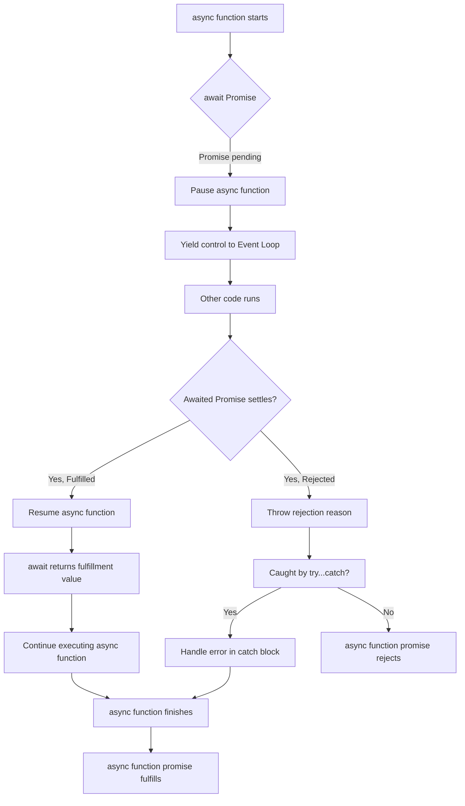
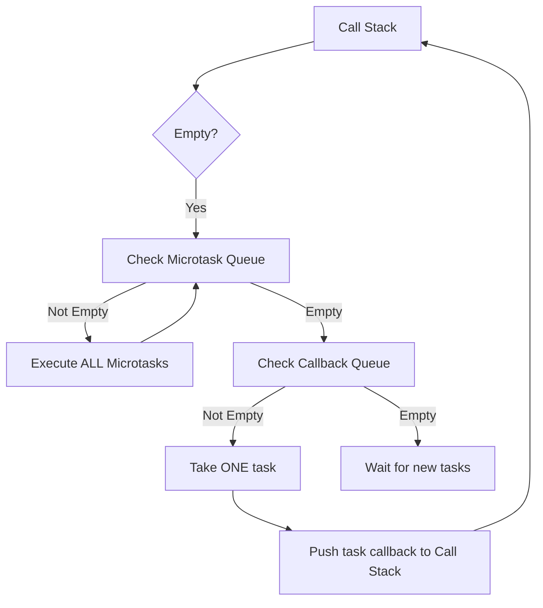

## Section 5: Asynchronous JavaScript (Callbacks, Promises, async/await)

Asynchronous operations are a cornerstone of modern JavaScript, especially in environments like React Native where non-blocking I/O (Input/Output) operations such as network requests, file system access, or timers are essential for a responsive user interface. This section explores the evolution of handling asynchronicity in JavaScript, from traditional callbacks to Promises and the more recent `async`/`await` syntax.

> 🛣️ **All Learners:** Asynchronous programming is fundamental to building responsive applications, particularly in mobile development where network requests and other time-consuming operations are common. Master Promises and `async`/`await`, as they are the standard way to handle async logic in modern JavaScript and React Native.

### Fundamentals of Synchronous vs. Asynchronous Programming

-   **Synchronous Execution:** Code is executed sequentially, one line at a time. Each operation must complete before the next begins. A long-running synchronous operation blocks the main thread, making the application unresponsive.
-   **Asynchronous Execution:** Operations are initiated and run in the background without blocking the main thread. The main thread continues executing other code. When the async operation finishes, a specific piece of code (like a callback or Promise handler) is executed.

**Why Asynchronous is Crucial for UI Applications:** In UI-driven applications like those built with React Native, maintaining a responsive user interface is paramount. Asynchronous operations prevent the UI from freezing during time-consuming tasks such as fetching data from a server. This ensures that the user can continue to interact with the app while these operations are in progress.

### Callbacks

Callbacks were the earliest mechanism for handling asynchronous operations in JavaScript.

-   **Definition:** A callback is a function passed as an argument to another function, intended to be executed ("called back") later, typically after an asynchronous operation or event completes.
-   **Role in Asynchronous Operations:** Used in event handlers, timers (`setTimeout`, `setInterval`), and older network request APIs.

This example shows a simple callback with `setTimeout`:

```javascript
console.log("Start of script");

setTimeout(function() {
  console.log("This runs after 1 second (callback)");
}, 1000);

console.log("End of script");
// Outputs:
// Start of script
// End of script
// This runs after 1 second (callback)
// The script continues executing while the timer runs in the background.
```

#### "Callback Hell" (Pyramid of Doom)

When multiple asynchronous operations depend on each other and are handled with nested callbacks, it leads to deeply indented and hard-to-read code known as "Callback Hell".

> [!CAUTION]
> Deeply nested callbacks ("Callback Hell") make code difficult to read, maintain, and debug, especially when handling errors. Promises and `async`/`await` were introduced to solve this problem.

This illustrative example shows the structure of callback hell:

```javascript
// Illustrative example of callback hell structure
asyncOperation1(arg1, function(error1, result1) {
  if (error1) {
    handleError(error1);
  } else {
    asyncOperation2(result1, function(error2, result2) {
      if (error2) {
        handleError(error2);
      } else {
        asyncOperation3(result2, function(error3, result3) {
          if (error3) {
            handleError(error3);
          } else {
            //...and so on, leading to deep nesting
            console.log("All operations complete:", result3);
          }
        });
      }
    });
  }
});
```

### Promises (ES6+)

Promises provide a more robust and structured approach to managing asynchronous operations, offering a cleaner alternative to callback-based patterns.

-   **Core Concepts:** A Promise is an object representing the eventual completion (or failure) of an asynchronous operation and its resulting value (or reason for failure). It acts as a placeholder for a future value.
-   **States of a Promise:** A Promise can be in one of three states:
    -   `pending`: Initial state, operation not yet completed.
    -   `fulfilled` (resolved): Operation completed successfully, has a fulfillment value.
    -   `rejected`: Operation failed, has a reason for failure (typically an error).
    -   A Promise is `settled` if it is either fulfilled or rejected. Once settled, its state is immutable.

This table summarizes Promise states:

Table 5.1: Promise States and Transitions

| State     | Description                                       | How it's Reached                                   | Next Possible States |
| :-------- | :------------------------------------------------| :-------------------------------------------------| :-------------------|
| `pending` | Initial state, operation not yet completed        | When `new Promise()` is created                    | `fulfilled`, `rejected`|
| `fulfilled`| Operation completed successfully, has a value     | Executor calls `resolve(value)`                    | (Terminal state)     |
| `rejected` | Operation failed, has a reason (error)            | Executor calls `reject(reason)` or error thrown in executor | (Terminal state)     |

#### Creating a Promise

Promises are typically created using the `new Promise()` constructor, which takes an "executor" function with `resolve` and `reject` arguments.

This example shows creating a simple Promise:

```javascript
const fetchMedicationData = new Promise((resolve, reject) => {
  // Simulate fetching data asynchronously
  setTimeout(() => {
    const success = Math.random() > 0.3; // Simulate success/failure
    if (success) {
      resolve({ name: "Vitamin C", dosage: "1000mg" }); // Fulfill with data
    } else {
      reject(new Error("Failed to fetch medication data.")); // Reject with an error
    }
  }, 1500);
});
```

#### Consuming Promises

Interact with a Promise using its methods:

-   `.then(onFulfilled, onRejected)`: Schedules callbacks for when the Promise settles. `onFulfilled` runs on success, `onRejected` (optional) runs on failure. Returns a *new* Promise, enabling chaining.
-   `.catch(onRejected)`: Shorthand for `.then(null, onRejected)`, used specifically for handling rejections. Returns a new Promise.
-   `.finally(onFinally)`: Schedules a callback to run when the Promise is settled (fulfilled or rejected). Useful for cleanup. Returns a new Promise.

This example shows consuming a Promise:

```javascript
fetchMedicationData
  .then(data => {
    console.log("Successfully fetched:", data); // Handle fulfillment
  })
  .catch(error => {
    console.error("Error fetching:", error.message); // Handle rejection
  })
  .finally(() => {
    console.log("Fetch attempt finished."); // Runs after fulfillment or rejection
  });
```

#### Promise Chaining

Because `.then()`, `.catch()`, and `.finally()` return new Promises, they can be chained together to sequence asynchronous operations in a more linear way than nested callbacks.

-   If a handler returns a value, the next `.then()` in the chain receives that value.
-   If a handler throws an error or returns a rejected Promise, the chain jumps to the next `.catch()` handler.
-   If a handler returns a Promise, the chain waits for that Promise to settle before continuing.

This example shows Promise chaining for sequential async operations:

```javascript
function fetchPatient(id) {
  return Promise.resolve({ id, name: "Alice" }); // Simulate async fetch
}

function fetchPrescriptions(patientId) {
  return Promise.resolve([`RX for ${patientId}`]); // Simulate async fetch
}

fetchPatient("P101")
  .then(patient => {
    console.log("Fetched patient:", patient);
    return fetchPrescriptions(patient.id); // Return a new promise
  })
  .then(prescriptions => {
    console.log("Fetched prescriptions:", prescriptions);
    // Further processing...
  })
  .catch(error => {
    console.error("An error occurred in the chain:", error);
  });
```

#### Static Promise Methods

The `Promise` constructor provides utility methods for working with multiple Promises:

-   `Promise.resolve(value)`: Returns a Promise resolved with the given value.
-   `Promise.reject(reason)`: Returns a Promise rejected with the given reason.
-   `Promise.all(iterableOfPromises)`: Returns a single Promise that fulfills when *all* input Promises fulfill, or rejects if *any* input Promise rejects.
-   `Promise.race(iterableOfPromises)`: Returns a single Promise that settles as soon as the *first* input Promise settles.
-   `Promise.allSettled(iterableOfPromises)` (ES2020+): Returns a Promise that fulfills after *all* input Promises have settled (either fulfilled or rejected), with an array describing each outcome.
-   `Promise.any(iterableOfPromises)` (ES2021+): Returns a Promise that fulfills as soon as *any* input Promise fulfills, or rejects with an `AggregateError` if all reject.

This example shows `Promise.all` to wait for multiple async operations:

```javascript
const fetchMedicationA = Promise.resolve("Med A");
const fetchMedicationB = Promise.resolve("Med B");
const fetchMedicationC = Promise.reject("Fetch of Med C failed"); // One promise rejects

Promise.all([fetchMedicationA, fetchMedicationB, fetchMedicationC])
  .then(results => {
    console.log("All successful:", results); // This block will NOT run
  })
  .catch(error => {
    console.error("At least one fetch failed:", error); // Outputs: At least one fetch failed: Fetch of Med C failed
  });

Promise.allSettled([fetchMedicationA, fetchMedicationB, fetchMedicationC])
  .then(results => {
    console.log("All settled:", results); // Outputs an array of outcomes for each promise
  });
```

> 🌐 **Web Developers:** Promises are standard in modern web development and widely used for APIs like `fetch`. You should be comfortable with Promise states, chaining, and static methods.
>
> 📲 **Native Developers:** Promises are similar in concept to Futures or Tasks in Java/Swift, representing a value that will be available later. The `.then()`, `.catch()`, and `.finally()` syntax is JavaScript-specific.

> 📚 **Official Documentation:**
>
> - [MDN Web Docs: Promise](https://developer.mozilla.org/en-US/docs/Web/JavaScript/Reference/Global_Objects/Promise)
> - [MDN Web Docs: Using Promises](https://developer.mozilla.org/en-US/docs/Web/JavaScript/Guide/Using_promises)
> - [MDN Web Docs: `Promise.prototype.then()`](https://developer.mozilla.org/en-US/docs/Web/JavaScript/Reference/Global_Objects/Promise/then)
> - [MDN Web Docs: `Promise.prototype.catch()`](https://developer.mozilla.org/en-US/docs/Web/JavaScript/Reference/Global_Objects/Promise/catch)
> - [MDN Web Docs: `Promise.prototype.finally()`](https://developer.mozilla.org/en-US/docs/Web/JavaScript/Reference/Global_Objects/Promise/finally)
> - [MDN Web Docs: `Promise.all()`](https://developer.mozilla.org/en-US/docs/Web/JavaScript/Reference/Global_Objects/Promise/all)
> - [MDN Web Docs: `Promise.race()`](https://developer.mozilla.org/en-US/docs/Web/JavaScript/Reference/Global_Objects/Promise/race)
> - [MDN Web Docs: `Promise.allSettled()`](https://developer.mozilla.org/en-US/docs/Web/JavaScript/Reference/Global_Objects/Promise/allSettled)
> - [MDN Web Docs: `Promise.any()`](https://developer.mozilla.org/en-US/docs/Web/JavaScript/Reference/Global_Objects/Promise/any)

### async/await (ES2017+)

`async`/`await` is syntactic sugar on top of Promises, allowing asynchronous, Promise-based code to be written in a style that looks and behaves more like synchronous code, making it easier to read and reason about.

-   **`async` Functions:** A function declared with the `async` keyword. An `async` function always implicitly returns a Promise. If it returns a value, the Promise fulfills with that value. If it throws an error, the Promise rejects with that error.
-   **`await` Keyword:** Can only be used inside an `async` function (or top-level modules). When placed before a Promise, it pauses the `async` function's execution until that Promise settles. It does *not* block the main JavaScript thread. If the awaited Promise fulfills, `await` returns the fulfillment value. If it rejects, `await` throws the rejection reason.

This example shows a simple `async`/`await` function:

```javascript
// Assume fetchMedicationData is the Promise created earlier

async function getMedication() {
  console.log("Attempting to get medication...");
  try {
    const medication = await fetchMedicationData; // Pause until promise settles
    console.log("Got medication:", medication); // Runs on fulfillment
    return medication; // This value fulfills the getMedication promise
  } catch (error) {
    console.error("Error in async function:", error.message); // Catches rejection
    throw error; // Re-throw to propagate the error
  }
}

getMedication(); // Call the async function
// The code outside this async function continues to run immediately.
```

#### Simplification of Promise-based Code

`async`/`await` helps avoid long `.then()` chains, resulting in flatter, more linear code, especially for complex sequences.

This example shows the previous Promise chaining example rewritten with `async`/`await`:

```javascript
// Assume fetchPatient and fetchPrescriptions functions return Promises

async function getPatientPrescriptions(patientId) {
  try {
    console.log("Fetching patient...");
    const patient = await fetchPatient(patientId); // Wait for patient fetch
    console.log("Fetched patient:", patient);

    console.log("Fetching prescriptions...");
    const prescriptions = await fetchPrescriptions(patient.id); // Wait for prescriptions fetch
    console.log("Fetched prescriptions:", prescriptions);

    return { patient, prescriptions }; // Return combined data
  } catch (error) {
    console.error("Failed to get patient prescriptions:", error);
    throw error; // Re-throw the error
  }
}

getPatientPrescriptions("P101"); // Call the async function
```

#### Error Handling with `try...catch`

Standard `try...catch` blocks can be used around `await` expressions to handle errors (rejected Promises) in a familiar way.

This is demonstrated in the `getMedication` and `getPatientPrescriptions` examples above. If an `await`ed Promise rejects, the rejection reason is thrown as an exception that the `catch` block can handle.

> 🌐 **Web Developers:** `async`/`await` is the preferred way to write asynchronous code in modern JavaScript. It makes async code look and feel more like synchronous code, improving readability.
>
> 📲 **Native Developers:** `async`/`await` patterns exist in languages like C# and Swift. JavaScript's implementation works on top of Promises and integrates with the event loop, providing a clean syntax for managing asynchronous flows without explicit callbacks or complex chaining syntax.

> 📚 **Official Documentation:**
>
> - [MDN Web Docs: `async` function](https://developer.mozilla.org/en-US/docs/Web/JavaScript/Reference/Statements/async_function)
> - [MDN Web Docs: `await`](https://developer.mozilla.org/en-US/docs/Web/JavaScript/Reference/Operators/await)

### "Under the Hood": Event Loop, Callback Queue, and Microtask Queue

JavaScript is a single-threaded language, meaning it has only one call stack and executes one piece of code at a time. It achieves concurrency through a mechanism involving the event loop and different task queues, working with environment-provided APIs (like browser Web APIs or Node.js).

-   **Call Stack:** Tracks function calls.
-   **Web APIs / Background Operations:** Asynchronous operations (timers, network requests, events) are offloaded here by the environment.
-   **Callback Queue (Task Queue / Macrotask Queue):** Holds callbacks from completed "macrotasks" (timers, I/O, UI events).
-   **Microtask Queue:** Holds callbacks from completed "microtasks" (Promise handlers, `queueMicrotask`). Microtasks have higher priority.
-   **Event Loop:** Continuously monitors the Call Stack and queues. When the Call Stack is empty, it first processes all tasks in the Microtask Queue. Once the Microtask Queue is empty, it takes one task from the Callback Queue and pushes it to the Call Stack.

**Order of Execution:** Synchronous code -> Microtask Queue (all tasks) -> (Optional UI Rendering) -> Callback Queue (one task) -> repeat.

> [!IMPORTANT]
> Understanding the Event Loop and the priority of the Microtask Queue is crucial for predicting the execution order of asynchronous code, especially when mixing Promises (`.then` callbacks are microtasks) and traditional callbacks like `setTimeout` (which are macrotasks). A Promise handler will always run before a `setTimeout` callback scheduled for the "same time".

This diagram illustrates the conceptual flow of `async`/`await`:



This diagram illustrates the interaction of the Event Loop and queues:



> 🌐 **Web Developers:** The Event Loop is a core concept in browser and Node.js environments. Understanding the difference between macrotasks and microtasks is important for complex async scenarios.
>
> 📲 **Native Developers:** This model of a single thread managing concurrency via an event loop and queues is likely different from multi-threading models you might be used to. It's a fundamental concept for understanding JavaScript's runtime behavior.

> 📚 **Official Documentation:**
>
> - [MDN Web Docs: The Event Loop](https://developer.mozilla.org/en-US/docs/Web/JavaScript/EventLoop)
> - [MDN Web Docs: Using microtasks in JavaScript with queueMicrotask()](https://developer.mozilla.org/en-US/docs/Web/API/HTML_DOM_API/Microtask_guide)

### Section Exercise

Practice implementing asynchronous logic using Promises and `async`/`await` in this coding exercise.

**(TODO: Add link to Exercise 5.3: Async Function Implementation - CodeSandbox)**

### Next Steps

Continue to the final section of this module to learn about ES6 Modules, the standard way to organize and share code in modern JavaScript applications.

- [Section 6: ES6 Modules (Import/Export)](./section-06-es6-modules.md)
