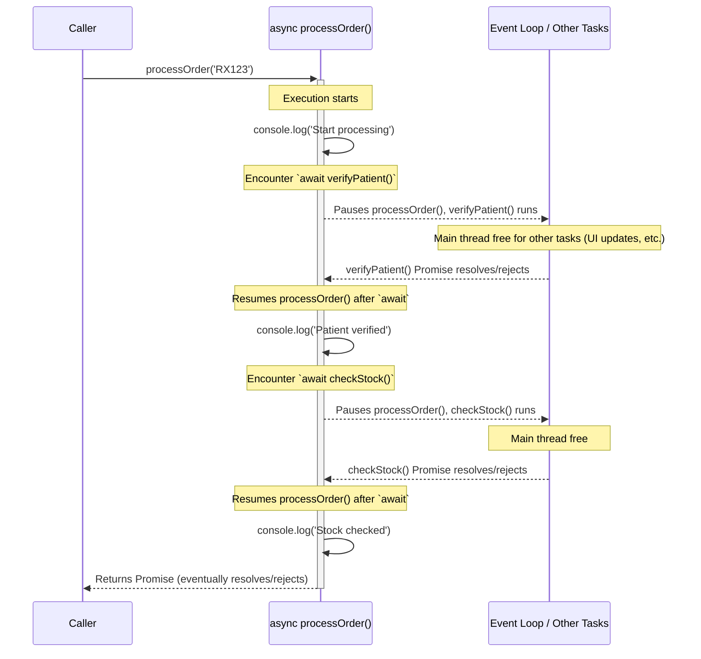

## Section 5: Asynchronous JavaScript

JavaScript is single-threaded, meaning it can only execute one piece of code at a time. However, many operations in web and mobile development, like fetching data from a server, reading files, or waiting for user input, can take time. If these operations were synchronous (blocking), they would freeze the entire application, leading to a poor user experience. Asynchronous JavaScript allows your program to perform long-running tasks without blocking the main thread, ensuring your application remains responsive.

### Synchronous vs. Asynchronous Code

- **Synchronous Code:** Executes in a sequence, one line at a time. Each operation must complete before the next one begins. If an operation takes a long time (e.g., a large network request), the application will be unresponsive until it finishes.

  ```javascript
  console.log("First: Preparing medication list...");
  // Imagine a long, blocking operation here
  // for (let i = 0; i < 1e9; i++) { /* do nothing */ }
  console.log("Second: Medication list prepared."); // This logs only after the blocking operation
  console.log("Third: Displaying list.");
  ```

- **Asynchronous Code:** Allows the program to initiate a task that might take time (like fetching data) and then continue executing other code without waiting for that task to complete. When the task finishes, a callback function or a Promise handler is executed with the result.

  ```javascript
  console.log("First: Requesting patient data...");

  setTimeout(() => {
    // This function (callback) runs after 2 seconds
    console.log("Second: Patient data received (asynchronously).");
  }, 2000); // 2000 milliseconds = 2 seconds

  console.log("Third: Continuing with other tasks (e.g., updating UI)...");
  // Expected Output Order:
  // First: Requesting patient data...
  // Third: Continuing with other tasks (e.g., updating UI)...
  // (after 2 seconds)
  // Second: Patient data received (asynchronously).
  ```

#### The Event Loop

JavaScript environments (like browsers, Node.js, and React Native's JavaScript engine) manage asynchronous operations using an **event loop**, a **call stack**, and a **message queue** (or task queue).

1.  **Call Stack:** Where JavaScript keeps track of function calls. When a function is called, it's added to the stack. When it returns, it's removed.
2.  **Web APIs / Native APIs:** Asynchronous operations (like `setTimeout`, network requests via `fetch`) are handed off to browser/native APIs to be processed outside the main JavaScript thread.
3.  **Message Queue (Task Queue):** When an asynchronous operation completes (e.g., timer expires, data arrives), its callback function is placed in the message queue.
4.  **Event Loop:** Continuously checks if the call stack is empty. If it is, it takes the first message (callback) from the queue and pushes it onto the call stack for execution.

This mechanism ensures that long-running operations don't block the main thread, allowing the UI to remain responsive.

### Callbacks

A callback is a function passed as an argument to another function, which is then invoked (called back) inside the outer function to complete some kind of routine or action, often after an asynchronous operation has finished.

```javascript
function getPatientDetails(patientId, callback) {
  console.log(`Fetching details for patient ${patientId}...`);
  // Simulate a delay (e.g., network request)
  setTimeout(() => {
    const patientData = {
      id: patientId,
      name: "Laura Palmer",
      condition: "Migraines",
    };
    // Execute the callback with the fetched data
    callback(patientData);
  }, 1500);
}

function displayPatientData(data) {
  console.log("Patient Data Received:");
  console.log(`  Name: ${data.name}`);
  console.log(`  Condition: ${data.condition}`);
}

getPatientDetails("P90210", displayPatientData);
// After ~1.5 seconds, displayPatientData will be called with patientData
```

**"Callback Hell" (Pyramid of Doom):**
When dealing with multiple dependent asynchronous operations using callbacks, you can end up with deeply nested callbacks. This pattern, often called "callback hell" or the "pyramid of doom," makes code difficult to read, debug, and maintain.

```javascript
// Conceptual example of callback hell
/*
fetchFirstResource(param1, function(result1) {
  console.log('Got result 1');
  fetchSecondResource(result1, function(result2) {
    console.log('Got result 2');
    fetchThirdResource(result2, function(result3) {
      console.log('Got result 3');
      // And so on...
    }, failureCallback);
  }, failureCallback);
}, failureCallback);
*/
```

Promises and `async/await` were introduced to solve these issues.

### Promises (ES6)

A Promise is an object representing the eventual completion (or failure) of an asynchronous operation and its resulting value. It allows you to associate handlers with an asynchronous action's eventual success value or failure reason.

A Promise can be in one of three states:

- **`pending`**: Initial state, neither fulfilled nor rejected.
- **`fulfilled` (or `resolved`)**: The operation completed successfully, and the Promise has a resulting value.
- **`rejected`**: The operation failed, and the Promise has a reason for the failure.

#### Creating Promises

You can create a Promise using the `Promise` constructor, which takes a function (executor) with two parameters: `resolve` and `reject`. `resolve` is a function to call when the operation succeeds, and `reject` is for when it fails.

```javascript
function fetchMedicationStock(medicationName) {
  return new Promise((resolve, reject) => {
    console.log(`Checking stock for ${medicationName}...`);
    setTimeout(() => {
      const inventory = {
        Amoxicillin: 100,
        Ibuprofen: 50,
        Aspirin: 0,
      };
      if (inventory.hasOwnProperty(medicationName)) {
        if (inventory[medicationName] > 0) {
          resolve({
            medication: medicationName,
            stock: inventory[medicationName],
          });
        } else {
          reject(new Error(`${medicationName} is out of stock.`));
        }
      } else {
        reject(new Error(`${medicationName} not found in inventory.`));
      }
    }, 1000);
  });
}
```

#### Consuming Promises

- **`.then(onFulfilled, onRejected)`**: Attaches callbacks for the resolution and/or rejection of the Promise.
  - `onFulfilled`: Called if the Promise is fulfilled (resolved).
  - `onRejected`: Called if the Promise is rejected.
- **`.catch(onRejected)`**: A shorthand for `promise.then(null, onRejected)`. Used for error handling.
- **`.finally(onFinally)` (ES2018)**: Schedules a function to be called when the promise is settled (either fulfilled or rejected).

```javascript
fetchMedicationStock("Amoxicillin")
  .then((result) => {
    console.log(`Success: ${result.medication} has ${result.stock} units.`);
  })
  .catch((error) => {
    console.error(`Error: ${error.message}`);
  })
  .finally(() => {
    console.log("Stock check for Amoxicillin complete.");
  });

fetchMedicationStock("Aspirin")
  .then((result) => {
    console.log(`Success: ${result.medication} has ${result.stock} units.`);
  })
  .catch((error) => {
    // This .catch will handle the rejection for Aspirin
    console.error(`Error: ${error.message}`); // Output: Error: Aspirin is out of stock.
  })
  .finally(() => {
    console.log("Stock check for Aspirin complete.");
  });
```

**Chaining Promises:**
`.then()` and `.catch()` return new Promises, allowing you to chain asynchronous operations in a more readable sequence than nested callbacks.

```javascript
function verifyPatient(patientId) {
  return new Promise((resolve, reject) => {
    setTimeout(() => {
      console.log(`Verifying patient ${patientId}...`);
      if (patientId === "P123") {
        resolve({ id: patientId, name: "Alice Smith" });
      } else {
        reject(new Error("Patient verification failed."));
      }
    }, 500);
  });
}

verifyPatient("P123")
  .then((patient) => {
    console.log(`Patient ${patient.name} verified.`);
    return fetchMedicationStock("Ibuprofen"); // Return another promise
  })
  .then((stockInfo) => {
    console.log(
      `${stockInfo.medication} stock: ${stockInfo.stock}. Prescription can be filled.`
    );
  })
  .catch((error) => {
    console.error(`Operation failed: ${error.message}`);
  });
```

#### Static Promise Methods

- `Promise.all(iterable)`: Waits for all promises in an iterable to resolve, or for any one of them to reject. Returns a single Promise that resolves with an array of the results of the input promises (in the same order).
- `Promise.race(iterable)`: Waits for the first promise in an iterable to settle (either resolve or reject). Returns a Promise that settles with the result/reason of the first promise that settles.
- `Promise.resolve(value)`: Returns a Promise object that is resolved with the given value.
- `Promise.reject(reason)`: Returns a Promise object that is rejected with the given reason.

```javascript
Promise.all([
  fetchMedicationStock("Amoxicillin"),
  fetchMedicationStock("Ibuprofen"),
])
  .then((results) => {
    console.log("All medications checked:");
    results.forEach((item) =>
      console.log(`  ${item.medication}: ${item.stock} units`)
    );
  })
  .catch((error) => {
    console.error("One of the stock checks failed:", error.message);
  });
```

### `async/await` (ES2017)

`async/await` is syntactic sugar built on top of Promises, making asynchronous code look and feel more like synchronous code. This greatly improves readability and maintainability.

- **`async` function:** Declaring a function with the `async` keyword means it will automatically return a Promise. If the function returns a value, the Promise will be resolved with that value. If the function throws an error, the Promise will be rejected with that error.
- **`await` operator:** Can only be used inside an `async` function. It pauses the execution of the `async` function and waits for the Promise to its right to settle (resolve or reject). If the Promise resolves, `await` returns the resolved value. If it rejects, `await` throws the rejected reason (which can be caught by `try...catch`).

```javascript
async function processPrescription(patientId, medicationName) {
  console.log("--- Processing Prescription with async/await ---");
  try {
    const patient = await verifyPatient(patientId);
    console.log(`Async: Patient ${patient.name} verified.`);

    const stockInfo = await fetchMedicationStock(medicationName);
    console.log(`Async: ${stockInfo.medication} stock is ${stockInfo.stock}.`);

    if (stockInfo.stock > 0) {
      console.log(
        `Async: Prescription for ${medicationName} can be filled for ${patient.name}.`
      );
      return `${medicationName} dispensed.`;
    } else {
      console.log(
        `Async: ${medicationName} is out of stock for ${patient.name}.`
      );
      return `${medicationName} cannot be dispensed.`;
    }
  } catch (error) {
    console.error(`Async Operation Failed: ${error.message}`);
    throw error; // Re-throw if you want the caller to handle it too
  }
}

processPrescription("P123", "Ibuprofen")
  .then((result) => console.log(`Final result: ${result}`))
  .catch((error) => console.error(`Final error handler: ${error.message}`));

processPrescription("P456", "Amoxicillin") // P456 will cause verifyPatient to reject
  .then((result) => console.log(`Final result: ${result}`))
  .catch((error) =>
    console.error(`Final error handler for P456: ${error.message}`)
  );
```

Error handling in `async/await` is typically done using standard `try...catch` blocks, similar to synchronous code.

### Diagram: `async/await` Flow Conceptual Model

The following diagram illustrates conceptually how `async/await` simplifies asynchronous control flow, making it appear more synchronous while still being non-blocking under the hood.



This diagram shows that when an `async` function encounters an `await` keyword, it pauses its own execution at that point, allowing other JavaScript code (like UI updates or other event handlers) to run. The `await` waits for the asynchronous operation (the Promise) to complete. Once the awaited Promise settles (resolves or rejects), the `async` function resumes from where it left off. This makes complex asynchronous sequences much easier to write and understand because the code flows top-to-bottom, similar to synchronous code, but without freezing the main thread. The Event Loop is crucial in managing these paused functions and resuming them when their awaited operations are done.

> 📚 **Official Documentation:**
>
> - [MDN Web Docs: Asynchronous JavaScript](https://developer.mozilla.org/en-US/docs/Web/JavaScript/Reference/Operators/async_function) (This link points to `async function`, a good starting point)
> - [MDN Web Docs: Introducing asynchronous JavaScript](https://developer.mozilla.org/en-US/docs/Learn/JavaScript/Asynchronous/Introducing)
> - [MDN Web Docs: Event Loop](https://developer.mozilla.org/en-US/docs/Web/JavaScript/EventLoop)
> - [MDN Web Docs: Callback function](https://developer.mozilla.org/en-US/docs/Glossary/Callback_function)
> - [MDN Web Docs: Promise](https://developer.mozilla.org/en-US/docs/Web/JavaScript/Reference/Global_Objects/Promise)
> - [MDN Web Docs: `async function`](https://developer.mozilla.org/en-US/docs/Web/JavaScript/Reference/Statements/async_function)
> - [MDN Web Docs: `await`](https://developer.mozilla.org/en-US/docs/Web/JavaScript/Reference/Operators/await)

### Exercise 5.3: Async Function Implementation

Practice working with asynchronous JavaScript by implementing functions that simulate fetching data, first using Promises directly, and then refactoring to use `async/await`.

**(https://codesandbox.io/s/module-5-exercise-3-async-functions-placeholder-g9x4b)**

_(Note: The CodeSandbox link is a placeholder. A functional CodeSandbox with the exercise prompt will be provided in the actual course materials.)_

**Instructions for Exercise 5.3 (to be placed in CodeSandbox `README.md`):**

```markdown
# Exercise 5.3: Async Function Implementation - SpeedyMeds Pharmacy

## Objective

Gain experience with asynchronous JavaScript by implementing functions that simulate network requests using Promises and then refactoring them to use `async/await` syntax for better readability.

## Tasks

### Part 1: Using Promises

1.  **`fetchPatientProfile(patientId)` Function (Promise-based):**

    - Define a function `fetchPatientProfile(patientId)` that returns a `Promise`.
    - Inside the Promise executor, simulate a network request using `setTimeout` (e.g., delay of 1 second).
    - If `patientId` is a non-empty string, the Promise should resolve with a patient profile object (e.g., `{ id: patientId, name: 'Patient ' + patientId, lastVisit: '2023-03-15' }`).
    - If `patientId` is empty or not a string, the Promise should reject with an `Error('Invalid patient ID')`.
    - Call this function with a valid ID and chain `.then()` to log the profile and `.catch()` to log any error.
    - Call this function with an invalid ID to test the rejection.

2.  **`fetchMedicationDetails(medicationName)` Function (Promise-based):**

    - Define a function `fetchMedicationDetails(medicationName)` that returns a `Promise`.
    - Simulate a network request (e.g., delay of 1.5 seconds).
    - If `medicationName` is 'Lisinopril', resolve with `{ name: 'Lisinopril', dosage: '10mg', type: 'Tablet' }`.
    - If `medicationName` is 'Amoxicillin', resolve with `{ name: 'Amoxicillin', dosage: '250mg', type: 'Capsule' }`.
    - For any other medication name, reject with an `Error('Medication details not found')`.
    - Test this function similarly by calling it and using `.then()` and `.catch()`.

3.  **Chain `fetchPatientProfile` and `fetchMedicationDetails`:**
    - Call `fetchPatientProfile` for a valid patient.
    - In its `.then()` handler, if successful, call `fetchMedicationDetails` for 'Lisinopril'.
    - Chain another `.then()` to log both the patient name and the medication details (e.g., "Patient [Name] is prescribed [Medication Name] ([Dosage])").
    - Include a `.catch()` at the end of the chain to handle any errors from either Promise.

### Part 2: Refactoring with `async/await`

1.  **`getPrescriptionInfoAsync(patientId, medicationName)` Function (`async/await`):**
    - Define an `async` function `getPrescriptionInfoAsync(patientId, medicationName)`.
    - Inside this function, use `await` to call `fetchPatientProfile(patientId)` and then `fetchMedicationDetails(medicationName)` sequentially.
    - If both are successful, log a message like: "(Async) Patient: [Patient Name], Medication: [Medication Name], Dosage: [Medication Dosage]".
    - Use a `try...catch` block to handle any potential errors from the awaited promises and log an appropriate error message (e.g., "(Async) Error fetching prescription info: [error message]").
    - Call `getPrescriptionInfoAsync` with valid data and also with data that would cause one of the underlying functions to reject (to test error handling).

## Getting Started

1.  Open the `index.js` file.
2.  Implement the functions as described for Part 1 and then Part 2.
3.  Use `console.log()` and `console.error()` to display the outputs.
4.  Observe the behavior of Promises and `async/await`, especially how errors are handled and how `async/await` can simplify asynchronous code structure.

Good luck!
```

### Next Steps

Asynchronous programming is a cornerstone of modern JavaScript and essential for building responsive React Native apps that interact with networks or perform other time-consuming tasks. You're now equipped to handle these scenarios effectively. Next, we'll explore how JavaScript organizes code into reusable pieces called modules. Proceed to [Section 6: ES6 Modules](./section-06-es6-modules.md).
