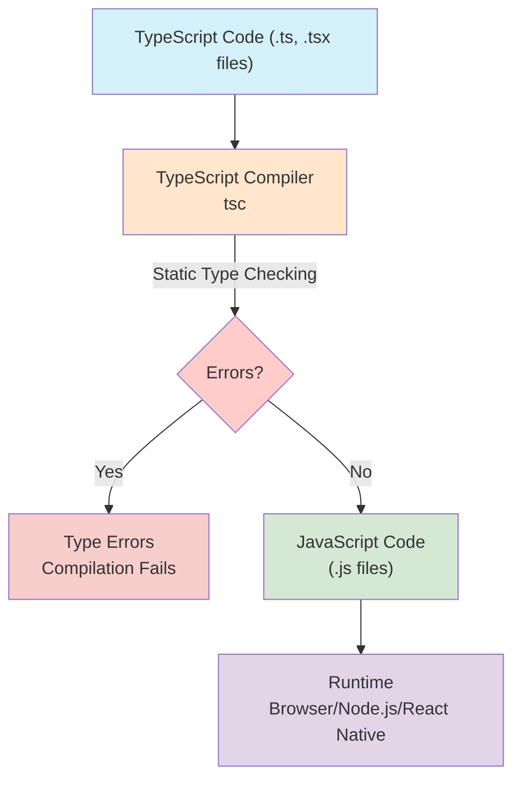

## Section 1: Why TypeScript?

In the fast-paced world of software development, especially in a dynamic ecosystem like React Native, maintaining code quality, managing complexity, and ensuring team productivity are paramount. JavaScript, while incredibly versatile, is a dynamically-typed language. This means type errors are often only discovered at runtime, potentially leading to bugs in production and a more challenging debugging process.

TypeScript, an open-source language developed and maintained by Microsoft, addresses these challenges by adding an optional layer of static typing on top of JavaScript. It's not a completely new language; rather, it's a superset of JavaScript, meaning any valid JavaScript code is also valid TypeScript code. TypeScript code is then **transpiled** by the TypeScript compiler (`tsc`) into standard JavaScript, which can run in any environment that supports JavaScript—browsers, Node.js, and, crucially for this course, within React Native applications powered by Expo. This transpilation process includes **static analysis**, where the compiler meticulously analyzes your source code and type annotations to identify potential errors and ensure type consistency _before_ the code is executed, enhancing code quality and understandability, particularly at scale.



The diagram above provides a clear visual representation of the TypeScript compilation workflow. It begins with your TypeScript source code, contained in `.ts` or `.tsx` files (Node A). This code is then fed into the TypeScript Compiler, commonly invoked as `tsc` (Node B). A critical step performed by the compiler is Static Type Checking (Edge B to C), where it analyzes your code against the type definitions you've provided. If the compiler detects any type inconsistencies or errors (Path C to D), such as passing a string where a number is expected, the compilation process halts, and Type Errors are reported to the developer. This immediate feedback is a core benefit. If, however, the code passes all type checks (Path C to E), the compiler proceeds to transpile your TypeScript code into standard, executable JavaScript code, typically in `.js` files. This generated JavaScript (Node E) is what actually runs in the target environment, be it a web browser, a Node.js server, or a React Native application (Node F). The original TypeScript type information is generally erased during this transpilation, meaning the runtime JavaScript does not carry those types, but their benefit has already been realized during the compile-time checks.

The core philosophy of TypeScript is to enable developers to write JavaScript along with these type definitions, significantly enhancing code quality, understandability, and scalability, particularly in larger projects. By catching errors during development rather than at runtime, TypeScript helps shift error discovery to an earlier, less costly phase of the software lifecycle.

> 🍏 **(Native iOS Developers - Swift):**
>
> **Comparison:** Swift\'s robust static type system, where you explicitly define types for constants (`let name: String`), variables (`var count: Int`), function parameters, and return values, is very similar to TypeScript\'s approach. Both languages emphasize type safety at compile time to catch errors early.
>
> **Key Differences & Takeaways:**
> You\'ll appreciate TypeScript\'s familiar compile-time checks and improved code clarity. Key distinctions to focus on include:
>
> - **Structural vs. Nominal Typing:** This is a fundamental shift. Swift uses _nominal_ typing (types match based on declared names and inheritance). TypeScript, in contrast, uses _structural_ typing, meaning an object is considered compatible with an interface if it has the same _shape_ (required properties and methods), regardless of whether it explicitly declares that it implements the interface.
> - **Type Erasure:** TypeScript\'s type annotations are primarily for development-time checking and are _erased_ when transpiled to JavaScript, which remains dynamically typed at its core. Swift often retains and enforces type information at runtime.
> - **Null Handling:** While not covered in detail in this introductory section, be aware that TypeScript\'s `strictNullChecks` feature (enabled by default in modern setups) provides a mechanism similar to Swift\'s optionals (`?`) for managing `null` and `undefined` values, promoting safer code.
>
> Understanding these differences, especially structural typing, is crucial for effectively using TypeScript.
>
> **Source:** [Swift Language Guide - Types](https://docs.swift.org/swift-book/documentation/the-swift-programming-language/types/)

> 🤖 **(Native Android Developers - Kotlin/Java):**
>
> **Comparison:** Kotlin's strong type inference (e.g., `val name = "Speedy"`) and null safety (e.g., `String?`) provide benefits similar to what TypeScript offers JavaScript. Java's static typing is also conceptually aligned. Like these languages, TypeScript aims for early error detection.
>
> **Key Differences & Takeaways:**
> The advantages of static type checking will be immediately apparent. Concentrate on TypeScript-specific features like union types, intersection types, and utility types. Key differences to be mindful of include:
>
> - **Structural vs. Nominal Typing:** TypeScript uses a _structural_ type system (compatibility based on shape), which differs from the _nominal_ typing found in Java and Kotlin (compatibility based on declared names and inheritance).
> - **Type Erasure:** Similar to the Swift comparison, TypeScript's type information is erased during transpilation to JavaScript. This contrasts with Java/Kotlin where type information is generally available at runtime via reflection.
> - **Null Handling:** TypeScript's `strictNullChecks` (when enabled) offers robust null safety, akin to Kotlin's nullable types (`String?`) and Java's `Optional` class, by requiring explicit handling of potentially `null` or `undefined` values.
>
> Focus on how types are defined for JavaScript objects and functions, and how these differences, particularly structural typing, influence type compatibility.
>
> **Source:** [Kotlin Docs - Basic Types](https://kotlinlang.org/docs/basic-types.html)

> 🌐 **(Web Developers - From Python, Ruby, PHP etc.):**
>
> **Comparison:** If you're coming from dynamically-typed languages like Python (without type hints), Ruby, or PHP (older versions), TypeScript introduces the practice of explicitly defining types for variables, function parameters, and return values. While these languages often have runtime type checking or conventions, TypeScript enforces type consistency at compile-time. This might initially seem like additional overhead compared to the flexibility of dynamic typing.
>
> **Key Takeaway:** TypeScript helps catch common errors before runtime, which is particularly beneficial in larger applications. Focus on how type annotations improve code clarity and how the TypeScript compiler assists in refactoring and understanding existing JavaScript codebases. The gradual adoption feature can make transitioning easier.
>
> **Source:** [TypeScript for Programmers of Other Languages](https://www.typescriptlang.org/docs/handbook/typescript-in-5-minutes-oop.html)

> ⚛️ **(Web Developers - React/Angular with JavaScript):**
>
> **Comparison:** If you have been building React or Angular applications using plain JavaScript, TypeScript introduces a static type layer on top of the JavaScript you already know. Instead of discovering type-related bugs at runtime (e.g., passing incorrect props to a React component, or a service method returning an unexpected data structure), TypeScript allows you to catch these issues during the development phase, directly in your editor.
>
> **Key Takeaway:** TypeScript will feel like a direct enhancement to your existing JavaScript workflow, improving autocompletion, refactoring capabilities, and especially the safety of your component interfaces (props and state) or service contracts. Understanding how to define types for these structures is key.
>
> **Source:** [MDN - JavaScript data types and data structures](https://developer.mozilla.org/en-US/docs/Web/JavaScript/Data_structures)

> 🅰️ **(Web Developers - Angular):**
>
> **Comparison:** You are already familiar with TypeScript as it is the standard language for Angular development. Core TypeScript concepts like types, interfaces, classes, and generics will be directly transferable.
>
> **Key Takeaway & Differences:** Your learning curve will primarily involve understanding how TypeScript is applied within the React Native and Expo ecosystem, which differs from Angular\'s specific patterns. Focus on:
>
> - Typing functional components, props, and state (e.g., using `useState`, `useReducer` hooks) rather than class-based components with decorators like `@Component` and `@Input()`.
> - JSX for templating instead of Angular\'s HTML-based templates with directives like `*ngFor` or `*ngIf`.
> - React Native\'s approach to styling (e.g., `StyleSheet` API, Styled Components) compared to Angular\'s component-scoped CSS or global styles.
> - Different state management libraries and patterns (e.g., Zustand, React Context, TanStack Query) compared to services and RxJS for state in Angular.
>   While the underlying TypeScript language is the same, its application and the surrounding library ecosystem in React Native will be the new learning area.
>
> **Source:** [Angular - Introduction to TypeScript](https://angular.io/guide/typescript-configuration)

> 🛣️ **(All Learners):** This module establishes a critical foundation for working with TypeScript in React Native. Take time to understand the core concepts and practice with the examples. For the remainder of the course, all code will use TypeScript.

> 🧑‍🏫 **(Instructor-Led):** Consider having students share experiences with typed vs. untyped languages before diving into TypeScript concepts. This helps establish a baseline understanding of the class's prior knowledge.

> 🧗‍♀️ **(Self-Led):** Pay special attention to the TypeScript compilation process and how type errors are reported. Try intentionally creating type errors in the exercises to see how TypeScript provides feedback - this will help you understand the error messages you'll encounter in real development.

> 🔁 **(Asynchronous Learners):** The concepts in this section are foundational. If you're new to typed languages, take your time to absorb the "why" behind TypeScript, as it will make the "how" in subsequent sections much clearer. Revisit the benefits as you progress through the module.

### Conceptual Content: The Value Proposition of TypeScript

TypeScript's primary contribution is its type system, which allows developers to define types for variables, function parameters, return values, and object structures. This system is then checked by the TypeScript compiler (or transpiler) during development, shifting error discovery from the execution phase to the development phase. This proactive approach allows developers to address issues more efficiently, leading to more stable and reliable software.

While adopting TypeScript involves a learning curve for its type system and an additional compilation step, these are generally considered worthwhile investments for the substantial long-term benefits gained. Some developers initially perceive static typing as adding verbosity or reducing flexibility compared to pure JavaScript. However, TypeScript mitigates this through features like type inference (which we'll explore soon), and the long-term gains in productivity and code quality often outweigh these initial perceptions.

**Key Benefits of Using TypeScript:**

- **Early Error Detection (Type Safety):** This is arguably the most significant benefit. TypeScript's compiler analyzes your code and flags type mismatches **before you even run your application**. For example, if a function expects a number but receives a string, TypeScript will alert you. This catches a whole class of errors that might otherwise slip into testing or production, leading to more robust and reliable software. Type safety ensures that operations are performed on compatible data types, preventing many common programming errors.

  - _SpeedyMeds Context:_ Imagine passing a patient's age as a string (`"65"`) to a function that expects a number for dosage calculation. TypeScript would catch this discrepancy during development, preventing a potential runtime error and incorrect calculation.

- **Improved Code Readability and Maintainability:** Explicit types make code easier to understand. When you see a function signature or an object definition with types, you immediately grasp the kind of data being handled. This is incredibly helpful for long-term maintenance, especially when working in teams or revisiting old code.

  - _SpeedyMeds Context:_ A `Medication` type clearly defining properties like `name: string`, `dosage: number`, `unit: string`, and `requiresPrescription: boolean` makes it much easier for any developer on the SpeedyMeds team to understand and correctly use medication data.

- **Enhanced Developer Tooling and IDE Experience:** TypeScript powers a richer development experience. IDEs like Visual Studio Code can leverage TypeScript's information to provide intelligent autocompletion, code navigation, and refactoring capabilities. This significantly speeds up development and reduces the cognitive load on developers.

  - When you type `medication.` in your IDE, TypeScript can suggest properties like `name` or `dosage` because it knows the `Medication` type.

- **Increased Productivity:** While there's an initial effort in adding types and learning the system, the combination of early error detection, improved tooling, and enhanced code clarity often leads to increased overall productivity, especially in team environments. Less time spent debugging runtime errors means more time focused on building features.

- **Better Collaboration:** In team environments, TypeScript serves as a contract. Type definitions ensure that different parts of an application, potentially developed by different team members, can integrate more smoothly. It reduces misunderstandings about data structures and function signatures.

- **Scalability:** As projects grow, managing a large JavaScript codebase can become challenging. TypeScript's structure and type safety help in building more scalable and robust applications. Refactoring becomes safer and more predictable.

- **Gradual Adoption:** You don't have to convert an entire JavaScript project to TypeScript overnight. TypeScript can be adopted incrementally, file by file. You can even configure it to allow JavaScript files, making the transition smoother for existing projects.

**TypeScript in the React Native Ecosystem:**

React Native and Expo have excellent support for TypeScript. Many popular React Native libraries are written in or provide TypeScript definitions. Using TypeScript in React Native allows you to type your components' props and state, leading to more predictable and error-free UIs.

For instance, defining props for a `PatientBanner` component:

```typescript
interface PatientBannerProps {
  patientName: string;
  age: number;
  hasAllergies?: boolean; // Optional prop
}

// In your component:
// const PatientBanner: React.FC<PatientBannerProps> = (props) => { ... };
```

This ensures that whenever you use `PatientBanner`, TypeScript will check if you're providing the correct props, improving the reliability of your UI components.

> 📚 **Official Documentation:**
>
> - [TypeScript for JavaScript Programmers](https://www.typescriptlang.org/docs/handbook/typescript-in-5-minutes.html)
> - [React Documentation - TypeScript](https://react.dev/learn/typescript)
> - [Expo Documentation: Using TypeScript](https://docs.expo.dev/guides/typescript/)

While TypeScript introduces a compilation step and a learning curve for its type system, the long-term benefits in terms of code quality, error reduction, and maintainability make it a highly recommended choice for professional React Native development. This module will equip you with the foundational knowledge to harness these benefits.
