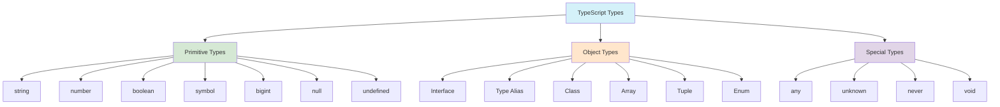

## Section 2: Basic Types

TypeScript extends JavaScript by adding types. Understanding these basic types is the first step towards leveraging TypeScript's power. These types allow you to declare the expected data shape for your variables, function parameters, and object properties, enabling the TypeScript compiler to catch errors early.



The diagram above visualizes the main categories of TypeScript types that you'll learn about in this course. TypeScript types can be broadly organized into three categories:

1. **Primitive Types**: The basic building blocks like `string`, `number`, and `boolean` that represent simple values.
2. **Object Types**: More complex types that define structures like objects, arrays, and classes.
3. **Special Types**: Utility types that serve specific purposes in the type system, such as `any`, `unknown`, and `never`.

Let's explore the most commonly used basic types in TypeScript. Many of these will feel familiar if you have experience with JavaScript, but TypeScript provides explicit ways to work with them.

> [!NOTE]
> It is a common convention and best practice in TypeScript to use lowercase type names for primitives (e.g., `string`, `number`, `boolean`) instead of their capitalized counterparts (`String`, `Number`, `Boolean`). The capitalized versions refer to special built-in JavaScript wrapper objects that behave differently and are rarely used directly in type annotations.

**1. `string`**

Represents textual data, enclosed in single quotes (`'`), double quotes (`"`), or backticks (`` ` `` for template literals).

- **SpeedyMeds Example:**

```typescript
let patientName: string = "John Doe";
let medicationName: string = "Amoxicillin";
let dosageInstructions: string = `${medicationName} 250mg - Take one tablet twice a day.`;

console.log(patientName);
console.log(dosageInstructions);
```

**2. `number`**

Represents all numeric values, including integers and floating-point numbers. TypeScript does not differentiate between `int`, `float`, `double`, etc., as some other languages do.

- **SpeedyMeds Example:**

```typescript
let patientAge: number = 45;
let medicationDosageMg: number = 250.5;
let pillsPerPack: number = 30;

console.log(`Patient Age: ${patientAge}`);
console.log(`Dosage: ${medicationDosageMg}mg`);
```

**3. `boolean`**

Represents a logical value, either `true` or `false`.

- **SpeedyMeds Example:**

```typescript
let requiresPrescription: boolean = true;
let isRefillAvailable: boolean = false;

if (requiresPrescription) {
  console.log("A prescription is required for this medication.");
}
```

**4. `array`**

Represents an ordered list of values. You can define array types in two ways:

- `typeName[]`: (e.g., `string[]` for an array of strings)
- `Array<typeName>`: (e.g., `Array<number>` for an array of numbers)

* **SpeedyMeds Example:**

```typescript
let allergies: string[] = ["Penicillin", "Sulfa"];
let vitalSignsBPM: Array<number> = [72, 75, 68];
// let prescriptionHistory: any[] = ["Lisinopril", 10, new Date(2023, 0, 15)]; // Example of using any, better to use tuples for fixed structure, see below.

console.log(`Patient Allergies: ${allergies.join(", ")}`);
console.log(`Recent Heart Rates: ${vitalSignsBPM}`);
```

**5. `object`**

Represents any non-primitive type (i.e., not `string`, `number`, `boolean`, `symbol`, `null`, or `undefined`). It's a general type; for more specific object shapes, you'll use interfaces or type aliases (covered in the next section).

It's important to distinguish the lowercase `object` type from:

- `Object` (uppercase 'O'): This refers to the JavaScript global `Object` type. Almost all values (including primitives, due to autoboxing) are assignable to `Object`. It is generally too broad and less useful for specific typing.
- `{}` (empty object type): This type represents an object with no properties. While many non-null, non-undefined values can be assigned to `{}`, it doesn't provide much type safety as it doesn't describe any specific structure.

While `object` is more specific than `any`, it still offers limited information about the value's properties and methods. Prefer interfaces or type aliases for defining specific object structures.

- **SpeedyMeds Example:**

```typescript
let patientProfile: object;

patientProfile = {
  name: "Jane Doe",
  age: 32,
  contact: {
    email: "jane.doe@example.com",
    phone: "555-0102",
  },
};

console.log(patientProfile);
// console.log(patientProfile.name); // TypeScript might warn here if 'object' type doesn't know about 'name'
// More specific types (interfaces/type aliases) are better for this.
```

While the generic `object` type is available, it's often more useful to describe the _shape_ of an object inline, especially for simple, one-off structures. You can do this by listing its properties and their types within curly braces `{}`. This provides better type safety and autocompletion than the generic `object` type.

- **SpeedyMeds Example (Inline Object Shape):**

```typescript
let medicationRecord: {
  name: string;
  form: "Tablet" | "Capsule" | "Liquid"; // Using string literal types for known forms
  strength: number;
  unit: string; // e.g., "mg", "ml"
  isGeneric?: boolean; // Optional property
};

medicationRecord = {
  name: "Lisinopril",
  form: "Tablet",
  strength: 10,
  unit: "mg",
  isGeneric: true,
};

// medicationRecord = { name: "Aspirin", strength: "100mg" }; // Error: Type 'string' is not assignable to type 'number' for strength.

console.log(
  `Medication: ${medicationRecord.name}, Form: ${medicationRecord.form}`
);
if (medicationRecord.isGeneric) {
  console.log("This is a generic medication.");
}
```

This approach is a stepping stone to using `interface` and `type` aliases, which are covered in detail in the next section and are generally preferred for reusable object shapes.

**6. `any`**

Represents a dynamic type. Using `any` essentially opts out of type checking for that particular variable. It can be useful during migration from JavaScript or when working with truly dynamic data, but it should be used sparingly as it sacrifices type safety. Overuse of `any` can lead to runtime errors that TypeScript would otherwise have caught.

- **SpeedyMeds Example:**

```typescript
let medicationDetails: any = "Ibuprofen 200mg";
console.log(medicationDetails.toUpperCase()); // Works, as string has toUpperCase

medicationDetails = { name: "Paracetamol", strength: 500 };
// console.log(medicationDetails.toUpperCase()); // This would cause a runtime error if medicationDetails is now an object.
// TypeScript won't catch this if type is 'any'.

let someValue: any;
someValue = 10;
someValue = "Hello";
someValue = true;
```

> [!CAUTION]
> While `any` provides flexibility, it undermines the core benefit of TypeScript – type safety. Strive to use more specific types whenever possible. Consider `unknown` as a safer alternative if the type is truly unknown.
>
> **Best Practices for `any` and `unknown`:**
>
> - **Avoid `any` where possible:** Reserve `any` for situations where type checking is genuinely impossible or during incremental migration of JavaScript codebases. Ensure the `noImplicitAny` compiler option is enabled to prevent variables from defaulting to `any`.
> - **Prefer `unknown` for uncertain types:** When a value's type is truly unknown (e.g., API responses, user input), use `unknown`. `unknown` is safer because it forces you to acknowledge and address the ambiguity of a variable's type before performing operations.
> - **Narrow `unknown` types:** Always use type guards (like `typeof`, `instanceof`, `in` operator, or user-defined type guards) or type assertions to narrow an `unknown` type to a more specific type before performing operations on it. This explicit checking is what makes `unknown` a much safer choice than `any`.

**7. `unknown`**

A type-safe counterpart to `any`. When a value is of type `unknown`, you cannot perform most operations on it without first performing some form of type checking (like using a type guard or type assertion) to narrow down its type. This forces you to explicitly handle the uncertainty of the type before using it, preventing accidental unsafe operations.

- **SpeedyMeds Example:**

```typescript
let externalDrugInfo: unknown;

externalDrugInfo = "Retrieved from external API as a string";
// externalDrugInfo = { name: "DrugX", interactions: ["DrugY"] }; // Could also be an object

// console.log(externalDrugInfo.toUpperCase()); // Error: Object is of type 'unknown'.

if (typeof externalDrugInfo === "string") {
  console.log(externalDrugInfo.toUpperCase()); // OK, type is narrowed to string
} else if (
  typeof externalDrugInfo === "object" &&
  externalDrugInfo !== null &&
  "name" in externalDrugInfo
) {
  // Assuming 'name' would be a string if it exists.
  const drugObject = externalDrugInfo as {
    name: string;
    interactions?: string[];
  };
  console.log(`Drug Name: ${drugObject.name}`); // OK, type narrowed via assertion after checks
} else {
  console.log("External drug info is of an unexpected type.");
}
```

**8. `void`**

Represents the absence of a return value, typically used as the return type for functions that do not return a value. While a JavaScript function without an explicit `return` statement implicitly returns `undefined`, `void` as a type annotation in TypeScript emphasizes that the function's return value, if any, is not intended to be used by the caller.

- **SpeedyMeds Example:**

```typescript
function logPrescription(medication: string, dosage: number): void {
  console.log(`Prescription logged: ${medication}, ${dosage}mg`);
  // No return statement, or could explicitly return undefined.
  // return undefined; // This is permissible
}

let result = logPrescription("Metformin", 500); // result is of type void (effectively undefined)
// console.log(result.something); // Error: Property 'something' does not exist on type 'void'.
```

**9. `null` and `undefined`**

In TypeScript, both `null` and `undefined` have their own types, named `null` and `undefined` respectively.
By default (without `strictNullChecks` enabled), `null` and `undefined` are subtypes of all other types. However, with the **`strictNullChecks` compiler option enabled (highly recommended and default in many setups like Expo's `tsconfig.base`)**:

- `null` and `undefined` can only be assigned to `any`, `unknown`, or their respective types.
- `undefined` can also be assigned to `void`.
- To allow a variable to hold a specific type OR `null` / `undefined`, you MUST use **union types** (e.g., `string | null`, `number | undefined`). A union type, denoted by the `|` (pipe) symbol, means the variable can hold a value of any one of the types listed in the union. This forces you to explicitly account for potential `null` or `undefined` values, significantly reducing common runtime errors like "Cannot read property 'x' of undefined."

- **SpeedyMeds Example (with `strictNullChecks` in mind):**

```typescript
let patientMiddleName: string | null = null; // Can be a string or null
let nextAppointmentDate: Date | undefined;

patientMiddleName = "Robert";
// patientMiddleName = undefined; // Error if type is string | null (unless also | undefined)

if (nextAppointmentDate) {
  console.log(`Next appointment: ${nextAppointmentDate.toLocaleDateString()}`);
} else {
  console.log("No upcoming appointment scheduled.");
}
```

**10. Type Inference and Contextual Typing**

TypeScript is designed to provide robust type safety without requiring excessive verbosity. Two key mechanisms that help achieve this are **Type Inference** and **Contextual Typing**. These features allow the TypeScript compiler to determine types automatically in many common situations, reducing the need for explicit type annotations.

**a. Type Inference**

When you declare and initialize a variable without an explicit type annotation, TypeScript often **infers** its type based on the initial value.

- **SpeedyMeds Example:**

```typescript
let orderId = "ORD12345"; // Inferred type: string
let itemsInCart = 3; // Inferred type: number
let isPrescriptionFilled = false; // Inferred type: boolean
let medications = ["Lisinopril", "Metformin", "Simvastatin"]; // Inferred type: string[]

// itemsInCart = "three"; // Error: Type 'string' is not assignable to type 'number'.
```

If you declare a variable without an initial value, and `noImplicitAny` is off (not recommended), it might be inferred as `any`. With `noImplicitAny` on, you'll generally need to provide an initial value or an explicit type.

- **Best Common Type:**
  When TypeScript infers types from multiple expressions, such as the elements in an array, it attempts to find the "best common type" that fits all expressions. If a single encompassing type exists (e.g., all elements are numbers), that type is used. If not, TypeScript may infer a union type.

  ```typescript
  // All elements are numbers or null
  let glucoseReadings = [120, 122, null, 118, null]; // Inferred type: (number | null)[]

  // Elements are different primitive types
  let mixedDeliveryInfo = ["Express Shipping", 2, true]; // Inferred type: (string | number | boolean)[]
  ```

**b. Contextual Typing**

Type inference can also work "backwards." Contextual typing occurs when the type of an expression is inferred based on its **location** or the context in which it's used. This is common in scenarios like:

- **Callback Functions:** The types of parameters in a callback function are often inferred from the function signature it's being passed to.

  ```typescript
  type Medication = { id: number; name: string; dosage: string };
  const availableMedications: Medication[] = [
    { id: 1, name: "Loratadine", dosage: "10mg" },
    { id: 2, name: "Omeprazole", dosage: "20mg" },
  ];

  // TypeScript infers 'med' as type 'Medication' (and 'index' as number)
  // based on the 'forEach' signature for 'Medication[]'
  availableMedications.forEach((med, index) => {
    console.log(`${index + 1}. ${med.name.toUpperCase()} (${med.dosage})`); // Accessing 'name' and 'dosage' is safe
  });
  ```

- **Assignments:** When assigning a value (like an object literal or a function) to a variable or property with a known type, TypeScript uses that known type as context for type checking the assigned value.

  ```typescript
  interface PatientUpdater {
    (patientId: number, updates: Partial<Patient>): boolean; // Assuming Patient type exists
  }

  // The parameters 'id' and 'data' are contextually typed
  const updatePatientRecord: PatientUpdater = (id, data) => {
    console.log(`Updating patient ${id} with:`, data);
    // id is inferred as number, data as Partial<Patient>
    return true;
  };
  ```

- **Function Return Statements:** The expected return type of a function (if explicitly annotated) can provide context for the `return` statements within it, helping to catch incorrect return values.

Understanding when TypeScript can reliably infer types versus when explicit annotations are necessary is key to writing effective TypeScript. While inference is powerful for local variables and simple cases, explicit types are crucial for defining clear contracts at function boundaries (parameters, return types) and for complex data structures, ensuring both compiler safety and human readability.

**11. Type Assertions**

Type assertions are a way to tell the TypeScript compiler, "Trust me, I know the type of this value better than you do." They allow you to override the compiler's inferred type or treat a value as a more specific type when you have more information about the value than TypeScript does.

Crucially, type assertions **only affect compile-time type checking**; they have **no impact on the runtime behavior** of your JavaScript code. They do not perform any type conversion, validation, or restructuring of the data at runtime. If an assertion is incorrect, it might lead to runtime errors.

**a. Syntax**

TypeScript provides two syntaxes for type assertions:

1.  **`as` Syntax (Preferred):** This is the recommended and more common syntax, especially in React Native projects using JSX/TSX files, as it avoids ambiguity with JSX tags.

    ```typescript
    let someApiResponse: unknown = '{"patientId": 123, "name": "Jane Doe"}';
    // Assume we've parsed it and know it's a Patient object
    // type Patient = { patientId: number; name: string };
    // const patientData = JSON.parse(someApiResponse as string) as Patient;
    ```

2.  **Angle-Bracket Syntax:** This older syntax (`<Type>value`) works similarly but can cause parsing conflicts in `.tsx` files because the angle brackets can be misinterpreted as JSX elements. Therefore, it's generally avoided in React/React Native development.

    ```typescript
    // Avoid this syntax in .tsx files
    // const patientData = <Patient>JSON.parse(<string>someApiResponse);
    ```

**b. Common Use Cases**

While assertions should be used sparingly, they are sometimes necessary:

- **Working with `any` or `unknown`:** After receiving data typed as `any` or `unknown` (e.g., from a legacy API, `JSON.parse()`, or third-party libraries without precise types), if you have performed runtime checks or are certain of the type, you can assert it to a more specific type. This enables further type-safe operations and better autocompletion.

  ```typescript
  async function fetchPatientNotes(): Promise<unknown> {
    // Simulates fetching data that might be a string or null
    const response = Math.random() > 0.5 ? "Patient is stable." : null;
    return response;
  }

  async function displayNotes() {
    const notes = await fetchPatientNotes();
    if (notes) {
      // Basic check
      // We assert 'notes' is a string after checking it's not null/undefined
      const noteDetails = notes as string;
      console.log(`Notes: ${noteDetails.toUpperCase()}`);
    }
  }
  ```

- **Interfacing with DOM APIs (Conceptual for React Native):** In web development, assertions are common when `document.getElementById` returns a generic `HTMLElement`, and you know it's a more specific type like `HTMLInputElement`. While direct DOM manipulation is less common in React Native, similar scenarios can arise with certain bridge modules or less-typed libraries.

**c. Use with Caution!**

Type assertions are a powerful tool, but they effectively tell the compiler to trust your judgment over its own analysis. This can be dangerous if your judgment is flawed.

- **Potential for Runtime Errors:** If you assert a type incorrectly (e.g., asserting an object is a `string` when it's not), TypeScript won't complain at compile time, but your application will likely crash or behave unexpectedly at runtime when you attempt operations invalid for the actual type.
- **Prefer Type Guards:** Whenever possible, use type guards (like `typeof`, `instanceof`, `in` operator, or custom predicate functions that return `value is Type`) instead of assertions. Type guards perform runtime checks that prove the type to TypeScript, making your code safer and more robust.
- **Avoid Overuse:** Type assertions should not be a crutch for poorly designed types or a way to silence legitimate compiler errors. If you find yourself using assertions frequently, it might indicate an issue with your type definitions or logic.
- **"Double Assertions" (`value as unknown as TargetType`):** Sometimes, to assert between types that TypeScript deems completely unrelated, a double assertion (first to `unknown`, then to the target type) is required. This is an even stronger signal that you are doing something potentially unsafe and should be a last resort, thoroughly justified by your understanding of the runtime types.

Think of type assertions as an escape hatch for specific situations where you, the developer, have more information about the runtime type of a value than the compiler can statically determine. Always prioritize safer alternatives like type guards when they are applicable.

> 🛣️ **(All Learners):** The next few types (`never`, `tuple`, `bigint`, `symbol`) are more advanced and less frequently used in day-to-day React Native development. However, understanding them will give you a complete picture of TypeScript's type system and help you recognize them when you encounter them in library definitions or advanced patterns.

> 🧑‍🏫 **(Instructor-Led):** Consider conducting a quick quiz on the basic types covered so far before moving to these more advanced types. Ask students to provide examples of when they might use `null` vs. `undefined`, or how `unknown` differs from `any`.

> 🧗‍♀️ **(Self-Led):** As you study these advanced types, try to come up with your own SpeedyMeds-related examples to reinforce your understanding. Creating your own examples is an effective way to internalize new concepts.

**12. `never`**

The `never` type represents the type of values that never occur. It indicates that a function will not reach its normal completion point.
Common use cases for `never` include:

- Functions that always throw an error.
- Functions that have infinite loops.
- **Exhaustive type checking:** In conditional logic (e.g., a `switch` statement covering all cases of a union type), the `default` case might assert a variable to be of type `never`. If a new member is added to the union without updating the `switch`, the `default` case would no longer be `never`, signaling a compile-time error. This ensures all valid paths are handled.

- **SpeedyMeds Example:**

```typescript
function criticalErrorHandler(message: string): never {
  throw new Error(`Critical System Error in SpeedyMeds: ${message}`);
}

function infiniteProcessingLoop(): never {
  while (true) {
    // Process background tasks...
  }
}

// Example of exhaustive check with 'never'
type ReportStatus = "Pending" | "Complete" | "Failed";

function handleReportStatus(status: ReportStatus): string {
  switch (status) {
    case "Pending":
      return "Report is pending generation.";
    case "Complete":
      return "Report successfully generated.";
    case "Failed":
      return "Report generation failed.";
    default:
      // If a new status is added to ReportStatus (e.g., "Archived")
      // and this switch is not updated, 'status' here would no longer be 'never'.
      // The TypeScript compiler would then flag an error on the next line,
      // because a value of the new status type cannot be assigned to 'never'.
      const _exhaustiveCheck: never = status;
      return `Unknown status: ${_exhaustiveCheck}`; // This line theoretically unreachable
  }
}

console.log(handleReportStatus("Complete"));
// criticalErrorHandler("Example critical error"); // Uncomment to test
```

> 🍏 **(iOS Developers - Swift):**
>
> **Comparison:** Swift's `Never` type serves a similar purpose to TypeScript's `never` type. In Swift, a function with return type `Never` indicates it will never return to its caller normally (e.g., it will throw an error, cause a fatal error, or enter an infinite loop). This is used in Swift for functions like `fatalError()` or `exit()`, or in control flow to indicate exhaustive pattern matching.
>
> **Key Takeaway:** Both TypeScript's `never` and Swift's `Never` enforce exhaustiveness checking in control flow. The main difference is that TypeScript erases types at compile time, while Swift's type system maintains runtime significance.
>
> **Source:** [Swift - Never Type Documentation](https://developer.apple.com/documentation/swift/never)

> 🤖 **(Android Developers - Kotlin):**
>
> **Comparison:** Kotlin's `Nothing` type is conceptually equivalent to TypeScript's `never`. A function returning `Nothing` will never return normally (it will throw an exception or run indefinitely). This is used for functions like `throw`, `error()`, or infinite loops in Kotlin.
>
> **Key Takeaway:** TypeScript's `never` serves the same purpose as Kotlin's `Nothing` - both indicate a function won't complete normally and help with exhaustiveness checking. However, as with Swift, Kotlin's type system has runtime presence while TypeScript's is erased during compilation.
>
> **Source:** [Kotlin - Nothing Type](https://kotlinlang.org/api/latest/jvm/stdlib/kotlin/-nothing.html)

**13. `tuple`**

Represents an array with a fixed number of elements whose types are known, but need not be the same. This provides more structure than a general array of mixed types.

- **SpeedyMeds Example:**

```typescript
// A patient's vital sign reading: [measurementName: string, value: number, unit: string]
let bloodPressureReading: [string, number, string];
bloodPressureReading = ["Systolic", 120, "mmHg"];

// Accessing tuple elements
console.log(
  `Measurement: ${bloodPressureReading[0]}, Value: ${bloodPressureReading[1]} ${bloodPressureReading[2]}`
);

// bloodPressureReading = [120, "Systolic", "mmHg"]; // Error: Type 'number' is not assignable to type 'string'.
// bloodPressureReading = ["Diastolic", 90]; // Error: Tuple type '[string, number, string]' of length '3' has no element at index '2'.

// Using a tuple for prescription history item
type PrescriptionEntry = [
  medicationName: string,
  dosageMg: number,
  datePrescribed: Date,
  refillsRemaining: number
];
let prescriptionHistoryEntry: PrescriptionEntry = [
  "Lisinopril",
  10,
  new Date(2023, 0, 15),
  2,
];

console.log(
  `Prescribed ${prescriptionHistoryEntry[0]} (${
    prescriptionHistoryEntry[1]
  }mg) on ${prescriptionHistoryEntry[2].toLocaleDateString()}, ${
    prescriptionHistoryEntry[3]
  } refills left.`
);
```

> 🌐 **(Web Developers - Python):**
>
> **Comparison:** TypeScript's tuples are similar to Python's tuples in that they are fixed-length collections with specific types at specific positions. However, there are key differences: Python tuples are immutable (cannot be modified after creation), while TypeScript tuples can be modified. In Python, tuples are primarily differentiated from lists by immutability, whereas in TypeScript, they're differentiated by their fixed structure and typed positions.
>
> **Key Takeaway:** TypeScript's tuples provide similar structural benefits to Python's tuples – enforcing a specific "shape" of data – but without the immutability constraint. In TypeScript, use tuples when you need a fixed, ordered structure where each position has a specific meaning and type.
>
> **Example:**
>
> ```python
> # Python tuple
> point = (10, 20)  # Tuple of two integers
> name_and_age = ("John", 30)  # Tuple with mixed types
> ```
>
> **Source:** [Python Tuples](https://docs.python.org/3/tutorial/datastructures.html#tuples-and-sequences)

**14. `bigint`**

Represents whole numbers larger than 2<sup>53</sup> - 1. `bigint` literals are created by appending `n` to the end of an integer.

- **SpeedyMeds Example:** (While less common in typical UI scenarios, imagine a scenario with very large batch IDs or unique identifiers from a legacy system)

```typescript
let veryLargeBatchId: bigint = 900719925474099100n;
let anotherLargeId: bigint = BigInt("900719925474099101"); // Can also be created from a string

console.log(`Batch ID: ${veryLargeBatchId}`);
// let result = veryLargeBatchId + 10; // Error: Operator '+' cannot be applied to types 'bigint' and 'number'.
// Must use BigInt for operations:
let incrementedId = veryLargeBatchId + 10n;
console.log(`Incremented ID: ${incrementedId}`);
```

> [!IMPORTANT] > `bigint` and `number` are not interchangeable. You cannot mix them in arithmetic operations without explicit conversion. `bigint` also behaves differently with `Math` object methods.

**15. `symbol`**

Represents a primitive data type that is always unique and immutable. Symbols are often used to add unique property keys to an object to avoid name collisions, especially when dealing with object extension or metadata. They are created using the global `Symbol()` function.

- **SpeedyMeds Example:** (Useful for unique identifiers or internal properties)

```typescript
const uniquePatientIdSymbol = Symbol("uniquePatientId");
const internalNotesSymbol = Symbol("internalNotes");

interface PatientRecord {
  name: string;
  [uniquePatientIdSymbol]: string; // Using a symbol as a property key
  [internalNotesSymbol]?: string;
}

let patient1: PatientRecord = {
  name: "Alice Johnson",
  [uniquePatientIdSymbol]: "SYMBOL_P001",
};

patient1[internalNotesSymbol] = "Patient is allergic to penicillin.";

console.log(patient1.name);
console.log(patient1[uniquePatientIdSymbol]); // Access using the symbol

// Symbols are not enumerated in for...in loops or Object.keys()
for (const key in patient1) {
  console.log(`Key in loop: ${key}`); // Will log 'name' but not the symbols
}
console.log(Object.getOwnPropertySymbols(patient1)); // [Symbol(uniquePatientId), Symbol(internalNotes)]
```

Symbol keys are a good way to define "private" or metadata properties on objects that won't accidentally clash with string-based keys.

### TypeScript Basic Types vs. JavaScript Equivalents

The following table summarizes TypeScript's basic types and their relationship to JavaScript's primitives and concepts.

| TypeScript Type               | JavaScript Equivalent/Concept                                   | Notes                                                                                            |
| ----------------------------- | --------------------------------------------------------------- | ------------------------------------------------------------------------------------------------ |
| `boolean`                     | `boolean` primitive                                             | `true` or `false`.                                                                               |
| `number`                      | `number` primitive (includes integers and floats)               | All numbers are floating-point in JS.                                                            |
| `string`                      | `string` primitive                                              | Textual data.                                                                                    |
| `bigint`                      | `bigint` primitive                                              | For arbitrarily large integers. Ends with `n`.                                                   |
| `symbol`                      | `symbol` primitive                                              | For unique identifiers (less common in basic examples).                                          |
| `null`                        | `null` primitive                                                | Represents intentional absence of value. Treated as a distinct type with `strictNullChecks`.     |
| `undefined`                   | `undefined` primitive                                           | Represents uninitialized variables or missing properties. Distinct type with `strictNullChecks`. |
| `Type[]` or `Array<Type>`     | `Array` object                                                  | Ordered list of values of type `Type`.                                                           |
| `[Type1, Type2, ...]` (Tuple) | `Array` object (conventionally)                                 | Fixed-size, ordered list with potentially different types at each position. TS specific.         |
| `enum`                        | Typically objects or constants in JS                            | Set of named constants. TS specific feature (covered in detail later).                           |
| `any`                         | Any JavaScript value (type checking disabled)                   | Use sparingly; opts out of type safety.                                                          |
| `unknown`                     | Any JavaScript value (type checking enforced)                   | Safer alternative to `any`. Requires narrowing before use. TS specific.                          |
| `void`                        | `undefined` (for function returns not returning value)          | Indicates no meaningful return value.                                                            |
| `never`                       | No direct equivalent (conceptually, a non-terminating path)     | Represents values that never occur. TS specific.                                                 |
| `object`                      | Any non-primitive value (`typeof x === 'object'` or 'function') | More specific than `any`, but less specific than an interface or `Record<string, unknown>`.      |

### 16. Literal Types

Beyond enums, TypeScript allows you to define types that represent a specific, exact value. These are known as **literal types**. They are most powerful when combined with union types (`|`) to create a set of allowed literal values for a variable or property.

Literal types can be strings, numbers, or booleans.

- **String Literal Types:**
  You can restrict a variable to a specific set of predefined strings. This is often a more lightweight and JavaScript-idiomatic alternative to string enums for simple cases, as it doesn't introduce a runtime object.

  - **SpeedyMeds Example: `DosageInstructionTiming`**

    ```typescript
    /** Type representing allowed instruction timings for medication. */
    type DosageInstructionTiming =
      | "Before Meal"
      | "After Meal"
      | "With Meal"
      | "Bedtime";

    let instructionTiming: DosageInstructionTiming = "With Meal";
    // instructionTiming = "Morning"; // Error: Type '"Morning"' is not assignable to type 'DosageInstructionTiming'.

    function getMedicationReminder(timing: DosageInstructionTiming): string {
      return `Remember to take your medication: ${timing}.`;
    }
    console.log(getMedicationReminder("Bedtime"));
    ```

- **Numeric Literal Types:**
  Similarly, you can restrict a variable to specific numbers.

  - **SpeedyMeds Example: `RefillPackSize`**

    ```typescript
    /** Type representing allowed pack sizes for a promotional refill. */
    type RefillPackSize = 30 | 60 | 90;

    let selectedPackSize: RefillPackSize = 90;
    // selectedPackSize = 120; // Error: Type '120' is not assignable to type 'RefillPackSize'.

    console.log(`Selected promotional pack size: ${selectedPackSize} days.`);
    ```

- **Boolean Literal Types:**
  You can restrict a variable to specifically `true` or `false`. This is less common on its own but becomes very powerful in patterns like discriminated unions (which build upon literal types for the discriminant property).

  - **SpeedyMeds Example: API Response Structure**

    ```typescript
    // (This pattern was also seen in Section 3 with Discriminating Unions)
    type SuccessfulRefillResponse = {
      success: true; // Boolean literal type as discriminant
      prescriptionId: string;
      refillsRemaining: number;
      nextAvailableDate: Date;
    };

    type FailedRefillResponse = {
      success: false; // Boolean literal type as discriminant
      prescriptionId: string;
      errorCode: string;
      errorMessage: string;
    };

    type RefillApiResponse = SuccessfulRefillResponse | FailedRefillResponse;

    function handleRefillResponse(response: RefillApiResponse) {
      if (response.success) {
        // TypeScript knows response is SuccessfulRefillResponse here
        console.log(
          `Refill for ${response.prescriptionId} successful. ${response.refillsRemaining} refills left.`
        );
      } else {
        // TypeScript knows response is FailedRefillResponse here
        console.error(
          `Refill for ${response.prescriptionId} failed (${response.errorCode}): ${response.errorMessage}`
        );
      }
    }
    ```

- **Literal Narrowing:**
  When you declare a variable using `const` and initialize it with a literal value, TypeScript infers the most specific literal type possible because the value cannot change. If you use `let`, it generally infers the broader primitive type (`string`, `number`, etc.), unless context suggests a literal type.

  ```typescript
  const defaultOrderStatus = "Pending"; // Type inferred as literal "Pending"
  let currentOrderStatus = "Pending"; // Type inferred as string

  // To make 'currentOrderStatus' also a literal type, you can explicitly annotate:
  let specificOrderStatus: "Pending" | "Shipped" = "Pending";
  ```

Literal types, especially when combined into unions, offer a flexible and type-safe way to handle fixed sets of known values, often providing a more direct and less verbose alternative to enums in many scenarios, particularly when a runtime enum object isn't necessary.

> 🛣️ **(All Learners):** The concept of structural typing is central to how TypeScript works and is quite different from class-based typing in many other languages. Take your time to understand this section as it impacts how you will structure your types throughout your React Native projects.

> 🧑‍🏫 **(Instructor-Led):** This is an excellent opportunity for a group exercise. Ask students to create object literals and interfaces, then discuss which would be compatible with each other based on structural typing rules.

> 🧗‍♀️ **(Self-Led):** Try creating several different object shapes and interfaces, then test your understanding by predicting which assignments TypeScript would allow or reject based on structural compatibility.

### 17. Understanding Structural Typing (Duck Typing)

Type compatibility in TypeScript is based on **structural subtyping**, often referred to as "duck typing" at compile time. This means that types are related based on their members (properties and methods), not on explicit declarations or names. If an object `x` possesses at least the same members (with compatible types) as an object `y` requires, then `x` is considered compatible with `y` and can be assigned to `y`.

**Core Principle:** If it walks like a duck and quacks like a duck, TypeScript considers it a duck (for type-checking purposes).

- **Example:**

```typescript
interface Patient {
  patientId: string;
  name: string;
}

function logPatientName(patient: Patient): void {
  console.log(`Patient Name: ${patient.name}`);
}

let newPatient = { patientId: "P1001", name: "Alice Wonderland", age: 30 };
logPatientName(newPatient); // OK! newPatient has patientId and name properties with correct types.
// The extra 'age' property does not prevent compatibility here.

let minimalPatient = { name: "Bob The Builder", patientId: "P1002" };
logPatientName(minimalPatient); // OK!

// let notAPatient = { firstName: "Charlie Brown" };
// logPatientName(notAPatient); // Error: Property 'patientId' is missing and 'name' type might mismatch if not string.
```

**Implications:**

- **Flexibility:** Allows for more decoupled code because components interact based on the structure of data they expect, not on specific, named types from a particular hierarchy.
- **Easier Integration with JavaScript:** TypeScript can easily type existing JavaScript objects and libraries based on their shapes.

> 🤖 **(Native Android/iOS Developers - Java/Kotlin/Swift):** This is a key difference from **nominal typing** systems used in languages like Java, Kotlin, and Swift. In nominal systems, type compatibility is determined by explicit declarations (e.g., class `Dog` explicitly `implements` `AnimalInterface` or extends `AnimalBase`). In TypeScript, if an object has the same _structure_ as an interface, it's compatible, even without an explicit `implements` clause (though classes _can_ use `implements` to ensure they adhere to an interface contract).

Understanding structural typing is fundamental to working effectively with TypeScript, especially when defining and using interfaces and object types.

### 18. Type Annotations with Destructuring

TypeScript extends JavaScript's destructuring capabilities by allowing type annotations, enhancing type safety when extracting values from arrays or properties from objects.

- **Array Destructuring with Types:**

  - _SpeedyMeds Example:_

  ```typescript
  type MedicationTuple = [name: string, dosage: number, unit: string];
  const medicationInfo: MedicationTuple = ["Amoxicillin", 250, "mg"];

  const [medName, medDosage, medUnit]: [string, number, string] =
    medicationInfo;
  // medName: string, medDosage: number, medUnit: string

  console.log(`Medication: ${medName}, Dosage: ${medDosage}${medUnit}`);

  const [firstAllergy, ...remainingAllergies]: [string, ...string[]] = [
    "Penicillin",
    "Sulfa",
    "Aspirin",
  ];
  console.log(
    `Primary Allergy: ${firstAllergy}, Others: ${remainingAllergies.join(", ")}`
  );
  ```

  The type annotation applies to the variables being created from the array.

- **Object Destructuring with Types:**

  - _SpeedyMeds Example:_

  ```typescript
  interface Prescription {
    medicationName: string;
    quantity: number;
    refillsLeft?: number;
  }

  const currentPrescription: Prescription = {
    medicationName: "Lisinopril",
    quantity: 30,
    refillsLeft: 2,
  };

  const {
    medicationName,
    quantity,
    refillsLeft = 0,
  }: Prescription = currentPrescription;
  // medicationName: string, quantity: number, refillsLeft: number

  console.log(
    `Prescription for ${medicationName}, Qty: ${quantity}, Refills: ${refillsLeft}`
  );
  ```

Type annotations on destructuring assignments provide immediate clarity about the expected structure and types, allowing the TypeScript compiler to catch errors if the source data doesn't conform.

These basic types and foundational concepts form the building blocks for more complex type definitions you'll encounter and create in TypeScript. Mastering them is essential for writing type-safe and maintainable code.

> 🛣️ **(All Learners):** Now that you've learned about TypeScript's basic types, you have the foundation to start building type-safe applications. In the rest of this module, we'll explore more advanced typing features, but these core types will be used in nearly every TypeScript file you write.

> 🧑‍🏫 **(Instructor-Led):** Consider a short recap exercise where students identify which TypeScript type would be appropriate for different pieces of data in the SpeedyMeds application (patient records, medication details, authentication states, etc.).

> 🧗‍♀️ **(Self-Led):** Before moving to the next section, create a small TypeScript file with examples of at least 5 different types we've covered. Use type annotations explicitly to reinforce your understanding.

> 🔁 **(Asynchronous Learners):** If you're skimming through sections based on your existing TypeScript knowledge, make sure you've understood the differences between `any` and `unknown`, as well as how union types work with `null` and `undefined`. These aspects are particularly important for building robust React Native applications.

> 📚 **Official Documentation:**
>
> - [TypeScript Handbook - Basic Types](https://www.typescriptlang.org/docs/handbook/2/basic-types.html)
> - [TypeScript Handbook - Everyday Types (covers primitives, arrays, any, etc.)](https://www.typescriptlang.org/docs/handbook/2/everyday-types.html)

In the next section, we'll explore how to define more complex shapes for our data using interfaces and type aliases.
