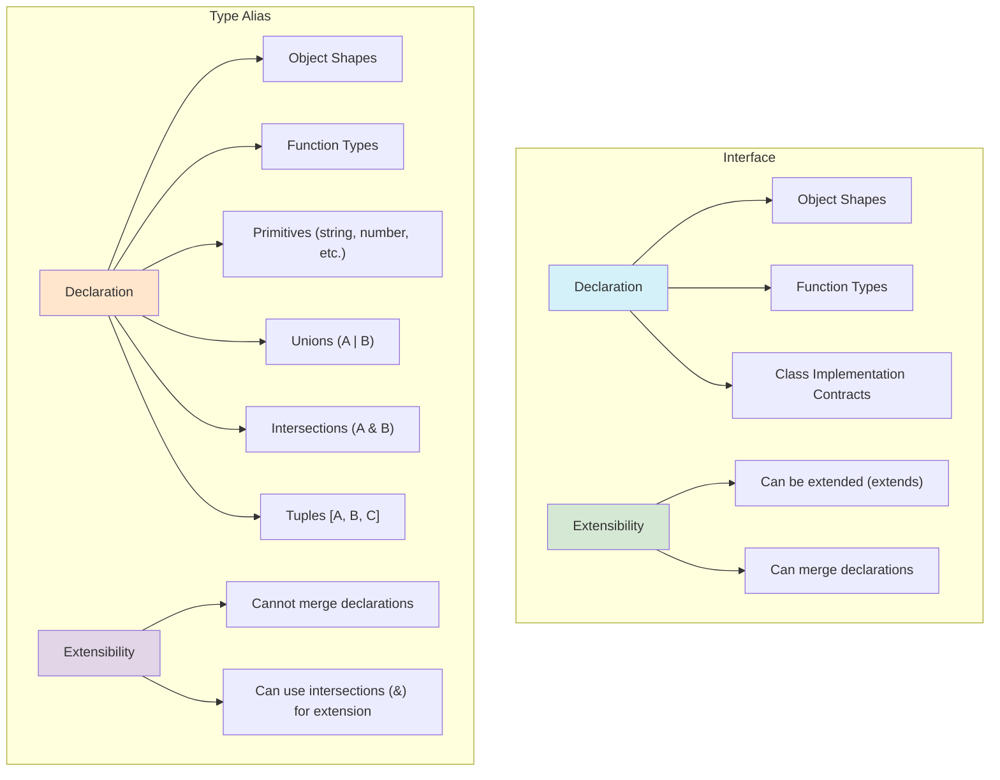

## Section 3: Interfaces and Type Aliases

While basic types are essential, real-world applications often deal with more complex data structures. TypeScript provides two primary ways to define the "shape" of objects: interfaces and type aliases. Both allow you to create named types for your data structures, enhancing code readability and providing strong type checking for objects.

### Conceptual Content: Defining Object Shapes

Let's delve into interfaces and type aliases, exploring their syntax, use cases, and differences.

**1. Interfaces (`interface`)**

An interface is a way to define a contract for an object's shape. It specifies the names and types of properties that an object must have. Interfaces are particularly well-suited for describing the shapes of objects or the contracts of classes.

- **Syntax:**

  ```typescript
  interface InterfaceName {
    propertyName1: type1;
    propertyName2: type2;
    optionalProperty?: type3; // Optional properties are denoted with a ?
    readonly readonlyProperty: type4; // Readonly properties cannot be changed after an object is created
  }
  ```

> [!NOTE]
> It's important to distinguish `readonly` (used for object properties) from `const` (used for variable declarations). `const` ensures that a variable cannot be reassigned to a different value or object. `readonly` ensures that a specific property on an object cannot be modified after the object is initialized.

- **SpeedyMeds Example: `Patient` Interface**

  ```typescript
  interface Patient {
    patientId: string;
    firstName: string;
    lastName: string;
    dateOfBirth: Date;
    contactNumber?: string; // Optional
    readonly medicalRecordNumber: string;
    allergies: string[];
  }

  function displayPatientInfo(patient: Patient): void {
    console.log(
      `Patient: ${patient.firstName} ${patient.lastName} (MRN: ${patient.medicalRecordNumber})`
    );
    console.log(`DOB: ${patient.dateOfBirth.toLocaleDateString()}`);
    if (patient.contactNumber) {
      console.log(`Contact: ${patient.contactNumber}`);
    }
    if (patient.allergies.length > 0) {
      console.log(`Allergies: ${patient.allergies.join(", ")}`);
    }
  }

  const currentPatient: Patient = {
    patientId: "P1001",
    firstName: "Alice",
    lastName: "Wonderland",
    dateOfBirth: new Date(1990, 4, 15),
    contactNumber: "555-0100",
    medicalRecordNumber: "MRN789001",
    allergies: ["Dust", "Pollen"],
  };

  displayPatientInfo(currentPatient);

  // currentPatient.medicalRecordNumber = "MRN_NEW"; // Error: Cannot assign to 'medicalRecordNumber' because it is a read-only property.
  ```

- **Excess Property Checks:**
  When assigning an object literal directly to a variable typed with an interface, TypeScript performs "excess property checking." If the object literal has properties not defined in the interface, a compile-time error occurs. This helps catch typos or misunderstandings about the expected shape.

  ```typescript
  interface SimplePatient {
    patientId: string;
    name: string;
  }

  // const anotherPatient: SimplePatient = { patientId: "P1002", name: "Bob", age: 40 };
  // Error: Object literal may only specify known properties, and 'age' does not exist in type 'SimplePatient'.

  // To bypass this, assign to another variable first, or use a type assertion (less safe):
  const patientData = { patientId: "P1002", name: "Bob", age: 40 };
  const anotherPatient: SimplePatient = patientData; // OK, patientData is not an object literal here.
  ```

**Extending Interfaces:**
Interfaces can extend other interfaces, inheriting their members. This is useful for creating more specialized types based on existing ones.

- **SpeedyMeds Example: `PediatricPatient` Extending `Patient`**

  ```typescript
  interface Patient {
    patientId: string;
    firstName: string;
    lastName: string;
    dateOfBirth: Date;
    readonly medicalRecordNumber: string;
  }

  interface PediatricPatient extends Patient {
    guardianName: string;
    schoolName?: string;
  }

  const childPatient: PediatricPatient = {
    patientId: "P2005",
    firstName: "Charlie",
    lastName: "Brown",
    dateOfBirth: new Date(2015, 8, 20),
    medicalRecordNumber: "MRN654002",
    guardianName: "Sally Brown",
  };

  console.log(
    `${childPatient.firstName} is a pediatric patient, guardian: ${childPatient.guardianName}.`
  );
  ```

**Function Types in Interfaces:**
Interfaces can also describe the shape of functions.

- **SpeedyMeds Example: `MedicationSearchFunction`**

  ```typescript
  interface MedicationSearchFunction {
    (ndcCode: string, formularyId?: string): Medication | undefined; // Medication type defined elsewhere
  }

  // Assuming Medication type is defined as:
  type Medication = { name: string; ndcCode: string; dosage: string };

  const findMedicationInFormulary: MedicationSearchFunction = (
    ndc,
    formulary
  ) => {
    console.log(
      `Searching for NDC ${ndc} in formulary ${formulary || "default"}`
    );
    if (ndc === "NDC12345-678-01") {
      return { name: "Ibuprofen", ndcCode: ndc, dosage: "200mg" };
    }
    return undefined;
  };

  const foundMed = findMedicationInFormulary("NDC12345-678-01");
  console.log(foundMed?.name);
  ```

**Indexable Types in Interfaces:**
Interfaces can describe types that can be "indexed into," like arrays or dictionaries, using an index signature.

- **SpeedyMeds Example: `MedicationStockLevels`**

  ```typescript
  interface MedicationStockLevels {
    [medicationNdc: string]: number; // Key is NDC string, value is stock quantity (number)
  }

  const pharmacyStock: MedicationStockLevels = {};
  pharmacyStock["NDC12345-678-01"] = 100; // Ibuprofen
  pharmacyStock["NDC98765-432-10"] = 50; // Lisinopril
  // pharmacyStock["SomeMedName"] = "Low"; // Error: Type 'string' is not assignable to type 'number'.

  console.log(
    `Stock of Ibuprofen (NDC12345-678-01): ${pharmacyStock["NDC12345-678-01"]}`
  );

  interface PatientAlerts {
    [alertId: number]: string; // Key is alert ID (number), value is alert message (string)
  }
  const patientAlerts: PatientAlerts = {
    101: "Check for penicillin allergy",
    205: "Advise patient on new dosage",
  };
  console.log(`Alert 101: ${patientAlerts[101]}`);
  ```

**Implementing Interfaces with Classes (`implements`):**
Classes can implement interfaces to ensure they adhere to the contract defined by the interface. This enforces that the class has all the properties and methods specified by the interface.

- **SpeedyMeds Example: `SMSService` implementing `NotificationProvider`**

  ```typescript
  interface NotificationProvider {
    providerName: string;
    sendNotification(patientId: string, message: string): Promise<boolean>;
    checkStatus(messageId: string): Promise<"Sent" | "Failed" | "Pending">;
  }

  class SMSService implements NotificationProvider {
    providerName = "SpeedyMeds SMS Gateway";

    async sendNotification(
      patientId: string,
      message: string
    ): Promise<boolean> {
      console.log(`SMS to ${patientId}: ${message} (via ${this.providerName})`);
      // Actual SMS sending logic here
      return Math.random() > 0.1; // Simulate success/failure
    }

    async checkStatus(
      messageId: string
    ): Promise<"Sent" | "Failed" | "Pending"> {
      console.log(`Checking SMS status for ${messageId}`);
      // Actual status check logic
      const statuses: Array<"Sent" | "Failed" | "Pending"> = [
        "Sent",
        "Failed",
        "Pending",
      ];
      return statuses[Math.floor(Math.random() * statuses.length)];
    }
  }

  const smsNotifier: NotificationProvider = new SMSService();
  smsNotifier
    .sendNotification("P1001", "Your prescription is ready for pickup.")
    .then((sent) => console.log("SMS Sent status:", sent));
  ```

**Declaration Merging in Interfaces:**
A unique feature of interfaces is that if you declare multiple interfaces with the same name (even across different files or modules within the same compilation context), TypeScript merges them into a single interface definition containing all members from all declarations. Non-function members must be unique or have the same type if repeated. Function members with the same name are treated as overloads.

- **Example:**

  ```typescript
  interface UserProfile {
    userId: string;
    displayName: string;
  }

  // Sometime later, perhaps in another file or for a specific feature:
  interface UserProfile {
    email?: string;
    lastLogin: Date;
    logActivity(action: string): void; // New method
  }

  // The UserProfile interface now effectively is:
  // interface UserProfile {
  //   userId: string;
  //   displayName: string;
  //   email?: string;
  //   lastLogin: Date;
  //   logActivity(action: string): void;
  // }

  const userProfile: UserProfile = {
    userId: "usr123",
    displayName: "JaneDev",
    lastLogin: new Date(),
    logActivity: (action) => console.log(`User action: ${action}`),
  };
  userProfile.logActivity("Viewed dashboard");
  ```

  This is particularly useful for extending existing interfaces, including those from third-party libraries or built-in JavaScript objects, without modifying their original source code.

**2. Type Aliases (`type`)**

A type alias allows you to create a new name (an alias) for any type, not just object shapes. This can be a primitive type, a union type, a tuple, an intersection type, a function type, or even more complex types involving generics, conditional types, or mapped types.

- **Syntax (for object shapes):**

  ```typescript
  type TypeAliasName = {
    propertyName1: type1;
    propertyName2: type2;
    optionalProperty?: type3;
    readonly readonlyProperty: type4;
  };
  ```

- **SpeedyMeds Example: `Medication` Type Alias**

  ```typescript
  type Medication = {
    medicationId: string;
    name: string;
    dosage: string; // e.g., "250mg", "10ml"
    form: "Tablet" | "Capsule" | "Syrup" | "Injection"; // Union type
    manufacturer?: string;
    readonly ndcCode: string; // National Drug Code
  };

  function logMedication(med: Medication): void {
    console.log(
      `Medication: ${med.name} (${med.dosage}), Form: ${med.form}, NDC: ${med.ndcCode}`
    );
    if (med.manufacturer) {
      console.log(`Manufacturer: ${med.manufacturer}`);
    }
  }

  const painRelief: Medication = {
    medicationId: "M5001",
    name: "Ibuprofen",
    dosage: "200mg",
    form: "Tablet",
    ndcCode: "NDC12345-678-01",
  };

  logMedication(painRelief);
  ```

- **Aliasing Primitives, Unions, Tuples, and Function Types:**
  Type aliases shine in their ability to give meaningful names to simpler or combined types.

  - _SpeedyMeds Examples:_

  ```typescript
  type PatientID = string; // Alias for a primitive
  type MedicationStatus = "Active" | "Discontinued" | "Pending Authorization"; // Alias for a union type
  type VitalSignReading = [timestamp: Date, value: number, unit: string]; // Alias for a tuple
  type DosageCalculator = (weightKg: number, ageYears: number) => number | null; // Alias for a function type

  let currentPatientId: PatientID = "PAT-0042X";
  let amoxicillinStatus: MedicationStatus = "Active";
  let lastHeartRate: VitalSignReading = [new Date(), 72, "bpm"];

  const calculatePediatricDosage: DosageCalculator = (weight, age) => {
    if (age < 12) return weight * 10; // Simplified example
    return null; // e.g., not applicable
  };
  console.log(`Dosage for 10kg child: ${calculatePediatricDosage(10, 5)}mg`);
  ```

- **Recursive Type Aliases:**
  Type aliases can refer to themselves, which is essential for defining recursive data structures, such as trees or linked lists.

  - _SpeedyMeds Example: `DrugInteractionCategory` (Hierarchical)_

  ```typescript
  type DrugInteractionCategory = {
    categoryId: string;
    categoryName: string;
    description?: string;
    subCategories?: DrugInteractionCategory[]; // Recursive reference
    relatedDrugs?: string[]; // e.g., array of NDC codes
  };

  const interactionTree: DrugInteractionCategory = {
    categoryId: "ALL",
    categoryName: "All Drug Interactions",
    subCategories: [
      {
        categoryId: "MAOI",
        categoryName: "MAO Inhibitors",
        description: "Interactions involving Monoamine Oxidase Inhibitors.",
        relatedDrugs: ["NDC-MAOI-1", "NDC-MAOI-2"],
        subCategories: [
          {
            categoryId: "MAOI-SSRI",
            categoryName: "MAOI with SSRI",
            description: "Risk of serotonin syndrome.",
          },
        ],
      },
      {
        categoryId: "STATIN",
        categoryName: "Statins",
        description: "Interactions involving HMG-CoA reductase inhibitors.",
      },
    ],
  };

  function printInteractionCategories(
    category: DrugInteractionCategory,
    indent: string = ""
  ): void {
    console.log(`${indent}- ${category.categoryName} (${category.categoryId})`);
    if (category.subCategories) {
      category.subCategories.forEach((subCat) =>
        printInteractionCategories(subCat, indent + "  ")
      );
    }
  }

  printInteractionCategories(interactionTree);
  ```

**Extending Type Aliases (using intersections):**
While type aliases don't have a direct `extends` keyword like interfaces, you can achieve similar results using intersection types (`&`).

- **SpeedyMeds Example: `Prescription` extending `Medication`**

  ```typescript
  type Medication = {
    medicationId: string;
    name: string;
    ndcCode: string;
  };

  type PrescriptionDetails = {
    prescriptionId: string;
    patientId: string;
    prescribingDoctor: string;
    datePrescribed: Date;
    quantity: number;
    refillsRemaining: number;
  };

  type Prescription = Medication &
    PrescriptionDetails & {
      dispensingPharmacy?: string;
    };

  const currentPrescription: Prescription = {
    medicationId: "M6002",
    name: "Lisinopril",
    ndcCode: "NDC98765-432-10",
    prescriptionId: "RXC10098",
    patientId: "P1001",
    prescribingDoctor: "Dr. Eva Smith",
    datePrescribed: new Date(),
    quantity: 30,
    refillsRemaining: 2,
    dispensingPharmacy: "SpeedyMeds Central",
  };

  console.log(
    `Prescription for ${currentPrescription.name}, prescribed by ${currentPrescription.prescribingDoctor}.`
  );
  ```

**3. Interfaces vs. Type Aliases**

For defining object shapes, interfaces and type aliases are often interchangeable due to TypeScript's structural typing. However, there are key differences and conventions:



The diagram above illustrates the primary capabilities and extension mechanisms for `interface` and `type` alias declarations in TypeScript. For an `Interface` (left side, originating from Node A1), it's primarily used for defining object shapes (B1), function types (C1), and as contracts for class implementations (D1). A key characteristic of interfaces is their extensibility (E1), allowing them to be extended using the `extends` keyword (F1) and uniquely supporting declaration merging (G1), where multiple `interface` blocks with the same name are combined.

On the other hand, a `Type Alias` (right side, originating from Node A2) is more versatile. While it can also define object shapes (B2) and function types (C2), its power extends to aliasing primitives (D2), unions (E2), intersections (F2), and tuples (G2). Regarding extensibility (H2), type aliases cannot merge declarations (I2); instead, extending their structure is typically achieved using intersection types (`&`) (J2). This visual comparison helps clarify when to choose one over the other based on these distinct features and how they handle structure and modifications.

- **Extensibility and Declaration Merging:**

  - **Interfaces:** Can be extended using the `extends` keyword. Crucially, interfaces support **declaration merging**: if you define an interface with the same name multiple times, TypeScript merges their properties into a single interface definition. This is very useful for augmenting types from external libraries or for allowing extensibility.
    ```typescript
    // Declaration Merging (Interfaces only)
    interface User {
      name: string;
    }
    interface User {
      age: number; // Merged into the User interface
    }
    const mergedUser: User = { name: "John", age: 30 }; // Works!
    ```
  - **Type Aliases:** Do not support declaration merging. Attempting to create a type alias with an existing name will result in a compiler error. Extension-like behavior is achieved using intersection types (`&`).
    ```typescript
    // type MyType = { x: number };
    // type MyType = { y: string }; // Error: Duplicate identifier 'MyType'.
    ```

- **Aliasing Capabilities:**

  - **Interfaces:** Primarily used to describe the shape of objects or, less commonly, function types that might be implemented by a class.
  - **Type Aliases:** More versatile. They can create names for _any_ type, including primitives (`type UserID = string;`), union types (`type Status = "pending" | "active";`), intersection types, tuples (`type Coordinates = [number, number];`), function types, and more complex mapped or conditional types.

- **Implementation by Classes:**
  - Classes can `implement` interfaces to ensure they adhere to a specific contract.
  - Classes can also `implement` type aliases that define an object shape, but this is less conventional than implementing interfaces.

**When to Use Which: General Recommendations**

- **Use `interface` when:**

  - Defining the shape of an object or a class contract.
  - You need or anticipate needing declaration merging (e.g., to augment types from external libraries or allow future extensibility by others).
  - You prefer the object-oriented paradigm of `extends` for inheritance and `implements` for class contracts.

- **Use `type` when:**
  - You need to alias primitive types, union types, intersection types, or tuples.
  - You need to define more complex types using advanced TypeScript features like utility types, mapped types, or conditional types (which often result in a specific, final type structure).
  - You want a type that explicitly cannot be changed or extended via declaration merging.
  - Defining function types not associated with a class structure.

Many teams establish a convention, such as defaulting to `interface` for object shapes and class contracts, and using `type` for all other scenarios where its broader aliasing capabilities are needed.

**Summary Table: Interfaces vs. Type Aliases**

| Feature                      | `interface`                                        | `type` alias                                                                    |
| ---------------------------- | -------------------------------------------------- | ------------------------------------------------------------------------------- |
| **Primary Use**              | Defining object shapes, class contracts            | Naming _any_ type (primitives, unions, intersections, objects, functions, etc.) |
| **Declaration Merging**      | Yes                                                | No                                                                              |
| **Extending**                | `extends` keyword                                  | Intersection types (`&`)                                                        |
| **Implementing by Class**    | Yes (common practice)                              | Yes (for object shapes, less common)                                            |
| **Aliasing Primitives**      | No                                                 | Yes                                                                             |
| **Aliasing Union/Tuple**     | No (can describe shapes that _use_ them)           | Yes                                                                             |
| **Recursive Structures**     | Can be used, but type aliases are often clearer    | Yes, directly supports recursive definitions                                    |
| **Mapped/Conditional Types** | Not directly; interfaces describe resulting shapes | Yes, can alias the results of these advanced type operations                    |

Understanding these distinctions allows you to choose the most appropriate tool for defining your types, leading to clearer, more maintainable, and robust TypeScript code.

> 📚 **Official Documentation:**
>
> - [TypeScript Handbook - Interfaces](https://www.typescriptlang.org/docs/handbook/2/objects.html#interfaces)
> - [TypeScript Handbook - Type Aliases](https://www.typescriptlang.org/docs/handbook/2/everyday-types.html#type-aliases)
> - [TypeScript Docs: Differences Between Type Aliases and Interfaces](https://www.typescriptlang.org/docs/handbook/2/everyday-types.html#differences-between-type-aliases-and-interfaces)

### Exercise 6.1: Defining Interfaces

Now it's time to practice defining your own interfaces.

**Objective:** Define interfaces for a `Pharmacy` and its `StaffMember` within the SpeedyMeds context.

**Instructions:**

1.  Create an interface named `StaffMember` with the following properties:
    - `staffId` (string, readonly)
    - `firstName` (string)
    - `lastName` (string)
    - `role` (union type: "Pharmacist", "Technician", "Cashier")
    - `yearsOfService` (number)
    - `onLeave` (boolean, optional)
2.  Create an interface named `Pharmacy` with the following properties:
    - `pharmacyId` (string, readonly)
    - `name` (string)
    - `address` (string)
    - `phoneNumber` (string)
    - `staff` (an array of `StaffMember` objects)
    - `hasDriveThru` (boolean)
3.  Create an example `Pharmacy` object that utilizes these interfaces, including at least two staff members.
4.  Write a function that takes a `Pharmacy` object and logs its name and the full name of its staff members.

**Access the Exercise:**

**(https://codesandbox.io/s/speedymeds-typescript-interfaces-exercise-yt83mv)**

### Advanced Type Concepts: Union and Intersection Types

TypeScript allows you to combine existing types to create new ones using union and intersection operators. These are fundamental for modeling complex data structures and variations in your application logic, especially when dealing with data that can take one of several forms or needs to combine features from multiple sources.

#### 1. Union Types (`|`)

A union type, created using the pipe symbol (`|`), allows a variable, function parameter, or property to hold a value of **one of several possible types**. It signifies that the value can be, for example, a `string` OR a `number` OR a `boolean`.

- **SpeedyMeds Example: `PatientIdentifier`**

  ```typescript
  /**
   * Represents an identifier which could be a numeric internal ID
   * or an alphanumeric Medical Record Number (MRN).
   * @typedef {number | string} PatientIdentifier
   */
  type PatientIdentifier = number | string;

  let patientRef: PatientIdentifier = 12345; // OK
  console.log(`Patient Reference (as number): ${patientRef}`);

  patientRef = "MRN67890"; // OK
  console.log(`Patient Reference (as string): ${patientRef}`);

  // patientRef = true; // Error: Type 'boolean' is not assignable to type 'PatientIdentifier'.
  ```

- **Working with Union Types (Narrowing):**
  When you have a value of a union type, TypeScript will only allow you to access members that are **common to all types** in the union. To access members specific to a particular type within the union, you need to use **type narrowing**. Type narrowing is the process of convincing TypeScript that a value is of a more specific type within a certain code block. Common ways to narrow types include:

  - `typeof` checks for primitive types.
  - `instanceof` checks for class instances.
  - `in` operator to check for property existence.
  - Equality checks (e.g., `===`, `!==`) with literal types.
  - Custom type guards (functions returning `parameterName is Type`).
  - Discriminated unions (covered next).

- **SpeedyMeds Example: Function with Union Type Parameter**

  ```typescript
  // Assuming Patient type is defined elsewhere
  // type Patient = { patientId: string | number; name: string; ... };

  function findPatient(id: PatientIdentifier): Patient | undefined {
    if (typeof id === "string") {
      // Inside this block, TypeScript knows 'id' is a string (MRN)
      console.log(`Searching for patient by MRN: ${id.toUpperCase()}`);
      // ... search logic using string id ...
    } else {
      // Inside this block, TypeScript knows 'id' is a number (Internal ID)
      console.log(`Searching for patient by Internal ID: ${id}`);
      // ... search logic using number id ...
    }
    // Placeholder: actual patient fetching logic would be here
    return undefined;
  }

  findPatient(101);
  findPatient("MRN-XYZ-789");
  ```

Union types are incredibly useful for modeling situations where a value can legitimately be one of several types, such as handling different kinds of API responses or function inputs.

#### 2. Intersection Types (`&`)

An intersection type, created using the ampersand symbol (`&`), allows you to combine multiple existing types into a **single new type that possesses all the properties and methods of each constituent type**. This is extremely useful for composing complex types from smaller, reusable pieces, promoting modularity and adhering to the DRY (Don't Repeat Yourself) principle in your type definitions.

Think of it as creating a new type that is a mix-in or a composition of all the features from the types being intersected.

- **SpeedyMeds Example: Composing `PrescriptionOrder`**

  Let's imagine we have base types for order information and specific details for prescription refills and over-the-counter (OTC) supply orders.

  ```typescript
  /** Base properties common to all orders */
  interface BaseOrderInfo {
    orderId: string;
    orderDate: Date;
    status: "Pending" | "Processing" | "Shipped" | "Delivered" | "Cancelled"; // Using literal union
  }

  /** Details specific to prescription refills */
  interface PrescriptionRefillInfo {
    prescriptionId: string;
    medicationName: string;
    patientId: string;
    refillsRequested: number;
  }

  /** Details specific to over-the-counter (OTC) supply orders */
  interface SupplyOrderInfo {
    items: { itemName: string; quantity: number; price: number }[];
    deliveryAddress: string;
    shippingMethod?: "Standard" | "Express";
  }

  // Combine base properties with specific details using intersection types
  type PrescriptionRefillOrder = BaseOrderInfo & PrescriptionRefillInfo;
  type PharmacySupplyOrder = BaseOrderInfo & SupplyOrderInfo;

  // Example Usage
  const refillOrder: PrescriptionRefillOrder = {
    orderId: "RXRF1122",
    orderDate: new Date(),
    status: "Processing",
    prescriptionId: "RXC10098",
    medicationName: "Lisinopril 20mg",
    patientId: "P1001",
    refillsRequested: 1,
  };

  const otcOrder: PharmacySupplyOrder = {
    orderId: "SUPP3344",
    orderDate: new Date(),
    status: "Shipped",
    items: [
      { itemName: "Band-Aids (Box)", quantity: 1, price: 5.99 },
      { itemName: "Antiseptic Wipes", quantity: 2, price: 3.49 },
    ],
    deliveryAddress: "123 Main St, Anytown, USA",
    shippingMethod: "Express",
  };

  // You can access properties from all intersected types:
  console.log(
    `Refill Order ${refillOrder.orderId} for ${refillOrder.medicationName} is ${refillOrder.status}.`
  );
  console.log(
    `OTC Order ${otcOrder.orderId} delivering to ${otcOrder.deliveryAddress} via ${otcOrder.shippingMethod} shipping.`
  );
  ```

Intersection types are powerful for building up complex object shapes by combining simpler, focused type definitions. This makes your types more maintainable and easier to reason about.

#### 3. Discriminating Unions (or Tagged Unions)

Discriminating unions are a common and very powerful pattern in TypeScript for working with union types, especially for modeling different states, events, or action types (e.g., in state management like Redux or Zustand). This pattern makes it easier and safer to handle data that can take one of several distinct forms.

The pattern involves three key components:

1.  A **common, singleton type property** (the _discriminant_ or _tag_) present in all types within the union. This property usually has a string literal type.
2.  Each type in the union has a **unique literal value** for this discriminant property.
3.  Using `switch` statements (or a series of `if/else if` checks) on the discriminant property allows TypeScript to perform **type narrowing**, correctly inferring the specific type of the object within each corresponding code block.

- **SpeedyMeds Example: `CartAction`**

  Imagine managing a shopping cart in the SpeedyMeds app. Different actions can modify the cart:

  ```typescript
  // Define the different action types with a common 'type' property (the discriminant)
  type AddItemAction = {
    type: "ADD_ITEM"; // Discriminant
    payload: { itemId: string; name: string; quantity: number };
  };

  type RemoveItemAction = {
    type: "REMOVE_ITEM"; // Discriminant
    payload: { itemId: string };
  };

  type UpdateQuantityAction = {
    type: "UPDATE_QUANTITY"; // Discriminant
    payload: { itemId: string; newQuantity: number };
  };

  type CheckoutAction = {
    type: "CHECKOUT"; // Discriminant
    payload: { paymentMethod: string };
  };

  // Create the union type representing all possible cart actions
  type CartAction =
    | AddItemAction
    | RemoveItemAction
    | UpdateQuantityAction
    | CheckoutAction;

  /**
   * Processes different shopping cart actions based on their type.
   * Demonstrates type narrowing using a discriminated union.
   * @param {CartAction} action - The cart action to process.
   * @returns {void}
   */
  function handleCartAction(action: CartAction): void {
    switch (action.type) {
      case "ADD_ITEM":
        // TypeScript knows 'action' is AddItemAction here
        console.log(
          `Adding item: ${action.payload.name} (ID: ${action.payload.itemId}), Quantity: ${action.payload.quantity}`
        );
        // Access action.payload.quantity safely
        break;

      case "REMOVE_ITEM":
        // TypeScript knows 'action' is RemoveItemAction here
        console.log(`Removing item ID: ${action.payload.itemId}`);
        break;

      case "UPDATE_QUANTITY":
        // TypeScript knows 'action' is UpdateQuantityAction here
        console.log(
          `Updating quantity for item ID: ${action.payload.itemId} to ${action.payload.newQuantity}`
        );
        break;

      case "CHECKOUT":
        // TypeScript knows 'action' is CheckoutAction here
        console.log(`Checking out using: ${action.payload.paymentMethod}`);
        break;

      // Optional: Exhaustiveness Check using 'never'
      // This ensures that if a new CartAction type is added but not handled in the switch,
      // TypeScript will raise a compile-time error at the line below.
      default:
        const _exhaustiveCheck: never = action;
        console.error(
          `Unhandled action type: ${(_exhaustiveCheck as any).type}`
        );
        // return _exhaustiveCheck; // Or re-throw, depending on error handling strategy
        break;
    }
  }

  // Example Usage:
  handleCartAction({
    type: "ADD_ITEM",
    payload: { itemId: "med101", name: "Lisinopril", quantity: 1 },
  });
  handleCartAction({
    type: "UPDATE_QUANTITY",
    payload: { itemId: "med101", newQuantity: 2 },
  });
  handleCartAction({
    type: "CHECKOUT",
    payload: { paymentMethod: "Credit Card" },
  });
  ```

Discriminating unions provide a robust and type-safe way to model variants and ensure all possible cases are handled, significantly reducing the chances of runtime errors when dealing with heterogeneous data structures.

### Comparing Interfaces and Type Aliases
