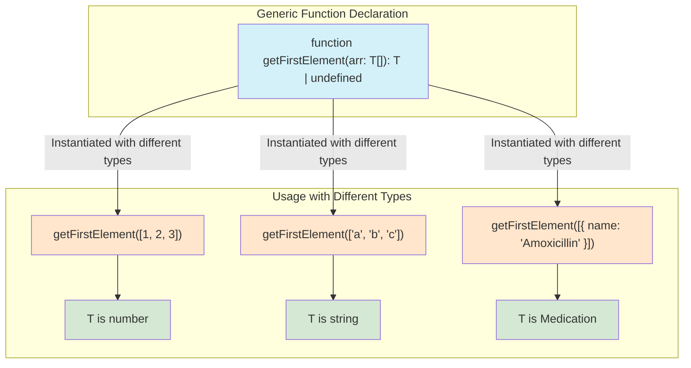

## Section 5: Generics

Generics are a powerful feature in TypeScript that allow you to write reusable code that can work with a variety of types while maintaining type safety. Instead of using `any` and losing type information, generics allow you to create components (like functions, classes, or interfaces) that can operate on different types, where the actual type is specified when the component is used.

> 🧑‍🏫 **(Instructor-Led):** Consider demonstrating generics with real-world examples beyond the course material. Ask students to identify scenarios in their own projects where generics could be valuable.

> 🧗‍♀️ **(Self-Led):** Generics are often challenging to grasp initially. Take your time with this section, experimenting with the examples and trying variations. Try writing your own generic functions for different data structures you might use in a pharmacy app.



The diagram above illustrates how a single generic function declaration, `getFirstElement<T>(arr: T[]): T | undefined` (Node A1), can be versatile enough to handle arrays of different data types while maintaining type safety. The type parameter `T`, declared within angle brackets `<T>`, acts as a placeholder for a specific type that will be determined when the function is used.

When the function is called, `T` is instantiated with an actual type. For instance, in `getFirstElement<number>([1, 2, 3])` (Node B1), `T` becomes `number` (Node C1), and the function is type-checked as if it were `getFirstElement(arr: number[]): number | undefined`. Similarly, for `getFirstElement<string>(['a', 'b', 'c'])` (Node B2), `T` becomes `string` (Node C2). It can also work with complex custom types, as shown with `getFirstElement<Medication>([...])` (Node B3), where `T` becomes `Medication` (Node C3). This demonstrates the core benefit of generics: writing reusable code components that can operate on various types without sacrificing the precision of static type checking for each specific usage.

### Conceptual Content: Writing Reusable, Type-Safe Code

Imagine you need a function that returns the first element of an array. Without generics, you might write it like this:

```typescript
function getFirstElementAny(arr: any[]): any {
  return arr[0];
}

const firstNum = getFirstElementAny([1, 2, 3]); // firstNum is 'any'
const firstStr = getFirstElementAny(["a", "b", "c"]); // firstStr is 'any'
```

This works, but you lose type information. `firstNum` and `firstStr` are both of type `any`. Generics solve this problem.

**1. Generic Functions**

A generic function uses a type variable (conventionally `T`, `U`, `K`, `V`, etc.) to represent a type that will be specified later.

- **Syntax:**

  ```typescript
  function functionName<T>(param: T): T {
    // ...
    return param;
  }
  ```

  Here, `<T>` declares a type variable `T`. This `T` can then be used to type parameters and return values.

- **SpeedyMeds Example: Identity Function & Data Logger**

  Let's rewrite the `getFirstElement` function using generics:

  ```typescript
  function getFirstElement<T>(arr: T[]): T | undefined {
    return arr.length > 0 ? arr[0] : undefined;
  }

  // Type inference: TypeScript infers T as number
  const firstPrescriptionId = getFirstElement([101, 102, 103]);
  console.log(firstPrescriptionId); // Type is number | undefined

  // Type inference: TypeScript infers T as string
  const firstPatientName = getFirstElement(["Alice Smith", "Bob Johnson"]);
  console.log(firstPatientName); // Type is string | undefined

  // Explicitly specifying the type
  const firstMedicationObject = getFirstElement<{
    name: string;
    dosage: string;
  }>([
    { name: "Amoxicillin", dosage: "250mg" },
    { name: "Ibuprofen", dosage: "200mg" },
  ]);
  console.log(firstMedicationObject?.name); // Type is { name: string; dosage: string; } | undefined
  ```

  Notice how `firstPrescriptionId` is correctly typed as `number | undefined` and `firstPatientName` as `string | undefined`. The type of `T` is inferred from the arguments passed, or it can be explicitly provided.

  Another example: a generic data logger for SpeedyMeds records.

  ```typescript
  interface PatientRecord {
    patientId: string;
    lastVisit: Date;
  }

  interface MedicationInventory {
    medicationId: string;
    name: string;
    stockLevel: number;
  }

  function logItemDetails<T>(item: T): void {
    console.log("Logging item details:");
    // For demonstration, we just stringify. In a real app, you might send this to a logging service.
    // You could add type guards here if you needed to access specific properties of T.
    console.log(JSON.stringify(item, null, 2));
  }

  const patientLog: PatientRecord = {
    patientId: "P001",
    lastVisit: new Date(),
  };
  const medicationLog: MedicationInventory = {
    medicationId: "M001",
    name: "Lisinopril",
    stockLevel: 500,
  };

  logItemDetails<PatientRecord>(patientLog);
  logItemDetails<MedicationInventory>(medicationLog);
  logItemDetails("Simple string log"); // T is inferred as string
  ```

  **Working with Multiple Type Variables:**
  Generic functions are not limited to a single type variable. You can declare multiple type variables if the function's logic involves several independent types.

  - **SpeedyMeds Example: Transforming Patient Data**

    Imagine a function that takes an array of one type (e.g., raw patient data objects) and a transformation function, then returns an array of another type (e.g., simplified patient view models).

    ```typescript
    interface RawPatientData {
      id: number;
      fullName: string;
      dob: string; // Date as string
      fullAddress: string;
    }

    interface PatientViewModel {
      patientId: string;
      displayName: string;
      age: number; // Calculated
    }

    function calculateAge(dateOfBirth: string): number {
      const dob = new Date(dateOfBirth);
      const diffMs = Date.now() - dob.getTime();
      const ageDt = new Date(diffMs);
      return Math.abs(ageDt.getUTCFullYear() - 1970);
    }

    /**
     * Maps an array of items from one type (T) to another type (U)
     * using a provided mapping function.
     * @param arr The input array of type T.
     * @param func The mapping function that takes an item of type T and returns type U.
     * @returns A new array of type U.
     */
    function mapArrayData<T, U>(arr: T[], func: (arg: T) => U): U[] {
      return arr.map(func);
    }

    const rawPatients: RawPatientData[] = [
      {
        id: 1,
        fullName: "Jane Marie Doe",
        dob: "1985-07-22",
        fullAddress: "123 Main St, Anytown",
      },
      {
        id: 2,
        fullName: "John Robert Smith",
        dob: "1992-02-15",
        fullAddress: "456 Oak Rd, Anytown",
      },
    ];

    const patientViewModels = mapArrayData(rawPatients, (patient) => ({
      patientId: `PAT-${patient.id}`,
      displayName: patient.fullName,
      age: calculateAge(patient.dob),
    }));

    console.log(patientViewModels);
    // Output:
    // [
    //   { patientId: 'PAT-1', displayName: 'Jane Marie Doe', age: ... },
    //   { patientId: 'PAT-2', displayName: 'John Robert Smith', age: ... }
    // ]
    ```

    In `mapArrayData<T, U>`, `T` represents the type of the elements in the input array (`RawPatientData`), and `U` represents the type of the elements in the output array (`PatientViewModel`). This allows for flexible and type-safe data transformations.

**2. Generic Interfaces**

You can also create generic interfaces. This is useful for defining shapes for objects that can hold or operate on data of various types.

- **SpeedyMeds Example: `ApiResponse` Interface**

  Imagine an API that returns different types of data, but always wrapped in a common response structure.

  ```typescript
  interface ApiResponse<TData> {
    statusCode: number;
    message: string;
    data: TData; // The actual data payload will vary
    timestamp: Date;
  }

  interface Patient {
    id: string;
    name: string;
    age: number;
  }

  interface Medication {
    id: string;
    name: string;
    dosageForm: string;
  }

  // Example usage:
  const patientApiResponse: ApiResponse<Patient> = {
    statusCode: 200,
    message: "Patient data fetched successfully.",
    data: {
      id: "PAT123",
      name: "John Doe",
      age: 30,
    },
    timestamp: new Date(),
  };

  const medicationApiResponse: ApiResponse<Medication[]> = {
    statusCode: 200,
    message: "Medications list fetched.",
    data: [
      { id: "MED001", name: "Amoxicillin", dosageForm: "Capsule" },
      { id: "MED002", name: "Ibuprofen", dosageForm: "Tablet" },
    ],
    timestamp: new Date(),
  };

  console.log(`Patient: ${patientApiResponse.data.name}`);
  console.log(`First medication: ${medicationApiResponse.data[0].name}`);
  ```

  Interfaces can also use multiple type variables.

  - **SpeedyMeds Example: `KeyValuePair<K, V>`**

    Let's define a generic interface for a key-value pair, where the key and value can be of different types. This is useful for representing entries in a map or configuration settings.

    ```typescript
    interface KeyValuePair<TKey, TValue> {
      key: TKey;
      value: TValue;
    }

    // Usage examples:
    const patientAgeSetting: KeyValuePair<string, number> = {
      key: "defaultPatientAge",
      value: 30,
    };

    const pharmacyFeatureFlag: KeyValuePair<string, boolean> = {
      key: "enableOnlineRefills",
      value: true,
    };

    const medicationFormPreference: KeyValuePair<number, string> = {
      key: 101, // Could be a medication ID
      value: "Tablet", // Preferred form
    };

    function displaySetting<K, V>(setting: KeyValuePair<K, V>): void {
      console.log(`Setting Key: ${setting.key}, Value: ${setting.value}`);
    }

    displaySetting(patientAgeSetting);
    displaySetting(pharmacyFeatureFlag);
    displaySetting(medicationFormPreference);
    ```

    Here, `KeyValuePair<TKey, TValue>` allows us to define pairs with varying types for keys and values while maintaining type safety for each specific pair instance.

**3. Generic Type Aliases**

Similar to interfaces, type aliases can also be generic.

- **SpeedyMeds Example: `Nullable` Type**

  ```typescript
  type Nullable<T> = T | null | undefined;

  let patientPhoneNumber: Nullable<string> = "555-1234";
  patientPhoneNumber = null;
  patientPhoneNumber = undefined;
  // patientPhoneNumber = 123; // Error: Type 'number' is not assignable to type 'Nullable<string>'.

  let medicationBatchId: Nullable<number> = 78901;
  medicationBatchId = null;

  console.log(patientPhoneNumber);
  console.log(medicationBatchId);
  ```

**4. Generic Classes**

Classes can also be generic. This allows you to create classes that can work with different types for their properties or methods.

- **SpeedyMeds Example: `DataCache<TItem>` Class**

  ```typescript
  interface Cacheable {
    id: string | number;
  }

  class DataCache<TItem extends Cacheable> {
    private cache: Map<string | number, TItem> = new Map();

    addItem(item: TItem): void {
      this.cache.set(item.id, item);
      console.log(`Cached item with ID: ${item.id}`);
    }

    getItem(id: string | number): TItem | undefined {
      return this.cache.get(id);
    }

    clearCache(): void {
      this.cache.clear();
      console.log("Cache cleared.");
    }

    listCachedIds(): (string | number)[] {
      return Array.from(this.cache.keys());
    }
  }

  // Usage with Patient data
  interface PatientProfile {
    id: string;
    name: string;
    lastConsultation: Date;
  }
  const patientCache = new DataCache<PatientProfile>();
  patientCache.addItem({
    id: "P001",
    name: "Alice Ray",
    lastConsultation: new Date(),
  });
  patientCache.addItem({
    id: "P002",
    name: "Bob Sanders",
    lastConsultation: new Date(),
  });
  console.log("Patient P001:", patientCache.getItem("P001"));

  // Usage with Medication data
  interface MedicationDetail {
    id: string; // NDC Code for example
    genericName: string;
    strength: string;
  }
  const medicationCache = new DataCache<MedicationDetail>();
  medicationCache.addItem({
    id: "NDC54321",
    genericName: "Metformin",
    strength: "500mg",
  });
  console.log("Medication NDC54321:", medicationCache.getItem("NDC54321"));
  console.log("Cached medication IDs:", medicationCache.listCachedIds());
  ```

  **Using Class Types in Generics (Advanced)**

  A more advanced use of generics with classes involves working with class types themselves. For instance, you might want to create a factory function that can produce instances of different classes.

  - **SpeedyMeds Example: Generic Item Factory**

    Imagine needing a factory that can create instances of various record types used in SpeedyMeds, where each record type might have a default constructor.

    ```typescript
    class PatientLogEntry {
      timestamp: Date;
      message: string;
      constructor(message: string = "Log entry created") {
        this.timestamp = new Date();
        this.message = message;
        console.log(
          `PatientLogEntry: ${this.message} at ${this.timestamp.toISOString()}`
        );
      }
    }

    class InventoryUpdateRecord {
      updateTime: Date;
      medicationId: string;
      quantityChange: number;
      constructor(medId: string = "UNKNOWN", qtyChange: number = 0) {
        this.updateTime = new Date();
        this.medicationId = medId;
        this.quantityChange = qtyChange;
        console.log(
          `InventoryUpdateRecord for ${this.medicationId}: ${
            this.quantityChange
          } at ${this.updateTime.toISOString()}`
        );
      }
    }

    /**
     * A generic factory function that creates an instance of a class T.
     * The class T must have a constructor that takes no arguments.
     * @param ctor The constructor function for class T.
     * @returns A new instance of class T.
     */
    function createRecordInstance<T>(
      ctor: { new (...args: any[]): T },
      ...args: any[]
    ): T {
      return new ctor(...args);
    }

    // Create instances using the factory
    const newLogEntry = createRecordInstance(
      PatientLogEntry,
      "Patient file accessed"
    );
    const newInventoryRecord = createRecordInstance(
      InventoryUpdateRecord,
      "NDC123",
      -5
    );
    const defaultInventoryRecord = createRecordInstance(InventoryUpdateRecord);
    ```

    In this example, `createRecordInstance` is a generic function. The type parameter `T` represents the instance type of the class. The parameter `ctor` is of type `{ new (...args: any[]): T }`, which means "any constructor function that, when called with `new` and any arguments, produces an instance of `T`." This allows the factory to be used with different classes like `PatientLogEntry` and `InventoryUpdateRecord`, as long as their constructors match the expected signature (or can be called with the provided arguments).

**5. Generic Constraints**

Sometimes you want to constrain the types that can be used with a generic type variable. You can use the `extends` keyword to require that the type variable implements a certain interface or has certain properties.

- **SpeedyMeds Example: Logging items with an ID**

  ```typescript
  interface Identifiable {
    id: string | number; // Items must have an id property
  }

  function logItemId<T extends Identifiable>(item: T): void {
    console.log(`Item ID: ${item.id}`);
  }

  interface Pharmacy {
    id: string;
    name: string;
    location: string;
  }

  const myPharmacy: Pharmacy = {
    id: "PHARM001",
    name: "SpeedyMeds Downtown",
    location: "123 Main St",
  };
  const somePatient = { id: 101, patientName: "Jane Doe" }; // This object satisfies Identifiable
  const someOrder = { orderNumber: "ORD555", totalAmount: 50.25 }; // Error if passed: Property 'id' is missing

  logItemId(myPharmacy);
  logItemId(somePatient);
  // logItemId(someOrder); // Argument of type '{ orderNumber: string; }' is not assignable to parameter of type 'Identifiable'.
  // Property 'id' is missing in type '{ orderNumber: string; }' but required in type 'Identifiable'.
  ```

  In this example, `logItemId` can only be called with objects that have an `id` property of type `string` or `number`.

Generics are a cornerstone of creating flexible and type-safe libraries and utilities. They allow you to write code that is abstract over types, providing a good balance between reusability and static type checking.

**Common Use Cases for Generics:**

- Creating type-safe collections (e.g., `Array<T>`, `Map<K, V>`, custom cache classes like `DataCache<TItem>` above).
- Building reusable utility functions that operate on various data types (e.g., `getFirstElement<T>`).
- Defining flexible API response structures (e.g., `ApiResponse<TData>`) or data mappers.
- Developing abstract data structures (like trees, linked lists) and algorithms that can work with different data types.

> [!NOTE] > **`Under the Hood`: Type Erasure and Generics**
> An important aspect to understand about generics in TypeScript is **type erasure**. Generic type information is primarily a compile-time construct. During the compilation process, when TypeScript code is transpiled to JavaScript, these generic type parameters are typically erased. The resulting JavaScript code often uses `any` or relies on JavaScript's dynamic typing for the parts that were generic.
>
> For example, `function getFirstElement<T>(arr: T[]): T | undefined { /* ... */ }` might compile down to something like `function getFirstElement(arr) { /* ... */ }` in JavaScript.
>
> The crucial benefit of generics lies in the **static analysis and type safety they provide during the development phase**. The TypeScript compiler uses the generic information to catch errors and provide better tooling support _before_ the code is executed. This compile-time checking is what makes generics powerful, not any runtime generic type information (which generally doesn't exist in the output JavaScript).

### Key Takeaways

- **Reusable Code:** Generics allow you to write functions, classes, interfaces, and type aliases that can work with a variety of types without sacrificing type safety.
- **Type Safety:** By using type variables (e.g., `<T>`), you ensure that operations are consistent for the specific type being used at instantiation, catching errors at compile time.
- **Flexibility with Constraints:** Generic constraints (`extends`) allow you to specify that a type variable must have certain properties or adhere to a particular interface, narrowing the scope of applicable types while maintaining flexibility.
- **Improved Abstraction:** Generics help in creating more abstract and robust data structures and utility functions applicable across different parts of your application (e.g., `ApiResponse<T>`, `DataCache<TItem>`).
- **Compile-Time Construct:** Remember that generic type information is primarily for compile-time checking and is erased during transpilation to JavaScript.

> 📚 **Official Documentation:**
>
> - [TypeScript Handbook - Generics](https://www.typescriptlang.org/docs/handbook/2/generics.html)

### Exercise 6.3: Generic Function

Let's put your understanding of generics into practice.

**Objective:** Create a generic function that can process and return an array of items, adding a timestamp to each item.

**Instructions:**

1.  Define an interface `TimestampedItem<T>` that has two properties:
    - `originalItem` of type `T` (the generic type variable).
    - `timestamp` of type `Date`.
2.  Create a generic function called `addTimestampToItems<T>`:
    - It should take one argument: `items` (an array of type `T[]`).
    - It should return a new array where each element is of type `TimestampedItem<T>`.
    - For each item in the input `items` array, the function should create an object that includes the `originalItem` and the current `timestamp` (when the function processed it).
3.  Test your function with arrays of different types (e.g., an array of `string`s representing medication names, and an array of objects representing simple `PrescriptionRefillRequest`s).
    - Define a simple `PrescriptionRefillRequest` interface (e.g., `{ prescriptionId: string; patientName: string; }`).
4.  Log the resulting timestamped arrays to the console.

**Access the Exercise:**

**(https://codesandbox.io/s/speedymeds-typescript-generics-exercise-q4g9tz)**

> 🍏 **(Native iOS Developers - Swift):**
>
> **Comparison:** Swift's generics are very similar to TypeScript's. You define generic functions, classes, structs, and enums using type parameters (e.g., `func makeArray<Item>(repeating item: Item, numberOfTimes: Int) -> [Item]`). Both systems use angle brackets for type parameters (e.g., `Array<Element>`).
>
> **Key Differences & Takeaways:**
>
> - **Type Constraints:** Swift uses protocols for generic constraints (e.g., `func process<T: Equatable>(value: T)`), similar to TypeScript's `extends` keyword with interfaces (`function process<T extends Equatable>(value: T)`).
> - **Type Erasure:** TypeScript erases generic types at compile time, meaning the JavaScript output doesn't retain generic information. Swift generics are typically reified, meaning type information can be available at runtime, allowing for more dynamic checks.
> - **Associated Types:** Swift protocols can have `associatedtype` declarations, which are placeholders for types used within the protocol. This concept is somewhat analogous to how generic type parameters can be used within TypeScript interfaces or type aliases when defining complex relationships.
>
> You'll find the conceptual underpinning of writing flexible, reusable, and type-safe code with generics to be almost identical. The primary differences lie in syntax for constraints and runtime behavior due to type erasure in TypeScript vs. reification in Swift.
>
> **Source:** [Swift Language Guide - Generics](https://docs.swift.org/swift-book/documentation/the-swift-programming-language/generics/)

> 🤖 **(Native Android Developers - Kotlin/Java):**
>
> **Comparison:** Kotlin and Java both have robust support for generics, conceptually very similar to TypeScript. You declare generic classes, interfaces, and functions using type parameters (e.g., Kotlin: `class Box<T>(t: T)`, Java: `class Box<T> { private T t; }`).
>
> **Key Differences & Takeaways:**
>
> - **Type Constraints (Bounds):** Kotlin uses the colon (`fun <T : Comparable<T>> sort(list: List<T>)`) and Java uses `extends` (`<T extends Comparable<T>>`) for upper bounds, similar to TypeScript's `extends`.
> - **Type Erasure:** Both Java and TypeScript perform type erasure for generics. At runtime, instances of generic types generally don't know their actual type arguments (e.g., a `List<String>` becomes a raw `List` in Java bytecode). Kotlin, when targeting the JVM, also undergoes type erasure. However, Kotlin offers reified type parameters for inline functions (`inline fun <reified T> isInstanceOf(value: Any) = value is T`), which allows runtime checks against `T`. This is a specific Kotlin feature not present in TypeScript or standard Java generics.
> - **Wildcards (Java) / Use-site Variance (Kotlin):** Java uses wildcards (e.g., `List<? extends Number>`, `List<? super Integer>`) for more flexible type assignments. Kotlin uses declaration-site variance (`out`, `in` modifiers on type parameters) and use-site variance (type projections like `Array<out String>`) to achieve similar flexibility. TypeScript's structural typing and inference often handle these scenarios without explicit wildcard-like syntax, though its variance rules are more aligned with declaration-site for `readonly` properties and use-site for function parameters.
>
> The core goal of achieving type-safe, reusable components is shared. Focus on TypeScript's syntax for constraints and how it applies to functions, interfaces, and classes.
>
> **Source:** [Kotlin Docs - Generics](https://kotlinlang.org/docs/generics.html), [Java Tutorials - Generics](https://docs.oracle.com/javase/tutorial/java/generics/index.html)

> 🌐 **(Web Developers - From Python, Ruby, C#, etc.):**
>
> **Comparison (C#/Java Background):** If you're familiar with generics in C# or Java, TypeScript generics will feel very natural. The syntax (`<T>`) and purpose (creating reusable, type-safe components) are largely the same. Key differences include type erasure in TypeScript (similar to Java, less so than C# which has more runtime type information for generics) and the use of structural typing for constraints.
>
> **Comparison (Python/Ruby Background):** Python (with type hints using `TypeVar`) and Ruby (through conventions or sorbet-like tools) are increasingly incorporating generic concepts, but they are often not as central or compile-time enforced as in TypeScript. The main shift will be explicitly defining type parameters and relying on the TypeScript compiler to enforce these generic contracts, rather than relying purely on duck typing at runtime.
>
> **Key Takeaway:** Generics in TypeScript provide compile-time safety for reusable components. If you've used them in other statically-typed languages, the concepts transfer well. If you're from a more dynamic background, generics introduce a way to define flexible yet type-checked abstractions.
>
> **Source:** [Python `typing.TypeVar`](https://docs.python.org/3/library/typing.html#typing.TypeVar)
