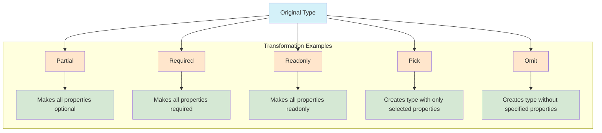

## Section 7: Utility Types

TypeScript comes with a set of built-in utility types that allow you to transform existing types in various useful ways. These utilities help you create new types based on existing ones without having to manually redefine them, promoting code reuse and maintainability. They are particularly handy when working with interfaces and type aliases for different scenarios, such as creating types for partial updates, read-only views, or subsets of properties.

> 🛣️ **(All Learners):** Utility types are powerful tools in TypeScript that will help you avoid redundant type definitions. Master these to significantly improve your code's maintainability.

> 🔁 **(Asynchronous Learners):** If you're jumping directly to this section, make sure you understand interfaces and type aliases (Section 3) first, as utility types build upon those concepts.



The diagram above illustrates how utility types transform an original type into new derived types with different characteristics. Each utility type serves a specific purpose, allowing you to adapt existing types to various use cases without redefining them.

### Conceptual Content: Transforming Existing Types

Let's explore some of the most commonly used utility types with examples relevant to our SpeedyMeds application.

**1. `Partial<T>`**

Constructs a type with all properties of `T` set to optional. This is useful when you want to represent an object that might only contain a subset of properties, such as when updating an entity.

- **SpeedyMeds Example: Updating Patient Information**

  ```typescript
  interface PatientProfile {
    patientId: string;
    firstName: string;
    lastName: string;
    dateOfBirth: Date;
    contactNumber: string;
    address: string;
  }

  // Function to update patient details. Only some fields might be provided.
  function updatePatientProfile(
    patientId: string,
    updates: Partial<PatientProfile>
  ): void {
    console.log(`Updating patient ${patientId} with:`, updates);
    // In a real app, you would fetch the existing patient data
    // and merge the updates.
    // For example: existingPatient.firstName = updates.firstName ?? existingPatient.firstName;
    if (updates.contactNumber) {
      console.log(`Contact number updated to: ${updates.contactNumber}`);
    }
    if (updates.address) {
      console.log(`Address updated to: ${updates.address}`);
    }
  }

  updatePatientProfile("P1001", {
    contactNumber: "555-0199",
    address: "123 New Street",
  });
  updatePatientProfile("P1002", { lastName: "Smith-Jones" });

  // const invalidUpdate: Partial<PatientProfile> = { nonExistentProp: 123 }; // Error: Object literal may only specify known properties...
  ```

**2. `Required<T>`**

Constructs a type with all properties of `T` set to required. This is the opposite of `Partial<T>`.

- **SpeedyMeds Example: Fully Populated Medication Record**

  ```typescript
  interface MedicationDetails {
    medicationId: string;
    name: string;
    manufacturer?: string; // Optional during initial creation
    batchNumber?: string; // Optional during initial creation
  }

  // Type for a medication record that MUST have all details filled in, e.g., for auditing.
  type CompleteMedicationRecord = Required<MedicationDetails>;

  const completeRecord: CompleteMedicationRecord = {
    medicationId: "MED001",
    name: "Amoxicillin",
    manufacturer: "SpeedyPharm Inc.",
    batchNumber: "BATCHX123",
  };

  // const incompleteRecord: CompleteMedicationRecord = { // Error: Property 'manufacturer' is missing...
  //   medicationId: "MED002",
  //   name: "Ibuprofen"
  // };

  console.log("Complete Medication Record:", completeRecord);
  ```

**3. `Readonly<T>`**

Constructs a type with all properties of `T` set to `readonly`. This means the properties cannot be reassigned after object creation.

- **SpeedyMeds Example: Displaying Fixed Prescription Details**

  ```typescript
  interface Prescription {
    prescriptionId: string;
    patientName: string;
    medication: string;
    dosage: string;
    issueDate: Date;
  }

  function displayPrescription(prescription: Readonly<Prescription>): void {
    console.log(`--- Prescription ${prescription.prescriptionId} ---`);
    console.log(`Patient: ${prescription.patientName}`);
    console.log(
      `Medication: ${prescription.medication} (${prescription.dosage})`
    );
    console.log(`Issued: ${prescription.issueDate.toLocaleDateString()}`);
    // prescription.medication = "NewMed"; // Error: Cannot assign to 'medication' because it is a read-only property.
  }

  const currentPrescription: Prescription = {
    prescriptionId: "RXC10098",
    patientName: "Alice Wonderland",
    medication: "Lisinopril",
    dosage: "10mg",
    issueDate: new Date(2023, 10, 5),
  };

  displayPrescription(currentPrescription);
  ```

**4. `Pick<T, K>`**

Constructs a type by picking a set of properties `K` (a string literal or union of string literals) from type `T`.

- **SpeedyMeds Example: Creating a Patient Summary**

  ```typescript
  interface Patient {
    patientId: string;
    firstName: string;
    lastName: string;
    dateOfBirth: Date;
    medicalRecordNumber: string;
    lastVisitDate: Date;
  }

  // Create a type with only essential details for a patient list view
  type PatientSummary = Pick<
    Patient,
    "patientId" | "firstName" | "lastName" | "lastVisitDate"
  >;

  const patientForList: PatientSummary = {
    patientId: "P2005",
    firstName: "Charlie",
    lastName: "Brown",
    lastVisitDate: new Date(2023, 11, 1),
    // medicalRecordNumber: "MRN654002" // Error: Object literal may only specify known properties, and 'medicalRecordNumber' does not exist in type 'PatientSummary'.
  };

  console.log("Patient Summary:", patientForList);
  ```

**5. `Omit<T, K>`**

Constructs a type by picking all properties from `T` and then removing `K` (a string literal or union of string literals). This is the opposite of `Pick<T, K>`.

- **SpeedyMeds Example: User Profile without Sensitive Information**

  ```typescript
  interface UserProfile {
    userId: string;
    username: string;
    email: string;
    passwordHash: string; // Sensitive
    lastLogin: Date;
    securityQuestionAnswerHash: string; // Sensitive
  }

  // Create a type for displaying user info publicly, omitting sensitive fields
  type PublicUserProfile = Omit<
    UserProfile,
    "passwordHash" | "securityQuestionAnswerHash"
  >;

  const publicInfo: PublicUserProfile = {
    userId: "USR001",
    username: "speedydev",
    email: "dev@speedymeds.com",
    lastLogin: new Date(),
    // passwordHash: "secret" // Error: 'passwordHash' does not exist in type 'PublicUserProfile'.
  };

  console.log("Public User Profile:", publicInfo);
  ```

**6. `Record<K, T>`**

Constructs an object type whose property keys are `K` and whose property values are `T`. `K` must be a type that can be a property key (e.g., `string`, `number`, `symbol`, or a union of these).

- **SpeedyMeds Example: Inventory Stock Levels**

  ```typescript
  // Medication IDs are strings, stock levels are numbers
  type MedicationStock = Record<string, number>;

  const pharmacyInventory: MedicationStock = {
    MED001: 150, // Amoxicillin
    MED002: 230, // Ibuprofen
    MED003: 75, // Lisinopril
    // "Aspirin": "Low" // Error: Type 'string' is not assignable to type 'number'.
  };

  pharmacyInventory["MED004"] = 120; // Add new medication stock

  console.log("Pharmacy Inventory:", pharmacyInventory);
  console.log("Stock of MED002:", pharmacyInventory["MED002"]);
  ```

**Other Useful Utility Types:**

- `Exclude<T, U>`: Constructs a type by excluding from `T` all union members that are assignable to `U`.
  - _Example:_ `type T0 = Exclude<"a" | "b" | "c", "a" | "b">; // T0 is "c"`
- `Extract<T, U>`: Constructs a type by extracting from `T` all union members that are assignable to `U`.
  - _Example:_ `type T0 = Extract<"a" | "b" | "c", "a" | "f">; // T0 is "a"`
- `NonNullable<T>`: Constructs a type by excluding `null` and `undefined` from `T`.
  - _Example:_ `type T0 = NonNullable<string | number | null | undefined>; // T0 is string | number`
- `ReturnType<T>`: Constructs a type consisting of the return type of function `T`.
  - _Example:_ `type GetMedicationNameFunc = () => string; type MedName = ReturnType<GetMedicationNameFunc>; // MedName is string`
- `Parameters<T>`: Constructs a tuple type from the types used in the parameters of a function type `T`.
  - _Example:_ `type LogFunc = (message: string, code?: number) => void; type LogParams = Parameters<LogFunc>; // LogParams is [message: string, code?: number | undefined]`
- `InstanceType<T>`: Constructs a type consisting of the instance type of a constructor function type `T`.
  - _Example:_ `class MedicationOrder { constructor(public id: string) {} } type OrderInstance = InstanceType<typeof MedicationOrder>; // OrderInstance is MedicationOrder`

These utility types are extremely powerful for creating precise and flexible type definitions based on existing ones. They help keep your codebase DRY (Don't Repeat Yourself) and make type transformations more explicit and manageable.

> [!NOTE] > **`Under the Hood`: Implementation of Utility Types**
> Many of these utility types are not "magic" compiler intrinsics but are themselves implemented using other advanced TypeScript features like mapped types and conditional types (which you'll encounter later). For example, `Partial<T>` can be conceptually defined using a mapped type like this:
>
> ```typescript
> type Partial<T> = {
>   [P in keyof T]?: T[P];
> };
> ```
>
> Understanding this underlying mechanism can empower you to create your own custom utility types tailored to specific project needs if the built-in ones don't quite fit. This approach promotes DRY (Don't Repeat Yourself) principles at the type level, leading to more maintainable and expressive type definitions.

> 📚 **Official Documentation:**
>
> - [TypeScript Handbook - Utility Types](https://www.typescriptlang.org/docs/handbook/utility-types.html)

Using utility types effectively can significantly enhance your ability to model complex data structures and interactions in your SpeedyMeds application while maintaining strong type safety.

---
