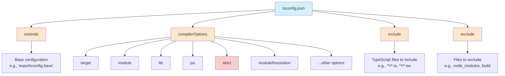

## Section 8: Configuring TypeScript (`tsconfig.json`)

The `tsconfig.json` file is the heart of a TypeScript project. It specifies the root files and the compiler options required to compile (or transpile) the project. Understanding its basic structure and common options is crucial for managing your TypeScript setup, especially within an Expo and React Native context.

### Conceptual Content: The TypeScript Configuration File

When you create a new Expo project with TypeScript support (which is the default for `create-expo-app`), a `tsconfig.json` file is automatically generated for you. This file tells the TypeScript compiler (`tsc`) how to treat your `.ts` and `.tsx` files.

> [!IMPORTANT]
> For React Native versions 0.71 and later (including 0.73+ which Expo SDK 50+ often aligns with), TypeScript type declarations are bundled directly with the `react-native` package. This means you no longer need to install `@types/react-native` separately for these newer versions. New React Native CLI projects also use `@react-native/typescript-config` for their base `tsconfig.json`.

**1. Purpose of `tsconfig.json`**

- **Root Files:** Defines which files are part of your project.
- **Compiler Options:** Specifies how the TypeScript code should be checked, transformed, and what kind of JavaScript output should be generated.
- **Project Integration:** Helps integrate TypeScript with build tools, linters, and IDEs, ensuring consistent behavior across your development environment.

**2. Structure of `tsconfig.json`**

A typical `tsconfig.json` file is a JSON object with several top-level properties, the most important being `compilerOptions` and often `extends`, `include`, and `exclude`.



The diagram above illustrates the structure of a `tsconfig.json` file and its key components. The `extends` property allows inheriting from a base configuration, while `compilerOptions` contains the bulk of the settings that control TypeScript's behavior. The `include` and `exclude` properties determine which files are part of the compilation.

> 🛣️ **(All Learners):** Understanding `tsconfig.json` is essential for working with TypeScript in React Native projects. While Expo provides sensible defaults, knowing what these settings do will help you troubleshoot type issues and customize your project's behavior.

> 🧑‍🏫 **(Instructor-Led):** Consider showing examples of how different `compilerOptions` settings affect the compiled output. The `--showConfig` flag with the TypeScript compiler can be useful to demonstrate the complete resolved configuration.

> 🧗‍♀️ **(Self-Led):** Experiment with different `strict` mode settings to see how they affect type checking. Creating a small test project with various configurations can help solidify your understanding.

- **`compilerOptions`**: This object contains the bulk of the configuration, telling the compiler how to process your files.
- **`extends`**: Allows you to inherit configurations from another `tsconfig.json` file. Expo projects often use this to extend a base configuration (e.g., `expo/tsconfig.base`).
- **`include`**: An array of glob patterns specifying which files to include in the compilation. If not specified, it defaults to all TypeScript files (`.ts`, `.tsx`, `.d.ts`) in the containing directory and subdirectories.
- **`exclude`**: An array of glob patterns specifying files or directories to exclude from compilation (e.g., `node_modules`, build output folders).

**3. Common `compilerOptions` Relevant to Expo/React Native**

While an Expo project comes with a sensible default `tsconfig.json`, understanding some key options is beneficial:

- **`target`**: Specifies the ECMAScript target version for the generated JavaScript output. Expo's `expo/tsconfig.base` often uses a modern target like `"es2020"`. Downstream tools like Babel will handle further transpilation if needed for specific JavaScript engines.

  - Example (from `expo/tsconfig.base`): `"target": "es2020"`

- **`module`**: Specifies the module system for the generated code. `expo/tsconfig.base` typically uses `"commonjs"`. While React Native and Metro work well with ES modules (`"esnext"` or `"es2015"`), `commonjs` is often chosen in base configurations for broader tooling compatibility. The bundler (Metro) ultimately handles packaging modules correctly for the app.

  - Example (from `expo/tsconfig.base`): `"module": "commonjs"`

- **`lib`**: A list of library files to be included in the compilation. These define built-in APIs. For Expo, this often includes the target ES version (e.g., `["es2020"]`) and `"dom"` for web compatibility or libraries expecting DOM types.

  - Example (from `expo/tsconfig.base`): `"lib": ["es2020", "dom"]` (may include others like `dom.iterable`)

- **`jsx`**: Controls how JSX is processed. For React Native, `"react-native"` is the standard value used in `expo/tsconfig.base`. This preserves JSX for Babel/Metro to transform.

  - Example: `"jsx": "react-native"`

- **`moduleResolution`**: Specifies how modules are resolved. `"node"` is standard for React Native projects.

  - Example (from `expo/tsconfig.base`): `"moduleResolution": "node"` (implicitly, if not set, defaults to `node` for `commonjs` module system often)

- **`allowJs`**: If `true`, allows JavaScript files to be compiled alongside TypeScript files. Useful for gradual migration.

  - Example: `"allowJs": true`

- **`skipLibCheck`**: If `true`, skips type checking of all declaration files (`.d.ts`). This can speed up compilation times, especially in projects with many dependencies, but might hide potential type inconsistencies in library definitions.

  - Expo default: `"skipLibCheck": true` is common in `expo/tsconfig.base`.

- **`resolveJsonModule`**: If `true`, allows importing `.json` files as modules.

  - Example (from `expo/tsconfig.base`): `"resolveJsonModule": true`

- **`esModuleInterop`**: Enables interoperability between CommonJS modules and ES modules. Allows default imports from modules that don't have a default export. Crucial for the Node.js ecosystem.

  - Expo default: `"esModuleInterop": true` in `expo/tsconfig.base`.

- **`allowSyntheticDefaultImports`**: Allows default imports from modules with no default export. This option does not affect code emit, only type checking. `esModuleInterop` implies this option and is generally preferred.

- **`strict`**: A very important option. When `true`, it enables a wide range of strict type checking options, including:

  - `noImplicitAny`: Raises an error on expressions and declarations with an implied `any` type.
  - `strictNullChecks`: Makes `null` and `undefined` distinct types, preventing accidental assignment to other types (highly recommended).
  - `strictFunctionTypes`: Enables stricter checking of function type compatibility.
  - `strictBindCallApply`: Enables stricter checking of `bind`, `call`, and `apply` methods on functions.
  - `strictPropertyInitialization`: Ensures class properties are initialized in the constructor or by a property initializer.
  - `noImplicitThis`: Raises an error when `this` expressions have an `any` type.
  - `alwaysStrict`: Parses in strict mode and emits "use strict" for each source file.
  - It's highly recommended to set `"strict": true` for new projects to catch more errors and write more robust code.
  - Expo default: `"strict": true` in `expo/tsconfig.base`.

- **`baseUrl` and `paths`**: Used for configuring custom module path aliases, allowing for cleaner import statements (e.g., `import MyComponent from "@components/MyComponent"`). Requires additional setup with Babel for React Native (e.g., using `babel-plugin-module-resolver`) if not using Expo CLI's built-in support for these paths when defined in `tsconfig.json`.
  - Example:
    ```json
    "baseUrl": ".",
    "paths": {
      "@components/*": ["src/components/*"],
      "@screens/*": ["src/screens/*"]
    }
    ```

**4. Expo's `tsconfig.json`**

When you initialize an Expo project, it comes with a `tsconfig.json` file that typically looks like this:

```json
{
  "extends": "expo/tsconfig.base",
  "compilerOptions": {
    "strict": true,
    "paths": {
      "@/*": ["./*"]
    }
    // You might add other options here like custom paths for your src directory
    // e.g., "@components/*": ["src/components/*"]
  },
  "include": ["**/*.ts", "**/*.tsx", ".expo/types/**/*.ts", "expo-env.d.ts"]
}
```

- **`"extends": "expo/tsconfig.base"`**: This is key. Expo provides a base configuration (`node_modules/expo/tsconfig.base.json`) that includes many sensible defaults for React Native development (like `jsx: "react-native"`, specific `lib` entries, `esModuleInterop: true`, `skipLibCheck: true`, `strict: true`, `target: "es2020"`, `module: "commonjs"`). Your project's `tsconfig.json` then extends and can override these defaults.
- **`"strict": true`**: Enforces strict type-checking rules.
- **`"paths"`**: The default path alias `@/*` allows you to import files relative to your project root using `@/filename`.
- **`"include"`**: Specifies which files TypeScript should be aware of, including your `.ts`/`.tsx` files and type definitions generated by Expo.

It's generally recommended to stick with the Expo base configuration and only override specific options if you have a clear reason and understand the implications. The `Using TypeScript` guide in the Expo documentation is an excellent resource for more details.

> [!TIP]
> While the TypeScript compiler `tsc` is responsible for type checking, in a typical Expo/React Native project, the actual transformation of TypeScript (`.ts`/`.tsx`) code into JavaScript that runs in your app is handled by Babel, which is integrated into the Metro bundler. `tsc` is primarily used for its static analysis capabilities and to generate type declaration files (`.d.ts`) if needed. We'll cover this more in the "TypeScript Build Process" section below.

**5. TypeScript Build Process in Expo/React Native**

Understanding how TypeScript fits into the broader build process of an Expo/React Native application is helpful.

- **Role of `tsc` (TypeScript Compiler):**

  - **Static Type Checking:** This is its primary role in modern React Native/Expo development. `tsc` analyzes your code based on `tsconfig.json`, reports type errors in your IDE or console, but its JavaScript output is often not what's directly bundled.
  - **Declaration File Generation (`.d.ts`):** If you are building a library, `tsc` can generate declaration files that describe the shape of your library for other TypeScript users.

- **Role of Babel and Metro Bundler:**

  - **Transformation:** Metro, the default bundler for React Native, uses Babel to transpile your TypeScript and JSX code into JavaScript that can run on mobile devices. Babel plugins like `@babel/preset-typescript` or `@babel/plugin-transform-typescript` handle stripping type annotations and converting modern JavaScript features.
  - **Bundling:** Metro then bundles all your JavaScript modules and assets into a single file (or multiple files for optimized loading) that the app can execute.

- **Type Erasure:**
  A crucial concept is **type erasure**. All TypeScript-specific constructs (like type annotations, interfaces, type aliases) are removed during the transformation process. They do not exist in the final JavaScript bundle and therefore add no runtime overhead. Their purpose is solely for static analysis and developer tooling during development.

- **Type Inference:**
  TypeScript features a powerful type inference system. When types are not explicitly annotated, `tsc` often deduces them, reducing verbosity:

  - **Variable Initialization:** `let name = "Alice";` (name is inferred as `string`).
  - **Function Return Values:** `function add(a: number, b: number) { return a + b; }` (return type inferred as `number`).
  - **Contextual Typing:** If an expression is used where its type is known (e.g., a callback), TypeScript can infer types for parameters within that expression: `window.onclick = function(mouseEvent) { /* mouseEvent is MouseEvent */ };`.
    While inference is strong, explicit annotations for function signatures in public APIs and complex types improve clarity and maintainability.

- **Source Maps (`.map` files):**
  During transpilation, tools can generate source maps. These files map the compiled JavaScript code back to your original TypeScript source code. This allows debuggers to show your `.ts`/`.tsx` files when you're debugging, making the process much more intuitive than stepping through transpiled JavaScript.
  The `sourceMap: true` option in `compilerOptions` can enable this, although the build tools (Metro/Babel) often manage source map generation in an integrated way.

- **Expo Specifics:**
  - **TypeScript Version:** Expo SDKs generally align with recent React Native versions, recommending TypeScript 5.0+ for SDKs like 52 and above.
  - **Automatic Type Generation:** Some Expo libraries may generate types automatically during the build or via `npx expo customize tsconfig.json`, ensuring accurate types for Expo's native modules.

This layered approach leverages `tsc` for robust type checking and Babel for flexible JavaScript transformation, providing a productive and safe development experience.

> 📚 **Official Documentation:**
>
> - [TypeScript Handbook - `tsconfig.json`](https://www.typescriptlang.org/docs/handbook/tsconfig-json.html)
> - [Expo Documentation: Using TypeScript](https://docs.expo.dev/guides/typescript/)
> - [React Native Documentation: Using TypeScript](https://reactnative.dev/docs/typescript)

Understanding the `tsconfig.json` file empowers you to customize TypeScript's behavior to suit your project's needs, although for most Expo projects, the defaults provided are excellent starting points.

### Challenge 6: Typing a Pharmacy API Response

This challenge will test your ability to apply various TypeScript concepts learned in this module, including interfaces, basic types, and potentially arrays or nested objects, to accurately type a complex data structure.

**Objective:**
Define TypeScript interfaces and types to accurately represent a complex JSON response from a mock SpeedyMeds pharmacy API. This API response contains information about a specific medication, including its details, patient prescription data, and pharmacy stock levels.

**Scenario:**
The SpeedyMeds system needs to fetch comprehensive details for a medication. The (mock) API endpoint `/api/medication/:medicationId/details` returns a JSON object with the following structure:

```json
// Example Mock API Response for /api/medication/MED001/details
{
  "medicationInfo": {
    "id": "MED001",
    "name": "Amoxicillin",
    "genericName": "Amoxicillin Trihydrate",
    "manufacturer": "SpeedyPharm Inc.",
    "dosageForm": "Capsule", // Could be "Tablet", "Syrup", "Injection"
    "strength": "250mg",
    "requiresPrescription": true,
    "storageInstructions": "Store at room temperature away from moisture and heat.",
    "interactions": [
      { "drugName": "Warfarin", "severity": "Major" },
      { "drugName": "Methotrexate", "severity": "Moderate" }
    ]
  },
  "patientPrescriptions": [
    {
      "prescriptionId": "RX78910",
      "patientId": "PAT123",
      "patientName": "John Doe",
      "dosagePrescribed": "1 capsule every 8 hours",
      "quantity": 30,
      "refillsRemaining": 2,
      "datePrescribed": "2023-10-15T00:00:00.000Z",
      "prescribingDoctor": {
        "id": "DOC005",
        "name": "Dr. Emily Carter",
        "specialty": "General Practice"
      }
    },
    {
      "prescriptionId": "RX11121",
      "patientId": "PAT456",
      "patientName": "Jane Smith",
      "dosagePrescribed": "1 capsule every 12 hours",
      "quantity": 20,
      "refillsRemaining": 0,
      "datePrescribed": "2023-11-01T00:00:00.000Z",
      "prescribingDoctor": {
        "id": "DOC007",
        "name": "Dr. Alan Grant",
        "specialty": "Pediatrics"
      }
    }
  ],
  "pharmacyStock": [
    {
      "pharmacyId": "PHARM001",
      "pharmacyName": "SpeedyMeds Downtown",
      "stockLevel": 157,
      "lastRestocked": "2023-12-01T00:00:00.000Z"
    },
    {
      "pharmacyId": "PHARM002",
      "pharmacyName": "SpeedyMeds Uptown",
      "stockLevel": 88,
      "lastRestocked": "2023-11-28T00:00:00.000Z"
    }
  ],
  "lastUpdatedAt": "2023-12-10T10:30:00.000Z"
}
```
