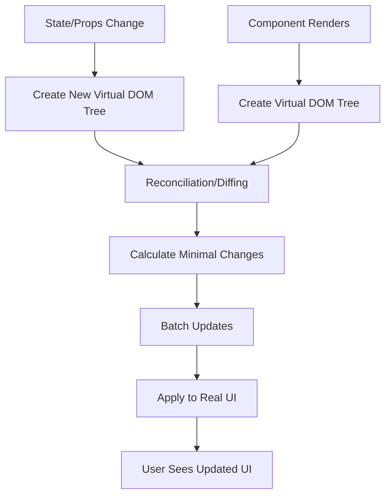

## Section 3: Components (Functional Components Focus, Class Components Brief Mention)

In this section, we delve deeper into React components, the fundamental building blocks of React applications. We will focus primarily on functional components, which are the modern standard, and briefly touch upon class components for context.

### What are Components?

As introduced earlier, components are independent, reusable pieces of code that describe a part of the user interface. They can be as simple as a button or as complex as an entire screen. Components can contain other components, allowing you to build a tree-like structure for your UI.

In React (and therefore React Native), there are two main types of components:

1.  **Functional Components:** These are JavaScript functions that accept an optional `props` object and return JSX to describe the UI.
2.  **Class Components:** These are ES6 classes that extend `React.Component`. They have a `render()` method that returns JSX, and can also use lifecycle methods and state (though Hooks now provide these for functional components).

For this course, and in modern React development, **we will primarily use functional components with Hooks.**

### Functional Components

Functional components are the simpler way to define components. They are just JavaScript functions.

Here's a basic functional component in TypeScript:

```tsx
import React from "react";
import { Text, View } from "react-native"; // Import React Native components

// Define a type for the component's props (optional, but good practice)
interface GreetingProps {
  name: string;
}

const Greeting = (props: GreetingProps) => {
  return (
    <View>
      <Text>Hello, {props.name} from SpeedyMeds!</Text>
    </View>
  );
};

// To use this component elsewhere:
// <Greeting name="Dr. Smith" />

export default Greeting; // Exporting for use in other files
```

**Key characteristics of functional components:**

- They are plain JavaScript functions.
- They accept `props` (properties) as an argument, which is an object containing data passed from a parent component.
- They return JSX that describes the UI structure.
- With Hooks (like `useState` and `useEffect`), they can have state and lifecycle features, making them as powerful as class components.
- They are generally more concise and easier to read and test.

**Advantages of Functional Components (especially with Hooks):**

- **Simplicity & Readability:** Functional components are generally more concise and easier to read and write compared to class components, involving less boilerplate code. A significant factor contributing to this simplicity is the absence of the `this` keyword, which can be a source of confusion in JavaScript classes.
- **Hooks are a Game-Changer:** The introduction of React Hooks (e.g., `useState`, `useEffect`) in React 16.8 was transformative. Hooks empower functional components to manage local state, handle side effects (like data fetching or subscriptions), and access context—functionalities previously exclusive to class components. This has made functional components capable of handling virtually all use cases.
- **Performance Considerations:** Functional components can offer slight performance benefits as they avoid the overhead associated with class instantiation and method binding. While the difference might be negligible in many real-world applications, functional components are generally lighter and can be more easily optimized by React itself.
- **Testability:** Functional components are often easier to test, especially when written as "pure functions" (i.e., given the same props, they always return the same UI and have no side effects). Their simpler structure makes them more straightforward to unit test.
- **Conciseness:** They typically result in less overall code compared to their class-based counterparts.
- **Preferred Approach:** The official React team and the broader React community advocate for using functional components with Hooks for new development projects.

The introduction of Hooks marked a significant paradigm shift, elevating functional components to first-class citizens capable of handling all types of component logic. Before Hooks, any component requiring local state or lifecycle methods had to be a class component. Hooks provide a cleaner, more direct way to "hook into" React's state and lifecycle features from within functional components. This not only simplified component structure but also enabled better patterns for reusing stateful logic through custom Hooks, effectively avoiding the complexities of `this` keyword management and class inheritance common with class components.

Functional components, by their nature as JavaScript functions, align well with React's core philosophy of composition over inheritance. They are easy to combine and compose into more complex UI structures. Custom Hooks further enhance this by allowing developers to extract and reuse stateful logic across different functional components.

**Example: A Simple MedicationDisplay Component**

Let's create a simple component for our SpeedyMeds theme to display a medication name.

```tsx
import React from "react";
import { Text, View, StyleSheet } from "react-native";

interface MedicationDisplayProps {
  medicationName: string;
  dosage: string;
}

const MedicationDisplay: React.FC<MedicationDisplayProps> = ({
  medicationName,
  dosage,
}) => {
  return (
    <View style={styles.container}>
      <Text style={styles.nameText}>Medication: {medicationName}</Text>
      <Text style={styles.dosageText}>Dosage: {dosage}</Text>
    </View>
  );
};

const styles = StyleSheet.create({
  container: {
    padding: 10,
    backgroundColor: "#f0f0f0",
    marginBottom: 5,
    borderRadius: 5,
  },
  nameText: {
    fontSize: 16,
    fontWeight: "bold",
  },
  dosageText: {
    fontSize: 14,
    color: "#333",
  },
});

export default MedicationDisplay;

// How to use it:
// import MedicationDisplay from './MedicationDisplay';
// ...
// <MedicationDisplay medicationName="Amoxicillin" dosage="250mg" />
```

This example defines a `MedicationDisplay` component that accepts `medicationName` and `dosage` as props and displays them. It also includes some basic styling using `StyleSheet` (which we'll cover in detail later). Notice the use of `React.FC<MedicationDisplayProps>` (Functional Component) as a type for the component. `React.FC` is a utility type in TypeScript for React functional components; it provides type checking for props and implicitly includes `children` as an optional prop.

### Class Components

Before Hooks were introduced in React 16.8, class components were the only way to have state and lifecycle methods within a component. Understanding their structure and lifecycle is crucial for developers who may need to work with or migrate older React projects, and it provides valuable context for understanding why Hooks were introduced and the problems they aimed to solve.

Class components are ES6 classes that extend `React.Component`.

**Example: A Class Component with State and Lifecycle Methods**

```tsx
import React, { Component } from "react";
import { Text, View, StyleSheet, Button } from "react-native";

interface MedicationReminderProps {
  medicationName: string;
  initialDosesRemaining: number;
}

interface MedicationReminderState {
  dosesRemaining: number;
  lastTakenAt: Date | null;
  isLowStock: boolean;
}

class MedicationReminder extends Component<MedicationReminderProps, MedicationReminderState> {
  // Class property for timer ID (doesn't need to be in state)
  private checkStockTimer: NodeJS.Timeout | null = null;
  
  // Constructor for initialization
  constructor(props: MedicationReminderProps) {
    super(props); // Must call super(props) first
    
    // Initialize state
    this.state = {
      dosesRemaining: props.initialDosesRemaining,
      lastTakenAt: null,
      isLowStock: props.initialDosesRemaining < 5
    };
    
    // Binding methods to this instance (necessary for callbacks)
    this.takeDose = this.takeDose.bind(this);
    this.refillMedication = this.refillMedication.bind(this);
  }
  
  // Lifecycle method: after component mounts
  componentDidMount() {
    console.log(`MedicationReminder for ${this.props.medicationName} mounted`);
    
    // Set up a timer to check stock periodically
    this.checkStockTimer = setInterval(() => {
      if (this.state.dosesRemaining < 5 && !this.state.isLowStock) {
        this.setState({ isLowStock: true });
      }
    }, 60000); // Check every minute
  }
  
  // Lifecycle method: after component updates
  componentDidUpdate(prevProps: MedicationReminderProps, prevState: MedicationReminderState) {
    // Compare previous props/state to current to decide what to do
    if (prevState.dosesRemaining !== this.state.dosesRemaining) {
      console.log(`Doses remaining changed: ${this.state.dosesRemaining}`);
      
      // Update isLowStock based on new dosesRemaining
      if (this.state.dosesRemaining < 5 && !this.state.isLowStock) {
        this.setState({ isLowStock: true });
      } else if (this.state.dosesRemaining >= 5 && this.state.isLowStock) {
        this.setState({ isLowStock: false });
      }
    }
  }
  
  // Lifecycle method: before component unmounts
  componentWillUnmount() {
    console.log(`MedicationReminder for ${this.props.medicationName} will unmount`);
    
    // Clean up timer to prevent memory leaks
    if (this.checkStockTimer) {
      clearInterval(this.checkStockTimer);
    }
  }
  
  // Class method to handle taking a dose
  takeDose() {
    this.setState(prevState => ({
      dosesRemaining: prevState.dosesRemaining - 1,
      lastTakenAt: new Date()
    }));
  }
  
  // Class method to handle refilling medication
  refillMedication() {
    this.setState({
      dosesRemaining: 30, // Refill to 30 doses
      isLowStock: false
    });
  }
  
  // Required render method
  render() {
    const { medicationName } = this.props;
    const { dosesRemaining, lastTakenAt, isLowStock } = this.state;
    
    return (
      <View style={styles.container}>
        <Text style={styles.title}>{medicationName}</Text>
        <Text style={styles.dosage}>Doses remaining: {dosesRemaining}</Text>
        
        {lastTakenAt && (
          <Text style={styles.lastTaken}>
            Last taken: {lastTakenAt.toLocaleTimeString()}
          </Text>
        )}
        
        {isLowStock && (
          <Text style={styles.warning}>Low stock! Please refill soon.</Text>
        )}
        
        <View style={styles.buttonContainer}>
          <Button
            title="Take Dose"
            onPress={this.takeDose}
            disabled={dosesRemaining <= 0}
          />
          <Button
            title="Refill"
            onPress={this.refillMedication}
          />
        </View>
      </View>
    );
  }
}

const styles = StyleSheet.create({
  container: {
    padding: 16,
    backgroundColor: "#f8f8f8",
    borderRadius: 8,
    marginVertical: 8,
  },
  title: {
    fontSize: 18,
    fontWeight: "bold",
    marginBottom: 8,
  },
  dosage: {
    fontSize: 16,
    marginBottom: 4,
  },
  lastTaken: {
    fontSize: 14,
    color: "#666",
    marginBottom: 4,
  },
  warning: {
    color: "red",
    fontWeight: "bold",
    marginVertical: 8,
  },
  buttonContainer: {
    flexDirection: "row",
    justifyContent: "space-between",
    marginTop: 12,
  },
});

export default MedicationReminder;
```

This comprehensive example demonstrates the key aspects of class components:

**1. Constructor and `super(props)`**

If a class component has a constructor, it's called before the component is mounted.

- It MUST call `super(props)` as the first statement. This initializes the parent `React.Component` and makes `this.props` available in the constructor.
- It's primarily used to:
  - Initialize local state: `this.state = { count: 0 };`
  - Bind event handler methods to the component instance: `this.handleIncrement = this.handleIncrement.bind(this);` (This was necessary to ensure `this` inside `handleIncrement` refers to the component instance).

**2. `render()` Method**

The `render()` method is the only strictly required method in a class component. It returns the JSX describing the component's UI. React calls `render()` when props or state change.

**3. `this.props` and `this.state`**

- `this.props`: Props are passed from the parent and are accessible via `this.props`. They are read-only and should not be modified by the component.
- `this.state`: Internal data managed by the component. It's initialized in the constructor (or using class fields syntax). State is updated using `this.setState({ count: 1 })`, which schedules a re-render. Directly modifying `this.state` (e.g., `this.state.count = 1;`) is incorrect as it won't trigger a re-render.

**4. Key Lifecycle Methods (Conceptual Overview)**

Class components have lifecycle methods for performing actions at different stages:

- **Mounting (Creation & Insertion):**
  - `constructor(props)`: Initialize state, bind methods.
  - `render()`: Returns JSX.
  - `componentDidMount()`: Called after the component is in the DOM. Used for network requests, subscriptions, DOM interactions.
- **Updating (Re-rendering due to props/state change):**
  - `render()`: Returns updated JSX.
  - `componentDidUpdate(prevProps, prevState)`: Called after update. Used for DOM operations based on updates or network requests (conditionally, comparing `prevProps` with `this.props`).
- **Unmounting (Removal from DOM):**
  - `componentWillUnmount()`: Called before unmounting. Used for cleanup (timers, network requests, subscriptions) to prevent memory leaks.

**Historical Context & Challenges with Class Components:**

Class components, while powerful, often led to more verbose code and complexities with the `this` keyword (requiring manual binding). Related logic for a single feature could also become fragmented across different lifecycle methods (e.g., data fetching logic in `componentDidMount`, `componentDidUpdate`, and cleanup in `componentWillUnmount`). Hooks, particularly `useEffect`, allow for better colocation of such related logic, improving readability and maintainability.

Here's what a similar `Greeting` component might look like as a class component:

```tsx
import React, { Component } from "react";
import { Text, View } from "react-native";

interface GreetingProps {
  name: string;
}

class GreetingClass extends Component<GreetingProps> {
  render() {
    return (
      <View>
        <Text>Hello, {this.props.name} from SpeedyMeds! (Class Component)</Text>
      </View>
    );
  }
}

export default GreetingClass;
```

While you might encounter class components in older codebases or some third-party libraries, **new development in React and React Native strongly favors functional components with Hooks.** Hooks provide a more direct and composable way to manage state and side effects.

### Component Composition Patterns

Component composition is a powerful pattern in React that allows you to build complex UIs by combining smaller, focused components. Here are some common composition patterns that you'll encounter and use in React and React Native development:

#### 1. Container and Presentational Components

This pattern separates components into two categories:

- **Container Components:** Handle data fetching, state management, and business logic
- **Presentational Components:** Focus on how things look, receiving data via props and rendering UI

```tsx
// Container Component
const MedicationListContainer: React.FC = () => {
  const [medications, setMedications] = useState<Medication[]>([]);
  const [loading, setLoading] = useState(true);
  
  useEffect(() => {
    // Fetch data, manage state, handle business logic
    fetchMedications()
      .then(data => {
        setMedications(data);
        setLoading(false);
      })
      .catch(error => {
        console.error("Failed to fetch medications:", error);
        setLoading(false);
      });
  }, []);
  
  return (
    <MedicationList
      medications={medications}
      loading={loading}
    />
  );
};

// Presentational Component
interface MedicationListProps {
  medications: Medication[];
  loading: boolean;
}

const MedicationList: React.FC<MedicationListProps> = ({ medications, loading }) => {
  if (loading) {
    return <Text>Loading medications...</Text>;
  }
  
  return (
    <View>
      <Text style={styles.heading}>Your Medications</Text>
      {medications.length === 0 ? (
        <Text>No medications found.</Text>
      ) : (
        medications.map(med => (
          <MedicationItem key={med.id} medication={med} />
        ))
      )}
    </View>
  );
};
```

#### 2. Compound Components

Compound components work together to provide a cohesive experience, with a parent component managing shared state and child components that are meant to be used together.

```tsx
// A simplified example of compound components
import React, { createContext, useContext, useState } from 'react';
import { View, Text, Pressable, StyleSheet } from 'react-native';

// Create a context for the accordion state
const AccordionContext = createContext<{
  expandedId: string | null;
  toggleItem: (id: string) => void;
}>({
  expandedId: null,
  toggleItem: () => {},
});

// Parent component
const Accordion: React.FC<{ children: React.ReactNode }> = ({ children }) => {
  const [expandedId, setExpandedId] = useState<string | null>(null);
  
  const toggleItem = (id: string) => {
    setExpandedId(expandedId === id ? null : id);
  };
  
  return (
    <AccordionContext.Provider value={{ expandedId, toggleItem }}>
      <View style={styles.accordion}>
        {children}
      </View>
    </AccordionContext.Provider>
  );
};

// Child component for accordion items
interface AccordionItemProps {
  id: string;
  title: string;
  children: React.ReactNode;
}

const AccordionItem: React.FC<AccordionItemProps> = ({ id, title, children }) => {
  const { expandedId, toggleItem } = useContext(AccordionContext);
  const isExpanded = expandedId === id;
  
  return (
    <View style={styles.item}>
      <Pressable
        style={styles.header}
        onPress={() => toggleItem(id)}
      >
        <Text style={styles.title}>{title}</Text>
        <Text>{isExpanded ? '▼' : '▶'}</Text>
      </Pressable>
      
      {isExpanded && (
        <View style={styles.content}>
          {children}
        </View>
      )}
    </View>
  );
};

// Usage
const MedicationAccordion = () => (
  <Accordion>
    <AccordionItem id="med1" title="Amoxicillin">
      <Text>Take 500mg three times daily with food.</Text>
    </AccordionItem>
    <AccordionItem id="med2" title="Lisinopril">
      <Text>Take 10mg once daily in the morning.</Text>
    </AccordionItem>
  </Accordion>
);

const styles = StyleSheet.create({
  accordion: {
    borderWidth: 1,
    borderColor: '#ddd',
    borderRadius: 4,
    overflow: 'hidden',
  },
  item: {
    borderBottomWidth: 1,
    borderBottomColor: '#ddd',
  },
  header: {
    flexDirection: 'row',
    justifyContent: 'space-between',
    padding: 16,
    backgroundColor: '#f5f5f5',
  },
  title: {
    fontWeight: 'bold',
  },
  content: {
    padding: 16,
    backgroundColor: '#fff',
  },
});
```

#### 3. Higher-Order Components (HOCs)

HOCs are functions that take a component and return a new enhanced component. While less common in modern React with the introduction of Hooks, they're still found in many libraries.

```tsx
// A simple HOC that adds loading functionality
function withLoading<P extends object>(
  WrappedComponent: React.ComponentType<P>
) {
  return function WithLoading(props: P & { isLoading?: boolean; loadingMessage?: string }) {
    const { isLoading = false, loadingMessage = "Loading...", ...componentProps } = props;
    
    if (isLoading) {
      return <Text>{loadingMessage}</Text>;
    }
    
    return <WrappedComponent {...(componentProps as P)} />;
  };
}

// Usage
const MedicationDetails: React.FC<{ medication: Medication }> = ({ medication }) => (
  <View>
    <Text>{medication.name}</Text>
    <Text>{medication.dosage}</Text>
  </View>
);

const MedicationDetailsWithLoading = withLoading(MedicationDetails);

// Then in a parent component:
// <MedicationDetailsWithLoading isLoading={loading} medication={medication} />
```

#### 4. Render Props

This pattern involves passing a function as a prop that a component can call to render something.

```tsx
interface DataFetcherProps<T> {
  fetchFunction: () => Promise<T>;
  render: (data: T | null, loading: boolean, error: Error | null) => React.ReactNode;
}

function DataFetcher<T>({ fetchFunction, render }: DataFetcherProps<T>) {
  const [data, setData] = useState<T | null>(null);
  const [loading, setLoading] = useState(true);
  const [error, setError] = useState<Error | null>(null);
  
  useEffect(() => {
    setLoading(true);
    fetchFunction()
      .then(result => {
        setData(result);
        setLoading(false);
      })
      .catch(err => {
        setError(err);
        setLoading(false);
      });
  }, [fetchFunction]);
  
  return <>{render(data, loading, error)}</>;
}

// Usage
const MedicationScreen = () => (
  <DataFetcher
    fetchFunction={() => api.fetchMedications()}
    render={(medications, loading, error) => {
      if (loading) return <Text>Loading medications...</Text>;
      if (error) return <Text>Error: {error.message}</Text>;
      if (!medications || medications.length === 0) return <Text>No medications found</Text>;
      
      return (
        <View>
          {medications.map(med => (
            <MedicationItem key={med.id} medication={med} />
          ))}
        </View>
      );
    }}
  />
);
```

These composition patterns provide powerful ways to organize your React and React Native code, promoting reusability, separation of concerns, and maintainability. Modern React development often combines these patterns with Hooks to create even more flexible and composable components.

> ⚛️ **(Web Developers with React Experience):**
>
> **Comparison:** The distinction and preference for functional components with Hooks over class components are the same in React Native as in React for web. If you've been working with modern React, this will be very familiar.
>
> **Key Takeaway:** Continue using functional components and Hooks. Class components are mainly for understanding legacy code.
>
> **Source:** [React Docs: Hooks at a Glance](https://react.dev/reference/react/hooks)

> 🅰️ **(Web Developers with Angular/Other Framework Experience):**
>
> **Comparison:** Angular components are class-based (using TypeScript classes and decorators like `@Component`). React's functional components are a more lightweight approach. Think of them as functions that render UI based on input (props) and internal state (managed by Hooks).
>
> **Key Takeaway:** Embrace the functional programming paradigm for components in React. Logic that you might encapsulate in class methods in Angular will often be handled by Hooks or helper functions within or outside your functional components.
>
> **Source:** [Angular Docs: Component Overview](https://angular.io/guide/component-overview), [React Docs: Functional and Class Components](https://legacy.reactjs.org/docs/components-and-props.html#function-and-class-components)

> 📲 **(Native Developers - Android/iOS):**
>
> **Comparison:** In native development, UI elements or controllers often have a class-based structure (e.g., `UIViewController` in iOS, `Activity` or `Fragment` in Android). React's functional components might seem simpler. They don't inherit from a large base class by default; instead, they gain capabilities through composition and Hooks.
>
> **Key Takeaway:** Functional components are the primary way to define UI elements. Their "lifecycle" and state are managed using specific Hooks like `useEffect` and `useState`, which we will cover soon.
>
> **Source:** [React Native Docs: Core Components and Native Components](https://reactnative.dev/docs/intro-react-native-components) (Illustrates React component usage for native views)

Understanding how to create and use components is central to React development. In the next sections, we'll explore how to pass data into components using props and how components can manage their own internal data using state.

> 📚 **Official Documentation:**
>
> - [React Docs: Your First Component](https://react.dev/learn/your-first-component)
> - [React Docs: Components and Props](https://react.dev/learn/passing-props-to-a-component)
> - [React Docs: Composition vs Inheritance](https://legacy.reactjs.org/docs/composition-vs-inheritance.html)
> - [React Docs: Reconciliation](https://legacy.reactjs.org/docs/reconciliation.html)
> - [React Native Docs: Core Components and Native Components](https://reactnative.dev/docs/intro-react-native-components)

---

### Exercise 7.1: Creating Functional Components

Now it's time to practice creating your own functional components.

**Objective:** Create a simple `PatientInfoCard` functional component that accepts and displays a patient's name and age. Then, use this component to display information for two different patients.

**Instructions:**

1.  Define a functional component named `PatientInfoCard`.
2.  It should accept `name` (string) and `age` (number) as props.
3.  The component should render a `<View>` containing two `<Text>` elements: one for the patient's name and one for their age.
4.  Style the card and text elements minimally (e.g., a border for the card, different font sizes for name and age).
5.  In your main `App` component (or a similar entry point in CodeSandbox), render two instances of `PatientInfoCard` with different patient data.

**Tool:** CodeSandbox

**(https://codesandbox.io/s/react-native-exercise-7-1-patient-info-card-m5c7xj)**

_A solution will be provided by your instructor or in the course materials._

### Component Composition

A core principle in React is building complex UIs by combining smaller, simpler, and reusable components. This approach, known as composition, is favored over class inheritance for achieving code reuse and flexibility.

**1. Building UIs by Combining Components**

Instead of monolithic UI structures, you create small, independent components, each responsible for a specific part of the UI or functionality. These are then composed—typically by nesting them within other components—to create complex interfaces. A component can render other components in its output, forming a tree-like UI structure.

**2. Containment: `props.children`**

Some components act as generic "boxes" or containers without knowing their children ahead of time. They use the special `props.children` prop to render whatever content is passed between their opening and closing JSX tags.

```tsx
import React from "react";
import { View, Text, StyleSheet } from "react-native";

interface CardProps {
  children?: React.ReactNode; // Make children prop explicit and typed
  title?: string;
}

const Card: React.FC<CardProps> = ({ children, title }) => {
  return (
    <View style={styles.cardContainer}>
      {title && <Text style={styles.cardTitle}>{title}</Text>}
      {children}
    </View>
  );
};

const styles = StyleSheet.create({
  cardContainer: {
    borderWidth: 1,
    borderColor: "#ddd",
    borderRadius: 8,
    padding: 16,
    marginVertical: 8,
    backgroundColor: "#fff",
  },
  cardTitle: {
    fontSize: 18,
    fontWeight: "bold",
    marginBottom: 8,
  },
});

// Usage:
// <Card title="Patient Details">
//   <Text>Name: John Doe</Text>
//   <Text>Condition: Stable</Text>
// </Card>

export default Card;
```

In this `Card` example, any JSX nested within `<Card>...</Card>` tags will be passed as `props.children` and rendered inside the `View`.

**3. Specialization**

This pattern involves creating a more "specific" component that renders a more "generic" one and configures it with particular props. This allows reuse of the generic component's structure and behavior while providing variations.

```tsx
// Assuming a generic Dialog component exists:
// function Dialog(props: { type: string; title: string; message: string; children?: React.ReactNode }) {
//   return (
//     <View style={/* styles for dialog based on props.type */}>
//       <Text>{props.title}</Text>
//       <Text>{props.message}</Text>
//       {props.children}
//     </View>
//   );
// }

interface ConfirmationDialogProps {
  message: string;
  onConfirm: () => void;
  onCancel: () => void;
}

// A conceptual example of a specialized Dialog component
// For this to be runnable, a `Dialog` component and `Button` component (from react-native or a library) would need to be defined/imported.
const ConfirmationDialog: React.FC<ConfirmationDialogProps> = ({ message, onConfirm, onCancel }) => {
  // Simplified conceptual Dialog structure for illustration
  const Dialog = (props: { type: string; title: string; message: string; children?: React.ReactNode }) => (
    <View style={{ borderWidth: 1, padding: 10, margin: 5, borderColor: props.type === 'warning' ? 'orange' : 'grey' }}>
      <Text style={{ fontWeight: 'bold' }}>{props.title}</Text>
      <Text>{props.message}</Text>
      <View style={{ flexDirection: 'row', justifyContent: 'flex-end', marginTop: 10 }}>{props.children}</View>
    </View>
  );
  // Simplified conceptual Button for illustration
  const Button = (props: {title: string, onPress: () => void}) => <Text onPress={props.onPress} style={{color: 'blue', marginLeft:10}}>{props.title}</Text>;

  return (
    <Dialog type="warning" title="Confirm Action" message={message}>
      <Button title="Confirm" onPress={onConfirm} />
      <Button title="Cancel" onPress={onCancel} />
    </Dialog>
  );
};

Beyond `props.children`, components can also define multiple "slots" for composition by accepting other props that expect React elements. For example, a `LayoutComponent` might have `header` and `footer` props: `<LayoutComponent header={<AppHeader />} footer={<AppFooter />} />`.

**4. Why Composition is Favored Over Inheritance**

React strongly recommends composition over class inheritance for reusing code and behavior:

- **Flexibility & Simplicity:** Props and composition offer a clear, explicit, and safe way to customize a component's look and behavior.
- **Avoiding Inheritance Problems:** Class inheritance in UIs can lead to complex, fragile hierarchies (e.g., "fragile base class problem," tight coupling). Composition promotes looser coupling.
- **Reusing Non-UI Logic:** For non-UI functionality (e.g., data formatting, business logic), React suggests extracting it into separate JavaScript modules or, in modern React, custom Hooks. These can be imported and used by any component without needing inheritance.

The compositional model in React allows significantly greater flexibility and reusability. A single generic component can be adapted for numerous use cases by passing different children or props.

### React's Virtual DOM and Reconciliation

One of React's key innovations for performance and its declarative programming model is the use of a Virtual DOM and an efficient reconciliation process.

#### The Virtual DOM: An In-Memory Representation

The Virtual DOM is a lightweight JavaScript representation of the actual UI structure. It's essentially a tree of JavaScript objects that mirrors what the real UI should look like. This concept is fundamental to React's performance optimization strategy.

**How the Virtual DOM Works:**

1. **Creation:** When you render a React component, React creates a Virtual DOM tree representing the UI structure.

2. **Immutability:** Each time state or props change, React creates a completely new Virtual DOM tree rather than modifying the existing one.

3. **Efficiency:** Manipulating JavaScript objects in memory is much faster than directly manipulating the browser's DOM or native UI elements.

4. **Abstraction:** The Virtual DOM provides a consistent programming model regardless of the rendering target (web DOM, native views, etc.).

In React Native, the concept is similar, but instead of representing DOM elements, the Virtual DOM represents native UI components. The JavaScript thread maintains this virtual representation, which is then used to determine what changes need to be sent to the native UI thread.

#### Reconciliation: The Diffing Algorithm

Reconciliation is the process of comparing a new Virtual DOM tree with the previous one to determine what changes need to be made to the actual UI.

**The Reconciliation Process:**

1. **Tree Generation:** When a component's state or props change, React generates a new Virtual DOM tree.

2. **Diffing:** React compares this new tree with the previous one using a diffing algorithm.

3. **Change Calculation:** React identifies the minimal set of changes needed to update the actual UI.

4. **Batch Updates:** React batches these changes and applies them efficiently to the real UI.

**Key Reconciliation Heuristics:**

React's diffing algorithm uses several heuristics to achieve O(n) complexity instead of the theoretical O(n³) for tree comparison:

1. **Element Type Comparison:**
   - **Different Types:** If two elements have different types (e.g., `<View>` changes to `<Text>`), React tears down the old subtree and builds a new one from scratch.
   - **Same Type:** If elements have the same type, React keeps the same DOM node/native view and only updates the changed attributes.

   ```jsx
   // React will rebuild the entire subtree
   // Old: <View><Text>Hello</Text></View>
   // New: <Text>Hello</Text>
   
   // React will only update attributes
   // Old: <Text style={{color: 'red'}}>Hello</Text>
   // New: <Text style={{color: 'blue'}}>Hello</Text>
   ```

2. **Component Instances:**
   - When a component type stays the same, its instance is preserved between renders.
   - This means state is maintained and only the props are updated.

3. **List Reconciliation:**
   - When updating lists, React by default compares items at the same position in both trees.
   - This can be inefficient for reordered lists, which is why the `key` prop is crucial.
   - With keys, React can identify which items have been added, removed, or reordered.

   ```jsx
   // Without keys, reordering is inefficient
   <View>
     {items.map(item => <ListItem item={item} />)}
   </View>
   
   // With keys, React can track items across renders
   <View>
     {items.map(item => <ListItem key={item.id} item={item} />)}
   </View>
   ```

#### Diagram: Virtual DOM and Reconciliation Process



#### Performance Implications

The Virtual DOM and reconciliation process have significant performance benefits:

1. **Batched Updates:** Multiple state changes can be batched into a single update, reducing the number of expensive UI operations.

2. **Minimal Changes:** Only the parts of the UI that actually need to change are updated, rather than re-rendering everything.

3. **Abstraction Layer:** Developers can write declarative code without worrying about the optimal sequence of imperative UI updates.

4. **Cross-Platform Consistency:** The same reconciliation process works for both web and mobile, providing a consistent development experience.

Understanding the Virtual DOM and reconciliation is crucial for optimizing React and React Native applications, especially when dealing with complex UIs or performance-sensitive scenarios. This knowledge helps you make informed decisions about component structure, state management, and rendering optimizations.

The Virtual DOM and reconciliation are fundamental to React's performance. They allow developers to declaratively define the UI for any given state, and React handles the complex task of efficiently transitioning the actual UI to that state. This principle also applies to React Native, where changes determined by reconciliation in the JavaScript thread are communicated to the native UI thread to update native views.

In the next sections, we'll explore how to pass data into components using props and how components can manage their own internal data using state.

> 📚 **Official Documentation:**
>
> - [React Docs: Your First Component](https://react.dev/learn/your-first-component)
> - [React Docs: Components and Props](https://react.dev/learn/passing-props-to-a-component)
> - [React Docs: Composition vs Inheritance](https://legacy.reactjs.org/docs/composition-vs-inheritance.html)
> - [React Docs: Reconciliation](https://legacy.reactjs.org/docs/reconciliation.html)
> - [React Native Docs: Core Components and Native Components](https://reactnative.dev/docs/intro-react-native-components)

---

### Exercise 7.1: Creating Functional Components

Now it's time to practice creating your own functional components.

**Objective:** Create a simple `PatientInfoCard` functional component that accepts and displays a patient's name and age. Then, use this component to display information for two different patients.

**Instructions:**

1.  Define a functional component named `PatientInfoCard`.
2.  It should accept `name` (string) and `age` (number) as props.
3.  The component should render a `<View>` containing two `<Text>` elements: one for the patient's name and one for their age.
4.  Style the card and text elements minimally (e.g., a border for the card, different font sizes for name and age).
5.  In your main `App` component (or a similar entry point in CodeSandbox), render two instances of `PatientInfoCard` with different patient data.

**Tool:** CodeSandbox

**(https://codesandbox.io/s/react-native-exercise-7-1-patient-info-card-m5c7xj)**
```
