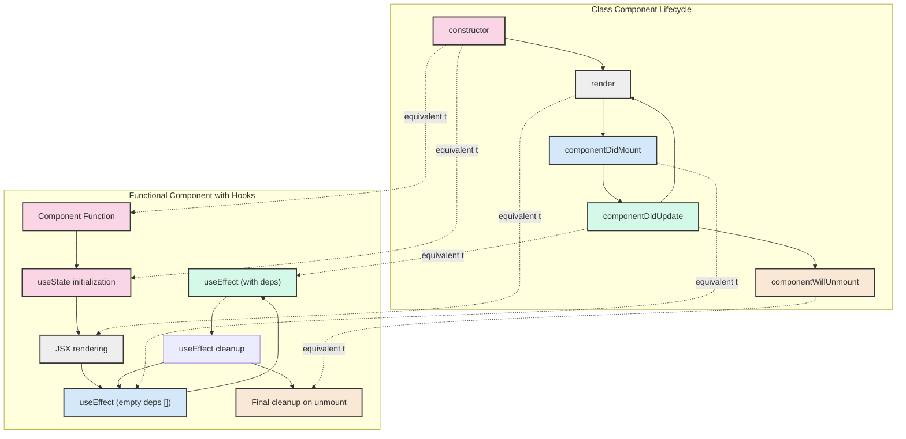

## Section 9: Component Lifecycle (`useEffect` Hook)

Components in React have a lifecycle: they are created (mounted), they update when their props or state change, and eventually, they are destroyed (unmounted). The `useEffect` Hook allows you to perform "side effects" in your functional components, which are operations that happen outside the normal rendering flow, often related to these lifecycle events.

### What are Side Effects?

Side effects are actions that your component performs that interact with the outside world, beyond just rendering UI based on props and state. Common side effects include:

- Fetching data from an API.
- Setting up or clearing subscriptions (e.g., to event listeners, timers).
- Manually changing the DOM (less common in React Native, but possible).
- Logging.

### The `useEffect` Hook

The `useEffect` Hook lets you synchronize a component with an external system. You pass it a function (the "effect") and an optional array of dependencies.

**Syntax:**

```tsx
import React, { useEffect, useState } from "react";

useEffect(() => {
  // Your effect function: runs after every render by default
  // (if no dependency array is provided)
  console.log("Component rendered or updated");

  // Optional: Return a cleanup function
  return () => {
    console.log("Cleanup before next effect or on unmount");
  };
}, [dependency1, dependency2]); // Optional dependency array
```

- **Effect Function:** The first argument to `useEffect` is a function that contains the side effect logic. This function will run _after_ React has committed changes to the screen and the browser/native view has painted (for `useEffect`).
- **Dependency Array (Optional):** The second argument is an array of dependencies. React compares each value in this array with its value from the previous render using `Object.is` comparison.
  - If you **omit** the dependency array, the effect function runs after _every_ render.
  - If you provide an **empty array `[]`**, the effect runs only _once_ after the initial render (component did mount). This works because the props and state inside an effect with an empty dependency array will always have their initial values (captured by the closure), and React compares the empty array `[]` from one render to the empty array `[]` from the next, which are considered the same, thus not re-triggering the effect.
  - If you provide an array with **variables `[propA, stateB]`**, the effect runs after the initial render and _anytime_ any of the values in the dependency array change.
- **Cleanup Function (Optional):** The effect function can optionally return another function. This is the cleanup function. React will run this cleanup function before running the effect again (if dependencies change causing a re-run) and also when the component is unmounted from the UI. This is crucial for preventing memory leaks, for example, by clearing timers or removing event listeners and subscriptions.

### Simulating Lifecycle Events with `useEffect`

**1. Running an Effect Once (Component Did Mount):**
To run an effect only once after the component mounts (similar to `componentDidMount` in class components), provide an empty dependency array `[]`.

```tsx
import React, { useState, useEffect } from "react";
import { Text, View, StyleSheet } from "react-native";

const PharmacyWelcomeMessage = () => {
  const [message, setMessage] = useState("Loading welcome message...");

  useEffect(() => {
    // This effect runs only once after the initial render
    console.log("PharmacyWelcomeMessage: Mounted");
    // Simulate fetching a welcome message for SpeedyMeds
    const timerId = setTimeout(() => {
      setMessage("Welcome to SpeedyMeds! Your health, our priority.");
    }, 2000);

    // Cleanup function: runs when the component unmounts
    return () => {
      console.log("PharmacyWelcomeMessage: Unmounting, clearing timer.");
      clearTimeout(timerId);
    };
  }, []); // Empty dependency array

  return (
    <View style={styles.container}>
      <Text>{message}</Text>
    </View>
  );
};

const stylesOne = StyleSheet.create({
  container: { padding: 10, alignItems: "center" },
});
// Note: Styles moved to avoid conflict with later examples if this file were longer.
// Actual styles would be defined once per file or imported.

export default PharmacyWelcomeMessage; // Added export for completeness
```

**2. Running an Effect When Dependencies Change (Component Did Update):**
To run an effect after the initial render and whenever specific props or state values change (similar to `componentDidUpdate`), include those values in the dependency array.

```tsx
import React, { useState, useEffect } from "react";
import { Text, View, Button, StyleSheet } from "react-native";

interface PatientDetailsProps {
  patientId: string;
}

const PatientDetailsFetcher: React.FC<PatientDetailsProps> = ({
  patientId,
}) => {
  const [patientData, setPatientData] = useState<any>(null);
  const [loading, setLoading] = useState(false);

  useEffect(() => {
    console.log(`PatientDetailsFetcher: Effect for patientId: ${patientId}`);
    setLoading(true);
    // Simulate fetching patient data for SpeedyMeds
    let isActive = true; // Flag to prevent state updates on unmounted component
    const fetchPatientData = async () => {
      // In a real app, this would be an API call: fetch(`/api/patients/${patientId}`)
      // Consider using AbortController for real fetch requests
      await new Promise((resolve) => setTimeout(resolve, 1000)); // Simulate network delay
      if (isActive) {
        // Only update state if the component is still active
        setPatientData({
          id: patientId,
          name: `Patient ${patientId.slice(-3)}`,
          condition: "Stable",
        });
        setLoading(false);
      }
    };

    fetchPatientData();

    // Cleanup function: runs if patientId changes or component unmounts
    return () => {
      console.log(`PatientDetailsFetcher: Cleanup for patientId: ${patientId}`);
      isActive = false; // Set flag to false on cleanup
    };
  }, [patientId]); // Dependency: effect runs if patientId changes

  if (loading) {
    return <Text>Loading patient details for ID: {patientId}...</Text>;
  }

  if (!patientData) {
    return <Text>No patient data found for ID: {patientId}.</Text>;
  }

  return (
    <View style={stylesTwo.container}>
      <Text>Patient ID: {patientData.id}</Text>
      <Text>Name: {patientData.name}</Text>
      <Text>Condition: {patientData.condition}</Text>
    </View>
  );
};

const stylesTwo = StyleSheet.create({
  container: { padding: 10, marginVertical: 5, backgroundColor: "#f0f0f0" },
});
// Added export for completeness
// export default PatientDetailsFetcher;
```

In this example, if the `patientId` prop changes, the effect will re-run, fetching data for the new patient. The `isActive` flag inside the effect is a common pattern to prevent calling `setState` on an unmounted component if the asynchronous operation (like `fetchPatientData`) completes after the component has unmounted or after the `patientId` prop has changed again, triggering a new fetch and a cleanup of the previous effect.

**3. Cleanup (Component Will Unmount):**
The cleanup function returned by the effect is crucial for preventing memory leaks and issues. It runs when the component is about to be removed from the UI (unmounted) or before the effect runs again due to dependency changes.
Common use cases for cleanup:

- Clearing timers (`clearTimeout`, `clearInterval`).
- Removing event listeners.
- Canceling API subscriptions or aborting fetch requests.

Refer back to the `PharmacyWelcomeMessage` example for a `clearTimeout` cleanup, and the `PatientDetailsFetcher` example for using a flag (`isActive`) to manage async operations during cleanup.

### Diagram: `useEffect` Lifecycle

The following diagram illustrates the basic flow of the `useEffect` Hook in relation to component rendering and updates.

```mermaid
graph TD
    A[Component Renders / Re-renders] --> B{Has Dependency Array?};
    B -- No (or omitted) --> C[Run Effect After Every Render];
    B -- Yes --> D{Dependencies Changed (Object.is)?};
    C --> E{Effect Returns Cleanup Function?};
    D -- No --> F[Do Nothing];
    D -- Yes --> G[PREV: Run Previous Effect's Cleanup (if any)];
    G --> H[Run Current Effect Function];
    H --> E;
    E -- Yes --> I[Register Cleanup for Unmount / Next Effect Run];
    E -- No --> J[No Cleanup Registered for this Effect];
    K[Component Unmounts] --> L[Run All Registered Cleanups for this Component];
```

This diagram shows that when a component mounts, the effect function runs (if dependencies allow or if no array). On subsequent re-renders, React checks if the dependencies (if specified) have changed using `Object.is` comparison. If they have (or if no dependency array), the cleanup function from the previous effect (if one was returned) runs, followed by the new effect function. When the component unmounts, the cleanup function for the last run effect is executed.

> ⚛️ **(Web Developers with React Experience):**
>
> **Comparison:** `useEffect` works exactly the same way in React Native as it does in React for the web. The concepts of the effect function, dependency array, and cleanup function are identical.
>
> **Key Takeaway:** Your existing understanding of `useEffect` is directly applicable.
>
> **Source:** [React Docs: Using the Effect Hook (`useEffect`)](https://react.dev/reference/react/useEffect)

> 🅰️ **(Web Developers with Angular/Other Framework Experience):**
>
> **Comparison:** `useEffect` covers functionalities similar to Angular's lifecycle hooks like `ngOnInit`, `ngOnChanges`, and `ngOnDestroy`. However, `useEffect` is more flexible and unified. The dependency array is key to controlling when the effect runs, mimicking different lifecycle events.
>
> **Key Takeaway:** `useEffect` is the go-to Hook for handling side effects. Master the use of the dependency array to control its execution precisely.
>
> **Source:** [Angular Docs: Lifecycle hooks](https://angular.io/guide/lifecycle-hooks)

> 📲 **(Native Developers - Android/iOS):**
>
> **Comparison:** `useEffect` can be compared to lifecycle methods like `onCreate`/`onResume`/`onPause`/`onDestroy` in Android Activities/Fragments, or `viewDidLoad`/`viewWillAppear`/`viewWillDisappear` in iOS ViewControllers. The empty dependency array `[]` provides behavior similar to `onCreate` or `viewDidLoad` for setup, and the cleanup function to `onDestroy` or `viewDidDisappear` for teardown. Effects with dependencies relate to updates based on data changes.
>
> **Key Takeaway:** Use `useEffect` to manage operations that need to happen at specific points in your component's existence on the screen, such as data fetching when it appears, or cleaning up resources when it disappears.
>
> **Source:** [Android Dev Docs: Understand the Activity Lifecycle](https://developer.android.com/guide/components/activities/activity-lifecycle), [Apple Dev Docs: Managing Your View Controller's Life Cycle](https://developer.apple.com/library/archive/referencelibrary/GettingStarted/DevelopiOSAppsSwift/WorkWithViewControllers.html#//apple_ref/doc/uid/TP40015214-CH6-SW1)

The `useEffect` Hook is a powerful tool for managing side effects and synchronizing your components with the outside world. Understanding its dependency array and cleanup mechanism is crucial for writing correct and efficient React Native applications.

> 📚 **Official Documentation:**
>
> - [React Docs: Hooks - Using the Effect Hook (`useEffect`)](https://react.dev/reference/react/useEffect)
> - [React Docs: Synchronizing with Effects](https://react.dev/learn/synchronizing-with-effects)
> - [React Docs: You Might Not Need an Effect](https://react.dev/learn/you-might-not-need-an-effect) (Important considerations for when _not_ to use `useEffect`)

### The useRef Hook

The `useRef` Hook is a versatile tool in React that serves two primary purposes:

1. **Accessing DOM Elements:** It provides a way to directly access and interact with DOM elements (or native components in React Native).
2. **Persisting Values Between Renders:** It stores mutable values that persist across renders without causing re-renders when changed.

#### Syntax and Basic Usage

```tsx
import React, { useRef, useEffect } from "react";
import { TextInput, View, Button, Text } from "react-native";

const MedicationSearchComponent = () => {
  // Create a ref with initial value null
  const inputRef = useRef<TextInput>(null);

  // Function to focus the input
  const focusInput = () => {
    // Access the current property to get the actual DOM/native element
    if (inputRef.current) {
      inputRef.current.focus();
    }
  };

  return (
    <View>
      <TextInput
        ref={inputRef} // Attach the ref to the TextInput
        placeholder="Search medications..."
      />
      <Button title="Focus Search" onPress={focusInput} />
    </View>
  );
};
```

#### DOM/Native Component Access

In React Native, `useRef` is commonly used to access and manipulate native components:

```tsx
import React, { useRef, useEffect } from "react";
import { TextInput, View, Button, StyleSheet, Animated } from "react-native";

const AnimatedSearchBar = () => {
  const inputRef = useRef<TextInput>(null);
  const animationValue = useRef(new Animated.Value(0)).current;

  const expandSearchBar = () => {
    // Focus the input
    if (inputRef.current) {
      inputRef.current.focus();
    }

    // Animate the width
    Animated.timing(animationValue, {
      toValue: 1,
      duration: 300,
      useNativeDriver: false,
    }).start();
  };

  const width = animationValue.interpolate({
    inputRange: [0, 1],
    outputRange: ["50%", "80%"],
  });

  return (
    <View style={styles.container}>
      <Animated.View style={[styles.searchContainer, { width }]}>
        <TextInput
          ref={inputRef}
          style={styles.input}
          placeholder="Search medications..."
        />
      </Animated.View>
      <Button title="Search" onPress={expandSearchBar} />
    </View>
  );
};

const styles = StyleSheet.create({
  container: {
    flexDirection: "row",
    alignItems: "center",
    padding: 10,
  },
  searchContainer: {
    backgroundColor: "#f0f0f0",
    borderRadius: 20,
    marginRight: 10,
  },
  input: {
    padding: 8,
  },
});
```

#### Value Persistence Between Renders

The second key use case for `useRef` is to persist values between renders without triggering re-renders:

```tsx
import React, { useRef, useEffect, useState } from "react";
import { View, Text, Button } from "react-native";

const MedicationTimer = () => {
  const [seconds, setSeconds] = useState(0);
  // Store interval ID in a ref so it persists between renders
  const intervalRef = useRef<NodeJS.Timeout | null>(null);
  // Track previous seconds value without causing re-renders
  const prevSecondsRef = useRef<number>(0);

  useEffect(() => {
    // Store the previous value after each render
    prevSecondsRef.current = seconds;
  });

  const startTimer = () => {
    if (intervalRef.current !== null) return; // Prevent multiple intervals

    intervalRef.current = setInterval(() => {
      setSeconds((s) => s + 1);
    }, 1000);
  };

  const stopTimer = () => {
    if (intervalRef.current) {
      clearInterval(intervalRef.current);
      intervalRef.current = null;
    }
  };

  const resetTimer = () => {
    stopTimer();
    setSeconds(0);
  };

  // Calculate if seconds changed by an odd or even number
  const isOddChange =
    seconds !== 0 && (seconds - prevSecondsRef.current) % 2 === 1;

  return (
    <View>
      <Text>Medication Timer: {seconds} seconds</Text>
      {isOddChange && <Text>Changed by an odd number!</Text>}
      <Button title="Start" onPress={startTimer} />
      <Button title="Stop" onPress={stopTimer} />
      <Button title="Reset" onPress={resetTimer} />
    </View>
  );
};
```

#### Key Differences Between useRef and useState

Understanding when to use `useRef` versus `useState` is important:

1. **Re-rendering Behavior:**

   - Changes to `useState` values trigger re-renders
   - Changes to `useRef.current` do NOT trigger re-renders

2. **Use Cases:**

   - Use `useState` for values that should affect the UI when they change
   - Use `useRef` for:
     - References to DOM/native elements
     - Values that need to persist between renders but shouldn't cause re-renders
     - Storing previous state values
     - Storing mutable objects that would otherwise cause unnecessary re-renders

3. **Access Pattern:**
   - `useState` provides the current value directly
   - `useRef` requires accessing the `.current` property

#### Best Practices for useRef

1. **Type Your Refs:** Always use TypeScript to properly type your refs:

   ```tsx
   const inputRef = useRef<TextInput>(null);
   const countRef = useRef<number>(0);
   ```

2. **Null Checking:** Always check if a ref is not null before accessing its properties:

   ```tsx
   if (inputRef.current) {
     inputRef.current.focus();
   }
   ```

3. **Avoid Overuse:** Don't use refs to bypass React's data flow. They should be used for imperative code that can't be expressed declaratively.

4. **Cleanup:** If your ref points to resources that need cleanup, handle that in a useEffect cleanup function:
   ```tsx
   useEffect(() => {
     return () => {
       if (intervalRef.current) {
         clearInterval(intervalRef.current);
       }
     };
   }, []);
   ```

### Creating Custom Hooks

Custom Hooks are a powerful feature in React that allows you to extract component logic into reusable functions. They follow a simple convention: their names start with "use" (e.g., `useFetchMedications`), and they can call other Hooks.

#### Why Create Custom Hooks?

1. **Code Reuse:** Extract common stateful logic to share between components
2. **Separation of Concerns:** Keep components focused on rendering, not complex logic
3. **Composition:** Combine multiple Hooks into a single, cohesive API
4. **Testability:** Isolate logic for easier testing

#### Basic Structure of a Custom Hook

```tsx
import { useState, useEffect } from "react";

// A custom hook always starts with "use"
function useCustomHook(initialValue) {
  // Can use any built-in Hooks
  const [state, setState] = useState(initialValue);

  useEffect(() => {
    // Side effects here
  }, []);

  // Can define helper functions
  const updateState = (newValue) => {
    setState(newValue);
  };

  // Return values and functions the component needs
  return {
    state,
    updateState,
  };
}
```

#### Example: Creating a useFetchData Hook

Let's create a custom Hook for fetching data that can be reused across components:

```tsx
import { useState, useEffect } from "react";

interface FetchState<T> {
  data: T | null;
  loading: boolean;
  error: Error | null;
}

function useFetchData<T>(url: string) {
  const [state, setState] = useState<FetchState<T>>({
    data: null,
    loading: true,
    error: null,
  });

  useEffect(() => {
    let isMounted = true;

    const fetchData = async () => {
      setState((prev) => ({ ...prev, loading: true }));

      try {
        const response = await fetch(url);

        if (!response.ok) {
          throw new Error(`HTTP error! Status: ${response.status}`);
        }

        const data = await response.json();

        if (isMounted) {
          setState({
            data,
            loading: false,
            error: null,
          });
        }
      } catch (error) {
        if (isMounted) {
          setState({
            data: null,
            loading: false,
            error: error instanceof Error ? error : new Error(String(error)),
          });
        }
      }
    };

    fetchData();

    return () => {
      isMounted = false;
    };
  }, [url]);

  return state;
}

// Usage in a component
const MedicationList = () => {
  const { data, loading, error } = useFetchData<Medication[]>(
    "https://api.speedymeds.com/medications"
  );

  if (loading) return <Text>Loading medications...</Text>;
  if (error) return <Text>Error: {error.message}</Text>;
  if (!data || data.length === 0) return <Text>No medications found</Text>;

  return (
    <View>
      {data.map((medication) => (
        <Text key={medication.id}>{medication.name}</Text>
      ))}
    </View>
  );
};
```

#### Example: Creating a useLocalStorage Hook for Web (or AsyncStorage for React Native)

```tsx
// For React Native, we'd use AsyncStorage instead
import { useState, useEffect } from "react";
import AsyncStorage from "@react-native-async-storage/async-storage";

function useAsyncStorage<T>(key: string, initialValue: T) {
  // State to store our value
  const [storedValue, setStoredValue] = useState<T>(initialValue);
  const [loading, setLoading] = useState(true);

  // Initialize with stored value
  useEffect(() => {
    const getStoredValue = async () => {
      try {
        const item = await AsyncStorage.getItem(key);
        const value = item ? JSON.parse(item) : initialValue;
        setStoredValue(value);
      } catch (error) {
        console.error(error);
        setStoredValue(initialValue);
      } finally {
        setLoading(false);
      }
    };

    getStoredValue();
  }, [key, initialValue]);

  // Return a wrapped version of useState's setter function that
  // persists the new value to AsyncStorage
  const setValue = async (value: T | ((val: T) => T)) => {
    try {
      // Allow value to be a function so we have the same API as useState
      const valueToStore =
        value instanceof Function ? value(storedValue) : value;

      // Save state
      setStoredValue(valueToStore);

      // Save to AsyncStorage
      await AsyncStorage.setItem(key, JSON.stringify(valueToStore));
    } catch (error) {
      console.error(error);
    }
  };

  return { storedValue, setValue, loading };
}

// Usage
const MedicationReminders = () => {
  const {
    storedValue: reminders,
    setValue: setReminders,
    loading,
  } = useAsyncStorage<string[]>("medication_reminders", []);

  const addReminder = (reminder: string) => {
    setReminders([...reminders, reminder]);
  };

  if (loading) return <Text>Loading reminders...</Text>;

  return (
    <View>
      <Text>Your Medication Reminders</Text>
      {reminders.map((reminder, index) => (
        <Text key={index}>{reminder}</Text>
      ))}
      <Button
        title="Add Reminder"
        onPress={() =>
          addReminder(`Take medication at ${new Date().toLocaleTimeString()}`)
        }
      />
    </View>
  );
};
```

#### Example: Creating a useTimer Hook

```tsx
import { useState, useRef, useEffect, useCallback } from "react";

interface TimerHookOptions {
  initialSeconds?: number;
  autoStart?: boolean;
  onComplete?: () => void;
}

function useTimer({
  initialSeconds = 0,
  autoStart = false,
  onComplete,
}: TimerHookOptions = {}) {
  const [seconds, setSeconds] = useState(initialSeconds);
  const [isActive, setIsActive] = useState(autoStart);
  const [isPaused, setIsPaused] = useState(false);
  const intervalRef = useRef<NodeJS.Timeout | null>(null);

  const clearTimer = useCallback(() => {
    if (intervalRef.current) {
      clearInterval(intervalRef.current);
      intervalRef.current = null;
    }
  }, []);

  const start = useCallback(() => {
    setIsActive(true);
    setIsPaused(false);
  }, []);

  const pause = useCallback(() => {
    setIsPaused(true);
  }, []);

  const resume = useCallback(() => {
    setIsPaused(false);
  }, []);

  const reset = useCallback(() => {
    clearTimer();
    setSeconds(initialSeconds);
    setIsActive(false);
    setIsPaused(false);
  }, [initialSeconds, clearTimer]);

  useEffect(() => {
    if (isActive && !isPaused) {
      intervalRef.current = setInterval(() => {
        setSeconds((s) => {
          if (s <= 0) {
            clearTimer();
            if (onComplete) {
              onComplete();
            }
            return 0;
          }
          return s - 1;
        });
      }, 1000);
    } else {
      clearTimer();
    }

    return clearTimer;
  }, [isActive, isPaused, clearTimer, onComplete]);

  return {
    seconds,
    isActive,
    isPaused,
    start,
    pause,
    resume,
    reset,
  };
}

// Usage
const MedicationReminder = () => {
  const { seconds, isActive, isPaused, start, pause, resume, reset } = useTimer(
    {
      initialSeconds: 60,
      onComplete: () => alert("Time to take your medication!"),
    }
  );

  return (
    <View>
      <Text>Medication Reminder: {seconds} seconds remaining</Text>
      {!isActive && !isPaused ? (
        <Button title="Start" onPress={start} />
      ) : isPaused ? (
        <Button title="Resume" onPress={resume} />
      ) : (
        <Button title="Pause" onPress={pause} />
      )}
      <Button title="Reset" onPress={reset} />
    </View>
  );
};
```

#### Best Practices for Custom Hooks

1. **Naming Convention:** Always start custom Hook names with "use" to follow React's convention.

2. **Single Responsibility:** Each custom Hook should focus on a single concern.

3. **Composition:** Build complex Hooks by composing simpler ones.

4. **TypeScript:** Use TypeScript to provide type safety for your Hooks:

   ```tsx
   function useFormField<T>(initialValue: T) {
     const [value, setValue] = useState<T>(initialValue);
     // ...
     return { value, setValue /* other values/functions */ };
   }
   ```

5. **Cleanup:** Always handle cleanup in useEffect to prevent memory leaks.

6. **Testing:** Write tests for your custom Hooks using libraries like `@testing-library/react-hooks`.

Custom Hooks are one of the most powerful features in React, allowing you to create reusable, composable pieces of stateful logic that can be shared across components without duplicating code.

### Enhanced Lifecycle Diagram: Class Methods vs Hooks

The following enhanced diagram illustrates the relationship between class component lifecycle methods and their Hook equivalents:



This diagram shows how the traditional class component lifecycle methods map to functional components with Hooks. The dotted lines indicate equivalent functionality between the class lifecycle methods and their Hook counterparts.

### A Note on `useLayoutEffect`

React also provides a Hook called `useLayoutEffect`. It has the same signature as `useEffect` (it takes an effect function and a dependency array), but it fires **synchronously** after all DOM mutations are complete, and importantly, _before_ the browser has painted the changes to the screen. This means it can block visual updates if the work inside it is slow.

- **Primary Use Case:** `useLayoutEffect` is useful for tasks that need to read layout information from the DOM (e.g., an element's size or position after it has been rendered by React but before the user sees it) and then synchronously re-render the component based on that information. This can prevent visual flickering that might occur if `useEffect` were used, as `useEffect` runs asynchronously after the browser has painted.
- **Performance Consideration:** Because it runs synchronously and blocks painting, `useLayoutEffect` should be used sparingly. For most side effects, such as data fetching, setting up subscriptions, or manual DOM changes that don't rely on immediate layout reads, **`useEffect` is the preferred choice** as it doesn't block the browser, leading to a more responsive UI.

In React Native, the distinction is similar regarding the timing relative to native view updates. Use `useLayoutEffect` only when you need to perform measurements or make changes that must be reflected visually without any intermediate inconsistent state being shown to the user.

> 📚 **Official Documentation (for `useLayoutEffect`):**
>
> - [React Docs: `useLayoutEffect`](https://react.dev/reference/react/useLayoutEffect)

---

### Exercise 7.5: Using `useEffect` for Side Effects

Let's practice using `useEffect` to perform a side effect, such as fetching data (simulated).

**Objective:** Create a `UserProfile` component that simulates fetching user data when it mounts and displays a welcome message.

**Instructions:**

1.  Define a functional component named `UserProfile`.
2.  Use `useState` to manage `userName`, initialized to `null` or an empty string.
3.  Use `useState` to manage `isLoading`, initialized to `true`.
4.  Use `useEffect` to simulate fetching user data when the component mounts (i.e., run the effect only once):
    - Inside the effect, set `isLoading` to `true` (though it's already true, good practice if fetch could be re-triggered).
    - Use `setTimeout` to simulate a network request delay (e.g., 1.5 seconds).
    - After the timeout, set `userName` to a sample name (e.g., "SpeedyMeds User").
    - Set `isLoading` to `false`.
5.  Conditionally render:
    - If `isLoading` is true, display a `<Text>` component showing "Loading profile...".
    - If `isLoading` is false and `userName` is available, display a welcome message like "Welcome, [userName]!".
6.  (Optional) Ensure your `useEffect` has an empty dependency array `[]` so it only runs on mount.

**Tool:** CodeSandbox

**(https://codesandbox.io/s/react-native-exercise-7-5-user-profile-useeffect-c38kt9)**

### Next Steps

You've now learned how to manage side effects and component lifecycle events using the powerful `useEffect` Hook, as well as leveraging `useRef` and creating custom Hooks. The final core React concept we'll cover in this module is sharing state across different parts of your application. Proceed to [Section 10: React Context API (Introduction for State Management)](./section-10-react-context-api.md).
