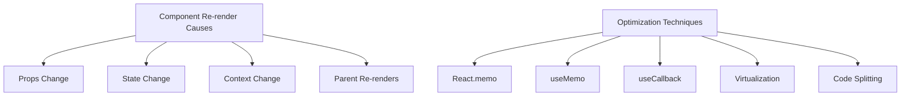

## Section 11: Performance Optimization

As React applications grow in complexity, performance optimization becomes increasingly important. This is especially true in React Native, where device constraints can make performance issues more noticeable. This section covers key techniques for optimizing your React and React Native applications.

### Understanding React's Rendering Behavior

Before diving into optimization techniques, it's important to understand what causes React components to re-render:



#### Re-render Triggers

1. **Props Change**: When a component receives new props that are different from the previous props, it will re-render.

2. **State Change**: When a component's state changes via `setState` or a state setter from `useState`, the component will re-render.

3. **Context Change**: When a context value used by a component changes, all components consuming that context will re-render.

4. **Parent Re-renders**: By default, when a parent component re-renders, all its children will re-render regardless of whether their props changed. This is often the most overlooked cause of performance issues.

Understanding these triggers is the first step in optimizing your application's performance.

### React.memo

`React.memo` is a higher-order component that memoizes the result of a component render. It prevents unnecessary re-renders by doing a shallow comparison of props.

```tsx
import React from 'react';
import { View, Text, StyleSheet } from 'react-native';

interface MedicationItemProps {
  name: string;
  dosage: string;
  frequency: string;
}

// Without memoization, this component would re-render whenever its parent re-renders
const MedicationItem: React.FC<MedicationItemProps> = ({ name, dosage, frequency }) => {
  console.log(`Rendering MedicationItem: ${name}`); // Log to demonstrate render behavior
  
  return (
    <View style={styles.container}>
      <Text style={styles.name}>{name}</Text>
      <Text style={styles.details}>Dosage: {dosage}</Text>
      <Text style={styles.details}>Frequency: {frequency}</Text>
    </View>
  );
};

// With memoization, the component only re-renders if props change
const MemoizedMedicationItem = React.memo(MedicationItem);

// You can also provide a custom comparison function
const MemoizedWithCustomComparison = React.memo(
  MedicationItem,
  (prevProps, nextProps) => {
    // Return true if you want to prevent the re-render
    // This example only re-renders if the name changes
    return prevProps.name === nextProps.name;
  }
);

const styles = StyleSheet.create({
  container: {
    padding: 10,
    backgroundColor: '#f8f8f8',
    borderRadius: 5,
    marginBottom: 10,
  },
  name: {
    fontSize: 16,
    fontWeight: 'bold',
    marginBottom: 5,
  },
  details: {
    fontSize: 14,
    color: '#666',
  },
});

export { MemoizedMedicationItem, MemoizedWithCustomComparison };
```

#### When to Use React.memo

- For components that render often but with the same props
- For components that have expensive rendering logic
- For pure functional components that don't depend on complex objects or functions as props

#### When Not to Use React.memo

- For components that almost always receive different props
- For very simple components where the overhead of comparison might exceed the rendering cost
- When the component's children are frequently changing

### useMemo

The `useMemo` Hook memoizes the result of a computation, recalculating it only when one of its dependencies changes. This is useful for expensive calculations that would otherwise be repeated on every render.

```tsx
import React, { useMemo, useState } from 'react';
import { View, Text, Button, StyleSheet } from 'react-native';

interface Medication {
  id: string;
  name: string;
  dosage: number;
  frequency: number;
  price: number;
}

interface MedicationAnalyticsProps {
  medications: Medication[];
  currency: string;
}

const MedicationAnalytics: React.FC<MedicationAnalyticsProps> = ({ 
  medications, 
  currency 
}) => {
  const [showDetails, setShowDetails] = useState(false);
  
  // Expensive calculation memoized with useMemo
  const analytics = useMemo(() => {
    console.log('Calculating medication analytics...'); // Log to demonstrate when calculation happens
    
    // Simulate an expensive calculation
    const startTime = Date.now();
    while (Date.now() - startTime < 50) {
      // Artificial delay to simulate complex computation
    }
    
    const totalMedications = medications.length;
    const totalDailyDoses = medications.reduce(
      (sum, med) => sum + med.frequency, 
      0
    );
    const averageDosage = medications.reduce(
      (sum, med) => sum + med.dosage, 
      0
    ) / totalMedications || 0;
    const totalMonthlyCost = medications.reduce(
      (sum, med) => sum + (med.price * med.frequency * 30), 
      0
    );
    
    return {
      totalMedications,
      totalDailyDoses,
      averageDosage: averageDosage.toFixed(2),
      totalMonthlyCost: totalMonthlyCost.toFixed(2)
    };
  }, [medications]); // Only recalculate when medications change
  
  // This calculation depends on both medications and currency
  const formattedCost = useMemo(() => {
    console.log('Formatting cost with currency...'); // Log to demonstrate when this runs
    
    // Format the cost based on the currency
    return `${currency} ${analytics.totalMonthlyCost}`;
  }, [analytics.totalMonthlyCost, currency]);
  
  return (
    <View style={styles.container}>
      <Text style={styles.title}>Medication Analytics</Text>
      <Text>Total Medications: {analytics.totalMedications}</Text>
      <Text>Total Daily Doses: {analytics.totalDailyDoses}</Text>
      
      {showDetails && (
        <View style={styles.details}>
          <Text>Average Dosage: {analytics.averageDosage} mg</Text>
          <Text>Monthly Cost: {formattedCost}</Text>
        </View>
      )}
      
      <Button 
        title={showDetails ? "Hide Details" : "Show Details"} 
        onPress={() => setShowDetails(!showDetails)} 
      />
    </View>
  );
};

const styles = StyleSheet.create({
  container: {
    padding: 15,
    backgroundColor: '#fff',
    borderRadius: 8,
    shadowColor: '#000',
    shadowOpacity: 0.1,
    shadowRadius: 4,
    shadowOffset: { width: 0, height: 2 },
    elevation: 3,
  },
  title: {
    fontSize: 18,
    fontWeight: 'bold',
    marginBottom: 10,
  },
  details: {
    marginTop: 10,
    paddingTop: 10,
    borderTopWidth: 1,
    borderTopColor: '#eee',
  },
});

export default MedicationAnalytics;
```

#### When to Use useMemo

- For expensive calculations that don't need to be recomputed on every render
- For creating objects that are used as dependencies in other hooks
- For values derived from props or state that are expensive to compute

#### When Not to Use useMemo

- For simple calculations where the overhead of memoization exceeds the calculation cost
- For values that change with every render anyway

### useCallback

The `useCallback` Hook returns a memoized version of a callback function that only changes if one of its dependencies changes. This is particularly useful when passing callbacks to optimized child components that rely on reference equality to prevent unnecessary renders.

```tsx
import React, { useState, useCallback } from 'react';
import { View, Text, Button, StyleSheet, FlatList } from 'react-native';

// A memoized child component that only re-renders when its props change
const MedicationButton = React.memo(({ 
  name, 
  onPress 
}: { 
  name: string; 
  onPress: () => void;
}) => {
  console.log(`Rendering MedicationButton: ${name}`); // Log to demonstrate render behavior
  
  return (
    <Button 
      title={`Take ${name}`} 
      onPress={onPress} 
    />
  );
});

interface Medication {
  id: string;
  name: string;
}

const MedicationTracker: React.FC = () => {
  const [medications] = useState<Medication[]>([
    { id: '1', name: 'Aspirin' },
    { id: '2', name: 'Ibuprofen' },
    { id: '3', name: 'Acetaminophen' },
  ]);
  
  const [takenMeds, setTakenMeds] = useState<string[]>([]);
  const [lastTaken, setLastTaken] = useState<string | null>(null);
  
  // Without useCallback, this function would be recreated on every render
  // causing MedicationButton to re-render unnecessarily
  const handleMedicationTaken = useCallback((id: string, name: string) => {
    console.log(`Medication taken: ${name}`);
    setTakenMeds(prev => [...prev, id]);
    setLastTaken(name);
  }, []);
  
  return (
    <View style={styles.container}>
      <Text style={styles.title}>Medication Tracker</Text>
      
      {lastTaken && (
        <Text style={styles.lastTaken}>
          Last taken: {lastTaken}
        </Text>
      )}
      
      <Text style={styles.subtitle}>Your Medications:</Text>
      
      <FlatList
        data={medications}
        keyExtractor={item => item.id}
        renderItem={({ item }) => (
          <View style={styles.medicationItem}>
            <Text>{item.name}</Text>
            <MedicationButton
              name={item.name}
              onPress={() => handleMedicationTaken(item.id, item.name)}
            />
          </View>
        )}
      />
      
      <Text style={styles.subtitle}>Taken Today: {takenMeds.length}</Text>
    </View>
  );
};

const styles = StyleSheet.create({
  container: {
    padding: 15,
  },
  title: {
    fontSize: 20,
    fontWeight: 'bold',
    marginBottom: 15,
  },
  subtitle: {
    fontSize: 16,
    fontWeight: 'bold',
    marginTop: 15,
    marginBottom: 10,
  },
  medicationItem: {
    flexDirection: 'row',
    justifyContent: 'space-between',
    alignItems: 'center',
    paddingVertical: 8,
    borderBottomWidth: 1,
    borderBottomColor: '#eee',
  },
  lastTaken: {
    fontSize: 14,
    fontStyle: 'italic',
    color: '#666',
    marginBottom: 10,
  },
});

export default MedicationTracker;
```

In this example, `handleMedicationTaken` is memoized with `useCallback`. Without this memoization, a new function reference would be created on every render, causing the memoized `MedicationButton` components to re-render unnecessarily.

#### When to Use useCallback

- When passing callbacks to optimized child components that use `React.memo`
- For callbacks that are dependencies in other hooks like `useEffect`
- When the callback is used in event listeners that need to be added and removed

#### When Not to Use useCallback

- For callbacks that are only used in the component's render method
- When the callback depends on many values that change frequently
- For very simple components where the overhead isn't justified

### Optimizing Lists with Virtualization

In React Native, rendering large lists can significantly impact performance. The built-in `FlatList` and `SectionList` components provide virtualization, which means they only render items that are currently visible on the screen.

```tsx
import React from 'react';
import { FlatList, Text, View, StyleSheet } from 'react-native';

interface Medication {
  id: string;
  name: string;
  dosage: string;
}

// Generate a large dataset for demonstration
const generateMedications = (count: number): Medication[] => {
  return Array.from({ length: count }, (_, i) => ({
    id: `med-${i}`,
    name: `Medication ${i}`,
    dosage: `${Math.floor(Math.random() * 500) + 50}mg`,
  }));
};

const medications = generateMedications(1000); // 1000 items

const OptimizedMedicationList: React.FC = () => {
  const renderItem = ({ item }: { item: Medication }) => (
    <View style={styles.item}>
      <Text style={styles.name}>{item.name}</Text>
      <Text style={styles.dosage}>{item.dosage}</Text>
    </View>
  );
  
  return (
    <View style={styles.container}>
      <Text style={styles.title}>Medication List (1000 items)</Text>
      
      <FlatList
        data={medications}
        renderItem={renderItem}
        keyExtractor={item => item.id}
        // Performance optimizations
        initialNumToRender={10} // Render only the first 10 items initially
        maxToRenderPerBatch={10} // Render at most 10 items per batch
        windowSize={5} // Keep 5 windows worth of items in memory
        removeClippedSubviews={true} // Detach off-screen views (experimental)
        getItemLayout={(data, index) => (
          // Providing getItemLayout can improve performance by skipping measurement
          { length: 70, offset: 70 * index, index }
        )}
        ListHeaderComponent={() => (
          <Text style={styles.header}>Name and Dosage</Text>
        )}
        ListFooterComponent={() => (
          <Text style={styles.footer}>End of list</Text>
        )}
      />
    </View>
  );
};

const styles = StyleSheet.create({
  container: {
    flex: 1,
  },
  title: {
    fontSize: 20,
    fontWeight: 'bold',
    padding: 15,
  },
  header: {
    fontSize: 16,
    fontWeight: 'bold',
    backgroundColor: '#f0f0f0',
    padding: 10,
  },
  item: {
    padding: 15,
    borderBottomWidth: 1,
    borderBottomColor: '#eee',
    height: 70, // Fixed height for getItemLayout
  },
  name: {
    fontSize: 16,
    fontWeight: 'bold',
  },
  dosage: {
    fontSize: 14,
    color: '#666',
  },
  footer: {
    padding: 10,
    textAlign: 'center',
    color: '#666',
  },
});

export default OptimizedMedicationList;
```

#### Key FlatList Optimization Props

- `initialNumToRender`: How many items to render initially (default is 10)
- `maxToRenderPerBatch`: How many items to render per batch (default is 10)
- `windowSize`: How many screens worth of content to keep rendered (default is 21)
- `removeClippedSubviews`: Whether to detach off-screen views (can improve memory usage)
- `getItemLayout`: Provides the height/width of items to optimize rendering

### When to Use Each Optimization Technique

Choosing the right optimization technique depends on the specific performance issue you're facing:

| Technique | Use When | Avoid When |
|-----------|----------|------------|
| **React.memo** | Component renders often with same props | Props change frequently |
| **useMemo** | Expensive calculations are repeated | Calculations are simple |
| **useCallback** | Callbacks are passed to memoized children | Callbacks change on every render |
| **Virtualization** | Rendering large lists | Lists are small (< 20 items) |

### Measuring Performance

Before optimizing, it's important to measure performance to identify bottlenecks:

1. **React DevTools Profiler**: Use the Profiler tab in React DevTools to record and analyze component renders.

2. **Console Logging**: Add strategic console logs to identify components that render too often.

3. **Performance Monitoring**: Use tools like Flipper for React Native to monitor performance metrics.

4. **React Native Performance Monitor**: Use the built-in performance monitor (Dev Menu > Show Perf Monitor).

### Common Performance Pitfalls

1. **Creating New Objects or Arrays in Render**: This creates new references on every render, breaking reference equality checks.

   ```tsx
   // Bad: Creates a new array on every render
   <Component items={[1, 2, 3]} />
   
   // Good: Create array outside render or memoize it
   const items = useMemo(() => [1, 2, 3], []);
   <Component items={items} />
   ```

2. **Anonymous Functions in Render**: Similar to objects, these create new function references on every render.

   ```tsx
   // Bad: Creates a new function on every render
   <Button onPress={() => handlePress(id)} />
   
   // Good: Use useCallback
   const handlePressItem = useCallback(() => handlePress(id), [id]);
   <Button onPress={handlePressItem} />
   ```

3. **Expensive Calculations in Render**: These run on every render, even if the inputs haven't changed.

   ```tsx
   // Bad: Recalculates on every render
   const sortedItems = items.sort((a, b) => a.name.localeCompare(b.name));
   
   // Good: Memoize the calculation
   const sortedItems = useMemo(
     () => items.sort((a, b) => a.name.localeCompare(b.name)),
     [items]
   );
   ```

4. **Rendering Too Many Items**: Rendering large lists without virtualization can cause performance issues.

   ```tsx
   // Bad: Renders all items at once
   <ScrollView>
     {hugeArray.map(item => <Item key={item.id} {...item} />)}
   </ScrollView>
   
   // Good: Use FlatList for virtualization
   <FlatList
     data={hugeArray}
     renderItem={({ item }) => <Item {...item} />}
     keyExtractor={item => item.id}
   />
   ```

### Conclusion

Performance optimization in React and React Native is about understanding what causes components to re-render and applying the appropriate techniques to minimize unnecessary work. By using `React.memo`, `useMemo`, `useCallback`, and virtualization effectively, you can significantly improve your application's performance.

Remember that premature optimization can lead to more complex code without significant benefits. Always measure performance first to identify actual bottlenecks, then apply targeted optimizations where they'll have the most impact.

> 📚 **Official Documentation:**
>
> - [React Docs: Optimizing Performance](https://react.dev/learn/render-and-commit)
> - [React Docs: `memo`](https://react.dev/reference/react/memo)
> - [React Docs: `useMemo`](https://react.dev/reference/react/useMemo)
> - [React Docs: `useCallback`](https://react.dev/reference/react/useCallback)
> - [React Native Docs: `FlatList`](https://reactnative.dev/docs/flatlist)
> - [React Native Docs: Performance](https://reactnative.dev/docs/performance)

---

### Exercise 7.7: Optimizing a Component with useMemo and useCallback

**Objective:** Optimize a component that displays a list of medications with filtering and sorting capabilities.

**Instructions:**

1. Start with the provided component that has performance issues:
   - It re-renders too often
   - It performs expensive calculations on every render
   - It passes new function references to child components on every render

2. Apply the following optimizations:
   - Use `useMemo` to memoize the filtered and sorted medication list
   - Use `useCallback` to memoize the event handler functions
   - Use `React.memo` for the `MedicationItem` child component

3. Add console logs to verify that your optimizations are working as expected

**Tool:** CodeSandbox

**(https://codesandbox.io/s/react-native-exercise-7-7-performance-optimization-k38kt9)**

_A solution will be provided by your instructor or in the course materials._