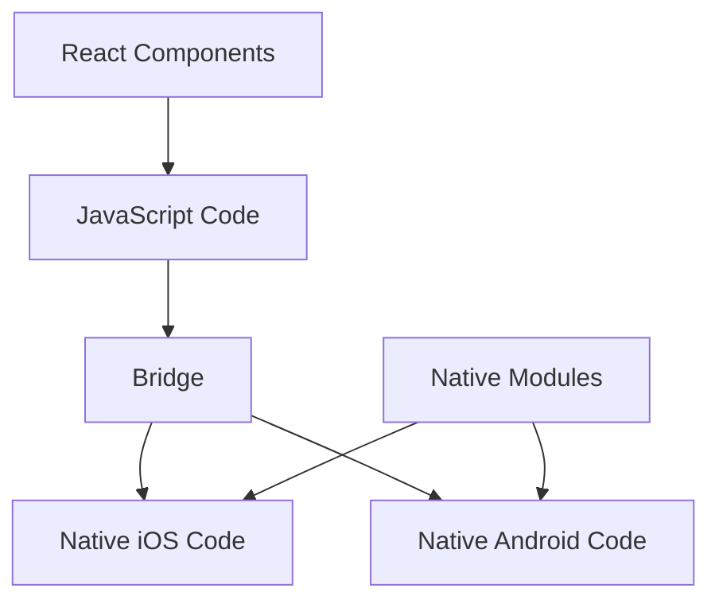

# Section 2: The Rise of Cross-Platform Development

The challenges of maintaining separate iOS and Android codebases led to various cross-platform solutions. Understanding these approaches and their evolution helps explain React Native's design decisions and current market position.

## The cross-platform problem

### Business challenges

Organizations quickly realized that native development created significant challenges:

**Resource duplication:**
- Separate iOS and Android development teams
- Platform-specific expertise requirements
- Doubled development and maintenance costs
- Increased time-to-market for features

**Feature parity issues:**
- Inconsistent implementation across platforms
- Different release schedules and capabilities
- User experience fragmentation
- Testing and quality assurance complexity

**Talent acquisition:**
- High demand for mobile developers
- Premium salaries for platform expertise
- Difficulty finding developers skilled in both platforms
- Knowledge silos within organizations

### Technical challenges

Native development also presented technical hurdles:

**Code duplication:**
- Business logic reimplemented for each platform
- Different programming languages and paradigms
- Platform-specific libraries and frameworks
- Maintenance overhead for shared functionality

**Integration complexity:**
- Backend API integration duplicated
- State management patterns differed
- Testing strategies required platform expertise
- Deployment and distribution processes varied

## Early cross-platform approaches

### Web-based solutions

The first attempts leveraged existing web technologies:

**PhoneGap/Apache Cordova (2009)**

*Approach:* Wrap web applications in native containers

**Benefits:**
- Leveraged existing web development skills
- Single codebase for multiple platforms
- Rapid development and iteration
- Extensive plugin ecosystem

**Limitations:**
- Performance constraints from web view rendering
- Limited access to native device features
- User interface inconsistencies with platform conventions
- Debugging complexity across layers

**Example architecture:**
```
┌─────────────────┐
│   HTML/CSS/JS   │ ← Application Logic
├─────────────────┤
│   Cordova API   │ ← Bridge Layer
├─────────────────┤
│  Native Plugins │ ← Device Access
├─────────────────┤
│ Platform (iOS)  │ ← Operating System
└─────────────────┘
```

### Hybrid framework evolution

Building on web technologies, more sophisticated frameworks emerged:

**Ionic Framework (2013)**

*Approach:* Angular-based framework with Cordova integration

**Improvements:**
- Component-based architecture
- Platform-specific UI adaptations
- Performance optimizations
- Comprehensive documentation and tooling

**Persistent challenges:**
- Still limited by web view performance
- Complex native integrations
- Platform-specific behavior differences

### Gaming and specialized frameworks

Some domains developed specialized solutions:

**Unity (Mobile deployment)**
- Primarily for game development
- C# programming with cross-platform deployment
- High-performance graphics and physics
- Limited for business application development

**Adobe AIR**
- Flash/ActionScript-based applications
- Cross-platform deployment capabilities
- Declined with Flash's deprecation

## Native-compiled approaches

To address performance concerns, some frameworks compiled to native code:

### Xamarin (2011)

**Approach:** C# and .NET compilation to native applications

**Architecture benefits:**
- Shared business logic in C#
- Platform-specific UI implementations
- Direct access to native APIs
- Strong typing and development tools

**Xamarin.Forms evolution:**
- Single UI codebase option
- XAML-based interface definitions
- Custom renderers for platform adaptation

**Trade-offs:**
- Requires C#/.NET expertise
- Large application bundle sizes
- Microsoft ecosystem dependency
- Licensing costs (initially)

> 🅰️ **Angular Developer:**
>
> **Comparison:** Xamarin.Forms' XAML syntax for UI definition is similar to Angular's template syntax, providing declarative UI descriptions that compile to platform-specific implementations.

### Qt and C++ solutions

**Qt for Mobile**
- C++ framework with mobile targets
- Native performance with shared codebase
- Primarily used in embedded and specialized applications
- Steep learning curve for mobile developers

## The React Native breakthrough (2015)

Facebook's approach addressed many limitations of previous solutions:

### Architectural innovation

**JavaScript bridge architecture:**


The React Native architecture enables JavaScript code to communicate with native platform code through a bridge, allowing React components to render as truly native UI elements while maintaining shared business logic.

**Key advantages:**
- JavaScript ecosystem and tooling
- React's proven component model
- Native UI rendering performance
- Hot reloading for rapid iteration

### Developer experience improvements

React Native addressed developer pain points:

**Familiar patterns:**
- React component architecture
- JavaScript language familiarity
- Web development debugging tools
- npm package ecosystem

**Rapid iteration:**
- Hot reloading for instant feedback
- Chrome debugging tools integration
- Metro bundler for fast builds
- Flipper for advanced debugging

## Modern cross-platform landscape

### Flutter's emergence (2017)

Google's Flutter introduced another approach:

**Dart programming language:**
- Compiled to native ARM code
- Garbage collection with performance focus
- Object-oriented with functional features

**Skia rendering engine:**
- Custom UI rendering bypassing platform components
- Consistent appearance across platforms
- High performance for complex animations

**Comparison with React Native:**

| Aspect | React Native | Flutter |
|--------|-------------|---------|
| Language | JavaScript | Dart |
| UI Rendering | Native components | Custom rendering |
| Learning Curve | Easier for web developers | Steeper initial learning |
| Ecosystem | Extensive JavaScript | Growing but smaller |
| Performance | Very good | Excellent |
| Platform Look | Native by default | Requires customization |

### Other modern solutions

**Progressive Web Apps (PWAs):**
- Web technologies with native-like capabilities
- Service workers for offline functionality
- App-like installation and behavior
- Limited device API access

**Kotlin Multiplatform Mobile (KMM):**
- Shared business logic in Kotlin
- Platform-specific UI implementations
- Google's official cross-platform solution
- Strong type safety and modern language features

## Current market dynamics

### Framework adoption patterns

Different frameworks serve different needs:

**React Native strengths:**
- Large existing React/JavaScript developer base
- Extensive third-party library ecosystem
- Strong community support and contributions
- Proven success in major applications

**Flutter strengths:**
- Superior performance for complex animations
- Consistent UI across platforms
- Growing Google ecosystem integration
- Strong development tools and debugging

**Native development persistence:**
- Maximum performance for demanding applications
- Full access to latest platform features
- Platform-specific user experience optimization
- No abstraction layer limitations

### Decision factors

Organizations choose frameworks based on:

**Team considerations:**
- Existing developer skills and expertise
- Hiring and training capabilities
- Long-term maintenance resources
- Integration with current technology stack

**Project requirements:**
- Performance and user experience expectations
- Platform-specific feature requirements
- Development timeline and budget
- Long-term maintenance and evolution plans

**Business factors:**
- Market positioning and competitive advantages
- User base and platform preferences
- Monetization strategies and app store relationships
- Risk tolerance for technology adoption

## Lessons from cross-platform evolution

### Successful patterns

Effective cross-platform solutions share characteristics:

**Developer experience focus:**
- Familiar programming languages and patterns
- Excellent debugging and development tools
- Comprehensive documentation and community support
- Rapid iteration and feedback cycles

**Performance balance:**
- Near-native performance for common use cases
- Escape hatches for performance-critical scenarios
- Efficient resource utilization
- Smooth animations and interactions

**Platform integration:**
- Access to native device capabilities
- Respect for platform design conventions
- Easy integration with existing native code
- Support for platform-specific features

### Common pitfalls

Failed or struggling solutions often suffer from:

**Performance limitations:**
- Insufficient optimization for mobile constraints
- Poor memory management or CPU usage
- Laggy animations or user interactions
- Battery life impact

**Developer friction:**
- Complex setup and configuration requirements
- Poor debugging experiences
- Inadequate documentation or community support
- Frequent breaking changes

**Platform mismatch:**
- Lowest-common-denominator feature sets
- Inconsistent user experience across platforms
- Difficulty accessing new platform capabilities
- Poor integration with platform conventions

## React Native's competitive position

### Current advantages

React Native succeeds in the modern landscape because:

**Ecosystem maturity:**
- Extensive library ecosystem
- Strong community contributions
- Corporate backing and investment
- Proven track record in production applications

**Developer productivity:**
- Familiar React patterns and concepts
- Excellent debugging and development tools
- Hot reloading for rapid iteration
- Shared knowledge with web development

**Platform balance:**
- Native UI components for platform consistency
- Good performance for most application types
- Access to native capabilities when needed
- Active platform adaptation and updates

### Ongoing challenges

React Native continues to address:

**Performance optimization:**
- New Architecture for improved performance
- Better memory management and efficiency
- Reduced bridge communication overhead
- Enhanced animation and interaction smoothness

**Developer experience:**
- Improved debugging tools and error messages
- Better TypeScript integration and tooling
- Simplified setup and configuration
- Enhanced documentation and learning resources

## Future outlook

### Emerging trends

The cross-platform landscape continues evolving:

**Declarative UI frameworks:**
- SwiftUI for iOS
- Jetpack Compose for Android
- Flutter's widget system
- React Native's component model

**Performance focus:**
- Compiled languages gaining popularity
- Native module optimization
- Advanced caching and bundling strategies
- Machine learning and AI integration

**Development experience:**
- Better debugging and profiling tools
- Improved hot reloading and live editing
- Enhanced testing frameworks and automation
- Simplified deployment and distribution

### React Native's evolution

React Native continues adapting:

**Architectural improvements:**
- New Architecture with JSI and TurboModules
- Fabric rendering system enhancements
- Codegen for type safety improvements
- Performance optimizations and memory management

**Ecosystem expansion:**
- Enhanced Expo platform capabilities
- Better integration with native development
- Improved library compatibility and quality
- Community-driven innovation and contributions

## Next steps

Understanding the cross-platform landscape helps explain React Native's design decisions and current position. Now let's dive deeper into React Native's specific strengths, weaknesses, and use cases. Continue to [Section 3: Why React Native?](./section-3-why-react-native.md).

> 🛣️ **Learning Path Guidance (All Learners):**
>
> Notice how each cross-platform approach makes different trade-offs. Understanding these trade-offs will help you make better architectural decisions and know when React Native is the right choice for your projects.

> ⚛️ **React Developer:**
>
> **Comparison:** React Native's success builds on React's proven component architecture. The patterns you know from web development—props, state, lifecycle methods—translate directly to mobile development, which is a significant advantage over learning entirely new frameworks.