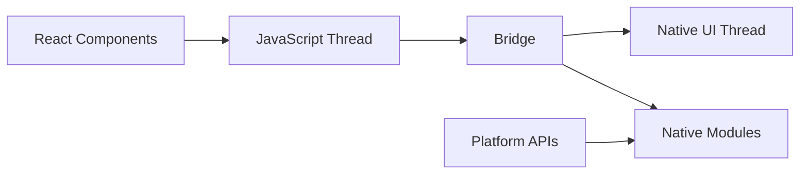

# Section 3: Why React Native?

React Native has gained significant adoption across the industry, but like any technology, it has both strengths and limitations. Understanding when and why to choose React Native is crucial for making informed development decisions.

## React Native's core value proposition

### The React Native promise

React Native addresses fundamental challenges in mobile development:

**"Learn once, write anywhere"** - This philosophy means:
- Using React concepts across web and mobile platforms
- Leveraging existing JavaScript and React skills
- Sharing patterns and architectural approaches
- Maintaining consistent development practices

**"Bridge the gap"** between web and mobile:
- Combining web development speed with native performance
- Accessing native platform capabilities when needed
- Providing escape hatches for platform-specific requirements
- Enabling gradual adoption within existing applications

### Key architectural advantages

**Native component rendering:**
- React Native components compile to actual native UI elements
- `<View>` becomes `UIView` (iOS) or `android.view.View` (Android)
- Platform-specific styling and behavior automatically applied
- User experience feels truly native to each platform

**JavaScript bridge architecture:**

The bridge enables JavaScript code to communicate with native platform features while maintaining separation between JavaScript logic and native UI rendering, providing both flexibility and performance.

**Hot reloading capability:**
- Instant feedback during development
- Preserves application state during code changes
- Dramatically reduces development iteration time
- Enhances developer productivity and experimentation

## React Native strengths

### Developer experience

**Familiar development patterns:**
- React component architecture translates directly
- JavaScript ecosystem and tooling availability
- npm package manager and extensive library ecosystem
- Modern development practices like ES6+, async/await

**Excellent debugging capabilities:**
- Chrome DevTools integration for JavaScript debugging
- React Developer Tools for component inspection
- Flipper for advanced debugging and performance analysis
- Source map support for meaningful error reporting

**Rapid iteration cycles:**
- Hot reloading for instant feedback
- Fast Metro bundler for efficient builds
- Over-the-air updates for deployed applications
- Simplified testing with familiar web testing patterns

### Code sharing and efficiency

**Business logic reuse:**
- API calls and data processing shared between platforms
- State management patterns consistent across web and mobile
- Utility functions and algorithms implemented once
- Testing strategies applicable to shared codebase

**Development team efficiency:**
- Single team can maintain both iOS and Android applications
- Shared knowledge base and development practices
- Reduced hiring and training complexity
- Faster feature development and bug fixes

**Faster time-to-market:**
- Simultaneous development for both platforms
- Shared codebase reduces development time
- Familiar technologies reduce learning curve
- Rapid prototyping and validation capabilities

### Platform integration

**Native module ecosystem:**
- Access to device cameras, GPS, sensors, and storage
- Platform-specific functionality when needed
- Third-party library integration for specialized features
- Custom native module development for unique requirements

**Platform-specific code support:**
- `.ios.js` and `.android.js` file extensions
- Platform module for detecting current platform
- Conditional rendering based on platform capabilities
- Native code integration when performance demands it

### Corporate adoption validation

**Industry success stories:**
- Facebook, Instagram, Airbnb, Tesla, and many others
- Proven scalability for large-scale applications
- Real-world performance validation
- Significant cost savings demonstrated

## React Native limitations

### Performance considerations

**Bridge communication overhead:**
- Asynchronous communication between JavaScript and native code
- JSON serialization/deserialization for data transfer
- Potential bottlenecks for intensive operations
- Memory usage from maintaining separate contexts

**Animation performance:**
- JavaScript bridge can limit 60fps animations
- Complex animations may require native implementation
- Layout thrashing possible with frequent updates
- Battery usage considerations for animation-heavy apps

**Memory management:**
- JavaScript garbage collection in addition to native memory management
- Potential memory leaks from improper cleanup
- Bundle size considerations for JavaScript code
- Image and asset loading optimization requirements

### Development complexity

**Platform-specific edge cases:**
- Different behavior between iOS and Android implementations
- Version compatibility issues across platform updates
- Debugging complexity across JavaScript and native layers
- Build and deployment process differences

**Dependency management:**
- Third-party library compatibility with React Native versions
- Native module compilation and linking complexity
- Platform-specific configuration requirements
- Breaking changes in React Native ecosystem updates

**Learning curve for native developers:**
- JavaScript and React concepts for native developers
- Different debugging approaches and tooling
- Web development patterns vs. native patterns
- Understanding bridge architecture implications

### Platform limitations

**Latest platform features:**
- Delay in React Native support for new iOS/Android capabilities
- Custom implementation required for cutting-edge features
- Platform-specific UI components may need native modules
- Design system compatibility across platform updates

**Platform-specific UI expectations:**
- Achieving perfect platform-native look and feel
- Custom component development for unique designs
- Navigation patterns differing between platforms
- Accessibility implementation complexity

## When to choose React Native

### Ideal use cases

**Business applications:**
- Data-driven applications with forms and lists
- E-commerce applications with product catalogs
- Social media and communication applications
- Content consumption applications (news, blogs)

**Team considerations:**
- Existing React or JavaScript expertise
- Limited mobile development resources
- Need for rapid prototyping and iteration
- Cross-platform development requirements

**Project characteristics:**
- Standard UI patterns and interactions
- Heavy integration with REST APIs or GraphQL
- Requirement for frequent updates and iterations
- Budget constraints for separate native development

### Strong fits for React Native

**Rapid MVP development:**
- Quick validation of mobile application concepts
- Cost-effective exploration of mobile market opportunities
- Faster time-to-market for competitive advantages
- Ability to iterate based on user feedback

**Content-driven applications:**
- News and media consumption applications
- E-learning and educational platforms
- Documentation and reference applications
- Blog and article reading applications

**Business productivity tools:**
- CRM and sales management applications
- Project management and collaboration tools
- Inventory and logistics management systems
- Customer service and support applications

## When to consider alternatives

### Native development scenarios

**Performance-critical applications:**
- High-end gaming applications
- Real-time audio/video processing
- Complex animations and interactive graphics
- Applications requiring maximum performance optimization

**Platform-specific feature requirements:**
- Heavy integration with platform-specific APIs
- Custom camera or media processing applications
- Applications requiring latest platform features immediately
- Deep integration with platform-specific services

**Long-term platform investment:**
- Applications with 5+ year development timelines
- Requirement for platform-specific user experience optimization
- Teams with strong existing native development expertise
- Applications where platform differentiation is competitive advantage

### Other cross-platform considerations

**Flutter might be better for:**
- Applications with complex custom animations
- Games with custom graphics requirements
- Applications requiring consistent UI across platforms
- Teams comfortable with Dart programming language

**Web technologies might be better for:**
- Applications with heavy web integration requirements
- Teams with strong web development expertise but no mobile experience
- Applications primarily focused on content consumption
- Progressive Web App (PWA) strategies

## Exercise 1.1: Framework Comparison Research

### Objective

Research and compare React Native with other mobile development approaches to understand positioning and trade-offs.

### Instructions

**Step 1: Research Framework**
Choose one of the following alternatives to React Native:
- Native iOS development (Swift/SwiftUI)
- Native Android development (Kotlin/Jetpack Compose)
- Flutter
- Xamarin
- Ionic

**Step 2: Comparison Analysis**
Create a comparison chart addressing these aspects:

| Criteria | React Native | [Your Chosen Framework] |
|----------|-------------|------------------------|
| **Programming Language** | JavaScript | |
| **Learning Curve** | Moderate (if familiar with React) | |
| **Performance** | Good for most use cases | |
| **Platform Look & Feel** | Native by default | |
| **Development Speed** | Fast iteration | |
| **Community Support** | Large and active | |
| **Corporate Backing** | Meta (Facebook) | |
| **When to Choose** | Cross-platform with React skills | |

**Step 3: Use Case Analysis**
For each framework, identify:
1. **Best use cases:** When would you choose this framework?
2. **Avoid scenarios:** When would you NOT choose this framework?
3. **Team requirements:** What skills and resources would your team need?

**Step 4: Decision Framework**
Create a simple decision tree or flowchart for choosing between the frameworks based on:
- Team expertise
- Project requirements
- Performance needs
- Timeline constraints
- Long-term maintenance considerations

### Expected Outcome

A comprehensive comparison that helps you understand:
- React Native's position in the mobile development landscape
- Trade-offs involved in technology choice decisions
- Factors that influence framework selection
- How to evaluate frameworks for specific project needs

### Time Estimate
15-20 minutes

### Reflection Questions

After completing the research:
1. What surprised you most about the framework you researched?
2. In what scenarios would you choose React Native over your researched alternative?
3. What factors would be most important in your framework decision-making?
4. How does team expertise influence technology choice decisions?

## Real-world decision factors

### Case study examples

**Instagram's React Native adoption:**
- Gradual integration into existing native application
- 85-99% code reuse between platforms for new features
- Improved developer velocity and reduced time-to-market
- Maintained native performance for core user experience

**Airbnb's React Native journey:**
- Initial success with cross-platform development efficiency
- Challenges with platform-specific behavior differences
- Decision to move back to native for long-term architectural goals
- Valuable lessons about React Native limitations and use cases

### Decision-making framework

When evaluating React Native for a project, consider:

**Technical factors:**
- Performance requirements and user experience expectations
- Platform-specific feature requirements
- Integration with existing systems and services
- Long-term maintenance and evolution plans

**Business factors:**
- Development budget and resource constraints
- Time-to-market requirements and competitive pressure
- Team expertise and hiring capabilities
- Platform strategy and user base distribution

**Risk factors:**
- Technology evolution and ecosystem stability
- Vendor lock-in and migration complexity
- Performance scaling for future growth
- Platform compatibility for new features

## Next steps

Now that you understand React Native's strengths, limitations, and appropriate use cases, let's explore the ecosystem of tools, libraries, and services that support React Native development. Continue to [Section 4: Understanding the React Native Ecosystem](./section-4-understanding-the-react-native-ecosystem.md).

> 🛣️ **Learning Path Guidance (All Learners):**
>
> The framework comparison exercise is crucial for developing good judgment about technology choices. Don't skip it—understanding alternatives makes you a better React Native developer and helps you recommend the right solutions for different scenarios.

> 🧑‍🏫 **Instructor-Led:**
>
> Consider discussing the comparison results as a group. Different research perspectives will provide valuable insights about the decision-making process and help everyone understand the nuances of framework selection.

> 🧗‍♀️ **Self-Led:**
>
> Take extra time with the decision framework portion of the exercise. Creating your own decision-making criteria will serve you well throughout your career when evaluating new technologies and approaches.