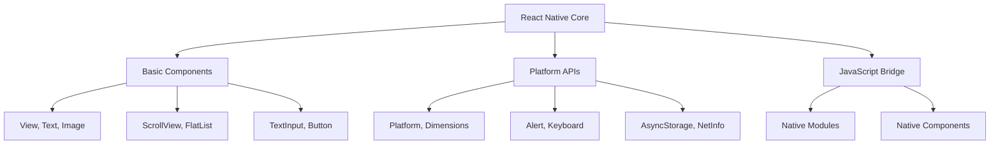

# Section 4: Understanding the React Native Ecosystem

React Native's success depends not just on the core framework, but on a rich ecosystem of tools, libraries, and services. Understanding this ecosystem helps you leverage existing solutions and make informed decisions about your development stack.

## Core React Native

### React Native CLI vs. Expo CLI

The React Native ecosystem offers two primary development approaches:

**React Native CLI (Community CLI)**
- Direct React Native framework usage
- Full control over native iOS and Android projects
- Access to all native modules and platforms APIs
- Custom native code integration capabilities
- Manual dependency management and configuration

**Expo CLI (Now Expo Tools)**
- Managed development environment
- Simplified setup and configuration
- Over-the-air updates and deployment
- Extensive set of pre-built native modules
- Streamlined development workflow

### Framework architecture

**Core components:** The fundamental building blocks provided by React Native:

React Native's core architecture provides essential components and APIs while maintaining the bridge to native functionality, enabling both cross-platform consistency and platform-specific capabilities when needed.

**JavaScript engine integration:**
- Hermes for Android (default since RN 0.64)
- JavaScriptCore for iOS
- V8 engine support for development
- Performance optimizations for mobile constraints

## The Expo platform

### Expo's evolution

Expo has evolved from a simple development tool to a comprehensive platform:

**Original Expo (Expo SDK)**
- Managed workflow for React Native development
- Limited to Expo-compatible libraries
- Simplified but constrained development experience
- Over-the-air updates and easy deployment

**Modern Expo (Expo Tools + EAS)**
- Bare workflow supporting custom native code
- Expo Application Services (EAS) for build and deployment
- Flexible development options
- Professional-grade tooling and services

### Expo SDK modules

Expo provides a rich set of pre-built modules:

**Device APIs:**
- Camera and image manipulation
- Location services and maps
- Sensors (accelerometer, gyroscope)
- Biometric authentication
- Push notifications

**Media handling:**
- Audio recording and playback
- Video processing and display
- Image picker and manipulation
- Document and file management

**Development tools:**
- Hot reloading and live updates
- Error reporting and analytics
- Performance monitoring
- Testing and debugging utilities

### EAS (Expo Application Services)

**EAS Build:**
- Cloud-based application building
- iOS and Android build automation
- Custom native code support
- Build caching and optimization

**EAS Submit:**
- Automated app store submission
- iOS App Store and Google Play integration
- Release management and versioning
- Metadata and asset management

**EAS Update:**
- Over-the-air JavaScript updates
- Staged rollouts and rollback capabilities
- A/B testing and feature flags
- Performance monitoring and analytics

## Community ecosystem

### Package management

**npm (Node Package Manager)**
- Primary package manager for React Native
- Extensive library ecosystem
- Semantic versioning and dependency management
- Integration with JavaScript ecosystem

**Yarn as alternative:**
- Facebook-developed package manager
- Improved performance and reliability
- Workspace support for monorepos
- Better security and deterministic installs

### Popular library categories

**Navigation solutions:**
- React Navigation (most popular)
- Expo Router (file-based routing)
- React Native Navigation (native navigation)
- Custom navigation implementations

**State management:**
- Redux with React Redux
- Zustand (lightweight alternative)
- Context API (built-in React)
- MobX for reactive state management

**UI component libraries:**
- React Native Elements
- React Native Paper (Material Design)
- NativeBase
- UI Kitten

**Styling solutions:**
- Styled Components (CSS-in-JS)
- React Native StyleSheet (built-in)
- Tamagui (universal styling)
- Emotion for React Native

### Development tools

**Debugging and development:**
- Flipper (meta debugging platform)
- React Native Debugger (standalone app)
- Chrome DevTools integration
- VS Code React Native Tools extension

**Testing frameworks:**
- Jest (unit testing)
- React Native Testing Library
- Detox (end-to-end testing)
- Maestro (mobile UI testing)

**Performance and monitoring:**
- React Native Performance Monitor
- Sentry for error tracking
- Firebase Analytics and Crashlytics
- Custom performance measurement tools

## Native module ecosystem

### Types of native modules

**Platform bridges:**
- Camera and media access
- Location and mapping services
- Biometric and security features
- File system and storage access

**Third-party service integrations:**
- Firebase services (authentication, database, analytics)
- Social platform SDKs (Facebook, Google, Twitter)
- Payment processing (Stripe, PayPal)
- Analytics and crash reporting

**Custom native modules:**
- Company-specific functionality
- Performance-critical operations
- Platform-specific feature access
- Legacy system integrations

### Quality and maintenance considerations

**Evaluating native modules:**
- Active maintenance and update frequency
- React Native version compatibility
- Community adoption and GitHub stars
- Documentation quality and examples
- Issue response time and resolution

**Common integration challenges:**
- iOS and Android version compatibility
- Build configuration complexity
- Breaking changes in updates
- Platform-specific behavior differences

## Build and deployment ecosystem

### Build systems

**Metro bundler:**
- React Native's default JavaScript bundler
- Hot reloading and fast refresh support
- Asset management and optimization
- Custom transformer and resolver plugins

**Alternative bundlers:**
- Webpack with React Native Web
- Vite for development (experimental)
- Custom build configurations

### Deployment platforms

**App store distribution:**
- iOS App Store through Xcode or EAS
- Google Play Store through Android Studio or EAS
- Alternative app stores and enterprise distribution

**Over-the-air updates:**
- EAS Update (Expo's solution)
- CodePush (Microsoft's solution)
- Custom update mechanisms
- A/B testing and staged rollouts

### CI/CD integration

**Popular CI/CD platforms:**
- GitHub Actions
- GitLab CI/CD
- Bitrise
- Azure DevOps
- Jenkins

**Build automation:**
- Automated testing on multiple devices
- App store submission automation
- Code quality checks and linting
- Security scanning and vulnerability assessment

## Backend and API ecosystem

### API integration patterns

**REST API consumption:**
- Fetch API (built-in)
- Axios (popular HTTP client)
- React Query/TanStack Query (server state management)
- SWR (data fetching library)

**GraphQL integration:**
- Apollo Client
- Relay
- urql (lightweight alternative)
- GraphQL code generation tools

**Real-time communication:**
- Socket.io for WebSocket communication
- Firebase Realtime Database
- AWS AppSync
- Custom WebSocket implementations

### Backend-as-a-Service (BaaS)

**Firebase services:**
- Authentication and user management
- Firestore database
- Cloud Functions
- Analytics and crash reporting

**AWS services:**
- AWS Amplify
- Cognito for authentication
- DynamoDB for databases
- Lambda for serverless functions

**Other BaaS providers:**
- Supabase (open-source Firebase alternative)
- Appwrite
- Hasura (GraphQL backend)
- PlanetScale (database platform)

## Design and prototyping ecosystem

### Design tools integration

**Figma integration:**
- Design system synchronization
- Asset export automation
- Component library generation
- Developer handoff tools

**Design system tools:**
- Storybook for React Native
- React Native Paper theming
- Tamagui design systems
- Custom design token management

### Asset management

**Image optimization:**
- React Native image optimization
- FastImage for performance
- Lottie for animations
- SVG support libraries

**Icon libraries:**
- React Native Vector Icons
- React Native Elements icons
- Custom icon font generation
- SVG icon libraries

## Testing ecosystem

### Testing strategies

**Unit testing:**
- Jest for JavaScript testing
- React Native Testing Library
- Component testing patterns
- Mock native modules

**Integration testing:**
- API integration testing
- Navigation flow testing
- State management testing
- Cross-platform behavior testing

**End-to-end testing:**
- Detox for device testing
- Maestro for UI testing
- Firebase Test Lab
- Device farm testing services

### Quality assurance tools

**Code quality:**
- ESLint for code linting
- Prettier for code formatting
- TypeScript for type checking
- SonarQube for code analysis

**Performance testing:**
- React Native performance profiling
- Memory usage monitoring
- Network performance testing
- Battery usage optimization

## Ecosystem evolution and trends

### Current trends

**Architecture improvements:**
- New Architecture adoption (Fabric, TurboModules)
- React 18 concurrent features integration
- Performance optimization focus
- Developer experience enhancements

**Tooling evolution:**
- Improved debugging and profiling tools
- Better TypeScript integration
- Enhanced development workflows
- Simplified setup and configuration

**Community growth:**
- Increased corporate adoption
- More specialized libraries and tools
- Better documentation and learning resources
- Regular conferences and community events

### Future considerations

**Technology evolution:**
- React Native's roadmap and long-term vision
- Integration with React ecosystem updates
- Platform API changes and adaptations
- Performance optimization continued focus

**Ecosystem maturity:**
- Standardization of best practices
- Improved library compatibility and quality
- Better tooling integration and workflow
- Enhanced enterprise support and features

## Making ecosystem choices

### Decision framework

When choosing ecosystem components, consider:

**Technical criteria:**
- Performance impact and optimization
- Bundle size and loading time effects
- Platform compatibility and feature support
- Integration complexity and learning curve

**Maintenance criteria:**
- Active development and update frequency
- Community support and documentation quality
- Breaking change frequency and migration paths
- Long-term viability and ecosystem trends

**Business criteria:**
- Licensing and cost implications
- Vendor lock-in and migration flexibility
- Team expertise and training requirements
- Time-to-market and development velocity

### Best practices

**Ecosystem selection strategies:**
- Start with proven, well-maintained libraries
- Prefer libraries with strong community adoption
- Evaluate multiple options before committing
- Plan for library migrations and updates
- Maintain minimal necessary dependencies

**Integration approaches:**
- Gradual adoption of new tools and libraries
- Thorough testing of ecosystem changes
- Documentation of architecture decisions
- Regular review and updates of dependencies
- Monitoring of ecosystem evolution and trends

## Challenge 1: Mobile Development Quiz

Test your understanding of mobile development concepts, platforms, and React Native's role in the ecosystem through a comprehensive quiz covering the topics discussed in this module.

### Quiz Topics

The challenge will test your knowledge of:

1. **Mobile Platform History**
   - Evolution from early mobile devices to smartphones
   - Key milestones in iOS and Android development
   - Impact of app stores and native development paradigms

2. **Cross-Platform Development Approaches**
   - Different strategies for multi-platform development
   - Trade-offs between native, hybrid, and cross-platform solutions
   - Evolution of cross-platform frameworks and tools

3. **React Native Fundamentals**
   - React Native's architecture and core principles
   - Strengths and limitations of the framework
   - Appropriate use cases and decision factors

4. **Ecosystem Understanding**
   - Core React Native vs. Expo platform differences
   - Important libraries and tools in the ecosystem
   - Build, deployment, and testing strategies

### Format and Access

> 🧑‍🏫 **Instructor-Led:**
>
> Your instructor will provide access to the quiz through your learning management system. Complete the quiz within the specified timeframe and review results with the class.

> 🧗‍♀️ **Self-Led:**
>
> Access the self-assessment quiz through the course platform. Use it to identify areas where you may need additional review or study.

### Expected Outcomes

After completing the challenge, you should be able to:
- Articulate the evolution and current state of mobile development
- Compare React Native with other development approaches
- Make informed decisions about React Native adoption
- Navigate the React Native ecosystem effectively

## Module summary

You've now completed a comprehensive exploration of the mobile development landscape and React Native's place within it. Key takeaways include:

**Historical context matters:** Understanding how mobile development evolved helps explain current technology choices and future trends.

**Trade-offs are universal:** Every development approach involves trade-offs between performance, developer productivity, platform integration, and cost.

**React Native has a clear value proposition:** It excels for cross-platform development with JavaScript/React expertise, business applications, and rapid iteration requirements.

**Ecosystem richness enables success:** The extensive libraries, tools, and services surrounding React Native significantly enhance its capabilities and developer experience.

**Decision-making requires context:** Choosing React Native (or any framework) depends on team expertise, project requirements, performance needs, and business factors.

## Next steps

With a solid understanding of React Native's position in the mobile development landscape, you're ready to dive deeper into how React Native actually works under the hood. Continue to [Module 2: React Native Architecture Explained](../module-2/README.md).

> 🛣️ **Learning Path Guidance (All Learners):**
>
> The concepts covered in this module will inform decisions throughout your React Native journey. Bookmark this module for reference when evaluating libraries, making architectural choices, or explaining React Native to stakeholders and team members.