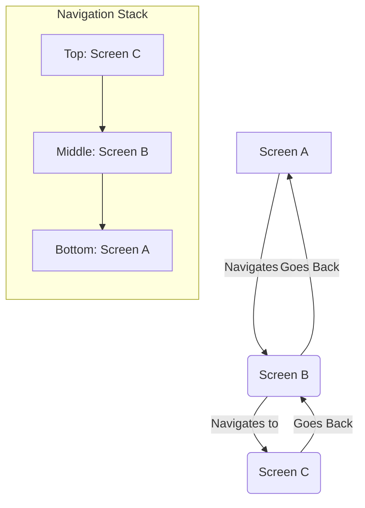
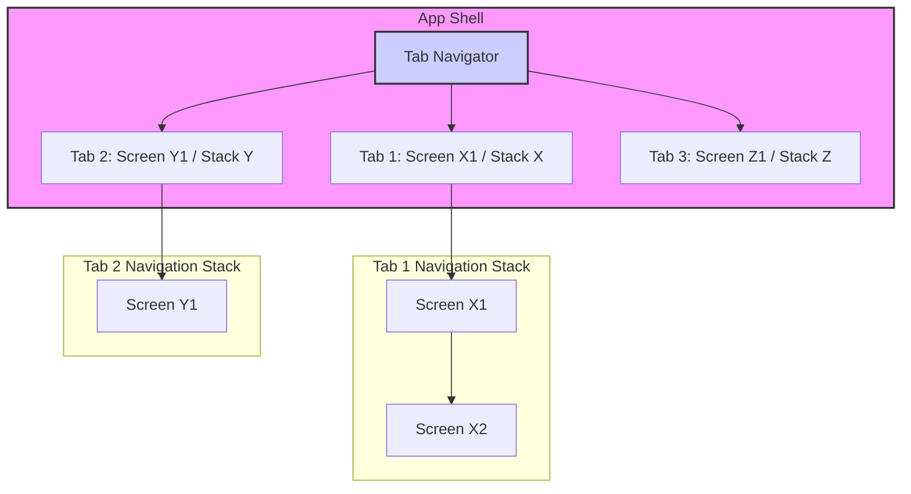

## Section 1: Navigation Concepts

This section introduces the fundamental concepts and patterns used in mobile application navigation. Understanding these core ideas—Stack, Tab, and Drawer navigation—is essential before diving into specific library implementations. These patterns provide the building blocks for creating intuitive and user-friendly navigation experiences in your React Native applications, including our SpeedyMeds app.

### Core Content

#### Conceptual Content: Understanding Navigation Paradigms

Mobile application navigation is typically structured around a few common paradigms. These paradigms help users understand their location within an app and how to move between different sections or pieces of information. The three primary paradigms we'll focus on are Stack, Tab, and Drawer navigation.

**1. Stack Navigator**

- **Concept:** The Stack navigator is perhaps the most common navigation pattern. It manages a stack of screens, similar to a stack of cards. When a user navigates to a new screen, that screen is pushed onto the top of the stack. When the user goes back (e.g., by pressing the back button or a custom back gesture), the current screen is popped off the stack, revealing the screen underneath.
- **Use Case:** Ideal for sequential flows where screens have a clear parent-child relationship. For example, a list of items where tapping an item takes you to its detail screen, which might then lead to an edit screen. In SpeedyMeds, this could be navigating from a list of prescriptions to a specific prescription's details, then to a refill request screen.
- **Analogy:** Think of it like a web browser's history. Each new page visited is added to the history stack, and the back button takes you to the previous page.



> The diagram above illustrates a simple stack navigation flow. Screen A is the initial screen. Navigating to Screen B pushes it onto the stack above Screen A. Similarly, Screen C is pushed above Screen B. When going back from Screen C, it's popped, revealing Screen B. Going back again from Screen B pops it, revealing Screen A. The stack ensures a clear history and allows users to retrace their steps easily.

**2. Tab Navigator**

- **Concept:** The Tab navigator presents a set of persistent tabs, usually at the bottom or top of the screen. Each tab corresponds to a different top-level section or view within the app. Users can switch between these sections by tapping on the respective tabs. Each tab typically maintains its own independent navigation stack.
- **Use Case:** Suitable for organizing distinct sections of an application that don't necessarily have a direct hierarchical relationship but are equally important. For example, an app might have tabs for "Home," "Search," "Notifications," and "Profile." In SpeedyMeds, we could have tabs for "My Medications," "Refills," "Pharmacy Info," and "Settings."
- **Analogy:** Similar to tabs in a desktop application (like a web browser with multiple open tabs) or the main sections of a website's navigation bar.



> This diagram shows a Tab navigator with three tabs. Each tab (Tab 1, Tab 2, Tab 3) can lead to its own screen or even its own stack of screens (e.g., Tab 1 has Screen X1 which can navigate to Screen X2). When a user switches from Tab 1 to Tab 2, the navigation state of Tab 1 (including its stack) is typically preserved, so when they return to Tab 1, they are back where they left off. This allows users to multitask between different sections of the app seamlessly.

**3. Drawer Navigator**

- **Concept:** The Drawer navigator typically presents a side menu (the "drawer") that slides in from the edge of the screen (usually the left or right). It contains a list of navigation options or links to different sections of the app. The drawer is often hidden by default and can be opened by a swipe gesture or by tapping an icon (often a "hamburger" icon) in the app header.
- **Use Case:** Useful for apps with many top-level navigation items that wouldn't fit well in a tab bar, or for less frequently accessed sections like settings, help, or user profile. It can also be used in conjunction with other navigators. For SpeedyMeds, a drawer could house links to "Order History," "Payment Methods," "About Us," or "Logout."
- **Analogy:** Similar to a sliding menu found on many websites, especially on mobile views, or a physical drawer in a desk that you pull out to reveal its contents.

```mermaid
graph TD;
    subgraph AppScreen[Current App Screen]
        direction TB
        Header[App Header with Menu Icon] --> MainContent[Main Screen Content];
    end

    MenuIconClick{Menu Icon Click / Swipe} --> DrawerOpen[Drawer Opens];

    subgraph DrawerMenu[Drawer Menu (Slides In)]
        direction TB
        DM_O1[Option 1: Screen P] --> P[Screen P];
        DM_O2[Option 2: Screen Q] --> Q[Screen Q];
        DM_O3[Option 3: Screen R] --> R[Screen R];
    end

    Header -.-> MenuIconClick;
    DrawerOpen --> DrawerMenu;

    style AppScreen fill:#eef,stroke:#333,stroke-width:2px;
    style DrawerMenu fill:#efe,stroke:#333,stroke-width:2px;
```

> The diagram illustrates a Drawer navigator. The main app screen has a header with a menu icon. Clicking this icon or swiping from the edge opens the drawer. The drawer itself contains a list of navigation options (Option 1, Option 2, Option 3), each leading to a different screen (Screen P, Screen Q, Screen R). The drawer typically overlays or pushes the main content aside when open.

**Combining Navigators**

It's very common to combine these navigation patterns. For example:

- A Tab navigator might be the primary navigation, where each tab itself is a Stack navigator managing a flow of screens specific to that tab.
- A Drawer navigator might contain links that navigate to different Stack navigators or specific screens within a Tab navigator.

Understanding these fundamental patterns will help you choose the right navigation structure for your SpeedyMeds application and effectively use libraries like React Navigation and Expo Router.

> 📚 **Official Documentation:**
>
> While specific libraries implement these concepts, general UI/UX design principles cover these patterns extensively. For library-specific takes:
>
> - [React Navigation - Navigators](https://reactnavigation.org/docs/navigators/)
> - [Expo Router - Layouts (conceptual similarity)](https://docs.expo.dev/router/layouts/)

> 🍏 **(iOS Developers):**
>
> **Comparison:** You've seen these patterns in iOS: `UINavigationController` for stacks, `UITabBarController` for tabs, and often custom implementations or `UISplitViewController` (for larger screens) for drawer-like experiences.
>
> **Key Takeaway:** The core concepts are the same. React Native libraries will provide components that replicate this behavior, but you'll configure them declaratively in JavaScript/TypeScript.

> 🤖 **(Android Developers):**
>
> **Comparison:** Android's Navigation Component directly supports graphs that can represent stacks. `BottomNavigationView` is used for tabs, and `NavigationView` within a `DrawerLayout` is used for drawers.
>
> **Key Takeaway:** React Native navigators offer a cross-platform abstraction for these native patterns, allowing you to define them once.

> 🌐 **(Web Developers):**
>
> **Comparison:** Stack navigation is like browser history. Tabs can be like different sections of a single-page application (SPA) controlled by a router. Drawers are common as responsive menus on mobile web.
>
> **Key Takeaway:** The main difference in mobile is the tight integration with native gestures and transitions, and the expectation of persistent states within each tab or section.

#### Next Steps

In the next section, we will introduce React Navigation, a popular library for implementing these navigation concepts in React Native.
