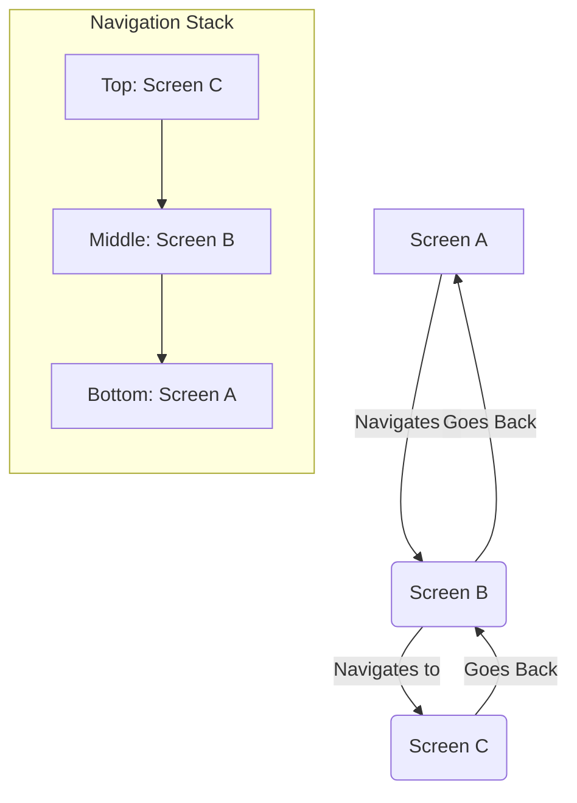
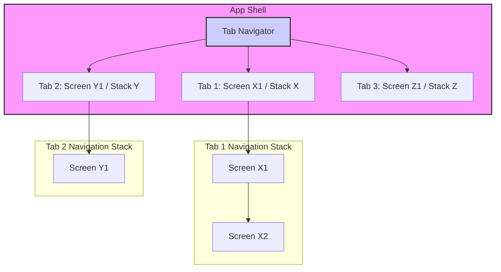

## Section 1: Navigation Concepts

This section introduces the fundamental concepts and patterns used in mobile application navigation. Understanding these core ideas—Stack, Tab, and Drawer navigation—is essential before diving into specific library implementations. These patterns provide the building blocks for creating intuitive and user-friendly navigation experiences in your React Native applications, including our SpeedyMeds app.

### Core Content

#### Conceptual Content: Understanding Navigation Paradigms

Mobile application navigation is typically structured around a few common paradigms. These paradigms help users understand their location within an app and how to move between different sections or pieces of information. The three primary paradigms we'll focus on are Stack, Tab, and Drawer navigation.

**1. Stack Navigator**

- **Concept:** The Stack navigator is perhaps the most common navigation pattern. It manages a stack of screens, similar to a stack of cards, adhering to a "Last-In, First-Out" (LIFO) principle. When a user navigates to a new screen, that screen is pushed onto the top of the stack. When the user goes back (e.g., by pressing the back button or a custom back gesture), the current screen is popped off the stack, revealing the screen underneath.
- **Use Case:** Ideal for sequential flows where screens have a clear parent-child relationship or a defined progression. For example, a list of items where tapping an item takes you to its detail screen, which might then lead to an edit screen, or stepping through an authentication process. In SpeedyMeds, this could be navigating from a list of prescriptions to a specific prescription's details, then to a refill request screen.
- **Analogy:** Think of it like a web browser's history. Each new page visited is added to the history stack, and the back button takes you to the previous page.



> The diagram above illustrates a simple stack navigation flow. Screen A is the initial screen. Navigating to Screen B pushes it onto the stack above Screen A. Similarly, Screen C is pushed above Screen B. When going back from Screen C, it's popped, revealing Screen B. Going back again from Screen B pops it, revealing Screen A. The stack ensures a clear history and allows users to retrace their steps easily.

**2. Tab Navigator**

- **Concept:** The Tab navigator presents a set of persistent tabs, usually at the bottom (most common in mobile) or sometimes the top of the screen. Each tab corresponds to a different top-level section or view within the app. Users can switch between these sections by tapping on the respective tabs. Each tab typically maintains its own independent navigation stack.
- **Use Case:** Most effective when an app has a small number (typically three to five) of primary destinations that are of roughly equal importance and require frequent access. It's suitable for organizing distinct sections of an application that don't necessarily have a direct hierarchical relationship. For example, an app might have tabs for "Home," "Search," "Notifications," and "Profile." In SpeedyMeds, we could have tabs for "My Medications," "Refills," "Pharmacy Info," and "Settings." Routes associated with tabs are often lazily initialized, meaning their content is only mounted when the tab is first visited, which can optimize the initial load performance of the application.
- **Analogy:** Similar to tabs in a desktop application (like a web browser with multiple open tabs) or the main sections of a website's navigation bar.



> This diagram shows a Tab navigator with three tabs. Each tab (Tab 1, Tab 2, Tab 3) can lead to its own screen or even its own stack of screens (e.g., Tab 1 has Screen X1 which can navigate to Screen X2). When a user switches from Tab 1 to Tab 2, the navigation state of Tab 1 (including its stack) is typically preserved, so when they return to Tab 1, they are back where they left off. This allows users to multitask between different sections of the app seamlessly.

**3. Drawer Navigator**

- **Concept:** The Drawer navigator typically presents a side menu (the "drawer") that slides in from the edge of the screen (usually the left or right). It contains a list of navigation options or links to different sections of the app. The drawer is often hidden by default and can be opened by a swipe gesture or by tapping an icon (often a "hamburger" icon) in the app header.
- **Use Case:** Useful for apps with a large number of top-level destinations (e.g., five or more) that wouldn't fit well in a tab bar, or for less frequently accessed sections like settings, help, user profile, or secondary features. By hiding these options, the drawer helps declutter the main screen, allowing primary content to take precedence. It can also be used in conjunction with other navigators. For SpeedyMeds, a drawer could house links to "Order History," "Payment Methods," "About Us," or "Logout."
- **Analogy:** Similar to a sliding menu found on many websites, especially on mobile views, or a physical drawer in a desk that you pull out to reveal its contents.

```mermaid
graph TD;
    subgraph AppScreen[Current App Screen]
        direction TB
        Header[App Header with Menu Icon] --> MainContent[Main Screen Content];
    end

    MenuIconClick{Menu Icon Click / Swipe} --> DrawerOpen[Drawer Opens];

    subgraph DrawerMenu[Drawer Menu (Slides In)]
        direction TB
        DM_O1[Option 1: Screen P] --> P[Screen P];
        DM_O2[Option 2: Screen Q] --> Q[Screen Q];
        DM_O3[Option 3: Screen R] --> R[Screen R];
    end

    Header -.-> MenuIconClick;
    DrawerOpen --> DrawerMenu;

    style AppScreen fill:#eef,stroke:#333,stroke-width:2px;
    style DrawerMenu fill:#efe,stroke:#333,stroke-width:2px;
```

> The diagram illustrates a Drawer navigator. The main app screen has a header with a menu icon. Clicking this icon or swiping from the edge opens the drawer. The drawer itself contains a list of navigation options (Option 1, Option 2, Option 3), each leading to a different screen (Screen P, Screen Q, Screen R). The drawer typically overlays or pushes the main content aside when open.

**Combining Navigators**

It's very common, and often necessary in complex applications, to combine these navigation patterns to create a sophisticated and intuitive user flow. For example:

- A Tab navigator might serve as the primary, top-level navigation structure. Each individual tab screen within this Tab navigator could then be a Stack navigator, managing its own independent stack of screens for a specific feature set (e.g., a "Home" tab with a stack for posts and post details, and a "Profile" tab with a stack for user settings and editing).
- A Drawer navigator might be used to provide access to various sections, where selecting an item in the drawer navigates the user to a particular Tab (and potentially a specific screen within that tab's stack) or to a completely separate Stack navigator for a distinct workflow like "Settings" or "Help."

Understanding how to nest navigators and manage the flow of control between them is a key skill in building complex React Native applications. The choice of which patterns to combine depends heavily on the application's information architecture and the user journeys you want to support.

#### Platform Considerations: Designing for User Expectations

While React Native allows for cross-platform development, users have expectations based on their device's operating system. Adhering to platform-specific navigation guidelines can significantly improve the user experience, making your app feel more intuitive and "native."

##### iOS Human Interface Guidelines (HIG)

Apple's HIG emphasizes clarity, deference (UI doesn't overshadow content), and depth (visual layers guide users). For navigation, this translates to:

- **Navigation Styles:** iOS primarily uses three navigation styles:
  - **Hierarchical:** Sequential choices screen by screen (e.g., Settings app). Typically uses a Navigation Bar at the top with a title and back button.
  - **Flat:** Switching between distinct categories (e.g., Music app). Often uses a Tab Bar at the bottom or a Page Control for swiping.
  - **Content-driven:** Navigation emerges from the content itself (e.g., games, books).
- **Core Principles:** Navigation should feel natural, predictable, and logical. The UI should support the user's task without being obtrusive.
- **Standard Components:** Using standard iOS navigation controls (or their React Native equivalents like Native Stack for `UINavigationBar` and well-styled tab components for `UITabBar`) is strongly encouraged for familiarity.
- **Consistency and Usability:** Ensure clear and predictable navigation paths. Transitions should be consistent. Interactive elements (icons, buttons) need clear iconography and appropriate touch target sizes.

##### Android Material Design Guidelines

Google's Material Design (currently Material 3 or M3) provides comprehensive guidelines for Android. Key navigation aspects include:

- **Key Navigation Components (M3):**
  - **Navigation Bar:** Replaces the older "Bottom Navigation." Used for 3-5 top-level destinations, typically on compact screens. Features updated M3 styling (e.g., pill-shaped active indicator).
  - **Navigation Drawer:** Recommended for apps with 5+ top-level destinations or complex hierarchies. Can be Modal (overlaying content on smaller screens) or Standard (alongside content on larger screens).
  - **Navigation Rail:** A compact vertical navigation component for medium and expanded screen sizes (tablets/desktops).
  - **Top App Bar:** Often contains navigation controls like a back button (Up action) or a menu icon to open a Navigation Drawer.
- **Navigation Directions:** Material Design defines three primary navigation directions:
  - **Lateral:** Moving between screens at the same hierarchy level (e.g., using Navigation Bar, Drawer, Tabs).
  - **Forward:** Moving deeper into the hierarchy or through steps in a flow.
  - **Reverse:** Moving backward, either chronologically (system Back button) or hierarchically within the app (Up action in the Top App Bar).
- **Back Stack Behavior:** Android's navigation relies heavily on a back stack. The system Back button typically pops the current screen. Apps should ensure that the "Up" action (often in the app bar) and the system back button provide a consistent and predictable experience for navigating the screen history within the app.

By considering these platform-specific guidelines, you can tailor your SpeedyMeds app's navigation to meet user expectations on both iOS and Android, leading to a more polished and professional feel.

> 📚 **Official Documentation:**
>
> While specific libraries implement these concepts, general UI/UX design principles cover these patterns extensively. For library-specific takes:
>
> - [React Navigation - Navigators](https://reactnavigation.org/docs/navigators/)
> - [Expo Router - Layouts (conceptual similarity)](https://docs.expo.dev/router/layouts/)

> 🍏 **(iOS Developers):**
>
> **Comparison:** You've seen these patterns in iOS: `UINavigationController` for stacks, `UITabBarController` for tabs, and often custom implementations or `UISplitViewController` (for larger screens) for drawer-like experiences.
>
> **Key Takeaway:** The core concepts are the same. React Native libraries will provide components that replicate this behavior, but you'll configure them declaratively in JavaScript/TypeScript.

> 🤖 **(Android Developers):**
>
> **Comparison:** Android's Navigation Component directly supports graphs that can represent stacks. `BottomNavigationView` is used for tabs, and `NavigationView` within a `DrawerLayout` is used for drawers.
>
> **Key Takeaway:** React Native navigators offer a cross-platform abstraction for these native patterns, allowing you to define them once.

> 🌐 **(Web Developers):**
>
> **Comparison:** Stack navigation is like browser history. Tabs can be like different sections of a single-page application (SPA) controlled by a router. Drawers are common as responsive menus on mobile web.
>
> **Key Takeaway:** The main difference in mobile is the tight integration with native gestures and transitions, and the expectation of persistent states within each tab or section.

#### Next Steps

In the next section, we will introduce React Navigation, a popular library for implementing these navigation concepts in React Native.
