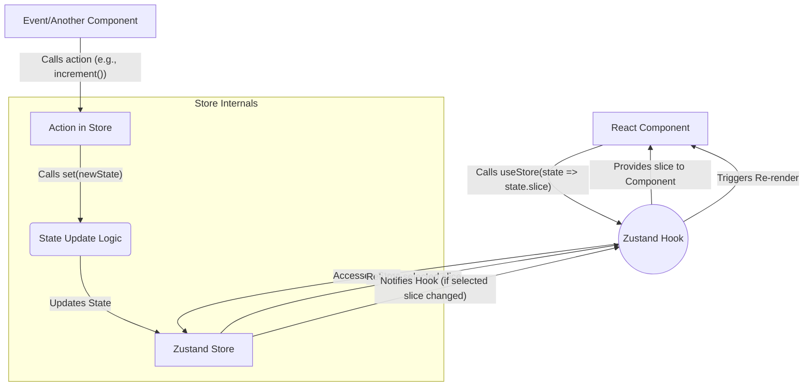

## Section 4: Introduction to Zustand (Client State)

While the React Context API is excellent for prop drilling avoidance and managing relatively simple global state, more complex applications often benefit from dedicated state management libraries. Zustand emerges as a popular alternative, offering a different approach compared to Context API or more complex libraries like Redux.

### What is Zustand? Core Principles

Zustand presents itself as a small, fast, and scalable **bearbones state management solution**. Its core philosophy revolves around simplicity and performance, built upon a **hook-based API**. Key characteristics include:

1.  **Minimalism & Minimal Boilerplate:** It avoids excessive boilerplate and complex setup procedures. Setting up a store and using it is incredibly straightforward.
2.  **Hook-Based API:** You interact with your Zustand store primarily through a custom hook that it generates, making state access and updates feel very idiomatic to modern React development.
3.  **No Providers Needed:** Unlike Context API or Redux, Zustand typically does not require wrapping your application in Provider components. The state exists outside the React component tree.
4.  **Decoupled State & Access from Anywhere:** Because stores exist outside the component tree, you can access and modify state from anywhere in your application—even from outside React components (e.g., in utility functions, event handlers using `store.getState()` and `store.subscribe()`). Direct usage within components via its hook remains the most common pattern.
5.  **Performance Focus & Selective Re-renders:** This is a key performance benefit. Components re-render only if the specific part of the state they subscribe to actually changes. Zustand makes it easy to select and subscribe to only the slices of state a component needs. It's designed to handle common React pitfalls like the "zombie child problem" and context loss between mixed renderers.
6.  **Unopinionated:** While providing structure, it doesn\'t enforce rigid patterns like traditional Flux architectures, offering flexibility.
7.  **Middleware Support:** Zustand has a simple yet powerful middleware system (e.g., for persistence, DevTools integration).
8.  **TypeScript Support:** It's built with TypeScript in mind, offering excellent type safety.

### Installation and Setup

Integrating Zustand is straightforward:

1.  **Install:** Add the library to your project.
    ```bash
    npm install zustand
    # or
    yarn add zustand
    ```
2.  **Create Store:** Define your state logic, typically in a separate file (e.g., `store.ts`).

### Creating a Store (the `create` function)

The central piece of Zustand is the `create` function, used to build your state store. You import it from `zustand`.

The `create` function takes a single argument: a setup function. This setup function receives helper functions (most importantly `set` and optionally `get`) and must return the initial state object. This object defines the structure of your store, including state properties and action functions that modify the state.

Let's create a very simple counter store:

```tsx
// src/stores/counterStore.ts
import { create } from "zustand";

// Define the shape of the store's state and actions
interface CounterState {
  count: number;
  increment: () => void;
  decrement: () => void;
  setCount: (newCount: number) => void;
}

// Create the store hook
export const useCounterStore = create<CounterState>((set) => ({
  // Initial state
  count: 0,

  // Actions: functions that modify state using the 'set' function
  increment: () => set((state) => ({ count: state.count + 1 })),
  decrement: () => set((state) => ({ count: state.count - 1 })),
  setCount: (newCount: number) => set({ count: newCount }),
}));
```

The result of `create(...)` (e.g., `useCounterStore`) is itself a custom hook. This hook is used within your React Native components to access the store\'s state and actions.

### Using the Store Hook in Components

```tsx
// src/components/CounterDisplay.tsx
import React from "react";
import { View, Text, Button } from "react-native";
import { useCounterStore } from "../stores/counterStore"; // Adjust path

const CounterDisplay: React.FC = () => {
  // Use the hook to select specific state slices or actions
  const count = useCounterStore((state) => state.count);
  const increment = useCounterStore((state) => state.increment);
  const decrement = useCounterStore((state) => state.decrement);
  const setCount = useCounterStore((state) => state.setCount);

  return (
    <View style={{ alignItems: "center", marginVertical: 20 }}>
      <Text style={{ fontSize: 24, marginBottom: 10 }}>Count: {count}</Text>
      <Button title="Increment" onPress={increment} />
      <Button title="Decrement" onPress={decrement} />
      <Button title="Set to 5" onPress={() => setCount(5)} />
    </View>
  );
};

export default CounterDisplay;
```

### Selecting State Slices for Performance

A key feature of Zustand is its selector-based subscription model. When using the store hook, you provide a selector function (e.g., `(state) => state.count`). This tells Zustand precisely which part(s) of the state this component instance cares about.

Crucially, the component calling the hook will **only re-render if the value returned by its specific selector function changes** (compared using strict equality `===` by default). If other parts of the store are updated, but the selected slice remains the same, the component will not re-render. This granular subscription mechanism is fundamental to Zustand's performance advantages.

**"Under the Hood" (Selectors):** Zustand maintains a list of listeners (components using the hook) along with their associated selector functions and last selected values. When the `set` function is called to update the state, Zustand iterates through its listeners. For each listener, it re-runs the selector function with the new state, compares the newly selected value with the previously stored value, and only notifies (triggers a re-render) the component if the value has changed.

### Updating State (the `set` function)

Actions within the store modify the state using the `set` function provided by the `create` callback.

- **Merging State:** By default, `set` performs a **shallow merge**. When you provide an object to `set`, it merges those properties into the existing state, leaving other properties untouched (similar to `this.setState` in React class components).
  ```tsx
  // Assuming state is { count: 0, user: 'guest' }
  set({ count: 1 }); // State becomes { count: 1, user: 'guest' }
  ```
- **Functional Updates:** For updates that depend on the previous state, pass a function to `set`. This function receives the current state and should return the partial state object to be merged.
  ```tsx
  set((state) => ({ count: state.count + 1 }));
  ```
- **Replacing State:** To completely replace the state instead of merging, pass `true` as the second argument to `set`: `set(newState, true)`. Use this with caution, as it overwrites the entire state.

### Middleware: Persisting State with `AsyncStorage`

Zustand supports middleware to extend its functionality. A common use case in React Native is persisting state to `AsyncStorage`.

```tsx
// src/stores/medicationStore.ts (Example with persistence)
import { create } from "zustand";
import { persist, createJSONStorage } from "zustand/middleware";
import AsyncStorage from "@react-native-async-storage/async-storage";

export interface Medication {
  id: string;
  name: string;
  dosage: string;
}

interface FavoriteMedicationsState {
  favoriteMedications: Medication[];
  addFavorite: (medication: Medication) => void;
  removeFavorite: (medicationId: string) => void;
  isFavorite: (medicationId: string) => boolean;
}

export const useFavoriteMedicationsStore = create<FavoriteMedicationsState>()(
  persist(
    (set, get) => ({
      favoriteMedications: [],
      addFavorite: (medication) =>
        set((state) => {
          if (
            !state.favoriteMedications.find((fav) => fav.id === medication.id)
          ) {
            return {
              favoriteMedications: [...state.favoriteMedications, medication],
            };
          }
          return state;
        }),
      removeFavorite: (medicationId) =>
        set((state) => ({
          favoriteMedications: state.favoriteMedications.filter(
            (med) => med.id !== medicationId
          ),
        })),
      isFavorite: (medicationId) => {
        const state = get();
        return !!state.favoriteMedications.find(
          (fav) => fav.id === medicationId
        );
      },
    }),
    {
      name: "favorite-medications-storage",
      storage: createJSONStorage(() => AsyncStorage),
    }
  )
);
```

This example uses the `persist` middleware to save the `favoriteMedications` state to `AsyncStorage`.

### Zustand Store Interaction Diagram



**Explanation of the Diagram:**

This diagram illustrates the typical flow of data and actions when using Zustand:

1.  **Component Subscribes:** A React component uses the Zustand hook with a selector to subscribe to a slice of the store's state.
2.  **Action Triggered:** An event or another component triggers an action defined within the store.
3.  **State Update:** The action calls the `set` function, which updates the state within the store. If middleware like `persist` is used, it may also interact with storage at this point (not shown in this simplified diagram for clarity on core flow).
4.  **Notification & Re-render:** Zustand checks which subscribed components are affected by the state change (based on their selectors). Only components whose selected state slice has changed will be re-rendered.

> 📚 **Official Documentation:**
>
> - [Zustand GitHub Repository (Main Documentation)](https://github.com/pmndrs/zustand)
> - [Zustand Docs Website (pmnd.rs)](https://zustand.docs.pmnd.rs/)
> - [Zustand: `persist` middleware](https://github.com/pmndrs/zustand/blob/main/docs/integrations/persisting-store-data.md)

### Exercise 13.2: Implementing a Zustand Store

Now it's your turn to get hands-on with Zustand!

- **Objective:** Create a Zustand store to manage a simple counter.
- **Task:** Define a store with a `count` state and actions to `increment`, `decrement`, and `reset` the count. Display the count and provide buttons to interact with these actions in a React Native component.

**(https://snack.expo.dev/YOUR_SNACK_ID_HERE)**
