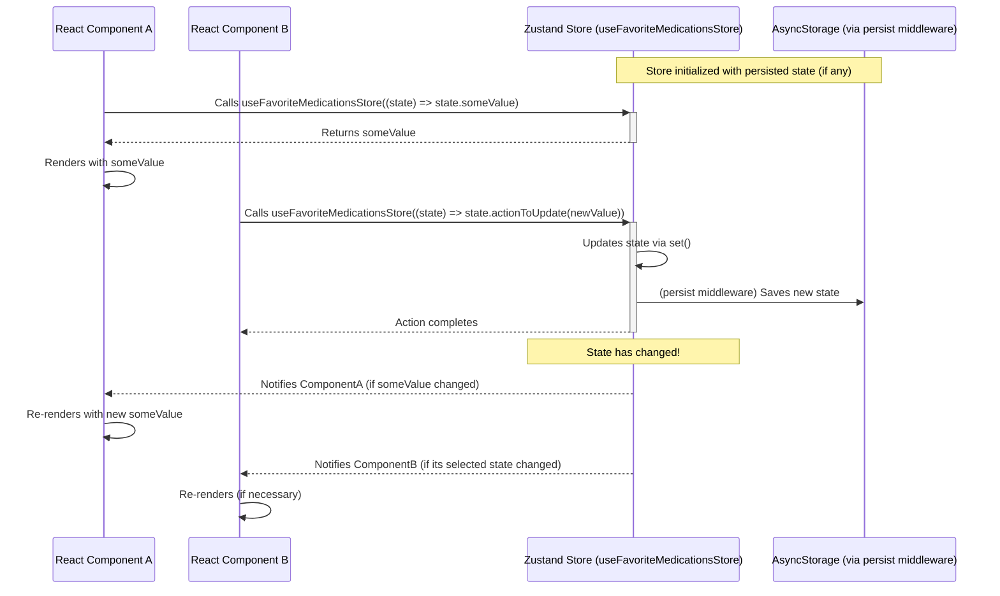

## Section 4: Introduction to Zustand (Client State)

While the React Context API is excellent for prop drilling avoidance and managing relatively simple global state, more complex applications often benefit from dedicated state management libraries. These libraries can offer better performance optimizations, more structured ways to organize state and logic, and helpful developer tooling. One such popular library is **Zustand**.

Zustand is a small, fast, and scalable state management solution. It's often described as a "bear necessities" state management library because it provides the essentials without much boilerplate, making it a joy to work with. It leverages hooks and feels very natural within a React (and React Native) environment. Impressively, it's also designed to handle common React pitfalls like the "zombie child problem", React concurrency issues, and context loss between mixed renderers, making it a robust choice.

### Why Consider Zustand?

Zustand offers several compelling features that make it an attractive choice for client-side state management in your SpeedyMeds application:

1.  **Minimal Boilerplate:** Setting up a store and using it is incredibly straightforward. You don't need to wrap your application in multiple providers or write extensive action creators and reducers like in traditional Redux.
2.  **Hook-Based API:** You interact with your Zustand store primarily through a custom hook that it generates, making state access and updates feel very idiomatic to modern React development.
3.  **Decoupled State:** Zustand stores exist outside of the React component tree. This means you can access and modify state from anywhere in your application, even from outside React components (e.g., in utility functions, event handlers using `store.getState()` and `store.subscribe()`), though direct usage within components via its hook is the most common pattern.
4.  **Selective Re-renders:** This is a key performance benefit. Components re-render only if the specific part of the state they subscribe to actually changes. Zustand makes it easy to select and subscribe to only the slices of state a component needs, avoiding unnecessary re-renders that can sometimes plague naive Context API implementations.
5.  **Middleware Support:** Zustand has a simple yet powerful middleware system. You can easily add features like persistence (e.g., saving state to `AsyncStorage`), DevTools integration (for Redux DevTools), and more.
6.  **TypeScript Support:** It's built with TypeScript in mind, offering excellent type safety out of the box.

### Creating a Zustand Store

Creating a store in Zustand is typically done in a separate file (e.g., `store.ts` or `medicationStore.ts`). You use the `create` function from Zustand, providing it with a function that defines your initial state and the actions that can modify that state.

Let's create a simple store for our SpeedyMeds app to manage a list of favorite medications.

```tsx
// src/stores/medicationStore.ts
import { create } from "zustand";
import { persist, createJSONStorage } from "zustand/middleware";
import AsyncStorage from "@react-native-async-storage/async-storage";

export interface Medication {
  id: string;
  name: string;
  dosage: string;
}

interface FavoriteMedicationsState {
  favoriteMedications: Medication[];
  addFavorite: (medication: Medication) => void;
  removeFavorite: (medicationId: string) => void;
  isFavorite: (medicationId: string) => boolean;
}

// Create the store
export const useFavoriteMedicationsStore = create<FavoriteMedicationsState>()(
  persist(
    (set, get) => ({
      favoriteMedications: [],
      addFavorite: (medication) =>
        set((state) => {
          // Prevent adding duplicates
          if (
            !state.favoriteMedications.find((fav) => fav.id === medication.id)
          ) {
            return {
              favoriteMedications: [...state.favoriteMedications, medication],
            };
          }
          return state; // No change if already a favorite
        }),
      removeFavorite: (medicationId) =>
        set((state) => ({
          favoriteMedications: state.favoriteMedications.filter(
            (med) => med.id !== medicationId
          ),
        })),
      isFavorite: (medicationId) => {
        // `get()` allows accessing the current state within an action or selector
        const state = get();
        return !!state.favoriteMedications.find(
          (fav) => fav.id === medicationId
        );
      },
    }),
    {
      name: "favorite-medications-storage", // unique name for storage
      storage: createJSONStorage(() => AsyncStorage), // use AsyncStorage for persistence
    }
  )
);

// It's also possible to use the store outside of React components:
// const currentState = useFavoriteMedicationsStore.getState();
// console.log(currentState.favoriteMedications);
// const unsubscribe = useFavoriteMedicationsStore.subscribe(
//   (newState) => console.log('Favorite medications changed:', newState.favoriteMedications)
// );
// To clean up: unsubscribe();
```

**Explanation of `medicationStore.ts`:**

1.  **`create<FavoriteMedicationsState>()(...)`**: This is the core Zustand function. We provide a type `FavoriteMedicationsState` for our store's state and actions.
2.  **`persist(...)`**: This is an example of Zustand middleware. We're using `persist` to automatically save our favorite medications to `AsyncStorage` and rehydrate them when the app starts. This is extremely useful in React Native for offline data persistence.
    - `name`: A unique key for storing this particular piece of state in `AsyncStorage`.
    - `storage`: Specifies the storage engine. We use `createJSONStorage(() => AsyncStorage)` for React Native.
3.  **`(set, get) => ({ ... })`**: The function passed to `create` (and `persist`) receives two arguments:
    - `set`: A function to update the state. You can pass it an object with the new state values or a function that receives the current state and returns the new state (similar to `setState` in React).
    - `get`: A function to access the current state. This is useful for creating derived state or accessing state within actions (as seen in `isFavorite`).
4.  **Initial State:** `favoriteMedications: []` defines the initial state for our favorite medications list.
5.  **Actions:**
    - `addFavorite`: Takes a `medication` object and adds it to the `favoriteMedications` array if it's not already present.
    - `removeFavorite`: Takes a `medicationId` and removes the corresponding medication from the list.
    - `isFavorite`: A selector-like function that checks if a medication is already in the favorites list. It uses `get()` to read the current state.

The result of `create(...)` is a custom hook (`useFavoriteMedicationsStore` in our case) that components will use to interact with the store.

### Using the Zustand Store in Components

Once the store is created, using it in your React Native components is very straightforward with the generated hook.

```tsx
// src/components/MedicationCard.tsx
import React from "react";
import { View, Text, Button, StyleSheet, Alert } from "react-native";
import {
  Medication,
  useFavoriteMedicationsStore,
} from "../stores/medicationStore"; // Adjust path

interface MedicationCardProps {
  medication: Medication;
}

const MedicationCard: React.FC<MedicationCardProps> = ({ medication }) => {
  // Select specific state and actions from the store
  const { addFavorite, removeFavorite, isFavorite } =
    useFavoriteMedicationsStore((state) => ({
      addFavorite: state.addFavorite,
      removeFavorite: state.removeFavorite,
      isFavorite: state.isFavorite, // Pass the function itself
    }));

  const isCurrentlyFavorite = isFavorite(medication.id);

  const handleToggleFavorite = () => {
    if (isCurrentlyFavorite) {
      removeFavorite(medication.id);
      Alert.alert("Removed", `${medication.name} removed from favorites.`);
    } else {
      addFavorite(medication);
      Alert.alert("Added", `${medication.name} added to favorites.`);
    }
  };

  return (
    <View style={styles.card}>
      <Text style={styles.name}>{medication.name}</Text>
      <Text style={styles.dosage}>{medication.dosage}</Text>
      <Button
        title={isCurrentlyFavorite ? "Unfavorite" : "Favorite"}
        onPress={handleToggleFavorite}
      />
    </View>
  );
};

// src/components/FavoritesDisplay.tsx
import React from "react";
import { View, Text, FlatList, StyleSheet } from "react-native";
import { useFavoriteMedicationsStore } from "../stores/medicationStore"; // Adjust path

const FavoritesDisplay: React.FC = () => {
  // Select only the favoriteMedications array for this component
  const favoriteMedications = useFavoriteMedicationsStore(
    (state) => state.favoriteMedications
  );

  if (favoriteMedications.length === 0) {
    return <Text style={styles.emptyText}>No favorite medications yet.</Text>;
  }

  return (
    <View style={styles.container}>
      <Text style={styles.title}>Your Favorite Medications:</Text>
      <FlatList
        data={favoriteMedications}
        keyExtractor={(item) => item.id}
        renderItem={({ item }) => (
          <View style={styles.favItemContainer}>
            <Text style={styles.favItemText}>
              {item.name} ({item.dosage})
            </Text>
          </View>
        )}
      />
    </View>
  );
};

const styles = StyleSheet.create({
  card: {
    backgroundColor: "#f9f9f9",
    padding: 15,
    marginVertical: 8,
    borderRadius: 8,
    borderColor: "#eee",
    borderWidth: 1,
  },
  name: {
    fontSize: 18,
    fontWeight: "bold",
  },
  dosage: {
    fontSize: 14,
    color: "#555",
    marginBottom: 10,
  },
  // FavoritesDisplay styles
  container: {
    marginTop: 20,
    paddingHorizontal: 10,
  },
  title: {
    fontSize: 18,
    fontWeight: "bold",
    marginBottom: 10,
  },
  favItemContainer: {
    backgroundColor: "#e0f7fa",
    padding: 10,
    borderRadius: 5,
    marginBottom: 5,
  },
  favItemText: {
    fontSize: 16,
  },
  emptyText: {
    textAlign: "center",
    marginTop: 20,
    fontSize: 16,
    color: "gray",
  },
});

// export components if needed for an App.tsx example
// For now, assume they are used in some screen
```

**Explanation of Component Usage:**

1.  **`MedicationCard.tsx`**: This component uses `useFavoriteMedicationsStore` with a selector function `(state) => ({ ... })`. This selector specifies exactly which parts of the store this component needs: `addFavorite`, `removeFavorite`, and `isFavorite`.
    - The component will _only_ re-render if the values returned by this selector function change. Since `addFavorite` and `removeFavorite` are stable function references, and `isFavorite` is also a stable function reference from the store, this component effectively subscribes to changes that would alter the result of `isFavorite(medication.id)` (i.e., when the `favoriteMedications` array changes in a way that affects this specific medication's favorite status).
2.  **`FavoritesDisplay.tsx`**: This component also uses `useFavoriteMedicationsStore` but selects only the `favoriteMedications` array: `(state) => state.favoriteMedications`. This component will re-render whenever the `favoriteMedications` array changes (e.g., when a medication is added or removed).

This selective subscription is a core strength of Zustand, helping to optimize rendering performance.

### Zustand Store Interaction Diagram

Below is a diagram illustrating the general interaction flow when using a Zustand store in a React Native application.



**Explanation of the Diagram:**

This diagram shows two components, A and B, interacting with a Zustand store (`useFavoriteMedicationsStore`).

1.  **Initialization**: The Zustand store is initialized. If persistence is configured (as in our example with `AsyncStorage`), it attempts to load any previously saved state.
2.  **Component A Reads State**: `ComponentA` uses the store's hook with a selector function to read a specific piece of state (`someValue`). The store returns this value, and `ComponentA` renders.
3.  **Component B Updates State**: `ComponentB` uses the store's hook to get an action (`actionToUpdate`). It calls this action with `newValue`. The action, defined within the store, uses the `set()` function to update the store's internal state. If persistence is enabled, the middleware automatically saves this new state to `AsyncStorage`.
4.  **Notifications & Re-renders**: When the state within the Zustand store changes, Zustand efficiently notifies only the components that have selected the part of the state that actually changed.
    - `ComponentA` will re-render if `someValue` (the piece of state it selected) has changed as a result of the update.
    - `ComponentB` might also re-render if its own selected state (if any) was affected by the action it dispatched.

This selective re-rendering mechanism, combined with the simplicity of defining and using stores, makes Zustand a very effective tool for managing client-side state.

> 📚 **Official Documentation:**
>
> - [Zustand GitHub Repository (Main Documentation)](https://github.com/pmndrs/zustand)
> - [Zustand: `persist` middleware](https://github.com/pmndrs/zustand/blob/main/docs/integrations/persisting-store-data.md)

### Exercise 13.2: Implementing a Zustand Store

Now it's your turn to get hands-on with Zustand!

- **Objective:** Create a Zustand store to manage a list of items in a shopping cart for the SpeedyMeds app.
- **Task:** You will define a store to hold cart items, with actions to add items, remove items, and perhaps update quantities. Then, display the cart items and allow users to interact with the cart.

**(https://snack.expo.dev/YOUR_SNACK_ID_HERE)**

Zustand provides a compelling alternative to Context API for many client-side state management needs, especially when you desire more fine-grained control over re-renders or need features like persistence with minimal setup. In the next section, we'll compare Zustand and Context API more directly.
