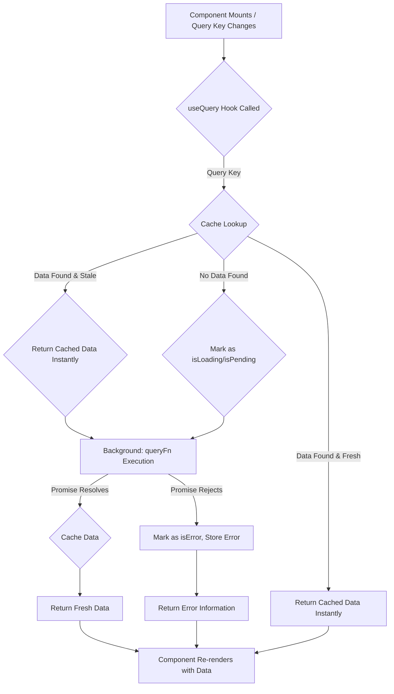

## Section 8: Core Concepts: Queries (`useQuery`), Mutations (`useMutation`), Query Client

Now that we have TanStack Query set up with `QueryClientProvider`, it's time to explore its core building blocks: queries for fetching data, mutations for changing data, and the `QueryClient` that orchestrates everything. These concepts are fundamental to leveraging TanStack Query effectively in your SpeedyMeds application.

### Queries with `useQuery`

The `useQuery` hook is the primary tool for fetching, caching, and synchronizing asynchronous data from your server. You provide it with a unique `queryKey` and a `queryFn` that returns a promise resolving with your data (or throwing an error).

**Basic Usage:**

```tsx
import { useQuery } from "@tanstack/react-query";
import { View, Text, ActivityIndicator, StyleSheet } from "react-native";

// Define an interface for our medication data
interface Medication {
  id: string;
  name: string;
  description: string;
  stock: number;
}

// Define your API fetching function
const fetchMedications = async (): Promise<Medication[]> => {
  // In a real app, this would be an API call, e.g., using fetch or axios
  // For this example, we simulate an API call with a delay
  await new Promise((resolve) => setTimeout(resolve, 1000));
  return [
    {
      id: "med001",
      name: "Amoxicillin 250mg",
      description: "Antibiotic for infections",
      stock: 150,
    },
    {
      id: "med002",
      name: "Lisinopril 10mg",
      description: "For high blood pressure",
      stock: 75,
    },
    {
      id: "med003",
      name: "Metformin 500mg",
      description: "For type 2 diabetes",
      stock: 200,
    },
  ];
};

const MedicationsList: React.FC = () => {
  const {
    data,
    isLoading,
    isError,
    error,
    status,
    isFetching, // Different from isLoading, true even for background refetches
    refetch, // Function to manually refetch
  } = useQuery<Medication[], Error>({
    queryKey: ["medications"], // Unique key for this query
    queryFn: fetchMedications, // Function that returns a promise
    // staleTime: 5 * 60 * 1000, // Optional: 5 minutes, data is considered fresh for this long
    // gcTime: 10 * 60 * 1000, // Optional: 10 minutes, (formerly cacheTime) data is garbage collected after this long if inactive
  });

  if (isLoading) {
    return <ActivityIndicator size="large" style={styles.centered} />;
  }

  if (isError) {
    return (
      <Text style={styles.errorText}>
        Error fetching medications: {error?.message}
      </Text>
    );
  }

  // status can also be 'pending', 'error', 'success'
  // console.log('Query status:', status);
  // console.log('Is fetching in background?:', isFetching);

  return (
    <View style={styles.container}>
      <Text style={styles.title}>Available Medications (SpeedyMeds)</Text>
      {data?.map((med) => (
        <View key={med.id} style={styles.medicationItem}>
          <Text style={styles.medName}>{med.name}</Text>
          <Text>Description: {med.description}</Text>
          <Text>In Stock: {med.stock}</Text>
        </View>
      ))}
      {/* Example of a manual refetch button */}
      {/* <Button title="Refresh Medications" onPress={() => refetch()} /> */}
    </View>
  );
};

const styles = StyleSheet.create({
  centered: { flex: 1, justifyContent: "center", alignItems: "center" },
  container: { padding: 15 },
  title: { fontSize: 20, fontWeight: "bold", marginBottom: 10 },
  errorText: { color: "red", textAlign: "center", marginTop: 20 },
  medicationItem: {
    marginBottom: 15,
    padding: 10,
    backgroundColor: "#f0f0f0",
    borderRadius: 5,
  },
  medName: { fontSize: 16, fontWeight: "600" },
});

export default MedicationsList;
```

**Explanation of `useQuery` Return Values:**

`useQuery` returns an object with various properties to help you manage the state of your data fetching:

- `data: TData | undefined`: The successfully fetched data for your query. It's `undefined` until data is fetched or if there's an error.
- `isLoading: boolean`: True if the query is currently fetching for the _first time_ and has no cached data. This is equivalent to `status === 'pending' && isFetching`.
- `isFetching: boolean`: True if the query is currently fetching, including background refetches or revalidation fetches.
- `isError: boolean`: True if the query encountered an error during fetching. This is equivalent to `status === 'error'`.
- `error: TError | null`: The error object if an error occurred.
- `status: 'pending' | 'error' | 'success'`: A string representing the current status of the query.
  - `'pending'`: The query is active but no data has been resolved yet.
  - `'error'`: The query encountered an error.
  - `'success'`: The query was successful and `data` is available.
- `refetch: () => Promise<UseQueryResult>`: A function to manually trigger a re-fetch of the query.
- And many more, including `isSuccess`, `isStale`, etc.

**Query Keys (`queryKey`):**
As mentioned, `queryKey` uniquely identifies your data. If your data depends on a variable (e.g., fetching a specific medication by ID), include that variable in the query key:

```tsx
// const { data } = useQuery({
//   queryKey: ['medication', medicationId],
//   queryFn: () => fetchMedicationById(medicationId)
// });
```

TanStack Query will automatically re-fetch if `medicationId` changes.

#### `useQuery` Data Flow Diagram



**Explanation of the Diagram:**

This diagram illustrates the lifecycle of a `useQuery` call:

1.  **Trigger:** The process begins when a component using `useQuery` mounts or when its specified `queryKey` changes.
2.  **Hook Call:** The `useQuery` hook is invoked with the `queryKey` and `queryFn`.
3.  **Cache Lookup:** TanStack Query first checks its internal cache for existing data matching the `queryKey`.
4.  **Data Found & Fresh:** If fresh data is found in the cache (not older than `staleTime`), it's returned immediately, and the component renders with this data.
5.  **Data Found & Stale:** If stale data is found, it's also returned immediately (stale-while-revalidate), making the UI responsive. Simultaneously, TanStack Query triggers the `queryFn` in the background to fetch fresh data.
6.  **No Data Found:** If no data for the `queryKey` exists in the cache, the query is marked as `isLoading` (or `status: 'pending'`), and the `queryFn` is executed.
7.  **`queryFn` Execution:** The provided asynchronous function (`queryFn`) is called to fetch data from the server.
8.  **Promise Resolves (Success):** If the `queryFn` promise resolves successfully, the fetched data is stored in the cache under its `queryKey`. The hook then returns this fresh data, and the component re-renders.
9.  **Promise Rejects (Error):** If the `queryFn` promise rejects, the query is marked as `isError` (or `status: 'error'`), the error information is stored, and the hook returns this error. The component re-renders with error information.
10. **Component Re-render:** In all cases where data or error status changes, the component using `useQuery` re-renders to reflect the latest state.

This flow ensures that components get data quickly if available, while also efficiently managing background updates and error states.

> 📚 **Official Documentation (`useQuery`):**
>
> - [TanStack Query - Queries (`useQuery`)](https://tanstack.com/query/v5/docs/react/guides/queries)
> - [TanStack Query - Query Keys](https://tanstack.com/query/v5/docs/react/guides/query-keys)
> - [TanStack Query - Query Functions](https://tanstack.com/query/v5/docs/react/guides/query-functions)
> - [TanStack Query - Important Defaults (staleTime, gcTime)](https://tanstack.com/query/v5/docs/react/important-defaults)

### Mutations with `useMutation`

While `useQuery` is for reading data, `useMutation` is used for creating, updating, or deleting data on the server (typically via POST, PUT, PATCH, DELETE requests).

**Basic Usage:**

```tsx
import { useMutation, useQueryClient } from "@tanstack/react-query";
import { View, TextInput, Button, Text, StyleSheet, Alert } from "react-native";
import React, { useState } from "react";

// Define an interface for adding a new prescription
interface NewPrescriptionPayload {
  patientId: string;
  medicationName: string;
  dosage: string;
  notes?: string;
}

interface Prescription extends NewPrescriptionPayload {
  id: string; // Server would assign an ID
  status: string;
}

// API function to add a new prescription
const addPrescriptionAPI = async (
  payload: NewPrescriptionPayload
): Promise<Prescription> => {
  // Simulate API call
  console.log("Adding prescription:", payload);
  await new Promise((resolve) => setTimeout(resolve, 1000));
  // In a real app, this would be a fetch/axios POST request
  // const response = await fetch('/api/prescriptions', { method: 'POST', body: JSON.stringify(payload) });
  // if (!response.ok) throw new Error('Failed to add prescription');
  // return response.json();

  // Mocked response
  return {
    ...payload,
    id: `presc_${Date.now()}`,
    status: "pending_approval",
  };
};

const AddPrescriptionForm: React.FC<{ patientId: string }> = ({
  patientId,
}) => {
  const queryClient = useQueryClient(); // Get the query client instance
  const [medicationName, setMedicationName] = useState("");
  const [dosage, setDosage] = useState("");

  const mutation = useMutation<Prescription, Error, NewPrescriptionPayload>({
    mutationFn: addPrescriptionAPI, // Function that performs the mutation
    onSuccess: (data, variables) => {
      // `data` is the result from mutationFn
      // `variables` is the payload passed to mutate()
      Alert.alert(
        "Success",
        `Prescription for ${variables.medicationName} added successfully! ID: ${data.id}`
      );

      // Invalidate queries that depend on prescriptions for this patient
      // This will cause relevant useQuery hooks to refetch fresh data
      queryClient.invalidateQueries({ queryKey: ["prescriptions", patientId] });
      queryClient.invalidateQueries({ queryKey: ["medications"] }); // If it affects overall medication list/stock

      // Optionally, you can update the cache directly if the server returns the new item
      // queryClient.setQueryData(['prescriptions', patientId], (oldData: any) => oldData ? [...oldData, data] : [data]);

      setMedicationName("");
      setDosage("");
    },
    onError: (error, variables) => {
      Alert.alert(
        "Error",
        `Failed to add prescription for ${variables.medicationName}: ${error.message}`
      );
    },
    // onSettled: (data, error, variables) => {
    //   // Called after onSuccess or onError
    //   console.log('Mutation settled!');
    // }
  });

  const handleSubmit = () => {
    if (!medicationName.trim() || !dosage.trim()) {
      Alert.alert(
        "Validation Error",
        "Medication name and dosage are required."
      );
      return;
    }
    mutation.mutate({ patientId, medicationName, dosage });
  };

  return (
    <View style={styles.formContainer}>
      <Text style={styles.formTitle}>
        Add New Prescription for Patient {patientId}
      </Text>
      <TextInput
        placeholder="Medication Name"
        value={medicationName}
        onChangeText={setMedicationName}
        style={styles.input}
      />
      <TextInput
        placeholder="Dosage (e.g., 10mg)"
        value={dosage}
        onChangeText={setDosage}
        style={styles.input}
      />
      <Button
        title={mutation.isPending ? "Adding..." : "Add Prescription"}
        onPress={handleSubmit}
        disabled={mutation.isPending}
      />
      {mutation.isError && (
        <Text style={styles.errorText}>Error: {mutation.error?.message}</Text>
      )}
    </View>
  );
};

const styles = StyleSheet.create({
  formContainer: {
    padding: 20,
    backgroundColor: "#fff",
    margin: 10,
    borderRadius: 8,
  },
  formTitle: {
    fontSize: 18,
    fontWeight: "bold",
    marginBottom: 15,
    textAlign: "center",
  },
  input: {
    borderWidth: 1,
    borderColor: "#ccc",
    padding: 10,
    marginBottom: 10,
    borderRadius: 5,
  },
  errorText: { color: "red", marginTop: 10, textAlign: "center" },
  // ... other styles from MedicationsList if needed
});

export default AddPrescriptionForm;
```

**Explanation of `useMutation`:**

- **`mutationFn`**: An asynchronous function that performs the actual create, update, or delete operation. It receives the variables you pass to the `mutate` function.
- **Return Value:** `useMutation` returns an object (here destructured into `mutation`) containing:
  - `mutate: (variables: TVariables, options?: MutateOptions) => void`: A function to trigger the mutation. You pass the necessary variables to it.
  - `mutateAsync: (variables: TVariables, options?: MutateOptions) => Promise<TData>`: Similar to `mutate`, but returns a promise that resolves with the mutation result or rejects with an error.
  - `isPending: boolean` (or `status === 'pending'`): True if the mutation is currently in progress.
  - `isSuccess: boolean` (or `status === 'success'`): True if the mutation was successful.
  - `isError: boolean` (or `status === 'error'`): True if the mutation failed.
  - `data: TData | undefined`: The data returned from a successful `mutationFn`.
  - `error: TError | null`: The error object if the mutation failed.
- **Side Effect Callbacks:**
  - `onSuccess: (data: TData, variables: TVariables, context?: TContext) => void`: Called if the mutation is successful. Ideal for invalidating related queries, showing success messages, or navigation.
  - `onError: (error: TError, variables: TVariables, context?: TContext) => void`: Called if the mutation fails. Good for showing error messages or logging.
  - `onSettled: (data?: TData, error?: TError, variables?: TVariables, context?: TContext) => void`: Called after the mutation is either successful or errors out. Useful for cleanup tasks.

**Invalidating Queries:** A crucial pattern after a successful mutation is to invalidate queries whose data might have changed due to the mutation. `queryClient.invalidateQueries({ queryKey: [...] })` tells TanStack Query to mark matching queries as stale, triggering a re-fetch for active queries. This ensures your UI displays fresh data. We'll cover this in more detail in Section 10.

> 📚 **Official Documentation (`useMutation`):**
>
> - [TanStack Query - Mutations (`useMutation`)](https://tanstack.com/query/v5/docs/react/guides/mutations)
> - [TanStack Query - Query Invalidation](https://tanstack.com/query/v5/docs/react/guides/query-invalidation)

### The `QueryClient`

The `QueryClient` instance you created and provided via `QueryClientProvider` is the heart of TanStack Query. It manages the cache and all query/mutation configurations and states.

While you often interact with TanStack Query through its hooks (`useQuery`, `useMutation`), you can also access the `QueryClient` instance directly using the `useQueryClient()` hook inside your components or event handlers.

Common uses for the `QueryClient` include:

- **Invalidating Queries:** `queryClient.invalidateQueries({ queryKey: [...] })` to mark queries as stale and trigger re-fetches.
- **Manually Setting Query Data:** `queryClient.setQueryData(queryKey, newData)` to optimistically update the cache or provide initial data.
- **Manually Getting Query Data:** `queryClient.getQueryData(queryKey)` to synchronously access cached data (use with caution, as it might be stale).
- **Prefetching Data:** `queryClient.prefetchQuery({ queryKey, queryFn })` to fetch data before it's needed by a `useQuery` hook, potentially improving perceived performance.
- **Global Configuration:** You can set default options for all queries and mutations when creating the `QueryClient` instance (e.g., default `staleTime`, `gcTime`, retry policies).

We'll see more practical uses of `QueryClient` methods, especially for cache management and mutations, in the upcoming sections.

> 📚 **Official Documentation (`QueryClient`):**
>
> - [TanStack Query - `QueryClient`](https://tanstack.com/query/v5/docs/react/reference/QueryClient)

### Exercise 13.3: Fetching Data with `useQuery`

Time to put your knowledge of `useQuery` into practice!

- **Objective:** Fetch and display a list of patient appointments for the SpeedyMeds app using `useQuery`.
- **Task:** You will simulate an API call to get appointment data and display it in a list format, handling loading and error states appropriately.

**(https://snack.expo.dev/YOUR_SNACK_ID_HERE)**

Understanding `useQuery` and `useMutation` is key to harnessing the power of TanStack Query. In the next sections, we'll delve deeper into caching strategies and how to effectively manage data updates with mutations.
