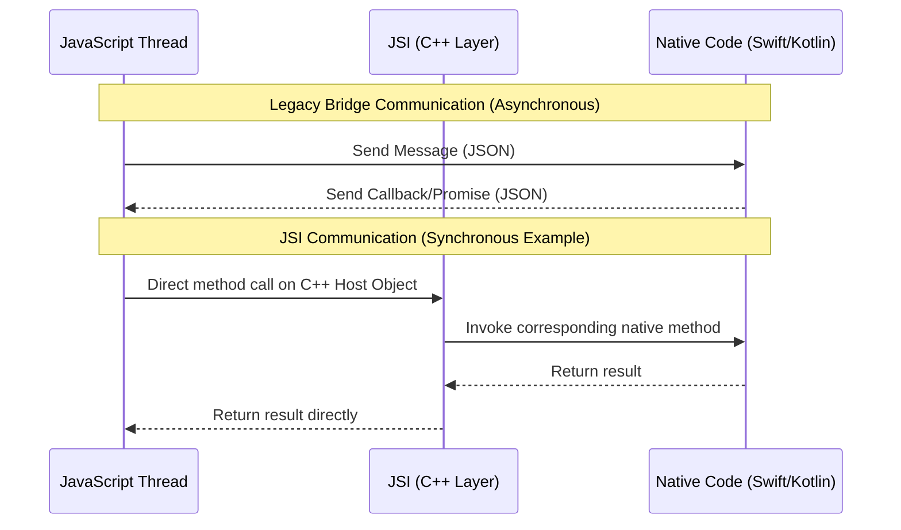

## Section 6: JSI for Direct Communication

This section focuses on the JavaScript Interface (JSI), a fundamental part of React Native's New Architecture. You'll learn what JSI is, how it enables direct and synchronous communication between JavaScript and native code, and its advantages over the legacy bridge.

### What is JSI (JavaScript Interface)?

JSI, or JavaScript Interface, is a lightweight, general-purpose API written in C++ that allows JavaScript code to hold references to C++ objects and invoke methods on them. Conversely, it allows C++ code to hold references to JavaScript objects and invoke their methods.

In the context of React Native's New Architecture, JSI serves as the foundational layer for communication between the JavaScript thread and the native side (which often involves C++). It effectively replaces the asynchronous, message-based bridge used in the legacy architecture.

Crucially, JSI itself is JavaScript-engine-agnostic. This means it can work with different JavaScript engines like Hermes (React Native's default optimized engine), JavaScriptCore (used by iOS), or V8 (used by Chrome and Node.js, and sometimes Android).

### How JSI Enables Direct Communication

Instead of sending JSON messages over a bridge, JSI allows JavaScript to directly invoke methods on native modules (specifically, C++ objects that then interface with platform-native code like Swift/Kotlin). This communication can be **synchronous**.

**Key aspects of JSI-based communication:**

1.  **Shared Ownership:** JavaScript can create and hold direct references to C++ host objects, and C++ can hold direct references to JavaScript objects (like functions).
2.  **Direct Method Invocation:** JavaScript can call methods on these C++ host objects as if they were regular JavaScript objects. This is significantly more efficient than serializing a message, sending it over the bridge, and waiting for a response.
3.  **Synchronous Execution:** Because JavaScript can directly call C++ methods, these calls can be synchronous if the native method itself is synchronous and doesn't block. This eliminates the need for `async/await` or Promises for certain types of operations where an immediate result is expected and can be provided quickly by the native side.
    - For example, accessing a simple, cached native value could be a synchronous JSI call.
4.  **Asynchronous Operations Still Possible:** While JSI allows for synchronous calls, complex or long-running native operations will still be executed asynchronously to avoid blocking the JavaScript thread. In these cases, JavaScript would typically invoke a JSI method that returns a Promise, similar to the legacy bridge patterns.

**Diagram Description:**
The diagram above illustrates the conceptual difference between the legacy bridge communication and JSI-based communication in React Native.

In the **Legacy Bridge Communication** (top part):

1. The JavaScript Thread sends a message, typically a JSON payload, to the Native Code asynchronously across the bridge.
2. The Native Code processes the message and eventually sends a response, often via a callback or Promise, back to the JavaScript Thread, again as a JSON payload over the bridge.
   This model involves serialization/deserialization and asynchronous hops.

In the **JSI Communication (Synchronous Example)** (bottom part):

1. The JavaScript Thread makes a direct method call on a C++ Host Object exposed via JSI.
2. The JSI (C++ Layer) immediately invokes the corresponding native method in the Swift/Kotlin Native Code.
3. The Native Code executes and returns the result to the JSI Layer.
4. The JSI Layer returns the result directly to the JavaScript Thread.
   This model allows for synchronous execution and avoids the serialization overhead of the bridge for certain types of calls. It signifies a tighter, more direct integration between the JavaScript and native realms.

### Advantages of JSI over the Legacy Bridge

- **Performance:** JSI significantly reduces the overhead of communication. Direct method calls are much faster than sending serialized messages. This is particularly beneficial for high-frequency interactions or when passing large amounts of data (though passing large data synchronously should still be done carefully).
- **Synchronous Access:** The ability to perform synchronous calls simplifies certain types of interactions where JavaScript needs an immediate result from the native side without the boilerplate of Promises.
- **Concurrency:** JSI allows native modules to expose methods that can be called from any thread, giving more control over threading models (though this is an advanced aspect).
- **Reduced Serialization Overhead:** By allowing direct memory access for certain types (like TypedArrays) and avoiding JSON serialization for every call, JSI is more efficient.
- **Foundation for TurboModules and Fabric:** JSI is a core enabler for both TurboModules (for native module communication) and Fabric (the new rendering system), which also uses JSI for communication between JavaScript and the native UI layer.

> [!IMPORTANT]
> While JSI enables synchronous native method calls, it's crucial to understand that long-running or blocking operations should still be performed asynchronously (e.g., by returning a Promise from the JSI method) to avoid freezing the JavaScript thread and negatively impacting UI responsiveness. Synchronous calls are best suited for quick, non-blocking operations.

> 🍏 **(iOS Developers):**
>
> **Comparison:** Think of JSI as creating a more direct binding between your JavaScript code and your native Swift/Objective-C code, facilitated by C++. Instead of messages being queued and processed asynchronously, JavaScript can, in some cases, invoke your native logic as if it were a direct function call, receiving results immediately. This is much closer to how Swift code might call an Objective-C method (or vice-versa) directly within the same process.
>
> **Key Takeaway:** JSI provides a lower-level, more performant, and potentially synchronous communication channel than the old `RCTBridge`, making JavaScript-to-native interactions feel more integrated.

> 🤖 **(Android Developers):**
>
> **Comparison:** JSI allows your JavaScript logic to interact with C++ objects that, in turn, call your Kotlin/Java code. This is more direct than the previous bridge mechanism, which involved passing messages. For synchronous operations, it feels more like a direct method invocation within the same runtime rather than an event being dispatched and handled.
>
> **Key Takeaway:** JSI is the technology that allows TurboModules to achieve better performance and offer synchronous capabilities, moving beyond the limitations of the traditional Android bridge.

> 🌐 **(Web Developers):**
>
> **Comparison:** JSI is somewhat analogous to WebAssembly (Wasm). Wasm allows you to run code written in languages like C++ or Rust directly in the browser, with JavaScript able to call Wasm functions and vice-versa with high performance. JSI provides a similar high-performance interop layer, but between JavaScript and native mobile code (via C++). It's a much tighter integration than, for example, making an `fetch` request to a separate backend process.
>
> **Key Takeaway:** JSI is an advanced mechanism that makes the boundary between JavaScript and native code more permeable and performant, enabling features not possible with the traditional asynchronous bridge.

> 📚 **Official Documentation:**
>
> - [React Native New Architecture: JavaScript Interface (JSI)](https://reactnative.dev/docs/the-new-architecture/pillars-jsi)
> - [Expo Docs: JSI and TurboModules](https://docs.expo.dev/new-architecture/jsi-turbomodules-fabric/)
> - [Blog Post: Understanding JSI by Oscar Franco](https://www.oscarfranco.dev/p/understanding-jsi) (Community resource, often cited for its clarity)
