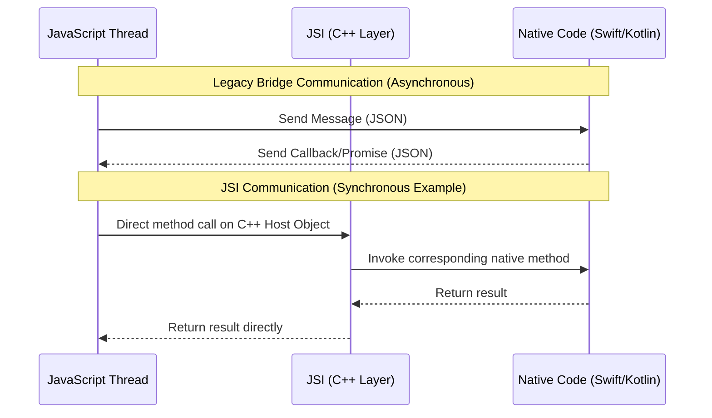

## Section 6: JSI for Direct Communication

This section focuses on the JavaScript Interface (JSI), a fundamental part of React Native's New Architecture. You'll learn what JSI is, how it enables direct and synchronous communication between JavaScript and native code, its advantages over the legacy bridge, and the implications of this powerful mechanism.

### What is JSI (JavaScript Interface)?

JSI, or JavaScript Interface, is a lightweight, general-purpose API written in C++ that allows JavaScript code to hold references to C++ objects and invoke methods on them. Conversely, it allows C++ code to hold references to JavaScript objects and invoke their methods.

In the context of React Native's New Architecture, JSI serves as the foundational layer for communication between the JavaScript thread and the native side. It effectively replaces the asynchronous, message-based bridge used in the legacy architecture. JSI is JavaScript-engine-agnostic, meaning it can work with different JavaScript engines like Hermes (React Native's default optimized engine) or JavaScriptCore.

JSI is the single most critical architectural innovation enabling the performance leap and enhanced capabilities of the New Architecture. It directly tackles the limitations of the legacy bridge by providing a more direct and efficient communication pathway.

### How JSI Works and Enables Direct Communication (Under the Hood)

Instead of sending JSON messages over a bridge, JSI allows JavaScript to directly interact with C++ code, which in turn interfaces with platform-native code (Swift/Kotlin).

**Key aspects of JSI-based communication:**

1.  **C++ Layer:** JSI defines a set of C++ interfaces, classes, and functions. The JavaScript engine implements one side of these interfaces, and the host environment (React Native) implements the other. This shared C++ interface allows them to communicate directly.
2.  **Direct Method Calls & Host Objects:** JSI allows C++ code to expose objects, known as **Host Objects**, directly to the JavaScript runtime. JavaScript code can obtain references to these Host Objects and invoke their methods as if they were regular JavaScript objects. This method invocation translates into a direct call to the underlying C++ method.
3.  **Synchronous Execution Potential:** Because JavaScript can directly call C++ methods, these calls can be **synchronous** if the native method itself is synchronous and doesn't block. This eliminates the need for `async/await` or Promises for certain types of operations where an immediate result is expected and can be provided quickly by the native side (e.g., accessing a simple, cached native value).
4.  **Efficient Data Transfer (Avoiding Serialization):** For many common data types (numbers, booleans, strings), JSI allows more direct manipulation and transfer between JavaScript and C++ compared to the legacy bridge's mandatory serialization/deserialization to/from JSON strings. While complex objects might still require some form of conversion, bypassing JSON for frequent, simple calls significantly reduces overhead.
5.  **Asynchronous Operations Still Supported:** While JSI allows for synchronous calls, complex or long-running native operations will still be executed asynchronously to avoid blocking the JavaScript thread. In these cases, JavaScript would typically invoke a JSI method that returns a Promise.

**Diagram Description:**
The diagram above illustrates the conceptual difference between the legacy bridge communication and JSI-based communication in React Native.

In the **Legacy Bridge Communication** (top part):

1. The JavaScript Thread sends a message, typically a JSON payload, to the Native Code asynchronously across the bridge.
2. The Native Code processes the message and eventually sends a response, often via a callback or Promise, back to the JavaScript Thread, again as a JSON payload over the bridge.
   This model involves serialization/deserialization and asynchronous hops.

In the **JSI Communication (Synchronous Example)** (bottom part):

1. The JavaScript Thread makes a direct method call on a C++ Host Object exposed via JSI.
2. The JSI (C++ Layer) immediately invokes the corresponding native method in the Swift/Kotlin Native Code.
3. The Native Code executes and returns the result to the JSI Layer.
4. The JSI Layer returns the result directly to the JavaScript Thread.
   This model allows for synchronous execution and avoids the serialization overhead of the bridge for certain types of calls. It signifies a tighter, more direct integration between the JavaScript and native realms.

### Implications of Synchronous Communication via JSI

The ability of JSI to facilitate synchronous calls has profound implications:

- **Performance Gains:** For interactions that require immediate responses or high frequency, JSI offers substantial performance improvements by eliminating the latency and overhead associated with the Bridge's asynchronous queuing and JSON serialization. This is crucial for smooth animations driven by native events or real-time updates from sensors.
- **Simplified Logic:** In the legacy system, managing sequences of operations involving native calls often required complex Promise chains or nested callbacks. Synchronous JSI calls can simplify this logic, making code easier to write, read, and debug in scenarios where an immediate result from native code is needed.
- **New Capabilities:** JSI unlocks possibilities that were previously impractical. For example, JavaScript can synchronously query native state information needed for immediate UI rendering calculations, or complex C++ libraries can be exposed directly to JS for instant invocation.

### JSI vs. The Bridge (Comparison)

| Aspect             | Legacy Bridge                                    | JSI (New Architecture)                          | Key Difference                                  |
| ------------------ | ------------------------------------------------ | ----------------------------------------------- | ----------------------------------------------- |
| **Communication**  | Indirect (Message Queue), Asynchronous           | Direct (C++ Layer), Synchronous Capable         | Synchronicity, Latency                          |
| **Data Transfer**  | JSON Serialization/Deserialization (Overhead)    | More Direct (Less Serialization Overhead)       | Efficiency, Reduced Bottleneck                  |
| **Performance**    | Slower (Async Latency, Serialization Bottleneck) | Significantly Faster (for many operations)      | Speed, Responsiveness                           |
| **Mechanism**      | Message Passing (JS -> Native)                   | Direct Function Calls (JS <-> C++ <-> Native)   | Interaction Model                               |
| **JS Interaction** | Callbacks, Promises                              | Direct Method Calls (on Host Objects), Promises | Potential for Simpler Logic (Synchronous cases) |

### Advantages of JSI over the Legacy Bridge (Summary)

- **Performance:** Direct method calls are much faster than sending serialized messages.
- **Synchronous Access:** Simplifies certain interactions needing immediate native results.
- **Concurrency:** Allows native modules to expose methods callable from any thread (advanced).
- **Reduced Serialization Overhead:** More efficient data transfer for common types.
- **Foundation for TurboModules and Fabric:** Core enabler for the New Architecture's pillars.

> [!IMPORTANT]
> While JSI enables synchronous native method calls, it's crucial to understand that long-running or blocking operations should still be performed asynchronously (e.g., by returning a Promise from the JSI method) to avoid freezing the JavaScript thread and negatively impacting UI responsiveness. Synchronous calls are best suited for quick, non-blocking operations.

> [!NOTE]
> While Codegen for TurboModules and Fabric abstracts away much of the direct JSI/C++ interaction, developers venturing into highly custom JSI integrations or debugging complex cross-language issues might find themselves needing to understand or even write C++ code. This adds another potential layer of complexity for those pushing the boundaries of native integration.

> 🍏 **(iOS Developers):**
>
> **Comparison:** Think of JSI as creating a more direct binding between your JavaScript code and your native Swift/Objective-C code, facilitated by C++. Instead of messages being queued and processed asynchronously, JavaScript can, in some cases, invoke your native logic as if it were a direct function call, receiving results immediately. This is much closer to how Swift code might call an Objective-C method (or vice-versa) directly within the same process.
>
> **Key Takeaway:** JSI provides a lower-level, more performant, and potentially synchronous communication channel than the old `RCTBridge`, making JavaScript-to-native interactions feel more integrated.

> 🤖 **(Android Developers):**
>
> **Comparison:** JSI allows your JavaScript logic to interact with C++ objects that, in turn, call your Kotlin/Java code. This is more direct than the previous bridge mechanism, which involved passing messages. For synchronous operations, it feels more like a direct method invocation within the same runtime rather than an event being dispatched and handled.
>
> **Key Takeaway:** JSI is the technology that allows TurboModules to achieve better performance and offer synchronous capabilities, moving beyond the limitations of the traditional Android bridge.

> 🌐 **(Web Developers):**
>
> **Comparison:** JSI is somewhat analogous to WebAssembly (Wasm). Wasm allows you to run code written in languages like C++ or Rust directly in the browser, with JavaScript able to call Wasm functions and vice-versa with high performance. JSI provides a similar high-performance interop layer, but between JavaScript and native mobile code (via C++). It's a much tighter integration than, for example, making an `fetch` request to a separate backend process.
>
> **Key Takeaway:** JSI is an advanced mechanism that makes the boundary between JavaScript and native code more permeable and performant, enabling features not possible with the traditional asynchronous bridge.

> 📚 **Official Documentation:**
>
> - [React Native New Architecture: JavaScript Interface (JSI)](https://reactnative.dev/docs/the-new-architecture/pillars-jsi)
> - [Expo Docs: JSI and TurboModules](https://docs.expo.dev/new-architecture/jsi-turbomodules-fabric/)
> - [Hermes Engine - JSI](https://hermesengine.dev/docs/jsi/) (Hermes specific documentation on its JSI implementation)
> - [Blog Post: Understanding JSI by Oscar Franco](https://www.oscarfranco.dev/p/understanding-jsi) (Community resource, often cited for its clarity)

### Next Steps

Understanding JSI is crucial for grasping how the New Architecture achieves its performance and integration goals. While TurboModules leverage JSI for API-like interactions, another important aspect of native integration is bringing custom native UI elements into your React Native application. The next section will provide a conceptual overview of bridging native UI components. Proceed to [Section 7: Bridging Native UI Components (Conceptual Overview)](./section-07-bridging-native-ui-components.md).
