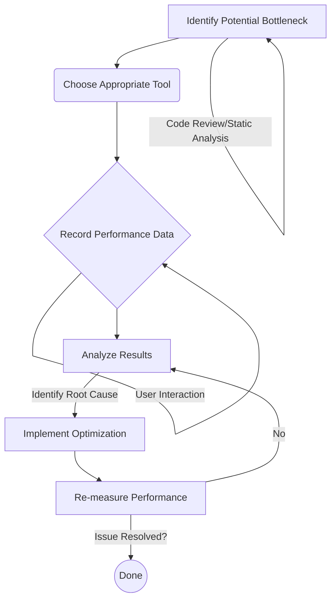

## Section 2: Measuring Performance

Identifying that your SpeedyMeds app might be slow is one thing; pinpointing _why_ it's slow requires specific tools and techniques. This section explores how to measure the performance of your React Native application to diagnose bottlenecks effectively.

> 🛣️ **(All Learners):** Learning to use these measurement tools is like a doctor learning to use a stethoscope. They help you listen to the heartbeat of your application and understand what's happening under the hood.

### Conceptual Content: Tools of the Trade

Several tools are at your disposal for measuring and profiling React Native app performance. The most prominent ones are Flipper and the React DevTools Profiler.

#### 1. Flipper

Flipper is an extensible mobile app debugger platform created by Facebook (now Meta). It provides a desktop interface to inspect, control, and debug your mobile apps. For React Native, Flipper integrates many useful tools out-of-the-box or via plugins, especially when using a development build (`expo-dev-client`) or a native build.

- **React DevTools:** Allows you to inspect the React component hierarchy, props, and state. Crucially, it includes the Profiler for identifying rendering bottlenecks.
- **Hermes Debugger:** If your app uses the Hermes JavaScript engine, Flipper provides a dedicated debugger for JavaScript, allowing you to set breakpoints, inspect variables, and analyze JavaScript execution. This is invaluable for understanding complex JS logic that might be slowing down the JS thread.
- **Native Modules Inspector:** Useful for understanding which native modules are being called, though direct performance implications might require deeper profiling.
- **Crash Reporter:** Helps you track and understand native crashes in your application.
- **Network Inspector:** Allows you to inspect outgoing network requests, their timings, and responses. This is crucial for diagnosing slow API calls that might be blocking UI updates or user interactions in the SpeedyMeds app (e.g., fetching medication details).
- **Performance Profiler (Systrace / Perfetto):** This is one of the most powerful features for in-depth performance analysis. It provides a detailed timeline of what's happening on both the native side (UI thread, background threads) and the JavaScript thread. You can see CPU usage, thread states, bridge messages (in legacy architecture), and JavaScript execution times. This helps identify if the bottleneck is on the JS side, native side, or in their interaction.
  - With Hermes, you can also generate and view Hermes trace profiles, which give very detailed insight into JS execution.

> 📲 **(Native Developers):** > **Comparison:** Flipper aims to be a unified debugging platform similar to Xcode's Instruments or Android Studio's Profiler, but with a stronger focus on the cross-platform nature of React Native and JavaScript introspection.
>
> - 🍏 **(iOS Developers):** Systrace in Flipper is conceptually similar to Time Profiler in Instruments. It helps you see what's happening across different threads.
> - 🤖 **(Android Developers):** Flipper's Performance Profiler often uses Perfetto underneath, which is the standard profiling tool on Android. You'll find similarities with Android Studio's CPU Profiler.
>   **Key Takeaway:** Flipper provides a bridge between JavaScript and native profiling, offering a holistic view often needed in React Native development.

#### 2. React DevTools Profiler

While often used within Flipper, the React DevTools Profiler can also be used as a standalone extension with Chrome when debugging your app via Metro. Its primary function is to record and visualize how your React components render, why they re-render, and how much time is spent rendering each component.

- **Flamegraphs and Ranked Charts:** These visualizations help you quickly identify components that are rendering too often or taking too long to render.
- **Commit Information:** Shows you which props or state changes caused a component to re-render.

> 🌐 **(Web Developers):**
>
> - ⚛️ **(React Developers):** This is the same Profiler you use for web development. Its application and interpretation are identical.
>   **Key Takeaway:** Your existing React Profiler skills are directly transferable to React Native performance tuning.
>   **Source:** [Profiling with React DevTools](https://react.dev/learn/optimizing-performance#profiling-with-the-react-devtools)

#### 3. Browser DevTools (Chrome DevTools)

When your React Native app is running in debug mode and connected to Metro, you can open Chrome DevTools to debug your JavaScript code. While not primarily a performance _measurement_ tool for rendering, its Performance tab can give insights into JavaScript execution, memory usage, and CPU profiling for the JS thread.

- **Performance Tab:** Can record JavaScript CPU profiles to find heavy functions.
- **Console:** Useful for `console.log` debugging and basic timing with `console.time`.
- **Network Tab:** Shows network requests initiated from the JS side.

> [!NOTE]
> Using Chrome DevTools for JS debugging disables Hermes's native debugging capabilities and can itself impact performance due to the JS code running in Chrome's V8 engine instead of Hermes directly on the device/simulator. For accurate on-device JS performance profiling, Hermes traces via Flipper are preferred.

#### 4. `console.time` and `console.timeEnd`

For quick and dirty measurements of specific JavaScript function execution times, you can use `console.time('timerName')` and `console.timeEnd('timerName')`.

```typescript
console.time("loadMedicationDetails");
// Code to load medication details for SpeedyMeds
const details = await fetchMedicationDetails(medicationId);
console.timeEnd("loadMedicationDetails");
// Output: loadMedicationDetails: 123.45ms
```

- **Use Case:** Good for isolating the performance of specific synchronous or asynchronous blocks of JavaScript code.
- **Limitation:** Doesn't provide a holistic view like Flipper or React DevTools Profiler and can be cumbersome for many measurements.

### Procedural Content: Getting Started with Measurement

Detailed walkthroughs for each tool are extensive, but here's a general approach:

1.  **Install Flipper:** Download and install Flipper from [fbflipper.com](https://fbflipper.com/).
2.  **Ensure App Compatibility:** For full Flipper integration (especially Hermes debugging and Systrace), your app should ideally be:
    - Using a recent React Native version (0.62+).
    - Configured to use Hermes (default in newer Expo projects).
    - Running as a development build (e.g., created with `npx expo run:ios` or `npx expo run:android` using `expo-dev-client`) or a direct native build. Expo Go has limited Flipper support.
3.  **Launch Your App & Flipper:** Start your development build on a simulator/emulator or device. Launch Flipper. Your app should appear in Flipper if correctly configured.
4.  \*\*Using React DevTools Profiler (within Flipper or Standalone):
    - In Flipper: Select your app, go to "React DevTools", then the "Profiler" tab.
    - Standalone: When debugging with Metro (Remote JS Debugging enabled), open Chrome, go to `http://localhost:8081/debugger-ui/`, open Chrome DevTools, and find the "Profiler" tab (may require installing the React DevTools extension).
    - Click the record button, interact with the part of your SpeedyMeds app you want to profile (e.g., scrolling a list of prescriptions), and then stop recording.
    - Analyze the flamegraph or ranked chart to see render times and identify expensive components.
5.  \*\*Using Flipper Performance Profiler (Systrace/Perfetto):
    - In Flipper, select your app, go to "Performance Profiler" (or a similar name like "System Trace" or "CPU Profiler" depending on the version and platform).
    - Start a recording, interact with your app, and stop the recording.
    - Explore the timeline view, zoom in on periods of jank or high CPU usage, and inspect the JS thread and native threads.

### Performance Measurement Workflow

The general workflow for measuring and addressing performance issues can be visualized as follows:



This diagram illustrates the iterative process of performance tuning. You start by identifying a potential issue (e.g., slow rendering of the SpeedyMeds medication list). Then, you select a tool like the React DevTools Profiler. You record data while interacting with the problematic feature. After analyzing the results (e.g., noticing list items re-render unnecessarily), you implement an optimization (e.g., using `React.memo` on list items). Finally, you re-measure to confirm the improvement. If the issue persists or new ones arise, you repeat the analysis and optimization steps.

> [!TIP]
> Always profile your application in **release/production mode** or a development build that closely mimics it for the most accurate performance metrics. Debug mode in React Native adds significant overhead that can skew measurements.

> 📚 **Official Documentation:**
>
> - [Flipper](https://fbflipper.com/)
> - [React Native Docs: Profiling](https://reactnative.dev/docs/profiling)
> - [React Native Docs: Profiling with Hermes](https://reactnative.dev/docs/profile-hermes)
> - [Expo Docs: Debugging - Flipper](https://docs.expo.dev/debugging/flipper/)
> - [React DevTools Profiler](https://react.dev/learn/optimizing-performance#profiling-with-the-react-devtools)

By familiarizing yourself with these tools, you can move from guessing about performance to making data-driven decisions to optimize your SpeedyMeds app.
