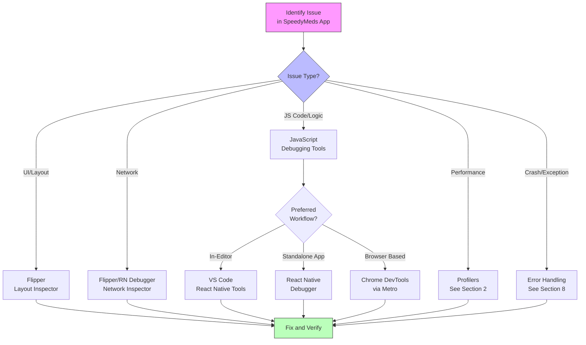

## Section 7: Debugging Tools

Effective debugging is essential for resolving issues quickly and efficiently during development. React Native offers a variety of tools to help you inspect your app's state, debug JavaScript code, analyze network requests, and more. This section explores the key debugging tools available for your SpeedyMeds application.

> 🛣️ **(All Learners):** Familiarizing yourself with these debugging tools will significantly speed up your development workflow and help you build more stable and reliable applications.

### Conceptual Content: Your Debugging Arsenal

React Native development leverages a combination of browser-based tools, standalone applications, and in-app menus to provide a comprehensive debugging experience.

This diagram illustrates the typical debugging workflow for a React Native application like SpeedyMeds. Depending on the type of issue you're facing, you'll choose different debugging tools from your arsenal. The workflow generally follows a pattern of identifying the issue, selecting the appropriate tool, and then using that tool to fix and verify the solution.

#### 1. React Native Debugger (Standalone App)

React Native Debugger is a powerful standalone desktop application that combines several essential debugging tools into a single interface. It typically includes:

- **React DevTools:** For inspecting the React component hierarchy, props, state, and hooks. (Covered for profiling in Section 2, but equally a debugging tool).
- **Redux DevTools:** If you're using Redux for state management, this allows you to inspect actions, state changes, and time-travel debugging.
- **Network Inspector:** To inspect outgoing network requests and their responses.
- **Chrome DevTools elements (partial):** Offers a JavaScript console and debugger, allowing you to set breakpoints, step through code, and inspect variables.

It essentially provides a dedicated window with a pre-configured set of tools tailored for React Native, connecting to your app running in debug mode.

#### 2. Flipper (Revisiting for Debugging)

Flipper, introduced in Section 2 for performance measurement, is also a comprehensive debugging platform. Many of its plugins are invaluable for day-to-day debugging:

- **Layout Inspector:** Allows you to inspect the native view hierarchy, similar to the element inspector in browser developer tools. You can see view bounds, properties, and styles. This is great for debugging UI layout issues in SpeedyMeds, like why a button isn't where you expect it.
- **Network Inspector:** Detailed inspection of network requests and responses, including headers and bodies.
- **Hermes Debugger (if using Hermes):** A full-fledged JavaScript debugger for Hermes, allowing breakpoints, code stepping, variable inspection, and console interaction directly with the on-device JS engine.
- **Shared Preferences / AsyncStorage Viewer:** Inspect and modify data stored in AsyncStorage or Shared Preferences (Android) / NSUserDefaults (iOS).
- **Crash Reporter:** View native crash logs.
- **Logs (Device and Application):** Access native device logs (Logcat for Android, Console for iOS) and application-specific logs, including `console.log` output from JavaScript when Hermes is active.

#### 3. Chrome DevTools (via Metro Bundler)

When your React Native application is running in development mode with "Debug JS Remotely" enabled (or "Open JS Debugger"), it executes its JavaScript code within a WebWorker in your Chrome browser. This allows you to use the standard Chrome DevTools for debugging:

- **Console Tab:** View `console.log` statements, execute arbitrary JavaScript in the context of your app, and inspect objects.
- **Sources Tab:** Set breakpoints in your JavaScript/TypeScript code, step through execution, inspect variables, and analyze call stacks.
- **Network Tab:** Provides a basic view of network requests initiated from the JavaScript thread.

- **Caveats of Remote JS Debugging:**
  - **Performance Impact:** Running JS in Chrome is slower than on the device/emulator via Hermes or JSC. This can mask or alter performance characteristics.
  - **Hermes Disabled:** When remote JS debugging is active, the Hermes engine (if enabled for your app) is bypassed. You lose Hermes-specific features and performance benefits during that debug session.
  - **Debugger Discrepancies:** Subtle differences can exist between how code behaves in Chrome's V8 engine versus Hermes/JSC on the device.

#### 4. Expo Go Debugging Menu / React Native Developer Menu

Both Expo Go and standard React Native development builds provide an in-app developer menu, typically accessed by shaking your device or using a keyboard shortcut on emulators/simulators (e.g., `Cmd+D` for iOS Simulator, `Cmd+M` or `Ctrl+M` for Android Emulator).

This menu offers several debugging options:

- **Open JS Debugger / Debug JS Remotely:** Launches the Chrome DevTools for JavaScript debugging.
- **Toggle Element Inspector:** Overlays an inspector on your app UI, allowing you to tap on elements to see their properties, styles, and hierarchy. Useful for quick UI inspection without external tools.
- **Performance Monitor:** Shows a real-time overlay graph of RAM usage, JS heap, Views, UI frame rate, and JS frame rate. Useful for a quick glance at performance.
- **Enable/Disable Fast Refresh:** Toggles Fast Refresh, which provides near-instant feedback for changes in your code.
- **Reload App:** Reloads the JavaScript bundle.

#### 5. VS Code Debugger Extension for React Native

The official "React Native Tools" extension for Visual Studio Code provides an integrated debugging experience. You can:

- Set breakpoints directly in your VS Code editor.
- Step through code, inspect variables, and view the call stack.
- Use the Debug Console for `console.log` output and interaction.
- Configure launch profiles for different debugging scenarios.

This is often preferred for a more integrated development and debugging workflow, keeping you within your editor.

> 📲 **(Native Developers):** > **Comparison:** Flipper and React Native Debugger aim to provide a similar level of introspection as Xcode\'s debugger and view hierarchy inspector (for iOS) or Android Studio\'s Layout Inspector and debugger (for Android). For instance, Flipper\'s Layout Inspector is akin to native UI inspection tools, and its Hermes Debugger is analogous to using LLDB (iOS) or the JVM debugger (Android) for your JavaScript code.
> **Key Takeaway:** While the specific tools and underlying language (JavaScript vs. Swift/Kotlin) differ, the fundamental goals and many paradigms of debugging—inspecting state, stepping through code, analyzing UI hierarchies, and monitoring network traffic—remain consistent. React Native tools bridge these familiar concepts to the JavaScript world.
> **Source:** `[Flipper Documentation](https://fbflipper.com/)`, `[Xcode: Debugging](https://developer.apple.com/xcode/ide-features/#debugger)`, `[Android Studio: Debug your app](https://developer.android.com/studio/debug)`

> 🌐 **(Web Developers):** > **Comparison:** Chrome DevTools, when used for React Native remote JS debugging, will feel very familiar to web development debugging sessions. React Native Debugger essentially packages these familiar Chrome DevTools (like the JS console and sources tab) with React-specific tools (React DevTools, Redux DevTools). Flipper extends this further by offering a more mobile-centric and extensible approach, including insights into native device features and logs not typically available in web browser developer tools.
> **Key Takeaway:** Your web debugging skills, particularly with Chrome DevTools, are highly transferable to React Native. Tools like Flipper and React Native Debugger build upon that foundation, adding mobile-specific and React Native-centric enhancements.
> **Source:** `[Chrome DevTools Documentation](https://developer.chrome.com/docs/devtools/)`, `[React Native Debugger GitHub](https://github.com/jhen0409/react-native-debugger)`

### Procedural Content: Getting Started with Debugging Tools

#### Setting Up React Native Debugger

1.  **Installation:** Download the standalone React Native Debugger application from its GitHub releases page for your operating system.
2.  **Launch:** Open React Native Debugger _before_ you enable remote JS debugging in your app.
3.  **Connect App:** Run your React Native app on a simulator/device. Open the Developer Menu (shake or keyboard shortcut) and select "Debug JS Remotely" or "Open JS Debugger". React Native Debugger should automatically connect.
    - If it doesn't connect, ensure the port (usually 8081) is not conflicting. You might need to configure the port in React Native Debugger settings.

#### Using Flipper for Debugging

1.  **Installation & Setup:** (Covered in Section 2). Ensure your app is a development build or native build compatible with Flipper.
2.  **Launch App & Flipper:** Start your app and Flipper. Your app should appear in Flipper.
3.  **Explore Plugins:**
    - **Layout Inspector:** Select your app, then "Layout". Inspect the UI tree.
    - **Network:** Select "Network". Observe requests as your app makes them.
    - **Hermes Debugger:** If Hermes is enabled and your app is compatible, select "Hermes Debugger". You can set breakpoints in the JS code that Flipper shows, view console logs, etc.

#### Enabling JS Debugging with Chrome DevTools

1.  Run your app on a simulator/device or in Expo Go.
2.  Open the Developer Menu.
3.  Select "Debug JS Remotely" or "Open JS Debugger".
4.  This will open a new tab in Chrome (or prompt you to open one) at `http://localhost:8081/debugger-ui/` (port may vary).
5.  Open Chrome DevTools (right-click -> Inspect, or `Cmd+Opt+I` / `Ctrl+Shift+I`).
6.  Use the "Console" and "Sources" tabs for debugging.

> [!TIP]
> For a more streamlined debugging experience within your editor, the VS Code React Native Tools extension is highly recommended. It often provides a good balance of features without needing to switch between multiple windows as much.

> 📚 **Official Documentation & Resources:**
>
> - [React Native Docs: Debugging](https://reactnative.dev/docs/debugging)
> - [React Native Docs: Debugging Hermes](https://reactnative.dev/docs/debugging-hermes)
> - [Flipper - Extensible Mobile App Debugger](https://fbflipper.com/)
> - [Expo Docs: Debugging](https://docs.expo.dev/debugging/introduction/)
> - [React Native Debugger GitHub](https://github.com/jhen0409/react-native-debugger)
> - [VS Code React Native Tools Extension](https://marketplace.visualstudio.com/items?itemName=msjsdiag.vscode-react-native)

Mastering these debugging tools will empower you to efficiently find and fix issues in your SpeedyMeds app, from simple typos to complex state management bugs or UI anomalies.

### Next Steps

Beyond interactive debugging, robust error handling is crucial for building stable applications. The next section will cover strategies for handling errors gracefully in your React Native app. Proceed to [Section 8: Handling Errors](./section-08-handling-errors.md).
