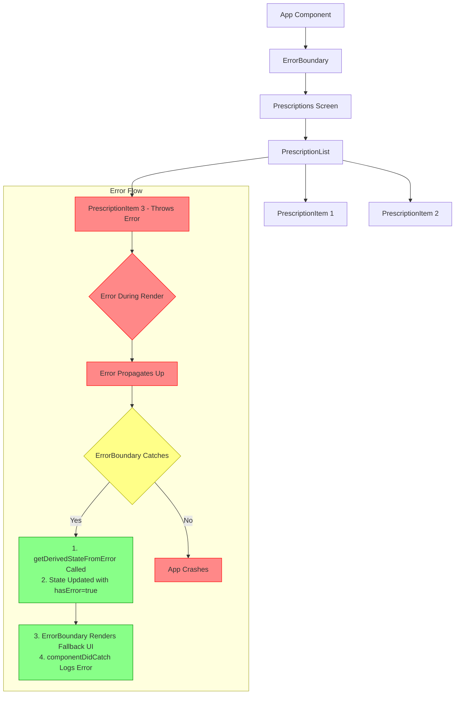

## Section 8: Handling Errors

Errors are an inevitable part of software development. Robust error handling is crucial for creating stable and user-friendly applications like SpeedyMeds. This section covers techniques for catching, handling, and logging errors in React Native applications, including the use of Error Boundaries.

> 🛣️ **(All Learners):** Implementing proper error handling prevents your app from crashing unexpectedly and allows you to provide a better user experience by displaying helpful messages or fallback UIs when things go wrong.

### Conceptual Content: Understanding and Managing Errors

Errors in React Native can originate from JavaScript code (e.g., syntax errors, runtime errors, unhandled promise rejections) or from native modules (e.g., a native API failing).

#### 1. Error Boundaries

Error Boundaries are React components that catch JavaScript errors anywhere in their child component tree, log those errors, and display a fallback UI instead of the component tree that crashed. They are a key mechanism for preventing a single UI component error from crashing the entire application.

- **How they work:** A class component becomes an Error Boundary if it defines either (or both) of these lifecycle methods:

  - `static getDerivedStateFromError(error)`: This static method is called during the "render" phase after an error has been thrown by a descendant component. It should return a value to update state, which then allows you to render a fallback UI in the `render` method.
  - `componentDidCatch(error, errorInfo)`: This method is called during the "commit" phase after an error has been thrown by a descendant component. It's used for side effects like logging the error to an external service (e.g., Sentry, Bugsnag). It receives both the error and an `errorInfo` object with a `componentStack` property.

- **Limitations:** Error Boundaries do _not_ catch errors for:

  - Event handlers (use `try/catch` instead).
  - Asynchronous code (e.g., `setTimeout` or `requestAnimationFrame` callbacks, Promise chains without explicit `catch`).
  - Server-side rendering (not applicable to React Native in the traditional sense).
  - Errors thrown in the Error Boundary component itself (rather than its children).

- **SpeedyMeds Example:** Wrapping a complex `PrescriptionDetailCard` component with an Error Boundary to show a "Could not display details" message if an unexpected error occurs while rendering the card, rather than crashing the entire prescriptions screen.



This diagram illustrates how errors flow through a React Native application with Error Boundaries. When PrescriptionItem 3 throws an error during rendering, the error propagates up the component tree until it reaches the ErrorBoundary. The ErrorBoundary intercepts the error, updates its state, and renders a fallback UI instead of the problematic subtree. Without the ErrorBoundary, the error would continue to propagate up and potentially crash the entire application.

#### 2. Global Error Handlers

While Error Boundaries are great for component-level errors, you might also want a global mechanism to catch unhandled JavaScript exceptions.

- **`ErrorUtils` (Legacy):** React Native historically had a global variable `ErrorUtils` with `setGlobalHandler` and `getGlobalHandler` methods. While still present, modern approaches often involve dedicated error reporting services.
- **Error Reporting Services:** Libraries like Sentry, Bugsnag, or Firebase Crashlytics provide SDKs for React Native that automatically capture unhandled JS errors, native crashes, and allow you to log additional context. These are highly recommended for production applications.
- `expo-dev-client` and some Expo modules might also provide hooks or mechanisms for improved error reporting during development.

#### 3. `try...catch` Blocks

For synchronous JavaScript code, the standard `try...catch` statement is used to handle errors within a specific block of code.

```typescript
try {
  // Code that might throw an error
  const data = JSON.parse(potentiallyInvalidJSONString);
  // Process data
} catch (error) {
  console.error("Failed to parse JSON:", error);
  // Handle the error, e.g., show a user-friendly message
}
```

For asynchronous code using `async/await`, `try...catch` works similarly:

```typescript
async function fetchData() {
  try {
    const response = await fetch("https://api.speedymeds.com/data");
    if (!response.ok) {
      throw new Error(`HTTP error! status: ${response.status}`);
    }
    const data = await response.json();
    return data;
  } catch (error) {
    console.error("Failed to fetch data:", error);
    // Propagate error or handle it by returning a default state
    throw error; // Or return null, an empty array, etc.
  }
}
```

#### 4. Promise `.catch()` Method

When working with Promises directly (without `async/await`), you can handle errors by chaining a `.catch()` method.

```typescript
fetch("https://api.speedymeds.com/data")
  .then((response) => {
    if (!response.ok) {
      throw new Error(`HTTP error! status: ${response.status}`);
    }
    return response.json();
  })
  .then((data) => {
    // Process data
  })
  .catch((error) => {
    console.error("Error in promise chain:", error);
    // Handle the error
  });
```

> [!IMPORTANT]
> Always handle Promise rejections. Unhandled promise rejections can lead to difficult-to-diagnose issues or even app crashes in some environments or future React Native versions.

#### 5. Logging Errors

Consistently logging errors is crucial for debugging and monitoring your application in production.

- **Development:** `console.error()` is useful for seeing errors during development.
- **Production:** Integrate with a remote logging or error tracking service (Sentry, Bugsnag, Firebase Crashlytics). These services provide dashboards, alerts, and detailed context (like device info, user actions, stack traces) to help you understand and prioritize fixes.

> 🌐 **(Web Developers):** > **Comparison:** Error Boundaries are a React-specific concept and function identically in React for the web. Similarly, `try...catch` blocks and Promise `.catch()` are standard JavaScript mechanisms for error handling that you already use.
> **Key Takeaway:** The primary difference when handling errors in React Native is the potential for native errors to surface from underlying device capabilities or native modules. Effective error handling often involves services that can capture and report both JavaScript exceptions and native crashes.
> **Source:** `[MDN Web Docs: Control flow and error handling](https://developer.mozilla.org/en-US/docs/Web/JavaScript/Guide/Control_flow_and_error_handling)`

> 📲 **(Native Developers):** > **Comparison:** React\'s Error Boundaries provide a component-level `try...catch` mechanism specifically for errors occurring during the render lifecycle of their children, which is a JavaScript-layer concept. Global error handlers and third-party reporting services (like Sentry or Firebase Crashlytics) in React Native serve a purpose similar to how these services capture unhandled exceptions and native crashes in pure native Android/iOS development.
> **Key Takeaway:** It\'s important to distinguish between JavaScript errors (which can be caught by Error Boundaries or `try...catch` within JS) and native code crashes. Comprehensive error reporting tools are valuable as they can often capture both types of issues.
> **Source:** `[Firebase Crashlytics Documentation](https://firebase.google.com/docs/crashlytics)`

### Procedural Content: Implementing Error Handling

#### Creating a Simple Error Boundary

This example shows how to create a basic Error Boundary component for your SpeedyMeds app.

```tsx
import React, { Component, ErrorInfo, ReactNode } from "react";
import { View, Text, StyleSheet, Button } from "react-native";

interface Props {
  children: ReactNode;
  fallbackMessage?: string;
}

interface State {
  hasError: boolean;
  error?: Error | null;
}

class ErrorBoundary extends Component<Props, State> {
  constructor(props: Props) {
    super(props);
    this.state = { hasError: false, error: null };
  }

  static getDerivedStateFromError(error: Error): State {
    // Update state so the next render will show the fallback UI.
    return { hasError: true, error };
  }

  componentDidCatch(error: Error, errorInfo: ErrorInfo) {
    // You can also log the error to an error reporting service here
    console.error(
      "Uncaught error in ErrorBoundary:",
      error,
      errorInfo.componentStack
    );
    // Example: logErrorToMyService(error, errorInfo);
  }

  handleResetError = () => {
    this.setState({ hasError: false, error: null });
    // Potentially, you might want to trigger a re-fetch or navigation
    // depending on the context of how this ErrorBoundary is used.
  };

  render() {
    if (this.state.hasError) {
      // You can render any custom fallback UI
      return (
        <View style={styles.errorContainer}>
          <Text style={styles.errorTitle}>Oops! Something went wrong.</Text>
          <Text style={styles.errorMessage}>
            {this.props.fallbackMessage || "An unexpected error occurred."}
          </Text>
          {this.state.error && (
            <Text style={styles.errorDetails} selectable>
              Error: {this.state.error.toString()}
            </Text>
          )}
          <Button
            title="Try Again"
            onPress={this.handleResetError}
            color="#007AFF"
          />
        </View>
      );
    }

    return this.props.children;
  }
}

const styles = StyleSheet.create({
  errorContainer: {
    flex: 1,
    justifyContent: "center",
    alignItems: "center",
    padding: 20,
    backgroundColor: "#fef2f2", // Light red background
  },
  errorTitle: {
    fontSize: 20,
    fontWeight: "bold",
    color: "#b91c1c", // Dark red
    marginBottom: 10,
  },
  errorMessage: {
    fontSize: 16,
    color: "#dc2626", // Red
    textAlign: "center",
    marginBottom: 10,
  },
  errorDetails: {
    fontSize: 12,
    color: "#7f1d1d", // Darker red
    textAlign: "center",
    marginVertical: 10,
    fontFamily: Platform.OS === "ios" ? "Menlo" : "monospace",
  },
});

export default ErrorBoundary;
```

**Using the Error Boundary:**
Wrap parts of your application that might fail. For example, a component displaying complex data for a SpeedyMeds prescription:

```tsx
// In another file, e.g., PrescriptionScreen.tsx
import React from "react";
import { View, Text } from "react-native";
import ErrorBoundary from "./ErrorBoundary"; // Assuming ErrorBoundary is in a separate file

const ProblematicComponent = () => {
  // Simulate an error
  if (Math.random() > 0.5) {
    // Randomly throws an error for demonstration
    throw new Error("Simulated rendering error in ProblematicComponent!");
  }
  return <Text>Content is loading fine...</Text>;
};

const AppWithBoundary: React.FC = () => {
  return (
    <View style={{ flex: 1, justifyContent: "center", alignItems: "center" }}>
      <Text style={{ marginBottom: 20, fontSize: 18 }}>
        SpeedyMeds - Prescription View
      </Text>
      <ErrorBoundary fallbackMessage="Could not display prescription details at this time.">
        <ProblematicComponent />
      </ErrorBoundary>
      <Text style={{ marginTop: 20 }}>Other content outside boundary.</Text>
    </View>
  );
};

export default AppWithBoundary;
```

If `ProblematicComponent` throws an error during rendering, the `ErrorBoundary` will catch it and display the fallback UI, instead of the whole app crashing. The "Other content outside boundary" will still be visible.

> [!TIP]
> Place Error Boundaries strategically. You might have a global one at the root of your app, and more specific ones around complex or critical UI sections (like navigation routes or major features).

> 📚 **Official Documentation & Resources:**
>
> - [React Docs: Error Boundaries](https://react.dev/reference/react/Component#catching-rendering-errors-with-an-error-boundary)
> - [React Native Docs: Handling Errors (Conceptual, often points to general JS practices)](https://reactnative.dev/docs/javascript-environment#javascript-runtime)
> - [Expo Docs: Error Handling and Debugging](https://docs.expo.dev/debugging/errors-and-warnings/)
> - [Sentry for React Native](https://sentry.io/for/react-native/)
> - [Bugsnag for React Native](https://www.bugsnag.com/platforms/react-native-error-reporting/)

### Exercise

Time to practice implementing an Error Boundary.

- **Exercise 15.2: Implementing an Error Boundary**
  - `**(https://snack.expo.dev/Error-Boundary-Exercise-15-2)**`
  - _Instructions: You will be provided with a Snack that includes a component prone to errors when rendering SpeedyMeds data. Your task is to create and implement an `ErrorBoundary` component to gracefully handle these errors and display a fallback UI. The `README.md` in the Snack will have detailed requirements._
