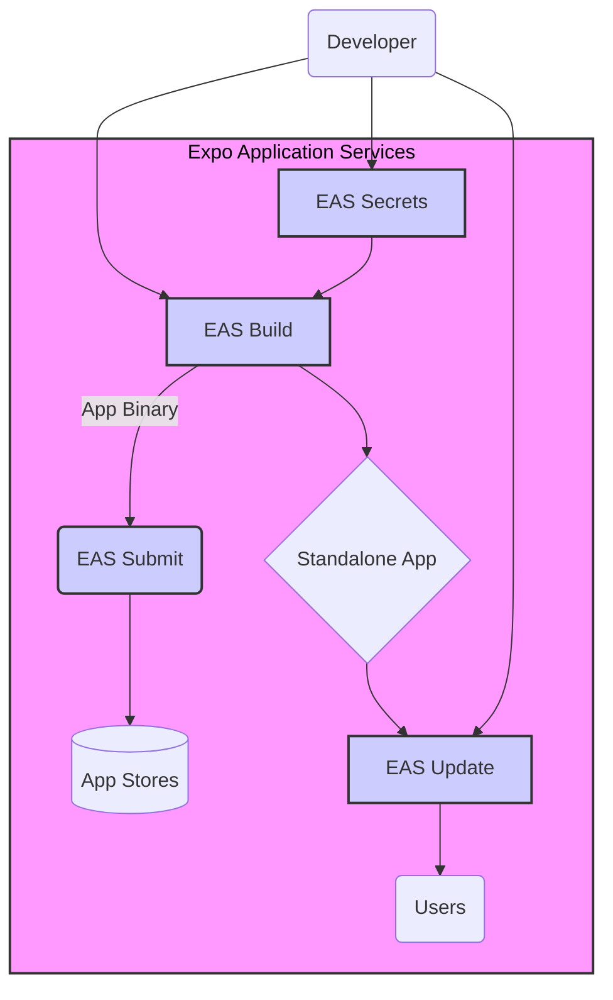

## Section 1: Introduction to EAS (Expo Application Services)

This section introduces you to Expo Application Services (EAS), a suite of hosted services built by Expo to simplify and enhance the lifecycle of your React Native applications. We'll explore what EAS is, its core components, and the significant benefits it brings to your development workflow, especially when preparing your app for production and distribution.

### What is Expo Application Services (EAS)?

Expo Application Services (EAS) is an integrated set of cloud services designed to work seamlessly with Expo and React Native projects. While the core Expo SDK and `expo` CLI help you develop your app locally and test it with Expo Go, EAS provides the necessary tools and infrastructure for the stages beyond local development: building distributable app binaries, submitting to app stores, managing updates, and handling other production-related tasks. Think of EAS as your DevOps toolkit for mobile app development with Expo.

EAS is designed to take over where Expo Go leaves off. Expo Go is fantastic for development and quick iteration, but it has limitations (e.g., it can't include custom native code). When you need to create a standalone app that includes your own native modules, or when you're ready to ship to the app stores, you need EAS.

### Core Components of EAS

EAS is composed of several key services, each addressing a specific part of the application lifecycle:

1.  **EAS Build:** A cloud build service that compiles standalone `ipa` (iOS) and `apk`/`aab` (Android) files from your project. It handles complex native dependencies, custom native code, and the intricacies of app signing, all in a managed cloud environment. You don't need to have macOS hardware to build iOS apps if you use EAS Build.
2.  **EAS Submit:** A service that automates the process of uploading your app binaries (built with EAS Build) to the Apple App Store and Google Play Store. It simplifies the submission workflow by managing credentials and interacting with store APIs.
3.  **EAS Update:** Allows you to deploy updates to your app's JavaScript bundle and assets over-the-air (OTA) without requiring users to download a new version from the app store. This is invaluable for shipping bug fixes, new features, and improvements quickly.
4.  **EAS Metadata (Conceptual, often part of Submit):** Helps manage your app store listings, including screenshots, descriptions, and other metadata directly from your project or via the EAS dashboard.
5.  **EAS Secrets:** A secure way to manage environment variables and other secrets (like API keys) for your application builds. These secrets are injected at build time, keeping them out of your source code.

These services work together to provide a cohesive experience for building and managing your applications.

This diagram illustrates the core components of Expo Application Services (EAS) and how they interact. The developer initiates processes like `EAS Build` and configures `EAS Secrets`. `EAS Build` produces a standalone app binary, which can then be sent to `EAS Submit` for uploading to the App Stores. The standalone app, once installed by users, can receive over-the-air updates via `EAS Update`. `EAS Secrets` provides necessary credentials and configurations to the build process. This entire suite of services aims to streamline the journey from development to production and beyond, allowing developers to focus more on app features and less on complex build and deployment pipelines.

### Benefits of Using EAS

Adopting EAS offers several significant advantages:

- **Simplified Builds:** No need to set up and maintain local build environments for iOS and Android, especially beneficial if you don't have a Mac for iOS builds. EAS handles native dependencies and complex build configurations in the cloud.
- **Faster Iteration:** EAS Update allows for rapid deployment of changes, bypassing the often lengthy app store review process for JS and asset updates.
- **Improved Collaboration:** Centralized build and submission processes make it easier for teams to work together.
- **Enhanced Security:** EAS Secrets provide a secure way to manage sensitive information, preventing accidental exposure in your codebase.
- **Support for Custom Native Code:** Unlike the classic `expo build` (which had limitations) or Expo Go, EAS Build fully supports projects with custom native modules, enabling you to extend your app with any native functionality required.
- **Scalability:** EAS is designed to scale with your needs, from small solo projects to large enterprise applications.
- **Integration with Expo Ecosystem:** EAS is tightly integrated with the Expo CLI and your Expo project configuration, providing a smooth developer experience.

> [!IMPORTANT]
> While EAS offers many services for free, some features or higher usage tiers may require a paid subscription. Always check the latest pricing and feature availability on the [Expo website](https://expo.dev/pricing).

> 📚 **Official Documentation:**
>
> - [Expo Docs: Introduction to EAS](https://docs.expo.dev/eas/)
> - [Expo Docs: Why EAS?](https://docs.expo.dev/build/introduction/#why-eas-build)
> - [Expo Docs: Core concepts of EAS Build](https://docs.expo.dev/build/concepts/)

In the next section, we'll compare EAS Build with the classic `expo build` system to understand its evolution and advantages more clearly.

---

_Next: [Section 2: EAS Build vs. Classic Expo Build](./section-02-eas-build-vs-classic-expo-build.md)_
