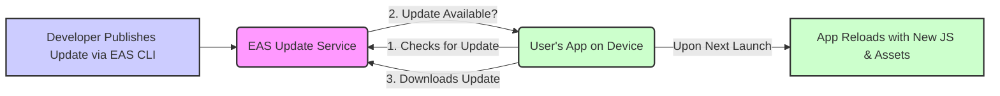

## Section 8: EAS Update (Over-the-Air Updates)

This section explores EAS Update, a powerful service that allows you to deploy updates to your app's JavaScript bundle and assets directly to your users' devices without requiring them to download a new version from the app store. This is commonly known as an Over-the-Air (OTA) update.

### What are Over-the-Air (OTA) Updates?

Over-the-Air (OTA) updates deliver new JavaScript code and assets (like images and fonts) to your app that is already installed on a user's device. When the app launches, it checks for new updates from a server, and if available, downloads and applies them. This means you can fix bugs, add new JavaScript-based features, or change your app's appearance without going through the full app store review and release process for every minor change.

**How it works conceptually:**

1.  Your app binary (built with EAS Build) includes the `expo-updates` native module.
2.  When the app starts, `expo-updates` checks with the EAS Update service for any new update published for its specific channel and runtime version.
3.  If an update (a new JS bundle and assets) is found, it's downloaded in the background.
4.  The next time the app is launched (or based on your configuration), it loads this new update.



This diagram shows the basic flow of an Over-the-Air update. The developer uses EAS CLI to publish an update to the EAS Update Service. When a user opens their app, the app checks with the EAS Update Service. If a new update is available for the app's specific configuration (like its channel and runtime version), the app downloads it. On the subsequent launch (or as configured), the app reloads, applying the new JavaScript bundle and assets. This allows for rapid iteration and bug fixing directly to users.

### Benefits of EAS Update

- **Rapid Bug Fixes:** Quickly deploy fixes for JavaScript-related bugs without waiting for app store review.
- **Faster Feature Rollouts:** Release new features developed purely in JavaScript much faster.
- **A/B Testing & Experimentation:** Deploy different versions of your JS bundle to different user segments (requires more advanced setup).
- **Reduced User Friction:** Users get updates automatically without needing to visit the app store and manually update the app.
- **Improved Development Velocity:** Iterate quickly on the JS parts of your app even after a store release.

### EAS Update and `expo-updates`

EAS Update works in conjunction with the `expo-updates` library, which must be installed in your project. This library is responsible for the client-side logic of checking for, downloading, and applying updates.

- **Installation:** If you initialized your project with a recent version of Expo, `expo-updates` is likely already installed. If not, you can install it with `npx expo install expo-updates`.
- **Configuration:** `expo-updates` is configured through your `app.json` or `app.config.js` file, specifying things like the update server URL (which points to EAS by default for EAS Build apps), enabled status, and check frequency.

When you use EAS Build, your app is automatically configured to use EAS Update as its update source.

### Configuring Builds for EAS Update (Channels)

Builds are configured to point to specific "channels" for updates. A channel is like a named stream where you publish updates. For example, you might have a `production` channel for live app updates and a `staging` channel for previewing updates with testers.

You can specify the channel a build should subscribe to in your `eas.json` build profiles:

```json
// In eas.json, under "build.production":
"production": {
  "distribution": "store",
  "channel": "production", // This build will look for updates on the "production" channel
  "env": {
    "EXPO_PUBLIC_APP_ENV": "production"
  }
  // ... other production settings
}

// In eas.json, under "build.preview":
"preview": {
  "distribution": "internal",
  "channel": "staging", // This build will look for updates on the "staging" channel
  "env": {
    "EXPO_PUBLIC_APP_ENV": "staging"
  }
  // ... other preview settings
}
```

By default, if no channel is specified in the build profile, EAS Build will assign a channel name that matches the build profile name (e.g., a build from the `production` profile will default to the `production` channel).

### Publishing an Update

To publish an update (your current JavaScript code and assets) to a specific channel, you use the `eas update` command:

```bash
eas update --branch <git-branch-name> --message "Your update message"
```

- `--branch <git-branch-name>`: EAS Update uses Git branches to group updates. It typically defaults to your current Git branch. Updates published from a specific Git branch are associated with a corresponding update branch on EAS. You then associate these update branches with channels.
- `--message "Your update message"`: A descriptive message for this update (e.g., "Fixed login button bug").

By default, EAS CLI will prompt you to choose which channel this update (from the specified branch) should apply to. For example, you might publish an update from your `main` Git branch to the `production` channel.

```bash
# Example: Publish current JS changes to the 'production' channel
# Assuming your 'main' Git branch is mapped to the 'production' channel
eas update --branch main --message "Released new homepage design"
```

EAS will bundle your JavaScript and assets, upload them to the EAS Update service, and make them available on the specified channel(s) linked to that branch.

### Understanding Channels and Branches

- **Branches (in EAS Update context):** These are pointers to a specific sequence of updates. They usually correspond to your Git branches. When you run `eas update`, you are creating a new update on a specific branch.
- **Channels:** These are what your app builds are configured to listen to. You point a channel to a specific update branch. For example, your `production` channel might point to the `main` update branch, while your `staging` channel might point to a `develop` update branch.

This separation allows you to promote updates through different environments (e.g., test an update on `staging` by pointing that channel to your feature branch, then update the `production` channel to point to `main` once verified).

### Viewing Update History

You can view the history of updates, manage channels, and see which builds are pointing to which updates on your Expo dashboard ([expo.dev/dashboard](https://expo.dev/dashboard)). This provides visibility into your OTA release process.

### Rollbacks and Advanced Strategies

- **Rollbacks:** If an update introduces an issue, you can easily roll back to a previous stable update by re-pointing the channel to an older update from the same branch via the Expo dashboard or `eas channel:edit`.
- **Phased Rollouts:** While EAS Update itself doesn't have built-in phased rollout percentages, you can achieve similar effects by using multiple channels or by implementing custom logic in your app (e.g., using a feature flagging service to control who gets the update logic triggered).

### Considerations and Limitations

- **Native Code Cannot Be Updated OTA:** EAS Update can only update the JavaScript bundle and assets. Any changes to native code (Java/Kotlin on Android, Swift/Objective-C on iOS), including adding new native modules or updating existing ones, require a new binary to be built with EAS Build and submitted to the app stores.
- **Runtime Version:** Updates are tied to a specific "runtime version" of your app. The runtime version is determined by the native dependencies (Expo SDK version, React Native version, other native modules). If you change native dependencies, you'll create a new runtime version, and OTA updates for an old runtime won't apply to builds with the new runtime.
- **Update Size:** Large updates can take time to download, especially on slower connections. Optimize your assets and keep your JS bundle size in check.
- **Testing:** Thoroughly test OTA updates on a staging channel or with a segment of users before rolling them out to everyone.

> [!CAUTION]
> While OTA updates are powerful, relying on them too heavily for major feature releases without any store update can sometimes lead to a large diff between the store version and the OTA updated version. It's good practice to periodically release new binaries to the store to consolidate native changes and major updates.

EAS Update is an indispensable tool for maintaining and iterating on your React Native application post-launch, providing speed and flexibility that traditional app store releases alone cannot offer.

> 📚 **Official Documentation:**
>
> - [Expo Docs: EAS Update Introduction](https://docs.expo.dev/eas-update/introduction/)
> - [Expo Docs: How EAS Update works](https://docs.expo.dev/eas-update/how-eas-update-works/)
> - [Expo Docs: `expo-updates` library](https://docs.expo.dev/versions/latest/sdk/updates/)
> - [Expo Docs: Channels (for EAS Update)](https://docs.expo.dev/eas-update/channels/)
> - [Expo Docs: `eas update` command reference](https://docs.expo.dev/eas-update/eas-update-command/)

### Exercise 16.2: Publishing an EAS Update

This exercise provides conceptual instructions on how you would publish an EAS Update. Since this requires a deployed app and specific project setup, we will focus on the commands and thought process.

**Scenario:** You have an app in production built with the `production` profile, which points to the `production` channel for updates. You've just fixed a critical JavaScript bug on your `main` Git branch.

**Task:** Conceptually outline the steps and the EAS CLI command you would use to deploy this fix as an OTA update.

`**(CONCEPTUAL_INSTRUCTIONS_URL_EXERCISE_16_2)**`

(This would ideally be a document or a series of steps for the student to follow conceptually, or a quiz in Microsoft Forms asking them to identify the correct command and parameters.)

---

_Next: [Section 9: Managing Secrets with EAS](./section-09-managing-secrets-with-eas.md)_
