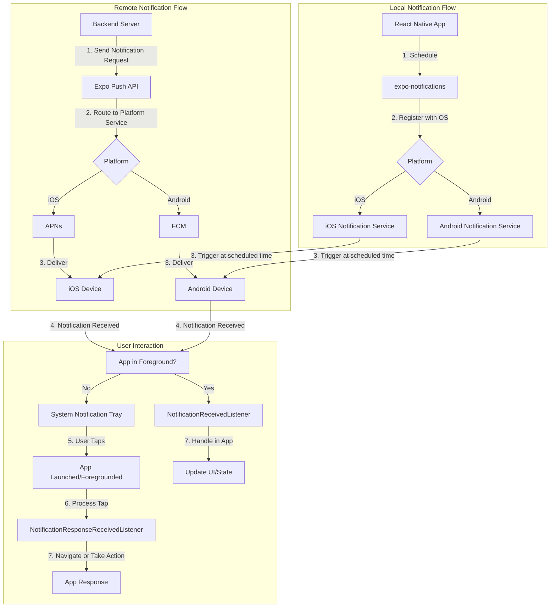

## Section 6: Push Notifications with `expo-notifications`

This section delves into implementing push notifications in your React Native application using the `expo-notifications` library. Push notifications are a vital tool for engaging users, delivering timely information, and encouraging interaction with your app, such as reminding a SpeedyMeds user to take their medication.

### Conceptual Content

**What are Push Notifications?**

Push notifications are messages sent from a server to a user's device, appearing even when the app is not actively in use. They serve various purposes:

- **Alerts & Reminders:** Informing users about important events (e.g., medication reminders, appointment confirmations).
- **Updates:** Notifying users about new content or features.
- **Re-engagement:** Encouraging inactive users to return to the app.

There are two main types of push notifications:

1.  **Local Notifications:** Scheduled and triggered directly by the application on the device itself. They don't require a server. Useful for reminders or time-based alerts set within the app.
2.  **Remote (or Push) Notifications:** Sent from an app server to devices via a push notification service provided by the platform vendor (Apple Push Notification service - APNs for iOS, Firebase Cloud Messaging - FCM for Android).



This diagram illustrates the complete lifecycle of both remote and local notifications in a React Native application using expo-notifications. The flow shows how notifications are created, delivered through platform-specific services, and then handled based on whether the app is in the foreground or background. For the SpeedyMeds app, this is particularly important for medication reminders, prescription status updates, and appointment notifications.

**`expo-notifications` Library**

`expo-notifications` is an Expo SDK library that provides a unified API for handling both local and remote push notifications across iOS and Android. It simplifies the complexities of interacting with platform-specific services.

**Key Features:**

- Scheduling local notifications.
- Receiving remote push notifications.
- Handling notification responses (e.g., when a user taps a notification).
- Managing notification permissions.
- Setting notification channels (Android) and categories (iOS).
- Badge count management.

**Installation and Setup**

1.  **Install the library:**

    ```bash
    npx expo install expo-notifications
    ```

2.  **Configuration (`app.json` / `app.config.js`):**
    For remote push notifications, you often need to configure platform-specific settings (like an FCM server key for Android or APNs setup for iOS). Expo attempts to simplify this, especially when using EAS Build. For basic local notifications, minimal configuration might be needed. However, to customize appearance and behavior (e.g., icons, sounds), you may need to add configuration to your `app.json` or `app.config.js`.

    Example for custom Android notification icon and color:

    ```json
    // app.json
    {
      "expo": {
        // ... other config
        "plugins": [
          [
            "expo-notifications",
            {
              "icon": "./assets/notification-icon.png", // Path to your 96x96 grayscale icon
              "color": "#FFFFFF" // Color for the icon
            }
          ]
        ]
      }
    }
    ```

> [!IMPORTANT]
> For remote push notifications in production, you will need to configure credentials with APNs and FCM. EAS Build significantly helps in managing this process. Refer to the official Expo documentation for detailed setup instructions, especially when preparing for production builds.

### Referential Content

**1. Requesting Permissions**

Before you can send or receive notifications, you must request permission from the user.

```typescript
import * as Notifications from "expo-notifications";

/**
 * @async
 * @function requestPermissionsAsync
 * @description Checks existing notification permissions and requests new ones if not already granted.
 * Configures iOS specific permissions for alert, badge, sound, and announcements.
 * @returns {Promise<boolean>} A promise that resolves to `true` if permissions are granted, `false` otherwise.
 */
async function requestPermissionsAsync() {
  const { status: existingStatus } = await Notifications.getPermissionsAsync();
  let finalStatus = existingStatus;
  if (existingStatus !== "granted") {
    const { status } = await Notifications.requestPermissionsAsync({
      ios: {
        allowAlert: true,
        allowBadge: true,
        allowSound: true,
        allowAnnouncements: true, // For Siri announcements, etc.
      },
    });
    finalStatus = status;
  }
  if (finalStatus !== "granted") {
    alert("Failed to get push token for push notification!");
    return false;
  }
  return true;
}
```

**2. Getting the Expo Push Token**

To send remote push notifications to a specific device, you need its unique Expo Push Token. This token is specific to Expo's notification service, which then routes messages via APNs/FCM.

```typescript
import * as Notifications from 'expo-notifications';
import { useEffect, useRef } from "react";
import { Platform } from "react-native";
import Constants from "expo-constants";

/**
 * @async
 * @function getPushTokenAsync
 * @description Retrieves the Expo Push Token for the current device.
 * Ensures notification permissions are granted before attempting to get the token.
 * Requires `extra.eas.projectId` to be configured in `app.config.js`.
 * @returns {Promise<string | null>} A promise that resolves with the Expo Push Token string or null if an error occurs or permissions are denied.
 */
async function getPushTokenAsync() {
  if (!(await requestPermissionsAsync())) return; // Ensure permissions are granted

  try {
    const projectId = Constants.expoConfig?.extra?.eas?.projectId;
    if (!projectId) {
      throw new Error('Project ID not found. Make sure you have configured 'extra.eas.projectId' in your app.config.js.');
    }
    const token = (await Notifications.getExpoPushTokenAsync({ projectId })).data;
    console.log('Expo Push Token:', token);
    // Send this token to your backend server to store it against the user.
    return token;
  } catch (error) {
    console.error('Error getting push token:', error);
    alert('Failed to get push token.');
    return null;
  }
}
```

> [!CAUTION]
> Expo Push Tokens are device-specific and can change. You should request and update the token on your server whenever the app starts or the token changes.

**3. Scheduling Local Notifications**

You can schedule a notification to appear at a later time.

```typescript
import * as Notifications from "expo-notifications";

/**
 * @async
 * @function scheduleLocalNotification
 * @description Schedules a local notification to be displayed at a future time.
 * Ensures notification permissions are granted before scheduling.
 * @param {string} title - The title of the notification.
 * @param {string} body - The main content (body) of the notification.
 * @param {object} data - Optional data payload to attach to the notification.
 * @param {number} seconds - The number of seconds from now when the notification should trigger.
 * @returns {Promise<void>} A promise that resolves when the notification has been scheduled or permissions check fails.
 */
async function scheduleLocalNotification(
  title: string,
  body: string,
  data: object,
  seconds: number
) {
  if (!(await requestPermissionsAsync())) return;

  await Notifications.scheduleNotificationAsync({
    content: {
      title: title,
      body: body,
      data: data, // Optional data to pass with the notification
      sound: "default", // Or a custom sound file
    },
    trigger: {
      seconds: seconds, // Number of seconds from now
      // repeats: true, // Optional: for repeating notifications
    },
  });
  console.log(`Scheduled notification: "${title}" in ${seconds} seconds`);
}

// Example: Schedule a SpeedyMeds medication reminder
// scheduleLocalNotification(
//   'SpeedyMeds Reminder',
//   'Time to take your Amoxicillin!',
//   { medicationId: 'amox123', dosage: '250mg' },
//   5 // In 5 seconds
// );
```

**4. Handling Received Notifications**

You need to set up listeners to handle notifications when they are received while the app is foregrounded, and to respond when a user interacts with a notification (e.g., taps it) when the app is backgrounded or killed.

```typescript
import * as Notifications from "expo-notifications";
import { useEffect, useRef } from "react";
import { Platform } from "react-native";

// This listener is fired whenever a notification is received while the app is foregrounded
const notificationListener = useRef<Notifications.Subscription>();
// This listener is fired whenever a user taps on or interacts with a notification (works when app is foregrounded, backgrounded, or killed)
const responseListener = useRef<Notifications.Subscription>();

/**
 * @function setupNotificationHandlers
 * @description Sets up notification event listeners for received notifications and notification responses.
 * Also configures the default presentation behavior for foreground notifications.
 * This function should be called in a root component (e.g., App.tsx) within a useEffect hook.
 * It handles requesting permissions and getting the push token.
 * Remember to clean up listeners on component unmount.
 */
// Call this in your root component (e.g., App.tsx)
function setupNotificationHandlers() {
  // Set default behavior for how notifications should be presented when received while the app is foregrounded.
  Notifications.setNotificationHandler({
    handleNotification: async () => ({
      shouldShowAlert: true, // Show an alert
      shouldPlaySound: true, // Play a sound
      shouldSetBadge: false, // Set the app icon badge number (iOS only)
    }),
  });

  useEffect(() => {
    requestPermissionsAsync(); // Request permissions on app load
    getPushTokenAsync(); // Attempt to get and log the push token

    notificationListener.current =
      Notifications.addNotificationReceivedListener((notification) => {
        console.log("Notification Received:", notification);
        // You can add logic here for when a notification is received by the device
        // e.g., update UI, store data
      });

    responseListener.current =
      Notifications.addNotificationResponseReceivedListener((response) => {
        console.log("Notification Response:", response);
        const notificationData = response.notification.request.content.data;
        // Example: Navigate to a specific screen based on notification data
        if (notificationData && notificationData.medicationId) {
          console.log(
            "Navigate to medication details for:",
            notificationData.medicationId
          );
          // navigation.navigate('MedicationDetails', { id: notificationData.medicationId });
        }
      });

    return () => {
      if (notificationListener.current) {
        Notifications.removeNotificationSubscription(
          notificationListener.current
        );
      }
      if (responseListener.current) {
        Notifications.removeNotificationSubscription(responseListener.current);
      }
    };
  }, []);
}
```

> [!IMPORTANT]
> On Android, you might need to configure Notification Channels for more control over notification appearance and behavior. `expo-notifications` will use a default channel if none is specified. Refer to the Expo documentation for creating and managing channels.

**5. Sending Push Notifications (Server-Side)**

To send remote push notifications, your backend server will make an HTTP POST request to the Expo Push API endpoint (`https://exp.host/--/api/v2/push/send`) with the Expo Push Token(s) and the notification payload.

Example payload (JSON):

```json
{
  "to": "ExponentPushToken[xxxxxxxxxxxxxxxxxxxxxx]",
  "sound": "default",
  "title": "SpeedyMeds Update",
  "body": "Your prescription for Metformin is ready for pickup!",
  "data": { "orderId": "xyz789", "type": "pickupReady" }
}
```

Consult the [Expo Server SDKs](https://docs.expo.dev/push-notifications/sending-notifications/#server-side-integrations) or build your own server logic to interact with this API.

### Procedural Content

**Example: Setting up Basic Notification Handling and Scheduling a Local Reminder**

Let's integrate the permission request and a simple local notification scheduler into a conceptual SpeedyMeds component. This example assumes the `requestPermissionsAsync` and `getPushTokenAsync` (renamed here to `requestPermissionsAndGetToken` for clarity in this component's context, but referring to the same logic) functions are available as defined in the Referential Content section.

```tsx
import React, { useEffect, useRef, useState } from "react";
import { View, Button, Text, Platform, StyleSheet } from "react-native";
import * as Notifications from "expo-notifications";
import Constants from "expo-constants"; // For projectId

// (Assuming requestPermissionsAsync and getPushTokenAsync are defined as above in Referential Content)
// For this component example, we'll use a combined function for clarity during setup.

// Must be called in the root component (App.tsx) or early in your app's lifecycle
Notifications.setNotificationHandler({
  handleNotification: async () => ({
    shouldShowAlert: true,
    shouldPlaySound: true,
    shouldSetBadge: true, // Example: enable badge setting
  }),
});

/**
 * Requests notification permissions and retrieves the Expo Push Token.
 * It checks existing permissions and requests new ones if not granted.
 * If permissions are granted, it attempts to get the Expo Push Token using the projectId.
 * Alerts are shown if permissions are denied or token retrieval fails.
 *
 * @async
 * @function requestPermissionsAndGetTokenInComponent
 * @description (This function is illustrative for the component context, combining logic from `requestPermissionsAsync` and `getPushTokenAsync` for this example)
 * @returns {Promise<string | null>} A promise that resolves with the Expo Push Token string or null if permission is denied or an error occurs.
 */
async function requestPermissionsAndGetTokenInComponent(): Promise<
  string | null
> {
  const { status: existingStatus } = await Notifications.getPermissionsAsync();
  let finalStatus = existingStatus;

  if (existingStatus !== "granted") {
    const { status } = await Notifications.requestPermissionsAsync({
      ios: {
        allowAlert: true,
        allowBadge: true,
        allowSound: true,
        allowAnnouncements: true,
      },
    });
    finalStatus = status;
  }

  if (finalStatus !== "granted") {
    alert("Permission to receive notifications was denied.");
    return null;
  }

  try {
    const projectId = Constants.expoConfig?.extra?.eas?.projectId;
    if (!projectId) {
      console.warn(
        "Project ID not found in app.config.js. Push token won't be generated."
      );
      alert(
        "Project ID configuration is missing. Push token cannot be generated."
      );
      return null;
    }
    const token = (await Notifications.getExpoPushTokenAsync({ projectId }))
      .data;
    console.log("Expo Push Token (from component context):", token);
    return token;
  } catch (e) {
    console.error("Failed to get push token (from component context)", e);
    alert("Failed to get push token. Check console for details.");
    return null;
  }
}

/**
 * A React component to demonstrate scheduling and handling notifications for SpeedyMeds.
 * It requests permissions, displays the Expo Push Token, allows scheduling a local
 * medication reminder, and sets up listeners for incoming notifications and responses.
 *
 * @returns {React.ReactElement} The rendered SpeedyMedsNotificationScheduler component.
 */
const SpeedyMedsNotificationScheduler: React.FC = () => {
  const [expoPushToken, setExpoPushToken] = useState<string | null>(null);
  const notificationListener = useRef<Notifications.Subscription>();
  const responseListener = useRef<Notifications.Subscription>();

  useEffect(() => {
    // Use the combined helper function for this component
    requestPermissionsAndGetTokenInComponent().then((token) =>
      setExpoPushToken(token)
    );

    notificationListener.current =
      Notifications.addNotificationReceivedListener((notification) => {
        console.log("App Received Notification:", notification);
        // Handle foreground notification (e.g., update UI state)
      });

    responseListener.current =
      Notifications.addNotificationResponseReceivedListener((response) => {
        console.log("User Interacted With Notification:", response);
        // Handle user tapping on the notification
        const data = response.notification.request.content.data;
        if (data && data.screen) {
          // navigation.navigate(data.screen, data.params);
          alert(
            `Navigate to ${data.screen} with params: ${JSON.stringify(
              data.params
            )}`
          );
        }
      });

    return () => {
      Notifications.removeNotificationSubscription(
        notificationListener.current!
      );
      Notifications.removeNotificationSubscription(responseListener.current!);
    };
  }, []);

  /**
   * @async
   * @function scheduleMedicationReminder
   * @description Schedules a local notification for a medication reminder.
   * The notification will trigger in 5 seconds and includes custom data for navigation.
   * @returns {Promise<void>}
   */
  const scheduleMedicationReminder = async () => {
    await Notifications.scheduleNotificationAsync({
      content: {
        title: "SpeedyMeds Reminder 💊",
        body: "Don't forget to take your prescribed medication!",
        data: { screen: "MedicationLog", params: { from: "reminder" } },
        sound: "default",
      },
      trigger: { seconds: 5 }, // Show in 5 seconds for testing
    });
    alert("Medication reminder scheduled for 5 seconds from now!");
  };

  return (
    <View style={styles.container}>
      <Text style={styles.tokenText}>
        Expo Push Token: {expoPushToken ?? "Requesting..."}
      </Text>
      <Button
        title="Schedule Medication Reminder (in 5s)"
        onPress={scheduleMedicationReminder}
      />
    </View>
  );
};

const styles = StyleSheet.create({
  container: {
    flex: 1,
    alignItems: "center",
    justifyContent: "space-around",
    padding: 20,
  },
  tokenText: {
    textAlign: "center",
    marginVertical: 10,
    fontSize: 12,
    paddingHorizontal: 10,
  },
});

export default SpeedyMedsNotificationScheduler;
```

**Explanation of the Example:**

This `SpeedyMedsNotificationScheduler` component provides a comprehensive demonstration of integrating `expo-notifications` for both local reminders and as a foundation for remote push notifications. Let's break down its functionality step-by-step:

1.  **Global Notification Handler (`Notifications.setNotificationHandler`):**
    Called once, typically at the root of your application (like `App.tsx`), this configuration defines how the app should behave when a notification is received _while the app is in the foreground_. In this example, we've configured it to `shouldShowAlert: true`, `shouldPlaySound: true`, and `shouldSetBadge: true` (for iOS), meaning foreground notifications will be actively presented to the user. Without this, foreground notifications might be silently received.

2.  **Permission Request and Token Retrieval (`requestPermissionsAndGetToken` function):**

    - This asynchronous helper function first checks the current notification permission status using `Notifications.getPermissionsAsync()`.
    - If permission isn't already granted, it calls `Notifications.requestPermissionsAsync()` to prompt the user. The `ios` specific options configure what permissions are asked for (alert, badge, sound, announcements).
    - If `finalStatus` is not `'granted'`, it alerts the user and returns `null`.
    - Crucially, for obtaining an Expo Push Token (used by Expo's servers to route remote notifications to this specific device via APNs/FCM), the `projectId` is required. This is fetched from `Constants.expoConfig?.extra?.eas?.projectId`. **It's vital that your `app.config.js` or `app.json` is correctly configured with this `projectId` under `extra.eas` if you intend to use Expo's push services.**
    - If the `projectId` is found, `Notifications.getExpoPushTokenAsync({ projectId })` is called. The `.data` property of the result contains the actual token string.
    - This token is then logged and returned. In a real application, this token would be sent to your backend server to be associated with the current user, enabling targeted push notifications.
    - Error handling is included to catch issues during token retrieval.

3.  **Component State and Lifecycle (`SpeedyMedsNotificationScheduler`):**

    - `expoPushToken` (state variable via `useState`): Stores the retrieved Expo Push Token to display it in the UI.
    - `notificationListener` and `responseListener` (via `useRef`): These refs hold references to the active notification event listeners, allowing them to be cleaned up properly.
    - `useEffect` hook: This is the heart of the component's setup and cleanup logic.
      - On component mount, it calls `requestPermissionsAndGetTokenInComponent()` and updates the `expoPushToken` state.
      - `Notifications.addNotificationReceivedListener()`: Sets up a listener that fires whenever any notification is received by the device _while the app is running (foreground or background)_. The callback receives the `notification` object. This is useful for telemetry or updating app state silently.
      - `Notifications.addNotificationResponseReceivedListener()`: This listener fires when the user interacts with a notification (e.g., tapping on it). This is critical for handling user engagement with notifications, such as navigating to relevant screens.
      - The callback in this example analyzes the notification data and could navigate to the appropriate screen. For demo purposes, it uses an alert to show what navigation would occur.
      - The cleanup function in the `useEffect` return removes both listeners when the component unmounts to prevent memory leaks.

4.  **Scheduling a Local Notification (`scheduleMedicationReminder` function):**

    - This function demonstrates how to schedule a simple local notification to appear after a short delay (5 seconds).
    - It configures a notification with a title, body, custom data payload, and sound.
    - The trigger is set to fire after 5 seconds, making it easy to test during development.
    - The notification includes a data payload (`screen` and `params`) that can be used to determine what screen to navigate to when the user interacts with the notification.
    - In a real app, this function might be called when a user schedules a medication reminder, with appropriate timing based on the medication schedule.

5.  **UI Rendering:**
    - The component renders a simple UI displaying the Expo Push Token (if retrieved) and a button to schedule a test notification.
    - This demonstrates both the token generation process (which is necessary for remote notifications) and local notification scheduling.

This component encapsulates the core notification functionality needed for the SpeedyMeds app, where notifications are critical for medication reminders. By following this pattern and expanding upon it (e.g., with persistent scheduling, customization for different medications, integration with a backend notification service), you can implement a robust notification system for your application.

> 📲 **(Native Developers):**
>
> **Comparison:** If you're familiar with `UserNotifications` on iOS or the notification framework on Android, `expo-notifications` provides a unified API that abstracts away the platform differences. The concept of requesting permissions, creating notification content, and setting triggers is similar, but Expo standardizes the approach.
>
> **Key Takeaway:** Expo handles many of the platform-specific details of notifications for you, letting you write mostly the same code for both platforms.
>
> **Source:** [iOS UserNotifications Framework](https://developer.apple.com/documentation/usernotifications), [Android Notification Guide](https://developer.android.com/develop/ui/views/notifications)

> 🌐 **(Web Developers):**
>
> **Comparison:** While web applications can use the Push API and Service Workers for push notifications, the setup, permission model, and token management (e.g., VAPID keys) are quite different. `expo-notifications` provides a mobile-centric abstraction over APNs (Apple) and FCM (Firebase/Android), which are the native push services for mobile platforms. The concept of a device-specific push token is central to mobile push, similar to a subscription object in web push.
>
> **Key Takeaway:** `expo-notifications` simplifies sending both local and remote notifications on mobile. While the goal of user engagement is similar to web push, the underlying services and APIs are platform-specific to iOS/Android, which Expo helps abstract.
> **Source:** `[MDN Web Docs: Push API](https://developer.mozilla.org/en-US/docs/Web/API/Push_API)`, `[web.dev: Web Push Notifications](https://web.dev/articles/push-notifications-overview)`

> [!IMPORTANT]
> For production apps, always test notification behavior on real devices. Simulators/emulators can sometimes behave differently with notifications, especially with background/killed app states.

> 📚 **Official Documentation:**
>
> - [Expo Notifications Documentation](https://docs.expo.dev/versions/latest/sdk/notifications/)
> - [Push Notifications with Expo](https://docs.expo.dev/push-notifications/overview/)
> - [Scheduling Local Notifications](https://docs.expo.dev/versions/latest/sdk/notifications/#scheduling-a-notification)

### Next Steps

Now that you understand how to implement push notifications, let's explore how to store data locally on the device for offline access.
