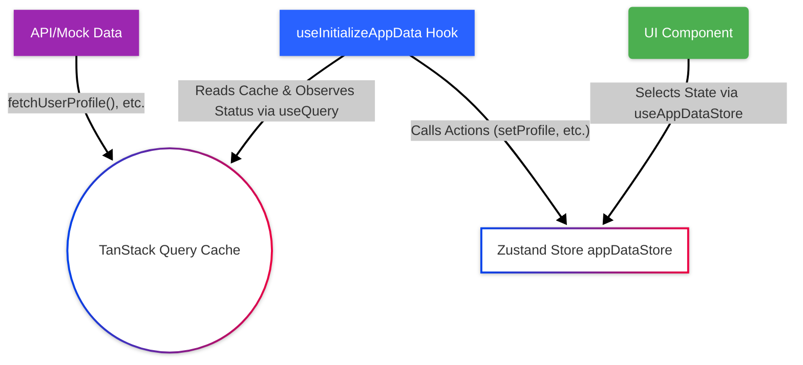
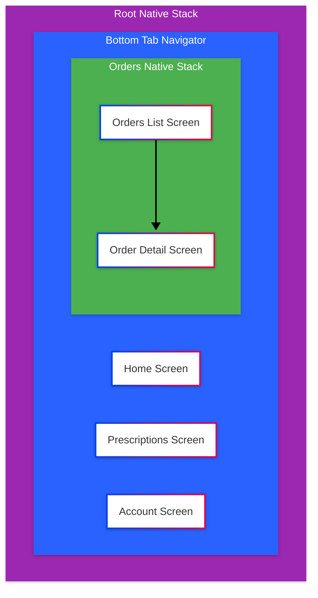

# Module 18: Capstone Project

Welcome to the final module of the React Native Training Course! This module is dedicated entirely to the Capstone Project: **SpeedyMeds**. Here, you'll integrate and apply the knowledge and skills acquired throughout the previous modules (1-17) to build upon a provided scaffolding application, ultimately creating a more complete and functional mobile pharmacy app. This project serves as a practical demonstration of your production-level React Native proficiency.

> 🛣️ **All Learners:** This capstone project is the culmination of the entire course. Whether you're learning in an instructor-led setting or self-paced, actively engaging with this project is crucial for solidifying your understanding and building a portfolio-worthy piece.

## Project Overview

The SpeedyMeds project simulates a mobile application for a pharmacy service. The provided scaffolding (starter code) gives you a foundation with pre-configured navigation, theming (light/dark modes), state management setup (Zustand & TanStack Query), UI library integration (React Native Paper & Styled Components), and basic screen layouts.

Your task is to build upon this foundation, implementing key features outlined in the project requirements and mockups found within the project's `README.md` and related documentation. This involves fetching and displaying data, handling user interactions, managing application state effectively, implementing navigation logic, styling components according to design guidelines, and potentially adding tests.

> [!IMPORTANT]
> You will be working within a **fork** of the main `SpeedyMeds` template repository, likely specific to your training group. Ensure you are working in the correct repository assigned to you. Refer to the `README.md` and `CONTRIBUTING.md` files *within your assigned fork* for specific workflow details.

## Technology Stack Review (Scaffolding Implementation)

This project utilizes the core technologies taught throughout the course. Understanding how they are initially set up in the scaffolding is key to building upon it:

* **React Native (0.7x):** Core framework. Basic components (**`<View>`**, **`<Text>`**, **`<FlatList>`**) and APIs (**`AppState`**, **`useColorScheme`**) are used.
* **Expo (SDK 51+):** Managed workflow setup via **`app.json`**. Expo CLI (**`npx expo start`**) is the primary way to run the app. See [Expo Config Guide](./docs/setup/app-json-config.md).
* **TypeScript:** Used throughout the project (**`*.tsx`**, **`*.ts`**). **`tsconfig.json`** is configured. Shared types are defined in `src/types/`. See [TypeScript Config Guide](./docs/setup/tsconfig-config.md).
* **React Navigation (v6):**
  * **`NavigationContainer`** is set up in `src/navigation/AppNavigator.tsx`, receiving a *`theme`* prop.
  * A root **`NativeStackNavigator`** (**`AppNavigator.tsx`**) primarily holds the main tab navigator.
  * A **`BottomTabNavigator`** (**`MainTabNavigator.tsx`**) defines the main sections (Home, Prescriptions, Orders, Account) with icons.
  * A nested **`NativeStackNavigator`** (**`OrdersStackNavigator.tsx`**) handles navigation within the Orders tab (List -> Detail).
  * Type safety is enforced using **`ParamList`** definitions in `src/navigation/types.ts`.
  * See [Navigation Setup Guide](./docs/setup/navigation-setup.md).
* **React Native Paper (v5):**
  * Used for Material Design 3 components (**`<Button>`**, **`<List.Item>`**, **`<Badge>`**, **`<Searchbar>`**, **`<SegmentedButtons>`**, etc.) in screens like **`PrescriptionsScreen`** and **`HomeScreen`**.
  * **`PaperProvider`** wraps the app in **`App.tsx`**, receiving the active *`theme`*.
* **Styled Components:**
  * Used for custom component styling (e.g., **`StatusBadge`** in **`PrescriptionsScreen`**, **`ScreenContainer`** in `src/components/`) and potentially overriding base component styles.
  * **`StyledThemeProvider`** wraps the app in **`App.tsx`**, receiving the *same* *`theme`* object as **`PaperProvider`** for consistency.
  * TypeScript integration via `src/styled.d.ts`.
  * See [UI & Styling Setup Guide](./docs/setup/ui-styling-setup.md) (for Paper & Styled Components).
* **TanStack Query (v5):**
  * **`QueryClient`** and **`QueryClientProvider`** are set up in **`App.tsx`**.
  * React Native specific online/focus management is configured using **`NetInfo`** and **`AppState`**.
  * The **`useInitializeAppData`** hook (`src/hooks/useInitializeAppData.ts`) uses **`useQuery`** to fetch initial global data (profile, prescriptions, etc.) with defined **`queryKeys`** from `src/api/queryKeys.ts` and specific **`staleTime`** configurations.
  * See [Data Fetching Setup Guide](./docs/setup/data-fetching-react-query-setup.md).
* **Zustand:**
  * A central store (`src/stores/appDataStore.ts`) holds global client-side state (user profile, prescriptions, orders, reminders, loading/error status).
  * The **`useInitializeAppData`** hook populates this store based on TanStack Query results by calling actions defined in the store (e.g., **`setPrescriptions()`**, **`setError()`**).
  * Components access state using the **`useAppDataStore`** hook with selectors (e.g., `const prescriptions = useAppDataStore(state => state.prescriptions);`).
  * *Note:* Theme preference is currently managed via React Context (**`ThemeContext`** in `src/context/ThemeContext.tsx`), not this Zustand store.
  * See [Zustand Setup Guide](./docs/setup/state-management-zustand-setup.md).
* **ESLint & Prettier:** Configured via **`.eslintrc.js`** and **`prettierrc.js`**. Integrated with VS Code settings (**`.vscode/settings.json`**) for format-on-save. Linting/formatting scripts are in **`package.json`**. See [Linting & Formatting Setup Guide](./docs/setup/linting-formatting-config.md).
* **Jest & React Native Testing Library:** Setup via **`jest.config.js`** and **`jest.setup.js`**. Example tests might exist in **`__tests__`** directories. Testing scripts are in **`package.json`**. See [Testing Setup Guide](./docs/setup/testing-config.md).
* **Faker.js:** Used in `src/api/index.ts` (likely) to generate mock data for the fetch functions during development. See [Mock Data Setup Guide](./docs/setup/mock-data-faker-setup.md).

Working on this project reinforces your understanding of how these tools integrate in a real-world scenario.

## Learning Objectives

Upon successful completion of the SpeedyMeds capstone project, you will be able to:

* Integrate various React Native concepts and libraries into a cohesive application.
* Implement multi-screen navigation using Stack and Tab navigators (React Navigation).
* Manage application state effectively using both client (Zustand) and server (TanStack Query) state management solutions.
* Fetch, display, and interact with data from mock APIs.
* Build and style user interfaces using a combination of core components, UI libraries (React Native Paper), and styling solutions (StyleSheet, Styled Components).
* Implement application theming, including light and dark mode support.
* Apply TypeScript for type safety across components, state, and APIs.
* Follow established coding standards and development workflows (linting, formatting, version control).
* (Optional/Stretch Goal) Write unit or component tests for key application features.
* Debug and troubleshoot issues within a moderately complex React Native application.

## Prerequisites

Successful completion of this capstone project requires knowledge and understanding from all preceding modules:

* Completion of Modules 1-17.

## Section 1: Understanding the Project Scaffolding

Before you start adding features, it's crucial to understand the structure and key components of the provided SpeedyMeds scaffolding project. This section provides an overview of the codebase organization.

### Source Code Structure (`src/`)

The core application logic resides in the `src/` directory. It follows a standard feature/type-based organization:

* `api/`: Contains functions for interacting with the (mock) backend (e.g., **`fetchUserProfile()`**), TanStack Query query key definitions (`queryKeys.ts`), and potentially API client setup if a real API were used. Mock data generation using Faker.js is likely initiated here.
* `components/`: Holds reusable UI components shared across multiple screens (e.g., **`LoadingIndicator.tsx`**, **`ErrorDisplay.tsx`**, **`ScreenContainer.tsx`**). Tests for these components are often in a nested `__tests__/` directory.
* `context/`: Contains React Context providers for managing global state *not* handled by Zustand or TanStack Query. In this project, it primarily holds **`ThemeContext.tsx`** for managing light/dark mode preference.
* `hooks/`: Stores custom React hooks encapsulating reusable logic. A key example is **`useInitializeAppData.tsx`**, which coordinates initial data fetching.
* `navigation/`: Defines the application's navigation structure using React Navigation. Includes navigator components (**`AppNavigator.tsx`**, **`MainTabNavigator.tsx`**, **`OrdersStackNavigator.tsx`**) and type definitions (`types.ts`).
* `screens/`: Contains the main screen components, representing distinct views within the app (e.g., **`HomeScreen.tsx`**, **`PrescriptionsScreen.tsx`**). Each screen typically combines UI components, fetches data (indirectly via the store), and handles user interactions specific to that view.
* `stores/`: Holds global state management stores defined using Zustand. **`appDataStore.ts`** is the primary store for application data like user profile, prescriptions, etc.
* `test-utils/`: Provides utility functions or custom configurations specifically for testing (e.g., a custom render function for React Native Testing Library).
* `theme/`: Contains all theme-related definitions: color palettes (`colors.ts`), spacing scales (`spacing.ts`), typography (`typography.ts`), shape definitions (`shape.ts`), and the main theme assembly file (`theme.ts`) which combines these tokens into themes for React Native Paper and Styled Components.
* `types/`: Central location for shared TypeScript interfaces and type definitions used across the application (e.g., **`UserProfile`**, **`Prescription`**, **`Order`**).

### Key Root Files

Outside the **`src/`** directory, several files are critical:

* **`App.tsx`**: The root React component. Its main role is to set up global context providers (**`QueryClientProvider`**, **`CustomThemeProvider`**, **`PaperProvider`**, **`StyledThemeProvider`**) and render the main navigator (**`AppNavigator`**). It also initializes React Query's native configuration.
* **`index.ts`**: The application entry point, typically managed by Expo. It imports the root **`App`** component and registers it using **`AppRegistry.registerComponent()`**, making it the starting point for the React Native application. ([See React Native Docs: Integration with Existing Apps](https://reactnative.dev/docs/next/integration-with-existing-apps))
* **`app.json`**: The Expo configuration file. Defines app metadata (name, version, icons, splash screen), build settings, plugins, and other Expo-specific configurations. See [Expo Config Guide](./docs/setup/app-json-config.md).
* **`package.json`**: Lists project dependencies, scripts (for starting, testing, linting), and Jest configuration.
* **`tsconfig.json`**: Configures the TypeScript compiler options for the project. See [TypeScript Config Guide](./docs/setup/tsconfig-config.md).
* **`.eslintrc.js`** / **`prettierrc.js`**: Configuration files for ESLint (code quality) and Prettier (code formatting). See [Linting & Formatting Setup Guide](./docs/setup/linting-formatting-config.md).
* **`jest.config.js`** / **`jest.setup.js`**: Configuration and setup files for the Jest testing framework. See [Testing Setup Guide](./docs/setup/testing-config.md).

> [!TIP]
> Spend some time browsing these directories and files in your code editor. Understanding where different pieces of logic reside will make it much easier to navigate the codebase and decide where to implement new features.

## Section 2: Data Flow and State Management

The SpeedyMeds scaffold employs a specific strategy for managing application state, separating **server cache state** (managed by TanStack Query) from **global client state** (managed by Zustand). Understanding this flow is key to interacting with and displaying data.

### The Strategy

1. **Fetching & Caching (TanStack Query):** Asynchronous data (like user profile, prescriptions, orders) that originates from a backend (even a mock one) is fetched and managed by TanStack Query (React Query). The **`useInitializeAppData`** hook (`src/hooks/useInitializeAppData.ts`) uses the **`useQuery`** hook for this purpose. TanStack Query automatically handles caching, background refetching based on **`staleTime`**, and managing loading/error states *for the query itself*.
2. **Synchronization (Custom Hook):** The **`useInitializeAppData`** hook observes the state (*`data`*, *`isFetching`*, *`error`*) returned by **`useQuery`**. Using **`useEffect`** hooks, it calls action functions defined in the Zustand store (`src/stores/appDataStore.ts`) (e.g., **`setUserProfile()`**, **`setPrescriptions()`**) to push the latest data, loading status, and error information into the global client state.
3. **Global Client State (Zustand):** The **`appDataStore`** acts as the primary source of truth for *consumed* application data within the UI. It holds the latest successfully fetched data (profile, prescriptions, etc.) and global loading/error flags derived from the TanStack Query states.
4. **UI Consumption (Zustand Hook):** UI components (screens, smaller components) rarely call **`useQuery`** directly for this global data. Instead, they subscribe to the **`appDataStore`** using the **`useAppDataStore`** hook and selector functions (e.g., `const prescriptions = useAppDataStore(state => state.prescriptions);`). This ensures components re-render only when the relevant slice of the *`state`* changes.

### Data Flow Diagram

**Diagram Description:** API fetch functions populate the **TanStack Query Cache**. The **`useInitializeAppData`** hook calls **`useQuery`**, which reads from the cache or triggers fetches. The hook observes the query state and calls Zustand actions (e.g., **`setProfile()`**) to update the **`appDataStore`**. UI components use the **`useAppDataStore`** hook with selectors to read the necessary state slices from the store.

### Why this approach?

* **Decoupling:** UI components don't need to know *how* data is fetched, only where to read it from (Zustand store).
* **Centralization:** Initial data fetching logic and synchronization are centralized in **`useInitializeAppData`**.
* **Performance:** TanStack Query optimizes background fetching and caching. Zustand selectors optimize component re-renders.
* **Clear Separation:** Clearly distinguishes between the server cache state (TanStack Query) and the consumed client state (Zustand).

> [!IMPORTANT]
> When adding features that require new data, consider if it's global application data (fetch in **`useInitializeAppData`**, store in Zustand) or local component state (use **`useState`** or fetch directly in the component with **`useQuery`** if appropriate). For actions that modify data (e.g., submitting a form), you'll typically use TanStack Query's **`useMutation`** hook and potentially invalidate related queries to refetch data.

> 📚 **Official Documentation:**
>
> * [TanStack Query Overview](https://tanstack.com/query/v5/docs/react/overview)
> * [Zustand Introduction](https://docs.pmnd.rs/zustand/getting-started/introduction)
> * [React `useEffect` Hook](https://react.dev/reference/react/useEffect)
>
> 🗂️ **Additional Resources:**
>
> * [Data Fetching Setup Guide](./docs/setup/data-fetching-react-query-setup.md)
> * [Zustand Setup Guide](./docs/setup/state-management-zustand-setup.md)
> * [useInitializeAppData Hook Source](./src/hooks/useInitializeAppData.ts)
> * [appDataStore Source](./src/stores/appDataStore.ts)

## Section 3: Navigation Implementation

The SpeedyMeds application uses React Navigation (v6) to handle movement between screens. The scaffolding sets up a common pattern involving multiple navigator types.

### Navigator Structure

The navigation hierarchy is defined across several files in `src/navigation/`:

1. **Root Navigator (`AppNavigator.tsx`):**
    * Uses **`createNativeStackNavigator`**.
    * Contains the **`NavigationContainer`**, which wraps everything and receives the application *`theme`* (**`navigationTheme`** prop).
    * Its primary screen is the **`MainTabNavigator`**.
    * Its own header is hidden (**`headerShown: false`**) because the contained navigators manage their own headers. This stack is suitable for adding app-wide modal screens later if needed.
2. **Main Tab Navigator (`MainTabNavigator.tsx`):**
    * Uses **`createBottomTabNavigator`**.
    * Defines the main tabs visible at the bottom of the screen: Home, Prescriptions, Orders, Account.
    * Configures tab icons using **`@expo/vector-icons`** (via **`tabBarIcon`** option).
    * For the 'Orders' tab, it renders the **`OrdersStackNavigator`** instead of a direct screen component.
3. **Orders Stack Navigator (`OrdersStackNavigator.tsx`):**
    * Uses **`createNativeStackNavigator`**.
    * This navigator is nested *inside* the 'Orders' tab.
    * It defines the screens accessible within the Orders section: **`OrdersList`** (displaying the list of orders) and **`OrderDetail`** (displaying details for one order).
    * Navigation between **`OrdersList`** and **`OrderDetail`** happens within this nested stack, providing the expected push/pop animation and a header bar specific to the Orders section.

### Navigation Structure Diagram

**Diagram Description:** The **`AppNavigator`** (Root Stack node) contains the **`MainTabNavigator`** (Bottom Tab Nav node). The **`MainTabNavigator`** links to direct screens (Home, Prescriptions, Account) and the nested **`OrdersStackNavigator`** (Orders Native Stack node). The **`OrdersStackNavigator`** contains the **`OrdersListScreen`** and **`OrderDetailScreen`**.

### Type Safety (`types.ts`)

The file `src/navigation/types.ts` is crucial for type safety. It defines **`ParamList`** types for each navigator:

* **`RootStackParamList`**: Defines routes in the top-level stack (e.g., **`MainTabs`**).
* **`BottomTabParamList`**: Defines routes corresponding to the bottom tabs (e.g., **`Home`**, **`Prescriptions`**, **`Orders`**, **`Account`**).
* **`OrdersStackParamList`**: Defines routes within the nested Orders stack (e.g., **`OrdersList`**, **`OrderDetail`**) and specifies parameters (**`OrderDetail: { orderId: string }`**).

These types are used when creating the navigators (**`createNativeStackNavigator<RootStackParamList>()`**) and when defining screen component props (**`BottomTabScreenProps<BottomTabParamList, 'Home'>`**) to ensure correct usage of **`navigation.navigate()`** and **`route.params`**.

> 📚 **Official Documentation:**
>
> * [React Navigation Fundamentals](https://reactnavigation.org/docs/getting-started/)
> * [Nesting Navigators](https://reactnavigation.org/docs/nesting-navigators/)
> * [TypeScript with React Navigation](https://reactnavigation.org/docs/typescript/)
> * [Native Stack Navigator](https://reactnavigation.org/docs/native-stack-navigator/)
> * [Bottom Tab Navigator](https://reactnavigation.org/docs/bottom-tab-navigator/)
>
> 🗂️ **Additional Resources:**
>
> * [Navigation Setup Guide](./docs/setup/navigation-setup.md)
> * [AppNavigator Source](./src/navigation/AppNavigator.tsx)
> * [MainTabNavigator Source](./src/navigation/MainTabNavigator.tsx)
> * [OrdersStackNavigator Source](./src/navigation/OrdersStackNavigator.tsx)
> * [Navigation Types Source](./src/navigation/types.ts)

## Section 4: UI Layer: Theming and Styling

The SpeedyMeds scaffold uses a combination of React Native Paper and Styled Components for UI elements and styling, along with a custom context for theme switching (light/dark mode).

### Core Components

* **React Native Paper (v5):** Provides pre-built components following Material Design 3 principles (e.g., **`<Button>`**, **`<Card>`**, **`<List.Item>`**, **`<Searchbar>`**, **`<Badge>`**, **`<SegmentedButtons>`**). These components are used directly in screens and are automatically styled based on the theme provided by **`PaperProvider`**.
* **Styled Components:** Used to create custom, reusable styled versions of React Native core components (**`<View>`**, **`<Text>`**, etc.) or even Paper components. This allows for component-specific styles and easy access to theme properties within the style definitions. Examples include **`ScreenContainer.tsx`** and the **`StatusBadge`** in **`PrescriptionsScreen.tsx`**.
* **React Native Core:** Standard components like **`<View>`**, **`<Text>`**, **`<FlatList>`** are used for layout and basic structure where appropriate.

### Theming Approach

1. **Token Definition (`src/theme/`):** Base design tokens (colors, spacing, typography, shape radii) are defined in separate files (**`colors.ts`**, **`spacing.ts`**, etc.).
2. **Theme Assembly (`theme.ts`):**
    * Imports tokens and base themes (**`MD3LightTheme`**, **`MD3DarkTheme`** from Paper).
    * Defines **`customProperties`** (like **`customSpacing`**, **`customFontSizes`**, custom font configurations merged with Paper's defaults).
    * Exports **`AppTheme`** type (merging **`MD3Theme`** and **`customProperties`**).
    * Creates **`lightTheme`** and **`darkTheme`** objects by deep-merging base Paper themes, custom color mappings, and **`customProperties`** using **`lodash.merge`**.
    * Adapts these themes for React Navigation using **`adaptNavigationTheme()`** and merges them further to create **`CombinedNavLightTheme`** and **`CombinedNavDarkTheme`**.
3. **Theme Context (`ThemeContext.tsx`):**
    * Manages user preference (`'light'`, `'dark'`, `'system'`) using **`useState()`**.
    * Detects system preference using **`useColorScheme()`**.
    * Determines the **`effectiveMode`** ('light' or 'dark').
    * Provides the active **`theme`** object (**`lightTheme`** or **`darkTheme`**), **`themePreference`**, **`setThemePreference()`** function, and **`isDark`** boolean via context.
    * Exports **`useThemeContext()`** hook for consumption.
4. **Provider Injection (`App.tsx`):**
    * The root component wraps the app in **`CustomThemeProvider`**.
    * An inner **`AppContent`** component consumes **`useThemeContext()`**.
    * **`AppContent`** wraps the **`AppNavigator`** in both **`PaperProvider`** and **`StyledThemeProvider`**, passing the **exact same** *`theme`* object to both. This ensures consistency.
5. **TypeScript Integration (`styled.d.ts`):** Extends **`styled-components/native`**'s **`DefaultTheme`** to match **`AppTheme`**, enabling type checking for theme properties within styled components (though explicit typing is sometimes still used for robustness).

### Usage in Components

* **Paper Components:** Import from **`react-native-paper`** and use directly. They automatically inherit styles from the **`PaperProvider`** theme.
* **Styled Components:** Import the styled component (e.g., **`ScreenContainer`**). Access theme properties within style definitions using ``${({ *theme* }: { theme: AppTheme }) => theme.colors.primary}``.
* **Accessing Theme:** Use **`useTheme<AppTheme>()`** from **`react-native-paper`** or **`useThemeContext()`** to get the current *`theme`* object or related values (*`isDark`*) for conditional logic or manual styling.
* **Theme Switching:** Use the **`setThemePreference()`** function from **`useThemeContext()`** (as seen in the **`ThemeSelector`** component used in **`HomeScreen.tsx`**).

> 📚 **Official Documentation:**
>
> * [React Native Paper Theming](https://callstack.github.io/react-native-paper/docs/guides/theming/)
> * [Styled Components: React Native](https://styled-components.com/docs/basics#react-native)
> * [React Native `useColorScheme` Hook](https://reactnative.dev/docs/usecolorscheme)
> * [React Context](https://react.dev/learn/passing-data-deeply-with-context)
>
> 🗂️ **Additional Resources:**
>
> * [UI & Styling Setup Guide](./docs/setup/ui-styling-setup.md)
> * [Theme Assembly Source](./src/theme/theme.ts)
> * [Theme Context Source](./src/context/ThemeContext.tsx)
> * [ScreenContainer Source](./src/components/ScreenContainer.tsx)
> * [App Component Source (Provider setup)](./App.tsx)

## Section 5: Development Workflow: Setup, Debugging, and Testing

This section outlines the practical steps for running, debugging, testing, and contributing to the SpeedyMeds project.

### Setup and Running

* **Initial Setup:** Follow the detailed steps in **`SETUP.md`** to configure your environment (Node, Xcode/Android Studio, VS Code extensions) and install project dependencies using **`npm install --legacy-peer-deps`**. Remember the potential need for the **`.env`** file.
* **Running the App:**
    1. Launch your iOS Simulator or Android Emulator.
    2. Open a terminal in the project root.
    3. Run **`npx expo start --localhost`**.
    4. Press **`i`** (iOS) or **`a`** (Android) in the terminal to open the app in the simulator/emulator.
    5. (Optional) Scan the QR code with the Expo Go app on a physical device on the same network.

### Debugging

Effective debugging is essential. The scaffold is set up to use standard React Native tools:

* **Expo Dev Menu:** Access quick actions (Reload, Debug Remote JS, Element Inspector) by pressing `Cmd+D` (iOS Sim), `Cmd+M`/`Ctrl+M` (Android Emu), or shaking a physical device.
* **Expo DevTools (Browser):** Press **`j`** in the Metro terminal (**`npx expo start`**) to open the debugger UI in your default browser. This is the primary tool for viewing **`console.log()`** messages, inspecting the component tree (React DevTools), setting JavaScript breakpoints, and monitoring network requests.
* **React Native Debugger (Standalone):** A powerful alternative combining Chrome DevTools, React DevTools, and Redux DevTools (though Redux isn't used here). Requires separate installation.
* **Flipper:** Another powerful standalone debugging platform, especially useful for inspecting native modules, device logs, network requests, layout, and more. Requires setup with development builds.
* **Expo Development Builds:** For scenarios involving custom native code or needing more control than Expo Go provides, creating a [Development Build](https://docs.expo.dev/develop/development-builds/introduction/) allows you to install your app directly onto simulators/devices with full debugging capabilities (including native debugging with Flipper). This project primarily uses Expo Go via **`npx expo start`**, but understanding development builds is useful for advanced debugging or testing custom native changes.

> 📚 **Official Documentation:**
>
> * [Expo: Debugging](https://docs.expo.dev/debugging/introduction/)
> * [React Native: Debugging](https://reactnative.dev/docs/debugging)
> * [Expo: Development Builds](https://docs.expo.dev/develop/development-builds/introduction/)

### Testing

The project includes a setup for unit and component testing using Jest and React Native Testing Library (RNTL).

* **Configuration:** **`jest.config.js`** defines the test environment preset (**`jest-expo`**) and transformation ignores. **`jest.setup.js`** configures RNTL helpers and global mocks.
* **Writing Tests:** Tests typically reside in **`__tests__`** directories alongside the code they are testing (e.g., `src/components/__tests__/ScreenContainer.test.tsx`). RNTL encourages testing components based on how users interact with them (finding elements by text, accessibility labels, etc.).
* **Running Tests:**
  * **`npm test`**: Runs tests in interactive watch mode.
  * **`npm run test:ci`**: Runs tests once (suitable for continuous integration).
  * **`npm run test:coverage`**: Runs tests and generates a code coverage report.

> 📚 **Official Documentation:**
>
> * [Jest](https://jestjs.io/docs/getting-started)
> * [React Native Testing Library](https://callstack.github.io/react-native-testing-library/)
>
> 🗂️ **Additional Resources:**
>
> * [Testing Setup Guide](./docs/setup/testing-config.md)

### Contribution Workflow

As mentioned, you'll work on a **group-specific fork** of the main template repository. The exact workflow should be detailed in the **`CONTRIBUTING.md`** file *within your group's fork*. Generally, this involves:

1. Cloning your group's repository.
2. Creating a new branch for each feature or bug fix (**`git checkout -b feature/add-order-details`**).
3. Making your code changes.
4. Committing changes frequently with clear messages (**`git commit -m \"feat: Implement order detail screen UI\"`**).
5. Pushing your branch to the group repository (**`git push origin feature/add-order-details`**).
6. Creating a Pull Request (PR) on GitHub from your feature branch to the main branch of the group repository.
7. Participating in code reviews (reviewing others' PRs and addressing feedback on your own).
8. Merging the PR once approved.

> [!TIP]
> Adhering to the contribution workflow, including writing clear commit messages and PR descriptions, is crucial for effective collaboration and maintaining a clean project history. Refer to your group's **`CONTRIBUTING.md`** for specifics.

## Getting Started

1. **Obtain Project Repository:** Clone **your assigned group fork** of the **`SpeedyMeds`** repository. Do NOT clone the main template repository unless you are an instructor modifying the base. Your instructor will provide the specific URL.
2. **Environment Setup:** Ensure your local development environment is fully configured according to **[`SETUP.md`](./SETUP.md)** within the project repository. This includes Node.js, npm, Git, VS Code (with recommended extensions), and either Xcode (for iOS Simulator) or Android Studio (for Android Emulator).
3. **Install Dependencies:** Navigate to your cloned project directory in your terminal and run **`npm install --legacy-peer-deps`** as specified in the project's **[`README.md`](./README.md)** and **[`SETUP.md`](./SETUP.md)**. Remember to create the **`.env`** file if required by **[`SETUP.md`](./SETUP.md)**.
4. **Run the Application:** Launch your preferred simulator or emulator, then start the Metro bundler using **`npx expo start --localhost`**. Follow the terminal prompts (**`i`** for iOS, **`a`** for Android) to open the app.
5. **Explore the Scaffolding:** Familiarize yourself with the existing code structure (**`src/`**), implemented features ([`USAGE.md`](./USAGE.md)), and specific setup details in the documentation ([`README.md`](./README.md), [`docs/setup/`](./docs/setup/)). Pay attention to how providers are set up in **`App.tsx`** and how data flows from **`useInitializeAppData`** through Zustand to the screens.

## Core Requirements / Milestones

While specific tasks may be assigned by your instructor, the general goal is to enhance the scaffolding by implementing missing features based on the UI mockups and descriptions in the project's **[`README.md`](./README.md)**. Key areas often include:

1. **Order Details:** Fully implement the `src/screens/OrderDetailScreen.tsx` to receive the *`orderId`* parameter (defined in `src/navigation/types.ts`) and display detailed information about the selected order (fetching details if necessary, possibly adding a new TanStack query).
2. **Account Screen Functionality:** Modify `src/screens/AccountScreen.tsx` to implement actual navigation for list items (potentially defining new screens and adding them to a navigator) or implement the logout flow (clearing relevant state in **`appDataStore`** and navigating, perhaps to a hypothetical Login screen).
3. **Prescription Details/Refills:** Create a new screen (e.g., `src/screens/PrescriptionDetailScreen.tsx`). Implement navigation from the list items in **`PrescriptionsScreen.tsx`** to this new screen, passing the *`prescriptionId`*. Display details on the new screen. Potentially add a "Refill" button that triggers a mutation using TanStack Query (**`useMutation`**).
4. **Data Integration:** Enhance `src/api/` functions. Implement mutations (e.g., for refills, profile updates) using TanStack Query's **`useMutation`** hook and potentially update the **`useInitializeAppData`** or add component-level queries where appropriate.
5. **UI Polish:** Refine styling across all screens (using **`react-native-paper`** components and **`styled-components`**) to more closely match the UI mockups in `assets/images/`, ensuring consistency between light and dark themes managed by **`ThemeContext`**.
6. **Testing (Stretch Goal):** Add unit/component tests in the relevant **`__tests__`** directories for newly implemented features or complex components using Jest and React Native Testing Library, following the patterns in [`Testing Setup Guide`](./docs/setup/testing-config.md).

> 🧑‍🏫 **Instructor-Led:** Your instructor may break the project down into specific milestones or sprints, focusing on particular features each week. Be sure to follow the specific instructions and deadlines provided for your group. Collaboration within your group fork (using branches and Pull Requests as outlined in [`CONTRIBUTING.md`](./CONTRIBUTING.md)) is expected.
>
> 🧗‍♀️ **Self-Led:** Approach the project incrementally. Start by tackling one feature area (e.g., Order Details screen). Review the relevant modules (Navigation, State Management, UI Libraries) and the specific setup docs ([`docs/setup/`](./docs/setup/)) as needed. Use the project documentation ([`README.md`](./README.md), [`USAGE.md`](./USAGE.md)) and mockups as your guide. Aim to implement the core missing features first.

## Evaluation Criteria

Your completed capstone project will typically be evaluated based on criteria such as:

* **Functionality:** Does the application work as expected? Are the required features implemented correctly?
* **Code Quality:** Is the code well-structured, readable, and maintainable? Does it follow the project's linting and formatting rules? Is TypeScript used effectively?
* **Concept Application:** Does the project demonstrate a solid understanding and correct application of key concepts taught in the course (Navigation, State Management, Components, Styling, Hooks, etc.)?
* **UI/UX:** Does the application's look and feel align reasonably well with the provided mockups? Is the user experience intuitive?
* **Completion:** How many of the target features were successfully implemented?
* **(If Applicable) Collaboration:** Was the group workflow (branches, PRs, reviews) followed correctly?

## Submission Guidelines

*(Placeholder - Adapt based on specific course logistics)*

Instructions for submitting your completed capstone project will be provided by your instructor. This typically involves:

* Ensuring all your code is pushed to your group's fork repository on GitHub.
* Providing a link to the specific commit or branch representing your final submission.
* Potentially providing a brief demo video or participating in a live demo session.

> [!IMPORTANT]
> Consult your course facilitator or instructor for the exact submission procedure and deadline.

## Tips for Success

* **Plan Your Approach:** Before diving into code, review the requirements and mockups. Break down larger features into smaller, manageable tasks.
* **Refer to Course Modules:** Don't hesitate to revisit previous module content if you need a refresher on specific concepts.
* **Use Project Documentation:** The **[`README.md`](./README.md)**, **[`SETUP.md`](./SETUP.md)**, **[`USAGE.md`](./USAGE.md)**, and especially the detailed guides in the **[`docs/setup/`](./docs/setup/)** directory within the SpeedyMeds project contain valuable information.
* **Debug Systematically:** Use the debugger (**`j`** in Metro terminal), console logs, and React Native Debugger/Flipper. Refer to [`Debugging Setup Guide`](./docs/setup/debugging-config.md).
* **Commit Often:** Use Git frequently to save your progress with meaningful commit messages.
* **Collaborate (If Applicable):** Communicate effectively with your group members, utilize Pull Requests for code review, and help each other troubleshoot problems.
* **Start Early:** Don't leave the capstone project until the last minute! It requires significant time and effort.

## Module Summary

The SpeedyMeds Capstone Project is your opportunity to consolidate everything you've learned about React Native development. By building upon the provided scaffolding and implementing real-world features, you'll gain invaluable practical experience and confidence. Successfully completing this project demonstrates your readiness to tackle production-level React Native challenges. Good luck!

## Further Resources

> 🗂️ **Additional Resources:** (SpeedyMeds Project Documentation)
>
> * [Project Overview (`README.md`)](./README.md): Features, Stack, Basic Setup
> * [Environment Setup (`SETUP.md`)](./SETUP.md): Detailed Environment Setup
> * [Application Usage (`USAGE.md`)](./USAGE.md): How to Use Implemented Features
> * [Contribution Guide (`CONTRIBUTING.md`)](./CONTRIBUTING.md): Group Workflow (in your fork)
> * [Setup & Configuration Guides (`docs/setup/`)](./docs/setup/): Detailed guides for Navigation, Styling, State, Data Fetching, Testing, Linting, etc.

> 📚 **Official Documentation:** (Review as Needed)
>
> * [React Native: Getting Started](https://reactnative.dev/docs/getting-started)
> * [Expo: Development Overview](https://docs.expo.dev/develop/development-overview/)
> * [Expo: Core Concepts](https://docs.expo.dev/router/core-concepts/)
> * [TypeScript](https://www.typescriptlang.org/docs/)
> * [React Navigation](https://reactnavigation.org/)
> * [React Native Paper](https://callstack.github.io/react-native-paper/)
> * [Styled Components (React Native)](https://styled-components.com/docs/basics#react-native)
> * [TanStack Query (React)](https://tanstack.com/query/v5/docs/react/overview)
> * [Zustand](https://docs.pmnd.rs/zustand/getting-started/introduction)
> * [Jest](https://jestjs.io/docs/getting-started)
> * [React Native Testing Library](https://callstack.github.io/react-native-testing-library/)
> * [React Native: Performance](https://reactnative.dev/docs/performance)
