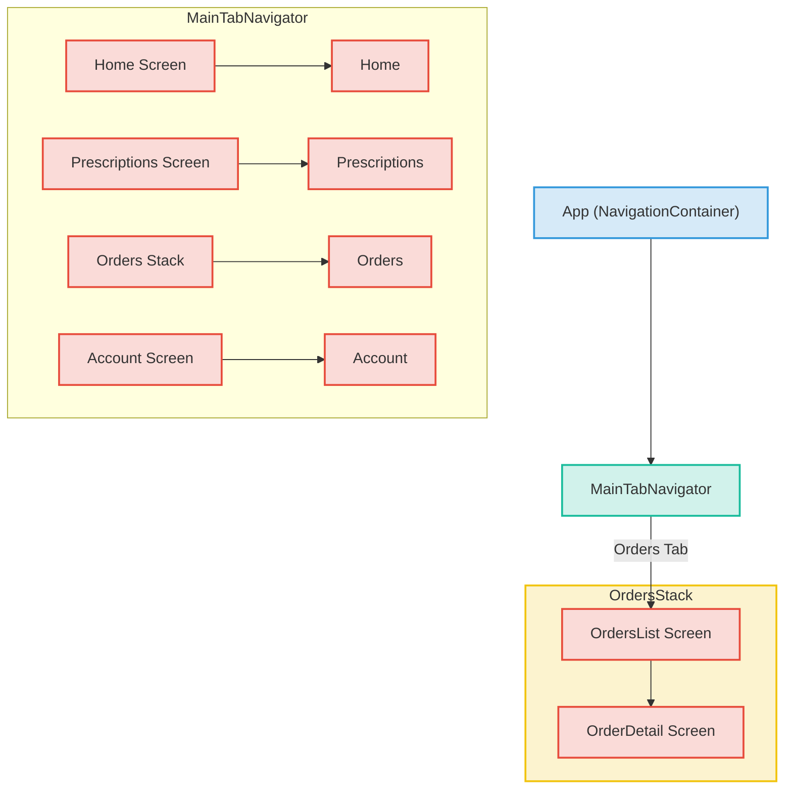

## Section 04: Navigation Implementation

Effective navigation is key to a user-friendly mobile application. The SpeedyMeds project uses React Navigation v6 to manage transitions between different screens. This section details the navigation setup, including tab and stack navigators, and how type safety is maintained.

### React Navigation v6 Overview

React Navigation is a popular, community-driven library providing comprehensive navigation solutions for React Native applications. SpeedyMeds leverages its capabilities to create a familiar tab-based structure for main sections and stack-based navigation for hierarchical views (like drilling down into order details).

Key components used from React Navigation:

- `NavigationContainer`: The root component that wraps your entire navigation structure.
- `createBottomTabNavigator`: Used to create the main tab bar for Home, Prescriptions, Orders, and Account.
- `createNativeStackNavigator`: Used to create stack navigation, for example, within the Orders tab to move from a list of orders to a specific order's details.

### Root Navigator (`src/navigation/AppNavigator.tsx`)

The `AppNavigator.tsx` file is the entry point for the app's navigation. Its primary responsibilities are:

- **Wrapping with `NavigationContainer`**: All navigators (tabs, stacks) must be nested within a `NavigationContainer`. This component manages the navigation tree and state.
- **Theme Integration**: The `NavigationContainer` is passed a theme prop (`navigationTheme`) derived from the application's main theme context (`ThemeContext`). This ensures that the navigation elements (like headers and tab bars) are styled consistently with the rest of the app (light/dark mode).

```typescript
// Conceptual structure of AppNavigator.tsx
import React from "react";
import { NavigationContainer } from "@react-navigation/native";
import MainTabNavigator from "./MainTabNavigator"; // Assuming this is where tabs are defined
import { useThemeContext } from "../context/ThemeContext"; // To get the theme
import { CombinedNavLightTheme, CombinedNavDarkTheme } from "../theme/theme"; // Navigation specific themes

const AppNavigator = () => {
  const { isDark } = useThemeContext();
  const navigationTheme = isDark ? CombinedNavDarkTheme : CombinedNavLightTheme;

  return (
    <NavigationContainer theme={navigationTheme}>
      <MainTabNavigator />
    </NavigationContainer>
  );
};

export default AppNavigator;
```

### Main Tab Navigator (`src/navigation/MainTabNavigator.tsx` - or similar)

The main navigation paradigm in SpeedyMeds is a bottom tab bar. This is likely implemented in a file such as `MainTabNavigator.tsx`.

- **Screens:** It defines the tabs visible at the bottom of the app:
  - Home
  - Prescriptions
  - Orders (which itself might be a stack navigator)
  - Account
- **Icons and Labels:** Each tab is configured with an icon (likely from React Native Paper's icon set or another icon library) and a text label.
- **Initial Route:** One of an application's tabs will be set as the `initialRouteName`.

```typescript
// Conceptual structure of MainTabNavigator.tsx
import React from "react";
import { createBottomTabNavigator } from "@react-navigation/bottom-tabs";
import HomeScreen from "../screens/HomeScreen";
import PrescriptionsScreen from "../screens/PrescriptionsScreen";
import OrdersNavigator from "./OrdersStackNavigator"; // Nested stack
import AccountScreen from "../screens/AccountScreen";
// Import icons from react-native-paper or a similar library
import MaterialCommunityIcons from "react-native-vector-icons/MaterialCommunityIcons";

// Assuming TabParamList is defined in types.ts
import type { TabParamList } from "./types";

const Tab = createBottomTabNavigator<TabParamList>();

const MainTabNavigator = () => {
  return (
    <Tab.Navigator initialRouteName="Home">
      <Tab.Screen
        name="Home"
        component={HomeScreen}
        options={{
          tabBarIcon: ({ color, size }) => (
            <MaterialCommunityIcons name="home" color={color} size={size} />
          ),
        }}
      />
      <Tab.Screen
        name="Prescriptions"
        component={PrescriptionsScreen}
        options={{
          tabBarIcon: ({ color, size }) => (
            <MaterialCommunityIcons name="pill" color={color} size={size} />
          ),
        }}
      />
      <Tab.Screen
        name="Orders"
        component={OrdersNavigator} // Note: This is a navigator component
        options={{
          headerShown: false, // Often hide header for tab containing a stack
          tabBarIcon: ({ color, size }) => (
            <MaterialCommunityIcons name="receipt" color={color} size={size} />
          ),
        }}
      />
      <Tab.Screen
        name="Account"
        component={AccountScreen}
        options={{
          tabBarIcon: ({ color, size }) => (
            <MaterialCommunityIcons name="account" color={color} size={size} />
          ),
        }}
      />
    </Tab.Navigator>
  );
};

export default MainTabNavigator;
```

### Stack Navigators (e.g., `src/navigation/OrdersStackNavigator.tsx`)

For flows where users navigate deeper into a section, Stack Navigators are used. A common example in SpeedyMeds is the "Orders" tab, which might first show a list of orders and then allow navigation to a detailed view of a single order.

- **Screens:** A stack navigator defines a stack of screens. For example, an `OrdersStackNavigator` might include:
  - `OrdersScreen` (listing all orders)
  - `OrderDetailScreen` (showing details for one order)
- **Navigation:** It manages the presentation of screens (e.g., modal, push) and the header bar (back button, title).
- **Passing Parameters:** When navigating from one screen to another within a stack (e.g., from `OrdersScreen` to `OrderDetailScreen`), parameters like an `orderId` can be passed. These parameters are accessed in the destination screen using the `useRoute` hook from React Navigation.

```typescript
// Conceptual structure of OrdersStackNavigator.tsx
import React from "react";
import { createNativeStackNavigator } from "@react-navigation/native-stack";
import OrdersScreen from "../screens/OrdersScreen";
import OrderDetailScreen from "../screens/OrderDetailScreen";
// Assuming OrdersStackParamList is defined in types.ts
import type { OrdersStackParamList } from "./types";

const Stack = createNativeStackNavigator<OrdersStackParamList>();

const OrdersStackNavigator = () => {
  return (
    <Stack.Navigator initialRouteName="OrdersList">
      <Stack.Screen
        name="OrdersList"
        component={OrdersScreen}
        options={{ title: "My Orders" }}
      />
      <Stack.Screen
        name="OrderDetail"
        component={OrderDetailScreen}
        options={{ title: "Order Details" }}
      />
    </Stack.Navigator>
  );
};

export default OrdersStackNavigator;
```

### Navigation Types (`src/navigation/types.ts`)

To ensure type safety when working with navigation (e.g., when passing parameters or using navigation hooks), SpeedyMeds defines TypeScript types for its navigators and screens. This is typically done in a `types.ts` file within the `src/navigation/` directory.

- **Param Lists:** For each navigator (Tab, Stack), a `ParamList` type is defined. This type maps screen names to an object of parameters that screen expects, or `undefined` if it expects no parameters.

  ```typescript
  // Example from a conceptual src/navigation/types.ts
  export type OrdersStackParamList = {
    OrdersList: undefined; // No params for the list screen
    OrderDetail: { orderId: string }; // Expects an orderId string
  };

  export type TabParamList = {
    Home: undefined;
    Prescriptions: undefined;
    Orders: undefined; // This refers to the OrdersStackNavigator, takes no params itself
    Account: undefined;
  };
  ```

- **Hook Usage:** These types are then used with React Navigation hooks like `useNavigation` and `useRoute` to provide autocompletion and type checking.

  ```typescript
  // Inside OrderDetailScreen.tsx
  import { useRoute } from "@react-navigation/native";
  import type { RouteProp } from "@react-navigation/native";
  import type { OrdersStackParamList } from "../navigation/types";

  type OrderDetailScreenRouteProp = RouteProp<
    OrdersStackParamList,
    "OrderDetail"
  >;

  const OrderDetailScreen = () => {
    const route = useRoute<OrderDetailScreenRouteProp>();
    const { orderId } = route.params; // orderId is strongly typed
    // ... fetch order details using orderId
  };
  ```

> [!IMPORTANT]
> Consistent use of these navigation types is crucial for preventing runtime errors related to incorrect parameter passing or accessing non-existent params. Always refer to `src/navigation/types.ts` when working with navigation props or hooks.

### Navigation Structure Diagram

The following diagram illustrates the navigation structure in SpeedyMeds:



**Diagram Explanation:**

1.  **Root (`App`):** The `NavigationContainer` wraps the entire structure.
2.  **`MainTabNavigator`:** Provides the primary bottom tab navigation with four tabs: "Home," "Prescriptions," "Orders," and "Account."
    - The "Home," "Prescriptions," and "Account" tabs directly render their respective screens.
    - The "Orders" tab renders the `OrdersStack` navigator.
3.  **`OrdersStack`:** This is a nested stack navigator.
    - It starts with the `OrdersList Screen`.
    - From `OrdersList Screen`, users can navigate to the `OrderDetail Screen`, creating a stack.

This setup allows for both broad top-level navigation via tabs and focused, hierarchical navigation within specific sections like "Orders."

> 📚 **Official Documentation:**
>
> - [React Navigation - Getting Started](https://reactnavigation.org/docs/getting-started)
> - [React Navigation - Navigating to a new screen](https://reactnavigation.org/docs/navigating)
> - [React Navigation - Passing parameters to routes](https://reactnavigation.org/docs/params)
> - [React Navigation - Nesting navigators](https://reactnavigation.org/docs/nesting-navigators)
> - [React Navigation - TypeScript integration](https://reactnavigation.org/docs/typescript)
> - [React Navigation - Bottom Tab Navigator](https://reactnavigation.org/docs/bottom-tab-navigator)
> - [React Navigation - Native Stack Navigator](https://reactnavigation.org/docs/native-stack-navigator)

> 📲 **(Native iOS/Android Developers):**
>
> **Comparison:** React Navigation provides an abstraction layer over native navigation components (like `UINavigationController` in iOS or `Fragment` transactions with a `NavController` in Android). While the underlying mechanisms differ, the concepts of stacks (pushing/popping screens) and tabs are similar. React Navigation's configuration is done in JavaScript/TypeScript.
>
> **Key Takeaway:** You define your navigation structure declaratively in JavaScript. Type safety, as implemented in SpeedyMeds with `types.ts`, helps bridge the gap to the strong typing you might be used to in native development, reducing errors when passing data between screens.
>
> **Source:** Review the React Navigation documentation on [Nesting Navigators](https://reactnavigation.org/docs/nesting-navigators) to understand how different navigator types are combined.

> 🌐 **(Web Developers - React/Angular):**
>
> **Comparison:** React Navigation is conceptually similar to routing libraries used in web applications like React Router (for React) or Angular Router. You define routes (screens), navigators (like stacks or tabs), and handle parameter passing. The main difference is that React Navigation is designed for the native mobile navigation paradigms (e.g., native stack transitions, bottom tabs that integrate with OS features) rather than browser history and URL-based routing.
>
> **Key Takeaway:** The principles of defining routes and navigating between views are similar. Focus on understanding how React Navigation's specific navigators (`createNativeStackNavigator`, `createBottomTabNavigator`) map to mobile UI patterns and how type safety for parameters is handled.
> **Source:** [React Router Docs](https://reactrouter.com/), [Angular Router Guide](https://angular.io/guide/routing-overview)

By grasping how navigation is structured and typed in SpeedyMeds, you can confidently add new screens, modify navigation flows, and pass data between views as you implement the project's features.

### Next Steps

Understanding the navigation flow is crucial for building out the app's screens. Next, we'll explore how the visual appearance of SpeedyMeds is managed through theming and styling. Proceed to [Section 05: UI Layer: Theming and Styling](./section-05-ui-layer-theming-and-styling.md).
