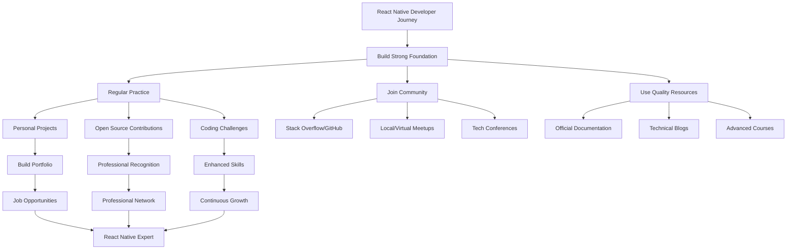

## Section 1: Course Summary and Key Takeaways

This section provides a concise recap of the key concepts and skills you've gained throughout this comprehensive React Native journey. We'll revisit the major themes from each module to reinforce your understanding and help you recognize how far you've come.

```mermaid
graph TD
    Start[Course Start] --> M0[Module 0: Course Introduction]
    M0 --> M1[Module 1: Mobile Development Landscape]
    M1 --> M2[Module 2: React Native Architecture]
    M2 --> M3[Module 3: Environment Setup]
    M3 --> M4[Module 4: Web Development Essentials]
    M4 --> M5[Module 5: JavaScript Essentials]
    M5 --> M6[Module 6: TypeScript Essentials]
    M6 --> M7[Module 7: React Essentials]
    M7 --> M8[Module 8: Core Components]
    M8 --> M9[Module 9: Core APIs and Hooks]
    M9 --> M10[Module 10: Styling]
    M10 --> M11[Module 11: Navigation and Routing]
    M11 --> M12[Module 12: User Input and Forms]
    M12 --> M13[Module 13: State Management]
    M13 --> M14[Module 14: Native Modules]
    M14 --> M15[Module 15: Performance and Debugging]
    M15 --> M16[Module 16: EAS Build and Publishing]
    M16 --> M17[Module 17: Advanced Features]
    M17 --> M18[Module 18: Capstone Project]
    M18 --> M19[Module 19: Course Wrap-up]
    M19 --> Future[Your React Native Journey]

    style Start fill:#f9f,stroke:#333,stroke-width:2px
    style Future fill:#9f9,stroke:#333,stroke-width:2px
    style M19 fill:#fcf,stroke:#333,stroke-width:2px
```

This diagram represents your journey through the React Native course, starting from the foundational concepts and progressing through increasingly advanced topics to ultimately build a complete application and prepare for your future as a React Native developer.

### Module 0-2: The Foundation of Mobile Development

We began our journey by exploring the landscape of mobile development, understanding the evolution of mobile platforms, and examining why React Native has emerged as a powerful solution for cross-platform development.

#### Key Takeaways from Early Modules:

- **Module 0: Course Introduction** - You gained an understanding of the course structure, learning paths, and the skills you would develop throughout the React Native journey.

- **Module 1: Mobile Development Landscape** - You learned about the evolution from platform-specific development to cross-platform solutions, understanding the trade-offs between native performance and development efficiency.

- **Module 2: React Native Architecture** - You gained insights into both the legacy Bridge architecture and the New Architecture with JSI, TurboModules, Fabric, and Codegen—understanding how JavaScript code communicates with native components.

> 📚 **Official Documentation:**
>
> - [React Native Docs: Architecture Overview](https://reactnative.dev/architecture/overview)
> - [React Native Docs: New Architecture](https://reactnative.dev/docs/the-new-architecture/landing-page)
> - [Expo Docs: Introduction](https://docs.expo.dev/)

> 🧑‍🏫 **(Instructor-Led):** This is an excellent opportunity to have students share their most surprising discoveries or challenging concepts from the foundational modules, fostering group discussion and shared learning experiences.

> 🧗‍♀️ **(Self-Led):** Take time to review your notes from the earlier modules and identify any concepts that still feel unclear. The foundation is critical to advanced understanding, so revisiting these topics now will strengthen your overall grasp of React Native.

### Module 3: Expo Development Environment

In Module 3, you established your development environment, which was crucial for all subsequent hands-on learning.

#### Key Takeaways:

- **Expo SDK and Tools** - You set up your development environment using Expo, which streamlined the creation, testing, and deployment of React Native applications while abstracting away much of the native complexity.

- **Project Structure** - You learned the organization of an Expo React Native project, understanding the role of each file and directory.

- **Development Workflow** - You mastered the process of creating, running, and testing Expo applications on simulators and devices.

> 📚 **Official Documentation:**
>
> - [Expo Docs: Installation](https://docs.expo.dev/get-started/installation/)
> - [Expo Docs: Creating a new app](https://docs.expo.dev/get-started/create-a-new-app/)

### Module 4-7: Essential Programming Skills

Before diving deep into React Native specifics, we revisited the core programming concepts that underpin React Native development.

#### Key Takeaways from Programming Fundamentals:

- **Module 4: Web Development Essentials** - You refreshed your understanding of HTML and CSS concepts and learned how they map to React Native components and styling.

- **Module 5: JavaScript Essentials** - You mastered modern JavaScript features essential for React Native, including arrow functions, destructuring, promises, and async/await.

- **Module 6: TypeScript Integration** - You learned how TypeScript provides type safety and better tooling for React Native projects, with interfaces, type aliases, generics, and utility types.

- **Module 7: React Core Concepts** - You explored the foundations of React, including JSX, components, props, state, hooks, and the component lifecycle—all of which transfer directly to React Native.

> 📚 **Official Documentation:**
>
> - [JavaScript MDN Documentation](https://developer.mozilla.org/en-US/docs/Web/JavaScript)
> - [TypeScript Documentation](https://www.typescriptlang.org/docs/)
> - [React Documentation](https://react.dev/learn)

> 📲 **(Native Developers):**
>
> **Comparison:** While native development typically separates UI (XML/SwiftUI/Storyboard) from logic (Java/Kotlin/Swift/Objective-C), React Native follows React's component-based approach where UI and logic are often combined in the same file, though still encouraging separation of concerns through custom hooks and context.
>
> **Key Takeaway:** React Native's declarative UI pattern may initially feel different from imperative native code, but ultimately offers cleaner state management and more predictable rendering.
>
> **Source:** [React Docs: Thinking in React](https://react.dev/learn/thinking-in-react)

### Module 8-9: React Native Fundamentals

With the foundational knowledge established, we dove into the core of React Native development.

#### Key Takeaways from React Native Core:

- **Module 8: Core Components** - You worked with essential React Native components like View, Text, Image, TextInput, and FlatList—understanding how they map to native UI elements.

- **Module 9: React Native APIs** - You utilized platform-specific APIs, dimension handling, alerts, and various hooks like useRef, useCallback, and useMemo for optimized performance.

> 📚 **Official Documentation:**
>
> - [React Native Docs: Core Components and APIs](https://reactnative.dev/docs/components-and-apis)
> - [React Native Docs: Platform Specific Code](https://reactnative.dev/docs/platform)
> - [React Docs: Hooks API Reference](https://react.dev/reference/react)

> [!TIP]
> The mental model of translating web/native concepts to React Native is one of the most valuable skills you've developed. When faced with a new UI challenge, try to think about how you would solve it in a familiar environment, then apply the React Native equivalents.

### Module 10-12: UI and User Interaction

These modules focused on creating effective and appealing user interfaces and handling user input.

#### Key Takeaways:

- **Module 10: Styling in React Native** - You mastered multiple styling approaches including StyleSheet, inline styles, Flexbox layouts, styled-components, and UI libraries like React Native Paper.

- **Module 11: Navigation** - You implemented navigation using both React Navigation and Expo Router, creating stacks, tabs, and drawer navigators while managing screen transitions and passing parameters.

- **Module 12: Form Handling** - You implemented forms using controlled components and React Hook Form, managing validation, submission, and different input types.

> 📚 **Official Documentation:**
>
> - [React Native Docs: Style](https://reactnative.dev/docs/style)
> - [React Navigation Docs](https://reactnavigation.org/docs/getting-started)
> - [Expo Router Docs](https://docs.expo.dev/routing/introduction/)
> - [React Hook Form Docs](https://react-hook-form.com/get-started)

### Module 13-17: Advanced React Native Development

Building on the fundamentals, we explored more sophisticated aspects of React Native development.

#### Key Takeaways from Advanced Topics:

- **Module 13: State Management** - You leveraged React Context, Zustand for client state, and TanStack Query for server state management in complex applications.

- **Module 14: Native Module Integration** - You learned how to incorporate native functionality using Expo SDK modules and gained conceptual understanding of custom native modules.

- **Module 15: Performance and Debugging** - You identified common performance bottlenecks, implemented optimization techniques, and utilized debugging tools to solve problems efficiently.

- **Module 16: Deployment and Publishing** - You used EAS (Expo Application Services) for building, deploying, and updating your applications across platforms.

- **Module 17: Advanced Features** - You implemented animations with Reanimated, gestures with Gesture Handler, SVG graphics, push notifications, offline storage, and testing strategies.

> 📚 **Official Documentation:**
>
> - [Zustand Documentation](https://github.com/pmndrs/zustand)
> - [TanStack Query Documentation](https://tanstack.com/query/latest)
> - [Expo Docs: Native Modules](https://docs.expo.dev/modules/overview/)
> - [Expo EAS Documentation](https://docs.expo.dev/eas/)
> - [React Native Reanimated Docs](https://docs.swmansion.com/react-native-reanimated/)
> - [React Native Gesture Handler Docs](https://docs.swmansion.com/react-native-gesture-handler/)

### Module 18: Capstone Project Integration

Throughout the course, you applied your growing knowledge to the SpeedyMeds pharmacy app, building features incrementally as you learned new concepts.

#### Key Technical Skills Gained:

- **Cross-Platform Development:** You can now build applications that run on both iOS and Android from a single codebase.

- **Component-Based Architecture:** You can design and implement reusable components following best practices.

- **State and Data Flow:** You can manage complex application state and data flow through various state management solutions.

- **API Integration:** You can connect to backend services, handle authentication, and manage data synchronization.

- **UI/UX Implementation:** You can create responsive, accessible, and visually appealing mobile interfaces.

- **Testing and Debugging:** You can identify and resolve issues in React Native applications using appropriate tools.

- **Performance Optimization:** You can analyze and improve application performance for smooth user experiences.

- **Deployment Pipeline:** You understand the process of building, testing, and deploying React Native applications.

> 🛣️ **(All Learners):** Consider creating a personal "React Native Cheat Sheet" document that summarizes the key APIs, components, and patterns you've learned. This will serve as a valuable quick-reference resource as you continue developing with React Native.

> 📚 **Official Documentation:**
>
> - [React Native Docs: The Basics](https://reactnative.dev/docs/getting-started)
> - [Expo Docs: Overview](https://docs.expo.dev/)
> - [React Navigation Docs](https://reactnavigation.org/docs/getting-started)
> - [React Native Paper Docs](https://callstack.github.io/react-native-paper/)
>
> 🗂️ **Additional Resources:**
>
> - [React Native Directory](https://reactnative.directory/) - A searchable database of React Native libraries
> - [Awesome React Native](https://github.com/jondot/awesome-react-native) - A curated list of resources

### Your Development Journey

This course has equipped you with the knowledge and skills to build production-ready React Native applications. You've progressed from understanding basic concepts to implementing complex features, debugging issues, and optimizing for performance. The foundation you've built will serve you well as you continue to grow as a React Native developer.

This diagram illustrates the ongoing journey of a React Native developer beyond this course, showing how continuous learning, community engagement, and practical application lead to professional growth and expertise.

> [!IMPORTANT]
> As you reflect on this journey, remember that becoming proficient in React Native is an ongoing process. The ecosystem evolves rapidly, and continuous learning is essential. Use the skills and learning strategies you've developed during this course to adapt to new changes and advancements in the React Native world.
