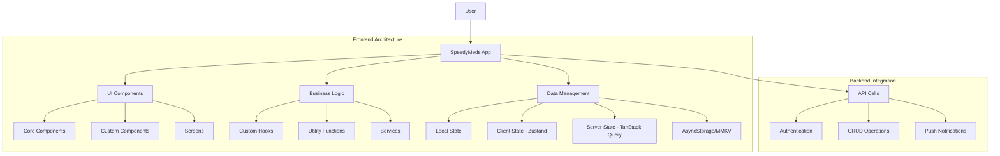
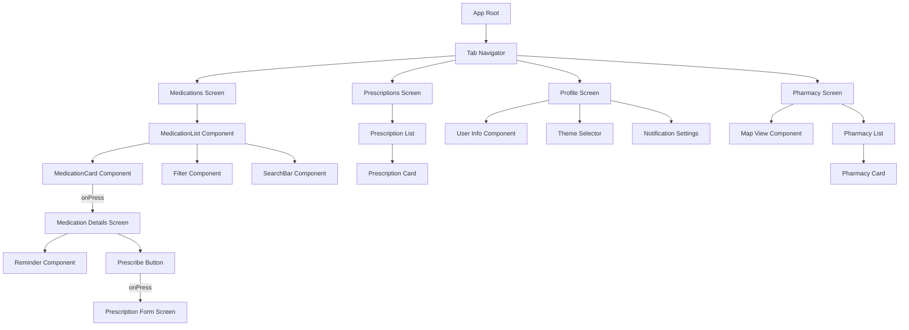
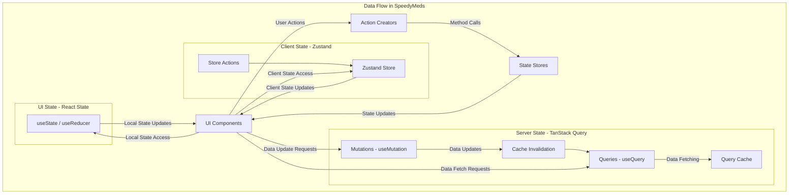
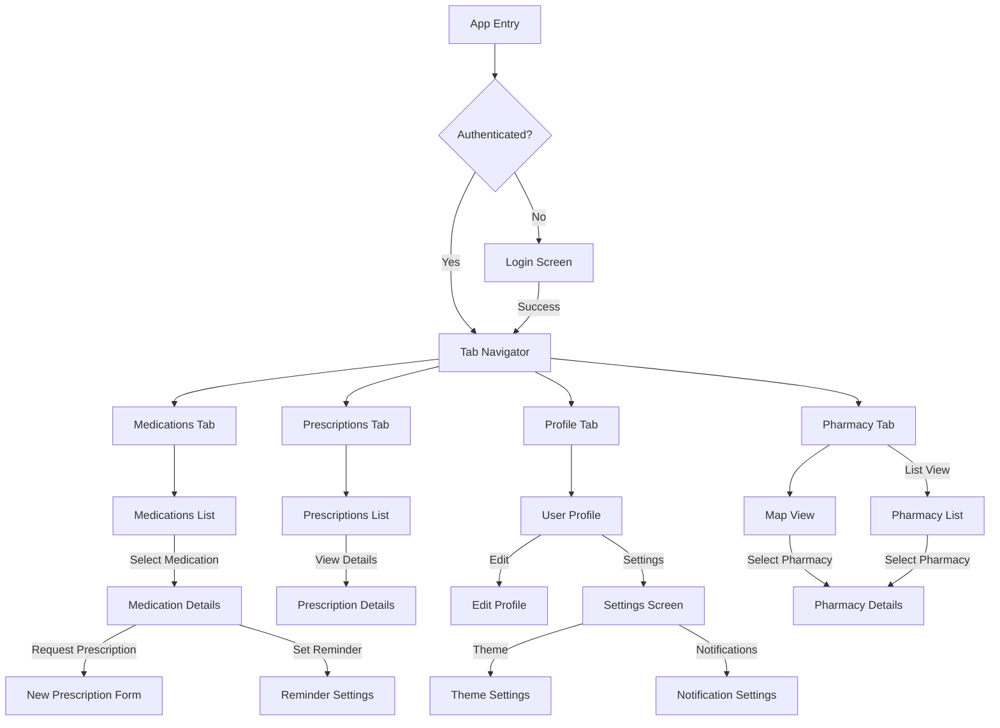

## Section 2: Capstone Project Reflection

In this section, we'll reflect on the SpeedyMeds capstone project—examining what you've built, the challenges you've overcome, and the skills you've demonstrated through this practical application of React Native development.

### Overview of the SpeedyMeds Project

Throughout this course, you've progressively built a pharmacy application called SpeedyMeds. This project wasn't just a collection of isolated exercises but a cohesive application that grows in complexity and functionality as your skills advance.



This diagram illustrates the overall architecture of the SpeedyMeds application, showing how the different components interact within the React Native environment. The frontend architecture is organized into UI components, business logic, and data management layers, while the backend integration handles API calls, authentication, database operations, and push notifications.

> 🧑‍🏫 **(Instructor-Led):** Consider having each student briefly present one aspect of their implementation that they're particularly proud of, or a challenging problem they solved in a creative way. This peer showcase can inspire others and highlight different approaches to similar problems.

> 🧗‍♀️ **(Self-Led):** Take time to examine each part of your implementation and identify which aspects you found most challenging or satisfying. Consider how you might improve your approaches with your current knowledge.

#### Key Features Implemented

As you progressed through the modules, you incrementally built the following SpeedyMeds features:

- **Medication Listings:** A comprehensive view of medications with sorting and filtering capabilities using FlatList/SectionList components
- **Medication Details:** Detailed information screens for individual medications, accessed through navigation
- **Prescription Management:** Forms for submitting and tracking prescription requests
- **User Authentication:** Sign in and user profile management
- **Pharmacy Locator:** Map integration to find nearby pharmacies
- **Medication Reminders:** Push notification setup for medication schedules
- **Offline Support:** Local storage for accessing critical information without network connectivity
- **Theme Customization:** User-controlled UI themes with React Native Paper and styled-components

> 📲 **(Native Developers):**
>
> **Comparison:** In native development, you would typically create separate codebases for iOS (Swift/Objective-C) and Android (Kotlin/Java) to implement these features, maintaining different navigation controllers, UI components, and platform-specific considerations. With React Native, you've implemented these features in a single codebase with occasional platform-specific code when necessary.
>
> **Key Takeaway:** The React Native approach significantly reduces development time and maintenance overhead while still allowing access to native capabilities through the bridge or JSI.
>
> **Source:** [React Native: Why a single codebase might not be enough](https://reactnative.dev/docs/platform-specific-code)

> 🌐 **(Web Developers):**
>
> **Comparison:** Many concepts you applied in SpeedyMeds like component composition and state management are similar to web development, but you've had to adapt to mobile-specific patterns for navigation, offline support, and native device feature integration.
>
> **Key Takeaway:** While the core React paradigms remain consistent between web and mobile, the interaction patterns, performance considerations, and platform limitations require significant adaptation in your approach.
>
> **Source:** [React Native for Web Developers](https://reactnative.dev/docs/intro-react)

### Technical Achievement Analysis

Let's analyze the technical achievements demonstrated in your capstone project:

#### Component Architecture

You designed and implemented a well-structured component hierarchy that balances:

- **Reusability:** Creating generic components (like MedicationCard, FormInput, StatusBadge) that could be used in multiple contexts
- **Composability:** Building larger components from smaller ones following React's composition model
- **Separation of Concerns:** Distinguishing between presentational components and those with business logic

```tsx
// Example of a reusable component from the SpeedyMeds project
interface MedicationCardProps {
  medication: Medication;
  onPress: (medicationId: string) => void;
  compact?: boolean;
}

const MedicationCard: React.FC<MedicationCardProps> = ({
  medication,
  onPress,
  compact = false,
}) => {
  return (
    <Card
      style={compact ? styles.compactCard : styles.card}
      onPress={() => onPress(medication.id)}
    >
      <Card.Content>
        <View style={styles.cardHeader}>
          <Text style={styles.medicationName}>{medication.name}</Text>
          <StatusBadge status={medication.status} />
        </View>
        {!compact && (
          <>
            <Text style={styles.dosage}>{medication.dosage}</Text>
            <Text style={styles.description}>{medication.description}</Text>
          </>
        )}
      </Card.Content>
    </Card>
  );
};
```

This `MedicationCard` component is a functional React component that takes `medication` data, an `onPress` handler, and an optional `compact` prop. It uses React Native Paper's `Card` component to display medication details, conditionally rendering more information based on the `compact` prop.



This diagram illustrates the component hierarchy of the SpeedyMeds application, showing how different components relate to each other and the flow of user interaction through the app. The structure demonstrates a well-organized, modular approach to component architecture.

> ⚛️ **(React Developers):**
>
> **Comparison:** The component architecture in React Native closely mirrors what you're familiar with in React web development, following the same principles of composition and unidirectional data flow. The key difference is the primitive components used (View/Text vs. div/span) and the styling approach.
>
> **Key Takeaway:** Your experience with component composition in React transfers directly to React Native, though you've had to adapt to different UI primitives and mobile interaction patterns.
>
> **Source:** [React Native Components](https://reactnative.dev/docs/components-and-apis)

#### State Management Implementation

You applied various state management strategies depending on the complexity and scope of the data:

- **Local Component State:** For UI-specific states like form inputs and toggles
- **Context API:** For theme settings and user authentication state shared across components
- **Zustand Store:** For client-side application state like filter preferences and view settings
- **TanStack Query:** For server state management, handling data fetching, caching, and synchronization

```tsx
// Example of Zustand store implementation for medication filters
interface FilterState {
  searchQuery: string;
  statusFilter: MedicationStatus | "all";
  setSearchQuery: (query: string) => void;
  setStatusFilter: (status: MedicationStatus | "all") => void;
  resetFilters: () => void;
}

const useFilterStore = create<FilterState>((set) => ({
  searchQuery: "",
  statusFilter: "all",
  setSearchQuery: (query) => set({ searchQuery: query }),
  setStatusFilter: (status) => set({ statusFilter: status }),
  resetFilters: () => set({ searchQuery: "", statusFilter: "all" }),
}));
```

This `useFilterStore` is a Zustand store created for managing medication filter states. It defines state variables like `searchQuery` and `statusFilter`, along with actions (`setSearchQuery`, `setStatusFilter`, `resetFilters`) to update these states, providing a centralized way to manage filter logic.



This diagram illustrates the data flow patterns in the SpeedyMeds application, showing how different state management solutions (TanStack Query, Zustand, and React's local state) interact with UI components. The unidirectional data flow ensures predictable state updates and a maintainable architecture.

> 🅰 **(Angular Developers):**
>
> **Comparison:** Unlike Angular's service-based dependency injection system, React Native relies on hooks-based state management where components subscribe to stores. This approach offers flexibility similar to Angular services but with a more functional programming style.
>
> **Key Takeaway:** While the implementation differs from Angular's DI system, the concept of centralizing shared state is similar, though React Native's approach is less opinionated and more composition-based.
>
> **Source:** [React Hooks vs. Angular Services](https://blog.logrocket.com/react-hooks-vs-angular-services/)

#### Navigation Structure

You implemented a thoughtful navigation structure that provided:

- **Intuitive Flow:** Logical progression between screens that matches user expectations
- **Organized Access:** Tab navigation for main features, stack navigation for detail flows
- **Contextual Information:** Passing parameters between screens to maintain context
- **Deep Linking:** Support for direct access to specific screens through external links

```tsx
// Example of Expo Router navigation setup
// app/_layout.tsx
import { Tabs } from "expo-router";
import { Ionicons } from "@expo/vector-icons";

export default function AppLayout() {
  return (
    <Tabs>
      <Tabs.Screen
        name="index"
        options={{
          title: "Medications",
          tabBarIcon: ({ color }) => (
            <Ionicons name="medical" size={24} color={color} />
          ),
        }}
      />
      <Tabs.Screen
        name="prescriptions"
        options={{
          title: "Prescriptions",
          tabBarIcon: ({ color }) => (
            <Ionicons name="document-text" size={24} color={color} />
          ),
        }}
      />
      <Tabs.Screen
        name="profile"
        options={{
          title: "Profile",
          tabBarIcon: ({ color }) => (
            <Ionicons name="person" size={24} color={color} />
          ),
        }}
      />
    </Tabs>
  );
}
```

This `AppLayout` component utilizes Expo Router's `Tabs` navigator to define the primary tab-based navigation for the SpeedyMeds app. Each `Tabs.Screen` configures a tab with a name, title, and an icon using `Ionicons` from `@expo/vector-icons`.



This diagram illustrates the navigation structure of the SpeedyMeds application, showing how screens are organized and connected through different navigation patterns. The structure allows users to navigate efficiently between different functional areas of the app while maintaining contextual information.

> 📲 **(Native Developers):**
>
> **Comparison:** React Navigation and Expo Router provide a navigation system similar to iOS's UINavigationController and Android's Navigation Component but with a unified API. Instead of working with separate navigation paradigms, you've implemented a consistent navigation experience across platforms.
>
> **Key Takeaway:** React Native's navigation libraries abstract away platform differences while still allowing customization of native navigation behaviors when needed.
>
> **Source:** [React Navigation - Platform-specific UI](https://reactnavigation.org/docs/material-top-tab-navigator/#platform-specific-ui)

#### UI/UX Design Implementation

You successfully implemented a polished user interface that demonstrated:

- **Consistent Styling:** Through theme variables and shared style components
- **Responsive Layouts:** Adapting to different screen sizes with Flexbox
- **Accessible Design:** Supporting screen readers and adhering to accessibility guidelines
- **Interactive Feedback:** Using animations and gestures to enhance user experience
- **Visual Hierarchy:** Establishing clear information priority through typography and spacing

> [!TIP]
> The most successful mobile applications maintain a balance between platform-specific design paradigms and a consistent cross-platform experience. Your SpeedyMeds implementation likely evolved to respect this balance as you learned more about mobile UX principles.

> 🌐 **(Web Developers):**
>
> **Comparison:** While web styling uses CSS with pixels and percentage-based units, React Native uses a subset of CSS-like properties with platform-independent density-independent pixels. Flexbox works similarly, but with some key differences in default behaviors.
>
> **Key Takeaway:** Your CSS and Flexbox knowledge transfers to React Native, but you've had to adapt to the absence of certain CSS features and the unique requirements of mobile layouts.
>
> **Source:** [React Native Style vs. CSS](https://reactnative.dev/docs/style)

### Common Challenges and Solutions

Throughout the development of SpeedyMeds, you likely encountered and overcame several common challenges:

#### Challenge: Data Management Complexity

**Solution:** You implemented structured data models with TypeScript and utilized TanStack Query's powerful data synchronization capabilities to manage complex data relationships and caching.

#### Challenge: Form Validation and User Input

**Solution:** You leveraged React Hook Form to create a robust validation system with clear error feedback, improving the user experience during data entry.

#### Challenge: Performance Optimization

**Solution:** You applied techniques like:

- Memoization with `React.memo`, `useMemo`, and `useCallback`
- List virtualization with FlatList's performance props
- Lazy loading of screens and components
- Image optimization

#### Challenge: Testing and Debugging

**Solution:** You implemented:

- Unit tests for utility functions and hooks
- Component tests with React Native Testing Library
- End-to-end testing strategies
- Effective use of debugging tools to isolate and fix issues

> ⚛️ **(React Developers):**
>
> **Comparison:** Testing in React Native uses the same Jest-based approach as React web applications, but with platform-specific considerations and the need for React Native Testing Library instead of React Testing Library.
>
> **Key Takeaway:** Your experience with testing React components transferred to React Native with some adaptations for the mobile environment and simulator/emulator integration.
>
> **Source:** [React Native Testing Library](https://callstack.github.io/react-native-testing-library/)

### Reflective Questions

Consider these questions as you reflect on your capstone project experience:

1. **Technical Growth:** Which technical skills showed the most improvement from the beginning to the end of the project?

2. **Problem-Solving Approach:** How did your approach to solving React Native development problems evolve throughout the project?

3. **Code Quality:** In what ways did your code organization, documentation, and testing strategies mature?

4. **Design Sensibility:** How did your understanding of mobile UI/UX design principles develop during the project?

5. **Future Improvements:** If you had additional time, which aspects of the app would you enhance or refactor?

> 🛣️ **(All Learners):** Take time to document your answers to these reflective questions. This exercise not only reinforces your learning but provides valuable material for portfolio documentation or interview discussions about your React Native experience.

### From Capstone to Real-World Applications

The SpeedyMeds project was designed to mirror real-world development practices. Consider how the following aspects of your capstone experience translate to professional React Native development:

- **Incremental Development:** Building features progressively, just as you would in an agile development environment
- **Technical Decision-Making:** Weighing tradeoffs between different approaches, libraries, and implementation strategies
- **Problem Troubleshooting:** Debugging issues across the JavaScript-native boundary
- **Performance Considerations:** Balancing functionality with smooth performance on mobile devices
- **User-Centered Design:** Focusing on accessibility, usability, and user experience

> [!IMPORTANT]
> The capstone project serves not only as a culmination of your learning but also as a portfolio piece demonstrating your React Native capabilities. Consider refining specific aspects of your implementation and documenting your process to showcase your skills to potential employers or clients.

### Next Steps for Your Project

As you consider how to further develop your SpeedyMeds project beyond this course:

1. **Expand Functionality:** Consider adding features like medication interaction checking, insurance information management, or telemedicine integration.

2. **Polish the Experience:** Refine animations, improve accessibility, and optimize for various device sizes.

3. **Backend Integration:** Develop or connect to a proper backend service instead of mock data.

4. **Deployment:** Complete the process of deploying to app stores using EAS Build and Submit.

5. **User Testing:** Gather feedback from potential users to inform further improvements.

> 📚 **Official Documentation:**
>
> - [Expo EAS Submit](https://docs.expo.dev/submit/introduction/)
> - [React Native Testing Library](https://callstack.github.io/react-native-testing-library/)
> - [React Native Accessibility](https://reactnative.dev/docs/accessibility)
> - [React Native Performance](https://reactnative.dev/docs/performance)
>
> 🗂️ **Additional Resources:**
>
> - [UI/UX Best Practices for Mobile Apps](https://www.smashingmagazine.com/2018/08/best-practices-mobile-form-design/)
> - [Real-World React Native Applications](https://github.com/ReactNativeNews/React-Native-Apps)
