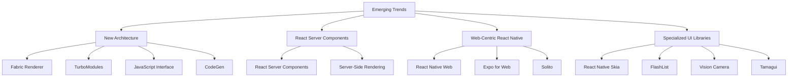

## Section 3: Resources for Continued Learning

The React Native ecosystem is constantly evolving with new features, libraries, and best practices. This section provides a curated collection of resources to help you continue your learning journey beyond this course.

```mermaid
graph TD
    Start[React Native Developer] --> Core[Core Knowledge]
    Start --> Specialized[Specialized Knowledge]
    Start --> Community[Community Engagement]

    Core --> OfficialDocs[Official Documentation]
    Core --> Libraries[Key Libraries]
    Core --> Architecture[New Architecture]

    Specialized --> UI[UI/UX & Animation]
    Specialized --> Performance[Performance Optimization]
    Specialized --> Testing[Testing & QA]
    Specialized --> Native[Native Module Development]
    Specialized --> Deployment[Deployment & DevOps]

    Community --> Forums[Forums & Discussion]
    Community --> Events[Conferences & Meetups]
    Community --> Contribute[Open Source Contributions]
    Community --> Content[Content Creation]

    OfficialDocs --> ReactNativeDocs[React Native Docs]
    OfficialDocs --> ExpoDocs[Expo Documentation]
    OfficialDocs --> ReactDocs[React Documentation]

    Libraries --> Navigation[Navigation Libraries]
    Libraries --> StateManagement[State Management]
    Libraries --> UILibraries[UI Component Libraries]

    UI --> Animations[Animation Libraries]
    UI --> Gestures[Gesture Handling]
    UI --> Graphics[2D/3D Graphics]

    ReactNativeDocs -- "Start here" --> Architecture
    ExpoDocs -- "Expo users" --> Deployment
    Performance -- "Advanced" --> Native

    click ReactNativeDocs "https://reactnative.dev/docs/getting-started"
    click ExpoDocs "https://docs.expo.dev/"
    click ReactDocs "https://react.dev/"
```

This diagram outlines the various learning paths available to React Native developers, from core knowledge areas to specialized topics and community engagement. The diagram includes clickable nodes that will take you directly to key documentation resources.

### Official Documentation and Learning Resources

The first place to continue your learning should always be the official documentation. These resources are maintained by the core teams and provide the most accurate and up-to-date information.

> 📚 **Official Documentation: React Native Core**
>
> - [React Native Documentation](https://reactnative.dev/docs/getting-started) - The primary source for React Native APIs, components, and guides
> - [React Native GitHub Repository](https://github.com/facebook/react-native) - Source code, issues, and discussions
> - [React Native Blog](https://reactnative.dev/blog) - Announcements, version updates, and community highlights
> - [React Native Releases](https://github.com/facebook/react-native/releases) - Detailed release notes for each version

React Native's documentation covers everything from getting started to advanced concepts. Pay special attention to the "Architecture" and "The New Architecture" sections to understand how React Native is evolving. The blog is particularly valuable for staying informed about major updates and direction.

> 📚 **Official Documentation: Expo Platform**
>
> - [Expo Documentation](https://docs.expo.dev/) - Comprehensive guides for the Expo platform
> - [Expo Blog](https://blog.expo.dev/) - Platform updates, tutorials, and case studies
> - [Expo GitHub Repository](https://github.com/expo/expo) - Source code and issue tracking
> - [Expo SDK API Reference](https://docs.expo.dev/versions/latest/) - Detailed documentation for all Expo modules

Expo's documentation is exceptionally well-maintained and includes practical examples for most features. The SDK API reference is particularly useful when working with Expo's native modules. The blog often includes detailed tutorials and case studies that demonstrate best practices.

> 📚 **Official Documentation: Related Core Technologies**
>
> - [React Documentation](https://react.dev/) - Core React concepts and advanced patterns
> - [TypeScript Documentation](https://www.typescriptlang.org/docs/) - Type system, language features, and migration guides
> - [JavaScript MDN Web Docs](https://developer.mozilla.org/en-US/docs/Web/JavaScript) - Comprehensive JavaScript language reference

These foundational technologies underpin React Native development. The React documentation, recently redesigned, provides excellent explanations of React's mental model and patterns that apply directly to React Native.

> 📚 **Official Documentation: Key Libraries**
>
> - [React Navigation](https://reactnavigation.org/docs/getting-started) - Navigation library documentation
> - [Expo Router](https://docs.expo.dev/routing/introduction/) - File-based routing documentation
> - [React Native Paper](https://callstack.github.io/react-native-paper/) - Material Design component library
> - [TanStack Query](https://tanstack.com/query/latest/docs/react/overview) - Data fetching and state management
> - [Zustand](https://docs.pmnd.rs/zustand/getting-started/introduction) - State management library
> - [React Hook Form](https://react-hook-form.com/get-started) - Form handling library
> - [React Native Reanimated](https://docs.swmansion.com/react-native-reanimated/) - Animation library
> - [React Native Gesture Handler](https://docs.swmansion.com/react-native-gesture-handler/) - Touch handling library

> [!TIP]
> When exploring these libraries, focus not just on basic usage examples but also on their philosophy and design decisions. Understanding _why_ a library works a certain way will help you use it more effectively and adapt when APIs change.

> 🧑‍🏫 **(Instructor-Led):** Consider organizing a "documentation tour" activity where students present different sections of the documentation and share insights about what they found most useful. This collaborative approach helps everyone discover resources they might have missed.

> 🧗‍♀️ **(Self-Led):** Create bookmarks for these key documentation resources and make it a habit to check release notes and updates regularly. Consider setting aside 30 minutes each week specifically for reviewing documentation updates.

### Community Resources and Learning Platforms

Beyond official documentation, the React Native community offers a wealth of learning resources.

#### Community Forums and Discussion

> 📚 **Community Discussion Resources**
>
> - [React Native Community Discussions](https://github.com/reactwg/react-native-new-architecture/discussions) - Technical discussions from the React Native working group
> - [Expo Forums](https://forums.expo.dev/) - Community support for Expo-specific questions
> - [React Native Discord](https://reactnative.dev/discord) - Real-time chat with the React Native community
> - [Reactiflux Discord](https://www.reactiflux.com/) - Larger React ecosystem Discord community with React Native channels
> - [Stack Overflow - React Native](https://stackoverflow.com/questions/tagged/react-native) - Q&A focused on solving specific problems

> 🧗‍♀️ **(Self-Led):** Active participation in these communities can significantly accelerate your learning. Don't just consume content—try answering questions or participating in discussions to deepen your understanding.

#### Blogs and Newsletters

> 📚 **Blogs and Newsletters**
>
> - [React Native Radio](https://reactnativeradio.com/) - Podcast covering React Native development
> - [Infinite Red](https://shift.infinite.red/tagged/react-native) - Blog from experienced React Native consultancy
> - [Callstack Blog](https://www.callstack.com/blog) - Articles from the team behind many React Native libraries
> - [React Native Newsletter](https://reactnativenewsletter.com/) - Weekly newsletter curating React Native content
> - [The Expo Blog](https://blog.expo.dev/) - Articles from the Expo team
> - [This Week in React](https://thisweekinreact.com/) - Weekly newsletter covering React and React Native

#### Video Tutorials and Courses

> 📚 **Video Learning Resources**
>
> - [React Native: The Practical Guide](https://www.udemy.com/course/react-native-the-practical-guide/) - Comprehensive Udemy course by Maximilian Schwarzmüller
> - [Complete React Native + Hooks](https://www.udemy.com/course/the-complete-react-native-and-redux-course/) - Udemy course by Stephen Grider
> - [React Native School](https://www.reactnativeschool.com/) - Focused tutorials and courses
> - [YouTube: William Candillon](https://www.youtube.com/c/wcandillon) - Advanced animations and UI challenges
> - [YouTube: Catalin Miron](https://www.youtube.com/c/CatalinMironDev) - Animations and UI implementations

> [!NOTE]
> When following tutorials, be aware of their publication date. React Native evolves quickly, and tutorials can become outdated. Always cross-reference with current official documentation if something doesn't work as expected.

### Advanced Learning Paths

As you continue developing your React Native skills, consider exploring these advanced topics.

#### Performance Optimization

> 📚 **Performance Optimization Resources**
>
> - [React Native Performance Guide](https://reactnative.dev/docs/performance) - Official performance documentation
> - [React Native EU 2019: Ram N - Performance That Matters](https://www.youtube.com/watch?v=bZoRTp2fPZw) - Deep dive into performance optimization
> - [The Complete React Native Performance Guide](https://www.callstack.com/blog/the-complete-react-native-performance-guide) - Comprehensive article by Callstack
> - [Optimizing the Performance of Your React Native App](https://blog.logrocket.com/optimizing-performance-react-native-apps/) - LogRocket blog post

#### Testing and Quality Assurance

> 📚 **Testing Resources**
>
> - [React Native Testing Library](https://callstack.github.io/react-native-testing-library/) - Component testing documentation
> - [Detox](https://github.com/wix/Detox) - End-to-end testing for React Native
> - [Jest Documentation](https://jestjs.io/docs/getting-started) - JavaScript testing framework
> - [Testing React Native Apps](https://reactnative.dev/docs/testing-overview) - Official testing overview

#### Native Module Development

> 📚 **Native Module Resources**
>
> - [Native Modules Introduction](https://reactnative.dev/docs/native-modules-intro) - Official guide to native modules
> - [Creating Native Modules for Android/iOS](https://reactnative.dev/docs/native-modules-setup) - Setup guide
> - [The New Architecture: TurboModules](https://reactnative.dev/docs/the-new-architecture/pillars-turbomodules) - Future of native modules
> - [Expo Modules API](https://docs.expo.dev/modules/overview/) - Building native modules with Expo

#### UI/UX Design for Mobile

> 📚 **UI/UX Design Resources**
>
> - [Human Interface Guidelines (iOS)](https://developer.apple.com/design/human-interface-guidelines/) - Apple's design guidelines
> - [Material Design (Android)](https://material.io/design) - Google's design system
> - [Nielsen Norman Group](https://www.nngroup.com/articles/mobile-usability/) - Research-based articles on mobile usability
> - [Mobbin](https://mobbin.design/) - Mobile app design patterns and inspiration

#### Deployment and DevOps

> 📚 **Deployment Resources**
>
> - [Expo EAS](https://docs.expo.dev/eas/) - Build, submit, and update services documentation
> - [Fastlane](https://fastlane.tools/) - App automation for native builds
> - [App Store Connect](https://developer.apple.com/app-store-connect/) - Managing iOS apps
> - [Google Play Console](https://developer.android.com/distribute/console) - Managing Android apps
> - [CI/CD for React Native](https://blog.logrocket.com/ci-cd-react-native-github-actions/) - Setting up automation pipelines

### Exploring Emerging Trends

Stay ahead of the curve by exploring these emerging trends in the React Native ecosystem.

This diagram illustrates the emerging trends in the React Native ecosystem, highlighting areas that are likely to shape the future of React Native development. Understanding these trends will help you stay ahead of the curve and make informed decisions about which technologies to invest in learning.

#### The New Architecture

The React Native New Architecture (Fabric, TurboModules, Codegen, JSI) represents a significant evolution in how React Native works under the hood. These resources will help you understand and prepare for it:

> 📚 **New Architecture Resources**
>
> - [The New Architecture Overview](https://reactnative.dev/docs/the-new-architecture/landing-page) - Official documentation
> - [Adopting the New Architecture](https://reactnative.dev/docs/the-new-architecture/adopting) - Migration guide
> - [JSI Overview](https://reactnative.dev/docs/the-new-architecture/pillars-jsi) - Understanding the JavaScript Interface
> - [React Native EU 2021: David Vacca - React Native New Architecture](https://www.youtube.com/watch?v=6AI0ZeJucds) - Comprehensive explanation

#### React Server Components

While primarily developed for React web, React Server Components may influence React Native's future:

> 📚 **Server Components Resources**
>
> - [React Server Components](https://react.dev/blog/2020/12/21/data-fetching-with-react-server-components) - Introduction to the concept
> - [Server Components: Towards a Full-Stack React](https://www.youtube.com/watch?v=TQQPAU21ZUw) - Explanatory talk by Dan Abramov

#### Web-Centric React Native

Several projects are bringing React Native to the web or creating hybrid approaches:

> 📚 **Web-Centric React Native Resources**
>
> - [React Native Web](https://necolas.github.io/react-native-web/) - React Native for web browsers
> - [Expo for Web](https://docs.expo.dev/workflow/web/) - Running Expo apps on the web
> - [Solito](https://solito.dev/) - Universal React Native navigation for native and web

#### Specialized UI Libraries and Tools

These specialized libraries address specific UI and development needs:

> 📚 **Specialized UI Libraries**
>
> - [React Native Skia](https://github.com/shopify/react-native-skia) - High-performance 2D graphics
> - [FlashList](https://shopify.github.io/flash-list/) - Better performing alternative to FlatList
> - [React Native Vision Camera](https://mrousavy.com/react-native-vision-camera/) - Modern camera library with ML capabilities
> - [Tamagui](https://tamagui.dev/) - Universal UI kit with compile-time optimizations

### Building Your Personal Learning Path

As you continue your React Native journey, consider these strategies for effective ongoing learning:

1. **Build Projects:** Nothing reinforces learning like building real applications. Start with small, focused projects that explore specific areas of interest.

2. **Contribute to Open Source:** Contributing to React Native or community libraries is an excellent way to deepen your understanding while giving back to the community.

3. **Share Your Knowledge:** Writing blog posts, creating tutorials, or speaking at meetups helps solidify your understanding and connects you with the community.

4. **Specialize vs. Generalize:** Decide whether to become a specialist in a specific area (like animations or native modules) or maintain broader knowledge across the ecosystem.

5. **Stay Current:** Set aside regular time to review release notes, watch conference talks, and experiment with new features.

> 🛣️ **(All Learners):** Consider creating a personal learning roadmap with specific goals and projects. Breaking down the vast React Native ecosystem into manageable focus areas can make continued learning less overwhelming.

> 🔁 **(Asynchronous):** Create a systematic schedule for revisiting key concepts and exploring new areas. For example, dedicate one week each month to learning about a specific advanced topic, and set aside time each quarter to rebuild parts of your projects using newer approaches or libraries.

### Staying Connected with the Community

The React Native community is one of its greatest strengths. Here's how to stay connected:

- **Attend Events:** React Native conferences (Chain React, ReactEurope, App.js Conf) and local meetups
- **Follow Key Contributors:** Track thought leaders on Twitter, GitHub, and personal blogs
- **Join Working Groups:** Participate in React Native working groups for areas that interest you
- **Contribute Documentation:** Help improve the docs for libraries you use regularly
- **Ask and Answer Questions:** Active participation in forums and Stack Overflow

> [!IMPORTANT]
> The React Native ecosystem evolves rapidly. What makes a great React Native developer isn't just knowing the current APIs, but having the mindset and resources to adapt as the technology changes. Focus on building foundational understanding rather than memorizing specific implementation details that may change.

### Learning Resource Organization Tools

To manage the wealth of resources available, consider using these tools:

- **[GitHub Stars](https://github.com/stars)** - Organize repositories into lists by topic
- **[Notion](https://www.notion.so/)** - Create a personal knowledge base of resources and notes
- **[Pocket](https://getpocket.com/)** or **[Instapaper](https://www.instapaper.com/)** - Save articles for later reading
- **[Obsidian](https://obsidian.md/)** - Build a connected knowledge graph of your learning notes
- **[Raindrop.io](https://raindrop.io/)** - Bookmark and organize web resources by category

These tools can help you build a personalized learning system that grows with you as you continue your React Native journey.

> 📚 **Official Documentation: Community Resources**
>
> - [React Native Community GitHub](https://github.com/react-native-community) - Community-maintained packages
> - [React Native Directory](https://reactnative.directory/) - Curated list of libraries
> - [Awesome React Native](https://github.com/jondot/awesome-react-native) - Community-maintained resource list
> - [React Native Community Twitter](https://twitter.com/reactnative) - Official Twitter account
>
> 🗂️ **Additional Resources:**
>
> - [React Native EU Conference Videos](https://www.youtube.com/c/ReactEurope) - Conference presentations
> - [Chain React Conference Videos](https://www.youtube.com/c/ChainReactConf) - US-based conference talks
> - [App.js Conference Videos](https://www.youtube.com/c/appjsconf) - European conference talks
> - [React Native Show](https://www.youtube.com/playlist?list=PLgzDdh90-m6c_5gSChp5-zuNIGl9ZYgQA) - Official React Native YouTube series

### Next Steps

With this wealth of resources at your disposal, you're well-equipped for continuous learning. Now, let's translate this into a more personalized plan. Proceed to [Section 4: Next Steps in Your React Native Journey](./section-04-next-steps-in-your-react-native-journey.md) to start charting your course.
