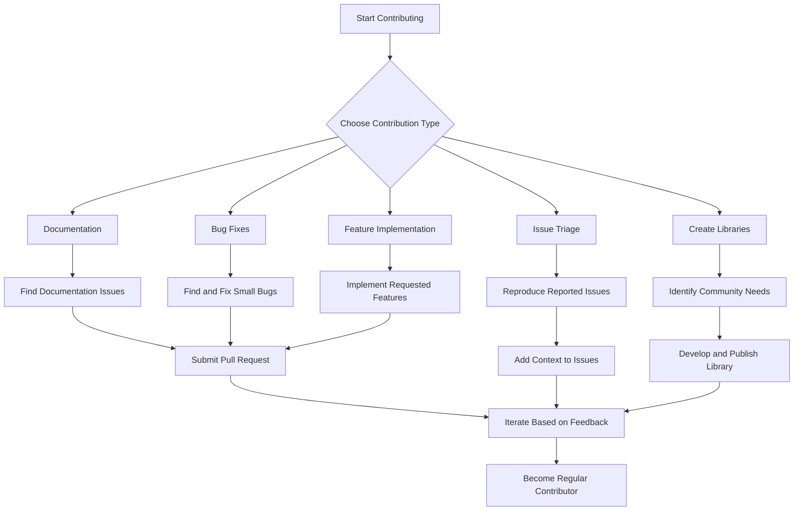

## Section 4: Next Steps in Your React Native Journey

Now that you've completed this comprehensive React Native course, let's explore the various paths and opportunities available to continue your growth as a React Native developer.

### Career Paths in React Native Development

React Native skills open up numerous career opportunities in the mobile development ecosystem. Here are some of the paths you might consider:

#### Mobile Application Developer

As a React Native developer, you can build cross-platform mobile applications for various domains:

- **Corporate Enterprise Apps:** Internal tools for business operations
- **Consumer-Facing Products:** Apps distributed through app stores
- **Healthcare Applications:** Including telemedicine and patient management
- **E-commerce Platforms:** Shopping experiences and marketplace apps
- **Social Networks:** Community and social media applications
- **Educational Tools:** Learning platforms and educational resources
- **Entertainment Apps:** Games, streaming services, and content platforms

The demand for React Native developers continues to grow as more companies adopt cross-platform development to reduce costs and accelerate development cycles.

> 🧑‍🏫 **(Instructor-Led):** Consider inviting a professional React Native developer as a guest speaker to share their real-world experiences and answer questions about career paths.

#### Specialized Technical Roles

Beyond general application development, you might specialize in specific technical areas:

- **UI/UX Developer:** Focus on creating polished, responsive user interfaces with advanced animations
- **Performance Optimization Specialist:** Help teams diagnose and resolve performance bottlenecks
- **Integration Expert:** Bridge React Native with native modules and third-party services
- **DevOps Engineer:** Specialize in React Native CI/CD pipelines, build processes, and deployment
- **Accessibility Specialist:** Ensure applications are usable by people with diverse abilities
- **Technical Architect:** Design system architectures for complex React Native applications

These specialized roles often emerge as you gain experience and develop expertise in specific aspects of React Native development.

#### Technology Leadership

With experience, you might advance into leadership positions:

- **Lead Developer:** Guide technical implementation and mentor junior developers
- **Mobile Technical Lead:** Oversee multiple mobile projects, potentially including native apps
- **Engineering Manager:** Manage teams of developers across various technologies
- **Chief Technology Officer:** Shape overall technical vision and strategy
- **Technical Product Manager:** Bridge the gap between business requirements and technical implementation

Leadership roles typically require a combination of technical expertise, communication skills, and business understanding.

### Building Your Professional Portfolio

A strong portfolio is essential for showcasing your React Native skills to potential employers or clients. Here's how to build an effective portfolio:

#### Refining Your Capstone Project

Your SpeedyMeds project already serves as an excellent portfolio piece. Consider enhancing it further:

1. **Polish the UI:** Refine animations, transitions, and visual details
2. **Improve code quality:** Add comprehensive tests, refactor for clarity, and add detailed documentation
3. **Expand functionality:** Add one or two standout features that showcase your creativity
4. **Deploy to app stores:** Complete the submission process to demonstrate your ability to ship production apps
5. **Create a case study:** Document your process, challenges, and solutions

> [!TIP]
> When presenting your capstone project in your portfolio, focus on both the technical implementation details and the problem-solving approach you took. Employers value the thinking behind your code as much as the code itself.

#### Developing Additional Projects

To demonstrate versatility, consider building 2-3 additional React Native projects:

- **Open Source Contribution:** Fork an existing library to add features or fix bugs
- **Side Project:** Build something that addresses a personal need or interest
- **Clone Project:** Recreate a popular app's UI and core functionality
- **Hackathon Project:** Participate in a hackathon to build something innovative quickly
- **Experimental Project:** Explore cutting-edge React Native features or libraries

Each project should highlight different skills and demonstrate your ability to work with various aspects of React Native development.

#### Creating a Developer Presence

Establish your presence as a React Native developer through:

1. **GitHub Profile:** Maintain a clean, well-documented GitHub profile with your projects
2. **Personal Website:** Create a portfolio site highlighting your projects and skills
3. **Technical Blog:** Write articles about React Native challenges and solutions
4. **Social Media:** Engage with the React Native community on Twitter, LinkedIn, etc.
5. **Speaker Opportunities:** Present at local meetups or online events

> ⚛️ **(React Developers):**
>
> **Comparison:** While web React development often emphasizes CSS skills and browser compatibility, React Native portfolios should showcase your understanding of mobile UX patterns, performance optimization for resource-constrained devices, and navigation paradigms specific to mobile.
>
> **Key Takeaway:** Make sure your portfolio demonstrates mobile-specific considerations, not just your ability to translate web React concepts to React Native.
>
> **Source:** [React Native at Scale](https://reactnative.dev/showcase)

### Professional Growth Strategies

Continuous learning and professional development are essential in the rapidly evolving React Native ecosystem.

#### Mentorship and Community Involvement

Accelerate your growth through:

- **Finding a Mentor:** Connect with experienced React Native developers for guidance
- **Becoming a Mentor:** Help newcomers to reinforce your own knowledge
- **Community Contributions:** Answer questions on Stack Overflow or GitHub issues
- **Code Reviews:** Seek and provide code reviews to improve code quality
- **Pair Programming:** Collaborate with others to learn different approaches

> 🧗‍♀️ **(Self-Led):** Consider joining an online community specifically for peer learning, such as Dev.to, CodeNewbie, or specialized Discord servers where developers regularly share work for feedback.

#### Skill Expansion Areas

To become a more well-rounded React Native developer, consider expanding your skills in these complementary areas:

1. **Native Development Basics:**

   - **iOS:** Learn Swift fundamentals to better understand the iOS platform
   - **Android:** Explore Kotlin basics to comprehend Android-specific behaviors

2. **Backend Development:**

   - **Node.js:** Create backends that work seamlessly with React Native
   - **GraphQL:** Implement efficient data fetching for mobile apps
   - **Firebase:** Utilize Backend-as-a-Service for rapid prototyping

3. **Design Skills:**

   - **UI Design Principles:** Learn basic design theory for more polished interfaces
   - **Prototyping Tools:** Use Figma or Sketch to plan app interfaces
   - **Animation Design:** Create compelling motion designs for your apps

4. **DevOps Knowledge:**

   - **CI/CD Pipelines:** Automate testing and deployment
   - **App Store Optimization:** Improve discoverability of your apps
   - **Analytics Integration:** Track user behavior and app performance

5. **Business Understanding:**
   - **Product Management:** Learn to prioritize features and understand user needs
   - **Estimation:** Develop skills in accurately scoping development time
   - **Client Communication:** Effectively translate technical concepts for non-technical stakeholders

> [!NOTE]
> You don't need to master all these areas. Even a foundational understanding of complementary skills can significantly enhance your effectiveness as a React Native developer and open up new opportunities.

### Contributing to the React Native Ecosystem

The React Native community thrives on contributions from developers at all levels. Here's how you can get involved:

#### Open Source Contributions

Start with small contributions and gradually tackle larger issues:

1. **Documentation Improvements:** Fix typos, clarify examples, or add missing information
2. **Issue Triage:** Help reproduce and clarify reported issues
3. **Bug Fixes:** Address small bugs in libraries you use regularly
4. **Feature Implementation:** Add new features to existing libraries
5. **Create Libraries:** Develop and share your own React Native packages

The above diagram illustrates potential pathways for contributing to the React Native ecosystem, from documentation improvements to creating your own libraries.

Making open source contributions not only helps the community but also enhances your visibility as a developer and deepens your understanding of the technology.

#### Choosing Where to Contribute

Consider these React Native ecosystem projects for contributions:

- **[React Native Core](https://github.com/facebook/react-native):** The main repository
- **[React Native Community](https://github.com/react-native-community):** Official community-maintained packages
- **[Expo](https://github.com/expo/expo):** The Expo platform and its modules
- **[React Navigation](https://github.com/react-navigation/react-navigation):** Navigation library
- **[React Native Paper](https://github.com/callstack/react-native-paper):** Material Design components
- **[React Native Elements](https://github.com/react-native-elements/react-native-elements):** Cross-platform UI toolkit
- **[React Native Reanimated](https://github.com/software-mansion/react-native-reanimated):** Animation library

> [!IMPORTANT]
> Before making significant contributions, always check the project's contribution guidelines and engage with the maintainers. Many projects have specific code style requirements, test expectations, and procedures for submitting pull requests.

### Staying Current in a Rapidly Evolving Ecosystem

The React Native ecosystem evolves quickly. Develop habits that help you stay current:

#### Establishing a Learning Routine

Create a sustainable system for ongoing learning:

1. **Weekly Reading:** Allocate time to read blog posts, newsletters, and release notes
2. **Monthly Deep Dives:** Explore one new library or concept in depth each month
3. **Quarterly Projects:** Build small projects to experiment with new techniques
4. **Annual Reflection:** Assess your skills and knowledge gaps, then plan focused learning

> 🛣️ **(All Learners):** Create calendar reminders for your learning routine to ensure consistency. Treat these learning blocks with the same importance as work meetings or personal commitments.

#### Tracking Ecosystem Changes

Monitor these key areas for significant developments:

- **React Native Releases:** Major versions introduce important changes and deprecations
- **Expo SDK Updates:** New capabilities and best practices for the Expo ecosystem
- **React Updates:** Core React changes often influence React Native development
- **JavaScript/TypeScript Evolution:** Language features can improve your code quality
- **Native Platform Changes:** iOS and Android updates may affect your applications

### Planning Your Next Application

Put your skills into practice by planning your next React Native project:

1. **Define Your Goals:** Determine whether you're building for learning, portfolio enhancement, or solving a real problem
2. **Choose an Application Domain:** Select a domain that interests you or aligns with your career goals
3. **Map Core Features:** Outline the essential functionality your app will provide
4. **Select Your Tech Stack:** Choose appropriate libraries and tools based on your requirements
5. **Create a Development Plan:** Break down the implementation into manageable phases
6. **Set a Timeline:** Establish realistic deadlines to maintain momentum
7. **Launch Strategy:** Determine how you'll share or distribute your application

> 📲 **(Native Developers):**
>
> **Comparison:** While native development often begins with platform-specific considerations and then moves to UI implementation, React Native projects typically start with cross-platform components and only diverge when necessary for platform-specific behavior.
>
> **Key Takeaway:** Plan your architecture to maximize shared code while identifying early where platform-specific implementations might be needed.
>
> **Source:** [React Native Architecture Overview](https://reactnative.dev/architecture/overview)

### The Ongoing Journey

Remember that becoming an expert React Native developer is a continuous journey, not a destination. Every project, challenge, and bug you encounter is an opportunity to deepen your understanding and expand your skills.

As you progress in your React Native journey, you'll likely cycle between periods of:

- **Learning:** Absorbing new concepts and techniques
- **Building:** Applying knowledge to create applications
- **Refining:** Improving your code quality and approach
- **Sharing:** Contributing back to the community
- **Exploring:** Discovering new areas within the ecosystem

This cycle keeps your skills fresh and your perspective evolving along with the technology.

> [!TIP]
> Maintain a "learning log" documenting challenges you've overcome, techniques you've mastered, and concepts you're still exploring. Reviewing this periodically provides valuable perspective on your growth and helps identify patterns in your learning.

### Conclusion

You've completed a comprehensive journey through React Native development, from fundamental concepts to advanced techniques. The skills you've acquired provide a solid foundation for building sophisticated cross-platform mobile applications and continuing your professional growth in this exciting field.

As you move forward, remember that the most successful developers maintain a balance of technical depth, practical application, and community engagement. By continuing to learn, build, and share, you'll not only advance your own career but also contribute to the vibrant ecosystem that makes React Native such a powerful platform for mobile development.

> 📚 **Official Documentation:**
>
> - [React Native Contributing Guide](https://reactnative.dev/docs/contributing)
> - [Expo Contributing Guide](https://github.com/expo/expo/blob/main/CONTRIBUTING.md)
> - [React Native Community Guidelines](https://github.com/react-native-community/discussions-and-proposals)
